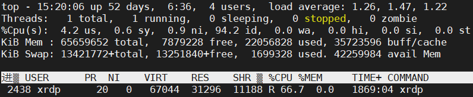
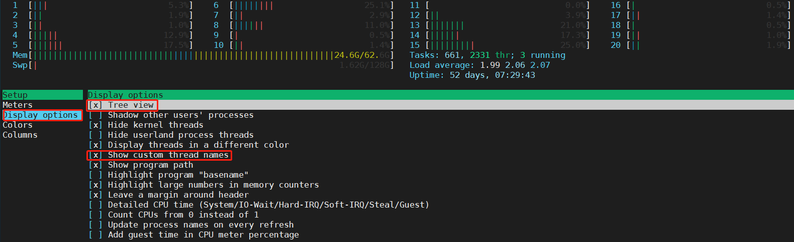

# Linux 基础-查看进程命令 ps 和 top
### 1，使用 ps 命令找出 CPU 占用高的进程
`ps` 是 进程状态 `(process status)` 的缩写，它能显示系统中活跃的/运行中的进程的信息。它提供了当前进程及其详细信息，诸如用户名、用户 `ID`、`CPU` 使用率、内存使用、进程启动日期时间、命令名等等的快照。只打印命令名字而不是命令的绝对路径，以运行下面的格式 ps 命令：

```bash
~$ ps -eo pid,ppid,%mem,%cpu,comm --sort=-%cpu | head
```
运行结果如下：


上面命令语句的各部分参数解释：

* `ps`：命令名字
* `-e`：选择所有进程
* `-o`：自定义输出格式
* `–sort=-%cpu`：基于 CPU 使用率对输出结果排序
* `head`：显示结果的前 10 行
* `PID`：进程的 ID
* `PPID`：父进程的 ID
* `%MEM`：进程使用的 RAM 比例
* `%CPU`：进程占用的 CPU 比例
* `Command`：进程名字

### 2，通过 top 命令定位占用 cpu 高的进程
* 查看 `cpu` 占用最高进程（查看前3位）：`top`，然后按下 `M`（大写 `M`）。
* 查看内存占用最高进程：`top`，然后按下 `P`（大写 `P` ）。
* 可视化查看所有用户所有进程使用情况：`ps axf`。

在所有监控 `Linux` 系统性能的工具中，`Linux` 的 `top` 命令是最好的也是最知名的一个（`htop` 是其升级版）。`top` 命令提供了 `Linux` 系统运行中的进程的动态实时视图。它能显示系统的概览信息和 `Linux` 内核当前管理的进程列表。它显示了大量的系统信息，如 `CPU` 使用、内存使用、交换内存、运行的进程数、目前系统开机时间、系统负载、缓冲区大小、缓存大小、进程 `PID` 等等。默认情况下，`top` 命令的输出结果按 `CPU` 占用进行排序，每 `5` 秒中更新一次结果。

```bash
ps -ef                 # 查看所有进程
top                    # 实时显示进程状态
```
`Linux` 系统下执行 `top` 命令得到以下结果（第一列为进程的 `PID`，第二列为进程所属用户）：


**上图各个参数的意义：**

* `PID`：进程的ID
* `USER`：进程所有者
* `PR`：进程的优先级别，越小越优先被执行
* `NInice`：值
* `VIRT`：进程占用的虚拟内存
* `RES`：进程占用的物理内存
* `SHR`：进程使用的共享内存
* `S`：进程的状态。S表示休眠，R表示正在运行，Z表示僵死状态，N表示该进程优先值为负数
* `%CPU`：进程占用CPU的使用率
* `%MEM`：进程使用的物理内存和总内存的百分比
* `TIME+`：该进程启动后占用的总的CPU时间，即占用CPU使用时间的累加值。
* `COMMAND`：进程启动命令名称

通过上图可以看出排在一行的进程 `PID` 2438占用 `cpu` 过高，定位到了进程 `id`。如果只想观察 进程`PID` 2438的 `CPU`和内存以及负载情况，可以使用以下命令：

```bash
top -p 2438
```
结果如下：


还可以通过 `top` 命令定位问题进程中每个`线程`占用 `cpu` 情况，如查看进程 `PID` 2438 的**每一个线程**占用 cpu 的情况，使用如下命令：

```bash
top -p 2438 -H
```
结果如下（单线程，所以只显示一行）：



### 3，htop 系统监控与进程管理软件
与 `top` 只提供最消耗资源的进程列表不同，`htop` 提供所有进程的列表，并且使用彩色标识出处理器、`swap` 和内存状态。可以通过 `htop` 查看单个进程的线程，然后按 `<F2>` 来进入 `htop` 的设置菜单。选择“设置”栏下面的“显示选项”，然后开启“树状视图”和“显示自定义线程名”选项。按 `<F10>` 退出设置。




## 4，参考资料
[线上linux系统故障排查之一：CPU使用率过高](https://www.jianshu.com/p/6d573e42310a)