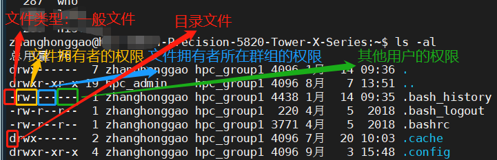
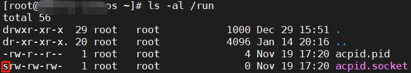
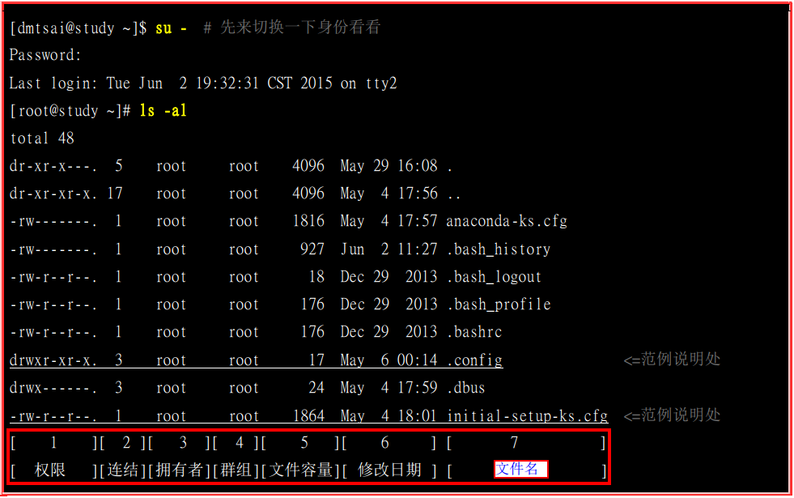
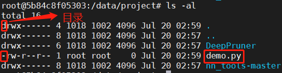
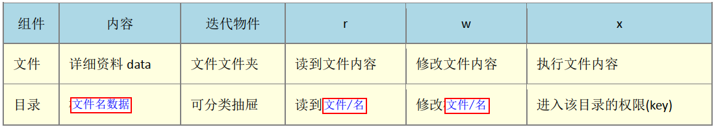

- [一，文件类型](#一文件类型)
  - [1.1，概述](#11概述)
  - [1.2，正规文件(regular file)](#12正规文件regular-file)
  - [1.3，目录(directory)](#13目录directory)
  - [1.4，链接文件(link)](#14链接文件link)
  - [1.5，设备与装置文件(device)](#15设备与装置文件device)
  - [1.6，资料接口文件(sockets)：](#16资料接口文件sockets)
  - [1.7，数据输送文件(FIFO, pipe)：](#17数据输送文件fifo-pipe)
  - [1.8，文件拓展名](#18文件拓展名)
- [二，文件属性与权限](#二文件属性与权限)
  - [2.1，Linux 文件属性](#21linux-文件属性)
  - [2.2，Linux 文件权限](#22linux-文件权限)
  - [2.3，如何改变文件属性和权限](#23如何改变文件属性和权限)
  - [2.4，文件与目录的权限意义](#24文件与目录的权限意义)
- [三，Linux 文件属性与权限总结](#三linux-文件属性与权限总结)
- [四，参考资料](#四参考资料)

> Linux 系统由 Linux 内核、shell、文件系统和第三方应用软件组成。Linux 文件权限与属性是学习 Linux 系统的一个重要关卡，必须理解这个部分内容的概念。

## 一，文件类型
- [一，文件类型](#一文件类型)
  - [1.1，概述](#11概述)
  - [1.2，正规文件(regular file)](#12正规文件regular-file)
  - [1.3，目录(directory)](#13目录directory)
  - [1.4，链接文件(link)](#14链接文件link)
  - [1.5，设备与装置文件(device)](#15设备与装置文件device)
  - [1.6，资料接口文件(sockets)：](#16资料接口文件sockets)
  - [1.7，数据输送文件(FIFO, pipe)：](#17数据输送文件fifo-pipe)
  - [1.8，文件拓展名](#18文件拓展名)
- [二，文件属性与权限](#二文件属性与权限)
  - [2.1，Linux 文件属性](#21linux-文件属性)
  - [2.2，Linux 文件权限](#22linux-文件权限)
  - [2.3，如何改变文件属性和权限](#23如何改变文件属性和权限)
  - [2.4，文件与目录的权限意义](#24文件与目录的权限意义)
- [三，Linux 文件属性与权限总结](#三linux-文件属性与权限总结)
- [四，参考资料](#四参考资料)

### 1.1，概述

一个基本概念：任何装置在 Linux 下都是文件，数据沟通的接口也有专属的文件在负责，Linux 的文件种类繁多，常用的是一般文件(`-`)与目录文件(`d`)。
注意：`Linux` 文件类型和文件的文件名所代表的意义是两个不同的概念，在 `linux` 中文件类型与文件扩展名没有关系。它不像 `Windows` 那样是依靠文件后缀名来区分文件类型的，在 `linux` 中文件名只是为了方便操作而的取得名字。`Linux` 文件类型常见的有：**普通文件、目录、字符设备文件、块设备文件、符号链接文件**等。
查看文件类型方法，使用 `ls -al` 命令列出的信息中第一栏十个字符中，第一个字符为文件的类型。



### 1.2，正规文件(regular file)

就是一般我们在进行存取的类型的文件，在由 `ls -al` 所显示出来的属性方面，第一个字符为 `-`，例如 `-rwxrwxrwx`。另外，依照文件的内容，又大略可以分为：

* 纯文本档(`ASCII`)：Linux 系统中最为常见的一种文件类型，称为纯文本是因为文件内容为人类可以直接读取到的数据，例如数字、字母等。
* 二进制文件(`binary`)：Linux 系统仅认识且可以执行的二进制文件 binary file，Linux 系统中可执行的文件就是这种类型，例如 cat 就是一个 binary file。
* 数据格式文件(`data`)： 有些程序在运作的过程当中会读取某些特定格式的文件，那些特定格式的文件可以被称为数据文件 (`data file`)。举例来说，我们的 Linux 在使用者登入时，都会将登录的数据记录在 `/var/log/wtmp` 文件内，该文件是一个 `data file`，它能够通过 `last` 这个指令读出来，但是使用 `cat` 命令读取时会读出乱码，因为他是属于一种特殊格式的文件。

### 1.3，目录(directory)
第一个属性为 `d`，例如 `drwx------`。


### 1.4，链接文件(link)
类似 Windows 系统下的快捷键，第一个属性为 `l`，例如 `lrwxrwxrwx`。

### 1.5，设备与装置文件(device)
与系统周边设备及存储相关的一些文件，通常集中在 `/dev` 目录下，一般分为两种：

* 区块(block)设备类型：就是一些储存数据， 以提供系统随机存取的接口设备，比如硬盘设备，第一个属性为 `b`。
* 字符(character)设备文件：一些串行端口的接口设备，例如键盘、鼠标、摄像头等。这些设备的特性是\*\*一次性读取"，不能够截断输出，第一个属性为 `c`。

### 1.6，资料接口文件(sockets)：
被用于网络上的数据连接了。我们可以启动一个程序来监听客户端的要求， 而客户端就可以透过这个 `socket` 来进行数据的沟通了。第一个属性为 `s`，最常在 `/run` 或 `/tmp` 这些目录中可以看到这种文件类型。



### 1.7，数据输送文件(FIFO, pipe)：
`FIFO` 也是一种特殊的文件类型，他主要的目的在解决多个程序同时存取一个文件所造成的错误问题。`FIFO` 是 `first-in-first-out` 的缩写。第一个属性为 `p`。

### 1.8，文件拓展名
**注意 Linux 系统的文件是没有所谓的拓展名的**。 一个 Linux 文件能不能被执行，与他的 `ls -al` 展示的文件信息的**第一栏的十个属性**有关， 与文件名根本一点关系也没有，这与 Windows 不同，在Linux 系统下，只要用户的权限有 `x`，文件就可以被执行。拥有了 `x` 权限，表示文件可以被执行，但是只有具有可执行的程序代码文件才能被执行，文本等文件即使有权限也是不能执行成功的。

## 二，文件属性与权限
### 2.1，Linux 文件属性
`ls -al` 命令：列出所有的文件详细的权限与属性 (包含隐藏文件-文件名第一个字符为『 `.` 』的文件)。 `ls -al` 展示的文件属性信息如下：



* 第一列代表这个文件的类型与权限(permission)；第一列的第一个字符代表这个文件是『目录、 文件或链接文件等等文件类型』：
   * 当为 `d` 则是目录，例如上图文件名为『.config』的那一行；
   * 当为 `-` 则是文件，例如上图文件名为『initial-setup-ks.cfg』那一行；
   * 若是 `l` 则表示为链接文件(link file)；
   * 若是 `b` 则表示为装置文件里面的可供储存的接口设备(可随机存取装置)；
   * 若是 `c` 则表示为装置文件里面的串行端口设备，例如键盘、鼠标(一次性读取装置)。
* 第二列表示有多少文件名连结到此节点(i-node)；
* 第三列表示这个文件(或目录)的『**拥有者账号**』；
* 第四列表示这个文件的**所属群组**；
* 第五列为这个文件的**容量大小**，默认单位为 `bytes`；
* 第六列为这个文件的建档日期或者是最近的修改日期；
* 第七列为这个文件的文件名。

`ls -al` 命令展示的文件属性的七个字段的意义很重要，必须理解和熟记，这是掌握 `Linux` 文件权限与目录管理的基础知识。

### 2.2，Linux 文件权限
Linux 文件的基本权限就有九个，分别是 `owner/group/others` 三种身份各有自己的 `read/write/execute` 权限。在 Linux 中，对于文件的权限（`rwx`），分为三部分，**第一部分是该文件的拥有者所拥有的权限，第二部分是该文件所在用户组的用户所拥有的权限，最后一部分是其他用户所拥有的权限**。
每个文件/文件夹的属性都用 `10` 个字符表示，第一个字符如果是 `d`：表示文件夹，如果是 `-`：表示文件。用（`rwx`）表示文件权限，其中`r`: 可读`（4）`，`w`: 可写`（2）`，`x`: 可执行（`1`）。举例，`drwxr-xrw-` 表示文件夹拥有者拥有可读可写可执行的权限，**用户所在用户组和其他用户无任何权限**，命令的详细解释如下。

* 从第二到第四位 `(rwx) ` 是文件所有者的权限：可读、可写、可执行。
* 从第五到第七位 `(r-x)` 文件夹用户拥有者所在组的权限：可读、可执行。
* 从第八位到第十位 `(rw-)` 其他人对这个文件夹操作的权限.：可读、可写。

`Linux` 系统查看文件/目录权限示例，如下：

```bash
root@5b84c8f05303:/data/project# ls -al
total 16
drwx------ 4 1018 1002 4096 Jul 20 02:59 .
drwx------ 8 1018 1002 4096 Jul 20 02:57 ..
drwx------ 6 1018 1002 4096 Jul 20 02:57 DeepPruner
-rw-r--r-- 1 root root    0 Jul 20 02:59 demo.py
drwx------ 8 1018 1002 4096 Jul 20 02:57 nn_tools-master
```


### 2.3，如何改变文件属性和权限
`Linux/Unix` 是多人多工操作系统，所有的文件皆有拥有者。利用 `chown` 命令可以改变文件的拥有者(用户)和群组，用户可以是用户名或者`用户 ID`，组可以是组名或者`组 ID`。**注意，普通用户不能将自己的文件改变成其他的拥有者，其操作权限一般为管理员(****root**** 用户)**；同时用户必须是已经存在系统中的账号，也就是在 `/etc/passwd` 这个文件中有纪录的用户名称才能改变。

三个常用于群组、拥有者、各种身份的权限之修改的命令，如下所示：

* `chown` : 改变文件的拥有者。如递归子目录修改命令： `chown -R user_name folder/`
* `chgrp` : 改变文件所属群组。
* `chmod` : 改变文件读、写、执行权限(权限分数 `r:4 w:2 x:1`)属性。如增加脚本可执行权限命令： `chmod a+x myscript` 。

添加用户和用户组的命令：`adduser` `groupadd`，其简单用法如下所示：

* `adduser harley`：新建 harley 用户
* `passwd harley`：给 harley 用户设置密码
* `groupadd harley`：新建 harley工作组
* `useradd -g harley harley`：新建 harley 用户并增加到 harley 工作组

**改变所属群组 chgrp/chown/chmod 命令的用法如下**：

```bash
$ chgrp [-R] group dirname/filename  # -R : 进行递归(recursive)的持续变更，亦即连同子目录下的所有文件、目录都更新成为这个群组之意。
$ chown [-R] 账号名称 文件或目录
$ chown [-R] 账号名称:组名 文件或目录
$ chmod [-R] xyz 文件或目录  # xyz : 数字类型的权限属性分数值， 为 rwx 属性数值的相加。
```
`chgrp` 范例：将 `test` 的工作组从 `harley` 改为 `root`（前提是当前用户切换为 `root` 了，否则会提示权限不足的错误）：


`chmod` 范例：将 `.bashrc` 这个文件所有的权限都设定启用。

```bash
root@17c30d837aba:~# ls -al .bashrc
-rw-r--r-- 1 root root 3479 Jan  8 03:14 .bashrc
root@17c30d837aba:~# chmod 777 .bashrc
root@17c30d837aba:~# ls -al .bashrc
-rwxrwxrwx 1 root root 3479 Jan  8 03:14 .bashrc
```
### 2.4，文件与目录的权限意义
我们可以利用 `ls -al` 命令查看文件属性及权限，已知了 `Linux` 系统内文件的三种身份(拥有者、群组与其他人)，每种身份都有三种权限(`rwx`)，再使用 `chown`, `chgrp`, `chmod` 去修改这些权限与属性。
**文件是实际含有数据的地方**，包括一般文本文件、数据库内容文件、二进制可执行文件(binary program)等等。因此，权限对于文件来说，他的意义是这样的：

* `r (read)`：可读取此一文件的实际内容，如读取文本文件的文字内容等；
* `w (write)`：可以编辑、新增或者是修改该文件的内容(但不含删除该文件)；
* `x (eXecute)`：该文件具有可以被系统执行的权限。Linux 底下， 文件是否能被执行，是由 `x` 这个权限来决定的！跟文件名是没有绝对的关系，即使是能够执行成功的 `.sh` 脚本文件，如果没有 `x` 可执行权限，文件也不能被执行。

**目录主要的内容是记录文件名列表**，文件名与目录有强烈的关连。对一般文件来说，` rwx` 主要是针对『文件的内容』来设计权限，对目录来说， `rwx` 则是针对『目录内的文件名列表』来设计权限。权限对文件和目录重要性的理解汇总成如下表格：



## 三，Linux 文件属性与权限总结
利用 `ls -al` 命令查看文件属性及权限，已知了 `Linux` 系统内**文件的三种身份**(文件拥有者、文件所属群组与其他用户)，**每种身份都有四种权限**(`rwxs`)。可以使用 `chown`, `chgrp`, `chmod` 去修改这些权限与属性。文件是实际含有数据的地方，包括一般文本文件、数据库内容文件、二进制可执行文件(binary program)等等。

## 四，参考资料
《鸟哥的Linux私房菜 基础篇 第四版》