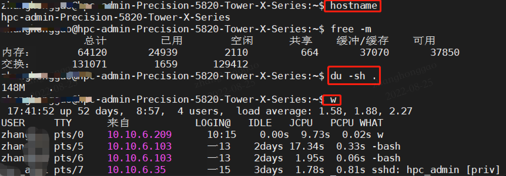

使用 `Linux` 系统的过程中，我们经常需要查看**系统、资源、网络、进程、用户**等方面的信息，查看这些信息的常用命令值得了解和熟悉。

1，**系统**信息查看常用命令如下：

```bash
uname -m && cat /etc/*release # 查询 linux 服务器当前运行环境的操作系统架构及版本
lsb_release -a         # 查看操作系统版本(裁剪版不一定支持) 
cat /etc/os-release    # 查看操作系统版本 (适用于所有的linux，包括Redhat、SuSE、Debian等发行版，但是在debian下要安装lsb)   
cat /proc/cpuinfo      # 查看CPU信息
hostname               # 查看计算机名
lsusb -tv              # 列出所有USB设备
env                    # 查看环境变量
```
2，**资源**信息查看常用命令如下：

```bash
free -h                # 将内存大小以人类可读的形式显示出来（单位GB）
df -h                  # 查看各分区使用情况
df -hT                # 查看硬盘使用情况
du -sh <目录名>        # 查看指定目录的大小
uptime                 # 查看系统运行时间、用户数、负载
```
3，**网络**信息查看常用命令如下

```bash
ifconfig               # 查看所有网络接口的属性
route -n               # 查看路由表
```
4，**进程**信息查看常用命令如下

```bash
ps -ef                 # 查看所有进程
top                    # 实时显示进程状态
```
5，**用户**信息查看常用命令如下

```bash
w                      # 查看活动用户
id <用户名>            # 查看指定用户信息
last                   # 查看用户登录日志
cut -d: -f1 /etc/passwd   # 查看系统所有用户
cut -d: -f1 /etc/group    # 查看系统所有组
crontab -l             # 查看当前用户的计划任务
```


更多命令及理解，参考此[链接](https://blog.csdn.net/bluishglc/article/details/41390589)。

6，**查看操作系统、框架、库以及工具版本命令汇总**：

```bash
cat /etc/os-release # 适合所有linux系统，查看操作系统版本，显示信息比较全
cat /etc/issue # 该命令适用于所有Linux系统，显示的版本信息较为简略，只有系统名称和对应版本号。
uname -a # 显示系统详细信息，包括内核版本号、硬件架构等
cat /proc/version # 查看linux 内核
nvcc -V # 查看 cuda 版本
cat /usr/local/cuda/version.txt # 没有安装 nvcc 条件用
cat /usr/local/cuda/include/cudnn.h | grep CUDNN_MAJOR -A 2 # 查看cudnn版本
find / -name NvInferVersion.h && cat /usr/local/cuda-11.0/targets/x86_64-linux/include/NvInferVersion.h | grep NV_TENSORRT # 查看cudnn版本通用
gcc -v # 查看 gcc 版本
cmake -version # 查看 cmake 版本
pkg-config --modversion opencv # 查看 opencv 版本
ffmpeg -version # 查看 ffmpeg 版本
```

`uname` 命令是用于显示系统信息的命令。它通常用于获取操作系统的一些基本信息。`uname -a` 这将显示包括内核名称、版本、硬件架构等在内的详细信息。uname 命令在 Linux 和类 Unix 系统上都是可用的。

### 参考资料
[怎么查看Linux服务器硬件信息，这些命令告诉你](https://zhuanlan.zhihu.com/p/144368206)