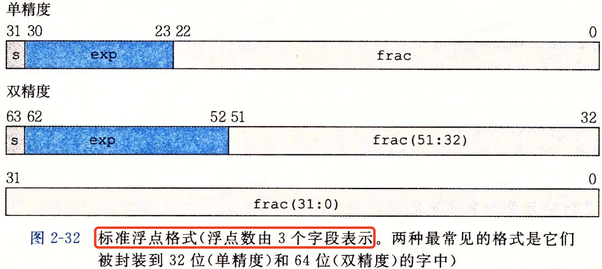
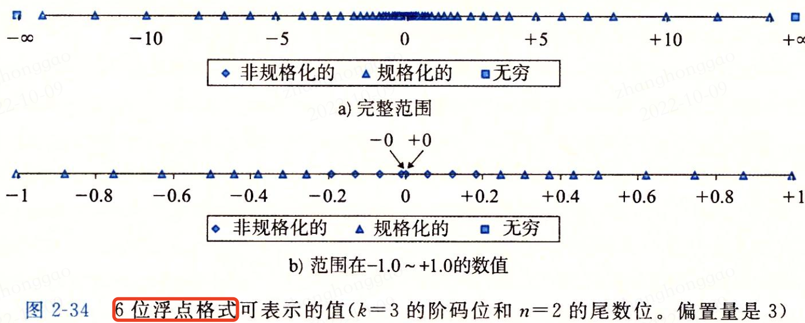
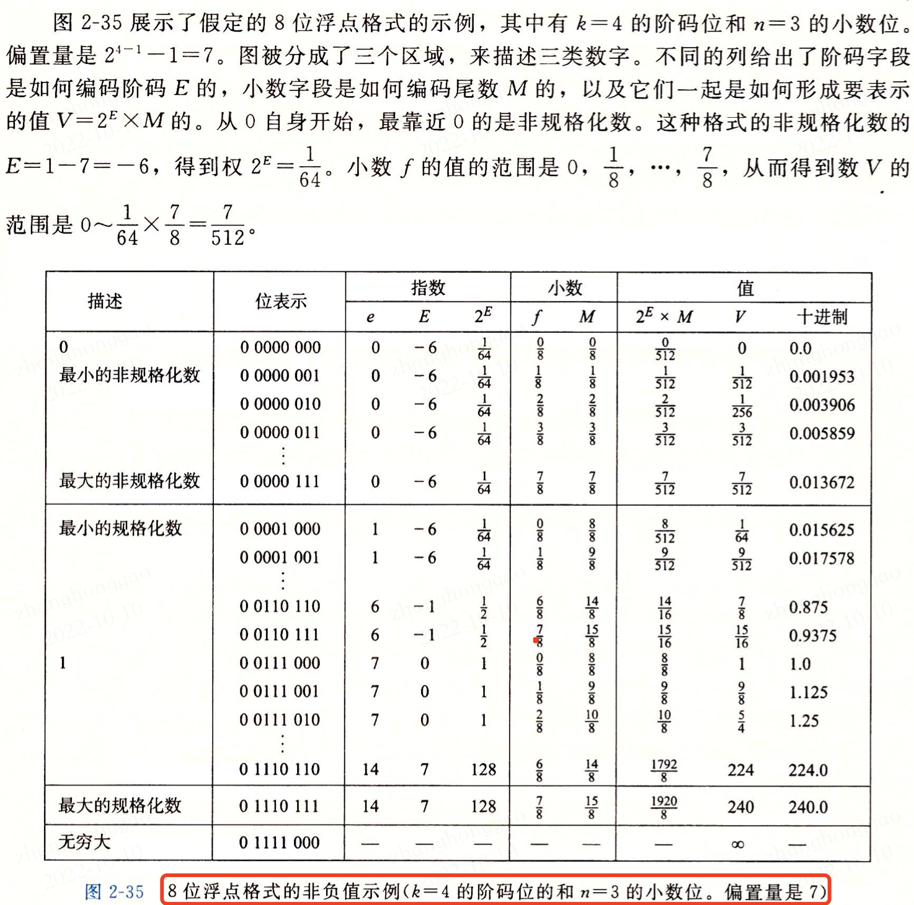

- [1，信息存储](#1信息存储)
  - [1.1，十六进制表示法](#11十六进制表示法)
  - [1.2，字数据大小](#12字数据大小)
  - [1.3，寻址和字节顺序](#13寻址和字节顺序)
- [2，整数表示](#2整数表示)
- [3，整数运算](#3整数运算)
- [4，浮点数](#4浮点数)
  - [4.1，二进制小数](#41二进制小数)
  - [4.2，IEEE 浮点表示](#42ieee-浮点表示)
  - [4.3，浮点数的规格化](#43浮点数的规格化)
  - [4.4，数字示例](#44数字示例)
  - [4.5，浮点数的数值范围](#45浮点数的数值范围)
- [参考资料](#参考资料)

> 关于程序的结构和执行，我们需要考虑机器指令如何操作整数和实数数据，以及编译器如何将 C 程序翻译成这样的指令。

现代计算机存储和处理信息是用二进制（二值信号）表示的，因为二值信号更容易表示、存储和传输，如导线上的高电压和低电压。

## 1，信息存储
大多数计算机使用字节（`byte`），作为最小的可寻址的内存单位，而不是访问内存中单独的位。机器级程序将内存视为一个非常大的字节数组，称为**虚拟内存**（`virtual memory`），内存中的每个字节都由一个唯一的数字来表示，称为它的地址（`address`），所有可能地址的集合称为**虚拟地址空间**（`virtual address space`）。简而言之，这个虚拟地址空间只是一个展现给机器级程序的概念性映像，实际的实现是将动态随机访问存储器（`DRAM`）、闪存、磁盘存储器、特殊硬件和操作系统软件结合起来，为程序提供一个看上去统一的字节数组。

### 1.1，十六进制表示法
一个字节由 8 位组成，在二进制表示法中，它的值域是 $00000000_2\sim 11111111_{2}$，如果看成十进制整数，它的值域则是 $0_{10}\sim 255_{10}$。在 C 语言中，以 0x 或 0X 开头的数字常量被认为是十六进制的值。

### 1.2，字数据大小
每台计算机都有一个字长（`word size`），说明指针数据的标称大小（`nominal size`），字长决定的最重要的系统参数就是虚拟地址空间的最大大小，即对于一个字长$w$位的机器而言，虚拟地址的范围为 $0\sim 2^{w}-1$，程序最多访问 $2^{w}$个字节。

### 1.3，寻址和字节顺序
**对于跨越多个字节的程序对象，我们必须建立两个规则: 这个对象的地址是什么，以及内存中如何排列这些字节**。对象的存储有两个通用的规则:

* **小端法**（little endian）: 在内存中选择按照从变量最低有效字节（更小数值的那部分）到最高有效字节的顺序存储对象，即最低有效字节在最前面的方式。
* **大端法**（big endian）: 在内存中选择按照从最高有效字节到最低有效字节的顺序存储对象，即最高有效字节在最前面的方式。

如下图所示，对于变量 $x$，假设其存储地址为 0x100，其十六进制值为 0x1234567，如果存储方式是小端法，那么内存中的存储顺序为 67、45、23、01（对应内存地址是0x100, 0x101, 0x102, 0x103），如果存储方式是大端法，那么内存中的存储顺序为 01、23、45、67。

## 2，整数表示

略

## 3，整数运算

略

## 4，浮点数

IEEE 754 标准用来表示计算机系统中的浮点数定义，即浮点数规则都遵从 IEEE 754 标准。

### 4.1，二进制小数
理解浮点数的第一步是考虑含有**小数值**的二进制数字，其表示方法如下:
$$b = \sum_{i=-n}^{m} 2^{i} \times b_{i}$$

符号 . 现在变成了二进制的点，**点左边的位的权是 2 的正幂，点右边的位的权是 2 的负幂**。小数的二进制幂表示如下图所示。

### 4.2，IEEE 浮点表示
定点表示法不能有效地表示非常大的数字。IEEE 标准 754，浮点表示用 $V = (-1)^s \times M \times 2^E$表示一个数:

在 IEEE 754 标准中浮点数由三部分组成：**符号位（sign bit），有偏指数（biased exponent），小数（fraction）**。浮点数分为两种，单精度浮点数（single precision）和双精度浮点数（double precision），它们两个所占的位数不同。

* 在单精度浮点格式（C 语言的 `float`）中，符号位，`8` 位指数，`23` 位有效数。
* 在双精度浮点格式（C 语言的 `double`）中，符号位，`11` 位指数，`52` 位有效数。

给定位表示，根据 `exp` 的值，被编码的浮点数可以分成三种不同的情况（最后一种有两个变种）。图2-33说明了对单精度格式的情况。

**规格化的值产生的指数的取值范围，对于单精度是 -126～127，而对于双精度是 -1022\~1023**。

### 4.3，浮点数的规格化

若不对浮点数的表示作出明确规定，**同一个浮点数的表示就不是唯一的**。例如 $(1.75)_{10}$可以表示成 $1.11\times 2^0$，$0.111\times 2^1$，$0.0111\times 2^2$等多种形式。当尾数不为 0 时，**尾数域的最高有效位为 1**，这称为浮点数的规格化。否则，以修改阶码同时左右移动小数点位置的办法，使其成为规格化数的形式。

**1，单精度浮点数真值**

> **对于浮点数的规格化的值，其指数的偏差 Bias 是其可能值的一半**: $2^{k-1}-1$(单精度是127，双精度是 1023)。 也就是说，用存储的指数减去此偏差就得到了实际指数。 如果存储的指数小于此偏差，则实际为负指数。

IEEE754 标准中，一个规格化的 32 位浮点数 $x$ 的真值表示为：

$$x = (-1)^{S}\times (1.M)\times 2^{e}, e = E-127, e\in [-126, 127]$$

其中尾数域值是 1.M。因为规格化的浮点数的尾数域最左位总是 1，所以这一位不予存储，默认其隐藏在小数点的左边。在计算指数 e 时，对阶码 E 的计算采用原码的计算方式，**因此 32 位浮点数的 8 bits 的阶码 E 的取值范围是 0 到 255**。其中当 E 为全 0 或者全 1 时，是 IEEE754 规定的特殊情况。去除 0 和 255 这两种特殊情况，那么指数 $e$ 的取值范围就是 $1-127=-126$ 到 $254-127=127$。

因为 $2^{127}$ 大约等于 $10^{38}$，所以单精度的实际极限为 $10^{38}$ ($e^{38}$)。

**2，双精度浮点数真值**

64 位的浮点数中符号为 1 位，阶码域为 11 位，尾数域为 52 位，**指数偏移值是 1023（指数偏差）**。因此规格化的 64 位浮点数 x 的真值是：

$$x = (-1)^{S}\times (1.M)\times 2^{e}, e = E-1023, e\in [-1022,1023]$$

因为 $2^{1023}$ 大约等于 $10^{308}$，所以单精度的实际极限为 $10^{308}$（$e^{308}$）。
### 4.4，数字示例
图 2-34 展示了一组数值，它们可以用假定的 6 位格式来表示，有 $k=3$的阶码位和 $n=2$的尾数位，偏置位是 $2^{3-1}-1 = 3$。

### 4.5，浮点数的数值范围

下图 2-36 展示了单精度和双精度的浮点数取值范围。

## 参考资料
*  《深入理解操作系统第三版-第2章》
* [IEEE 浮点表示形式](https://learn.microsoft.com/zh-cn/cpp/build/ieee-floating-point-representation?view=msvc-170)
* [IEEE Standard 754 Floating Point Numbers](https://steve.hollasch.net/cgindex/coding/ieeefloat.html)

