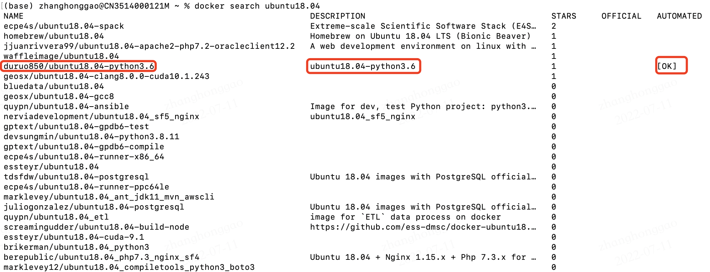
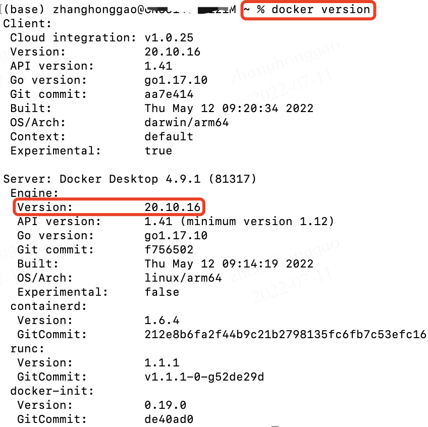
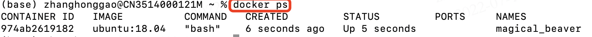

- [一，Docker 简介](#一docker-简介)
  - [1.1，什么是 Docker](#11什么是-docker)
  - [1.2，Docker 与虚拟机的区别](#12docker-与虚拟机的区别)
  - [1.3，Docker 架构](#13docker-架构)
  - [1.4，为什么用 Docker](#14为什么用-docker)
- [二，Docker 基本概念](#二docker-基本概念)
  - [2.1，镜像](#21镜像)
  - [2.2，容器](#22容器)
  - [2.3，仓库](#23仓库)
- [三，Docker 使用](#三docker-使用)
  - [3.1，Docker 服务](#31docker-服务)
  - [3.2，下载与使用Docker公共镜像(Images)](#32下载与使用docker公共镜像images)
- [四，Docker 镜像命令](#四docker-镜像命令)
- [五，Docker 容器命令](#五docker-容器命令)
  - [5.1，docker run 命令](#51docker-run-命令)
- [六，参考资料](#六参考资料)

## 一，Docker 简介
### 1.1，什么是 Docker
`Docker` 使用 Google 公司推出的 Go 语言 进行开发实现，基于 Linux 内核的 cgroup，namespace，以及 OverlayFS 类的 Union FS 等技术，对进程进行封装隔离，属于**操作系统层面的虚拟化技术**。由于隔离的进程独立于宿主和其它的隔离的进程，因此也称其为容器。**Docker容器**与虚拟机类似，但二者在原理上不同。容器是将[操作系统层虚拟化](https://zh.m.wikipedia.org/wiki/%E4%BD%9C%E6%A5%AD%E7%B3%BB%E7%B5%B1%E5%B1%A4%E8%99%9B%E6%93%AC%E5%8C%96%20%22%E4%BD%9C%E6%A5%AD%E7%B3%BB%E7%B5%B1%E5%B1%A4%E8%99%9B%E6%93%AC%E5%8C%96%22 "操作系统层虚拟化")，虚拟机则是虚拟化硬件，因此容器更具有便携性、能更高效地利用服务器。

专业名词 `Docker` 有两个意思：

* 代指整个 Docker 项目。
* 代指 Docker 引擎。

`Docker` 引擎(Docker Engine)是指一个服务端-客户端结构的应用，主要有这些部分：Docker 守护进程、Docker Engine API（页面存档备份，存于互联网档案馆）、Docker 客户端。

### 1.2，Docker 与虚拟机的区别
* 传统虚拟机技术是虚拟出一套硬件后，在其上运行一个完整操作系统，在该系统上再运行所需应用进程。
* Docker 容器内的应用进程直接运行于宿主的内核，容器内没有自己的内核，而且也没有进行硬件虚拟。因此容器要比传统虚拟机更为轻便。

|**特性**|**Docker**|**虚拟机**|
| :-----: | :-----: | :-----: |
|启动|秒级|分钟级|
|硬盘使用|一般为 MB|一般为 GB|
|性能|接近原生|弱于|
|系统支持量|单机支持上千个容器|一般几十个|

### 1.3，Docker 架构


runc 是一个 Linux 命令行工具，用于根据 OCI 容器运行时规范 创建和运行容器。

containerd 是一个守护程序，它管理容器生命周期，提供了在一个节点上执行容器和管理镜像的最小功能集。

### 1.4，为什么用 Docker
Docker 作为一种**新的虚拟化技术**，跟传统的虚拟化技术相比具有众多的优势：

1. **更高效的利用系统资源**：不需要进行硬件虚拟以及运行完整操作系统等额外开销，Docker 对系统资源的利用率更高。
2. **更快速的启动时间**：Docker 容器应用直接运行于宿主内核，不需要启动完整的操作系统，所以启动时间可做到秒级的启动时间。
3. **一致的运行环境**：Docker 镜像提供了除内核外完整的运行时环境，确保开发环境、测试环境、生产环境的一致性。
4. **持续交付和部署**：开发人员可以通过 Dockerfile 来进行镜像构建，并结合持续集成(Continuous Integration) 系统进行集成测试，而运维人员则可以直接在生产环境中快速部署该镜像，甚至结合持续部署(Continuous Delivery/Deployment) 系统进行自动部署。
5. **更轻松的迁移**：Docker 可以在很多平台上运行，无论是物理机、虚拟机、公有云、私有云，甚至是笔记本，其运行结果是一致的。
6. **更轻松的维护和扩展。**

## 二，Docker 基本概念

**Docker 三个基本概念：**

* 镜像（Image）
* 容器（Container）
* 仓库（Repository）

### 2.1，镜像
**操作系统分为内核和用户空间**。对于 Linux 而言，内核启动后，会挂载 root 文件系统为其提供用户空间支持。而 Docker 镜像（Image），就相当于是一个 root 文件系统。比如官方镜像 ubuntu:18.04 就包含了完整的一套 Ubuntu 18.04 最小系统的 root 文件系统。

**Docker 镜像** 是一个特殊的文件系统，除了提供容器运行时所需的程序、库、资源、配置等文件外，还包含了一些为运行时准备的一些配置参数（如匿名卷、环境变量、用户等）。镜像 **不包含** 任何动态数据，其内容在构建之后也不会被改变。

**Docker** 镜像并非是像一个 `ISO` 那样的打包文件，镜像只是一个虚拟的概念，其实际体现并非由一个文件组成，而是由一组文件系统组成，或者说，由多层文件系统联合组成。**其被设计为分层存储的架构，镜像构建时，会一层层构建，前一层是后一层的基础**。每一层构建完就不会再发生改变，后一层上的任何改变只发生在自己这一层。分层存储的特征还使得镜像的复用、定制变的更为容易。甚至可以用之前构建好的镜像作为基础层，然后进一步添加新的层，以定制自己所需的内容，构建新的镜像。

### 2.2，容器
镜像（`Image`）和容器（`Container`）的关系，类似面向对象程序设计中的**类和实例**的关系。可以把 Docker容器(Container) 看做是一个简易版的 Linux 环境（包括 root 用户权限、进程空间、用户空间和网络空间等）和运行在其中的应用程序。它可以被启动、开始、停止、 删除。

容器的实质是进程，但与直接在宿主执行的进程不同，容器进程运行于属于自己的独立的 命名空间。因此容器可以拥有自己的 root 文件系统、自己的网络配置、自己的进程空间，甚至自己的用户 ID 空间。容器内的进程是运行在一个隔离的环境里，使用起来，就好像是在一个独立于宿主的系统下操作一样。

容器和镜像一样都是使用分层存储，每一个容器运行时，是以镜像为基础层，在其上创建一个当前容器的存储层，我们可以称这个为容器运行时读写而准备的存储层为**容器存储层**。

### 2.3，仓库
镜像构建完成后，可以很容器的在**当前宿主主机**上运行，但是如果需要在其他服务器上使用这个镜像，我们就需要一个集中的存储、分发镜像的服务，即**仓库**（Repository）-集中存放镜像的地方。

`Docker` 仓库(`Registry`) 分为公开仓库（`Public`）和私有仓库（`Private`）两种形式。目前 `Docker` 官方维护了一个公共仓库 [Docker Hub](https://hub.docker.com/ "Docker Hub")，其中已经包括了数量超过 2,650,000 的镜像。大部分需求都可以通过在 `Docker Hub` 中直接下载镜像来实现。

有时候使用 `Docker Hub` 这样的公共仓库可能不方便，用户可以创建一个**本地仓库**供私人使用。[Docker Registry](https://yeasy.gitbook.io/docker_practice/repository/registry "Docker Registry") 是官方提供的工具，可以用于构建私有的镜像仓库。

一个 `Docker Registry` 中可以包含多个**仓库**（`Repository`）；每个仓库可以包含多个**标签**（`Tag`）；**每个标签对应一个镜像**。

通常，一个仓库会包含同一个软件不同版本的镜像，而标签就常用于对应该软件的各个版本。我们可以通过 `<仓库名>:<标签>` 的格式来指定具体是这个软件哪个版本的镜像。如：`ubuntu: 14.04`、`ubuntu: 16.04` 等等。

```shell
$ docker image ls ubuntu
REPOSITORY          TAG                 IMAGE ID            CREATED             SIZE
ubuntu              18.04               329ed837d508        3 days ago          63.3MB
ubuntu              bionic              329ed837d508        3 days ago          63.3MB
```

## 三，Docker 使用
### 3.1，Docker 服务
安装 Docker 这里不做介绍。以下是 Linux 系统下，一些 docker 使用命令：

1，**查看 Docker 服务状态**：使用 `systemctl status docker` 命令查看 Docker 服务的状态。其中 Active: active (running) 即表示 Docker 服务为正在运行状态。


2，**停止 Docker 服务**：使用 `systemctl stop docker` 命令。

3，**启动 Docker 服务**：使用 `systemctl start docker` 命令。

4，**重启 Docker 服务**：使用 `systemctl restart docker` 命令。

5，**测试 Docker 是否安装正确**。

```bash
$ docker run --rm hello-world
Unable to find image 'hello-world:latest' locally
latest: Pulling from library/hello-world
7050e35b49f5: Pull complete
Digest: sha256:13e367d31ae85359f42d637adf6da428f76d75dc9afeb3c21faea0d976f5c651
Status: Downloaded newer image for hello-world:latest
 
Hello from Docker!
This message shows that your installation appears to be working correctly.
 
To generate this message, Docker took the following steps:
 1. The Docker client contacted the Docker daemon.
 2. The Docker daemon pulled the "hello-world" image from the Docker Hub.
    (arm64v8)
 3. The Docker daemon created a new container from that image which runs the
    executable that produces the output you are currently reading.
 4. The Docker daemon streamed that output to the Docker client, which sent it
    to your terminal.
 
To try something more ambitious, you can run an Ubuntu container with:
 $ docker run -it ubuntu bash
 
Share images, automate workflows, and more with a free Docker ID:
 https://hub.docker.com/
 
For more examples and ideas, visit:
 https://docs.docker.com/get-started/
```
### 3.2，下载与使用Docker公共镜像(Images)
> `macos` 系统环境下操作示例，`ubuntu` 系统可能略有不同。

1，使用 **docker search** 命令从 Docker Repo 搜索 Dokcer 可用的镜像。示例命令：`docker search ubuntu18.04`。



2，使用 **docker image pull** 命令从 Docker Repo 获取指定的 Dokcer镜像(Images)。示例命令: `docker image pull docker.io/hello-world`。拉取名为 docker.io/hello-world 的镜像。


3，使用 **docker image ls** 命令查看**本地**的 Dokcer 镜像(Images)。

4，使用 **docker run** 命令运行 Dokcer 镜像(Images)。示例命令：`docker run hello-world`。


5，使用 **docker info** 命令，查看当前 docker容器 的所有的信息。


6，使用 **docker version** 查看容器的版本信息。

```bash
$ docker --version # 这个命令查看 docker 版本更简单
Docker version 19.03.13, build 4484c46d9d
```


## 四，Docker 镜像命令
Docker 镜像(Images) 也可以理解为是一个用于创建 Docker容器(Container) 的静态模板。一个 Docker 镜像(Images) 可以创建很多 Docker容器(Container)。

**Docker 镜像常用命令如下：**

|命令|描述|
| ----- | ----- |
|**docker commit**|创建镜像。|
|**docker images**|查看镜像信息。|
|**docker load**|导入镜像。|
|**docker pull**|拉取 Docker 镜像。|
|**docker push**|上传镜像。|
|**docker rmi**|删除镜像。|
|**docker save**|导出镜像。|
|**docker search**|在 Docker Hub 搜索镜像。|
|**docker tag**|为镜像打标签。|

## 五，Docker 容器命令
### 5.1，docker run 命令
通过 **docker run** 命令可以基于镜像新建一个容器并启动，语法如下：

`docker run [OPTIONS] IMAGE [COMMAND] [ARG...]` 

**其他常用容器管理命令如下：**

```bash
# 新建容器并启动
$ docker run [镜像名/镜像ID]
# 启动已终止容器
$ docker start [容器ID]
# 列出本机运行的容器
$ docker ps
# 停止运行的容器
$ docker stop [容器ID]
# 杀死容器进程
$ docker kill [容器ID]
# 重启容器
$ docker restart [容器ID]
```
**docker run 命令语法**

1, `docker run` 命令常用选项：可通过 docker run --help 命令查看全部内容。

|**选项**|**说明**|
| :-----: | :-----: |
|\-d, --detach=false|指定容器运行于前台还是后台，默认为 false。|
|\-i, --interactive=false|打开 STDIN，用于控制台交互。|
|\-t, --tty=false|分配 tty 设备，该可以支持终端登录，默认为 false。|
|\-u, --user=""|指定容器的用户。|
|\-a, --attach=\[\]|登录容器（必须是以 docker run -d 启动的容器）。|
|\-w, --workdir=""|指定容器的工作目录。|
|\-c, --cpu-shares=0|设置容器 CPU 权重，在 CPU 共享场景使用。|
|\-e, --env=\[\]|指定环境变量，容器中可以使用该环境变量。|
|\-m, --memory=""|指定容器的内存上限。|
|\-P, --publish-all=false|指定容器暴露的端口。|
|\-p, --publish=\[\]|指定容器暴露的端口。|
|\-h, --hostname=""|指定容器的主机名。|
|\-v, --volume=\[\]|给容器挂载存储卷，挂载到容器的某个目录。|
|–volumes-from=\[\]|给容器挂载其他容器上的卷，挂载到容器的某个目录。|
|–cap-add=\[\]|添加权限。|
|–cap-drop=\[\]|删除权限。|
|–cidfile=""|运行容器后，在指定文件中写入容器 PID 值，一种典型的监控系统用法。|
|–cpuset=""|设置容器可以使用哪些 CPU，此参数可以用来容器独占 CPU。|
|–device=\[\]|添加主机设备给容器，相当于设备直通。|
|–dns=\[\]|指定容器的 dns 服务器。|
|–dns-search=\[\]|指定容器的 dns 搜索域名，写入到容器的 /etc/resolv.conf 文件。|
|–entrypoint=""|覆盖 image 的入口点。|
|–env-file=\[\]|指定环境变量文件，文件格式为每行一个环境变量。|
|–expose=\[\]|指定容器暴露的端口，即修改镜像的暴露端口。|
|–link=\[\]|指定容器间的关联，使用其他容器的 IP、env 等信息。|
|–lxc-conf=\[\]|指定容器的配置文件，只有在指定 --exec-driver=lxc 时使用。|
|–name=""|指定容器名字，后续可以通过名字进行容器管理，links 特性需要使用名字。|
|–net=“bridge”|器网络设置：<br>1. bridge 使用 docker daemon 指定的网桥。<br>2. host //容器使用主机的网络。<br>3. container:NAME\_or\_ID >//使用其他容器的网路，共享 IP 和 PORT 等网络资源。<br>4. none 容器使用自己的网络（类似–net=bridge），但是不进行配置。|
|–privileged=false|指定容器是否为特权容器，特权容器拥有所有的 capabilities。|
|–restart=“no”|指定容器停止后的重启策略:<br>1. no：容器退出时不重启。<br>2. on-failure：容器故障退出（返回值非零）时重启。<br>3. always：容器退出时总是重启。|
|–rm=false|指定容器停止后自动删除容器(不支持以 docker run -d 启动的容器)。|
|–sig-proxy=true|设置由代理接受并处理信号，但是 SIGCHLD、SIGSTOP 和 SIGKILL 不能被代理。|

2，`Docker` 交互式运行的语法为：`docker run -i -t IMAGE [COMMAND] [ARG]` 。`Docker` 交互式运行，即 `Docker` 启动直接进入 `Docker` 镜像内部。


3，使用 `docker ps` 命令，**查看正在运行的 docker**。



## 六，参考资料
* [Docker-从入门到实践](https://yeasy.gitbook.io/docker_practice/ "Docker-从入门到实践")
* [Docker教程](https://haicoder.net/docker/docker-course.html "Docker教程")

