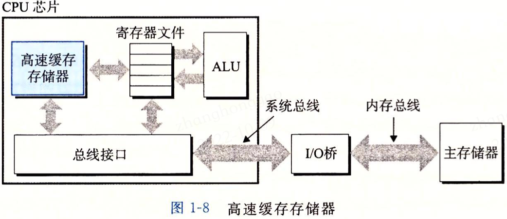
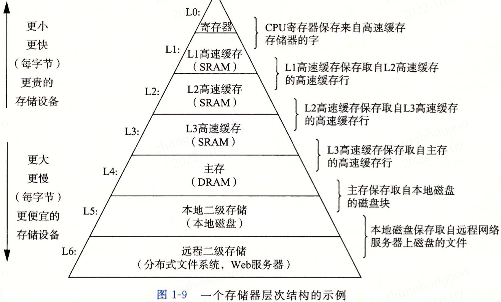

# 深入理解计算机系统-计算机系统漫游笔记.md
### 1，信息就是位+上下文
* 计算机系统是由硬件和系统软件组成，它们共同工作来运行应用程序。
* C 语言是系统级编程的首选，同时它也非常实用于应用级程序的编写。

### 2，程序被其他程序翻译成不同格式
以`hello` 程序为例来解释程序的生命周期，`hello.c` 文件代码如下:

```cpp
#include <stdio.h>

int main()
{
    printf("hello world\n");
    return 0;
}
```

为了在系统上运行 `hello.c` 程序，文件中的每条 C 语言都必须被其他程序转化为一系列的**低级机器语言指令**。然后这些指令按照一种称为**可执行目标程序**的格式打包好，并以二进制磁盘文件的形式保存。目标程序也称为**可执行目标文件**。

在 Linux 系统中，`GCC` 编译器将源程序文件 hello.c 翻译（编译）为目标文件 hello 的过程分为四个阶段，如下图所示。执行这四个阶段（预处理器、编译器、汇编器和链接器）的程序一起构成了编译器系统（compilation system）。


### 3，了解编译器如何工作是有大有益处的
1. **优化程序性能**。了解一些机器代码（汇编代码）以及编译器将不同的 C/C++语句转化为机器代码的方式。比如一个函数调用的开销有多大？while 循环比 for 循环更有效吗？指针引用比数组索引更有效吗等？
2. **理解链接时出现的错误**。比如静态库和动态库的区别，静态变量和全局变量的区别等。
3. **避免安全漏洞**。

### 4，处理器读取存在内存中的指令
典型系统的硬件组织构成: 总线、`I/O` 设备、主存（动态随机存取存取器 `DRAM`）、处理器。

> 主存是临时存储设备，在处理器执行程序时，用来存放程序和程序处理的数据。从逻辑上说，存储器是一个线性的字节数组，每个字节都有其唯一的地址（数组索引），这些地址是从零开始的。

将 hello 程序输出的字符串从存储器写到显示器的过程如下图所示。


### 5，高速缓冲至关重要
针对处理器与主存之间读取数据的差异，处理器系统设计者采用了更小更快的存储设备，称为高速缓冲器（cache memory，简称 cache 或高速缓冲），作为暂时的集结区域，存放处理器近期可能会需要的信息。



### 6，存储设备形成层次结构
在处理器和一个较大较慢的设备（例如主存）之间插入一个更小更快的存储设备（例如高速缓冲）的想法已经成为一个普遍的观念。实际上，每个计算机系统中的存储设备都被组织成了一个**存储器层次结构**，如图1-9所示。在这个层次结构中，从上至下，设备的访问速度越来越慢、容量越来越大，并且每字节的成本也越来越低。



### 7，操作系统管理硬件
所有应用程序对硬件的操作尝试都必须通过操作系统，操作系统有两个基本功能：

1. 防止硬件被失控的应用程序滥用；
2. 向应用程序提供简单一致的机制来控制复杂而又通常大不相同的低级硬件设备。

操作系统通过几个基本的抽象概念（**进程、虚拟内存和文件**）来实现这两个功能。文件是对 I/O 设备的抽象表示，虚拟内存是对主存和磁盘 I/O 设备的抽象表示，进程则是对处理器、主存和 I/O 设备的抽象表示。

#### 7.1，进程
**进程**是操作系统对一个正在运行的程序的一种抽象。在一个系统上可以同时运行多个进程，每个进程都好像在独占地使用硬件。而**并发运行**，则是说一个进程的指令和另一个进程的指令是交错之行的。在大多数系统中，需要运行的进程数是可以多于它们的 `CPU` 个数的。无论在单核还是多核系统中，一个 `CPU` 看上去都像是在**并发**地执行多个进程，这实际是通过处理器在进程间切换来实现的，操作系统实现这种交错执行的机制成为**上下文切换**。

操作系统会保持跟踪进程运行所需的所有状态信息，这种状态信息称为上下文，其包括多种信息，比如 `PC` 和寄存器文件的当前值，以及主存的内容。在任何一个时刻，但处理器系统都只能执行一个进程的代码。当操作系统决定要把控制权从当前进程转移到某个新进程时，就会进行**上下文切换，**即保存当前进程的上下文、恢复进程的上下文，然后将控制权传递到新进程。图1-12展示了示例 hello 程序运行场景的基本理念。


#### 7.2，线程
尽管我们直观认为一个进程只有单一的控制流，但在现代计算机系统中，一个进程实际上可以由多个称为**线程**的执行单元组成，每个线程都运行在进程的上下文中，并共享同样的代码和全局数据。由于网络服务器对并行处理的需求，线程成为越来越重要的编程模型，因为多线程之间比多进程之间更容易共享数据且更高效。

#### 7.3，虚拟内存
**虚拟内存**是一个抽象概念，它为每个进程提供了一个假象，即每个进程都在独占地使用主存，每个进程看到的内存都是一致的，称为**虚拟地址空间**。图 1-13 所示的是 Linux 进程的虚拟地址空间。在 Linux 中，地址空间最上面的区域是保留给操作系统中代码和数据的，这对所有进程来说都是一样。地址空间的底部区域存放用户进程定义的代码和数据。注意，图中的地址从下往上增大的。


每个进程看到的虚拟地址空间由大量准确定义的区构成，每个区都有专门的功能，进程的虚拟地址空间意义如下。

* **程序代码和数据**。对所有进程来说，代码是从同一固定地址开始，进接着的是和全局变量和相对应的数据位置，代码和数据区是直接按照可执行目标文件的内容初始化的。
* **堆**。代码和数据区后紧随着的是运行时堆。代码和数据区在进程一开始运行时就被指定了大小，与此不同，当调用 `malloc` 和 `free` 这样的 C 标准库函数时，堆可以在运行时动态地拓展和收缩。
* **共享库**。地址空间的中间部分是一块用来存放像 C 标准库和数学库这样的共享库的代码和数据的区域。
* **栈**。位于用户虚拟地址空间顶部的是**用户栈**，编译器用它来实现函数调用。和堆类似，用户栈在程序执行期间可以动态地拓展和收缩，调用函数栈则增长，从一个函数返回，栈则收缩。
* **内核虚拟内存**。地址空间顶部的区域是为操作系统内核保留的。

虚拟内存的运作需要硬件和操作系统软件之间精密复杂的交互，包括对处理器生成的每个地址的硬件翻译，基本思想是把一个进程虚拟内存的内容存在在磁盘上，然后用主存作为磁盘的高速缓冲。

#### 7.4，文件
文件就是字节序列，每个 I/O 设备包括磁盘、键盘、显示器，甚至网络都可以看成文件，系统中所有输入输出都是通过使用一小组称为 Unix I/O 的系统函数调用读写文件来实现的。

### 8，系统之间利用网络通信
现代系统通过网络将单个计算机系统连接在一起。


### 9，重要主题
#### 9.1，Amdahl 定律
该定律的主要思想就是，当我们对系统的某个部分加速时，其对系统整体性能的影响取决于该部分的重要性和加速程度。


#### 9.2，并发与并行
我们用术语并发（`concurrency`）是一个通用的概念，指一个同时具有多个活动的系统；而术语并行（`parallelism`）指的是用并发来是一个系统运行得更快。并行可以在计算机系统的多个抽象层次上运用，这里按照系统层次结构中由高到低的顺序描述三个层次。

**1，线程级并发**

超线程，有时称为**同时多线程**（simultaneous multi-threading），是一项允许一个 `CPU` 执行多个控制流的技术。它涉及 CPU 某些硬件有多个备份，比如程序计数器和寄存器文件，而其他硬件部分只有一份，比如执行浮点算术运算的单元。常规的处理器需要大约 20000 个时钟周期做不同线程间的转换，而超线程的处理器可以在单个周期的基础上决定要执行哪一个线程。

多处理器的使用可以从两方面提高系统性能，首先，它减少了在执行多个任务时模拟并发的需要；其次，它可以使应用程序运行得更快，前提是程序以多线程方式编写。

**2，指令级并行**

在较低的抽象层次上，现代处理器可以同时执行多条指令的属性称为**指令级并行。**如果处理器可以达到比一个周期一条指令更快的执行速率，就称为**超标量**（super-scalar）处理器，大多数现代处理器都支持超标量操作。

**3，单指令、多数据并行**

在最低层次中，许多现代处理器拥有特殊的硬件，允许一条指令产生多个可以并行执行的操作，这种方式称为**单指令、多数据**，即 `SIMD` 并行。

#### 9.4，计算机系统中抽象的重要性
前面我们介绍了计算机系统使用的几个抽象，如图 1-18 所示，在处理器里，指令集架构提供了对实际处理器的抽象。


操作系统中有四个抽象：**文件是对 I/O 设备的抽象，虚拟内存时对程序存储器的抽象，进程是对一个正在运行的程序的抽象，虚拟机提供对整个计算机的抽象，包括操作系统、处理器和程序**。
### 参考资料
* 《深入理解操作系统第三版-第1章》