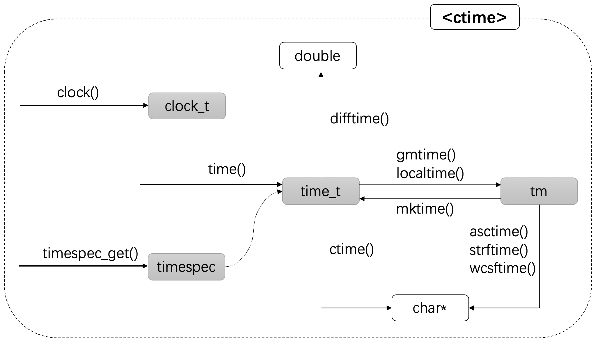
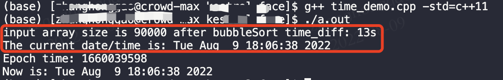
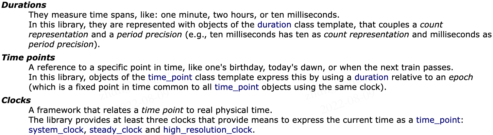
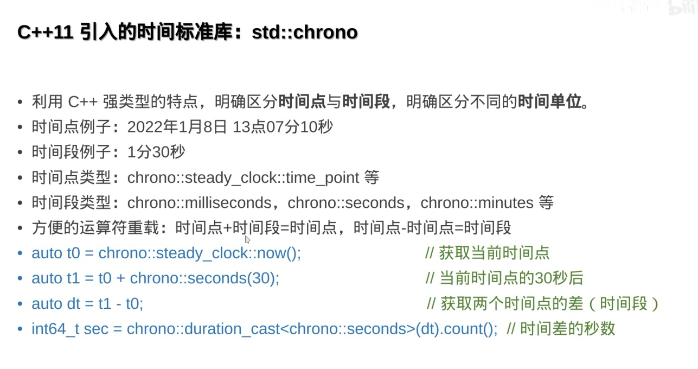
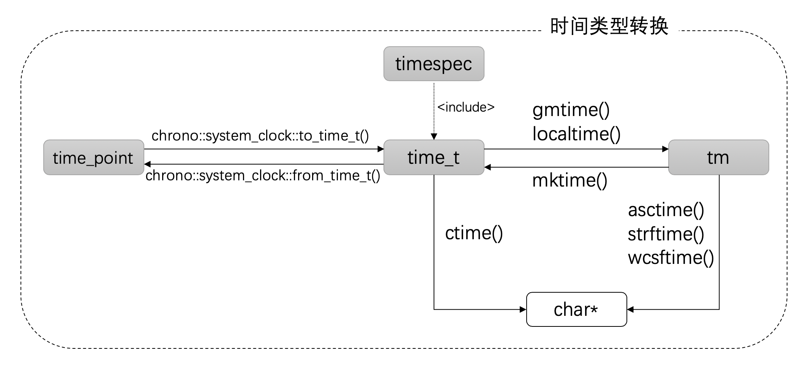

- [一，概述](#一概述)
- [二，C-style 日期和时间库](#二c-style-日期和时间库)
  - [2.1，数据类型](#21数据类型)
  - [2.2，函数](#22函数)
  - [2.3，数据类型与函数关系梳理](#23数据类型与函数关系梳理)
  - [2.4，时间类型](#24时间类型)
    - [2.4.1，UTC 时间](#241utc-时间)
    - [2.4.2，本地时间](#242本地时间)
    - [2.4.3，纪元时间](#243纪元时间)
  - [2.5，输出时间和日期](#25输出时间和日期)
  - [2.6，综合示例代码](#26综合示例代码)
- [三，chrono 库](#三chrono-库)
  - [3.1，时钟](#31时钟)
  - [3.2，与C-style转换](#32与c-style转换)
  - [3.3，时长 ratio](#33时长-ratio)
    - [3.3.1，时长运算](#331时长运算)
  - [3.4，时间间隔 duration](#34时间间隔-duration)
    - [3.4.1，时间间隔转换函数 duration\_cast](#341时间间隔转换函数-duration_cast)
  - [3.5，时间点 time\_point](#35时间点-time_point)
    - [3.5.1，时间点运算](#351时间点运算)
- [参考资料](#参考资料)

> `C++11` 的日期和时间编程内容在 C++ Primer(第五版)这本书并没有介绍，目前网上的文章又大多质量堪忧或者不成系统，故写下这篇文章用作自己的技术沉淀和技术分享，大部分内容来自网上资料，文末也给出了参考链接。

**日期和时间库**是每个编程语言都会提供的内部库，其可以用打印模块耗时，从而方便做性能分析，也可以用作打印运行时间点。本文的内容着重于 C++11-C++17的内容，C++20的日期和时钟库虽然使用更方便也更强大，但是考虑到版本兼容和程序移植问题，故不做深入探讨。

## 一，概述
C++ 中可以使用的日期时间 API 分为两类：

* `C-style` 日期时间库，位于 <ctime> 头文件中。这是原先 <time.h> 头文件的 C++ 版本。
* `chrono` 库：**C++ 11 中新增API**，增加了时间点，时长和时钟等相关接口（使用较为复杂）。

在 C++11 之前，C++ 编程只能使用 C-style 日期时间库，其精度只有秒级别，这对于有高精度要求的程序来说，是不够的。但这个问题在C++11 中得到了解决，C++11 中不仅扩展了对于精度的要求，也为不同系统的时间要求提供了支持。另一方面，对于只能使用 C-style 日期时间库的程序来说，C++17 中也增加了 timespec 将精度提升到了纳秒级别。

## 二，C-style 日期和时间库
`#include <ctime>`  该头文件包含了获取和操作**日期和时间**的函数和**相关数据类型**定义。

### 2.1，数据类型
|**名称**|**说明**|
| ----- | ----- |
|`time_t`|能够表示时间的基本算术类型的别名，能够表示函数 `time` 返回的时间，单位为**秒**级别。|
|`clock_t`|能够表示时钟滴答计数的基本算术类型的别名（可用作进程运行时间）|
|`size_t`|`sizeof` 运算符返回的无符号整数类型。|
|`struct tm`|包含日历日期和时间的结构体类型|
|timespec\*|以秒和纳秒表示的时间|

### 2.2，函数
`C-style` 日期时间库中包含的时间操作函数如下：

|**函数**|**说明**|
| ----- | ----- |
|`std::clock_t clock()`|返回自程序启动时起的处理器时钟时间|
|`double difftime(std::time_t time_end, std::time_t time_beg)`|计算开始和结束之间的**秒数差**|
|`std::time_t time (time_t* timer)`|返回自纪元起计的**系统当前时间**, 函数可以为空指针|
|`std::time_t mktime (struct tm * timeptr)`|将 `tm` 格式的时间转换成 `time_t` 表示的时间|

时间转换函数如下：

|函数|说明|
| ----- | ----- |
|`char* asctime(const struct tm* timeptr)`|将 `tm` 结构体对象转换为字符串的文本|
|`char* ctime(const time_t* timer)`|将 `time_t` 对象转换为 `C` 字符串，用于表示日历时间|
|`struct tm* gmtime(const time_t* time)`|将 `time_t` 转换成 `UTC` 表示的时间|
|`struct tm* localtime(const time_t* timer)`|将 `time_t` 转换成本地时间|

> `localtime` 函数使用参数 `timer` 指向的值来填充 `tm` 结构体，其中的值表示对应的时间，以本地时区表示。

`strftime` 和 `wcsftime` 函数一般不常用，故不做介绍。`tm` 结构体的一般定义如下：

```cpp
/* Used by other time functions.  */
struct tm
{
  int tm_sec;			/* Seconds.	[0-60] (1 leap second) */
  int tm_min;			/* Minutes.	[0-59] */
  int tm_hour;			/* Hours.	[0-23] */
  int tm_mday;			/* Day.		[1-31] */
  int tm_mon;			/* Month.	[0-11] */
  int tm_year;			/* Year	- 1900.  */
  int tm_wday;			/* Day of week.	[0-6] */
  int tm_yday;			/* Days in year.[0-365]	*/
  int tm_isdst;			/* DST.		[-1/0/1]*/
};
```
### 2.3，数据类型与函数关系梳理
时间和日期相关的函数及数据类型比较多，单纯看表格和代码不是很好记忆，第一个参考链接的作者给出了如下所示的思维导图，方便记忆与理解上面所有函数及数据类型之间各自的联系。



在这幅图中，以数据类型为中心，带方向的实线箭头表示该函数能返回相应类型的结果。

* `clock` 函数是相对独立的一个函数，它返回进程运行的时间，具体描述见下文。
* `time_t` 描述了纪元时间，通过 `time` 函数可以获得它，但它只能精确到秒级别。
* `timespec` 类型在 `time_t` 的基础上，增加了**纳秒**的精度，通过 `timespec_get` 获取。这是 `C++17` 上新增的特性。
* `tm` 是日历类型，因为它其中**包含了年月日等**信息。通过 gmtime，localtime 和 mktime 函数可以将 time\_t 和 tm 类型互相转换。
* 考虑到时区的差异，因此存在 gmtime 和 localtime 两个函数。
* 无论是 `time_t` 还是 `tm` 结构，都可以将其以字符串格式输出。ctime 和 asctime 输出的格式是固定的。如果需要自定义格式，需要使用 strftime 或者 wcsftime 函数。

### 2.4，时间类型
#### 2.4.1，UTC 时间
**协调世界时**（**C**oordinated **U**niversial **T**ime，简称 **UTC**）是最主要的时间标准，其以**原子时秒长**为基础，在时刻上尽量接近于格林威治标准时间。

协调世界时是世界上调节时钟和时间的主要时间标准，它与0度经线的平太阳时相差不超过 1 秒。因此UTC时间+8即可获得北京标准时间（UTC+8）。

#### 2.4.2，本地时间
**本地时间**与当地的时区相关，例如中国当地时间采用了北京标准时间（`UTC+8`）。

#### 2.4.3，纪元时间
**纪元时间**（Epoch time）又叫做 Unix 时间或者 POSIX 时间。它表示自1970 年 1 月 1 日 00:00 UTC 以来所经过的**秒数**（不考虑闰秒）。它在操作系统和文件格式中被广泛使用。**<ctime>**** 头文件中通过 ****time\_t**** 以秒级别表示纪元时间**。

纪元时间这个想法很简单：以一个时间为起点加上一个偏移量便可以表达任何一个其他的时间。

> 为什么选这个时间作为起点，可以点击这里：[Why is 1/1/1970 the “epoch time”?](https://stackoverflow.com/questions/1090869/why-is-1-1-1970-the-epoch-time)。

通过 `time` 函数获取当前时刻的纪元时间示例代码如下：

```cpp
time_t epoch_time = time(nullptr);
cout << "Epoch time: " << epoch_time << endl;
// Epoch time: 1660039180 (日历时间: Tue Aug  9 17:59:40 2022)
```
`time` 函数接受一个指针，指向要存储时间的对象，通常可以传递一个空指针，然后通过返回值来接受结果。虽然标准中没有给出定义，但`time_t` 通常使用整形值来实现。

### 2.5，输出时间和日期
使用 `ctime` 函数，可以将时间以**固定格式的字符串**的形式打印出来，格式为：Www Mmm dd hh:mm:ss yyyy\\n。代码示例如下：

```cpp
// 以字符串形式输出当前时间和日期
time_t now = time(nullptr);
cout << "Now is: " << ctime(&now);
// Now is: Tue Aug  9 18:06:38 2022
```
### 2.6，综合示例代码
`asctime()` 和 `difftime()` 函数等`sample` 代码如下（复制可直接运行）：

```cpp
/* asctime example */
#include <stdio.h>      /* printf */
#include <time.h>       /* time_t, struct tm, time, localtime, asctime */
#include <vector>
#include <iostream>

using namespace std;

// 冒泡排序: 将数据从小到大排序
void bubbleSort(vector<int> &arr){
    size_t number = arr.size();
    if (number <= 1) return;
    int temp;
    for(int i = 0; i < number; i++){
        for(int j = 0; j < number-i; j++){
            if (temp > arr[j+1]){
                temp = arr[j];
                arr[j] = arr[j+1];
                arr[j+1] = temp;
            }
        }
    }
}

// difftime() 函数: 计算时间差，单位为 s
void difftime_test()
{
    vector<int> input_array;
    for (int i = 90000; i > 0; i--) {
        input_array.emplace_back(i);
    }
    time_t time1 = time(nullptr);
    bubbleSort(input_array);
    time_t time2 = time(nullptr);
    double time_diff = difftime(time2, time1);
    cout << "input array size is " << input_array.size() << " after bubbleSort time_diff: " << time_diff << "s" << endl;
}

// astime() 函数: 将本地时间 tm 结构体对象转换为字符串文本
void astime_test()
{
    time_t raw_time = time(nullptr);  // 获取当前时刻日历时间
    struct tm* local_timeinfo = localtime(&raw_time);
    printf ( "The current date/time is: %s", asctime (local_timeinfo) );
}

int main()
{
    difftime_test();
    astime_test();
    // 3, 输出当前纪元时间
    time_t epoch_time = time(nullptr);
    cout << "Epoch time: " << epoch_time << endl;
    // 4，以字符串形式输出当前时间和日期
    time_t now = time(nullptr);
    cout << "Now is: " << ctime(&now);
}
```
`g++ time_demo.cpp -std=c++11` 编译后，运行程序 `./a.out` 后，输出结果：



## 三，chrono 库
> “chrono” 是英文 chronology 的缩写，其含义是“年表；年代学”。

`chrono` 既是头文件名字也是子命名空间的名字，`chrono` 头文件下的所有 `elements` 都是在 `std::chrono` 命名空间下定义的。

`std::chrono` 是 C++11 引入的日期时间处理库，`chrono` 库里包括三种主要类型：`Clocks`，`Time points` 和 `Durations` 。





### 3.1，时钟
`C++11` `chrono` 库中包含了**三种**的时钟类：

|**名称**|**说明**|
| :-----: | :-----: |
|`chrono::system_clock`|系统时钟（可以调整）|
|`chrono::steady_clock`|单调递增时钟（不能调整）|
|`chrono::high_resolution_clock`|拥有可用的最短嘀嗒周期的时钟|

`system_clock` 是当前所在系统的时钟。因为系统时钟随时都可能被调整，所以如果想要计算两个时间点的时间差，是不推荐使用系统时钟的。

`steady_clock` 会保证时间的单调递增性，只会向前移动不会减少，所以最适合用来度量**时间间隔**。

`high_resolution_clock` 表示实现提供的拥有最小计次周期的时钟。它可以是 system\_clock 或 steady\_clock 的别名，也可能是第三个独立时钟。在不同的标准库中，high\_resolution\_clock 的实现不一致，所以官方不建议使用这个时钟。

这三个时钟类有一些共同的成员函数和数据类型，如下所示：

|**名称**|**说明**|
| ----- | ----- |
|`now()`|静态成员函数，返回当前时间，类型为 clock::time\_point|
|`time_point`|成员类型，当前时钟的时间点类型，用于表示一个具体时间，详情见下文“时间点”|
|`duration`|成员类型，时钟的时长类型，用于表示时间间隔(**一段时间**)，详情见下文“时长”|
|`rep`|成员类型，时钟的 tick 类型，等同于 clock::duration::rep|
|`period`|成员类型，时钟的单位，等同于 clock::duration::period|
|`is_steady`|静态成员类型：是否是稳定时钟，对于 steady\_clock 来说该值一定是 true|

每一个时钟类都有一个 `now()` 静态函数来获取当前时间，返回的类型由 time\_*point 描述。**std::chrono::time\_point** 是模板类，模版类实例如：std::chrono::time\_point<std::chrono::steady\_*clock>，这样写比较长，庆幸的是在 C++11 中可以通过 `auto` 关键字来自动推导变量类型。

```cpp
std::chrono::time_point<std::chrono::steady_clock> now1 = std::chrono::steady_clock::now();
auto now2 = std::chrono::steady_clock::now();
```
### 3.2，与C-style转换
system\_*clock 与另外两个 clock 不一样的地方在于，它还提供了两个静态函数用来将 time\_*point 与 std::time\_t 来回转换。

|**名称**|**说明**|
| ----- | ----- |
|to\_time\_t|将系统时钟时间点转换为 `time_t`|
|from\_time\_t|将 `time_t` 转换到系统时钟时间点|

第一篇参考链接的文章给出了下面这幅图来描述 c 风格和 c++11 的几种时间类型的转换：



### 3.3，时长 ratio
为了支持更高精度的系统时钟，`C++11` 新增了一个新的头文件 `<ratio>` 和类型，用于自定义时间单位。`std::ratio` 是一个**模板类，提供了编译期的比例计算功能，为 std::chrono::duration 提供基础服务**。其声明如下：

```cpp
template<
    std::intmax_t Num,
    std::intmax_t Denom = 1
> class ratio;
```
第一个模板参数 `Num` (numerator) 表示分子，第二个参数 `Denom` (denominator) 表示分母。`typedef ratio<1, 1000> milli;` 表示一千分之一，因为约定了基本计算单位是秒，所以 `milli` 表示一千分之一秒。所以通过 `ratio` 可以表示**毫秒、微秒、纳秒等**。

```cpp
typedef ratio<1,1000000000> nano; // 纳秒单位
typedef ratio<1,1000000> micro; // 微秒单位
typedef ratio<1,1000> milli; // 毫秒单位
typedef ratio<1,1> s // 秒单位
```
ratio 能表达的数值不仅仅是以 10 为基底的，同时也可以表达任意的分数秒，例如：5/7秒，89/23409 秒等等对于一个具体的 ratio 来说，可以通过 den 获取分母的值，num 获取分子的值。不仅仅如此，<ratio>头文件还包含了：`ratio_add，ratio_subtract，ratio_multiply，ratio_divide` 来完成分数的加减乘除四则运算。例如，想要计算 5/7+59/1023，可以用以下代码表示：

```cpp
ratio_add<ratio<5, 7>, ratio<59, 1023>> result;
double value = ((double) result.num) / result.den;
cout << result.num << "/" << result.den << " = " << value << endl;
// 代码输出结果是 5528/7161 = 0.771959
```
> 在C++中，如果**分子和分母都是整形，则整形除法结果依然是整形**，即小数点右边部分会被抛弃，因此想要获取 `double` 类型的结果，需要先将其转换成 `double`。

#### 3.3.1，时长运算
时长对象之间可以进行相加或相减运算。`chrono` 提供了以下几个常用**时长运算的函数**：

|**函数**|**说明**|
| ----- | ----- |
|`duration_cast`|进行时长的转换|
|`floor（C++17）`|以向下取整的方式，将一个时长转换为另一个时长|
|`ceil（C++17）`|以向上取整的方式，将一个时长转换为另一个时长|
|`round（C++17）`|转换时长到另一个时长，就近取整，偶数优先|
|`abs（C++17）`|获取时长的绝对值|

### 3.4，时间间隔 duration
类模板 std::chrono::duration 表示时间间隔，其声明如下：

```cpp
template<
    class Rep,
    class Period = std::ratio<1>
> class duration;
```
类成员类型描述：

|**member type**|**definition**|**notes**|
| ----- | ----- | ----- |
|rep|The first template parameter (`Rep`)|Representation type used as the type for the internal [count](https://cplusplus.com/duration::count) object.|
|period|The second template parameter (`Period`)|The [ratio](https://cplusplus.com/ratio) type that represents a *period* in seconds.|

> `duration` 由 `Rep` 类型的**计次数**和`Period` 类型的**计次周期**组成，其中计次周期是一个编译期有理数常量，表示从一个计次到下一个的秒数。存储于 duration 的数据仅有 Rep 类型的计次数。若 Rep 是浮点数，则 duration 能表示小数的计次数。 Period 被包含为时长类型的一部分，且只在不同时长间转换时使用。

* `Rep` 表示一种数值类型，用来表示 Period 的数量，比如 int float double (count of ticks)。
* `Period` 是 std::ratio 类型，用来表示【用秒表示的时间单位】比如 second milisecond (a tick period)。
* 成员函数 `count()` 返回 `Rep` 类型的 `Period` 数量。

常用的 `duration<Rep, Period>` 已经定义好了，在 `std::chrono` 头文件中，常用时长单位的代码如下：

```cpp
/// nanoseconds
typedef duration<int64_t, nano> 	nanoseconds;
/// microseconds
typedef duration<int64_t, micro> 	microseconds;
/// milliseconds
typedef duration<int64_t, milli> 	milliseconds;
/// seconds
typedef duration<int64_t> 		seconds;
/// minutes
typedef duration<int, ratio< 60>> 	minutes;
/// hours
typedef duration<int, ratio<3600>> 	hours;
```
|**类型**|**定义**|
| ----- | ----- |
|`std::chrono::nanoseconds`|duration</\*至少 64 位的有符号整数类型\*/, std::nano>|
|`std::chrono::microseconds`|duration</\*至少 55 位的有符号整数类型\*/, std::micro>|
|`std::chrono::milliseconds`|duration</\*至少 45 位的有符号整数类型\*/, std::milli>|
|`std::chrono::seconds`|duration</\*至少 35 位的有符号整数类型\*/>|
|`std::chrono::minutes`|duration</\*至少 29 位的有符号整数类型\*/, std::ratio<60»|
|`std::chrono::hours`|duration</\*至少 23 位的有符号整数类型\*/, std::ratio<3600»|

`duration` 类的 `count()` 成员函数返回时间间隔的具体数值。

#### 3.4.1，时间间隔转换函数 duration\_cast
因为有各种 `duration` 表示不同的时长单位，所以 chrono 库提供了 `duration_cast` 函数来换 `duration` 类型，其声明如下：

```cpp
template <class ToDuration, class Rep, class Period>
constexpr ToDuration duration_cast(const duration<Rep,Period>& d);
```
其定义比较复杂，但是我们日常使用可以直接使用 `auto` 推导函数返回对象类型，示例代码如下：

```cpp
#include <iostream>
#include <chrono>
#include <ratio>
#include <thread>
 
void f()
{
    std::this_thread::sleep_for(std::chrono::seconds(1));
}
 
int main()
{
    auto t1 = std::chrono::high_resolution_clock::now();
    f();
    auto t2 = std::chrono::high_resolution_clock::now();
    // 整数时长：要求 duration_cast
    auto int_ms = std::chrono::duration_cast<std::chrono::milliseconds>(t2 - t1);
    // 小数时长：不要求 duration_cast
    std::chrono::duration<double, std::milli> fp_ms = t2 - t1;
    std::cout << "f() took " << fp_ms.count() << " ms, "
              << "or " << int_ms.count() << " whole milliseconds\n";
    // 程序输出结果: f() took 1000.23 ms, or 1000 whole milliseconds
}
```
### 3.5，时间点 time\_point
`std::chrono::time_point` 表示时间中的一个点（**一个具体时间）**，如上个世纪80年代、你的生日、今天下午、火车出发时间等，只要它能用计算机时钟表示。其包含了**时钟和时长**两个信息。它被实现成如同存储一个 `Duration` 类型的自 `Clock` 的纪元起始开始的时间间隔的值。其声明如下：

```cpp
template<
    class Clock,
    class Duration = typename Clock::duration
> class time_point;
```
时钟的 `now()` 函数返回的值就是一个时间点。time\_point 中的 time\_since\_epoch() 返回从其时钟起点开始的时长。可以通过两个时间点相减计算一个时间间隔，下面是代码示例:

```cpp
#include <stdio.h>      /* printf */
#include <iostream>
#include <chrono>
#include <math.h>

using namespace std;

void time_point_test()
{
    auto start = chrono::steady_clock::now();
    double sum = 0;
    for(int i = 0; i < 100000000; i++) {
        sum += sqrt(i);
    }
    auto end = chrono::steady_clock::now();
    // 通过两个时间点相减计算一个时间间隔
    auto time_diff = end - start;
    // 将时间间隔单位转化为毫秒
    auto duration = chrono::duration_cast<chrono::milliseconds>(time_diff);
    cout << "Sqrt Operation cost : " << duration.count() << "ms" << endl;
}

int main()
{
    time_point_test();
    // 程序输出结果: Sqrt Operation cost : 838ms
}
```
#### 3.5.1，时间点运算
时间点有加法和减法操作，计算结果和常识一致：时间点 + 时长 = 时间点；时间点 - 时间点 = 时长。

## 参考资料
* [C++ 日期和时间编程](https://paul.pub/cpp-date-time/#id-%E6%97%B6%E9%92%9F)
* [C++日期和时间工具](https://www.apiref.com/cpp-zh/cpp/chrono/duration.html)
* [C++ <chrono> 头文件内容官方英文版资料](https://cplusplus.com/reference/chrono/)