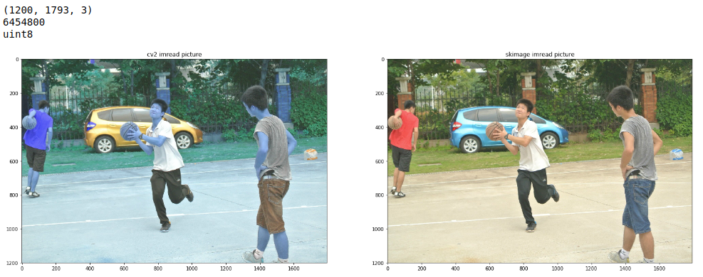
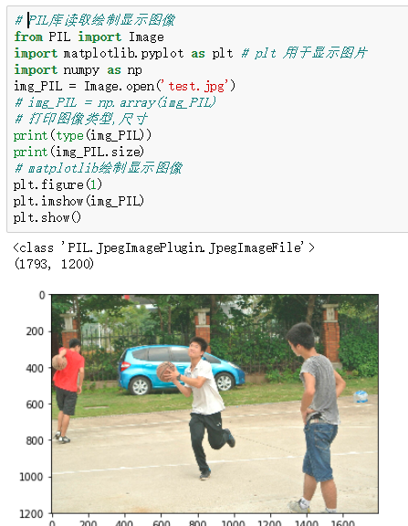
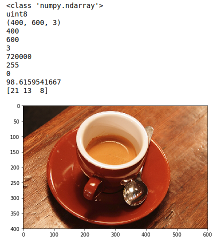
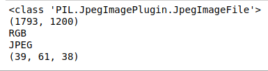

- [读取并显示图像](#读取并显示图像)
  - [opencv3库](#opencv3库)
  - [scikit-image库](#scikit-image库)
  - [PIL库](#pil库)
  - [读取图像结果分析](#读取图像结果分析)
- [打印图像信息](#打印图像信息)
  - [skimage获取图像信息](#skimage获取图像信息)
  - [PIL获取图像信息](#pil获取图像信息)
- [读取并显示图像方法总结](#读取并显示图像方法总结)
  - [PIL库读取图像](#pil库读取图像)
  - [Opencv3读取图像](#opencv3读取图像)
  - [scikit-image库读取图像](#scikit-image库读取图像)
  - [参考资料](#参考资料)

学习数字图像处理，第一步就是读取图像。这里我总结下如何使用 opencv3,scikit-image, PIL 图像处理库读取图片并显示。

## 读取并显示图像
### opencv3库
opencv 读取图像，返回的是矩阵数据，RGB 图像的 shape 是 (height, weight, channel)，dtype 是 uint8。

示例代码如下：

```python
import cv2
# 读入一副彩色图像
img_cv2 = cv2.imread('test.jpg',cv2.IMREAD_COLOR)
# 打印图像尺寸,形状，图像元素数据类型
print(type(img_cv2))
print(img_cv2.shape)    # (height, width, channel)
print(img_cv2.dtype)    # uint8
# matplotlib绘制显示图像
plt.figure(1)
plt.imshow(img_PIL)
plt.show()
# cv2绘制显示图像
# cv2.imshow()
# cv2.namedWindow('image', cv2.WINDOW_NORMAL)
# cv2.imshow('image',img_cv2)
# cv2.waitKey(0)
# cv2.destroyAllWindows()
```
### scikit-image库
示例代码如下：

```python
from skimage import io
img_skimage = io.imread('test.jpg')
# 打印图像尺寸
print(img_skimage.shape)    #(height, width, channel)
# 绘制显示图像
io.imshow(img_skimage)
# import matplotlib.pyplot as plt
# plt.imshow(img_skimage)
```
注意：io.imshow(img\_skimage)，这一行代码的实质是利用matplotlib包对图片进行绘制，绘制成功后，返回一个matplotlib类型的数据。也就是说scikit-image库对图像的绘制实际上是调用了matplotlib库imshow显示函数。

cv2和skimage读取图像，图像的尺寸可以通过其shape属性来获取，shape返回的是一个tuple元组，第一个元素表示图像的高度，第二个表示图像的宽度，第三个表示像素的通道数。

### PIL库
示例代码如下：

```python
# PIL库读取绘制显示图像
# plt 用于显示图片
from PIL import Image
import matplotlib.pyplot as plt

import numpy as np
img_PIL = Image.open('test.jpg')
img_PIL = np.array(img_PIL)
# 打印图像类型,尺寸和总像素个数
print(type(img_PIL)) # <class 'numpy.ndarray'>
print(img_PIL.shape) # (height, width, channel), (1200, 1793, 3)
print(img_PIL.size)  # 6454800 = 1200*1793*3
# 绘制显示图像
plt.figure(1)
plt.imshow(img_PIL)
plt.show()
```
### 读取图像结果分析
分别用Opnecv3和sckit-image读取图像，并用matplotlib库显示。示例代码如下：

```python
import cv2
from skimage import io
import matplotlib.pyplot as plt
img_cv2 = cv2.imread('test.jpg',cv2.IMREAD_COLOR)
img_skimage = io.imread('test.jpg')
# matplotlib显示cv2库读取的图像
plt.figure('imread picture',figsize=(25,25))
plt.subplot(121)
plt.title('cv2 imread picture')
plt.imshow(img_cv2)
# matplotlib显示skimage库读取的图像
plt.subplot(122)
plt.title('skimage imread picture')
plt.imshow(img_skimage)
# 打印图像尺寸,总像素个数,和图像元素数据类型
print(img_cv2.shape)
print(img_cv2.size)
print(img_cv2.dtype)
```


通过以上输出结果对比图，我们会发现，matplotlib绘制显示的cv2库读取的图像与原图有所差别，这是因为opencv3库读取图像的通道时BGR，而正常图像读取的通道都是RGB，matplotlib库显示图像也是按照RGB顺序通道来的，解释完毕。

一点疑惑，我通过查询库函数可知plt.show()第一个参数为要显示的对象（array\_like），字面意思理解为类似数组的对象，但是很明显，PIL库返回的不是’numpy.ndarray’对象，而是’PIL.JpegImagePlugin.JpegImageFile’对象，那为什么plt.show()函数还是能显示Image.open()函数读取图像返回的结果呢？

程序如下图所示：



## 打印图像信息
图像常用信息有图像尺寸，像素个数，通道数等。

### skimage获取图像信息
**注意：scikit-image 库读取和缩放图像速度要慢 opencv 库 近 4 倍。**

```Plain Text
from skimage import io, data
# create coffee image, return (300, 451, 3) uint8 ndarray
img = data.coffee()
io.imshow(img)      # 显示图片
print(type(img))    # 显示类型
print(img.dtype)    # 显示图像元素数据类型
print(img.shape)    # 显示尺寸
print(img.shape[0]) # 图片高度
print(img.shape[1]) # 图片宽度
print(img.shape[2]) # 图片通道数
print(img.size)     # 显示总像素个数=shape[0]*shape[1]*shape[2]
print(img.max())    # 最大像素值
print(img.min())    # 最小像素值
print(img.mean())   # 像素平均值
print(img[0][0])    # 图像第一行第一列的像素值
```
输出结果如下图：



### PIL获取图像信息
```Plain Text
# 获取PIL image图片信息
im = Image.open('test.jpg')
print (type(im))
print (im.size) #图片的尺寸
print (im.mode) #图片的模式
print (im.format) #图片的格式
print (im.getpixel((0,0)))#得到像素：
# img读出来的图片获得某点像素用getpixel((w,h))可以直接返回这个点三个通道的像素值
```
输出结果如下：



plt.show函数定义如下：

> Signature: plt.imshow(X, cmap=None, norm=None, aspect=None, interpolation=None, alpha=None, vmin=None, vmax=None, origin=None, extent=None, shape=None, filternorm=1, filterrad=4.0, imlim=None, resample=None, url=None, hold=None, data=None, \*\*kwargs)
Docstring:
Display an image on the axes.

> Parameters
———-
X : array\_like, shape (n, m) or (n, m, 3) or (n, m, 4). Display the image in XX to current axes. XX may be an array or a PIL image. If XX is an array, it can have the following shapes and types:

> – MxN — values to be mapped (float or int)
– MxNx3 — RGB (float or uint8)
– MxNx4 — RGBA (float or uint8)

> The value for each component of MxNx3 and MxNx4 float arrays should be in the range 0.0 to 1.0. MxN arrays are mapped to colors based on the ∥∥∥∥ (mapping scalar to scalar) and the cmapcmap (mapping the normed scalar to a color).

## 读取并显示图像方法总结
### PIL库读取图像
> PIL.Image.open + numpy
scipy.misc.imread
scipy.ndimage.imread
这些方法都是通过调用PIL.Image.open 读取图像的信息；
**PIL.Image.open 不直接返回numpy对象**，可以用numpy提供的函数进行转换，参考Image和Ndarray互相转换；
scipy.ndimage.imread直接返回numpy.ndarray对象，通道顺序为RGB，通道值得默认范围为0-255。

### Opencv3读取图像
> cv2.imread: 使用opencv读取图像，直接返回numpy.ndarray 对象，通道顺序为BGR ，注意是**BGR**，通道值默认范围0-255。

### scikit-image库读取图像
> skimage.io.imread: 直接返回numpy.ndarray 对象，通道顺序为RGB，通道值默认范围0-255。

### 参考资料
* [https://blog.csdn.net/renelian1572/article/details/78761278](https://blog.csdn.net/renelian1572/article/details/78761278)
* [https://pillow.readthedocs.io/en/5.3.x/index.html](https://pillow.readthedocs.io/en/5.3.x/index.html)
* [http://scikit-image.org/docs/stable/user\_guide.html](http://scikit-image.org/docs/stable/user_guide.html)