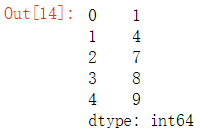
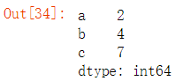
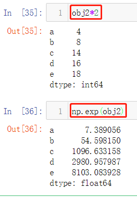
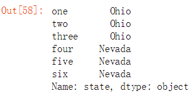
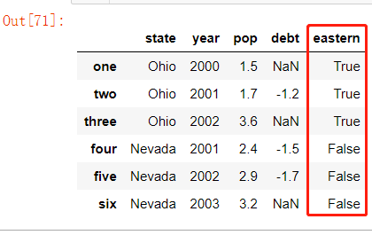
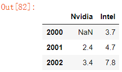
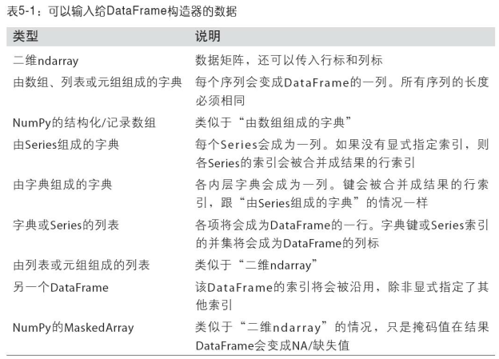
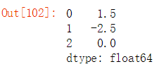

# Python 数据分析-pandas 库入门
# pandas 库概述
pandas 提供了快速便捷处理结构化数据的大量数据结构和函数。自从2010年出现以来，它助使 Python 成为强大而高效的数据分析环境。pandas使用最多的数据结构对象是 DataFrame，它是一个面向列（column-oriented）的二维表结构，另一个是 Series，一个一维的标签化数组对象。

pandas 兼具 NumPy 高性能的数组计算功能以及电子表格和关系型数据库（如SQL）灵活的数据处理功能。它提供了复杂精细的索引功能，能更加便捷地完成重塑、切片和切块、聚合以及选取数据子集等操作。数据操作、准备、清洗是数据分析最重要的技能，pandas 是首选 python 库之一。

个人觉得，学习 pandas 还是最好在 anaconda 的 jupyter 环境下进行，方便断点调试分析，也方便一行行运行代码。

# 安装 pandas
Windows/Linux系统环境下安装

conda方式安装

```Plain Text
conda install pandas
```
pip3方式安装

```Plain Text
py -3 -m pip install --upgrade pandas    #Windows系统
python3 -m pip install --upgrade pandas    #Linux系统
```
# pandas 库使用
pandas 采用了大量的 NumPy 编码风格，但二者最大的不同是 pandas 是专门为处理表格和混杂数据设计的。而 NumPy 更适合处理统一的数值数组数据。

导入 pandas 模块，和常用的子模块 Series 和 DataFrame

```Plain Text
import pands as pd
from pandas import Series,DataFrame
```
通过传递值列表来创建 Series，让 pandas 创建一个默认的整数索引:

```Plain Text
s = pd.Series([1,3,5,np.nan,6,8])
s
```
输出

> 0    1.0
1    3.0
2    5.0
3    NaN
4    6.0
5    8.0
dtype:  float64

# pandas数据结构介绍
要使用 pandas，你首先就得熟悉它的两个主要数据结构：**Series 和 DataFrame**。虽然它们并不能解决所有问题，但它们为大多数应用提供了一种可靠的、易于使用的基础。

## Series数据结构
Series 是一种类似于一维数组的对象，它由一组数据（各种 NumPy 数据类型）以及一组与之相关的数据标签（即索引）组成。仅由一组数据即可产生最简单的 Series。代码示例：

```Plain Text
import pandas as pd
obj = pd.Series([1,4,7,8,9])
obj
```


Series 的字符串表现形式为：索引在左边，值在右边。由于我们没有为数据指定索引，于是会自动创建一个 0 到 N-1（ N 为数据的长度）的整数型索引。也可以通过Series 的 values 和 index 属性获取其数组表示形式和索引对象，代码示例：

```Plain Text
obj.values
obj.index # like range(5)
```
输出：

> array(\[ 1, 4, 7, 8, 9\])
RangeIndex(start=0, stop=5, step=1)

我们也希望所创建的 Series 带有一个可以对各个数据点进行标记的索引，代码示例：

```Plain Text
obj2 = pd.Series([1, 4, 7, 8, 9],index=['a', 'b', 'c', 'd'])
obj2
obj2.index
```
输出

> a    1
b    4
c    7
d    8
e    9
dtype:  int64

> Index(\[‘a’, ‘b’, ‘c’, ‘d’, ‘e’\], dtype=’object’)


与普通 NumPy 数组相比，你可以通过索引的方式选取 Series 中的单个或一组值，代码示例：

```Plain Text
obj2[['a', 'b', 'c']] 
obj2['a']=2
obj2[['a', 'b', 'c']]
```


\[‘a’,’b’,’c\]是索引列表，即使它包含的是字符串而不是整数。

使用 NumPy 函数或类似 NumPy 的运算（如根据布尔型数组进行过滤、标量乘法、应用数学函数等）都会保留索引值的链接，代码示例：

```Plain Text
obj2*2
np.exp(obj2)
```


还可以将 Series 看成是一个定长的有序字典，因为它是索引值到数据值的一个映射。它可以用在许多原本需要字典参数的函数中，代码示例：

```Plain Text
dict = {'Ohio': 35000, 'Texas': 71000, 'Oregon': 16000,'Utah': 5000}
obj3 = pd.Series(dict)
obj3
```
输出

> Ohio 35000

> Oregon 16000

> Texas 71000

> Utah 5000

> dtype: int64


## DataFrame数据结构
DataFrame 是一个表格型的数据结构，它含有一组有序的列，每列可以是不同的值类型（数值、字符串、布尔值等）。DataFrame 既有行索引也有列索引，它可以被看做由 Series 组成的字典（共用同一个索引）。DataFrame 中的数据是以一个或多个二维块存放的（而不是列表、字典或别的一维数据结构）。

> 虽然 DataFrame 是以二维结构保存数据的，但你仍然可以轻松地将其表示为更高维度的数据（层次化索引的表格型结构，这是 pandas中许多高级数据处理功能的关键要素 ）

创建 DataFrame 的办法有很多，最常用的一种是直接传入一个由等长列表或 NumPy 数组组成的字典，代码示例：

```Plain Text
data = {'state': ['Ohio', 'Ohio', 'Ohio', 'Nevada', 'Nevada','Nevada'],
             'year': [2000, 2001, 2002, 2001, 2002, 2003],
              'pop': [1.5, 1.7, 3.6, 2.4, 2.9, 3.2]}
frame = pd.DataFrame(data)
frame
```
结果 DataFrame 会自动加上索引（跟 Series 一样），且全部列会被有序排列，输出如下：


对于特别大的 DataFrame，head 方法会选取前五行：

```Plain Text
frame.head()
```
如果指定了列序列，则 DataFrame 的列就会按照指定顺序进行排列，代码示例：

```Plain Text
pd.DataFrame(data,columns=['state','year','pop'])
```


如果传入的列在数据中找不到，就会在结果中产生缺失值，代码示例：

```Plain Text
frame2 = pd.DataFrame(data,columns=['state','year','pop','debt'],
                                    index=['one','two','three','four','five','six'])
frame2
```


获取 DataFrame 的 columns 和 index，代码示例：

```Plain Text
frame2.columns
frame2.index
```
输出

> Index(\[‘state’, ‘year’, ‘pop’, ‘debt’\], dtype=’object’)

> Index(\[‘one’, ‘two’, ‘three’, ‘four’, ‘five’, ‘six’\], dtype=’object’)


通过类似字典标记的方式或属性的方式，可以将 DataFrame 的列获取为一个 Series，代码示例：

```Plain Text
frame2['state']
frame2.state
```


列可以通过赋值的方式进行修改，赋值方式类似 Series。例如，我们可以给那个空的 “debt” 列赋上一个标量值或一组值（数组或列表形式），代码示例：

```Plain Text
frame2.debt = np.arange(6.)
frame2
```


注意：将列表或数组赋值给某个列时，其长度必须跟DataFrame的长度相匹配。

如果赋值的是一个 Series，就会精确匹配 DataFrame 的索引，所有的空位都将被填上缺失值，代码示例：

```Plain Text
val = pd.Series([-1.2, -1.5, -1.7], index=['two', 'four','five'])
frame2.debt = val
frame2
```
为不存在的列赋值会创建出一个新列。关键字 **del** 用于删除列。

作为 del 的例子，这里先添加一个新的布尔值的列，state 是否为 ‘Ohio’，代码示例：

```Plain Text
frame2['eastern'] = frame2.state=='Ohio'
frame2
```


DataFrame 另一种常见的数据形式是嵌套字典，如果嵌套字典传给 DataFrame，pandas 就会被解释为：外层字典的键作为列，内层键则作为行索引，代码示例：

```Plain Text
#DataFrame另一种常见的数据形式是嵌套字典
pop = {
      'Nvidia':{2001:2.4,2002:3.4},
      'Intel':{2000:3.7,2001:4.7,2002:7.8}
}
frame3 = pd.DataFrame(pop,columns=['Nvidia','Intel'])
frame3
```


**表5-1列出了DataFrame构造函数所能接受的各种数据**



## 索引对象
pandas 的索引对象负责管理轴标签和其他元数据（比如轴名称等）。构建 Series 或 DataFrame 时，所用到的任何数组或其他序列的标签都会被转换成一个 Index，代码示例：

```Plain Text
import numpy as np
import pandas as pd
obj = pd.Series(np.arange(4),index=['a','b','c','d'])
index = obj.index
#index
index[:-1]
```


注意：Index 对象是不可变的，因此用户不能对其进行修改。

不可变可以使 Index 对象在多个数据结构之间安全共享，代码示例：

```Plain Text
#pd.Index储存所有pandas对象的轴标签
#不可变的ndarray实现有序的可切片集
labels = pd.Index(np.arange(3))
obj2 = pd.Series([1.5, -2.5, 0], index=labels)
obj2
#print(obj2.index is labels)
```


> 注意：虽然用户不需要经常使用 Index 的功能，但是因为一些操作会生成包含被索引化的数据，理解它们的工作原理是很重要的。

与 python 的集合不同，pandas 的 Index 可以包含重复的标签，代码示例：

```Plain Text
dup_labels = pd.Index(['foo','foo','bar','alice'])
dup_labels
```
每个索引都有一些方法和属性，它们可用于设置逻辑并回答有关该索引所包含的数据的常见问题。表5-2列出了这些函数。


# pandas 选择数据
```Plain Text
import numpy as np
import pandas as pd
# dates = pd.date_range('20190325', periods=6)
dates = pd.date_range('20190325', periods=6)
df = pd.DataFrame(np.arange(24).reshape((6,4)),index=dates, columns=['A','B','C','D'])
print(df)
'''
             A   B   C   D
2019-03-25   0   1   2   3
2019-03-26   4   5   6   7
2019-03-27   8   9  10  11
2019-03-28  12  13  14  15
2019-03-29  16  17  18  19
2019-03-30  20  21  22  23
'''
# 检索指定A列
print(df['A'])    # 等同于print(df.A)
'''
2019-03-25     0
2019-03-26     4
2019-03-27     8
2019-03-28    12
2019-03-29    16
2019-03-30    20
Freq: D, Name: A, dtype: int64
'''
## 切片选取多行或多列
print(df[0:3])    # 等同于print(df['2019-03-25':'2019-03-27'])
'''
            A  B   C   D
2019-03-25  0  1   2   3
2019-03-26  4  5   6   7
2019-03-27  8  9  10  11
'''
# 根据标签选择数据
# 获取特定行或列
# 指定行数据
print(df.loc['2019-03-25'])
bb = df.loc['2019-03-25']
print(type(bb))
'''
A    0
B    1
C    2
D    3
Name: 2019-03-25 00:00:00, dtype: int64
<class 'pandas.core.series.Series'>
'''
# 指定列, 两种方式
print(df.loc[:, ['A', 'B']])    # print(df.loc[:, 'A':'B'])
'''
             A   B
2019-03-25   0   1
2019-03-26   4   5
2019-03-27   8   9
2019-03-28  12  13
2019-03-29  16  17
2019-03-30  20  21
'''
# 行列同时检索
cc = df.loc['20190325', ['A', 'B']]
print(cc);print(type(cc.values))# numpy ndarray
'''
A    0
B    1
Name: 2019-03-25 00:00:00, dtype: int64
<class 'numpy.ndarray'>
'''
print(df.loc['20190326', 'A'])
'''
4
'''
# 根据序列iloc获取特定位置的值, iloc是根据行数与列数来索引的
print(df.iloc[1,0])     # 13, numpy ndarray
'''
4
'''
print(df.iloc[3:5,1:3]) # 不包含末尾5或3，同列表切片
'''
             B   C
2019-03-28  13  14
2019-03-29  17  18
'''
# 跨行操作
print(df.iloc[[1, 3, 5], 1:3])
'''
             B   C
2019-03-26   5   6
2019-03-28  13  14
2019-03-30  21  22
'''
# 通过判断的筛选
print(df[df.A>8])
'''
             A   B   C   D
2019-03-28  12  13  14  15
2019-03-29  16  17  18  19
2019-03-30  20  21  22  23
'''
```
# 总结
本文主要记录了 Series 和 DataFrame 作为 pandas 库的基本结构的一些特性，如何创建 pandas 对象、指定 columns 和 index 创建 Series 和 DataFrame 对象、赋值操作、属性获取、索引对象等，这章介绍操作 Series 和 DataFrame 中的数据的基本手段。

# 参考资料
* 《利用python进行数据分析》

