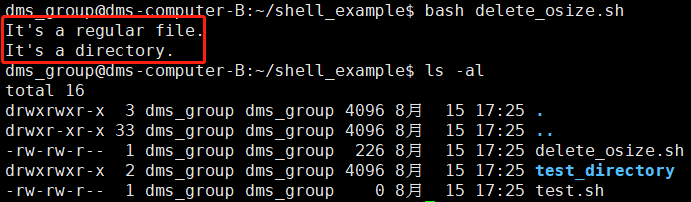

- [Shell 变量](#shell-变量)
	- [使用变量](#使用变量)
	- [只读变量](#只读变量)
	- [删除变量](#删除变量)
	- [变量类型](#变量类型)
- [Shell 字符串](#shell-字符串)
	- [单引号与双引号字符串](#单引号与双引号字符串)
	- [获取字符串长度](#获取字符串长度)
	- [提取子字符串](#提取子字符串)
	- [拼接字符串](#拼接字符串)
- [Shell 数组](#shell-数组)
	- [定义数组](#定义数组)
	- [读取数组](#读取数组)
	- [获取数组的长度](#获取数组的长度)
- [Shell 传递参数](#shell-传递参数)
- [Shell 基本运算符](#shell-基本运算符)
	- [算术运算符](#算术运算符)
	- [关系运算符](#关系运算符)
	- [布尔运算符](#布尔运算符)
	- [逻辑运算符](#逻辑运算符)
	- [字符串运算符](#字符串运算符)
- [Shell 信息输出命令](#shell-信息输出命令)
	- [Shell echo 命令](#shell-echo-命令)
	- [Shell printf 命令](#shell-printf-命令)
	- [%d %s %c %f 格式替代符详解:](#d-s-c-f-格式替代符详解)
	- [printf 的转义序列](#printf-的转义序列)
- [Shell test 命令](#shell-test-命令)
	- [数值测试](#数值测试)
	- [test 检查文件属性](#test-检查文件属性)
- [Shell 流程控制](#shell-流程控制)
	- [if else](#if-else)
	- [if else-if else](#if-else-if-else)
	- [for 循环](#for-循环)
	- [while 语句](#while-语句)
- [Shell 函数](#shell-函数)
	- [局部变量与全局变量](#局部变量与全局变量)
	- [递归函数](#递归函数)
- [常用命令](#常用命令)
- [Shell 正则表达式](#shell-正则表达式)
- [参考资料](#参考资料)

## Shell 变量

在 Shell 脚本中，定义变量直接赋值即可，使用变量时需要在变量名前加美元符号`$`，注意**定义变量时变量名和等号之间不能有空格**。变量名的命名必须遵循以下规则：

+ 命名只能使用英文字母，数字和下划线，首个字符不能以数字开头。
+ 中间不能有空格，可以使用下划线（_）。
+ 不能使用标点符号。
+ 不能使用 bash 里的关键字（可用 help 命令查看保留关键字）。

### 使用变量

使用一个定义过的变量，只要在变量名前面加美元符号即可（推荐给所有变量加上花括号，这是一个好的编程习惯），如：

```Shell
#!/bin/bash
my_name="hongghao.zhang"
echo $my_name
echo ${my_name}
```

> hongghao.zhang
hongghao.zhang

### 只读变量

使用 `readonly` 命令可以将变量定义为只读变量，只读变量的值不能被改变。

### 删除变量

使用 `unset` 变量可以删除变量，语法：`unset variable_name`。

### 变量类型

运行 shell 时，会同时存在三种变量：
1) 局部变量： 局部变量在脚本或命令中定义，仅在当前shell实例中有效，其他shell启动的程序不能访问局部变量。
2) **环境变量**： **所有的程序，包括shell启动的程序，都能访问环境变量**，有些程序需要环境变量来保证其正常运行。必要的时候shell脚本也可以定义环境变量。
3) shell变量： shell变量是由shell程序设置的特殊变量。shell变量中有一部分是环境变量，有一部分是局部变量，这些变量保证了shell的正常运行。

## Shell 字符串

字符串是 shell 编程中最常用最有用的数据类型（除了数字和字符串，也没啥其它类型好用了），字符串可以用单引号，也可以用双引号，也可以不用引号。单双引号的区别跟 PHP 类似。

### 单引号与双引号字符串

单引号字符串限制：

+ 单引号里的任何字符都会原样输出，单引号字符串中的变量是无效的；
+ 单引号字串中不能出现单独一个的单引号（对单引号使用转义符后也不行），但可成对出现，作为字符串拼接使用。

双引号字符串优点：

+ 双引号里可以有变量；
+ 双引号里可以出现**转义字符**，Shell 脚本程序字符型建议都用双引号。

### 获取字符串长度

```Shell
string="honggao.zhang"
echo ${#string}  # 输出13
```

### 提取子字符串

下面实例从字符串第8个字符开始截取5个字符：

```Shell
string="honggao.zhang"
echo ${string:7:5}  # 输出zhang
```

### 拼接字符串

实际脚本中，拼接字符串可能有以下场景：灵活应用即可。

```Python
your_name="qinjx"
greeting="hello, "$your_name" !"
greeting_1="hello, ${your_name} !"
echo $greeting $greeting_1
```

## Shell 数组

bash 支持一维数组，不支持多维数组，并且没有限定数组的大小。类似 C 语言，数组的元素下标也是从 0 开始。获取数组中的元素要利用下标，下标可以是整数或算术表达式，其值应大于或等于 0。 

### 定义数组

在 Shell 中，用括号来表示数组，数组元素用"空格"符号分割开。定义数组的一般形式为：

```Shell
数组名=(值1 值2 ... 值n)
```

### 读取数组

读取数组元素值的一般格式是：
```Shell
${数组名[下表标]}
```
使用 @ 符号可以获取数组中的所有元素，例如：
```Shell
echo ${array_name[@]}
```
### 获取数组的长度
获取数组长度的方法与获取字符串长度的方法相同，例如：
```Shell
# 取得数组元素的个数
length=${#array_name[@]}
# 或者
length=${#array_name[*]}
# 取得数组单个元素的长度
lengthn=${#array_name[n]}
```
更多内容参考[shell脚本——字符串 数组](https://blog.csdn.net/weixin_42167759/article/details/80702517)。

## Shell 传递参数

命令行执行 Shell 脚本时，向脚本传递参数，脚本内获取参数的格式为：`$n`。n 代表一个数字，1 为脚本的第一个参数，2 为脚本的第二个参数，以此类推。特殊字符表示的参数如下：

|参数处理 | 说明|
|--------------|-------|
|$# |传递到脚本的参数个数|
|$$	|脚本运行的当前进程ID号|
|$!	|后台运行的最后一个进程的ID号|
|$\* |以一个单字符形式显示所有向脚本传递的参数，"\$1 \$2 ... $n"的形式输出所有参数|
|$@|与 * 相同，但是使用时加引号，并在引号中返回每个参数。如 `"$@"` 用「"」括起来的情况、以 "\$1" "\$2" … "\$n" 的形式输出所有参数。|
|$-|显示 Shell 使用的当前选项，与set命令功能相同。|
|$?|显示最后命令的退出状态。0表示没有错误，其他任何值表明有错误。|

示例代码如下：

```Shell
#!/bin/bash
# author:harley
echo "=== $* 演示 ==="
for i in "$*"; do
    echo $i
done
echo "====$@ 演示==="
for i in "$@";do
    echo $i
done
```

执行脚本，`bash demo1.sh harley zhang hong`，输出结果如下：

```
=== $* 演示 ===
harley zhang hong
====$@ 演示===
harley
zhang
hong
```

## Shell 基本运算符

Shell 支持多种运算符，如下：

+ 算法运算符
+ 关系运算符
+ 布尔运算符
+ 字符串运算符
+ 文件测试运算符

**字符串判断相等用`=`，数值判断相等用`==`。原生 bash 不支持简单的数学运算**，但是可以通过其他命令来实现，例如 awk 和 expr，expr 最常用。`expr`是一款表达式计算工具，使用它能完成表达式的求值操作。用法如下：

```Shell
#!/bin/bash
val=`expr 3 + 6`
echo "两数之和为：" ${val}  # 两数之和为：9
```

注意：

+ **表达式和运算符之间要有空格**，例如 2+2 是不对的，必须写成 2 + 2，这与我们熟悉的大多数编程语言不一样。
+ **条件表达式都要放在方括号之间，并且要有空格**，例如: [$a==$b] 是错误的，必须写成 [&emsp;\$a&emsp;==&emsp;\$b&emsp;]。
+ 完整的算数表达式要被 \` \` 包含，注意这个字符不是常用的单引号，在 Esc 键下边。
+ **bash 不支持浮点运算**，如果需要进行浮点运算，需要借助 bc,awk 处理。

### 算术运算符

|运算符|说明|举例|
|---------|-------|-----|
|+|	加法	|`expr $a + $b` 结果为 30|
|-|	减法|	`expr $a - $b` 结果为 -10|
|\*|	乘法|	`expr $a \* $b` 结果为 200|
|/|除法|	`expr $b / $a` 结果为 2|
|%|取余|	`expr $b % $a` 结果为 0|
|=|赋值|	a=$b 将把变量 b 的值赋给 a|
|==|相等|用于比较两个数字，相同则返回 true。 `[ $a == $b ]` 返回 false|
|!=|不相等|用于比较两个数字，不相同则返回 true。 `[ $a != $b ]` 返回 true|

算数运算符实例脚本如下：
```shelll
#!/bin/bash
a=10
b=20

val=`expr $a + $b`
echo "a + b : $val"
val=`expr $a - $b`
echo "a - b : $val"
val=`expr $a \* $b`
echo "a * b : $val"
```
脚本运行结果如下：
> a + b : 30
a - b : -10
a * b : 200

### 关系运算符

关系运算符只支持数字，不支持字符串，除非字符串的值是数字。Shell 的关系运算符和 C/C++/Python 不一样，它们的大于用 `>` 表示即可，但是 Shell 得用关键字表示，下表列出了常用得关系运算符，假定变量 a 为 10，变量 b 为 20：

|参数|说明|举例|
|------|-----|-------|
|-eq|等于则为真|`[ $a -eq $b]`返回false|
|-ne|不等于则为真|`[ $a -ne $b]`返回true|
|-gt|大于则为真|`[ $a -gt $b]`返回false|
|-ge|大于等于则为真|`[ $a -ge $b]`返回false|
|-lt|小于则为真|`[ $a -lt $b]`返回true|
|-le|小于等于则为真|`[ $a -le $b]`返回true|

这些关系运算符初学时不必全部记住，编写脚本用到时再来查询也可。

### 布尔运算符

|运算符|说明|举例|
|---------|------|------|
|`!`|非运算符，表达式为 true 则返回 false，否则返回 true |`[ ! false ]` 返回 true |
|`-o`|或运算，有一个表达式为 true 则返回 true |`[ $a -lt 20 -o $b -gt 100 ]` 返回 true |
|`-a`|与运算，两个表达式都为 true 才返回 true |`[ $a -lt 20 -a $b -gt 100 ]` 返回 false |

实例代码如下：
```shell
$ a=120;if [ $a != 120 ];then echo "a != 120";else echo "a == 120";fi   # ! 运算符的用法
a == 120
```

### 逻辑运算符

|运算符|说明|举例|
|---------|------|------|
| `&&` |逻辑的 AND|`[[ $a -lt 100 && $b -gt 100 ]]`|返回 false |
| `||` |逻辑的 OR| `[[ $a -lt 100 || $b -gt 100 ]]` |返回 true|

### 字符串运算符

下表列出了常用的字符串运算符，假定变量 a 为 "abc"，变量 b 为 "efg"：

|运算符|说明|举例|
|---------|------|------|
|=|检测两个字符串是否相等，相等返回 true|`[ $a = $b ]` 返回 false|
|!=|检测两个字符串是否相等，不相等返回 true| `[ $a != $b ]` 返回 true|
|-z|	检测字符串长度是否为0，为0返回 true| `[ -z $a ]` 返回 false|
|-n|	检测字符串长度是否为0，不为0返回 true| `[ -n "$a" ]` 返回 true|
|\$|检测字符串是否为空，不为空返回true| `[ $a ]`返回true|

字符串运算符使用示例代码如下：
```Shell
#!/bin/bash
a="abc"
b="efg"

if [ $a = $b ]
then
   echo "$a = $b : a 等于 b"
else
   echo "$a = $b: a 不等于 b"
fi
if [ $a != $b ]
then
   echo "$a != $b : a 不等于 b"
else
   echo "$a != $b: a 等于 b"
fi
if [ -z $a ]
then
   echo "-z $a : 字符串长度为 0"
else
   echo "-z $a : 字符串长度不为 0"
fi
if [ -n "$a" ]
then
   echo "-n $a : 字符串长度不为 0"
else
   echo "-n $a : 字符串长度为 0"
fi
if [ $a ]
then
   echo "$a : 字符串不为空"
else
   echo "$a : 字符串为空"
fi
```
执行脚本，输出结果如下：
> abc = efg: a 不等于 b
abc != efg : a 不等于 b
-z abc : 字符串长度不为 0
-n abc : 字符串长度不为 0
abc : 字符串不为空

## Shell 信息输出命令

### Shell echo 命令

echo 命令用于字符串的输出，`echo`打印字符串默认换行。

### Shell printf 命令

printf 命令和 echo 命令类似，都是用于信息的输出。

+ printf 命令模仿 C 程序库（library）里的 printf() 程序。
+ printf 由 POSIX 标准所定义，因此使用 printf 的脚本比使用 echo 移植性好。
+ printf 使用引用文本或空格分隔的参数，外面可以在 printf 中使用格式化字符串，还可以制定字符串的宽度、左右对齐方式等。默认 printf 不会像 echo 自动添加换行符，我们可以手动添加 `\n`。

`printf` 命令语法如下：
```
printf format-string [arguments...]
```
**参数说明**：
+ format-string: 为格式控制字符串
+ arguments:为参数列表

示例程序如下：
```Shell
#!/bin/bash
printf "%-10s %-8s %-4s %12s\n" 姓名 性别 体重kg 学号
printf "%-10s %-8s %-4.2f %12d\n" 郭靖 男 66.1234 2017210675
printf "%-10s %-8s %-4.2f %12d\n" 杨过 男 48.6543 2017210688
printf "%-10s %-8s %-4.2f %12d\n" 郭芙 女 47.9876 2017210889
```
执行脚本，程序输出如下：
> 姓名 性别 体重kg 学号
郭靖 男 66.12 2017210675
杨过 男 48.65 2017210688
郭芙 女 47.99 2017210889

格式控制字符串解释：
+ %s %c %d %f都是格式替代符
+ %-10s 指一个宽度为10个字符（-表示左对齐，没有则表示右对齐），任何字符都会被显示在10个字符宽的字符内，如果不足则自动以空格填充，超过也会将内容全部显示出来。
+ %-4.2f 指格式化为小数，其中**.2指保留2位小数**。

### %d %s %c %f 格式替代符详解:

+ d: Decimal 十进制整数 -- 对应位置参数必须是十进制整数，否则报错！
+ s: String 字符串 -- 对应位置参数必须是字符串或者字符型，否则报错！
+ c: Char 字符 -- 对应位置参数必须是字符串或者字符型，否则报错！
+ f: Float 浮点 -- 对应位置参数必须是数字型，否则报错!

### printf 的转义序列

|序列|说明|
|-------|-----|
|`\a`| 警告字符，通常为ASCII的BEL字符|
|`\f`|换页|
|`\n`|换行|
|`\t`|水平制表符|
|`\r`|回车|

## Shell test 命令

Shell 中的 test 命令用于检查某个条件是否成立，可以进行数值、字符和文件三个方面的测试。

### 数值测试
这是关系运算符，只支持数字，不支持字符串，除非字符串的值是数字。

|参数|说明|
|------|-----|
|-eq| 等于则为真|
|-ne|	不等于则为真|
|-gt|	大于则为真|
|-ge|	大于等于则为真|
|-lt|	小于则为真|
|-le|	小于等于则为真|

符号含义：
1. eq （equal的缩写），表示等于为真
2. ne (not equal的缩写），表示不等于为真
3. gt (greater than的缩写），表示大于为真
4. ge （greater&equal的缩写），表示大于等于为真
5. lt （lower than的缩写），表示小于为真
6. le （lower&equal的缩写），表示小于等于为真

实例代码如下：
```Shell
#!/bin/bash
# 关系运算符判断
num1=100
num2=333
if test $num1 -eq $num2
then
  echo "两个数相等"
else
  echo "两个数不相等"
fi
# 算术运算符判断
str1="honggao"
str2="hong.hao"
echo "传递的参数为: $*"
if [ $1 = $2i ]
then
  echo "两个输入字符串相等"
else
  echo "输入的两个字符串不相等"
fi
```
执行脚本(`sh comm_test.sh eere wdwe2`)，输出如下：
> 两个数不相等
传递的参数为: eere wdwe2
输入的两个字符串 不相等

### test 检查文件属性

检查文件属性也是 `test` 的常见用法，比如检查一个文件类型是不是普通文件，可以使用 `-f` 选项，检查路径是否是目录可以用 `-d` 选项：
```Python
touch test.sh
filename="test.sh"
# 检查文件
if test -f "$filename";then
    echo "It's a regular file."
fi
# 检查目录
dirname="test_directory"
mkdir $dirname
if test -d "$dirname";then
    echo "It's a directory."
fi
```

运行脚本，输出如下：



`test` 命令是shell编程中非常重要的命令，一定要掌握！下面是其他一些常用的文件检查运算符：

```shell
-b file : 文件存在并且是块设备文件。
-c file : 文件存在并且是字符设备文件。
-d file : 文件存在并且是一个目录。
-e file : 文件存在。
-f file : 文件存在并且是一般文件。
-g file : 文件存在并且设置了 setgid 位。
-h file : 文件存在并且是一个链接文件。
-p file : 文件存在并且是一个命名管道(FIFO)。
-r file : 文件存在并且是可读的。
-s file : 文件存在并且有内容。
-u file : 文件存在并且设置了 setuid。
-w file : 文件存在并且是可写的。
-x file : 文件存在并且是可执行的。
-S file : 文件存在并且是一个 socket。
```
## Shell 流程控制

`Shell` 的流程控制不可为空。

### if else

if else语法格式：

```Shell
if condition
then
    command1
    command2
    command3
else
    command
fi
```

### if else-if else

`if else-if else` 语法格式如下：
```Shell
if condition1
then
    command1
elif condition2
then
    command2
else
    commandN
fi
```

根据 width、height 计算 BMI 指数脚本实例代码如下：

```Shell
echo "pleae input your weight and height"  # 无法支持输入小数
pf=`expr $2 \* $2`
bmi=`expr $1 / $pf`
echo "your bmi is: $bmi"
a=18
b=25
c=28
d=32
if [ $bmi -le $a ]
then
  echo "体重过轻"
elif [ $bmi -le $b ]
then
  echo "体重正常"
elif [ $bmi -le $c ]
then
  echo "体重过重"
elif [ $bmi -le $d ]
then
  echo "体重肥胖"
elif [ $bmi -gt $d ]
then
  echo "严重肥胖"
fi
```

执行脚本(`sh if_else.sh 64 2`)，程序输出如下：
> pleae input your weight and height
your bmi is: 16
体重过轻

### for 循环

for 循环格式为：
```Shell
for var in item1 item2 ... itemN
do
    command1
    command2
    ...
    commandN
done
```

### while 语句

while 循环用于不断执行一系列命令，也可用于从输入文件中读取数据；命令通常为测试条件，其格式为：
```Shell
while condition
do
    command
done
```

## Shell 函数

shell 函数中的定义格式如下：

```Python
[ function ] funname [()]
{
    action;
    [return int;]
}
```

参数说明：
+ 可以带 function fun() 定义，也可以直接 `fun()` 定义,不带任何参数。
+ 执行函数直接使用 `funname` 即可。

### 局部变量与全局变量

```Python
# !/bin/bash
a="this is a" # 定义全局变量
b="this is b"
function funname() {
    local_c="this is c" # 定义局部变量
    echo $a, $b
    echo $local_c
    return 0   # shell 函数返回值是整形，并且在 0-257 之间
}
echo $d  # 打印不会生效，因为 d 是局部变量
funname  # 执行函数 funname
```
执行上诉程序 `bash fun_test.sh`，输出如下：
> this is a, this is b
this is c

### 递归函数

bash 也是支持递归函数的（能够调用自身的函数），示例程序如下：

```Python
#!/bin/bash
function name() {
    echo $1
    name hello
    sleep 1
}
name
```

运行此脚本后不断打印出 hello，按 `ctrl+c` 结束。

## 常用命令

`ps、grep、awk、sed` 三剑客

## Shell 正则表达式

参考博客[Shell 正则表达式](https://man.linuxde.net/docs/shell_regex.html)。

## 参考资料

- [菜鸟教程-shell教程](https://www.runoob.com/linux/linux-shell-process-control.html)
- [Linux 命令行与 Shell 脚本教程](Linux 命令行与 Shell 脚本教程)