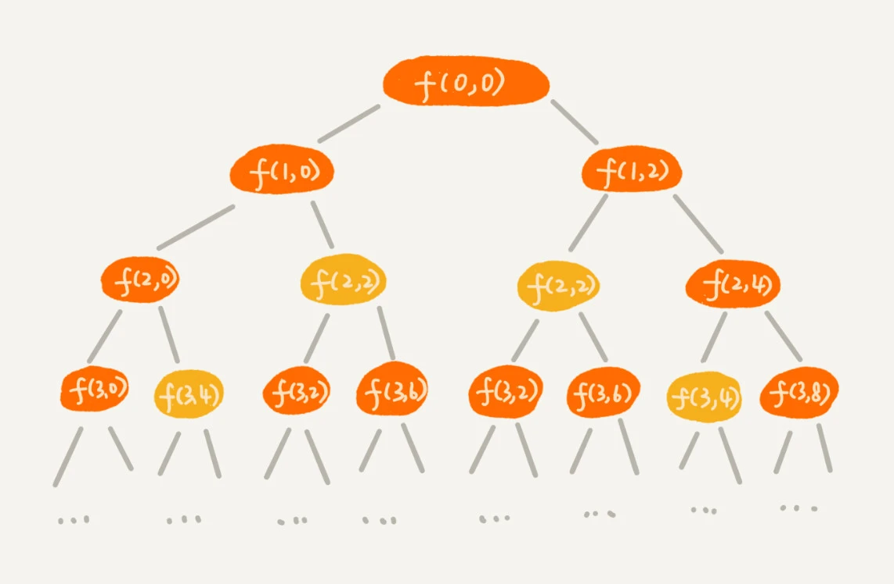
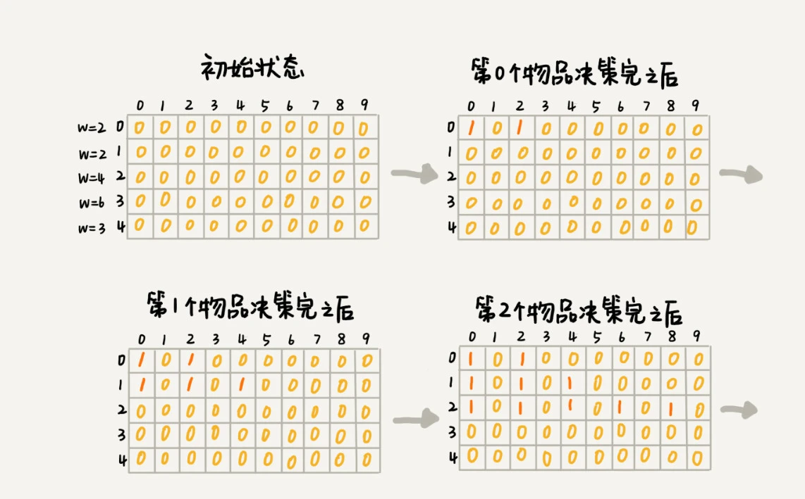
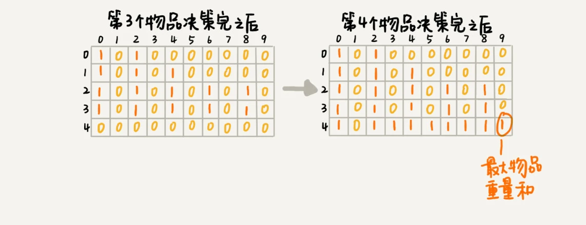

### 一，动态规划概念

动态规划比较适合用来求解最优问题，比如求最大值、最小值等等。它可以非常显著地降低时间复杂度，提高代码的执行效率。

它和递归一样都非常难学，主要学习难点在于求解问题的过程不太符合人类常规的思维方式。

#### 二，0-1 背包问题

对于一组不同重量、不可分割的物品，我们需要选择一些装入背包，在满足背包最大重量限制的前提下，背包中物品总重量的最大值是多少呢？

关于这个 `0-1` 背包问题，上一节学习了回溯的解决方法，也就是穷举搜索所有可能的装法（时间复杂度指数级），然后找出满足条件的最大值。有没有什么规律，可以有效降低时间复杂度呢？

**1，回溯法的求解过程：**

直接看代码，规律是不好的，画个求解过程图（递归树）会好看些。假设背包的最大承载重量是 `9`，有 `5` 个不同的物品，每个物品的重量分别是 `2，2，4，6，3`。求解过程的递归树如下图所示。



递归树中的每个节点表示一种状态，我们用`（i, cw）`来表示。其中，`i` 表示将要决策第几个物品是否装入背包，`cw` 表示当前背包中物品的总重量。比如，`（2，2）` 表示我们将要决策第 `2` 个物品是否装入背包，在决策前，背包中物品的总重量是 `2`。这里使用回溯算法，从递归树中可以发现其中有些子问题的求解是重复的，且时间复杂度是指数级的。

**使用”备忘录”（记忆化递归）的解决方式**，记录已经计算好的 `f(i, cw)`，当再次计算到重复的 `f(i, cw)` 的时候，可以直接从备忘录中取出来用，就不用再递归计算了，这样就可以避免冗余计算。

```cpp
int maxW = 0;
int weight[6] = {2,2,4,6,3};  // 物品重量
int n = 5;  // 物品个数 
int w = 9;  // 背包承受的最大重量
bool mem[5][10];  // 备忘录，默认值false

// 记忆化递归算法实现
class SolutionBacktracking{
public:
    void f(int i, int cw){  // i 表示放第 i 个物品，cw 表示当前装进背包的物品的重量和
        if (cw == w || i == n) { // cw==w表示装满了，i==n表示物品都考察完了
            if(cw > maxW)  maxW = cw;
            return;
        }
        if(mem[i][cw]) return;  // 重复状态
        mem[i][cw] = true; // 记录状态

        f(i+1, cw);  // 不放第 i 个物品
        if(cw+weight[i] <= w)
            f(i+1, cw+weight[i]);  // 放第 i 个物品
    }
};
```

这里依然是基于回溯算法实现的，但是采用了**记忆化递归**的方法，时间复杂度和空间复杂度都是 $O(n*(w+1))$，$n$ 为物品个数，$w$ 表示背包承受的最大重量。

**2，动态规划求解过程如下**：

把整个求解过程分为 `n` 个阶段，每个阶段会决策一个物品是否放到背包中。每个物品决策（放入或者不放入背包）完之后，背包中的物品的重量会有多种情况，也就是说，会达到多种不同的状态，对应到递归树中，就是有很多不同的节点。

我们**把每一层重复的状态（节点）合并，只记录不同的状态，然后基于上一层的状态集合，来推导下一层的状态集合**。我们可以通过合并每一层重复的状态，这样就保证每一层不同状态的个数都不会超过 `w` 个（w 表示背包的承载重量），也就是例子中的 `9`。于是，我们就成功避免了每层状态个数的指数级增长。动态规划方法的计算过程如下图：





我们用一个二维数组 `states[n][w+1]`，来记录每层可以达到的不同状态。`0-1` 背包问题的动态规划解法的 `C++` 代码如下：

```cpp
class SolutionDP1{
public:
    // weight:物品重量，n:物品个数，w:背包可承载重量
    int knapsack1(int weight[], int n, int w){
        vector<vector<bool> >states(n, vector<bool>(w+1, false));
        // 初始化 states 第一个阶段的状态
        states[0][0] = true;  // 第一个物品不放进背包
        if(weight[0] <= w) states[0][weight[0]] = true;  // 第一个物品放进背包
        // 动态规划-分阶段
        for(int i=1; i<n;i++){
            for(int j=0; j<w; j++)  {  // 第 i 个物品不放进背包{}
                if(states[i-1][j]) states[i][j] = states[i-1][j];
            }
            for(int j=0; j<=w-weight[i];j++){ // 第 i 个物品放入背包
                if(states[i-1][j]) states[i][j+weight[i]] = true;
            }
        }

        // 在最后一层变量找到最接近 w 的重量并输出结果
        for(int i=w; i>0; i--){  
            if(states[n-1][i]) return i;
        }
        return 0;
    }
};
```

这就是一种用动态规划解决问题的思路。我们把问题分解为多个阶段，每个阶段对应一个决策。我们记录每一个阶段可达的状态集合（去掉重复的），然后通过当前阶段的状态集合，来推导下一个阶段的状态集合，动态地往前推进。这也是动态规划这个名字的由来，你可以自己体会一下

> 首先，可以分解为多阶段，其次，状态去重，最后当前阶段可以利用上一个阶段来获取。这是动态规划的关键。

我们知道回溯算法解决这个问题的时间复杂度是 $O(2^n)$、指数级，那动态规划解决方案的时间复杂度是多少呢？来分析一下，这个代码的时间复杂度非常好分析，耗时最多的部分就是代码中的两层 `for` 循环，所以时间复杂度是 $O(n*w)$。$n$ 表示物品个数，$w$ 表示背包可以承载的总重量。

虽然动态规划的时间效率较高，但是空间复杂度为 $O(n*w)$，对空间消耗比较大。我们可以考虑用一个大小为 $w+1$ 的一维数组代替二维数组，减少内存消耗。代码如下：

```cpp
class SolutionDP2{
public:
    // weight:物品重量，n:物品个数，w:背包可承载重量
    int knapsack2(int weight[], int n, int w){
        vector<bool> states(w+1, false);
        // int *states=new int [m+1]; // 动态分配,数组长度为 m
        states[0] = true;  // 第一个物品不放进背包
        if(weight[0] < w) states[weight[0]] = true;  // 第一个物品放进背包
        
        // 动态规划-分阶段
        for(int i=1; i<n;i++){
            for(int j=w-weight[i]; j>=0; j--)  {  // 第 i 个物品放进背包
                if(states[j]) states[j+weight[i]] = true;
            }
        }

        // 在最后一层变量找到最接近 w 的重量并输出结果
        for(int i=w;i>0;i--){  
            if(states[i]) return i;
        }
        return 0;
    }
};
```

程序分析：遍历每个物品，将该物品放入背包时，在不超过最大重量的前提下，再遍历查看之前的放入记录，将之前可能出现的重量的和当前物品的重量相加再记录下来，等所有方案都尝试过后，可能出现的背包重量也都被记录下来了，最后，从中选择一个最大值返回。

### 三，0-1 背包问题升级版

前面讲的背包问题，只涉及背包重量和物品重量。现在引入物品价值这一变量。对于一组不同重量、不同价值、不可分割的物品，我们选择将某些物品装入背包，在满足背包最大重量限制的前提下，背包中可装入物品的总价值最大是多少呢？

1，这个问题依旧可以先用回溯算法来解决，代码如下：

```cpp
// 0-1 背包问题升级版的回溯解法
int maxV = 0; // 结果放到maxV中
int weight[] = {2，2，4，6，3};  // 物品的重量
int value[] = {3，4，8，9，6}; // 物品的价值
int n = 5; // 物品个数
int w = 9; // 背包承受的最大重量

class Solution{
public:
    void f(int i, int cw, int cv) { // 调用f(0, 0, 0)
        if (cw == w || i == n) { // cw==w表示装满了，i==n表示物品都考察完了
            if(cv > maxV)  maxV = cv;
            return;
        }
        if(cv > maxV) maxV = cv;
        f(i+1, cw, cv);  // 不放第 i 个物品
        if(cw+weight[i] <= w) f(i+1, cw+weight[i], cv+value[i]) // 放第 i 个物品
    }
};
```

2，使用动态规划解决这个问题更高效。把整个求解过程分为 $n$ 个阶段，每个阶段会决策一个物品是否放到背包中。每个阶段决策完之后，背包中的物品的总重量以及总价值，会有多种情况，也就是会达到多种不同的状态。我们用一个二维数组 `states[n][w+1]`，来记录每层可以达到的不同状态。

```cpp
class SolutionDP3{
    int knapsack3(int weight[], int value[], int n, int w) {
        vector<vector<int> > states(n, vector<int>(w+1, -1));
        states[0][0] = 0; // 不放入第 0 个物品
        if(weight[0] < w) states[0][weight[0]] = value[0];  // 放入第 0 个物品

        for(int i=1; i<n; i++){
            for(int j=0; j< w; j++){  // 不放入第 i 个物品
                if(states[i-1][j])  states[i][j] = states[i-1][j];
            }

            for(int j=0; j< w-weight[i]; j++){ // 放入第 i 个物品
                int v = states[i-1][j] + values;
                if(v > states[i][j+weight[i]]) 
                    states[i][j+weight[i]] = v;
            }
        }

        int maxV = -1;
        for(int j = w; j>=0; j--){
            if(states[n-1][j] > maxV) maxV = states[n-1][j];
        }

        return maxV;
    }
}
```

代码的时间复杂度是 $O(n\cdot w)$，空间复杂度也是 $O(n\cdot w)$。

### 四，总结

大部分动态规划能解决的问题，都可以通过回溯算法来解决，只不过回溯算法解决起来效率比较低，时间复杂度是指数级的。动态规划算法，在执行效率方面，要高很多。尽管执行效率提高了，但是动态规划的空间复杂度也提高了，所以，很多时候，我们会说，动态规划是一种空间换时间的算法思想。

### 五，练习题

#### 5.1，leetcode322 零钱兑换

给你一个整数数组 `coins` ，表示不同面额的硬币；以及一个整数 `amount` ，表示总金额。计算并返回可以凑成总金额所需的 最少的硬币个数 。如果没有任何一种硬币组合能组成总金额，返回 `-1` 。

你可以认为每种硬币的数量是无限的。

动态规划解法的 `C++` 代码如下：

```cpp
class Solution {
public:
    int coinChange(vector<int>& coins, int amount) {
        int Max = amount + 1;
        vector<int> dp(amount + 1, Max);
        dp[0] = 0;
        for (int i = 1; i <= amount; ++i) {
            for (int j = 0; j < (int)coins.size(); ++j) {
                if (coins[j] <= i) {
                    dp[i] = min(dp[i], dp[i - coins[j]] + 1);
                }
            }
        }
        return dp[amount] > amount ? -1 : dp[amount];
    }
};
```

### 参考资料

[初识动态规划：如何巧妙解决“双十一”购物时的凑单问题？](https://time.geekbang.org/column/article/74788)

