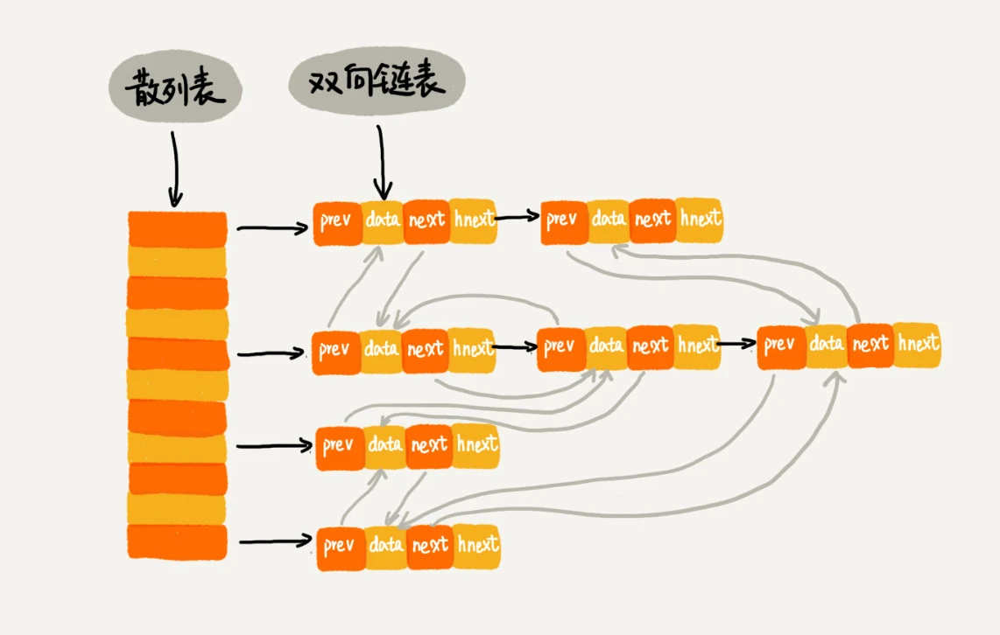

### 一，概述

散列表和链表这两种数据结构经常被放到一起使用。比如 `Redis` 的有序集合不仅使用了跳表，还用了散列表。再比如 `Java` 语言中的 `LinkedHashMap` 容器，也用到了散列表和链表两种数据结构。

### 二，LRU 缓冲淘汰算法

缓存是一种提高数据读取性能的技术，在硬件设计、软件开发中都有着非常广泛的应用，比如硬件中的缓存: `cpu` 缓存，而 `cpu` 缓存又可以分为一级缓存(`L1 Cache`)，二级缓存(`L2 Cache`)，三级缓存(`L3 Cache`)。 软件中的缓存: 数据库缓存，数据库本身产品就自带缓存，`redis` 也可以作为数据库缓存。浏览器缓存，就是我们常说的 `Cookie`，本质上就是一个文件。

> 在计算机系统中，`CPU` 高速缓存（英语：`CPU Cache`）是用于减少处理器访问内存所需平均时间的部件。在金字塔式存储体系中它位于自顶向下的第二层，仅次于 `CPU`寄存器。其容量远小于内存，但速度却可以接近处理器的频率。

缓存的大小有限，当缓存被用满时，哪些数据应该被清理出去，哪些数据应该被保留？这就需要**缓存淘汰策略**来决定。常见的策略有三种：先进先出策略 `FIFO`（`First In，First Out`）、最少使用策略 `LFU`（`Least Frequently Used`）、最近最少使用策略 `LRU`（`Least Recently Used`）。

#### 2.1，基于链表实现 LRU 缓存淘汰算法

算法思路：

首先维护一个有序单链表，越靠近链表尾部的结点是越早之前访问的。当有一个新的数据被访问时，我们从链表头开始顺序遍历链表。

1，如果此数据之前已经被缓存在链表中了，我们遍历得到这个数据对应的结点，并将其从原来的位置删除，然后再插入到链表的头部。

2，如果此数据没有在缓存链表中，又可以分为两种情况：
   + 如果此时缓存未满，则将此结点直接插入到链表的头部；
   + 如果此时缓存已满，则链表尾结点删除，将新的数据结点插入链表的头部。

到此为止，我们就用链表实现了一个 LRU 缓存。

#### 2.2，基于链表和散列表的组合实现 LRU 

假设我们需要维护一个按照访问时间从大到小有序排列的链表结构。因为缓存大小有限，当缓存空间不够，需要淘汰一个数据的时候，我们就直接将链表头部的结点删除。

当要缓存某个数据的时候，先在链表中查找这个数据。如果没有找到，则直接将数据放到链表的尾部；如果找到了，我们就把它移动到链表的尾部。因为查找数据需要遍历链表，所以单纯用链表实现的 LRU 缓存淘汰算法的时间复杂很高，是 O(n)。

一个缓存（`cache`）系统主要包含下面这几个操作：

+ 往缓存中添加一个数据；
+ 从缓存中删除一个数据；
+ 在缓存中查找一个数据。
  
这三个操作都要涉及“查找”操作，如果单纯地采用链表的话，时间复杂度只能是 $O(n)$。如果我们将散列表和链表两种数据结构组合使用，可以将这三个操作的时间复杂度都降低到 $O(1)$。具体的结构如下图：

这里使用双向链表存储数据，与之前的双向链表不同，链表中的每个结点除了存储数据（`data`）、前驱指针（`prev`）、后继指针（`next`）之外，还新增了一个特殊的字段 `hnext`。

这里的散列表是通过链表法解决散列冲突的，所以从逻辑上讲每个结点会在两条链中（**但实际物理上还是只有一个双向链表**）。一个链是双向链表，另一个链是散列表中的拉链，拉链就是指散列表 `hash` 冲突所维护的那个单链表。

这里双向链表的 `prev` 和 `next` 指针是纵向指针，`hnext` 是横向指针，`hnexh` 指针维护的是散列表解决冲突的单链表，`prev` 和 `next` 指针的双链表维护的是数据缓存的时间线，决策对节点的淘汰和增加。

> 举例分析：第一个槽位(`slot`)的最后一个节点应该是在添加时发现有散列冲突，且属于第一个槽位，所以用 `hnext` 指针和第一个槽位的第一个节点相连，然后又因为时间上是最后一个插入的节点，所以和第五个槽位的最后一个节点通过 `pre`、`next` 相连在一起。综上，通过图中的 `pre`、`next` 指针连接顺序（浅色线），我们可以明显得出节点的时间顺序，通过 `hnext` 指针（黑色线）可以知道节点在哪个槽中。

在散列表和链表组合的存储结构中实现 `LRU`，查找和删除一个数据的时间复杂度都是 $O(1)$。

> 在散列表中查找一个元素时，这个元素就是散列表定义中的 `key`，通过散列函数 `hash(key)` 得到散列值，从而找到对应数组下标，即找到对应的槽位(`slot`)，最后遍历槽位对应的链表。

添加数据到缓存的操作会稍微有点麻烦，我们需要先看这个数据是否已经在缓存中。如果已经在其中，需要将其移动到双向链表的尾部；如果不在其中，还要看缓存有没有满。如果满了，则将双向链表头部的结点删除，然后再将数据放到链表的尾部；如果没有满，就直接将数据放到链表的尾部。

这整个过程涉及的查找操作都可以通过散列表来完成。其他的操作，比如删除头结点、链表尾部插入数据等，都可以在 $O(1)$ 的时间复杂度内完成。所以，这三个操作的时间复杂度都是 $O(1)$。至此，我们就通过散列表和双向链表的组合使用，实现了一个高效的、支持 `LRU` 缓存淘汰算法的缓存系统原型。

### 三，Redis 有序集合

在有序集合中，每个成员对象有两个重要的属性，`key`（键值）和 `score`（分值）。我们不仅会通过 `score` 来查找数据，还会通过 `key` 来查找数据。

细化一下 `Redis` 有序集合的操作，如下：

+ 添加一个成员对象；
+ 按照键值来删除一个成员对象；
+ 按照键值来查找一个成员对象；
+ 按照分值区间查找数据，比如查找积分在[100, 356]之间的成员对象；
+ 按照分值从小到大排序成员变量；

如果我们仅仅按照分值将成员对象组织成跳表的结构，那按照键值来删除、查询成员对象就会很慢，解决方法与 `LRU` 缓存淘汰算法的解决方法类似。**我们可以再按照键值构建一个散列表**，这样按照 `key` 来删除、查找一个成员对象的时间复杂度就变成了 $O(1)$。同时，借助跳表结构，其他操作也非常高效。

### 四，Java LinkedHashMap

`LinkedHashMap` 使用三列表和链表组合实现，可以按照插入顺序遍历数据、支持按照访问顺序来遍历数据。

实际上，`LinkedHashMap` 是通过双向链表和散列表这两种数据结构组合实现的。`LinkedHashMap` 中的 `“Linked”` 实际上是指的是双向链表，并非指用链表法解决散列冲突。

`Python` 中的 `OrderedDict` 也有这个特性，`Key` 会按照插入的顺序排列，不是 `Key` 本身排序。注意，使用 `dict` 时，`Key` 是无序的。

### 五，为什么散列表经常和链表结构一起使用

散列表这种数据结构虽然支持非常高效的数据插入、删除、查找操作，但是散列表中的数据都是通过散列函数打乱之后无规律存储的。也就说，它无法支持按照某种顺序快速地遍历数据。如果希望按照顺序遍历散列表中的数据，那我们需要将散列表中的数据拷贝到数组中，然后排序，再遍历。

但是散列表是动态数据结构，不停地有数据的插入、删除，所以每当我们希望按顺序遍历散列表中的数据的时候，都需要先排序，那这样效率势必会很低。为了解决这个问题，所以我们将散列表和链表（或者跳表）结合在一起使用，**提高顺序遍历散列表中数据的效率**。

### 参考资料

+ [CPU缓存-维基百科](https://zh.wikipedia.org/wiki/CPU%E7%BC%93%E5%AD%98)