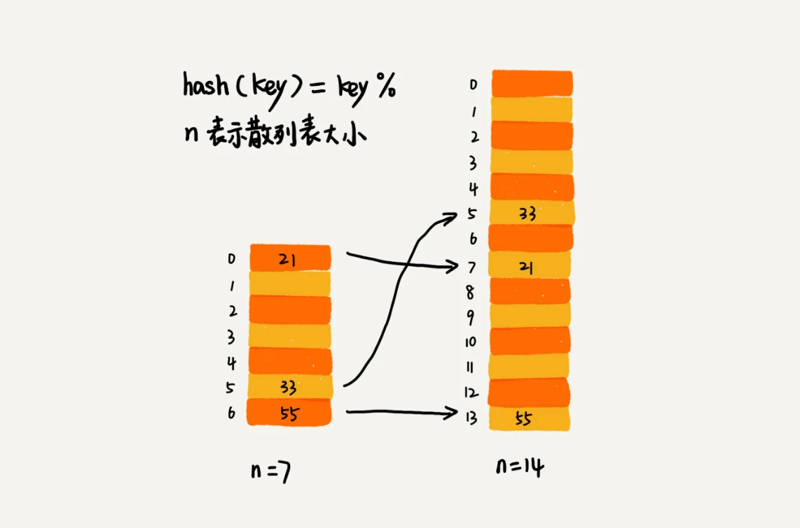
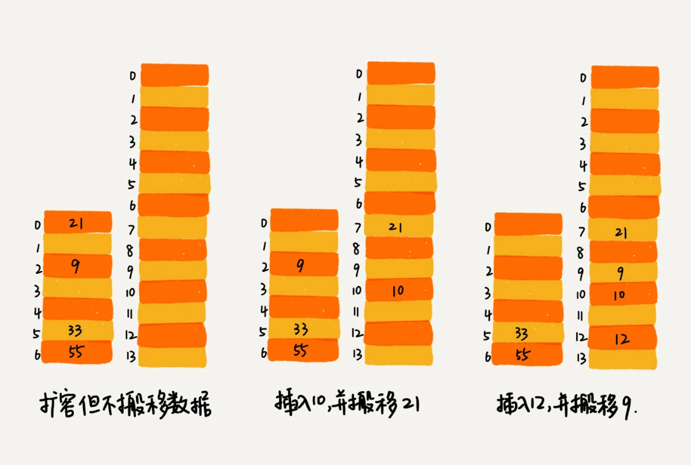

### 一，散列表的查找元素问题

散列表的查询效率并不能笼统地说成是 $O(1)$。它跟散列函数、装载因子、散列冲突等都有关系。如果散列函数设计得不好，或者装载因子过高，都可能导致散列冲突发生的概率升高，查询效率下降。

### 二，如何设计一个哈希函数？

**散列函数设计的好坏，决定了散列表冲突的概率大小，也直接决定了散列表的性能**。那什么才是好的散列函数呢？

首先，散列函数的设计不能太复杂。过于复杂的散列函数，势必会消耗很多计算时间，也就间接地影响到散列表的性能。其次，散列函数生成的值要尽可能随机并且均匀分布，这样才能避免或者最小化散列冲突，而且即便出现冲突，散列到每个槽里的数据也会比较平均，不会出现某个槽内数据特别多的情况。

常见的散列函数的设计方法有**直接寻址法、平方取中法、折叠法、随机数法**等。

### 三，装载因子过大了怎么办？

装载因子越大，说明散列表中元素越多，空闲位置越少，发生散列冲突的概率就越大。不仅插入数据的过程要多次寻址或者拉很长的链，查找的过程也会因此变得很慢。

我们知道数组、栈和队列可以进行动态扩容，同样地，针对散列表，当装载因子过大时，我们也可以进行动态扩容，重新申请一个更大的散列表，将数据搬移到这个新散列表中。

针对数组的扩容，数据搬移操作比较简单。但是，针对散列表的扩容，数据搬移操作要复杂很多。因为散列表的大小变了，数据的存储位置也变了，**所以我们需要通过散列函数重新计算每个数据的存储位置**。

下图例子中。在原来的散列表中，`21` 这个元素原来存储在下标为 `0` 的位置，搬移到新的散列表中，存储在下标为 `7` 的位置。

插入一个数据，最好情况下，不需要扩容，最好时间复杂度是 $O(1)$。最坏情况下，散列表装载因子过高，启动扩容，我们需要重新申请内存空间，重新计算哈希位置，并且搬移数据，所以时间复杂度是 $O(n)$。用摊还分析法，均摊情况下，时间复杂度接近最好情况，就是 $O(1)$。

### 四，如何避免低效的扩容？

为了解决一次性扩容耗时过多的情况，我们可以将扩容操作穿插在插入操作的过程中，分批完成。

当装载因子触达阈值之后，我们只申请新空间，但并不将老的数据搬移到新散列表中。当有新数据要插入时，我们将新数据插入新散列表中，并且从老的散列表中拿出一个数据放入到新散列表。每次插入一个数据到散列表，我们都重复上面的过程。经过多次插入操作之后，老的散列表中的数据就一点一点全部搬移到新散列表中了。这样没有了集中的一次性数据搬移，插入操作就都变得很快了。

通过这样均摊的方法，将一次性扩容的代价，均摊到多次插入操作中，就避免了一次性扩容耗时过多的情况。这种实现方式，任何情况下，插入一个数据的时间复杂度都是 O(1)。

### 五，如何选择冲突解决方法？

上一章的学习我们知道，有两种解决散列冲突的方法：开放地址法和链表法，两种方法各有优劣和不同的适用场景。

**1，开放寻址法**

开放寻址法不像链表法，需要拉很多链表。散列表中的数据都存储在数组中，可以有效地利用 CPU 缓存加快查询速度。

用开放寻址法解决冲突的散列表，删除数据的时候比较麻烦，需要特殊标记已经删除掉的数据。而且，在开放寻址法中，所有的数据都存储在一个数组中，比起链表法来说，冲突的代价更高。所以，使用开放寻址法解决冲突的散列表，装载因子的上限不能太大。这也导致这种方法比链表法更浪费内存空间。

总结一下，**当数据量比较小、装载因子小的时候，适合采用开放寻址法。这也是 `Java` 中的 `ThreadLocalMap` 使用开放寻址法解决散列冲突的原因。**

**2，链表法**

首先，链表法对内存的利用率比开放寻址法要高。因为链表结点可以在需要的时候再创建，并不需要像开放寻址法那样事先申请好。这一点也是链表优于数组的地方。

链表法比起开放寻址法，对大装载因子的容忍度更高。开放寻址法只能适用装载因子小于 `1` 的情况。接近 `1` 时，就可能会有大量的散列冲突，导致大量的探测、再散列等，性能会下降很多。但是对于链表法来说，只要散列函数的值随机均匀，即便装载因子变成 `10`，也就是链表的长度变长了而已，虽然查找效率有所下降，但是比起顺序查找还是快很多。

链表因为要存储指针，所以对于比较小的对象的存储，是比较消耗内存的，还有可能会让内存的消耗翻倍。而且，因为链表中的结点是零散分布在内存中的，不是连续的，所以对 CPU 缓存是不友好的，这方面对于执行效率也有一定的影响。

然，如果我们存储的是大对象，也就是说要存储的对象的大小远远大于一个指针的大小（4 个字节或者 8 个字节），那链表中指针的内存消耗在大对象面前就可以忽略了。

总结一下，**基于链表的散列冲突处理方法比较适合存储大对象、大数据量的散列表，而且，比起开放寻址法，它更加灵活，支持更多的优化策略，比如用红黑树代替链表**。

### 六，工业级散列表的特性和实现方法

**1，何为一个工业级的散列表？**

工业级的散列表应该具有哪些特性？结合已经学习过的散列知识，应该满足几点要求：

+ 支持快速地查询、插入、删除操作；
+ 内存占用合理，不能浪费过多的内存空间；
+ 性能稳定，极端情况下，散列表的性能也不会退化到无法接受的情况。

**2，如何实现这样一个散列表呢？**

根据前面讲到的知识，可以从这三个方面来考虑设计思路：

+ 设计一个合适的**散列函数**；
+ 定义装载因子阈值，并且设计**动态扩容策略**；
+ 选择合适的**散列冲突解决方法**。

### 总结

关于散列函数的设计，我们要尽可能让**散列后的值随机且均匀分布**，这样会尽可能地减少散列冲突，即便冲突之后，分配到每个槽内的数据也比较均匀。除此之外，散列函数的设计也不能太复杂，太复杂就会太耗时间，也会影响散列表的性能。

关于散列冲突解决方法的选择，**大部分情况下，链表法更加普适**。而且，我们还可以通过将链表法中的链表改造成其他动态查找数据结构，比如红黑树，来避免散列表时间复杂度退化成 O(n)，抵御散列碰撞攻击。但是，对于小规模数据、装载因子不高的散列表，比较适合用开放寻址法。

对于动态散列表来说，不管我们如何设计散列函数，选择什么样的散列冲突解决方法。随着数据的不断增加，散列表总会出现装载因子过高的情况。这个时候，我们就需要启动动态扩容。

