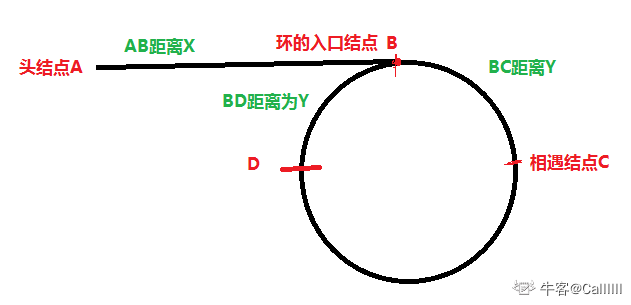

### 前言：链表中环的分析



对于链表**环**的问题，潜在的一个结论是从快慢指针的相遇点到环的入口节点 `B` 的距离和头节点到环的入口节点 `B` 的距离是相等的，即 $AB = CB$。具体证明可以通过以下两种方法分析：

先设两个指针：快指针 `fast`（比慢指针多走一步）和慢指针 `slow`，链表有环的前提下，它们必然相遇，假设相遇于节点 `C`。因为 `fast` 每次都比 `slow` 多走一步，所以从头节点出发到第一次相遇，`fast` 指针走过的路程是 `slow` 指针的两倍。`slow` 走过的路程为 `ABC`，`fast` 指针走过的路程为`ABCBC`，即可得 $2ABC = ABCBC$，所以 $CBC = ABC$，从而推断出 $CB = AB$。 

### 一，链表中环的入口节点

1，**快慢指针法**。

1. 初始化：快指针 `fast` 指向头结点， 慢指针 `slow` 指向头结点
2. 让 `fast` 一次走两步， slow 一次走一步，第一次相遇在 C 处，停止
3. 然后让 `fast` 指向头结点，`slow` 原地不动，让后 `fast`，`slow` 每次走一步，当再次相遇，就是入口结点。

```c++
// leetcode142，快慢指针法
class Solution {
public:
    ListNode* EntryNodeOfLoop(ListNode* pHead) {
        ListNode* fast = pHead;
        ListNode* slow = pHead;
        if (!fast || !fast->next) return nullptr;
        while( fast != slow ) {  // 找到 fast 指针和 slow 指针相遇位置
            fast = fast->next->next;
            slow = slow->next;
            if(fast == slow ) break;
        }
        if (!fast || !fast->next) return nullptr;
        fast = pHead; // fast 指针指向头节点，slow 指针原地不变
        while(fast != slow ) {  // 两个指针重新相遇于环的入口点
            fast = fast->next;
            slow = slow->next;
        }
        return fast;
    }
};
```

### 二，计算链表环的长度

两个指针相遇后继续移动，下次再相遇时，`slow` 走过的长度就是环的长度。
```c++
class Solution {
public:
    ListNode* EntryNodeOfLoop(ListNode* pHead) {
        ListNode* fast = pHead;
        ListNode* slow = pHead;
        if (!fast || !fast->next) return nullptr;
        while( fast != slow ) {  // 于环中第一次相遇
            fast = fast->next->next;
            slow = slow->next;
            if(fast == slow ) break;
        }
        if (!fast || !fast->next) return nullptr;
        int len = 0;
        while(fast != slow ) {  // 于环中第二次相遇
            fast = fast->next->next;
            slow = slow->next;
            len++;
        }
        return len;
    }
};
```

### 三，判断链表是否有环

快慢指针，只要链表有环，`fast` 指针一定会和 `slow` 指针相遇（ `slow == fast`），否则链表没环。

```c++
class Solution {
public:
    ListNode* EntryNodeOfLoop(ListNode* pHead) {
        ListNode* fast = pHead;
        ListNode* slow = pHead;
        if (!fast || !fast->next) return nullptr;
        while( slow != nullptr && fast != nullptr; fast->next != nullptr ) {  
            fast = fast->next->next;
            slow = slow->next;
            if(slow == fast) return true; // slow 相遇点位置
        }
        return false;
    }
};

```

### 四，[两个链表的第一个公共结点](https://leetcode-cn.com/problems/liang-ge-lian-biao-de-di-yi-ge-gong-gong-jie-dian-lcof/)

剑指 offer 52. 两个链表的第一个公共节点。输入两个链表，找出它们的第一个公共节点。

1，**等值法**。原理是利用**两条链表在相交节点后面的部分完全相同**。

因为两个链表有公共部分，假设链表 `A` 的长度为 `a+c`，链表 `B` 的长度为 `b+c`，`c` 为尾部公共部分长度，可知 $a+c+b = b+c+a$。假设指针 `l1` 从 `A` 头部出发，当访问到链表尾部时让其指向 `B` 头部并向前走；同时让指针 `l2` 从 `B` 头部出发，当访问到链表尾部时让其指向 `A` 头部并前走。根据前面的公式，可以很明显得出 `l1` 指针和 `l2` 最终一定会相遇(`l1==l2`)，即 `l1` 指针走了 $a+c+b$ 步，`l2` 指针走了 $b+c+a$ 步，此时，相遇点即为第一个公共节点。

如果不存在交点：两者会在走完 $a + c + b + c$ 之后同时变为 $null$，退出循环。


```c++
/**
 * Definition for singly-linked list.
 * struct ListNode {
 *     int val;
 *     ListNode *next;
 *     ListNode(int x) : val(x), next(NULL) {}
 * };
 */
class Solution {
public:
    // 等值法
    ListNode *getIntersectionNode(ListNode *headA, ListNode *headB) {
        ListNode *l1 = headA;
        ListNode *l2 = headB;
        if(headA == nullptr || headB == nullptr) return nullptr;
        while( l1 != l2){
            if( l1 != nullptr) l1 = l1->next;
            else l1 = headB;
            if(l2 != nullptr) l2 = l2->next;
            else l2 = headA;
        }
        return l1;
    }
};
```

+ 时间复杂度：$O(n + m)$
+ 空间复杂度：$O(1)$

2，**差值法**。原理和方法 `1` 一样，即两链表相交点后面的部分完全相同。

分别遍历 `A` `B` 两链表，获取链表长度，并相减得差值 `d` ，然后长度大的链表先走 `d` 步，然后两链表同时走，第一个相同的节点即为第一个公共节点。

```c++

class Solution {
public:
    // 差值法
    ListNode *getIntersectionNode(ListNode *headA, ListNode *headB) {
        ListNode *l1 = headA;
        ListNode *l2 = headB;
        int len1 = 0, len2 = 0;
        while(l1 != nullptr) {  // 遍历链表 A，获取链表 A 长度
            l1 = l1->next;
            len1++;
        }
        while(l2 != nullptr) {  // 遍历链表 A，获取链表 A 长度
            l2 = l2->next;
            len2++;
        } 
        int d = abs(len1 - len2);
        if(len1 > len2){
            while(d-- > 0)  headA = headA->next;
        }
        else{
            while(d-- > 0)  headB = headB->next;     
        }
        while(headA != headB){
            headA = headA->next;
            headB = headB->next;
        }
        return headA;
    }
};
```

+ 时间复杂度：$O(n + m)$
+ 空间复杂度：$O(1)$

3，**哈希集合解法**:这是一种「从前往后」寻找的思路。
> 前面两种解题思路其实是属于根据题目特性来构思的解题方法，现在的解题方法属于利用已学过的数据结构/算法特性来解题。

使用 `set` 数据结构，先对某一条链表进行遍历，同时记录下来所有的节点。然后在对第二链条进行遍历时，检查当前节点是否在 `set` 中出现过，第一个在 `set` 出现过的节点即是交点。

```c++
class Solution {
public:
    // set 集合解法
    ListNode *getIntersectionNode(ListNode *headA, ListNode *headB) {
        ListNode *l1 = headA;
        ListNode *l2 = headB;
        unordered_set<ListNode* > visited;
        while(headA != nullptr){
            visited.insert(headA);
            headA = headA->next;
        }
        while(headB != nullptr){
            //  if (visited.count(temp))
            if(visited.find(headB) != visited.end()){
                return headB;
            }
            headB = headB->next;
        }
         return nullptr;
    }
};
```

3，**栈特性解法**:这是一种「从后往前」寻找的思路，利用了栈**先进后出**的特性。

```c++

class Solution {
public:
    // 栈特性解法
    ListNode *getIntersectionNode(ListNode *headA, ListNode *headB) {
        ListNode *l1 = headA;
        ListNode *l2 = headB;
        stack<ListNode* > st1, st2;
        while(headA != nullptr){
            st1.push(headA);
            headA = headA->next;
        }
        while(headB != nullptr){
            st2.push(headB);
            headB = headB->next;
        }
        ListNode* ans = nullptr;
        while(!st1.empty()&&!st2.empty()&&st1.top()==st2.top()){
            ans = st1.top();
            st1.pop();
            st2.pop();
        }
        return ans;
    }
};
```

五，[反转链表](https://leetcode-cn.com/problems/fan-zhuan-lian-biao-lcof/)

1，**迭代（双指针）解法**。

考虑遍历链表，并在访问各节点时修改 `next` 引用指向。

```c++
/**
 * Definition for singly-linked list.
 * struct ListNode {
 *     int val;
 *     ListNode *next;
 *     ListNode(int x) : val(x), next(NULL) {}
 * };
 */
class Solution {
public:  // 迭代法
    ListNode* reverseList(ListNode* head) {
        ListNode* pre = nullptr, *cur = head;
        while(cur != nullptr){
            ListNode *temp = cur -> next;  // 暂存后继节点 cur.next
            cur->next = pre;               // 修改 next 引用指向
            pre = cur;
            cur = temp;
        }
        return pre;
    }
};
```

+ 时间复杂度：$O(n)$
+ 空间复杂度：$O(1)$

### 六，[合并两个排序的链表](https://leetcode-cn.com/problems/he-bing-liang-ge-pai-xu-de-lian-biao-lcof/)

剑指offer25. 合并两个排序的链表。输入两个递增排序的链表，合并这两个链表并使新链表中的节点仍然是递增排序的。

```c++
/**
 * Definition for singly-linked list.
 * struct ListNode {
 *     int val;
 *     ListNode *next;
 *     ListNode(int x) : val(x), next(NULL) {}
 * };
 */
class Solution {
public:
    ListNode* mergeTwoLists(ListNode* l1, ListNode* l2) {
        ListNode* dummy = new ListNode(0);
        ListNode* pre = dummy;
        while(l1 != nullptr && l2 != nullptr){
            if(l1->val < l2->val){
                pre->next = l1;
                pre = pre->next;
                l1 = l1->next;
            }
            else{
                pre->next = l2;
                pre = pre->next;
                l2 = l2->next;           
            }
        }
        // 就像归并排序一样最后要把没合并完的直接链接进来
        if(l1) pre->next = l1;
        if(l2) pre->next = l2;

        return dummy->next;
    }
};
```

### 七，[复杂链表的复制](https://leetcode-cn.com/problems/fu-za-lian-biao-de-fu-zhi-lcof/)

剑指 Offer 35. 复杂链表的复制

请实现 `copyRandomList` 函数，复制一个复杂链表。在复杂链表中，每个节点除了有一个 `next` 指针指向下一个节点，还有一个 `random` 指针指向链表中的任意节点或者 `null`。
