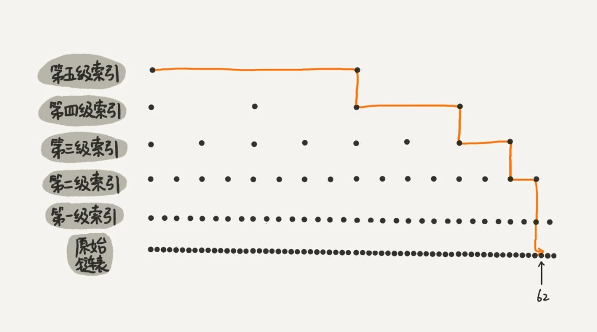
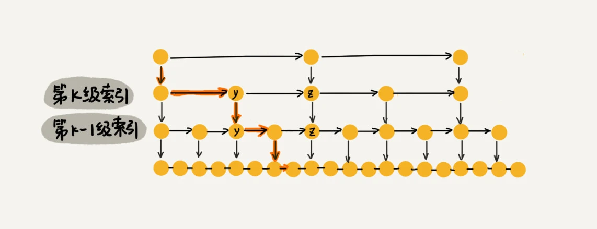

### 一，如何理解跳表

简单说跳表（`Skip list`）就是链表的“二分查找”。`redis` 的有序集合用的就是跳表算法。跳表是一种各方面性能都比较优秀的动态数据结构，可以支持快速地插入、删除、查找操作，写起来也不复杂，甚至可以替代红黑树（`Red-black tree`）。

如下图所示，这种链表加多级索引的结构，就是跳表。从图中我们可以看出，原来没有索引的时候，查找 `62` 需要遍历 `62` 个结点，现在只需要遍历 `11` 个结点，速度是不是提高了很多？所以，当链表的长度 `n` 比较大时，比如 `1000、10000` 的时候，在构建索引之后，查找效率的提升就会非常明显。

如果包含原始链表这一层，整个跳表的高度就是 $log2n$。我们在跳表中查询某个数据的时候，如果每一层都要遍历 $m$ 个结点，那在跳表中查询一个数据的时间复杂度就是 $O(m*logn)$。这里的 $m$ 为 $3$。为什么是 3 呢？解释如下。

假设我们要查找的数据是 x，在第 k 级索引中，我们遍历到 y 结点之后，发现 x 大于 y，小于后面的结点 z，所以我们通过 y 的 down 指针，从第 k 级索引下降到第 k-1 级索引。在第 k-1 级索引中，`y` 和 `z` 之间只有 `3` 个结点（包含 `y` 和 `z`），所以，我们在 K-1 级索引中最多只需要遍历 3 个结点，依次类推，每一级索引都最多只需要遍历 3 个结点。

通过上面的分析，我们得到 m=3，所以在跳表中查询任意数据的时间复杂度就是 $O(logn)$。

### 二，跳表的空间复杂度

比起单纯的单链表，跳表需要存储多级索引，肯定要消耗更多的存储空间。

跳表的空间复杂度分析并不难，假设原始链表大小为 n，那第一级索引大约有 n/2 个结点，第二级索引大约有 n/4 个结点，以此类推，每上升一级就减少一半，直到剩下 2 个结点。如果我们把每层索引的结点数写出来，就是一个等比数列。

这几级索引的结点总和就是 n/2+n/4+n/8…+8+4+2=n-2。所以，跳表的空间复杂度是 $O(n)$。也就是说，如果将包含 n 个结点的单链表构造成跳表，我们需要额外再用接近 n 个结点的存储空间。

在软件开发中，我们不必太在意索引占用的额外空间。在讲数据结构和算法时，我们习惯性地把要处理的数据看成整数，但是在实际的软件开发中，原始链表中存储的有可能是很大的对象，而索引结点只需要存储关键值和几个指针，并不需要存储对象，所以当对象比索引结点大很多时，那索引占用的额外空间就可以忽略了。

### 三，高效的动态插入和删除

前问叙述了跳表的结构定义和查找数据，实际上，跳表这个动态数据结构，**不仅支持查找操作，还支持动态的插入、删除操作，而且插入、删除操作的时间复杂度也是 $O(logn)$**。

在单链表中，一旦定位好要插入的位置，插入结点的时间复杂度是很低的，就是 $O(1)$。但是，这里为了保证原始链表中数据的有序性，我们需要先找到要插入的位置，这个查找操作就会比较耗时。

对于纯粹的单链表，需要遍历每个结点，来找到插入的位置。但是，对于跳表来说，我们讲过查找某个结点的时间复杂度是 $O(logn)$，所以这里查找某个数据应该插入的位置，方法也是类似的，时间复杂度也是 $O(logn)$。

### 四，跳表索引动态更新

当我们不停地往跳表中插入数据时，如果我们不更新索引，就有可能出现某 2 个索引结点之间数据非常多的情况。极端情况下，跳表还会退化成单链表。

### 五，总结

跳表使用空间换时间的设计思路，通过构建多级索引来提高查询的效率，实现了**基于链表的“二分查找”**。跳表是一种动态数据结构，支持快速地插入、删除、查找操作，时间复杂度都是 $O(logn)$。跳表的空间复杂度是 $O(n)$。不过，跳表的实现非常灵活，可以通过改变索引构建策略，有效平衡执行效率和内存消耗。虽然跳表的代码实现并不简单，但是作为一种动态数据结构，比起红黑树来说，实现要简单多了。所以很多时候，我们为了代码的简单、易读，比起红黑树，我们更倾向用跳表。

### 参考资料

+ [数据结构与算法之美-跳表](https://time.geekbang.org/column/article/42896)
+ [跳表(SkipList)设计与实现
](https://leetcode-cn.com/circle/article/gRlksy/)