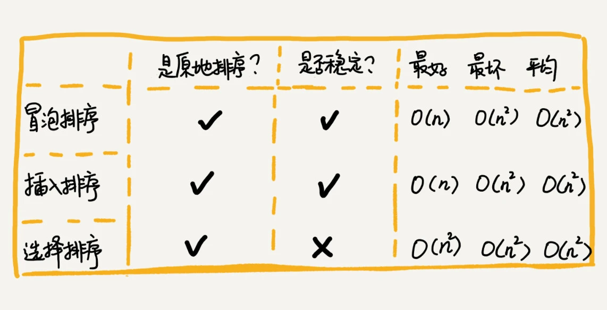
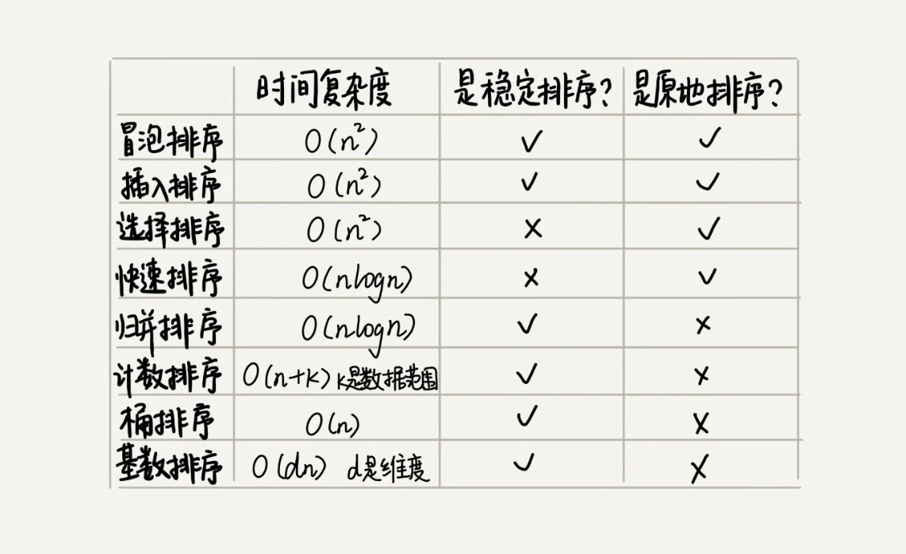

### 一，冒泡排序（Bubble Sort）

排序算法是程序员必须了解和熟悉的一类算法，排序算法有很多种，基础的如：冒泡、插入、选择、快速、归并、计数、基数和桶排序等。

冒泡排序只会操作相邻的两个数据。每次冒泡操作都会对相邻的两个元素进行比较，看是否满足大小关系要求，如果不满足就让它俩互换。一次冒泡会让至少一个元素移动到它应该在的位置，重复 `n` 次，就完成了 `n` 个数据的排序工作。
> 总结：如果数组有 `n` 个元素，最坏情况下，需要进行 `n` 次冒泡操作。

基础的冒泡排序算法的 `C++` 代码如下：

```cpp
// 将数据从小到大排序
void bubbleSort(int array[], int n){
    if (n<=1) return;
    for(int i=0; i<n; i++){
        for(int j=0; j<n-i; j++){
            if (temp > a[j+1]){
                temp = array[j]
                a[j] = a[j+1];
                a[j+1] = temp;
            }
        }
    }
}
```

实际上，以上的冒泡排序算法还可以优化，当某次冒泡操作已经不再进行数据交换时，说明数组已经达到有序，就不需要再继续执行后续的冒泡操作了。优化后的代码如下：

```cpp
// 将数据从小到大排序
void bubbleSort(int array[], int n){
    if (n<=1) return;
    for(int i=0; i<n; i++){
        // 提前退出冒泡循环发标志位
        bool flag = False;
        for(int j=0; j<n-i; j++){
            if (temp > a[j+1]){
                temp = array[j]
                a[j] = a[j+1];
                a[j+1] = temp;
                flag = True; // 表示本次冒泡操作存在数据交换
            }
        }
        if(!flag) break;  // 没有数据交换，提交退出
    }
}
```

**冒泡排序的特点**：

1. 冒泡过程只涉及相邻元素的交换，只需要常量级的临时空间，故空间复杂度为 O(1)，是**原地排序算法**。
2. 当有相邻的两个元素大小相等的时候，我们不做交换，相同大小的数据在排序前后不会改变顺序，所以是**稳定排序算法**。
3. 最坏情况和平均时间复杂度都为 $O(n^2)$，最好时间复杂度是 $O(n)$。

### 二，插入排序（Insertion Sort）

1. 插入排序算法将数组中的数据分为两个区间：已排序区间和未排序区间。最初始的已排序区间只有一个元素，就是数组的第一个元素。
2. 插入排序算法的核心思想就是取未排序区间的一个元素，在已排序区间中找到一个合适的位置插入，并保证已排序区间数据一直有序。
3. 重复这个过程，直到未排序区间元素为空，则算法结束。

插入排序和冒泡排序一样，也包含两种操作，一种是**元素的比较**，一种是**元素的移动**。
当我们需要将一个数据 `a` 插入到已排序区间时，需要拿 `a` 与已排序区间的元素依次比较大小，找到合适的插入位置。找到插入点之后，我们还需要将插入点之后的元素顺序往后移动一位，这样才能腾出位置给元素 `a` 插入。

插入排序的 `C++` 代码实现如下：

```cpp
void InsertSort(int a[], int n){
    if (n <= 1) return;
    for (int i = 1; i < n; i++)  // 未排序区间范围
    {
        
        key  = a[i];    // 待排序第一个元素
        int j = i - 1;  // 已排序区间末尾元素
        // 从尾到头查找插入点方法
        while(key < a[j] && j >= 0){  // 元素比较
            a[j+1] = a[j];  // 数据向后移动一位
            j--;
        }
        a[j+1] = key;   // 插入数据
    }
}
```

插入排序的特点：

1. 插入排序并不需要额外存储空间，空间复杂度是 O(1)，所以插入排序也是一个原地排序算法。
2. 在插入排序中，对于值相同的元素，我们可以选择将后面出现的元素，插入到前面出现元素的后面，这样就可以保持原有的前后顺序不变，所以插入排序是稳定的排序算法。
3. 最坏情况和平均时间复杂度都为 $O(n^2)$，最好时间复杂度是 $O(n)$。

### 三，选择排序（Selection Sort）

选择排序算法的实现思路有点类似插入排序，也分已排序区间和未排序区间。但是选择排序每次会从未排序区间中找到最小的元素，将其放到已排序区间的末尾。

选择排序的最好情况时间复杂度、最坏情况和平均情况时间复杂度都为 O(n2)，是原地排序算法，且是**不稳定的排序算法**。

选择排序的 `C++` 代码实现如下：

```cpp
void SelectSort(int a[], int n){
    for(int i=0; i<n; i++){
        int minIndex = i;
        for(int j = i;j<n;j++){
            if (a[j] < a[minIndex]) minIndex = j;
        }
        if (minIndex != i){
            temp = a[i]; 
            a[i] = a[minIndex];
            a[minIndex] = temp;
        }
    }
}

```

### 冒泡插入选择排序总结



这三种排序算法，实现代码都非常简单，对于小规模数据的排序，用起来非常高效。但是在大规模数据排序的时候，这个时间复杂度还是稍微有点高，所以更倾向于用时间复杂度为 O(nlogn) 的排序算法。

特定算法是依赖特定的数据结构的。以上三种排序算法，都是基于数组实现的。

### 四，归并排序（Merge Sort）

归并排序的核心思想比较简单。如果要排序一个数组，我们**先把数组从中间分成前后两部分，然后对前后两部分分别排序，再将排好序的两部分合并在一起**，这样整个数组就都有序了。

归并排序使用的是分治思想。分治，顾名思义，就是分而治之，将一个大问题分解成小的子问题来解决。小的子问题解决了，大问题也就解决了。

分治思想和递归思想有些类似，分治算法一般用递归实现。分治是一种解决问题的处理思想，递归是一种编程技巧，这两者并不冲突。

知道了归并排序用的是分治思想，而分治思想一般用递归实现，接下来的重点就是**如何用递归实现归并排序**。写递归代码的技巧就是，分析问题得出递推公式，然后找到终止条件，最后将递推公式翻译成递归代码。所以，要想写出归并排序的代码，得先写出**归并排序的递推公式**。

```shell

递推公式：
merge_sort(p…r) = merge(merge_sort(p…q), merge_sort(q+1…r))

终止条件：
p >= r 不用再继续分解，即区间数组元素为 1 
```

归并排序的伪代码如下：

```cpp
merge_sort(A, n){
    merge_sort_c(A, 0, n-1)
}
merge_sort_c(A, p, r){
    // 递归终止条件
    if (p>=r) then return
    // 取 p、r 中间的位置为 q
    q = (p+r)/2
    // 分治递归
    merge_sort_c(A[p, q], p, q)
    merge_sort_c(A[q+1, r], q+1, r)
    // 将A[p...q]和A[q+1...r]合并为A[p...r]  
    merge(A[p...r], A[p...q], A[q+1...r])
}

```

#### 4.1，归并排序性能分析

1，归并排序是一个**稳定的排序算法**。分析：伪代码中 `merge_sort_c()` 函数只是分解问题并没有涉及移动元素和比较大小，真正的元素比较和数据移动在 `merge()` 函数部分。在合并过程中保证值相同的元素合并前后的顺序不变，归并排序排序就是一个稳定的排序算法。

2，归并排序的执行效率与要排序的原始数组的有序程度无关，所以其时间复杂度是非常稳定的，不管是最好情况、最坏情况，还是平均情况，**时间复杂度都是 $O(nlogn)$**。分析：不仅递归求解的问题可以写成递推公式，递归代码的时间复杂度也可以写成递推公式：

$$T(n) = 2*T(n/2) + n； n>1$$

$$ \begin{aligned}
T(n) &= 2*T(n/2) + n
    \\ &= 2*(2*T(n/4) + n/2) + n = 4*T(n/4) + 2*n
    \\  &= 4*(2*T(n/8) + n/4) + 2*n = 8*T(n/8) + 3*n
    \\  &= 8*(2*T(n/16) + n/8) + 3*n = 16*T(n/16) + 4*n
    \\ &......
    \\  &= 2^k * T(n/2^k) + k * n
    \\  &......
    \end{aligned}$$

一步步分解推导可得 $T(n)= 2^k *T(n/2^k) + k* n$ 。当 $T(n/2^k)=T(1)$ 时，也就是 $n/2^k=1$，我们得到 $k=log2n$ 。我们将 $k$ 值代入上面的公式，得到 $T(n)=Cn+nlog2n$ 。如果我们用大 O 标记法来表示的话，$T(n)$ 就等于 $O(nlogn)$。所以归并排序的时间复杂度是 O(nlogn)。

3，**空间复杂度是 O(n)**。分析：递归代码的空间复杂度并不能像时间复杂度那样累加。尽管算法的每次合并操作都需要申请额外的内存空间，但在合并完成之后，临时开辟的内存空间就被释放掉了。在任意时刻，CPU 只会有一个函数在执行，也就只会有一个临时的内存空间在使用。临时内存空间最大也不会超过 n 个数据的大小，所以空间复杂度是 $O(n)$。

### 五，快速排序（Quicksort）

快排的思想是这样的：如果要排序数组中下标从 `p` 到 `r` 之间的一组数据，我们选择 `p` 到 `r` 之间的任意一个数据作为 `pivot`（**分区点**）。我们遍历 p 到 r 之间的数据，将小于 pivot 的放到左边，将大于 pivot 的放到右边，将 pivot 放到中间。经过这一步骤之后，数组 p 到 r 之间的数据就被分成了三个部分，前面 `p` 到 `q-1` 之间都是小于 `pivot` 的，中间是 `pivot`，后面的 `q+1` 到 `r` 之间是大于 `pivot` 的。

根据分治、递归的处理思想，我们可以用**递归**排序下标从 `p` 到 `q-1` 之间的数据和下标从 `q+1` 到 `r` 之间的数据，直到区间缩小为 `1`，就说明所有的数据都有序了。

递推公式如下：

```shell
递推公式：
quick_sort(p,r) = quick_sort(p, q-1) + quick_sort(q, r)
终止条件：
p >= r
```

### 归并排序和快速排序总结

归并排序和快速排序是两种稍微复杂的排序算法，它们用的都是分治的思想，代码都通过递归来实现，过程非常相似。理解归并排序的重点是理解递推公式和 `merge()` 合并函数。同理，理解快排的重点也是理解递推公式，还有 `partition()` 分区函数。

除了以上 `5` 种排序算法，还有 `3` 种时间复杂度是 $O(n)$ 的**线性排序**算法：桶排序、计数排序、基数排序。这八种排序算法性能总结如下图：



### 参考资料

+ [排序（上）：为什么插入排序比冒泡排序更受欢迎？](https://time.geekbang.org/column/article/41802)
+ [排序（下）：如何用快排思想在O(n)内查找第K大元素？](https://time.geekbang.org/column/article/41913)