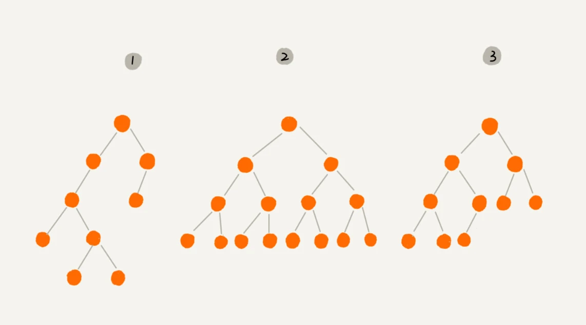
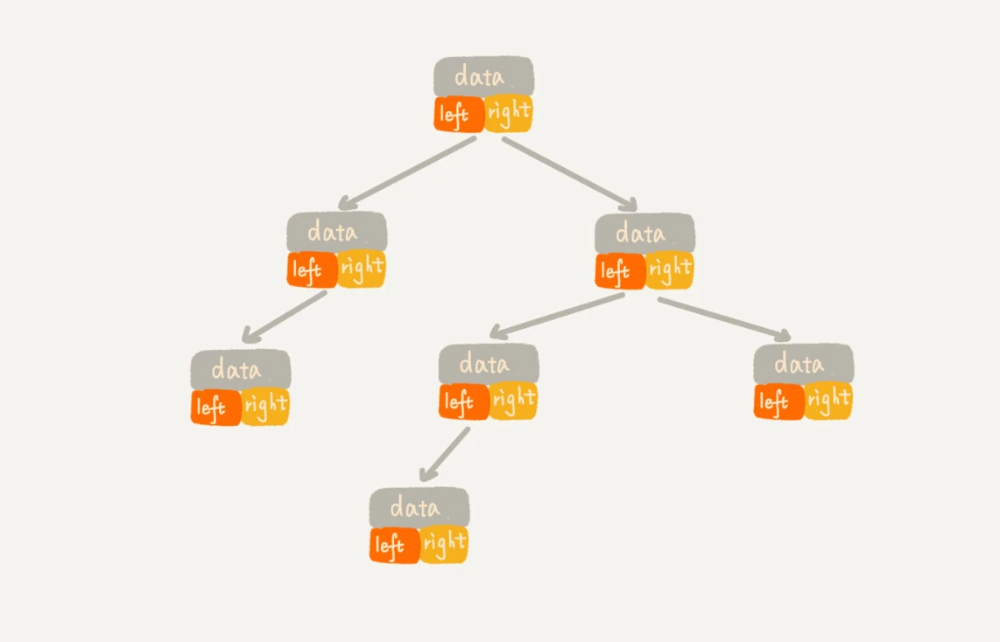
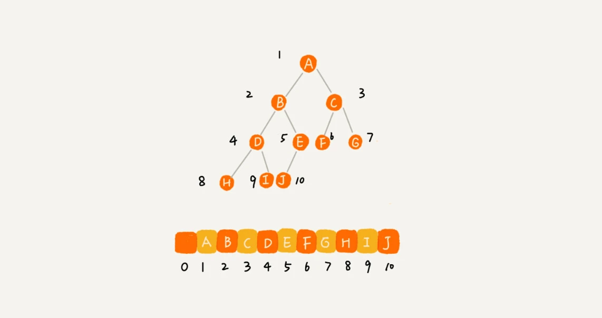
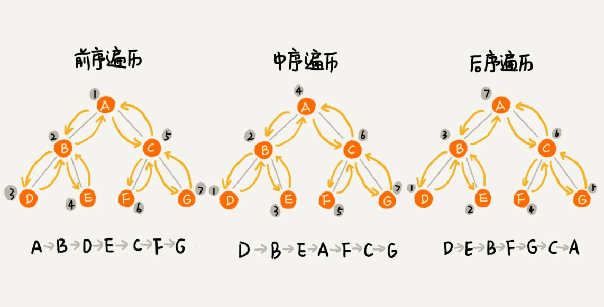

### 一，什么是二叉树

二叉树的定义可以先通过下图有一个直观了解。



在计算机科学中，二叉树（英语：`Binary tree`）是每个节点最多只有两个分支（即不存在分支度大于 `2` 的节点）的树结构。通常分支被称作“左子树”或“右子树”。二叉树的分支具有左右次序，不能随意颠倒。

这个图里面，有两个比较特殊的二叉树，分别是编号 `2` 和编号 `3` 这两个。

其中，编号 `2` 的二叉树中，叶子节点全都在最底层，除了叶子节点之外，每个节点都有左右两个子节点，这种二叉树就叫做**满二叉树**。

编号 `3` 的二叉树中，叶子节点都在最底下两层，**最后一层的叶子节点都靠左排列**，并且除了最后一层，其他层的节点个数都要达到最大，这种二叉树叫做**完全二叉树**。

### 二，二叉树的存储

**完全二叉树之所以这样定义是和二叉树的存储有关的。**

二叉树的存储有两种方法，一种是基于指针或者引用的二叉链式存储法，一种是基于数组的顺序存储法。

链式存储法比较直观，每个节点有三个字段，其中一个存储数据，另外两个是指向左右子节点的指针。我们只要拎住根节点，就可以通过左右子节点的指针，把整棵树都串起来。如下图所示：



顺序存储法，假设把根节点存储在数组下标为 `i = 1` 的位置，则左子节点存储在下标为 `2*i=2` 的位置，右子节点在 `2*i+1=3` 的位置。如下图所示：



从顺序存储法定义可知，假设是非完全二叉树，则会浪费部分空间，`2*i` 位置没有元素，被浪费了。所以，如果某棵二叉树是一棵完全二叉树，那用数组存储无疑是最节省内存的一种方式。因为数组的存储方式并不需要像链式存储法那样，要存储额外的左右子节点的指针。

### 三，二叉树的遍历

将二叉树所有节点打印出来的过程称为二叉树的遍历。二叉树的遍历方式有 `4` 种，前、中、后、层序遍历。**其中，前、中、后序，表示的是节点与它的左右子树节点遍历打印的先后顺序**。

+ 前序遍历是指，对于树中的任意节点来说，先打印这个节点，然后再打印它的左子树，最后打印它的右子树。
+ 中序遍历是指，对于树中的任意节点来说，先打印它的左子树，然后再打印它本身，最后打印它的右子树。
+ 后序遍历是指，对于树中的任意节点来说，先打印它的左子树，然后再打印它的右子树，最后打印这个节点本身。



实际上，二叉树的前、中、后序遍历都是一个递归过程，如中序遍历，就是先递归的打印左子树，再打印根节点，最后递归的打印右子树。递归公式如下：

```

前序遍历的递推公式：
preOrder(r) = print r->preOrder(r->left)->preOrder(r->right)

中序遍历的递推公式：
inOrder(r) = inOrder(r->left)->print r->inOrder(r->right)

后序遍历的递推公式：
postOrder(r) = postOrder(r->left)->postOrder(r->right)->print r
```

二叉树的前、中、后续遍历的递归实现代码如下：
> 二叉树的后续遍历 leetcode 链接在 [leetcode145](https://leetcode-cn.com/problems/binary-tree-postorder-traversal/)。

```cpp
// Definition for a binary tree node.
struct TreeNode {
    int val;
    TreeNode *left;
    TreeNode *right;
    TreeNode() : val(0), left(nullptr), right(nullptr) {}
    TreeNode(int x) : val(x), left(nullptr), right(nullptr) {}
    TreeNode(int x, TreeNode *left, TreeNode *right) : val(x), left(left), right(right) {}
};
 
class Solution {
public:
    // 前序遍历，遍历结果存储在 vector 中
    void preOrder(TreeNode* root, vector<int> &ret){
        if(root == nullptr) return ;
        ret.push_back(root->val);
        preOrder(root->left, ret);
        preOrder(root->right, ret);
    }
    // 中序遍历
    void inOrder(TreeNode* root, vector<int> &ret){
        if(root == nullptr) return ;
        inOrder(root->left, ret);
        ret.push_back(root->val);
        inOrder(root->right, ret);
    }
    // 后续遍历
    void postOrder(TreeNode* root, vector<int> &ret){
        if(root == nullptr) return ;
        postOrder(root->left, ret);
        postOrder(root->right, ret);
        ret.push_back(root->val);
    }
};
```

每个节点最多会被访问两次，所以遍历操作的时间复杂度，跟节点的个数 $n$ 成正比，也就是说二叉树遍历的时间复杂度是 $O(n)$。
> `2` 次具体指的是，一次是获取该节点的左子节点对象，另一次是获取该节点的右子节点对象。

### 总结

二叉树的每个节点最多有两个子节点，分别是左子节点和右子节点。二叉树中，有两种比较特殊的树，分别是满二叉树和完全二叉树。满二叉树又是完全二叉树的一种特殊情况。

二叉树既可以用链式存储，也可以用数组顺序存储。数组顺序存储的方式比较适合完全二叉树，其他类型的二叉树用数组存储会比较浪费存储空间。除此之外，二叉树里非常重要的操作就是前、中、后序遍历操作，遍历的时间复杂度是 $O(n)$，你需要理解并能用递归代码来实现。