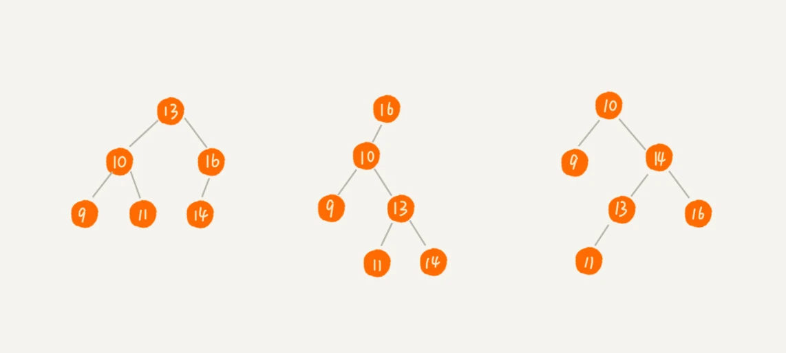
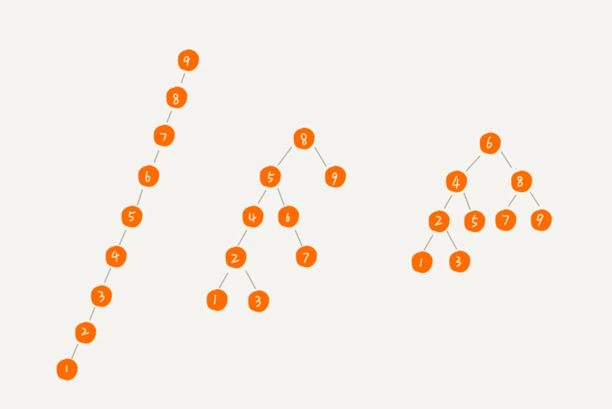

### 一，什么是二叉查找树

二叉查找树（`Binary Search Tree`）是二叉树中最常用的一种类型，也叫二叉搜索树。顾名思义，二叉查找树是为了实现快速查找而生的。

二叉查找树最大的特点就是，支持**动态数据集合**的快速插入、删除、查找操作。

二叉查找树的定义是，**在树中的任意一个节点，其左子树中的每个节点的值，都要小于这个节点的值，而右子树节点的值都大于这个节点的值**。结构如下图所示：



#### 1.1，二叉查找树的查找操作

查找的数据等于根节点则返回；小于根节点则在左子树中递归查找；大于根节点则在右子树中递归查找。

二叉树的根节点定义如下：

```c++
// Definition for a binary tree node->
struct TreeNode {
    int val;
    TreeNode *left;
    TreeNode *right;
    TreeNode() : val(0), left(nullptr), right(nullptr) {}
    TreeNode(int x) : val(x), left(nullptr), right(nullptr) {}
    TreeNode(int x, TreeNode *left, TreeNode *right) : val(x), left(left), right(right) {}
};
```

二叉搜索树中的搜索的 `C++` 代码如下：

```c++
class Solution {
public:
    TreeNode* searchBST(TreeNode* root, int val) {
        if(root == NULL || root->val==val) return root;
        if(root->val < val) return searchBST(root->right, val);
        if(root->val > val) return searchBST(root->left, val);
        return NULL;
    }
};
```

#### 1.2，二叉查找树的插入操作

二叉查找树的插入过程有点类似查找操作。新插入的数据一般都是在叶子节点上，所以我们只需要从根节点开始，依次比较要插入的数据和节点的大小关系。

```c++
class Solution {
public:
    TreeNode* insertIntoBST(TreeNode* root, int val) {
        if (root == nullptr){
            return new TreeNode(val);
        }
        TreeNode* pos = root;
        while(pos!=nullptr){
            if(val < pos->val){
                if(pos->left == nullptr){
                    pos->left = new TreeNode(val);
                    return;
                }
                else{
                    pos = pos->left;
                }
            }
            else{
                if(pos->right == nullptr){
                    pos->right = new TreeNode(val);
                    return;
                }
                else{
                    pos = pos->right;
                }               
            }
        }
        return root;
    }
};
```

#### 1.2，二叉查找树的删除操作

针对要删除节点的子节点个数的不同，有以下五种情况：

+ 第一种情况：没找到删除的节点，遍历到空节点直接返回了
+ 找到删除的节点
    + 第二种情况：左右孩子都为空（叶子节点），直接删除节点， 返回 `NULL` 为根节点
    + 第三种情况：要删除的节点不是叶子节点，且没有右节点但是有左节点。使用它的前驱节点值进行替代，然后再递归的向下删除前驱节点。
    + 第四种情况：要删除的节点不是叶子节点且拥有右节点，则该节点可以由该节点的后继节点值进行替代，然后可以从后继节点的位置递归向下操作以删除后继节点。
    + 第五种情况：左右孩子节点都不为空，则将删除节点的左子树头结点（左孩子）放到删除节点的右子树的最左面节点的左孩子上，返回删除节点右孩子为新的根节点。

+ `Successor` 代表的是中序遍历序列的下一个节点。即比当前节点大的最小节点，简称**后继节点**。 先取当前节点的右节点，然后一直取该节点的左节点，直到左节点为空，则最后指向的节点为后继节点 **(右子树的最小节点）**。
+ `Predecessor` 代表的是中序遍历序列的前一个节点。即比当前节点小的最大节点，简称**前驱节点**。先取当前节点的左节点，然后取该节点的右节点，直到右节点为空，则最后指向的节点为前驱节点 **(左子树的最大节点）**。

**1，递归代码如下**：

```c++
// 对应 leetcode450，leetcode运行结果有问题！

class Solution {
public:
    // 返回节点的后继节点值
    int successor(TreeNode* root){
        root = root->right;
        while(root->left != nullptr) root = root->left;
        return root->val;
    }
    // 返回节点的前驱节点值
    int predecessor(TreeNode* root){
        root = root->left;
        while(root->right != nullptr) root = root->right;
        return root->val;
    }
    TreeNode* deleteNode(TreeNode* root, int key){
        if (root == nullptr) return nullptr;
        if(key > root->val) root->right = deleteNode(root->right, key);
        else if(key < root->val ) root->left = deleteNode(root->left, key);
        else{  // 找到了待删除节点, delete the current node
            // 左右子树都没有节点
            if(root->left == nullptr && root->right == nullptr) root = nullptr;
            // 只有左子树有节点
            else if(root->left != nullptr ){
                root->val = predecessor(root);
                root->left = deleteNode(root->left, root->val);
            }
            // 只有右子树有节点或者左右子树都有节点
            else{
                root->val = successor(root);
                root->right = deleteNode(root->right, root->val);
            }
        }
        return root;
    }
};
```

**2，非递归代码如下**：

```c++
// 对应 leetcode450，leetcode运行结果有问题！

class Solution{
public:
    TreeNode* deleteNode(TreeNode* root, int key){
        TreeNode* p = root; // 指向要删除的节点，初始化为根节点
        TreeNode* pp = nullptr; // pp 指向 p 的父节点
        // 根据 key 值查找待删除的节点及其父节点
        while(pp != nullptr && p->val != key){
            pp = p;
            if(key > p->val) p = p->right;
            else p = p->left;
        }
        if (pp == nullptr) return nullptr;  // 没有找到待删除节点
        // 1, 要删除的节点有两个子节点
        if (p->left != nullptr && p->right != nullptr){ // 查找右子树的最小节点
            TreeNode* minP = p->right;
            TreeNode* minPP = p;  // minPP 是 minP 的父节点
            while(minP->left != nullptr){
                minPP = minP;
                minP = minP->left;
            }
            // 右子树最小节点的值替换到待删除节点上，然后只要删除 minP 节点（无子节点或者只有一个右子节点 ）即可
            p->val = minP->val;
            p = minP;
            pp = minPP;  
        }
        TreeNode* child; // p 的字节点

        // 2，要删除的节点有一个子节点或者没有子节点
        if (p->left != nullptr ) child = p->left;  // 有左节点
        else if(p->right != nullptr) child = p->right; // 有右节点
        else child = nullptr;  // 没有子节点

        // 真正的删除节点操作
        if(pp == nullptr) root = child; // 删除的是根节点
        else if(pp->left == p) pp->left = child;
        else pp->right = child;

        return root;
    }
};
```

二叉查找树除了查找、插入、删除操作，还支持快速地查找最大节点和最小节点、前驱节点和后继节点操作。同时，二叉查找树的中序遍历输出的是有序数据序列，时间复杂度为 $O(n)$。

### 二，支持重复数据的二叉查找树

和散列表一样，二叉查找树节点中也可以存储包含很多字段的对象，针对节点存在重复数据的情况，有两种方法：

+ 通过链表和支持动态扩容的数组等数据结构，把值相同的数据都存储在同一个节点上。
+ 每个节点仍然只存储一个数据。在查找插入位置的过程中，如果碰到一个节点的值，与要插入数据的值相同，我们就将这个要插入的数据放到这个节点的右子树，也就是说，把这个新插入的数据当作大于这个节点的值来处理。

### 三，二叉查找树的时间复杂度分析

二叉查找树的形态各式各样，查找、插入、删除操作的时间复杂度也各不一样，如下图第一种二叉查找树的根节点左右子树极度不平衡，查找的时间复杂度变成了 $O(n)$。



### 总结

在二叉查找树中，查找、插入、删除等很多操作的时间复杂度都跟树的高度成正比。两个极端情况的时间复杂度分别是 $O(n)$ 和 $O(logn)$，分别对应二叉树退化成**链表**的情况和**完全二叉树**。为了避免时间复杂度的退化，针对二叉查找树，又设计了一种更加复杂的树-平衡二叉查找树，时间复杂度可以做到稳定的 $O(logn)$。

### 参考资料

[《数据结构与算法之美》-二叉树基础（下）](https://time.geekbang.org/column/article/68334)