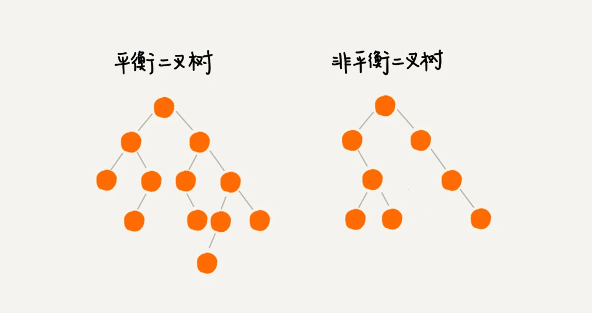
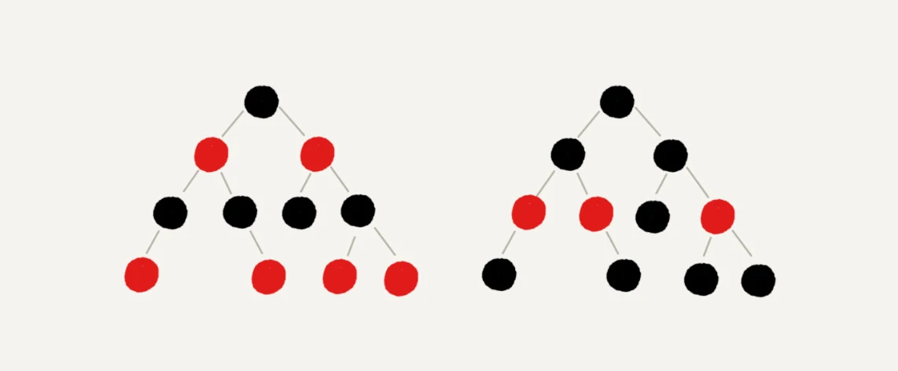

### 一，什么是“平衡二叉查找树”

平衡二叉树定义：二叉树中忍一一个节点的左右子树的高度相差不能大于 `1`。

平衡二叉查找树不仅满足平衡二叉树的定义，也满足二叉查找树的定义，最先被发明的平衡二叉查找树是 `AVL` 树。

> `AVL` 树（`Adelson-Velsky and Landis Tree`）是计算机科学中最早被发明的自平衡二叉查找树。在 `AVL` 树中，任一节点对应的两棵子树的最大高度差为 `1`，因此它也被称为高度平衡树。查找、插入和删除在平均和最坏情况下的时间复杂度都是 $O(\log {n})$。增加和删除元素的操作则可能需要借由一次或多次树旋转，以实现树的重新平衡。

但是很多平衡二叉查找树其实并没有严格符合上面的定义（树中任意一个节点的左右子树的高度相差不能大于 `1`），比红黑树，**它从根节点到各个叶子节点的最长路径，有可能会比最短路径大一倍**。

平衡二叉查找树的发明，是为了解决普通二叉查找树在频繁的插入、删除等动态更新后，出现时间复杂度退化的问题。

> 这里“平衡”可以通俗理解为，让整棵树左右看起来对称，从而“平衡”，左右子树高度差不多。

### 二，如何定义一颗红黑树

平衡二叉查找树其实有很多种，但是我们一般听到的基本都是红黑树。红黑树的英文是`“Red-Black Tree”`，简称 `R-B Tree`。它是一种不严格的平衡二叉查找树。

顾名思义，红黑树中的节点，一类被标记为黑色，一类被标记为红色。除此之外，一棵红黑树还需要满足这样几个要求：

+ 根节点是黑色的；
+ 每个叶子节点都是黑色的空节点（`NIL`），也就是说，叶子节点不存储数据；
+ 任何相邻的节点都不能同时为红色，也就是说，红色节点是被黑色节点隔开的；
+ 每个节点，从该节点到达其可达叶子节点的所有路径，都包含相同数目的黑色节点；

### 三，为什么说红黑树是“近似平衡”的？

二叉查找树很多操作的性能都和树的高度成正比，一颗极其平衡的二叉树（满二叉树或完全二叉树）的高度大约是 $log_2{n}$，要证明红黑树是近似平衡的，只要推导出红黑树的高度近似 $log_2{n}$。

**首先，将红色节点从红黑树中去掉，分析单纯包含黑色节点的红黑树高度**。

红色节点删除后，有些节点就没有父节点了，它们会直接拿这些节点的祖父节点（父节点的父节点）作为父节点。所以，之前的二叉树就变成了四叉树。

前面红黑树的定义里有这么一条：从任意节点到可达的叶子节点的每个路径包含相同数目的黑色节点。我们从四叉树中取出某些节点，放到叶节点位置，四叉树就变成了完全二叉树。所以，仅包含黑色节点的四叉树的高度，比包含相同节点个数的完全二叉树的高度还要小。

完全二叉树的高度近似 $log_2{n}$，这里的四叉“黑树”的高度要低于完全二叉树，所以去掉红色节点的“黑树”的高度也不会超过 $log_2{n}$。

**最后，知道了只包含黑色节点的“黑树”的高度后，再分析吧红色节点加回去后的树高度**。

在红黑树中，红色节点不能相邻，也就是说，有一个红色节点就要至少有一个黑色节点，将它跟其他红色节点隔开。红黑树中包含最多黑色节点的路径不会超过 $log_2{n}$，所以加入红色节点之后，最长路径不会超过 $2log_2{n}$，也就是说，红黑树的高度近似 $2log_2{n}$。

所以，红黑树的高度只比高度平衡的 AVL 树的高度（$log_2{n}$）仅仅大了一倍，在性能上，下降得并不多。这样推导出来的结果不够精确，实际上红黑树的性能更好。

### 内容总结

红黑树是一种平衡二叉查找树。它是为了解决普通二叉查找树在数据更新的过程中，复杂度退化的问题而产生的。红黑树的高度近似 $log_2{n}$，所以它是近似平衡，插入、删除、查找操作的时间复杂度都是 $O(logn)$。

因为红黑树是一种性能非常稳定的二叉查找树，所以，在工程中，但凡是用到动态插入、删除、查找数据的场景，都可以用到它。不过，它实现起来比较复杂，如果自己写代码实现，难度会有些高，这个时候，其实更倾向**用跳表来替代它**。

### 参考资料

[《数据结构与算法之美》-红黑树(上)](https://time.geekbang.org/column/article/68638)