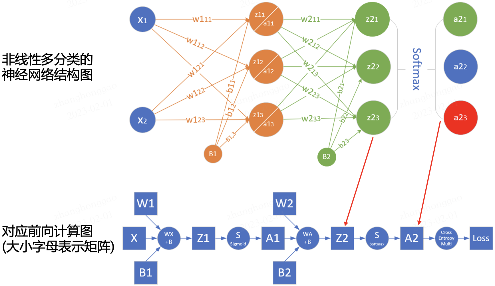
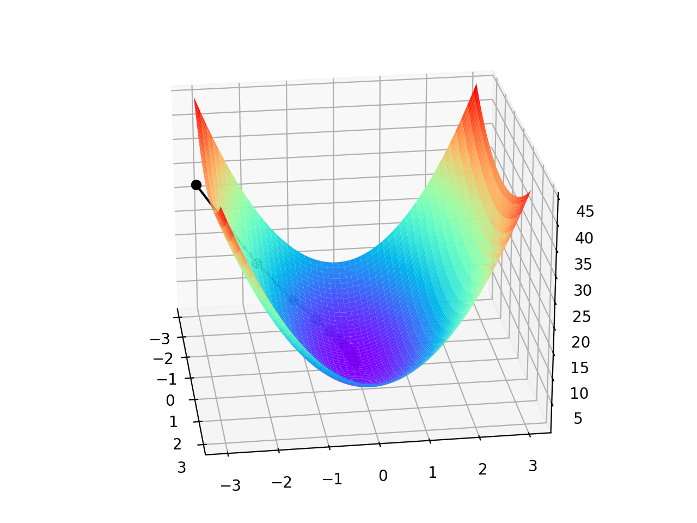
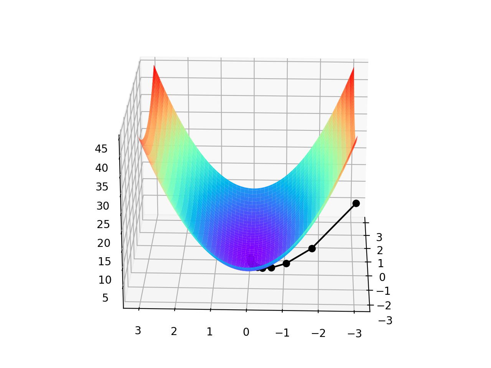
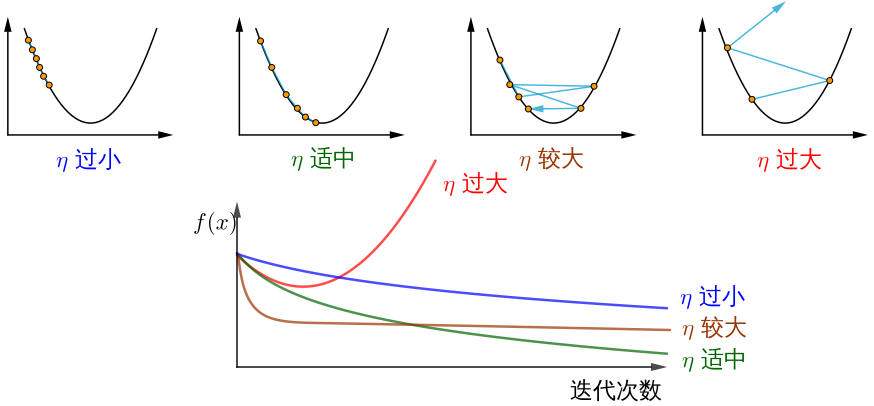

- [一，前向传播与反向传播](#一前向传播与反向传播)
  - [1.1，神经网络训练过程](#11神经网络训练过程)
  - [1.2，前向传播](#12前向传播)
  - [1.3，反向传播](#13反向传播)
  - [1.4，总结](#14总结)
- [二，梯度下降](#二梯度下降)
  - [2.1，深度学习中的优化](#21深度学习中的优化)
  - [2.2，如何理解梯度下降法](#22如何理解梯度下降法)
  - [2.3，梯度下降原理](#23梯度下降原理)
- [三，随机梯度下降与小批量随机梯度下降](#三随机梯度下降与小批量随机梯度下降)
  - [3.1，随机梯度下降](#31随机梯度下降)
  - [3.2，小批量随机梯度下降](#32小批量随机梯度下降)
- [四，总结](#四总结)
- [参考资料](#参考资料)

## 一，前向传播与反向传播
### 1.1，神经网络训练过程

神经网络训练过程是：
1. 先通过随机参数“猜“一个结果（模型前向传播过程），这里称为预测结果 $a$；
2. 然后计算 $a$ 与样本标签值 $y$ 的差距（即损失函数的计算过程）；
3. 随后通过反向传播算法更新神经元参数，使用新的参数再试一次，这一次就不是“猜”了，而是有依据地向正确的方向靠近，毕竟参数的调整是有策略的（基于梯度下降策略）。

以上步骤如此反复多次，一直到预测结果和真实结果之间相差无几，亦即 $|a-y|\rightarrow 0$，则训练结束。

总结：**所谓模型训练，其实就是通过如 `SGD` 优化算法指导模型参数更新的过程**。

### 1.2，前向传播

前向传播(forward propagation 或 forward pass)指的是: 按顺序(从输入层到输出层)计算和存储神经网络中每层的结果。

为了更深入理解前向传播的计算过程，我们可以根据网络结构绘制网络的前向传播计算图。下图是简单网络与对应的计算图示例:



其中正方形表示变量，圆圈表示操作符。数据流的方向是从左到右依次计算。

### 1.3，反向传播

反向传播(`backward propagation`，简称 `BP`)指的是**计算神经网络参数梯度的方法**。其原理是基于微积分中的**链式规则**，按相反的顺序从输出层到输入层遍历网络，依次计算每个中间变量和参数的梯度。
> 梯度的自动计算(自动微分)大大简化了深度学习算法的实现。

注意，反向传播算法会重复利用前向传播中存储的中间值，以避免重复计算，因此，需要保留前向传播的中间结果，这也会导致模型训练比单纯的预测需要更多的内存（显存）。同时这些中间结果占用内存（显存）大小与网络层的数量和批量（`batch_size`）大小成正比，因此使用大 `batch_size` 训练更深层次的网络更容易导致内存不足（out of memory）的错误！

### 1.4，总结

- 前向传播在神经网络定义的计算图中按顺序计算和存储中间变量，它的顺序是从输入层到输出层。 
- 反向传播按相反的顺序(从输出层到输入层)计算和存储神经网络的中间变量和参数的梯度。
- 在训练神经网络时，在初始化模型参数后，我们交替使用前向传播和反向传播，基于反向传播计算得到的梯度，结合随机梯度下降优化算法（或者 `Adam` 等其他优化算法）来更新模型参数。
- 深度学习模型训练比预测需要更多的内存。

## 二，梯度下降

### 2.1，深度学习中的优化

大多数深度学习算法都涉及某种形式的优化。**优化器的目的是更新网络权重参数，使得我们平滑地到达损失面中损失值的最小点**。

深度学习优化存在许多挑战。其中一些最令人烦恼的是局部最小值、鞍点和梯度消失。

- **局部最小值**(`local minimum`): 对于任何目标函数 $f(x)$，如果在 $x$ 处对应的 $f(x)$ 值小于在 $x$ 附近任何其他点的 $f(x)$ 值，那么 $f(x)$ 可能是局部最小值。如果 $f(x)$ 在 $x$ 处的值是整个域上目标函数的最小值，那么 $f(x)$ 是全局最小值。
- **鞍点**(`saddle point`): 指函数的所有梯度都消失但既不是全局最小值也不是局部最小值的任何位置。
- **梯度消失**(`vanishing gradient`): 因为某些原因导致**目标函数** $f$ 的梯度接近零（即梯度消失问题），是在引入 `ReLU` 激活函数和 `ResNet` 之前训练深度学习模型相当棘手的原因之一。

在深度学习中，大多数目标函数都很复杂，没有解析解，因此，我们需使用数值优化算法，本文中的优化算法: `SGD` 和 `Adam` 都属于此类别。

### 2.2，如何理解梯度下降法

梯度下降（`gradient descent`, `GD`）算法是神经网络模型训练中最为常见的优化器。尽管梯度下降(`gradient descent`)很少直接用于深度学习，但理解它是理解**随机梯度下降和小批量随机梯度下降**算法的基础。

大多数文章都是以“一个人被困在山上，需要迅速下到谷底”来举例理解梯度下降法，但这并不完全准确。在自然界中，梯度下降的最好例子，就是泉水下山的过程：

1. 水受重力影响，会在当前位置，沿着**最陡峭**的方向流动，有时会形成瀑布（**梯度的反方向为函数值下降最快的方向**）；
2. 水流下山的路径不是唯一的，在同一个地点，有可能有多个位置具有同样的陡峭程度，而造成了分流（可以得到多个解）；
3. 遇到坑洼地区，有可能形成湖泊，而终止下山过程（不能得到全局最优解，而是局部最优解）。

> 示例参考 [AI-EDU: 梯度下降](https://microsoft.github.io/ai-edu/%E5%9F%BA%E7%A1%80%E6%95%99%E7%A8%8B/A2-%E7%A5%9E%E7%BB%8F%E7%BD%91%E7%BB%9C%E5%9F%BA%E6%9C%AC%E5%8E%9F%E7%90%86/%E7%AC%AC1%E6%AD%A5%20-%20%E5%9F%BA%E6%9C%AC%E7%9F%A5%E8%AF%86/02.3-%E6%A2%AF%E5%BA%A6%E4%B8%8B%E9%99%8D.html)。

### 2.3，梯度下降原理

梯度下降的数学公式：

$$
\theta_{n+1} = \theta_{n} - \eta \cdot \nabla J(\theta) \tag{1}
$$

其中：

- $\theta_{n+1}$：下一个值（神经网络中参数更新后的值）；
- $\theta_n$：当前值（当前网络参数值）；
- $-$：减号，梯度的反向（梯度的反方向为函数值下降最快的方向）；
- $\eta$：学习率或步长，控制每一步走的距离，不要太快以免错过了最佳景点，不要太慢以免时间太长（需要手动调整的超参数）；
- $\nabla$：**梯度**，，表示函数当前位置的最快上升点（梯度向量指向上坡，负梯度向量指向下坡）；
- $J(\theta)$：函数（等待优化的目标函数）。

下图展示了梯度下降法的步骤。梯度下降的目的就是使得 $x$ 值向极值点逼近。


下面我通过一个简单的双变量凸函数 $J(x, y) = x^2 + 2y^2$ 为例，来描述梯度下降的优化过程。

通过梯度下降法寻找函数的最小值，首先得计算其函数梯度:

$$
{\partial{J(x,y)} \over \partial{x}} = 2x \\
{\partial{J(x,y)} \over \partial{y}} = 4y
$$

设初始点为 $(x_0, y_0) = (-3, -3)$，学习率 $\eta = 0.1$，根据梯度下降公式(1)，可得参数迭代过程的计算公式:

$$
\begin{align} 
(x_{n+1}, y_{n+1}) &= (x_n, y_n) - \eta \cdot \nabla J(x, y) \nonumber \\
&= (x_n, y_n) - \eta \cdot (2x, 4y) \tag{2}
\end{align}
$$

这里手动计算下下一个迭代点的值:

$$
\begin{aligned}
(x_1, y_1) &= (-3, -3) - 0.1*(2*-3, 4*-3) \\
&= (-3 + 0.6, -3 + 1.2) \\
&= (-2.4, -1.8) \\
\end{aligned}
$$

根据上述公式 (2)，假设终止条件为 $J(x,y)$ < 0. 005，迭代过程如下表1所示。

表1 双变量函数梯度下降的迭代过程

|迭代次数|$x$|$y$|$J(x,y)$|
|---|---|---|---|
|1|-3|-3|27|
|2|-2.4|y=-1.8|12.24|
|...|...|...|...|
|16|-0.084442|-0.000846|0.007132|
|17|-0.067554|y=-0.000508|0.004564|

迭代 $17$ 次后，$J(x,y)$ 的值为 $0.004564$，满足小于 $0.005$ 的条件，停止迭代。

由于是双变量，所以梯度下降的迭代过程需要用三维图来解释。表2可视化了三维空间内的梯度下降过程。

|观察角度1|观察角度2|
|-------|--------|
|||

图中间那条隐隐的黑色线，表示梯度下降的过程，从红色的高地一直沿着坡度向下走，直到蓝色的洼地。

双变量凸函数 $J(x, y) = x^2 + 2y^2$ 的梯度下降优化过程以及可视化代码如下所示:

```python
# Copyright (c) Microsoft. All rights reserved.
# Licensed under the MIT license. See LICENSE file in the project root for full license information.

import numpy as np
import matplotlib.pyplot as plt
from mpl_toolkits.mplot3d import Axes3D

def target_function(x,y):
    J = pow(x, 2) + 2*pow(y, 2)
    return J

def derivative_function(theta):
    x = theta[0]
    y = theta[1]
    return np.array([2*x, 4*y])

def show_3d_surface(x, y, z):
    fig = plt.figure()
    ax = Axes3D(fig)
    u = np.linspace(-3, 3, 100)
    v = np.linspace(-3, 3, 100)
    X, Y = np.meshgrid(u, v)
    R = np.zeros((len(u), len(v)))
    for i in range(len(u)):
        for j in range(len(v)):
            R[i, j] = pow(X[i, j], 2)+ 4*pow(Y[i, j], 2)

    ax.plot_surface(X, Y, R, cmap='rainbow')
    plt.plot(x, y, z, c='black', linewidth=1.5,  marker='o', linestyle='solid')
    plt.show()

if __name__ == '__main__':
    theta = np.array([-3, -3]) # 输入为双变量
    eta = 0.1 # 学习率
    error = 5e-3 # 迭代终止条件，目标函数值 < error
    X = []
    Y = []
    Z = []
    for i in range(50):
        print(theta)
        x = theta[0]
        y = theta[1]
        z = target_function(x,y)
        X.append(x)
        Y.append(y)
        Z.append(z)
        print("%d: x=%f, y=%f, z=%f" % (i,x,y,z))
        d_theta = derivative_function(theta)
        print("    ", d_theta)
        theta = theta - eta * d_theta
        if z < error:
            break
    show_3d_surface(X,Y,Z)
```

注意！总结下，不同的步长 $\eta$ ，随着迭代次数的增加，会导致被优化函数 $J$ 的值有不同的变化：


> 图片来源[如何理解梯度下降法？](https://mp.weixin.qq.com/s/SlTV6lbPnauf36bZLXglCw)。

## 三，随机梯度下降与小批量随机梯度下降

### 3.1，随机梯度下降

在深度学习中，目标函数通常是训练数据集中每个样本的损失函数的平均值。如果使用梯度下降法，则每个自变量迭代的计算代价为 $O(n)$，它随 $n$（样本数目）线性增⻓。因此，当训练数据集较大时，每次迭代的梯度下降计算代价将较高。

随机梯度下降(`SGD`)可降低每次迭代时的计算代价。在随机梯度下降的每次迭代中，我们对数据样本**随机均匀**采样一个索引 $i$，其中 $i \in {1, . . . , n}$，并计算梯度 $\nabla J(\theta)$ 以更新权重参数 $\theta$:

$$
\theta_{n+1} = \theta_{n} - \eta \cdot \nabla J_i(\theta) \tag{3}
$$

每次迭代的计算代价从梯度下降的 $O(n)$ 降至常数 $O(1)$。另外，值得强调的是，随机梯度 $\nabla J_i(\theta)$ 是对完整梯度 $\nabla J(\theta)$ 的无偏估计。
> 无偏估计是用样本统计量来估计总体参数时的一种无偏推断。 

在实际应用中，**随机梯度下降 SGD 法必须和动态学习率**方法结合起来使用，否则使用固定学习率 + SGD的组合会使得模型收敛过程变得更复杂。学习率的调整策略可参考我之前写的文章-[深度学习炼丹-超参数设定和模型训练](https://github.com/HarleysZhang/deep_learning_alchemy/blob/main/3-deep_learning_alchemy/%E6%B7%B1%E5%BA%A6%E5%AD%A6%E4%B9%A0%E7%82%BC%E4%B8%B9-%E8%B6%85%E5%8F%82%E6%95%B0%E8%AE%BE%E5%AE%9A%E5%92%8C%E6%A8%A1%E5%9E%8B%E8%AE%AD%E7%BB%83.md)。

### 3.2，小批量随机梯度下降

前面讲的梯度下降（`GD`）和随机梯度下降（`SGD`）方法都过于极端，要么使用完整数据集来计算梯度并更新参数，要么一次只处理一个训练样本来更新参数。在实际项目中，会对两者取折中，即小批量随机梯度下降(`minibatch stochastic gradient descent`)，其有以下优点:

- 首先，小批量损失的梯度是对训练集梯度的估计，其质量随着批量大小的增加而提高。

- 其次，由于现代计算平台提供的**并行性**，批量计算比单个示例的 $m$ 计算效率更高。

小批量的所有样本数据元素都是从训练集中**随机抽取**的，假设样本数目个数为 $m$（`batch_size = m`），即迭代训练的每一步我们都考虑的是一个大小为 $m$ 的小批量样本 $$\mathbf{x_{1...m}}$$。

$$
\theta_{n+1} = \theta_{n} - \eta \cdot \frac{1}{m}\nabla \sum_{i}^{m}J_i(\textrm{x},\theta) \tag{3}
$$

> 梯度计算符号也可用  $\frac{\partial \ell(\textrm{x}_{i}, \theta)}{\partial \theta}$表示，$\textrm{x}$ 表示训练集， $\theta$ 表示网络参数，$\ell(\textrm{x}_{i}, \theta)$ 表示待优化的目标函数。

另外，一般项目中使用 `SGD` 优化算法都默认会使用小批量随机梯度下降，即 `batch_size > 1`，除非显卡显存不够了，才会设置 `batch_size = 1`。

## 四，总结

虽然随机梯度下降法（`SGD`）简单有效，但它需要仔细调整模型超参数，特别是优化中使用的**学习率**，以及**模型参数的初始值**。 由于每一层的输入都受到前面所有层的参数的影响，因此训练变得很复杂。（因为随着网络变得更深，网络参数的微小变化会被累积和放大）

## 参考资料

1. [如何理解梯度下降法？](https://mp.weixin.qq.com/s/SlTV6lbPnauf36bZLXglCw)
2. [AI-EDU: 梯度下降](https://microsoft.github.io/ai-edu/%E5%9F%BA%E7%A1%80%E6%95%99%E7%A8%8B/A2-%E7%A5%9E%E7%BB%8F%E7%BD%91%E7%BB%9C%E5%9F%BA%E6%9C%AC%E5%8E%9F%E7%90%86/%E7%AC%AC1%E6%AD%A5%20-%20%E5%9F%BA%E6%9C%AC%E7%9F%A5%E8%AF%86/02.3-%E6%A2%AF%E5%BA%A6%E4%B8%8B%E9%99%8D.html)
3. 《动手学习深度学习11章-优化算法》