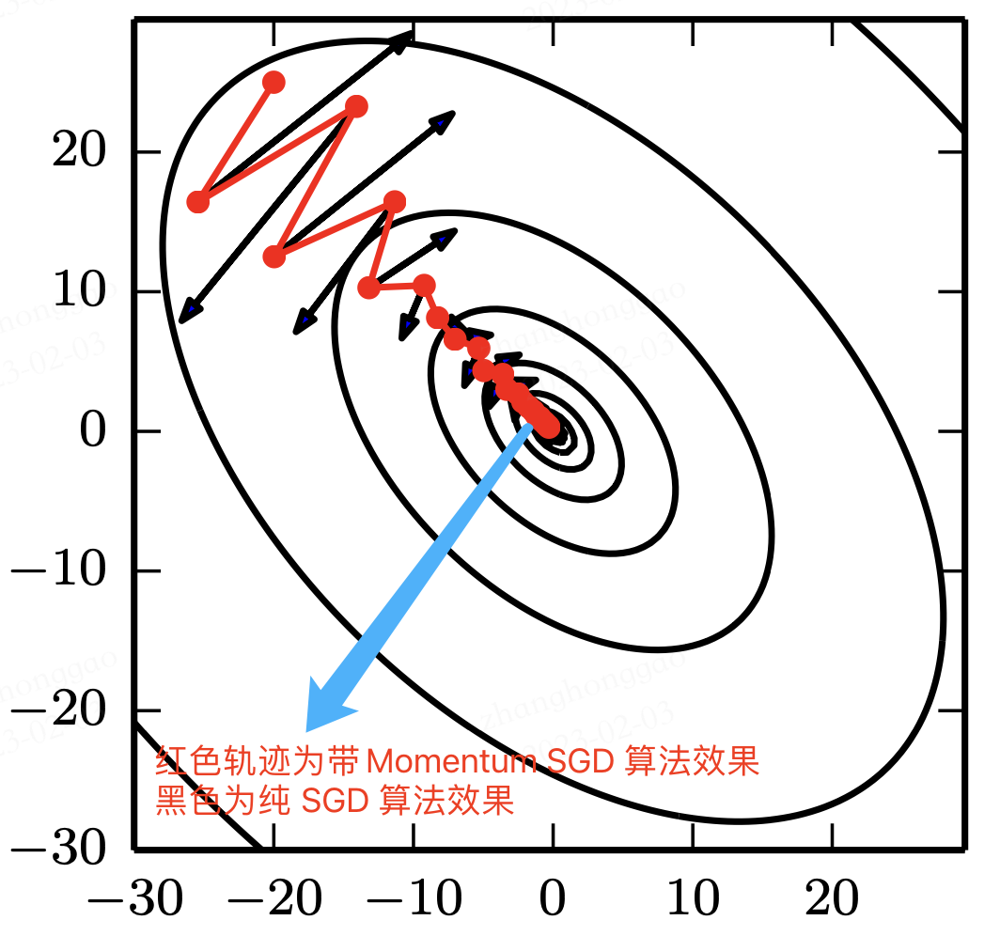
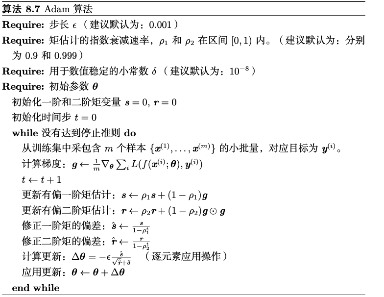

## 前言

所谓深度神经网络的优化算法，**即用来更新神经网络参数，并使损失函数最小化的算法**。优化算法对于深度学习非常重要，如果说网络参数初始化（模型迭代的初始点）能够决定模型是否收敛，那优化算法的性能则**直接**影响模型的训练效率。

了解不同优化算法的原理及其超参数的作用将使我们更有效的调整优化器的超参数，从而提高模型的性能。

本文的优化算法特指: 寻找神经网络上的一组参数 $\theta $，它能显著地降低损失函数 $J(\theta )$，该损失函数通常包括整个训练集上的性能评估和额外的正则化项。

> 本文损失函数、目标函数、代价函数不严格区分定义。

## 一，梯度下降优化算法

### 1.1，随机梯度下降 SGD

梯度下降法是最基本的一类优化器，目前主要分为三种梯度下降法：标准梯度下降法(GD, Gradient Descent)，随机梯度下降法(SGD, Stochastic Gradient Descent)及批量梯度下降法(BGD, Batch Gradient Descent)。

深度学习项目中的 `SGD` 优化一般默认指批量梯度下降法。其算法描述如下:

- 输入和超参数: $\eta$ 全局学习率

- 计算梯度：$g_t = \nabla_\theta J(\theta_{t-1})$

- 更新参数：$\theta_t = \theta_{t-1} - \eta \cdot g_t$

SGD 优化算法是最经典的神经网络优化方法，**虽然收敛速度慢，但是收敛效果比较稳定**。

下图1展现了随机梯度下降算法的梯度搜索轨迹示意图。可以看出由于梯度的随机性质，梯度搜索轨迹要很嘈杂（**动荡现象**）。


因此，在实际应用中，**随机梯度下降 SGD 法必须和动态学习率**方法结合起来使用，否则使用固定学习率 + SGD的组合会使得模型收敛过程变得更复杂。

### 1.2，动量 Momentum

虽然**随机梯度下降**仍然是非常受欢迎的优化方法，但其学习过程有时会很慢且其梯度更新方向完全依赖于当前 `batch` 样本数据计算出的梯度，因而十分不稳定，因为数据可能有噪音。

受启发于物理学研究领域研究，基于动量 Momentum  (Polyak, 1964) 的 SGD 算法**用于改善参数更新时可能产生的振荡现象**。动量算法旨在加速学习，特别是处理高曲率、小但一致的梯度，或是带噪声的梯度。两种算法效果对比如下图 2所示。

> 花书中对动量算法对目的解释是，解决两个问题: Hessian 矩阵的病态条件和随机梯度的方差。更偏学术化一点。



Momentum 算法的通俗理解就是，其模拟了物体运动时的惯性，即更新参数的时候会同时结合过去以及当前 batch 的梯度。算法在更新的时候会一定程度上保留之前更新的方向，同时利用当前 batch 的梯度微调最终的更新方向。这样一来，可以在一定程度上增加稳定性，从而学习地更快，并且还有一定摆脱局部最优的能力。

下图3展现了动量算法的前进方向。


第一次的梯度更新完毕后，会记录 $v1$ 的动量值。在“求梯度点”进行第二次梯度检查时，得到2号方向，与 $v1$ 的动量**组合**后，最终的更新为 2' 方向。这样一来，由于有 $v1$ 的存在，会迫使梯度更新方向具备“惯性”，从而可以减小随机样本造成的震荡。

**Momentum 算法描述如下**:

1，**输入和参数**:

- $\eta$ - 全局学习率
- $\alpha$ - 动量参数，一般取值为 0.5, 0.9, 0.99，取 `0`，则等效于常规的随机梯度下降法，其**控制动量信息对整体梯度更新的影响程度**。
- $v_t$ - 当前时刻的动量，初值为 0。

2，**算法计算过程**：

- 计算梯度：$g_t = \nabla_\theta J(\theta_{t-1})$

- 计算速度更新：$v_t = \alpha \cdot v_{t-1} + \eta \cdot g_t$ (公式1)

- 更新参数：$\theta_t = \theta_{t-1} - v_t$ (公式2)

> 注意，这里的公式1和公式2和花书上的公式形式上略有不同，但其最终结果是相同的。本文给出的手工推导迭代公式，来源文章 [15.2 梯度下降优化算法](https://github.com/microsoft/ai-edu/blob/master/%E5%9F%BA%E7%A1%80%E6%95%99%E7%A8%8B/A2-%E7%A5%9E%E7%BB%8F%E7%BD%91%E7%BB%9C%E5%9F%BA%E6%9C%AC%E5%8E%9F%E7%90%86/%E7%AC%AC7%E6%AD%A5%20-%20%E6%B7%B1%E5%BA%A6%E7%A5%9E%E7%BB%8F%E7%BD%91%E7%BB%9C/15.2-%E6%A2%AF%E5%BA%A6%E4%B8%8B%E9%99%8D%E4%BC%98%E5%8C%96%E7%AE%97%E6%B3%95.md)。

通过推导参数更新迭代公式，更容易理解算法，根据算法公式(1)(2)，以$W$参数为例，有：

1. $v_0 = 0$
2. $dW_0 = \nabla J(w)$
3. $v_1 = \alpha v_0 + \eta \cdot dW_0 = \eta \cdot dW_0$
4. $W_1 = W_0 - v_1=W_0 - \eta \cdot dW_0$
5. $dW_1 = \nabla J(w)$
6. $v_2 = \alpha v_1 + \eta dW_1$
7. $W_2 = W_1 - v_2 = W_1 - (\alpha v_1 +\eta dW_1) = W_1 - \alpha \cdot \eta \cdot dW_0 - \eta \cdot dW_1$
8. $dW_2 = \nabla J(w)$
9. $v_3=\alpha v_2 + \eta dW_2$
10. $W_3 = W_2 - v_3=W_2-(\alpha v_2 + \eta dW_2) = W_2 - \alpha^2 \eta dW_0 - \alpha \eta dW_1 - \eta dW_2$

可以看出与普通 SGD 的算法 $W_3 = W_2 - \eta dW_2$ 相比，动量法不但每次要减去当前梯度，还要减去历史梯度$W_0, W_1$ 乘以一个不断减弱的因子$\alpha$、$\alpha^2$，因为$\alpha$小于1，所以$\alpha^2$比$\alpha$小，$\alpha^3$比$\alpha^2$小。这种方式的学名叫做**指数加权平均**。

在实际模型训练中，SGD 和动量法的比较如下表所示。

> 实验效果对比图来源于资料 1。

|算法     | 损失函数和准确率|
|--------|------------------------------------------------------------|
|SGD     ||
|Momentum||

从上表的对比可以看出，同一个深度模型， 普通随机梯度下降法的曲线震荡很严重，且经过 epoch=10000 次也没有到达预定 0.001 的损失值；但动量算法经过 2000 个 epoch 就迭代结束。

### 1.3，Nesterov 动量

受 Nesterov 加速梯度算法 (Nesterov, 1983, 2004) 启发，Sutskever *et al.* (2013) 提出了动量算法的一个变种，Nesterov 动量随机下降法（`NAG` ，英文全称是 Nesterov Accelerated Gradient，或者叫做 Nesterov Momentum 。

Nesterov 动量随机梯度下降方法是在上述动量梯度下降法更新梯度时加入对当前梯度的校正，简单解释就是**往标准动量方法中添加了一个校正因子**。

NAG 算法描述如下:

1，**输入和参数**：

- $\eta$ - 全局学习率
- $\alpha$ - 动量参数，缺省取值 0.9
- $v$ - 动量，初始值为0

2，**算法计算过程**：

- 参数临时更新：$\hat \theta = \theta_{t-1} - \alpha \cdot v_{t-1}$
- 网络前向传播计算：$f(\hat \theta)$
- 计算梯度：$g_t = \nabla_{\hat\theta} J(\hat \theta)$
- 计算速度更新：$v_t = \alpha \cdot v_{t-1} + \eta \cdot g_t$
- 更新参数：$\theta_t = \theta_{t-1}  - v_t$

### 1.4，代码实践

Pytorch 框架中把普通 SGD、Momentum 算法和 Nesterov Momentum 算法的实现结合在一起了，对应的类是 `torch.optim.SGD`。注意，其更新公式与其他框架略有不同，其中 $p$、$g$、$v$、$\mu$ 表示分别是参数、梯度、速度和动量。
$$
\begin{align}
v_{t+1} &= \mu * v_{t} + g_{t+1} \nonumber \\ 
p_{t+1} &= p_{t} - \text{lr} * v_{t+1} \nonumber \\
&= p_{t} - \text{lr} * \mu * v_{t} - \text{lr} * g_{t+1} \nonumber
\end{align}
$$

```python
# 和源码比省略了部分不常用参数
class torch.optim.SGD(params, lr=required, momentum=0, dampening=0,
                 weight_decay=0, nesterov=False)
```

1，**功能解释**：

可实现 SGD 优化算法、带动量 SGD 优化算法、带 NAG(Nesterov accelerated gradient)动量 SGD 优化算法，并且均可拥有 weight_decay 项。

2，**参数解释**：

- `params`(iterable): 参数组(参数组的概念参考优化器基类: `Optimizer`)，即优化器要管理的那部分参数。

- `lr`(float): 初始学习率，可按需随着训练过程不断调整学习率。
- `momentum`(float): 动量因子，通常设置为 0.9，0.8。
- `weight_decay`(float): 权值衰减系数，也就是 L2 正则项的系数。
- `nesterov`(bool)- bool 选项，是否使用 NAG(Nesterov accelerated gradient)。

训练模型时常用配置如下:

```python
torch.optim.SGD(lr=0.02, momentum=0.9, weight_decay=0.0001)
```

## 二，自适应学习率算法

神经网络研究员早就意识到学习率肯定是难以设置的超参数之一，因为它对深度学习模型的性能有着显著的影响。

### 2.1，AdaGrad

在 AdaGrad (Duchi et al., 2011) 提出之前，我们对于所有的参数使用相同的学习率进行更新，它是第一个自适应学习率算法，通过**所有梯度历史平方值之和的平方根**，从而使得步长单调递减。它根据自变量在每个维度的梯度值的大小来调整各个维度上的学习率，从而避免统一的学习率难以适应所有维度的问题。

`AdaGrad` 法根据训练轮数的不同，对学习率进行了动态调整。具体表现在，对低频出现的参数进行大的更新（快速下降的学习率），对高频出现的参数进行小的更新（相对较小的下降学习率）。因此，他很适合于处理稀疏数据。

AdaGrad 算法描述如下:

1，**输入和参数**

- $\eta$ - 全局学习率
- $\epsilon$ - 用于数值稳定的小常数，建议缺省值为`1e-6`
- $r=0$ 初始值
  

**2，算法计算过程**：

- 计算梯度：$g_t = \nabla_\theta J(\theta_{t-1})$

- 累计平方梯度：$r_t = r_{t-1} + g_t \odot g_t$

- 计算梯度更新：$\Delta \theta = {\eta \over \epsilon + \sqrt{r_t}} \odot g_t$(和动手学深度学习给出的学习率调整公式形式不同)

- 更新参数：$\theta_t=\theta_{t-1} - \Delta \theta$

$\odot$ 按元素相乘，开方、除法和乘法的运算都是按元素运算的。这些按元素运算使得目标函数自变量中每个元素都分别拥有自己的学习率。

**AdaGrad 总结**：在凸优化背景中，AdaGrad 算法具有一些令人满意的理论性质。但是，经验上已经发现，对于训练深度神经网络模型而言，从训练开始时积累梯度平方会导致有效学习率过早和过量的减小。**AdaGrad 在某些深度学习模型上效果不错，但不是全部**。

Pytorch 框架中 AdaGrad 优化器:

```python
class torch.optim.Adagrad(params, lr=0.01, lr_decay=0, weight_decay=0, initial _accumulator_value=0)
```

### 2.2，RMSProp

`RMSProp`（Root Mean Square Prop），均方根反向传播。

RMSProp 算法 (Hinton, 2012) 和 AdaGrad 算法的不同在于， **RMSProp算法使⽤了小批量随机梯度按元素平⽅的指数加权移动平均来调整学习率**。

RMSProp 算法描述如下:

1，**输入和参数**：

- $\eta$ - 全局学习率，建议设置为0.001
- $\epsilon$ - 用于数值稳定的小常数，建议缺省值为1e-8
- $\alpha$ - 衰减速率，建议缺省取值0.9
- $r$ - 累积变量矩阵，与$\theta$尺寸相同，初始化为0
  

2，**算法计算过程**（计算梯度和更新参数公式和 AdaGrad 算法一样）：

- 累计平方梯度：$r = \alpha \cdot r + (1-\alpha)(g_t \odot g_t)$

- 计算梯度更新：$\Delta \theta = {\eta \over \sqrt{r + \epsilon}} \odot g_t$

**RMSProp 总结**：经验上，RMSProp 已被证明是一种有效且实用的深度神经网络优化算法。目前，它是深度学习从业者经常采用的优化方法之一。其初始学习率设置为 `0.01` 时比较理想。

Pytorch 框架中 RMSprop 优化器:

```python
class torch.optim.RMSprop(params, lr=0.01, alpha=0.99, eps=1e- 08, weight_decay=0, momentum=0, centered=False)
```

### 2.3，AdaDelta

AdaDelta 法也是对 AdaGrad 法的一种改进，它**旨在解决深度模型训练后期，学习率过小问题**。相比计算之前所有梯度值的平方和，AdaDelta 法仅计算在一个大小为 $w$ 的时间区间内梯度值的累积和。

RMSProp 算法计算过程如下:

1，**参数定义**：

- **Adadelta 没有学习率参数**。相反，它使用参数本身的变化率来调整学习率。

- $s$ \- 累积变量，初始值 0

2，**算法计算过程**:

- 计算梯度：$g_t = \nabla_\theta J(\theta_{t-1})$
- 累积平方梯度：$s_t = \alpha \cdot s_{t-1} + (1-\alpha) \cdot g_t \odot g_t$
- 计算梯度更新：$\Delta \theta = \sqrt{r_{t-1} + \epsilon \over s_t + \epsilon} \odot g_t$
- 更新梯度：$\theta_t = \theta_{t-1} - \Delta \theta$
- 更新变化量：$r = \alpha \cdot r_{t-1} + (1-\alpha) \cdot \Delta \theta \odot \Delta \theta$

Pytorch 框架中 Adadelta 优化器:

```python
class torch.optim.Adadelta(params, lr=1.0, rho=0.9, eps=1e- 06, weight_decay=0)
```

### 2.4，Adam

**Adam** (Adaptive Moment Estimation，Kingma and Ba, 2014) 是另一种学习率自适应的优化算法，相当于 `RMSProp + Momentum` 的效果，即**动量项的 RMSprop 算法**。

Adam 算法在 RMSProp 算法基础上对小批量随机梯度也做了指数加权移动平均。**和 AdaGrad 算法、RMSProp 算法以及 AdaDelta 算法一样，目标函数自变量中每个元素都分别拥有自己的学习率**。

Adam 算法计算过程如下:

1，**参数定义**：

- $t$ - 当前迭代次数
- $\eta$ - 全局学习率，建议缺省值为0.001
- $\epsilon$ - 用于数值稳定的小常数，建议缺省值为1e-8
- $\beta_1, \beta_2$ - 矩估计的指数衰减速率，$\in[0,1)$，建议缺省值分别为0.9和0.999

2，**算法计算过程**:

- 计算梯度：$g_t = \nabla_\theta J(\theta_{t-1})$

- 计数器加一：$t=t+1$
- 更新有偏一阶矩估计：$m_t = \beta_1 \cdot m_{t-1} + (1-\beta_1) \cdot g_t$
- 更新有偏二阶矩估计：$v_t = \beta_2 \cdot v_{t-1} + (1-\beta_2)(g_t \odot g_t)$
- 修正一阶矩的偏差：$\hat m_t = m_t / (1-\beta_1^t)$
- 修正二阶矩的偏差：$\hat v_t = v_t / (1-\beta_2^t)$
- 计算梯度更新：$\Delta \theta = \eta \cdot \hat m_t /(\epsilon + \sqrt{\hat v_t})$
- 更新参数：$\theta_t=\theta_{t-1} - \Delta \theta$

从上述公式可以看出 Adam 使用**指数加权移动平均值**来估算梯度的动量和二次矩，即使用了状态变量 $m_t、v_t$。

**怎么理解 Adam 算法？**

首先，在 Adam 中，动量直接并入了梯度一阶矩(指数加权)的估计。将动量加入 RMSProp 最直观的方法是将动量应用于缩放后的梯度。结合缩放的动量使用没有明确的理论动机。其次，Adam 包括偏置修正，修正从原点初始化的一阶矩(动量项)和(非中心的)二阶矩的估计。RMSProp 也采用了(非中心的)二阶矩估计，然而缺失了修正因子。因此，不像 Adam，RMSProp 二阶矩估计可能在训练初期有很高的偏置。 Adam 通常被认为对超参数的选择相当鲁棒，尽管学习率有时需要从建议的默认修改。

> 初学者看看公式就行，这段话我也是摘抄花书，目前没有很深入理解。

Adam 算法实现步骤如下。



**Adam 总结**：由于 Adam 继承了 RMSProp 的传统，所以学习率同样不宜设置太高，初始学习率设置为 `0.01` 时比较理想。

Pytorch 框架中 Adam 优化器:

```python
class torch.optim.Adam(params, lr=0.001, betas=(0.9, 0.999), eps=1e- 08, weight_decay=0, amsgrad=False)
```

## 三，总结

### 3.1，PyTorch 的十个优化器

PyTorch 中所有的优化器基类是 `Optimizer` 类，在 Optimizer 类中定义了 5 个 实用的基本方法，分别是 

- `zero_grad()`：将梯度清零。
-  `step(closure)`：执行一步权重参数值更新, 其中可传入参数 closure(一个闭包)。
- `state_dict()`：获取模型当前参数，以一个有序字典形式返回，key 是参数名，value 是参数。
- `load_state_dict(state_dict)` ：将 state_dict 中的参数加载到当前网络，常用于 finetune。
-  `add_param_group(param_group)`：给 optimizer 管理的参数组中增加一组参数，可为该组参数定制 lr, momentum, weight_decay 等，在 finetune 中常用。

PyTorch 基于 `Optimizer` 基类构建了十种优化器，有常见的 SGD、ASGD、Rprop、 RMSprop、Adam 等等。注意 PyTorch 中的优化器和前文描述的优化算法略有不同，PyTorch 中 给出的优化器与原始论文中提出的优化方法，多少是有些改动的，详情可直接阅读源码。

### 3.2，优化算法总结

- Adam 等自适应学习率算法对于稀疏数据具有优势，且收敛速度很快；但精调参数的 SGD（+Momentum）往往能够取得更好的最终结果。

- 用相同数量的超参数来调参，尽管有时自适应优化算法在训练集上的 loss 更小，但是他们在测试集上的 loss 却可能比 SGD 系列方法高。

- 自适应优化算法在训练前期阶段在训练集上收敛的更快，但可能在测试集上的泛化性不好。 
- 目前，最流行并且使用很高的优化算法包括 SGD、具动量的 SGD、RMSProp、 具动量的 RMSProp、AdaDelta 和 Adam。但选择哪一个算法主要取决于使用者对算法的熟悉程度(更方便调节超参数)。

## 参考资料

1. [《智能之门-神经网络与深度学习入门》-15.2 梯度下降优化算法](https://microsoft.github.io/ai-edu/%E5%9F%BA%E7%A1%80%E6%95%99%E7%A8%8B/A2-%E7%A5%9E%E7%BB%8F%E7%BD%91%E7%BB%9C%E5%9F%BA%E6%9C%AC%E5%8E%9F%E7%90%86/%E7%AC%AC7%E6%AD%A5%20-%20%E6%B7%B1%E5%BA%A6%E7%A5%9E%E7%BB%8F%E7%BD%91%E7%BB%9C/15.2-%E6%A2%AF%E5%BA%A6%E4%B8%8B%E9%99%8D%E4%BC%98%E5%8C%96%E7%AE%97%E6%B3%95.html)
2. 《深度学习》-第八章 深度模型中的优化
3. 《动手学深度学习》-优化算法
