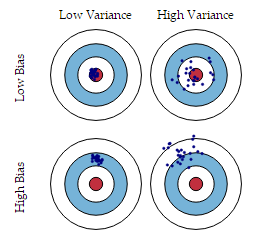

- [一，Bias(偏差)，Error(误差)和Varience(方差)](#一bias偏差error误差和varience方差)
  - [1.1，偏差与方差公式](#11偏差与方差公式)
  - [1.2，导致偏差和方差的原因](#12导致偏差和方差的原因)
  - [1.3，深度学习中的偏差与方差](#13深度学习中的偏差与方差)
  - [1.4，交叉验证](#14交叉验证)
  - [1.5，均方误差和方差、标准差](#15均方误差和方差标准差)
- [二，先验概率与后验概率](#二先验概率与后验概率)
  - [2.1，条件概率](#21条件概率)
  - [2.2，先验概率](#22先验概率)
  - [2.3，后验概率](#23后验概率)
  - [2.4，贝叶斯公式](#24贝叶斯公式)
  - [2.5，后验概率实例](#25后验概率实例)
- [三，相对熵与交叉熵](#三相对熵与交叉熵)
  - [3.1，信息熵](#31信息熵)
  - [3.2，相对熵/KL散度](#32相对熵kl散度)
  - [3.3，交叉熵 cross-entroy](#33交叉熵-cross-entroy)
  - [3.4，为什么交叉熵可以用作代价](#34为什么交叉熵可以用作代价)
  - [3.5，KL 散度与交叉熵的关系](#35kl-散度与交叉熵的关系)
- [四，似然函数](#四似然函数)
- [五，最大似然估计](#五最大似然估计)
- [六，容量、过拟合和欠拟合](#六容量过拟合和欠拟合)
- [七，交叉验证](#七交叉验证)
- [八，如何处理数据中的缺失值](#八如何处理数据中的缺失值)
- [九，数据清洗与特征处理](#九数据清洗与特征处理)
  - [9.1，清洗标注数据](#91清洗标注数据)
  - [9.2，特征分类](#92特征分类)
  - [9.3，特征处理与分析](#93特征处理与分析)
- [参考资料](#参考资料)

> 深度学习是机器学习的一个特定分支，要想充分理解深度学习，就必须对机器学习的基本原理有深刻的理解。机器学习的本质属于应用统计学，其更多地关注如何用计算机统计地估计复杂函数，而不太关注为这些函数提供置信区间，大部分机器学习算法可以分成监督学习和无监督学习两类；通过组合不同的算法部分，例如优化算法、代价函数、模型和数据集可以建立一个完整的机器学习算法。

## 一，Bias(偏差)，Error(误差)和Varience(方差)
> [机器学习中的 Bias(偏差)，Error(误差)，和 Variance(方差)有什么区别和联系？](https://www.zhihu.com/question/27068705)
 
**有两个不同的概念都被称为“方差”**。一种是**理论概率分布的方差**。而另一种方差是一组观测值的特征(**统计意义上的方差**)。观测值通常是从真实世界的系统中测量的。如果给出系统的所有可能的观测，则它们算出的方差称为总体方差；然而，一般情况下我们只使用总体的一个子集（样本），由此计算出的方差称为样本方差。用样本计算出的方差可认为是对整个总体的方差的估计量。
> 更多名词定义参考 [总体、样本、总体方差、样本方差、抽样方差和标准误差](https://zhuanlan.zhihu.com/p/106706044)。

统计领域为我们提供了很多工具来实现机器学习目标，不仅可以解决训练集上的任务，还可以泛化。偏差-方差指标方法是试图对学习算法(模型)的期望泛化错误率进行拆解。`Error = Bias + Varience`：
+ `Error`: 反映的是整个模型的准确度。
+ `Bias`: 反映的是模型在**样本上的输出与真实值之间的误差**，即模型的准确性，以打靶事件为例，`low bias`，一般就得复杂化模型，表现出来就是点都打在靶心中间，但这样容易过拟合 (`overfitting`)，过拟合对应下图是 `high variance`，点很分散。
+ `Varience`: 反映的是模型每一次输出的结果与模型输出期望之间的误差，即模型的稳定性，是训练集上训练出来的模型在测试集上的表现，同样以打靶事件为例，`low variance` 对应就是点都打的很集中，但不一定是靶心附近，手很稳，但是瞄的不准。



### 1.1，偏差与方差公式

假设对测试样本 $x$, 令 $y_{D}$ 为 $x$ 在数据集中的标记，$y$ 为 $x$ 的真实标记， $f(x;D)$ 为在训练集 $D$ 上学习到的模型 $f$ 在 $x$ 上的预测输出。
+ 训练过程中期望输出与真实标记（标签）的差别称为偏差（`bias`）：$bias^{2}(x) = (\bar{f} - y)^{2}$
+ （交叉验证训练模型）使用样本数相同不同训练集训练出来的模型在测试集上产生的`方差`为： $var(x) = E_{D}[(f(x;D) - \bar{f})^{2}] $

### 1.2，导致偏差和方差的原因
>  [机器学习中的Bias(偏差)，Error(误差)，和Variance(方差)有什么区别和联系？](https://www.zhihu.com/question/27068705)

+ 偏差通常是由于我们对学习算法做了错误的假设，或者模型的复杂度不够；
    + 比如真实模型是一个二次函数，而我们假设模型为一次函数，这就会导致偏差的增大（欠拟合）；
    + 由偏差引起的误差通常在训练误差上就能体现，或者说训练误差主要是由偏差造成的
+ 方差通常是由于模型的复杂度相对于训练集过高导致的；
    + 比如真实模型是一个简单的二次函数，而我们假设模型是一个高次函数，这就会导致方差的增大（过拟合）；
    + 由方差引起的误差通常体现在测试误差相对训练误差的增量上。
### 1.3，深度学习中的偏差与方差
+ 神经网络的拟合能力非常强，因此它的训练误差（偏差）通常较小；
+ 但是过强的拟合能力会导致较大的方差，使模型的测试误差（泛化误差）增大；
+ 深度学习的核心工作之一就是**研究如何降低模型的泛化误差**，这类方法统称为`正则化方法`。
### 1.4，交叉验证
在训练数据上面，我们可以进行·交叉验证(Cross-Validation)·。一种方法叫做 ·`K-fold Cross Validation` ( K 折交叉验证), K 折交叉验证，初始采样分割成 K 个子样本，一个单独的子样本被保留作为验证模型的数据，其他 K-1 个样本用来训练。交叉验证重复 K 次，每个子样本验证一次，平均 `K` 次的结果或者使用其它结合方式，最终得到一个单一估测。
+ 当 `K` 值大的时候， 我们会有更少的 `Bias`(偏差), 更多的 `Variance`。
+ 当 `K` 值小的时候， 我们会有更多的 `Bias`(偏差), 更少的 `Variance`。


### 1.5，均方误差和方差、标准差
**1，均方误差（MSE，mean squared error）与均方根误差(RMSE)**

均方误差是预测值与真实值之差的平方和的平均值，即误差平方和的平均数。计算公式形式上接近方差，它的开方叫均方根误差 `RMSE`，均方根误差才和标准差形式上接近。
计算公式如下：
$$\frac{1}{n} \sum_{i=1}^{n}[f(x_i)-y_i]^2$$
在机器学习中均方误差常用作**预测和回归问题的损失函数**，均方误差越小，说明模型预测的越准确，反之则越不准确。

**2，方差(variance)与标准差**

方差是在概率论和统计学中衡量随机变量或一组数据时离散程度的度量，在统计描述和概率分布中各有不同的定义，并有不同的公式。概率论中方差用来度量随机变量和其数学期望（即均值）之间的偏离程度。**统计中的方差（样本方差）是样本实际值与实际值的总体平均值之差的平方和的平均值**，即将各个误差之平方（而非取绝对值，使之肯定为正数）相加之后再除以总数。**总体方差**计算公式如下：
$$\sigma ^2 = \frac{\sum_{i=1}^{N}(X_{i}-\mu)^2}{N}$$
公式解析：
1. 因为和样本数无关，所以分母为样本数
2. 累加每个值和均值差值的平方，对应于每个值相对于均值的偏差，对应于离散程度，平方是对离散程度的加剧，同时能让差值总为正数，以符合偏差的概念意义
3. $\sigma$ 的平方表示总体方差，$X$ 表示变量，$\mu $ 表示总体的均值，$N$ 表示总体样本数量。

由于方差是数据的平方，与检测值本身相差太大，难以直观的衡量，所以常用方差开根号换算回来，就成了标准差（Standard Deviation）用$\sigma$ 表示，标准差计算公式如下：
$$\sigma = \sqrt{\frac{\sum_{i=1}^{N}(X_{i}-\mu)^2}{N}}$$
**3，样本方差**

在实际项目中，总体均值难以得到时，应用样本统计量替代总体参数，经校正后，样本方差的计算公式如下：
> 样本方差是指总体各单位变量值与其算术平均数的离差平方的平均数。样本方差的意义是用来估计总体方差（统计术语：样本方差是对总体方差的无偏估计）。

$$\sigma ^2 = \frac{\sum_{i=1}^{n-1}(X_{i}-\overline{x_{i}..x_{n}})^2}{n-1}$$
$\overline{x_{i}..x_{n}}$ 表示样本均值公式分母由总体方差的 `N` 变为了 `n-1`，使得样本方差更能反映总体方差。

## 二，先验概率与后验概率
> 这章知识的公式、定理、概念比较多，会难以理解，建议手推公式。
### 2.1，条件概率
一个事件发生后另一个事件发生的概率。设 A 与 B 为样本空间 Ω 中的两个事件，其中 P(B)>0。那么在事件 B 发生的条件下，事件 A 发生的条件概率为：
$$P(A|B) = \frac {P(A\cap B)} {P(B)}$$
### 2.2，先验概率
事件发生前的概率，可以是基于以往经验/分析，也可以是基于历史数据的统计，甚至可以是人的主观观点给出。一般是**单独**事件概率，如 P(x), P(y)。
### 2.3，后验概率
+ 事情已经发生，要求这件事情发生的原因是由某个因素引起的可能性的大小（**由果推因**：就是在知道“果”之后，去推测“因”的概率）
+ 后验概率和和先验概率的关系可以通过`贝叶斯`公式求得，公式如下：
$$P(B_{i}|A) = \frac {P(B_{i}\cdot P(A|B_{i}}{P(B_{1})\cdot P(A|B_{1}) + P(B_{2})\cdot P(A|B_{2}) }$$
### 2.4，贝叶斯公式
贝叶斯公式是建立在条件概率的基础上寻找事件发生的原因（即大事件 `A` 已经发生的条件下，分割中的小事件 `Bi` 的概率），设 `B1,B2,...` 是样本空间 `Ω` 的一个划分，则对任一事件 `A（P(A)>0)`, 有：$$P(B_{i}|A) = \frac {P(A|B_{i})P(B_{i})}{\sum_{j=1}^{n}P(B_{j})P(A|B_{j})}$$

+ `Bi` 常被视为导致试验结果A发生的”原因“；
+ `P(Bi)(i=1,2,...)` 表示各种原因发生的可能性大小，故称先验概率；
+ `P(Bi|A)(i=1,2...)` 则反映当试验产生了结果A之后，再对各种原因概率的新认识，故称后验概率。
### 2.5，后验概率实例
假设一个学校里有 `60％` 男生和 `40%` 女生。女生穿裤子的人数和穿裙子的人数相等，所有男生穿裤子。一个人在远处随机看到了一个穿裤子的学生。那么这个学生是女生的概率是多少？
+ 使用贝叶斯定理，事件A是看到女生，事件B是看到一个穿裤子的学生。我们所要计算的是 $P(A|B)$。
+ $P(A)$ 是忽略其它因素，看到女生的概率，在这里是 40%；
+ $P(A')$ 是忽略其它因素，看到不是女生（即看到男生）的概率，在这里是 60%；
+ $P(B|A)$ 是女生穿裤子的概率，在这里是 50%；
+ $P(B|A')$ 是男生穿裤子的概率，在这里是 100%；
+ $P(B)$ 是忽略其它因素，学生穿裤子的概率，$P(B) = P(B|A)P(A) + P(B|A')P(A')$，在这里是 0.5×0.4 + 1×0.6 = 0.8。

根据贝叶斯定理，我们计算出后验概率P(A|B):
$$P(A|B) = \frac {P(B|A)P(A)}{P(B)} = \frac {0.5\times 0.4} {0.8}$$

## 三，相对熵与交叉熵

> [【直观详解】信息熵、交叉熵和相对熵](https://charlesliuyx.github.io/2017/09/11/%E4%BB%80%E4%B9%88%E6%98%AF%E4%BF%A1%E6%81%AF%E7%86%B5%E3%80%81%E4%BA%A4%E5%8F%89%E7%86%B5%E5%92%8C%E7%9B%B8%E5%AF%B9%E7%86%B5/)
[为什么交叉熵（cross-entropy）可以用于计算代价](https://www.zhihu.com/question/65288314)

### 3.1，信息熵

**其实信息熵是香农信息量（$log\frac{1}{p}$）的期望（均值），它不是针对每条信息，而是针对整个不确定性结果集而言，信息熵越大，事件不确定性就越大。单条信息只能从某种程度上影响结果集概率的分布**。信息熵定义：
$$H(P) = \sum_{i} P(i)log_{a} \frac{1}{P(i)} = -\sum_{i}P(i)log_{a} P(i)$$
$P_{i}$ 表示第 $i$ 个事件发生得概率，总的来说信息熵其实从某种意义上反映了**信息量存储下来需要多少存储空间**。
总结为：根据真实分布，我们能够找到一个最优策略，以**最小的代价消除系统的不确定性**（比如编码），而这个代价的大小就是**信息熵**。

### 3.2，相对熵/KL散度

`KL` 散度，有时候也叫 `KL 距离`，一般被用于计算两个分布之间的不同，记为 $D_{KL}(P||Q) = H(P,Q) - H(P)$，对于同一个离散随机变量 $\textrm{x}$ 有两个单独的概率分布 $P(x)$ 和 $Q(x)$，其 `KL` 散度为：

$$D_{KL}(P \| Q) = \sum_i P(i)log_{a} \frac{P(i)}{Q(i)} = \sum_i P(i)[logP(x) - log Q(x)]$$

当 $P(i) = Q(i)$ 的时候，该值为 `0`，深度学习过程也是一个降低该值的过程，**该值越低，训练出来的概率 $Q$ 越接近样本集概率 $P$，即越准确**，或者可以理解为相对熵是一把标尺，用来衡量两个函数是否相似，相似就是 0。即，**相对熵 = 某个策略的交叉熵 - 信息熵**（根据系统真实分布计算而得的信息熵，为最优策略），**当信息熵为常量时，交叉熵与KL散度相等**。

### 3.3，交叉熵 cross-entroy

交叉熵是由信息熵而得来的，和 `KL` 散度关系密切，拓展用在机器学习/深度学习中作损失函数。假定在确定性更大的概率分布情况下，用更不确定的存储策略来计算，比如使用 `P` 的概率乘上 `Q` 的存储因子，套用信息熵公式：
$$H(P,Q) = \sum_{i} P(i)log_{a} \frac{1}{Q(i)} = -\sum_{i}P(x_i)log_{a} Q(x_i)$$
用预测概率 $q$ 分布，去编码真实标签 $p$ 的分布，得到的信息量。**交叉熵，用来衡量在给定的真实分布下，使用非真实分布指定的策略消除系统的不确定性所需要付出努力的大小**。总的来说，我们的目的是：让熵尽可能小，即存储空间小（消除系统的不确定的努力小）。**交叉熵的一些性质：**

+ 非负。
+ 和 `KL` 散度相同，交叉熵也不具备对称性，即 $H(P,Q)≠H(Q,P)$。
+ 交叉熵主要用于描述两个事件之间的相互关系，对同一个分布求交叉熵等于对其求熵

### 3.4，为什么交叉熵可以用作代价

从数学上来理解就是，为了让学到的模型分布更接近真实数据的分布，我们需要最小化模型数据分布与训练数据之间的 `KL 散度`，而因为训练数据的分布是固定的，因此最小化 `KL 散度`等价于最小化交叉熵，而且交叉熵计算更简单，所以机器/深度学习中常用交叉熵 `cross-entroy` 作为分类问题的损失函数。

使用交叉熵损失大大提高了具有 `sigmoid` 和 `softmax` 输出的模型的性能，而当使用均方误差损失时会存在饱和和学习缓慢的问题。

### 3.5，KL 散度与交叉熵的关系

+ `KL` 散度和交叉熵在特定条件下等价
+ $D_{KL}(P||Q) = H(P,Q) - H(P)$
## 四，似然函数
## 五，最大似然估计
## 六，容量、过拟合和欠拟合

## 七，交叉验证

交叉验证是机器学习当中的概念，一般深度学习不会使用交叉验证方法，原因是深度学习的数据集一般都很大，但是也有例外，`Kaggle` 的一些医疗类比赛，训练集一般只有几千张，由于训练数据很少，用来作为验证集的数据会非常少，因此训练的模型其验证分数可能会有很大波动，直接取决于我们所选择的验证集和训练集，也就是说，验证集的划分方式可能会造成验证分数上存在较大**方差**，无法对模型进行有效评估，同时也无法进行有效的超参数调整（`batch` 设置多少模型最佳收敛）。

也有替代方法允许我们使用所有的样本估计平均测试误差，代价是增加了计算量。这些过程是基于在原始数据上随机采样或分离出的不同数据集上重复训练和测试的想法，最常见的是 k-折交叉验证，这种方法将可用训练集花费为 `K` 个分区（一般取 `4`、`5`或者`10`），实例化训练 `k` 个相同模型，将每个模型在 `k-1` 个分区上训练，并在剩下的一个分区做验证，模型的验证分数等于 `k` 个验证分数的平均值。k-折交叉验证的训练集划分方式如下图所示：


`k` 折交叉验证的代码实现可以参考《Python深度学习》第三章，在模型训练好后，可通过计算所有 `Epoch` 的 `K` 折验证分数的平均值，并绘制每轮的模型验证指标变化曲线，观察哪个 `Epoch` 后模型不再收敛，从而完成模型调参工作。同时，`K` 折交叉验证方式训练模型会得到 `K`个模型，将这个 `K` 个模型在测试集上的推理结果取平均值或者投票，也是一种 `Ensemble` 方式，可以增强模型泛化性，防止过拟合。
```python
# 计算所有轮次中的 K 折验证分数平均值
average_mae_history = [np.mean([x[i] for x in all_mae_histories]) for i in range(num_epochs)]
```

## 八，如何处理数据中的缺失值

可以分为以下 2 种情况：

+ **缺失值较多**：直接舍弃该列特征，否则可能会带来较大噪声，从而对结果造成不良影响。
+ **缺失值较少**：当缺失值较少（`< 10%`）时，可以考虑对缺失值进行填充，有几下几种填充策略：
  + 用一个**异常值**填充（比如 0 ），缺失值作为一个特征处理：`data.fillna(0)`
  + 用**均值|条件均值**填充：`data.fillna(data.mean())`
  + 用**相邻数据**填充：`data.fillna(method='pad')`，`data.fillna(method='bfill')`
  + **插值**：`data.interpolate()`
  + **拟合**：简单来说，就是将缺失值也作为一个预测问题来处理：将数据分为正常数据和缺失数据，对有值的数据采用`随机森林`等方法拟合，然后对有缺失值的数据进行预测，用预测的值来填充

## 九，数据清洗与特征处理

> [机器学习中的数据清洗与特征处理综述](https://tech.meituan.com/2015/02/10/machinelearning-data-feature-process.html)
美团的这篇综述文章总结得不错，虽然缺少实例不容易直观理解，但是对于我这个初学者来说也足够了，本章内容几乎都来自于参考文章。

### 9.1，清洗标注数据

清洗标注数据的方法，主要是是数据采样和样本过滤。

+ `数据采样`：对于分类问题：选取正例，负例。对于回归问题，需要采集数据。对于采样得到的文本，根据需要设定样本权重，当模型不能使用全部的数据来训练时，需要对数据进行采样，设定一定的采样率。采样的方法包括随机采样，固定比例采样等方法。
+ 样本过滤：1.结合业务情况进行数据的过滤，例如去除crawler抓取，spam，作弊等数据。 - 2.异常点检测，采用异常点检测算法对样本进行分析，常用的异常点检测算法包括 - 偏差检测，例如聚类，最近邻等。

### 9.2，特征分类

根据不同的分类方法，可以将特征分为：

+ `Low level` 特征和 `High level` 特征
+ 稳定特征与动态特征。
+ 二值特征、连续特征、枚举特征

`Low level` 特征是较低级别的特征，主要是原始特征，不需要或者需要很少的人工处理和干预，例如文本中的词向量特征，图像特征中的像素点大小，用户 `id`，商品 id等。High level 特征是经过比较复杂的处理，结合部分业务逻辑或者规则、模型得到的特征，例如人工打分，模型打分等特征，可以用于较复杂的非线性模型。Low level 比较针对性，覆盖面小。长尾样本的预测值主要受 high level 特征影响。 高频样本的预测值主要受 low level 特征影响。

`稳定特征` 是变化频率较少的特征，例如评价平均分，团购单价价格等，在较长时间段内数值都不会发生变化。动态特征是更新变化比较频繁的特征，有些甚至是实时计算得到的特征，例如距离特征，2 小时销量等特征。或者叫做实时特征和非实时特征。针对两类特征的不同可以针对性地设计特征存储和更新方式，例如对于稳定特征，可以建入索引，较长时间更新一次，如果做缓存的话，缓存的时间可以较长。对于动态特征，需要实时计算或者准实时地更新数据，如果做缓存的话，缓存过期时间需要设置的较短。

`二值特征主要是 0/1 特征`，即特征只取两种值：`0 或者 1`，例如`用户 id 特征`：目前的 id 是否是某个特定的 id，`词向量特征`：某个特定的词是否在文章中出现等等。连续值特征是取值为有理数的特征，特征取值个数不定，例如距离特征，特征取值为是0~正无穷。枚举值特征主要是特征有固定个数个可能值，例如今天周几，只有7个可能值：周1，周2，…，周日。在实际的使用中，我们可能对不同类型的特征进行转换，例如将枚举特征或者连续特征处理为二值特征。枚举特征处理为二值特征技巧：将枚举特征映射为多个特征，每个特征对应一个特定枚举值，例如今天周几，可以把它转换成7个二元特征：今天是否是周一，今天是否是周二，…，今天是否是周日。连续值处理为二值特征方法：先将连续值离散化（后面会介绍如何离散化)，再将离散化后的特征切分为N个二元特征，每个特征代表是否在这个区间内。

### 9.3，特征处理与分析

对特征进行分类后，需要对特征进行处理，`常用的特征处理方法`如下：

+ 特征归一化，离散化，缺省值处理
+ 特征降维方法
+ 特征选择方法

**特征归一化**。在有些算法中，例如线性模型或者距离相关的模型（聚类模型、knn 模型等），特征值的取值范围会对最终的结果产生较大影响，例如输入数据有两种不同的特征，其中的二元特征取值范围 `[0, 1]`，而距离特征取值可能是 [0，正无穷]，两种特征取值范围不一致，导致模型可能会偏向于取值范围较大额特征，为了平衡取值范围不一致的特征，需要对特征进行归一化处理，将特征值取值归一化到 [0,1] 区间，常用的归一化方法包括：

1. `函数归一化`，通过映射函数将特征取值映射到［0，1］区间，例如最大最小值归一化方法，是一种线性的映射。还有通过非线性函数的映射，例如 `log` 函数等。
2. `分维度归一化`，可以使用最大最小归一化方法，但是最大最小值选取的是所属类别的最大最小值，即使用的是局部最大最小值，不是全局的最大最小值。
3. `排序归一化`，不管原来的特征取值是什么样的，将特征按大小排序，根据特征所对应的序给予一个新的值。

**离散化**。在上面介绍过连续值的取值空间可能是无穷的，为了便于表示和在模型中处理，需要对连续值特征进行离散化处理。常用的离散化方法包括等值划分和等量划分。

1. `等值划分`，是将特征按照值域进行均分，每一段内的取值等同处理。例如某个特征的取值范围为 [0，10]，我们可以将其划分为10段，[0，1)，[1，2)，…，[9，10)。
2. `等量划分`，是根据样本总数进行均分，每段等量个样本划分为 1 段。例如距离特征，取值范围［0，3000000］，现在需要切分成 10 段，如果按照等比例划分的话，会发现绝大部分样本都在第 1 段中。使用等量划分就会避免这种问题，最终可能的切分是[0，100)，[100，300)，[300，500)，..，[10000，3000000]，前面的区间划分比较密，后面的比较稀疏。

**缺省值处理**。有些特征可能因为无法采样或者没有观测值而缺失，例如距离特征，用户可能禁止获取地理位置或者获取地理位置失败，此时需要对这些特征做特殊的处理，赋予一个缺省值。缺省值如何赋予，也有很多种方法。例如`单独表示，众数，平均值等`。

## 参考资料

1. [机器学习基础](https://github.com/DarLiner/Algorithm_Interview_Notes-Chinese/blob/master/A-%E6%9C%BA%E5%99%A8%E5%AD%A6%E4%B9%A0/A-%E6%9C%BA%E5%99%A8%E5%AD%A6%E4%B9%A0%E5%9F%BA%E7%A1%80.md)
2. [机器学习中的Bias(偏差)，Error(误差)，和Variance(方差)有什么区别和联系？](https://www.zhihu.com/question/27068705)
3. [先验概率，后验概率，似然概率，条件概率，贝叶斯，最大似然](https://blog.csdn.net/suranxu007/article/details/50326873)
4. [你对贝叶斯统计有何理解](https://www.zhihu.com/question/21134457/answer/169523403)
