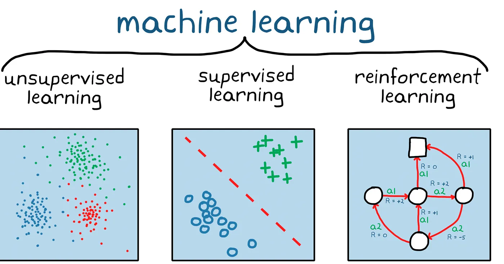

## 一，机器学习概述

### 1.1，机器学习分类

所谓机器学习，是关于在计算机上从数据中产生“模型”（model）的算法，即“学习算法”（learning algorithm）。

机器学习方法的分类，根据所处理的数据种类的不同，可以分为监督学习、无监督学习和强化学习等几种类型，如下图所示:



- 所谓监督学习，简单理解就是，训练集样本是带标签的。
- 无监督学习，即训练集样本是不带标签的，即没有老师自导，学生（模型）自学的过程。
- 强化学习，与监督学习类似，与监督学习不同的是，强化学习不需要带标签的输入输出对，同时也无需对非最优解的精确地纠正。

### 1.2，机器学习任务

我们知道，根据**训练数据是否拥有标记信息（标签）**，学习任务可大致划分为两大类“监督学习” (supervised learning) 和“无监督学习” (unsupervised learning)，其中，分类和回归任务是前者的代表，而聚类则是后者的代表。

本文以西瓜问题为例来通俗定义分类、回归和聚类问题：
1. 若我们欲预测的是离散值，例如”好瓜“、”坏瓜“，此类学习任务称为”分类“ (`classification`); 
2. 若欲预测的是连续值，例如西瓜成熟度 0.95、 0.37，此类学习任务称为”回归“ (`regression`)。
3. 若事先不知道西瓜的类别，我们还可以对西瓜做“聚类” (`clustering`)，即将训练集中的西瓜分成若干组，每组称为一个“簇” (`cluster`); 这些自动形成的簇可能对应一些潜在的概念划分，例如“浅色瓜”、 “深色瓜”等。

值得注意的是，机器学习算法的最终目标是使学习到的模型能很好地适用于“新样本”（方差小），而不仅仅只是在训练集样本上表现好（偏差小）。学得模型适用于于新样本的能力，称为“泛化”（generalization）能力。

机器学习中另外两个常见的任务是异常检测和降维。
1. **异常检测**，是指寻找输入样本 $x_i$ 中所包含的异常数据的问题。在已知正常数据和异常数据标签的前提下，其和有监督分类问题是相同的。
2. **降维**，是指从高维度数据中提取关键信息，目的是将其转换为容易计算的低维度问题进而求解的方法。

如何理解**维数**？一般地，令 $D = {X_1，x_2..，x_m}$ 表示包含 $m$ 个示例的数据集，每个示例由 $d$ 个属性描述，则每个示例 $x_i = (x_1; x_2;...;x_d)$ 是 $d$ 维样本空间中的一个向量， $\mathcal X$， 其中 $x_{ij}$ 是 $x_i$ 在第 $j$ 个属性上的取值(例如上述第 3 个西瓜在第 2 个属性上的值是"硬 挺" ), 而 $d$ 称为样本的"维数" (`dimensionality`)。

## 二，线性模型

本文所涉及的各种机器学习算法大多着重于如何使特定函数与数据集相似（拟合）。

### 2.1，基本形式

假设，给定由 $d$ 个属性（即维数）描述的示例 $x = (x_1; x_2;...;x_d)$， 其中 $x_i$ 是样本 $x$ 在第 $i$ 个属性上的取值，所谓线性模型 (linear model)是指，**试图学得一个通过属性的线性组合来进预测的函数**，其数学形式如下：

$$f(x) = w_{1}x_1 + w_{2}x_2 +  ...+ w_{d}x_d + b
$$

一般用向量形式写成：

$$f(x) = w^{\top}x + b
$$

其中 $w = (w_1; w_2;...;w_d)$，模型参数 $w$ 和 $b$ 学得之后，线性模型也就确定下来了。

从数学角度理解**线性模型**，当因变量和自变量为线性关系时，它就是一种特殊的线性模型。

虽然线性模型形式简单、易于建模，但其是非线性模型的基础，非线性模型 (`nonlinear model`)可在线性模型的基础上通过引入**层级结构或高维映射**而得到。

### 2.2，线性回归

假设，给定数据集 $D = {(x_1, y_1),(x_2, y_2)，...，(x_m, y_m)}$，一共有 $m$ 个样本，其中数据特征 $x_i = (x_{i1}; x_{i2}...; x_{id})$, 数据标签 $y_{i} \in \mathbb{R}$。

所谓"线性回归" (linear regression)，即试图学得一个线性模型以尽可能准确地预测实值输出标记，用数学公式定义，即线性回归试图学得：
> 不同教科书中，公式形式不一样，但其意义一样。

$$f(x_i) = ωx_{i} + b， 使得 f(x_i) \simeq y_{i}$$

试图求解一个最佳模型参数的前提是，先确定最佳误差函数。**均方误差（MSE - mean squared error）函数是回归任务中最常用的性能度量**，因此我们可试图让线性回归模型的均方误差误差函数 $J$ 最小化，即：

$$
\begin{aligned}
(x^{*}, b^{*}) &= \underset{(w,b)}{\text{argmin}} \; J \\
(x^{*}, b^{*}) &= \underset{(w,b)}{\text{argmin}} \frac{1}{2m}\sum_{i = 1}^{m}(f(x_{i}) - y_i)^2 \\
&= \underset{(w,b)}{\text{argmin}}\frac{1}{2m} \sum_{i = 1}^{m}(y_i - wx_{i} - b)^2 \\
\end{aligned}
$$

均方误差有非常好的几何意义，它对应了常用的欧几里得距离（也简称“欧氏距离” Euclidean distance)。

基于均方误差最小化来进行模型求解的方法称为“最小二乘法” (`least squre method`)。在线性回归中，最小二乘法就是试图找到一条直线，使所有样本到直线上的欧氏距离之和最小。
> 最小二来法用途很广， 不仅限于线性回归。


上图圆形点是样本点，直线是当前的拟合结果。如左图所示，计算样本点到直线的垂直距离，需要先根据直线的斜率来求垂足然后再计算距离，这样计算起来很慢；但实际上，在工程上我们通常使用的是右图的方式，即样本点到直线的**竖直距离**，因为这样计算很方便，用一个减法就可以了。

如果想让误差的值最小，通过对 $w$ 和 $b$ 求导，再令导数为 0（到达最小极值），就是 $w$ 和 $b$ 的最优解。

$$
\begin{aligned} \frac{\partial{J}}{\partial{w}} &=\frac{\partial{(\frac{1}{2m}\sum_{i=1}^m(y_i-wx_i-b)^2)}}{\partial{w}} \\\ &= \frac{1}{m}\sum_{i=1}^m(y_i-wx_i-b)(-x_i) \end{aligned}
$$

推导过程省略，最终得到最佳参数解：

$$ w = \frac{m\sum_{i=1}^m x_i y_i - \sum_{i=1}^m x_i \sum_{i=1}^m y_i}{m\sum_{i=1}^m x^2_i - (\sum_{i=1}^m x_i)^2}$$

$$ b= \frac{1}{m} \sum_{i=1}^m(y_i-wx_i)$$
> 注意，上式有很多个变种，在不同的文章可能不同版本。

根据以上公式，可用代码实现“最小二乘法”:

```python
def method3(X,Y,m):
    p = m*sum(X*Y) - sum(X)*sum(Y)
    q = m*sum(X*X) - sum(X)*sum(X)
    w = p/q
    return w

def calculate_b_1(X,Y,w,m):
    b = sum(Y-w*X)/m
    return b
```

如果模型参数形式为 $w^{\top}$，即包括两个或两个以上自变量的回归，则称为多元线性回归模型，数学公式如下：

$$f(x_i) = w^{\top}x_{i} + b， 使得 f(x_i) \simeq y_{i}$$

### 2.3，多分类学习

现实中常遇到多分类学习任务。有些二分类学习方法可直接推广到多分类， 但在更多情形下，我们是基于一些基本策略，利用二分类学习器来解决多分类问题。

### 2.4，类别不平衡问题

类别不平衡 (`class imbalance`)就是指分类任务中**不同类别的训练样本数目差别很大的情况**。类别不平衡学习的一个基本策略是“再缩放”（rescaling）:

$$
\frac{y'}{1-y'} = \frac{y}{1-y} \times \frac{m^-}{m^+}
$$

其中，$m^+$ 表示正例数目， $m^-$ 表示反例数目，则观测概率是 $\frac{m^-}{m^+}$，$y$ 是样本标签值，$y'$ 是模型预测概率值。

再缩放的思想虽简单，但实际操作却很难，主要因为"训练集是真实样本总体的无偏采样"这个假设往往并不成立，也就是说我们未必能有效地基于训练集观测概率来推断出真实概率。

现有技术大体上有三类做法:
1. 第一类是直接对训练集里的反类样例进行**“欠采样”**（undersampling），即去除一些反例使得正、反样本数目接近，然后基于新的数据集进行训练。
2. 第二类是对训练集的正类样例进行**“过采样”**（oversampling），即增加一些正例使得正、反例数目接近。
3. 第三类则是直接基于原始训练集进行学习，但在用训练好的分类器进行预测时，将“再缩放策略”嵌入到其决策过程中，称为"阔值移动" (threshold-moving)。

## 三，数据清洗与特征处理

### 3.1，清洗标注数据

清洗标注数据的方法，主要是是**数据采样**和**样本过滤**。

+ **数据采样**：当模型不能使用全部的数据来训练时，需要对数据进行采样，设定一定的采样率；采样的方法包括**随机采样，固定比例采样**等。
+ **样本过滤**：包括结合业务情况进行数据的过滤和使用异常点检测算法，常用的异常点检测算法包括：偏差检测（聚类，最近邻算法）等。

### 3.2，特征分类

根据不同的分类方法，可以将特征分为：

+ `Low level` 特征和 `High level` 特征
+ 稳定特征与动态特征。
+ 二值特征、连续特征、枚举特征

`Low level` 特征是较低级别的特征，主要是原始特征，不需要或者需要很少的人工处理和干预，例如文本中的词向量特征，图像特征中的像素点大小，用户 `id`，商品 id等。High level 特征是经过比较复杂的处理，结合部分业务逻辑或者规则、模型得到的特征，例如人工打分，模型打分等特征，可以用于较复杂的非线性模型。Low level 比较针对性，覆盖面小。长尾样本的预测值主要受 high level 特征影响。 高频样本的预测值主要受 low level 特征影响。

`稳定特征` 是变化频率较少的特征，例如评价平均分，团购单价价格等，在较长时间段内数值都不会发生变化。动态特征是更新变化比较频繁的特征，有些甚至是实时计算得到的特征，例如距离特征，2 小时销量等特征。或者叫做实时特征和非实时特征。针对两类特征的不同可以针对性地设计特征存储和更新方式，例如对于稳定特征，可以建入索引，较长时间更新一次，如果做缓存的话，缓存的时间可以较长。对于动态特征，需要实时计算或者准实时地更新数据，如果做缓存的话，缓存过期时间需要设置的较短。

`二值特征主要是 0/1 特征`，即特征只取两种值：`0 或者 1`，例如`用户 id 特征`：目前的 id 是否是某个特定的 id，`词向量特征`：某个特定的词是否在文章中出现等等。连续值特征是取值为有理数的特征，特征取值个数不定，例如距离特征，特征取值为是0~正无穷。枚举值特征主要是特征有固定个数个可能值，例如今天周几，只有 7 个可能值：周1，周2，…，周日。在实际的使用中，我们可能对不同类型的特征进行转换，例如将枚举特征或者连续特征处理为二值特征。枚举特征处理为二值特征技巧：将枚举特征映射为多个特征，每个特征对应一个特定枚举值，例如今天周几，可以把它转换成7个二元特征：今天是否是周一，今天是否是周二，…，今天是否是周日。连续值处理为二值特征方法：先将连续值离散化（后面会介绍如何离散化)，再将离散化后的特征切分为N个二元特征，每个特征代表是否在这个区间内。

### 3.3，特征处理与分析

对特征进行分类后，需要对特征进行处理，`常用的特征处理方法`如下：

+ 特征归一化，离散化，缺省值处理
+ 特征降维方法
+ 特征选择方法

**特征归一化**。在有些算法中，例如线性模型或者距离相关的模型（聚类模型、knn 模型等），特征值的取值范围会对最终的结果产生较大影响，例如输入数据有两种不同的特征，其中的二元特征取值范围 `[0, 1]`，而距离特征取值可能是 [0，正无穷]，两种特征取值范围不一致，导致模型可能会偏向于取值范围较大额特征，为了平衡取值范围不一致的特征，需要对特征进行归一化处理，将特征值取值归一化到 [0,1] 区间，常用的归一化方法包括：

1. `函数归一化`，通过映射函数将特征取值映射到 $[0，1]$ 区间，例如最大最小值归一化方法，是一种线性的映射。还有通过非线性函数的映射，例如 `log` 函数等。
2. `分维度归一化`，可以使用最大最小归一化方法，但是最大最小值选取的是所属类别的最大最小值，即使用的是局部最大最小值，不是全局的最大最小值。
3. `排序归一化`，不管原来的特征取值是什么样的，将特征按大小排序，根据特征所对应的序给予一个新的值。

**离散化**。在上面介绍过连续值的取值空间可能是无穷的，为了便于表示和在模型中处理，需要对连续值特征进行离散化处理。常用的离散化方法包括等值划分和等量划分。

1. `等值划分`，是将特征按照值域进行均分，每一段内的取值等同处理。例如某个特征的取值范围为 [0，10]，我们可以将其划分为10段，[0，1)，[1，2)，…，[9，10)。
2. `等量划分`，是根据样本总数进行均分，每段等量个样本划分为 1 段。例如距离特征，取值范围［0，3000000］，现在需要切分成 10 段，如果按照等比例划分的话，会发现绝大部分样本都在第 1 段中。使用等量划分就会避免这种问题，最终可能的切分是[0，100)，[100，300)，[300，500)，..，[10000，3000000]，前面的区间划分比较密，后面的比较稀疏。

**缺省值处理**。有些特征可能因为无法采样或者没有观测值而缺失，例如距离特征，用户可能禁止获取地理位置或者获取地理位置失败，此时需要对这些特征做特殊的处理，赋予一个缺省值。缺省值如何赋予，也有很多种方法。例如`单独表示，众数，平均值等`。

## 四，数据预处理基础

数据预处理的方法主要包括去除唯一属性、处理缺失值、属性编码、数据标准化正则化、特征选择、主成分分析等。

### 4.1，如何处理数据中的缺失值

可以分为以下 2 种情况：

1，**缺失值较多**：直接舍弃该列特征，否则可能会带来较大噪声，从而对结果造成不良影响。
  
2，**缺失值较少**：当缺失值较少（`< 10%`）时，可以考虑对缺失值进行填充，通常有几下几种填充策略：
  + 用一个**异常值**填充（比如 0 ），对应 `pandas` 函数是 `pd.DataFrame.fillna(0)`
  + **均值均值**填充：`pd.DataFrame.fillna(DataFrame.mean())`
  + **相邻数据**填充：`pd.DataFrame.fillna(DataFrame='pad')` 或 `data.fillna(method='bfill')`
  + **插值填充**：`pd.DataFrame.interpolate()`
  + **拟合**：简单来说，就是将缺失值也作为一个预测问题来处理：将数据分为正常数据和缺失数据，对有值的数据采用`随机森林`等方法拟合，然后对有缺失值的数据进行预测，然后用预测到的值来进行填充。

## 参考资料

- [Machine learning basics](https://medium.com/@Khuranasoils/machine-learning-basics-f58678cf9c15)
- 《机器学习》
- 《智能之门》
- [机器学习中的数据清洗与特征处理综述](https://tech.meituan.com/2015/02/10/machinelearning-data-feature-process.html)