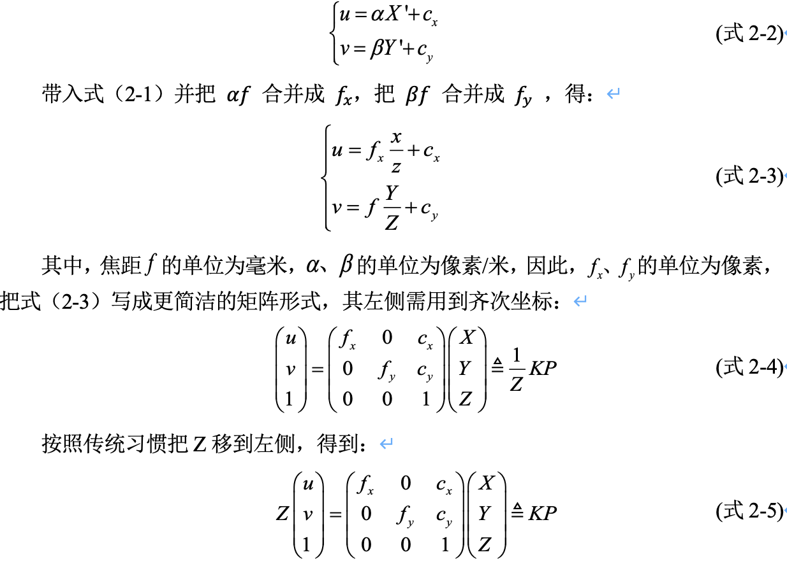
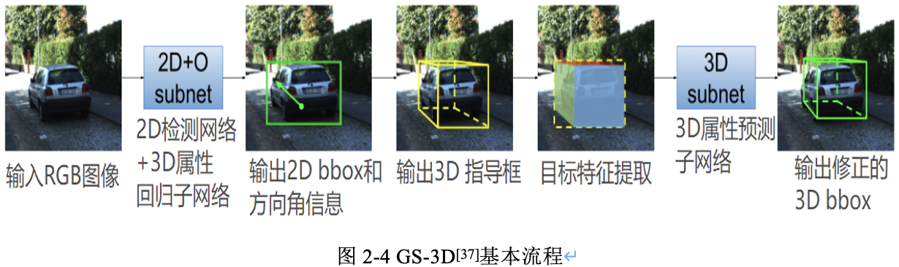
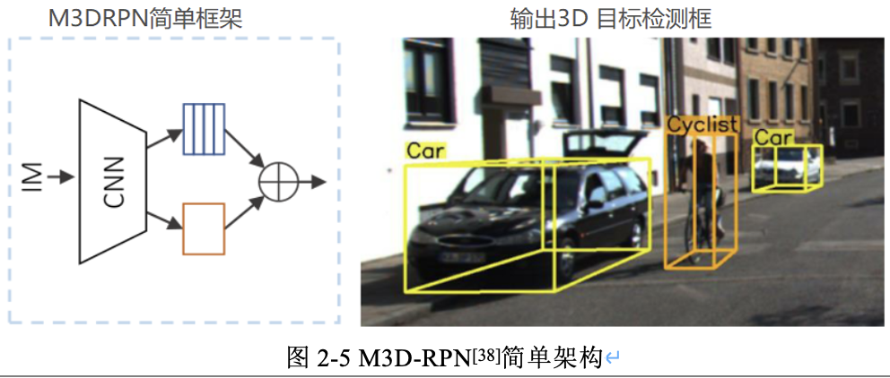

- [一，理论基础-相机与图像](#一理论基础-相机与图像)
  - [1.1，单目相机介绍](#11单目相机介绍)
  - [1.2，针孔相机模型](#12针孔相机模型)
  - [1.3，坐标系间的欧式变换](#13坐标系间的欧式变换)
  - [1.4，世界坐标与像素坐标的转换](#14世界坐标与像素坐标的转换)
  - [1.5，三维旋转：欧拉角、旋转矩阵之间的转换](#15三维旋转欧拉角旋转矩阵之间的转换)
- [二，单目3D目标检测概述](#二单目3d目标检测概述)
  - [2.1，3D目标检测算法介绍](#213d目标检测算法介绍)
  - [2.2，单目3D目标检测算法概述](#22单目3d目标检测算法概述)
  - [2.3，无人驾驶中的3D目标检测任务](#23无人驾驶中的3d目标检测任务)
  - [2.4，无人驾驶中的3D目标检测的难点](#24无人驾驶中的3d目标检测的难点)
- [三，主流单目3D检测算法](#三主流单目3d检测算法)
  - [3.1，Deep3Dbox算法介绍](#31deep3dbox算法介绍)
  - [3.2，Deep MANTA算法介绍](#32deep-manta算法介绍)
  - [3.3，GS3D算法介绍](#33gs3d算法介绍)
  - [3.4，M3D-RPN算法介绍](#34m3d-rpn算法介绍)
- [四，总结](#四总结)
- [参考资料](#参考资料)

## 一，理论基础-相机与图像

相机将三维世界中的坐标点（单位为米）映射到二维图像平面（单位为像素）的过程能够用一个几何模型进行描述，这个模型有很多种，其中最简单的称为针孔相机模型。相机的成像过程是也一个射影变换（透视或中心射影）过程，这个过程需要涉及到像素坐标系、平面坐标系、相机坐标系及世界坐标系之间的相互转换。

### 1.1，单目相机介绍

只使用一个摄像头进行 3D 目标检测的做法称为单目3D目标检测，单目相机即单个摄像头，单目相机结构简单，成本特别低，单目相机输出的数据为我们常见的照片。照片本质上是拍照时的场景在相机的成像平面上留下的一个投影，它以二维的形式反映了三维的世界。

摄像机有很多种，但是基本原理是一样的：把光学图像信号转变为电信号，以便于存储或者传输。单目相机尽管成本低，但是也存在无法直接通过单张图片来计算场景中物体与我们之间距离的问题。

### 1.2，针孔相机模型

相机可以抽象为最简单的形式：一个小孔和一个成像平面，小孔位于成像平面和真实的三维场景之间，任何来自真实世界的光只有通过小孔才能到达成像平面。因此，在成像平面和通过小孔看到的真实三维场景存在着一种对应关系，也就是图像中的二维像素点和真实三维世界的三维点存在某种变换关系。找到了这种变换关系，就可以利用图像中的二维坐标点的信息来恢复场景的三维信息。

图2-2 是针孔相机（小孔成像）模型，为了简化模型，将成像平面放在了小孔的前面，并且成的像也是正立的。小孔成像实际就是将相机坐标系中的三维点变换到成像平面中的图像坐标系中的二维点。

针孔相机模型涉及到四个坐标系，分别是世界坐标系(world)，相机坐标系(camera)，图像物理坐标系(image)，像素坐标系(pixel)，四个坐标系的详细定义如下：

1. 世界坐标系（world coordinate）$(x_w, y_w, z_w)$，是一个三维直角坐标系，也称为测量坐标系，以其为基准可以表示相机和待测物体的空间3D位置，任意指定 $x_w$轴和 $y_w$轴。如果是自动驾驶数据集，以百度Apollo为例，其$Z$ 轴通过车顶垂直于地面指向上方，$Y$轴在行驶的方向上指向车辆前方，$X$轴为自车面向前方时，指向车辆右侧，车辆坐标系的原点在车辆后轮轴的中心。
2. 相机坐标系（camera coordinate）$(x_c, y_c, z_c)$，，其坐标原点位于相机的光心位置，$Z$轴为相机的光轴，与像平面垂直，$X_c$轴和 $Y_c$分别平行于投影面即成像图像坐标系的 $X$轴和 $Y$轴。
3. 图像物理坐标系 $(x', y')$，其坐标原点为投影成像平面的中心，$X$ 轴和 $Y$ 轴分别平行于成像图像平面的两条垂直边，其坐标轴的单位为毫米（mm）。
4. 像素坐标系 $(uov)$，从小孔向投影面方向看，投影面的左上角顶点为原点轴 $O_{pix}$ ，$uv$分别平行于图像物理坐标系的 $x'$ 轴和 $y'$ 轴。其坐标轴的单位是像素（整数形式）。

假设世界坐标系的空间点 $P$，经过小孔投影 $O$后，落在物理成像平面的投影点为。设 $P$的坐标为$[X,Y,Z]^T$，$O'$为$[X', Y', Z']^T$，物理成像平面到小孔的距离为 $f$(焦距)。，根据三角形相似原理，可得以下公式：

$$X' = f\frac{x}{z}, Y' = f\frac{Y}{Z} \tag{2-1}$$

式 2-1 描述了现实世界的空间点 $P$和成像平面的成像点$P'$的空间关系，但是在相机中我们得到的是一个个像素，需要对平面上的对象进行采样和量化，之后，才得到成像平面的成像点 $P'$ 的像素坐标 $[u, v]^T$。 

可以知道，像素平面与成像平面之间相差了一个缩放和一个原点的平移。假设像素坐标在 $u$ 轴上缩放了 $\alpha$ 倍，在$v$轴上缩放了 $\beta$ 倍，并且原点平移了 $c_x, c_y]^T$。那么成像点 $P'$ 与像素坐标 $[u, v]^T$ 的关系为：

通过以上推导，我们得到了相机坐标到像素坐标的转换公式：(式2-5)。在式（2-5）中，把中间的量组成的矩阵称为相机的内参矩阵（Camera Intrinsics）$K$。相机的内参一般是在出厂之后固定的，之后不再变化。有内参自然有外参，式（2-5）使用的是$P$在相机坐标系下的坐标，因为相机在运动，所以$P$的相机坐标（记为$P_c$）是它的世界坐标（记为$P_w$）结合相机当前的位姿转换到相机坐标系下的结果，相机的位姿可以由它的旋转矩阵$R$和平移向量$t$来描述的，两个坐标系间的变换称为欧式变换。

### 1.3，坐标系间的欧式变换

欧式变换是**世界坐标系到相机坐标系的变换**。向量的旋转我们可以用外积表示，与向量的旋转类似，两个坐标系的旋转也可以用**外积**表示，然后再加上平移，则可以统称为坐标系之间的变换[3]。在线性代数中，旋转矩阵是用于在欧几里得空间中进行旋转的矩阵，而描述一个欧式空间的坐标变换关系，可以用一个旋转矩阵 $R$ 和一个平移向量$t$表示，世界坐标到相机坐标的转换公式如下。

$$
P_{c} = RP_{w} + t = [R, t]P_w \tag{2-6}
$$

这里 $P_{c}(x_c, y_c, z_c)$为相机坐标系下的坐标，$P_{w}(x_w, y_w, z_w)$为世界坐标系下的坐标。式（2-6）的变换关系并不是线性的关系，所以我们要引入齐次坐标和变换矩阵方便计算，重写的公式(2-7)如下。该式中，$T$称为变换矩阵（Transform Matrix）。

$$
\begin{bmatrix}
P_c \\ 
1
\end{bmatrix}
= \begin{bmatrix}
R & t \\ 
0^T & 1
\end{bmatrix}
\begin{bmatrix}
P_w \\ 
1
\end{bmatrix}
= T \begin{bmatrix}
P_w \\ 
1
\end{bmatrix}  \tag{2-7}
$$

### 1.4，世界坐标与像素坐标的转换

通过前面两小节，我们推得了相机坐标到像素坐标和世界坐标到相机坐标的变换，则自然可以得到世界坐标到像素坐标的变换公式。转换公式如式（2-8）所示。这里的变换矩阵 $T = \begin{bmatrix} R & t \\ 0^T & 1 \end{bmatrix}$，其中 $[R|T]$为相机外参，$K$为相机内参矩阵。

$$
ZP_{uv} = Z \begin{bmatrix}
u \\ 
v \\ 
1
\end{bmatrix}
 = K \begin{bmatrix}
R & t \\ 
0^T & 1
\end{bmatrix} \begin{bmatrix}
y_w \\ 
z_w \\ 
1
\end{bmatrix}
 = K(R|T)P_{W} = KTP_{w} \; \tag{2-8}
$$

### 1.5，三维旋转：欧拉角、旋转矩阵之间的转换

在求解目标 3D 中心点的结算模块用到了几何投影的知识，那里我们需要用到旋转矩阵，算法只能预测出旋转角度，但是 3D 世界坐标到 2D 像素坐标的转换（即前文的欧式变换）需要用到相机内参和旋转矩阵，所以有必要给出欧拉角和旋转矩阵之间的转换公式。

欧拉角是由 Lenhard Euler 引入的，用于描述刚体方向的姿态角（旋转角即物体围绕坐标系三个坐标轴旋转的角度），在 3 维欧几里得空间中描述一个方向，需要三个参数：$\left \{\theta,\phi ,\gamma  \right \}$，$\theta$ 是偏航角 yaw，绕 $Y$ 轴旋转；$\phi$ 是偏航角 pitch，绕 $Z$ 轴旋转；$\gamma$ 是偏航角 row，绕 $X$ 轴旋转。注意，不同领域叫法不同，$Y, Z,X$ 和 yaw、pitch、roll 并没有绝对的对应关系，其中，飞机姿态示意图如图2-3所示。

不同的坐标系定义，会有不同的旋转矩阵计算公式，因此需要根据实际情况计算旋转矩阵和平移矩阵。旋转矩阵可由欧拉角进行转换得到，可以知道的是，欧拉角构造旋转矩阵等同于直接把三个Elemental Rotation Matrix相乘，表示绕轴 $Y,Z,X$ 顺序的欧拉角为 $\left \{ \theta ,\phi ,\gamma  \right \}$ 的外部旋转矩阵的计算公式(式2-9)[4]如下：

其中：

有了根据欧拉角计算旋转矩阵的公式，在下章的内容中，就可以根据射影几何原理实现待检测目标的 3D 世界坐标到 2D 像素坐标的转换。欧拉角可以通过模型预测得到，再根据式（2-10）可以计算得到旋转矩阵，再根据前面的坐标转换公式，就可以实现2D像素坐标到 3D 世界坐标的转换。

## 二，单目3D目标检测概述

### 2.1，3D目标检测算法介绍

按照传感器和输入数据的不同， 3D目标检测分类如图2-1所示。从图中可以看出，3D目标检测的输入数据以分为图像和点云数据，分别使用的是激光、深度相机和单目相机、双目相机等硬件。从成本上来说，单目相机是成本最低的，也是工业界迫切需要研究和发展的算法。

对于从激光雷达获得的 3D 点云数据，Chen[1]等人通过扩展 2D 检测算法提出了一些利用3D 点云特征来估计物体 3D 空间位置的方法。相比于使用雷达或者深度相机，使用摄像机的硬件成本更低，但是需要进行图像点的反投影，计算点在空间中的位置。此外，相对于点云数据，单目相机图像恢复深度的方法可以应用于室外大尺度场景，普通RGB-D深度相机存在视野小、噪声大、测量范围窄等问题。

对于单目摄像机的 3D 目标检测问题，可以采用**以深度学习为主的 2D bbox 预测及大小姿态估计网络算法+目标 3D 中心点解算模块**[2]。因此，如何结合深度学习算法和射影几何约束，是提升算法精度的关键。下文会介绍几种单目图像进行 3D 目标检测算法，来说明和讨论如何实现基于单目相机图像的 3D 目标检测。

### 2.2，单目3D目标检测算法概述

3D 目标检测主要是为了获取物体的 3D bbox(`bounding box`)。3D bbox 的定义是在真实三维世界中包围目标物体的最小长方体，理论上，一个 `3D bbox` 有 9 个自由度，3 个是位置，3 个是维度大小，3 个是旋转角度。3D 目标检测任务从宏观上来讲可以分为两个部分：目标定位与目标姿态的描述。

目标定位可以复用 2D 目标检测框架，对目标进行准确定位；因此在 3D 目标检测任务中，如何对目标姿态进行准确描述是3D目标检测算法的关键问题。对于目标姿态的描述信息，一些研究工作引入了与2D图像对应的深度信息图， 利用2D图像和2D图像对应的深度信息可以对目标所在空间进行描述，即可在 3D 场景上进行目标检测。深度信息即计算 2D 图像中框出的物体上的点在物理世界坐标系中距离相机成像平面的距离，对于单目 RGB 图像，可以利用几何约束（geometry）来求解，比如 `Deep3DBox` 和 `Deep MANTA` 算法。

在 `Deep3DBox` 中，已知 2D box、orientation、3D size，利用 3D box 投影到图像上的顶点和 2D box 的边的对应关系可以求解出物体的 3D 坐标。在 Deep MANTA 中，已知 2D keypoints、3D size，首先通过 CAD model 获得 3D keypoints，然后求解 `PnP` 就可以得到物体的 3D 坐标和 orientation。这类方法的 `3D` 定位精度本质上受限于**重投影误差**，而 keypoints、2D box 的定位精度是有限的，所以目前也可能会存在算法瓶颈。

### 2.3，无人驾驶中的3D目标检测任务

感知系统是自动驾驶系统的一个核心子系统，而目标检测 Object Detection 就是感知系统的核心技术，感知系统要求我们根据不同的传感器设计不同的感知算法，从而准确的检测出车辆前方的障碍物。例如在国内百度Apollo自动驾驶系统 中，有为 3D 点云而设计的CNN-SEG算法，和为 2D 图像而设计的 YOLO-3D算法等。

常见的2D目标检测是不适用于无人驾驶的规划及控制任务的，而 3D 目标检测可以获取物体的 3D bbox（真实三维世界中包围目标物体的最小长方体）。3D 目标检测系统要求算法，能够对实时视频流中的单帧图像完成3D目标检测，在有相机的内参和外参矩阵基础上，将输出结果映射到统一的世界坐标系或者车身坐标系中。

任意一个相机坐标系下的目标 3d bbox，可以用 9 个自由度表示，即目标的中心点 $T = \left \{ x, y, z \right \}$，长宽高 $D = \left \{l, w, h \right \}$}，以及目标的姿态角（旋转角）$\left \{ \theta ,\phi ,\gamma  \right \}$。这种 9 自由度的参数表示与 3d bbox 的 8 个角点坐标表示相比，其实是等价的，可以相互转换，而且不需要的 $8\times 3 = 24$ 个坐标参数来表示，有利于减少复杂度。

同时，对一个相机坐标系下 3D 目标，可以通过设定好的相机内参和经过转换计算得来的外参矩阵，即根据射影几何约束原理，将3D坐标投射到 2D 图像上，得到 目标的2D像素坐标。

### 2.4，无人驾驶中的3D目标检测的难点

尽管深入学习技术的应用已经给3D视觉目标检测带来了很大发展，但是3D目标检测依然还有很多痛点问题有待解决，主要难点如下：

1. 目标被遮挡，遮挡分为两种情况，目标物体相互遮挡和目标物体被背景遮挡；
2. 图像中存在很多小目标，相对输入图片大小，目标物体所占像素点极少；
3. 目标被截断，部分物体被图片截断，即在图片中只能显示部分物体；
4. 目标的旋转角度学习，在图像中物体的朝向不同，但是对应特征可能相同。

## 三，主流单目3D检测算法

### 3.1，Deep3Dbox算法介绍

`Deep3Dbox` 是一种用于在单目 `RGB` 图像（a single image）上进行 3D 目标检测和姿态估计（pose estimation）的算法。相对于当前仅仅回归物体的 3D方向（orientation）的方法，该算法使用深度神经网络首次回归了目标相对稳定的3D属性，并结合这些属性和 2d bounding box 的几何约束（geometric constraints），生成一个 3D bounding box。主要思想是基于 2D 的目标检测框去拟合 3D 检测框，预测量主要有三个：

1. 三维框的大小（在$x,y,z$ 轴上的大小）；
2. 旋转角度；
3. 置信度。

网络的第一个输出使用一种新颖的 hybrid（混合）discrete-continuous（离散-连续）loss, （显著优于 L2 loss）预测 3D 方向（orientation），网络的第二个输出回归了物体的3D尺寸（dimension），相比于之前的模型，它准确度更高且能够识别多种物体。

### 3.2，Deep MANTA算法介绍

`Deep MANTA` 算法[7]的通过一张图片完成多项车辆分析任务，包括车辆检测、局部定位、可视化特征描述以及 3D 估计。基于 `coarse-to-fine object proposal` 提升车辆检测效果。并且，Deep MANTA 网络可以检测出半遮挡的车辆。在推断过程中，网络的输出作为一个鲁棒的实时位姿估计算法的输入，来进行姿态估计和三维车辆定位。算法主要特点有以下几个方面：

1. 算法的网络结构是基于 `Faster R-CNN` 框架，网络不仅预测车辆包围框，同时还预测车辆部件坐标、部件可见性、车辆自身尺寸等丰富的信息，同时使用图像车辆的特征点坐标来编码车辆的 3D 信息。
2. 网络使用了**级联结构**（`cascade`）预测以上信息，在共享底层特征（feature map）的同时提供足够的拟合能力预测多种信息，并反复回归包围框，提高定位精度。
3. 在网络推理（inference）时使用之前预测的信息进行 2D/3D 匹配，从而得到车辆的 3D 姿态与位置信息。

### 3.3，GS3D算法介绍

GS3D[5]是基于引导和表面(GS)的 3D 车辆检测算法。该算法的基本流程也是先进行 2D 检测，再通过一些先验知识和投影几何原理等计算`3Dbbox` 的尺寸和方位。该算法的重要创新点是充分利用了 3D 表面在 2D 图像的投影特征，以方面模型进行区分判别。算法以单张 RGB 图像作为输入，由粗略到精细的步骤逐步恢复车辆的 3D bbox。检测流程如图 2-4 所示：

### 3.4，M3D-RPN算法介绍

M3D-RPN算法[6]的主要思想在于提出将单目3D目标检测问题重新构造为独立的3D区域提议网络（RPN，类似Faster R-CNN的RPN网络），即 M3D-RPN 结构（Monocular 3D Region Proposal Network for Object Detection），来提高模型性能，利用2D和3D透视图的几何关系，允许3D边框利用图像空间生成的卷积特征，该思想和Deep3Dbox 算法是一样的，即在于结合投影几何原理和2D图像特征，得到目标的3D box。
同时 M3D-RPN 算法设计了深度-感知（depth-aware）的卷积层，来解决繁琐的3D参数估计问题，该方法可提取特定位置的特征，从而改善了3D场景的理解性能。M3D-RPN的简单架构图如图2-5所示，其用全局卷积（橙色）和局部深度-觉察卷积（蓝色）的单个单目3D区域提议网络来预测多类3D边框。

图2-6 是 `M3D-RPN` 和以前算法： `Deep3DBox`、`Multi-Fusion` 的比较。从图中可以看出，先前的工作由内部多步（橙色）和外部网络（蓝色）组成，而 `M3D-RPN` 是**端到端训练**的单步（`single shot`）网络。

## 四，总结

本文首先介绍了单目 3D 目标检测的理论基础，然后概述了单目 3D 目标检测的内容，包括3D目标检测算法根据输入信号不同的分类、 单目 3D 视觉目标检测定义和难点，以及描述了无人驾驶中的3D目标检测任务，最后介绍了几个主流的单目 3D 目标检测算法，并描述了这些算法的原理和相关检测流程。总结可以发现主流的单目3D 目标检测算法都有以下共同点：

1. 都复用了 2D 目标检测的结果；
2. 都有结合投影几何知识和利用2D图像特征来得到目标的3D空间位置；
3. 都有 3D 属性参数回归网络。

值得注意的是，目前单目视觉 3D 目标检测技术依然面临着很多问题，因为算法不仅要找到物体在图像中出现的位置，还需要反投影到实际 3D 空间中，这个过程是需要有绝对的尺寸估计。

## 参考资料

1. [1] X. Chen, K. Kundu, Y. Zhu, A. G. Berneshawi, H. Ma, S. Fidler, and R. Urtasun, “3D object proposals for accurate object class detection”, in Neural Information Processing Systems, 2015.
2. [2] 何志强. 基于深度估计的3D目标检测与跟踪算法研究[D].西安科技大学,2019.
3. [3] 高翔，张涛等. 视觉SLAM十四讲从理论到时间[M]. 电子工业出版社,2017.
4. [4] [Rotation matrix calculation [EB/OL]](https://en.wikipedia.org/wiki/Rotation\_matrix)
5. [5] Mousavian, Arsalan, Dragomir Anguelov, John Flynn and Jana Kosecka. “3D Bounding Box Estimation Using Deep Learning and Geometry.” 2017 IEEE Conference on Computer Vision and Pattern Recognition (CVPR) (2016): 5632-5640.
6. [6] Brazil, Garrick and Xiaoming Liu. “M3D-RPN: Monocular 3D Region Proposal Network for Object Detection.” 2019 IEEE/CVF International Conference on Computer Vision (ICCV) (2019): 9286-9295.
7. [7] Chabot, Florian, Mohamed Chaouch, Jaonary Rabarisoa, Céline Teulière and Thierry Chateau. “Deep MANTA: A Coarse-to-Fine Many-Task Network for Joint 2D and 3D Vehicle Analysis from Monocular Image.” 2017 IEEE Conference on Computer Vision and Pattern Recognition (CVPR) (2017): 1827-1836.

