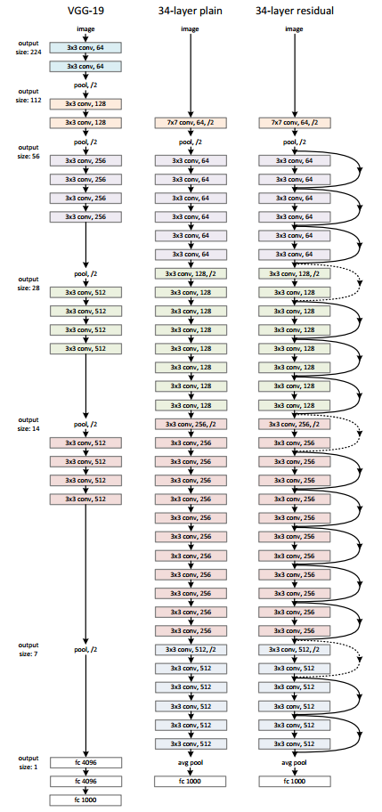
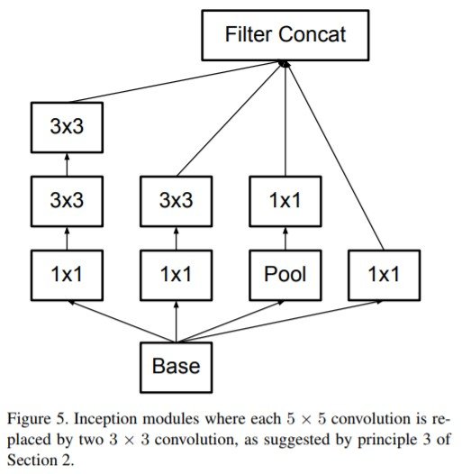
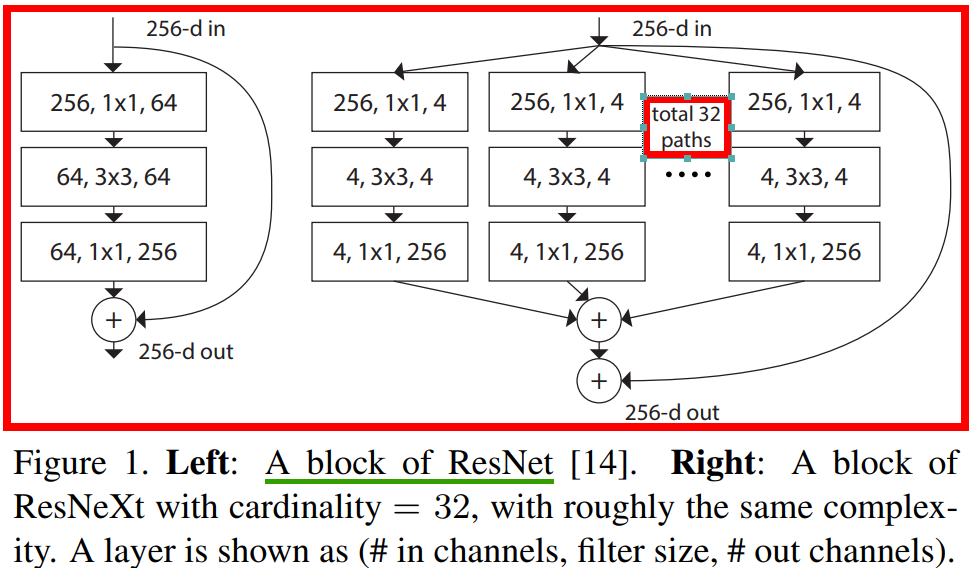
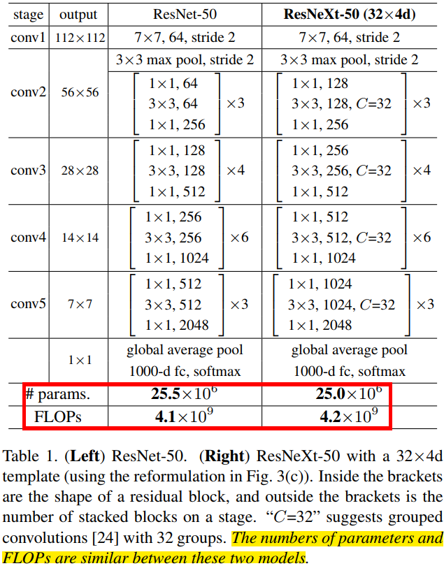
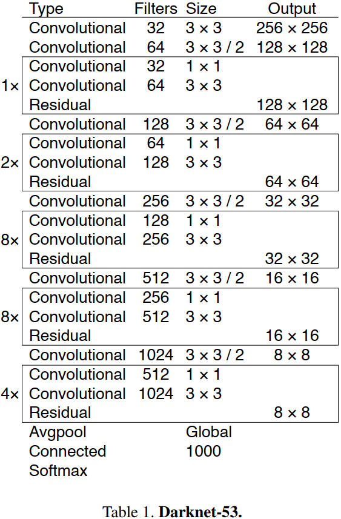
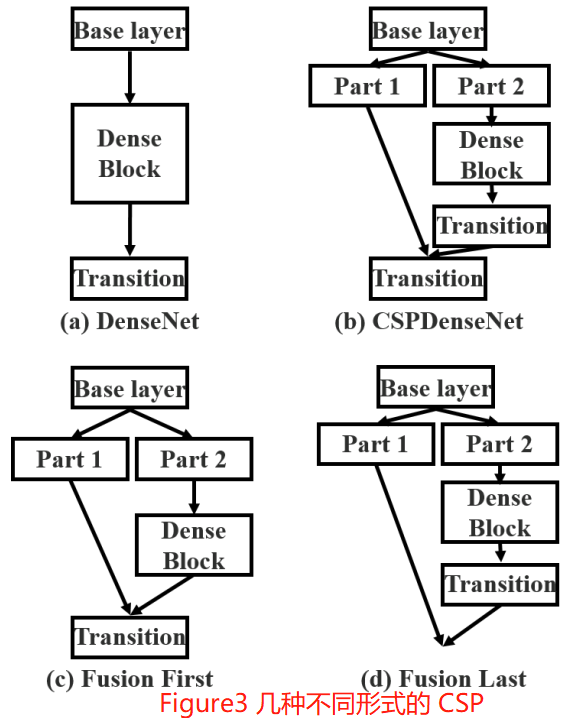
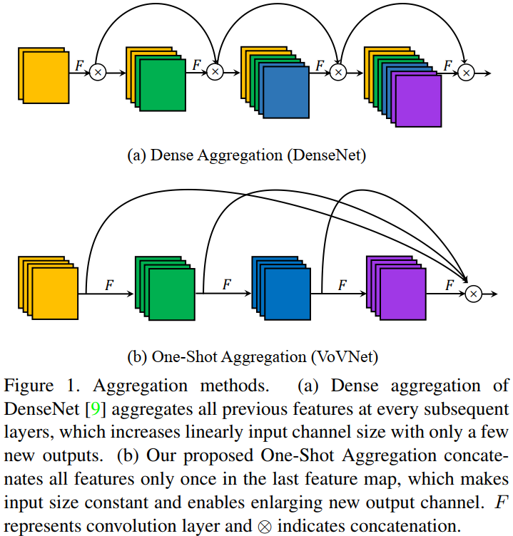
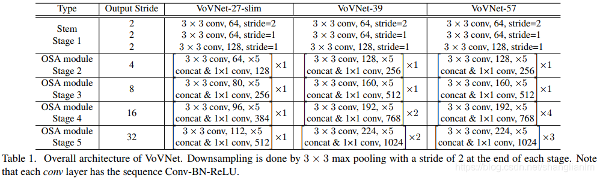

- [VGG](#vgg)
- [ResNet](#resnet)
- [Inceptionv3](#inceptionv3)
- [ResNeXt](#resnext)
- [Darknet53](#darknet53)
- [CSPNet](#cspnet)
  - [VoVNet](#vovnet)
  - [一些结论](#一些结论)
- [参考资料](#参考资料)

## VGG

`VGG`网络结构参数表如下图所示。

## ResNet

`ResNet` 模型比 `VGG` 网络具有更少的滤波器数量和更低的复杂性。 比如 `Resnet34` 的 `FLOPs` 为 `3.6G`，仅为 `VGG-19` `19.6G` 的 `18%`。
> 注意，论文中算的 `FLOPs`，把乘加当作 `1` 次计算。

`ResNet` 和 `VGG` 的网络结构连接对比图，如下图所示。

`Resnet` 网络参数表如下图所示。

## Inceptionv3

常见的一种 `Inception Modules` 结构如下：

## ResNeXt

ResNeXt 的卷积 block 和 Resnet 对比图如下所示。

ResNeXt和Resnet的模型结构参数对比图如下图所示。

## Darknet53

`Darknet53` 模型结构连接图，如下图所示。

## CSPNet

`CSP` 方法可以减少模型计算量和提高运行速度的同时，还不降低模型的精度，是一种更高效的网络设计方法，同时还能和 `Resnet`、`Densenet`、`Darknet` 等 `backbone` 结合在一起。

### VoVNet

`DenseNet` 用更少的参数与 `Flops` 而性能比 `ResNet` 更好，主要是因为`concat` 比 `add` 能保留更多的信息。但是，实际上 `DenseNet` 却比 `ResNet`要慢且消耗更多资源。

`GPU` 的计算效率：

- `GPU` 特性是擅长 `parallel computation`，`tensor` 越大，`GPU` 使用效率越高。
- 把大的卷积操作拆分成碎片的小操作将不利于 `GPU` 计算。
- 设计 `layer` 数量少的网络是更好的选择。
- `1x1` 卷积来减少计算量，不过这不利于GPU计算。

作者提出了提出 `OSA`（one-shot-aggregation）模块。在 `OSA module` 中，每一层产生两种连接，一种是通过 `conv` 和下一层连接，产生 `receptive field` 更大的 `feature map`，另一种是和最后的输出层相连，以聚合足够好的特征。通过使用 `OSA module`，`5` 层 `43` `channels` 的 `DenseNet-40` 的 `MAC` 可以被减少 `30%`（`3.7M -> 2.5M`）。

提出的各种 `VoVNet` 结构参数表如下。

### 一些结论

- 当卷积层的输入输出通道数相等时，内存访问代价（$MAC$）最小。
- 影响 `CNN` 功耗的主要因素在于内存访问代价 `MAC`，而不是计算量 `FLOPs`。

## 参考资料

+ `VGG/ResNet/Inception/ResNeXt/CSPNet` 论文
+ [深度学习论文: An Energy and GPU-Computation Efficient Backbone Network for Object Detection及其PyTorch](https://blog.csdn.net/shanglianlm/article/details/106482678)