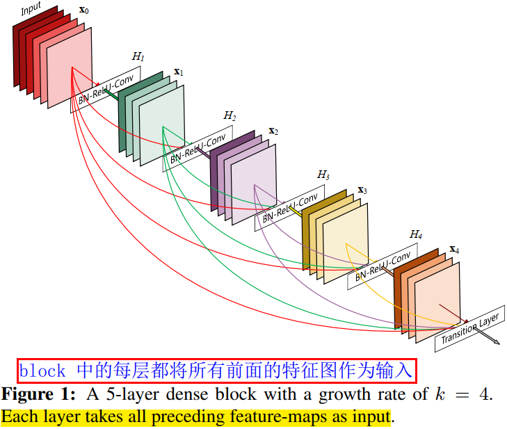
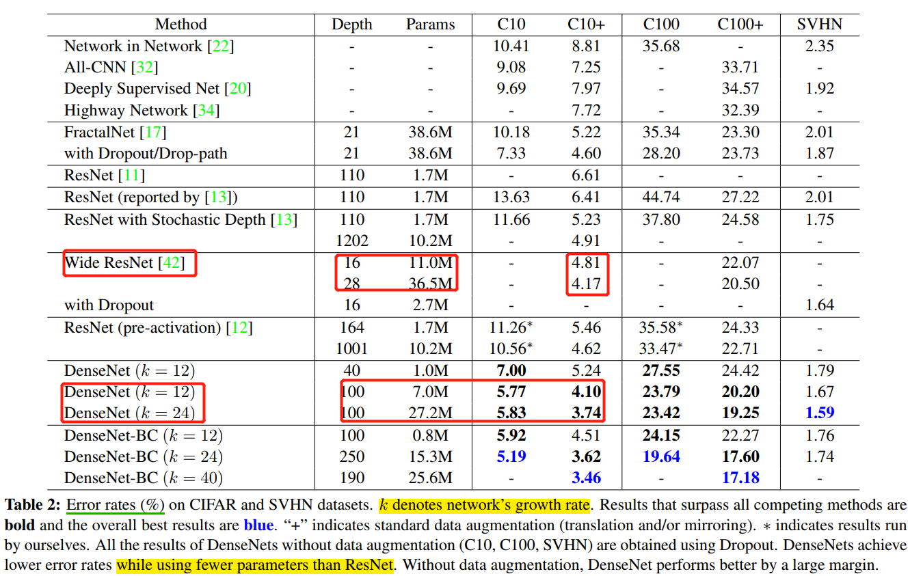
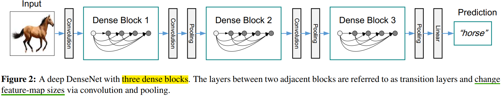
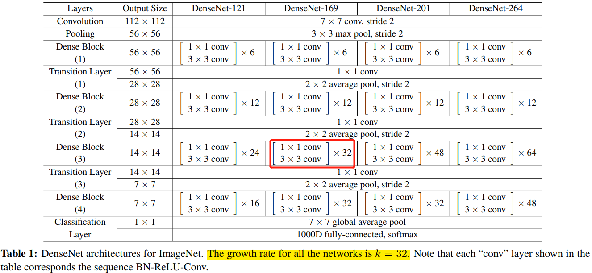

- [摘要](#摘要)
- [网络结构](#网络结构)
- [优点](#优点)
- [代码](#代码)
- [问题](#问题)
- [参考资料](#参考资料)

## 摘要

`ResNet` 的工作表面，只要建立前面层和后面层之间的“短路连接”（shortcut），就能有助于训练过程中梯度的反向传播，从而能训练出更“深”的 CNN 网络。`DenseNet` 网络的基本思路和 `ResNet` 一致，但是它建立的是前面所有层与后面层的**密集连接**（dense connection）。传统的 $L$ 层卷积网络有 $L$ 个连接——每一层与它的前一层和后一层相连—，而 DenseNet 网络有 $L(L+1)/2$ 个连接。

在 DenseNet 中，让网络中的每一层都直接与其前面层相连，实现特征的重复利用；同时把网络的每一层设计得特别“窄”（特征图/滤波器数量少），即只学习非常少的特征图（最极端情况就是每一层只学习一个特征图），达到降低冗余性的目的。

## 网络结构

`DenseNet` 模型主要是由 `DenseBlock` 组成的。

用公式表示，传统直连（`plain`）的网络在 $l$ 层的输出为：

$$\mathrm{x}_l = H_l(\mathrm{\mathrm{x}}_l-1)$$

对于残差块（residual block）结构，增加了一个恒等映射（`shortcut` 连接）：

$$\mathrm{x}_l = H_l(\mathrm{\mathrm{x}}_l-1) + \mathrm{x}_{l-1}$$

而在密集块（`DenseBlock`）结构中，每一层都会将前面所有层 `concate` 后作为输入：

$$\mathrm{x}_l = H_l([\mathrm{\mathrm{x_0},\mathrm{x_1},...,\mathrm{x_{l-1}}]})$$

$[\mathrm{\mathrm{x_0},\mathrm{x_1},...,\mathrm{x_{l-1}}]}$ 表示网络层 $0,...,l-1$ 输出特征图的拼接。这里暗示了，在 DenseBlock 中，每个网络层的特征图大小是一样的。$H_l(\cdot)$ 是非线性转化函数（non-liear transformation），它由 BN(`Batch Normalization`)，ReLU 和 Conv 层组合而成。

`DenseBlock` 的结构图如下图所示。



在 `DenseBlock` 的设计中，作者重点提到了一个参数 $k$，被称为网络的增长率（`growth of the network`），其实是 `DenseBlock` 中任何一个 $3\times 3$ 卷积层的滤波器个数（输出通道数）。如果每个 $H_l(\cdot)$ 函数都输出 $k$ 个特征图，那么第 $l$ 层的输入特征图数量为 $k_0 + k\times (l-1)$，$k_0$ 是 `DenseBlock` 的输入特征图数量（即第一个卷积层的输入通道数）。`DenseNet` 网络和其他网络最显著的区别是，$k$ 值可以变得很小，比如 $k=12$，即网络变得很“窄”，但又不影响精度。如表 4 所示。



为了在 `DenseNet` 网络中，保持 `DenseBlock` 的卷积层的 feature map 大小一致，作者在两个 `DenseBlock` 中间插入 `transition` 层。其由 $2\times 2$ average pool, stride=2，和 $1\times 1$ conv 层组合而成，具体为 **BN + ReLU + 1x1 Conv + 2x2 AvgPooling**。`transition` 层完成降低特征图大小和降维的作用。
> `CNN` 网络一般通过 Pooling 层或者 stride>1 的卷积层来降低特征图大小（比如 stride=2 的 3x3 卷积层），

下图给出了一个 `DenseNet` 的网路结构，它共包含 `3` 个（一半用 `4` 个）`DenseBlock`，各个 `DenseBlock` 之间通过 `Transition` 连接在一起。



和 `ResNet` 一样，`DenseNet` 也有 `bottleneck` 单元，来适应更深的 `DenseNet`。`Bottleneck` 单元是 BN-ReLU-Conv(1x1)-BN-ReLU-Conv(3x3)这样连接的结构，作者将具有 `bottleneck` 的密集单元组成的网络称为 `DenseNet-B`。
> `Bottleneck` 译为瓶颈，一端大一端小，对应着 1x1 卷积通道数多，3x3 卷积通道数少。

对于 `ImageNet` 数据集，图片输入大小为 $224\times 224$ ，网络结构采用包含 `4` 个 `DenseBlock` 的`DenseNet-BC`，网络第一层是 `stride=2` 的 $7times 7$卷积层，然后是一个 `stride=2` 的 $3\times 3$ MaxPooling 层，而后是 `DenseBlock`。`ImageNet` 数据集所采用的网络配置参数表如表 1 所示：



网络中每个阶段卷积层的 `feature map` 数量都是 `32`。

## 优点

1. **省参数**
2. **省计算**
3. **抗过拟合**

> 注意，后续的 VoVNet 证明了，虽然 DenseNet 网络参数量少，但是其推理效率却不高。

在 `ImageNet` 分类数据集上达到同样的准确率，`DenseNet` 所需的参数量和计算量都不到 `ResNet` 的一半。对于工业界而言，小模型（参数量少）可以显著地**节省带宽，降低存储开销**。
> 参数量少的模型，一半计算量也少。

作者通过实验发现，DenseNet 不容易过拟合，这在数据集不是很大的情况下表现尤为突出。在一些图像分割和物体检测的任务上，基于 DenseNet 的模型往往可以省略在 ImageNet 上的预训练，直接从随机初始化的模型开始训练，最终达到相同甚至更好的效果。

对于 `DenseNet` 抗过拟合的原因，作者给出的比较直观的解释是：神经网络每一层提取的特征都相当于对输入数据的一个非线性变换，而随着深度的增加，变换的复杂度也逐渐增加（更多非线性函数的复合）。相比于一般神经网络的分类器直接依赖于网络最后一层（复杂度最高）的特征，DenseNet 可以综合利用浅层复杂度低的特征，因而更容易得到一个光滑的具有更好泛化性能的决策函数。

DenseNet 的泛化性能优于其他网络是可以从理论上证明的：去年的一篇几乎与 DenseNet 同期发布在 arXiv 上的论文（AdaNet: Adaptive Structural Learning of Artificial Neural Networks）所证明的结论（见文中 Theorem 1）表明类似于 DenseNet 的网络结构具有更小的泛化误差界。

## 代码

原则作者开源的 `DenseNet` 提高内存效率版本的代码如下。

```Python
# This implementation is based on the DenseNet-BC implementation in torchvision
# https://github.com/pytorch/vision/blob/master/torchvision/models/densenet.py

import math
import torch
import torch.nn as nn
import torch.nn.functional as F
import torch.utils.checkpoint as cp
from collections import OrderedDict


def _bn_function_factory(norm, relu, conv):
    def bn_function(*inputs):
        concated_features = torch.cat(inputs, 1)
        bottleneck_output = conv(relu(norm(concated_features)))
        return bottleneck_output

    return bn_function


class _DenseLayer(nn.Module):
    def __init__(self, num_input_features, growth_rate, bn_size, drop_rate, efficient=False):
        super(_DenseLayer, self).__init__()
        self.add_module('norm1', nn.BatchNorm2d(num_input_features)),
        self.add_module('relu1', nn.ReLU(inplace=True)),
        self.add_module('conv1', nn.Conv2d(num_input_features, bn_size * growth_rate,
                        kernel_size=1, stride=1, bias=False)),
        self.add_module('norm2', nn.BatchNorm2d(bn_size * growth_rate)),
        self.add_module('relu2', nn.ReLU(inplace=True)),
        self.add_module('conv2', nn.Conv2d(bn_size * growth_rate, growth_rate,
                        kernel_size=3, stride=1, padding=1, bias=False)),
        self.drop_rate = drop_rate
        self.efficient = efficient

    def forward(self, *prev_features):
        bn_function = _bn_function_factory(self.norm1, self.relu1, self.conv1)
        if self.efficient and any(prev_feature.requires_grad for prev_feature in prev_features):
            bottleneck_output = cp.checkpoint(bn_function, *prev_features)
        else:
            bottleneck_output = bn_function(*prev_features)
        new_features = self.conv2(self.relu2(self.norm2(bottleneck_output)))
        if self.drop_rate > 0:  # 加入 dropout 增加模型泛化能力
            new_features = F.dropout(new_features, p=self.drop_rate, training=self.training)
        return new_features


class _Transition(nn.Sequential):
    def __init__(self, num_input_features, num_output_features):
        super(_Transition, self).__init__()
        self.add_module('norm', nn.BatchNorm2d(num_input_features))
        self.add_module('relu', nn.ReLU(inplace=True))
        self.add_module('conv', nn.Conv2d(num_input_features, num_output_features,
                                          kernel_size=1, stride=1, bias=False))
        self.add_module('pool', nn.AvgPool2d(kernel_size=2, stride=2))


class _DenseBlock(nn.Module):
    def __init__(self, num_layers, num_input_features, bn_size, growth_rate, drop_rate, efficient=False):
        super(_DenseBlock, self).__init__()
        for i in range(num_layers):
            layer = _DenseLayer(
                num_input_features + i * growth_rate,
                growth_rate=growth_rate,
                bn_size=bn_size,
                drop_rate=drop_rate,
                efficient=efficient,
            )
            self.add_module('denselayer%d' % (i + 1), layer)

    def forward(self, init_features):
        features = [init_features]
        for name, layer in self.named_children():
            new_features = layer(*features)
            features.append(new_features)
        return torch.cat(features, 1)


class DenseNet(nn.Module):
    r"""Densenet-BC model class, based on
    `"Densely Connected Convolutional Networks" <https://arxiv.org/pdf/1608.06993.pdf>`
    Args:
        growth_rate (int) - how many filters to add each layer (`k` in paper)
        block_config (list of 3 or 4 ints) - how many layers in each pooling block
        num_init_features (int) - the number of filters to learn in the first convolution layer
        bn_size (int) - multiplicative factor for number of bottle neck layers
            (i.e. bn_size * k features in the bottleneck layer)
        drop_rate (float) - dropout rate after each dense layer
        num_classes (int) - number of classification classes
        small_inputs (bool) - set to True if images are 32x32. Otherwise assumes images are larger.
        efficient (bool) - set to True to use checkpointing. Much more memory efficient, but slower.
    """
    def __init__(self, growth_rate=12, block_config=(16, 16, 16), compression=0.5,
                 num_init_features=24, bn_size=4, drop_rate=0,
                 num_classes=10, small_inputs=True, efficient=False):

        super(DenseNet, self).__init__()
        assert 0 < compression <= 1, 'compression of densenet should be between 0 and 1'

        # First convolution
        if small_inputs:
            self.features = nn.Sequential(OrderedDict([
                ('conv0', nn.Conv2d(3, num_init_features, kernel_size=3, stride=1, padding=1, bias=False)),
            ]))
        else:
            self.features = nn.Sequential(OrderedDict([
                ('conv0', nn.Conv2d(3, num_init_features, kernel_size=7, stride=2, padding=3, bias=False)),
            ]))
            self.features.add_module('norm0', nn.BatchNorm2d(num_init_features))
            self.features.add_module('relu0', nn.ReLU(inplace=True))
            self.features.add_module('pool0', nn.MaxPool2d(kernel_size=3, stride=2, padding=1,
                                                           ceil_mode=False))

        # Each denseblock
        num_features = num_init_features
        for i, num_layers in enumerate(block_config):
            block = _DenseBlock(
                num_layers=num_layers,
                num_input_features=num_features,
                bn_size=bn_size,
                growth_rate=growth_rate,
                drop_rate=drop_rate,
                efficient=efficient,
            )
            self.features.add_module('denseblock%d' % (i + 1), block)
            num_features = num_features + num_layers * growth_rate
            if i != len(block_config) - 1:
                trans = _Transition(num_input_features=num_features,
                                    num_output_features=int(num_features * compression))
                self.features.add_module('transition%d' % (i + 1), trans)
                num_features = int(num_features * compression)

        # Final batch norm
        self.features.add_module('norm_final', nn.BatchNorm2d(num_features))

        # Linear layer
        self.classifier = nn.Linear(num_features, num_classes)

        # Initialization
        for name, param in self.named_parameters():
            if 'conv' in name and 'weight' in name:
                n = param.size(0) * param.size(2) * param.size(3)
                param.data.normal_().mul_(math.sqrt(2. / n))
            elif 'norm' in name and 'weight' in name:
                param.data.fill_(1)
            elif 'norm' in name and 'bias' in name:
                param.data.fill_(0)
            elif 'classifier' in name and 'bias' in name:
                param.data.fill_(0)

    def forward(self, x):
        features = self.features(x)
        out = F.relu(features, inplace=True)
        out = F.adaptive_avg_pool2d(out, (1, 1))
        out = torch.flatten(out, 1)
        out = self.classifier(out)
        return out
```

## 问题

1，这么多的密集连接，是不是全部都是必要的，有没有可能去掉一些也不会影响网络的性能？

作者回答：论文里面有一个热力图（heatmap），直观上刻画了各个连接的强度。从图中可以观察到网络中比较靠后的层确实也会用到非常浅层的特征。

注意，后续的改进版本 VoVNet 设计的 OSP 模块，去掉中间层的密集连接，只有最后一层聚合前面所有层的特征，并做了同一个实验。热力图的结果表明，去掉中间层的聚集密集连接后，最后一层的连接强度变得更好。同时，在 CIFAR-10 上和同 DenseNet 做了对比实验，OSP 的精度和 DenseBlock 相近，但是 MAC 减少了很多，这说明 DenseBlock 的这种密集连接会导致中间层的很多特征冗余的。

## 参考资料

- [CVPR 2017最佳论文作者解读：DenseNet 的“what”、“why”和“how”｜CVPR 2017](https://www.leiphone.com/category/ai/0MNOwwfvWiAu43WO.html)
- https://github.com/gpleiss/efficient_densenet_pytorch