## 前言

> 本文的主要贡献在于通过理论分析和大量实验证明使用恒等映射（`identity mapping`）作为快捷连接（`skip connection`）对于残差块的重要性。同时，将 `BN/ReLu` 这些 `activation` 操作挪到了 `Conv`（真正的weights filter操作）之前，提出“预激活“操作，并通过与”后激活“操作做对比实验，表明对于多层网络，使用了预激活残差单元（`Pre-activation residual unit`） 的 `resnet v2` 都取得了比 `resnet v1`（或 resnet v1.5）更好的结果。

## 摘要

近期已经涌现出很多以深度残差网络（deep residual network）为基础的极深层的网络架构，在准确率和收敛性等方面的表现都非常引人注目。本文主要分析残差网络基本构件（`residual building block`）中的信号传播，本文发现当使用恒等映射（identity mapping）作为快捷连接（skip connection）并且将激活函数移至加法操作后面时，前向-反向信号都可以在两个 block 之间直接传播而不受到任何变换操作的影响。**同时大量实验结果证明了恒等映射的重要性**。本文根据这个发现重新设计了一种残差网络基本单元（unit），使得网络更易于训练并且泛化性能也得到提升。
> 注意这里的实验是深层 ResNet（$\geq$ 110 layers） 的实验，所以我觉得，应该是对于深层 ResNet，使用”预激活”残差单元（`Pre-activation residual unit`）的网络（ResNet v2）更易于训练并且精度也更高。

## 1、介绍

深度残差网络（`ResNets`）由残差单元（`Residual Units`）堆叠而成。每个残差单元（图1 (a)）可以表示为：

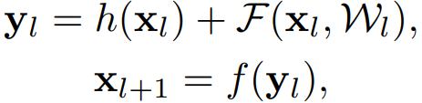

其中，$x_l$ 和 $x_{l+1}$ 是 第 $l$ 个残差单元的输入和输出，$F$ 是残差函数。在 ResNet 中，$h(x_{l})= x_{l}$ 是恒等映射（`identity`），$f$ 是 `ReLU` 激活函数。在 `ImageNet` 数据集和 `COCO` 数据集上，超过 `1000` 层的残差网络都取得了当前最优的准确率。残差网络的核心思想是在 $h(x_{l})$ 的基础上学习附加的残差函数 $F$，其中很关键的选择就是使用恒等映射 $h(x_{l})= x_{l}$，这可以通过在网络中添加恒等快捷连接（skip connection) `shortcut` 来实现。

本文中主要在于分析在深度残差网络中构建一个信息“直接”传播的路径——不只是在残差单元直接，而是在整个网络中信息可以“直接”传播。如果 $h(x_{l})$ 和 $f(y_{l})$ 都是恒等映射，那么**信号可以在单元间直接进行前向-反向传播**。实验证明基本满足上述条件的网络架构一般更容易训练。本文实验了不同形式的 $h(x_{l})$，发现使用恒等映射的网络性能最好，误差减小最快且训练损失最低。这些实验说明“干净”的信息通道有助于优化。各种不同形式的 $h(x_{l})$ 见图 `1、2、4` 中的灰色箭头所示。

为了构建 $f(y_l)=y_l$ 的恒等映射，本文将激活函数（`ReLU` 和 `BN`）移到权值层（`Conv`）之前，形成一种“预激活（`pre-activation`）”的方式，而不是常规的“后激活（`post-activation`）”方式，这样就设计出了一种新的残差单元（见图 `1(b)`）。基于这种新的单元我们在 `CIFAR-10/100` 数据集上使用`1001` 层残差网络进行训练，发现新的残差网络比之前（`ResNet`）的更容易训练并且泛化性能更好。同时还考察了 `200` 层新残差网络在 `ImageNet` 上的表现，原先的残差网络在这个层数之后开始出现过拟合的现象。这些结果表明**网络深度这个维度**还有很大探索空间，毕竟深度是现代神经网络成功的关键。

## 2、深度残差网络的分析

原先 `ResNets` 的残差单元的可以表示为：

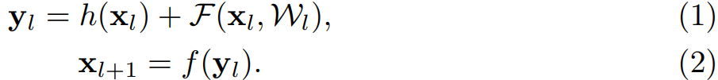

在 `ResNet` 中，函数 $h$ 是恒等映射，即 $h(x_{l}) = x_{l}$。公式的参数解释见下图：

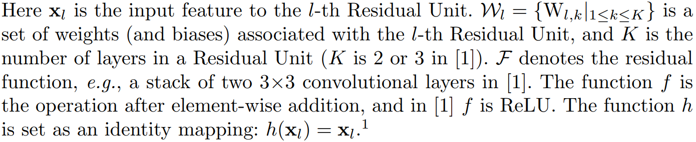

如果函数 $f$ 也是恒等映射，即 $y_{l}\equiv y_{l}$，公式 `(1)(2)` 可以合并为：

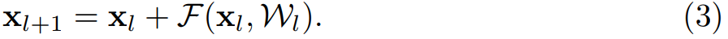

那么**任意深层**的单元 $L$ 与浅层单元 $l$之间的关系为：

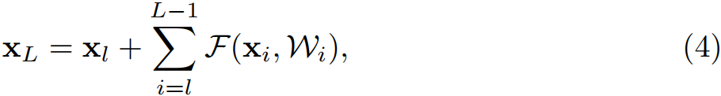

公式 `(4)` 有两个特性：

1. 深层单元的特征可以由浅层单元的特征和残差函数相加得到；
2. 任意深层单元的特征都可以由起始特征 $x_0$ 与先前所有残差函数相加得到，这与普通（`plain`）网络不同，普通网络的深层特征是由一系列的矩阵向量相乘得到。**残差网络是连加，普通网络是连乘**。

公式 `(4)` 也带来了良好的反向传播特性，用 $\varepsilon $ 表示损失函数，根据反向传播的链式传导规则，反向传播公式如下：

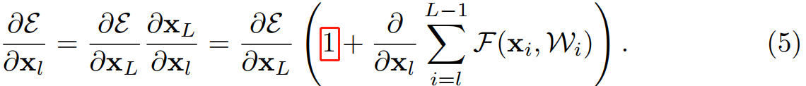

从公式 `(5)` 中可以看出，反向传播也是两条路径，其中之一直接将信息回传，另一条会经过所有的带权重层。另外可以注意到第二项的值在一个 `mini-batch` 中不可能一直是 `-1`，也就是说回传的梯度不会消失，不论网络中的权值的值再小都不会发生梯度消失现象。

## 3、On the Importance of Identity Skip Connection

考虑恒等映射的重要性。假设将恒等映射改为 $h(x_{l}) = \lambda_{l}x_{l})$，则：

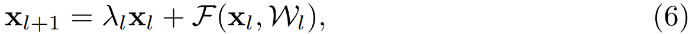

像公式 `(4)` 一样递归的调用公式 `(3)`，得：

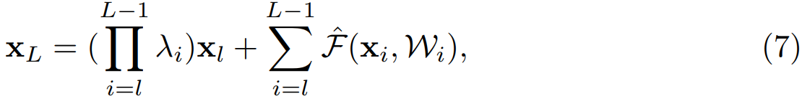

其中，$\hat{F}$ 表示将标量合并到残差函数中，与公式 `(5)` 类似，反向传播公式如下：

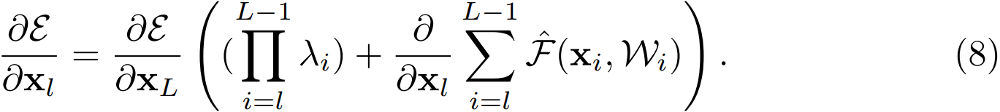

与公式 `(5)` 不同，公式 `(8)` 的第一个加法项由因子 $\prod_{i=l}^{L-1}\lambda_{i}$ 进行调节。对于一个极深的网络($L$ 极大)，考虑第一个连乘的项，如果所有的 $\lambda$ 都大于 `1`，那么这一项会指数级增大；如果所有 $\lambda$ 都小于 `1`，那么这一项会很小甚至消失，会阻断来自 `shortcut` 的反向传播信号，并迫使其流过权重层。本文通过实验证明这种方式会对模型优化造成困难。

另外其他不同形式的变换映射也都会阻碍信号的有效传播，进而影响训练进程。

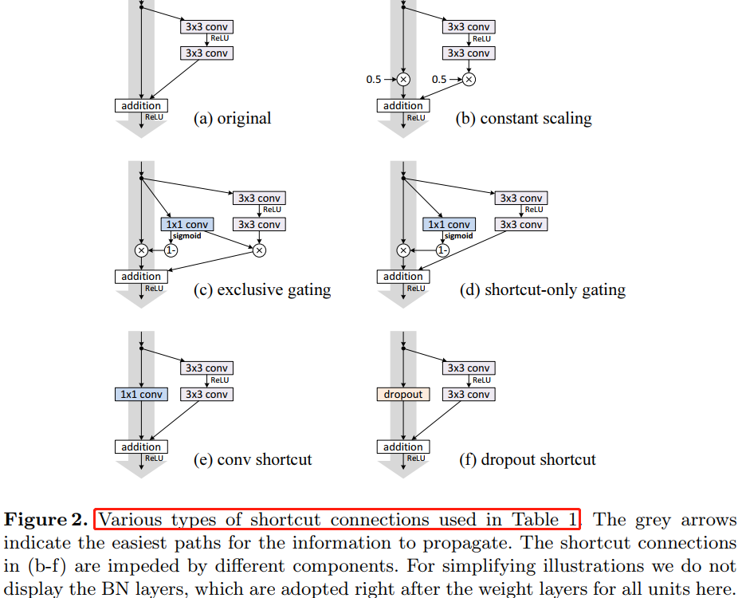

## 4、On the Usage of Activation Functions

第 `3` 章考察使用不同形式映射（见图 `2`）来验证函数 $h$ 是恒等映射的重要性，这章讨论公式`(2)`中的 $f$，如果 $f$ 也是恒等映射，网络的性能会不会有所提升。通过调节激活函数 (`ReLU and/or BN`) 的位置，来使 $f$ 是恒等映射。图 `4` 展示了激活函数在不同位置的残差单元结构图去。
> 图 `4(e)` 的”预激活“操作是本文提出的一种对于深层残差网络能够更有效训练的网络结构（`ResNet v2`）。

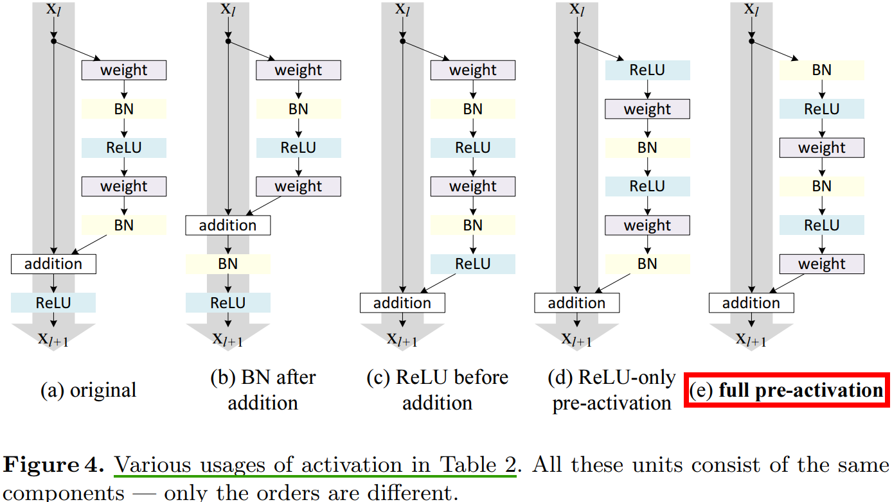

## 4.1、Experiments on Activation

本章，我们使用 `ResNet-110` 和 `164` 层瓶颈结构(称为 `ResNet-164`)来进行实验。瓶颈残差单元包含一个 $1\times 1$ 的层来降维，一个 $3\times 3$ 的层，还有一个 $1\times 1$ 的层来恢复维度。如 `ResNet` 论文中描述的那样，它的计算复杂度和包含两个 $3\times 3$ 卷积层的残差单元相同。

**BN after addition**
效果比基准差，BN 层移到相加操作后面会阻碍信号传播，一个明显的现象就是训练初期误差下降缓慢。

**ReLU before addition**
这样组合的话残差函数分支的输出就一直保持非负，这会影响到模型的表示能力，而实验结果也表明这种组合比基准差。

**Post-activation or pre-activation**
原来的设计中相加操作后面还有一个 `ReLU` 激活函数，这个激活函数会影响到残差单元的两个分支，现在将它移到残差函数分支上，快捷连接分支不再受到影响。具体操作如图 `5` 所示。

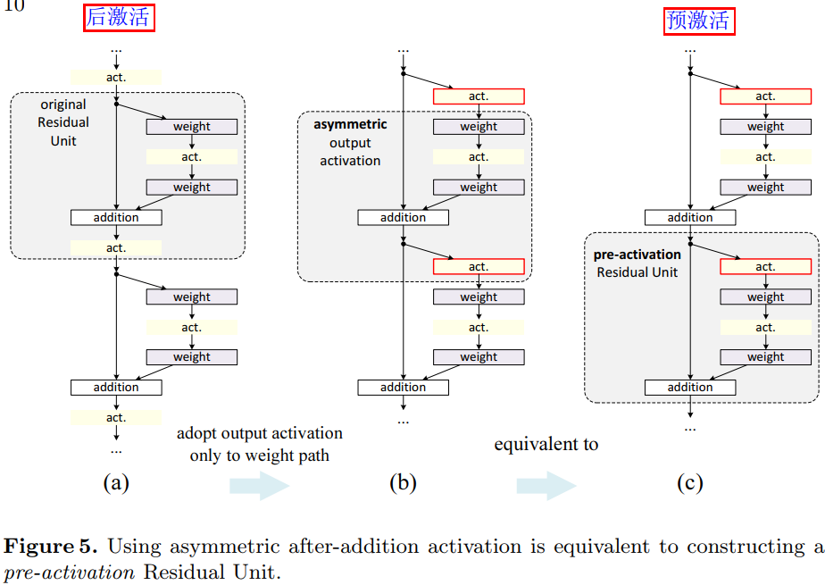

根据激活函数与相加操作的位置关系，我们称之前的组合方式为“后激活（`post-activation`）”，现在新的组合方式称之为“预激活（`pre-activation`）”。原来的设计与预激活残差单元之间的性能对比见表 `3`。预激活方式又可以分为两种：只将 `ReLU` 放在前面，或者将 `ReLU` 和 `BN`都放到前面，根据表 `2` 中的结果可以看出 `full pre-activation` 的效果要更好。

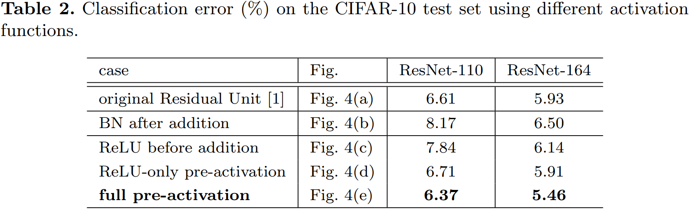
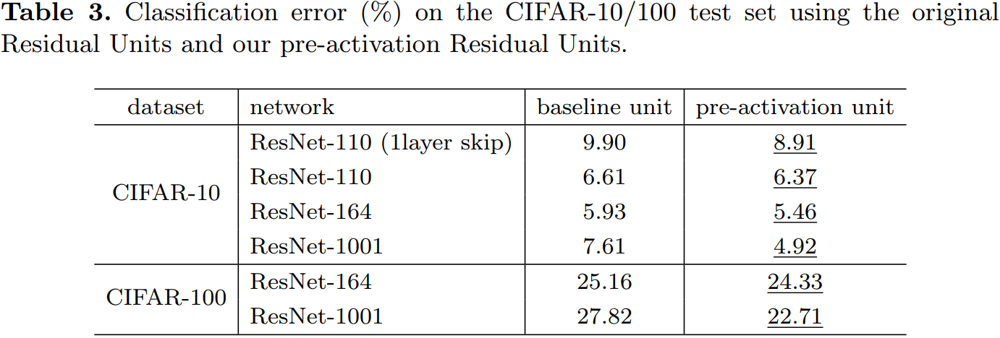

## 4.2、Analysis

使用预激活有两个方面的优点：1) $f$ 变为恒等映射，使得网络更易于优化；2)使用 `BN` 作为预激活可以加强对模型的正则化。

**Ease of optimization**
这在训练 `1001` 层残差网络时尤为明显，具体见图 1。使用原来设计的网络在起始阶段误差下降很慢，因为 $f$ 是 `ReLU` 激活函数，当信号为负时会被**截断**，使模型无法很好地逼近期望函数；而使用预激活网络中的 $f$ 是恒等映射，信号可以在不同单元直接直接传播。本文使用的 `1001`层网络优化速度很快，并且得到了最低的误差。

**$f$ 为 `ReLU` 对浅层残差网络的影响并不大，如图 `6-right` 所示。本文认为是当网络经过一段时间的训练之后权值经过适当的调整，使得单元输出基本都是非负，此时 $f$ 不再对信号进行截断。但是截断现象在超过 `1000`层的网络中经常发生**。

**Reducing overfitting**
观察图 `6-right`，使用了预激活的网络的训练误差稍高，但却得到更低的测试误差，本文推测这是 `BN` 层的正则化效果所致。在原始残差单元中，尽管`BN` 对信号进行了标准化，但是它很快就被合并到捷径连接(`shortcut`)上，组合的信号并不是被标准化的。**这个非标准化的信号又被用作下一个权重层的输入**。与之相反，本文的预激活（`pre-activation`）版本的模型中，权重层的输入总是标准化的。

## Results

表 `4`、表 `5` 分别展示了不同深层网络在不同数据集上的表现。使用的预激活单元的且**更深层**的残差网络（`ResNet v2`）都取得了最好的精度。

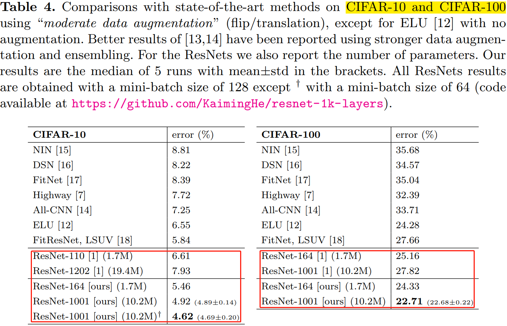
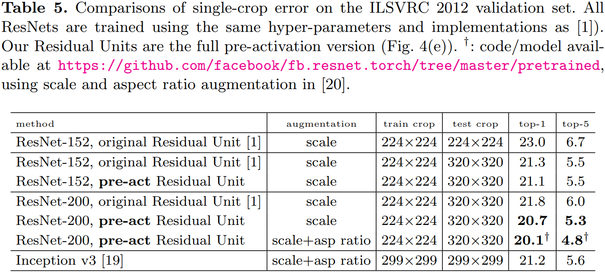

## 6、结论

**恒等映射形式的快捷连接和预激活对于信号在网络中的顺畅传播至关重要**。

## 参考资料

1. [[DL-架构-ResNet系] 002 ResNet-v2](https://zhuanlan.zhihu.com/p/29678910)
2. [Identity Mappings in Deep Residual Networks（译）](https://blog.csdn.net/wspba/article/details/60750007)
3. [Identity Mappings in Deep Residual Networks](https://arxiv.org/pdf/1603.05027.pdf)
