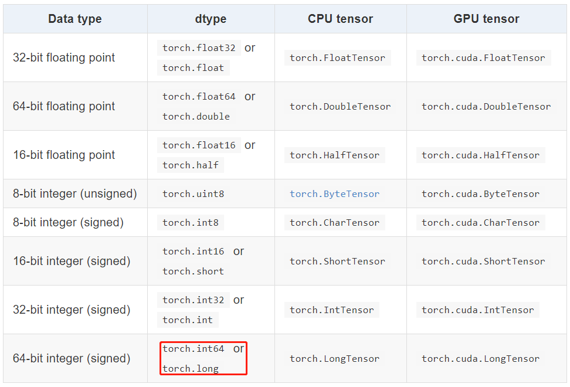
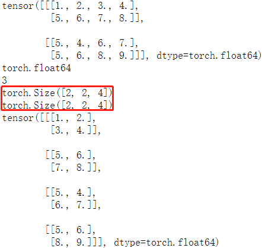

目录
---
[toc]

## torch.Tensor

`torch.Tensor` 是一种包含**单一数据类型**元素的多维矩阵，类似于 numpy 的 `array`。
可以使用使用 torch.tensor() 方法将 python 的 list 或**序列数据**转换成 Tensor 数据，生成的是`dtype`  默认是 `torch.FloatTensor`。
> 注意 `torch.tensor()` 总是拷贝 data。如果你有一个 tensor data 并且仅仅想改变它的 `requires_grad` 属性，可用 `requires_grad_()` 或者 `detach()` 来避免拷贝。如果你有一个 `numpy` 数组并且想避免拷贝，请使用 `torch.as_tensor()`。

1，指定数据类型的 tensor 可以通过传递参数 `torch.dtype` 和/或者 `torch.device` 到构造函数生成：
> 注意为了改变已有的 tensor 的 torch.device 和/或者 torch.dtype, 考虑使用 `to()` 方法.

```python
>>> torch.ones([2,3], dtype=torch.float64, device="cuda:0")
tensor([[1., 1., 1.],
        [1., 1., 1.]], device='cuda:0', dtype=torch.float64)
>>> torch.ones([2,3], dtype=torch.float32)
tensor([[1., 1., 1.],
        [1., 1., 1.]])
```

2，Tensor 的内容可以通过 Python 索引或者切片访问以及修改：

```python
>>> matrix = torch.tensor([[2,3,4],[5,6,7]])
>>> print(matrix[1][2])
tensor(7)
>>> matrix[1][2] = 9
>>> print(matrix)
tensor([[2, 3, 4],
        [5, 6, 9]])
```

3，使用 `torch.Tensor.item()` 或者 `int()` 方法从**只有一个值的 Tensor**中获取 Python Number：

```python
>>> x = torch.tensor([[4.5]])
>>> x
tensor([[4.5000]])
>>> x.item()
4.5
>>> int(x)
4
```

4，Tensor可以通过参数 `requires_grad=True` 创建, 这样 `torch.autograd` 会记录相关的运算实现自动求导：

```python
>>> x = torch.tensor([[1., -1.], [1., 1.]], requires_grad=True)
>>> out = x.pow(2).sum()
>>> out.backward()
>>> x.grad
tensor([[ 2.0000, -2.0000],
 [ 2.0000,  2.0000]])
```

5，每一个 tensor都有一个相应的 `torch.Storage` 保存其数据。tensor 类提供了一个多维的、strided 视图, 并定义了数值操作。

## Tensor 数据类型

Torch 定义了七种 CPU Tensor 类型和八种 GPU Tensor 类型：



`torch.Tensor` 是默认的 tensor 类型（`torch.FloatTensor`）的简称，即 `32` 位浮点数数据类型。

## Tensor 的属性

Tensor 有很多属性，包括数据类型、Tensor 的维度、Tensor 的尺寸。

+ **数据类型**：可通过改变 torch.tensor() 方法的 `dtype` 参数值，来设定不同的 `Tensor` 数据类型。
+ **维度**：不同类型的数据可以用不同维度(dimension)的张量来表示。标量为 `0` 维张量，向量为 `1` 维张量，矩阵为 `2` 维张量。彩色图像有 `rgb` 三个通道，可以表示为 `3` 维张量。视频还有时间维，可以表示为 `4` 维张量，有几个中括号 `[` 维度就是几。**可使用 `dim() 方法` 获取 `tensor` 的维度**。
+ **尺寸**：可以使用 `shape属性`或者 `size()方法`查看张量在每一维的长度，可以使用 `view()方法`或者`reshape() 方法`改变张量的尺寸。Pytorch 框架中四维张量形状的定义是 `(N, C, H, W)`。

> 关于如何理解 Pytorch 的 Tensor Shape 可以参考 stackoverflow 上的这个 [回答](https://stackoverflow.com/questions/52370008/understanding-pytorch-tensor-shape)。

样例代码如下：

```python
matrix = torch.tensor([[[1,2,3,4],[5,6,7,8]],
                       [[5,4,6,7], [5,6,8,9]]], dtype = torch.float64)
print(matrix)               # 打印 tensor
print(matrix.dtype)     # 打印 tensor 数据类型
print(matrix.dim())     # 打印 tensor 维度
print(matrix.size())     # 打印 tensor 尺寸
print(matrix.shape)    # 打印 tensor 尺寸
matrix2 = matrix.view(4, 2, 2) # 改变 tensor 尺寸
print(matrix2)
```

程序输出结果如下：



### view 和 reshape 的区别

+ 两个方法都是用来改变 tensor 的 shape，view() 只适合对满足连续性条件（`contiguous`）的 tensor 进行操作，而 reshape() 同时还可以对不满足连续性条件的 tensor 进行操作。
+ 在满足 tensor 连续性条件（`contiguous`）时，a.reshape()  返回的结果与a.view() 相同，都不会开辟新内存空间；不满足 `contiguous` 时， 直接使用 view() 方法会失败，`reshape()` 依然有用，但是会重新开辟内存空间，不与之前的 tensor 共享内存，即返回的是 **”副本“**（等价于先调用 `contiguous()` 方法再使用 `view()` 方法）。
更多理解参考这篇[文章](https://blog.csdn.net/Flag_ing/article/details/109129752)

## Tensor 与 ndarray

1，张量和 numpy 数组。可以用 `.numpy()` 方法从 Tensor 得到 numpy 数组，也可以用 `torch.from_numpy` 从 numpy 数组得到Tensor。这两种方法关联的 Tensor 和 numpy 数组是共享数据内存的。可以用张量的 `clone`方法拷贝张量，中断这种关联。

```python
arr = np.random.rand(4,5)
print(type(arr))
tensor1 = torch.from_numpy(arr)
print(type(tensor1))
arr1 = tensor1.numpy()
print(type(arr1))
"""
<class 'numpy.ndarray'>
<class 'torch.Tensor'>
<class 'numpy.ndarray'>
"""
```

2，`item()` 方法和 `tolist()` 方法可以将张量转换成 Python 数值和数值列表

```python
# item方法和tolist方法可以将张量转换成Python数值和数值列表
scalar = torch.tensor(5)  # 标量
s = scalar.item()
print(s)
print(type(s))

tensor = torch.rand(3,2)  # 矩阵
t = tensor.tolist()
print(t)
print(type(t))
"""
1.0
<class 'float'>
[[0.8211846351623535, 0.20020723342895508], [0.011571824550628662, 0.2906131148338318]]
<class 'list'>
"""
```

## 创建 Tensor

创建 tensor ，可以传入数据或者维度，torch.tensor() 方法只能传入数据，torch.Tensor() 方法既可以传入数据也可以传维度，强烈建议 tensor() 传数据，Tensor() 传维度，否则易搞混。

### 传入维度的方法

|方法名|方法功能|备注|
|-----|-------|---|
|`torch.rand(*sizes, out=None) → Tensor`|返回一个张量，包含了从区间 `[0, 1)` 的**均匀分布**中抽取的一组随机数。张量的形状由参数sizes定义。|推荐|
|`torch.randn(*sizes, out=None) → Tensor`|返回一个张量，包含了从**标准正态分布**（均值为0，方差为1，即高斯白噪声）中抽取的一组随机数。张量的形状由参数sizes定义。|不推荐|
|`torch.normal(means, std, out=None) → Tensor`|返回一个张量，包含了从指定均值 `means` 和标准差 `std` 的离散正态分布中抽取的一组随机数。标准差 `std` 是一个张量，包含每个输出元素相关的正态分布标准差。|多种形式，建议看源码|
|`torch.rand_like(a)`|根据数据 `a` 的 shape 来生成随机数据|不常用|
|`torch.randint(low=0, high, size)`|生成指定范围(`low, hight`)和 `size` 的随机整数数据|常用|
|`torch.full([2, 2], 4)`|生成给定维度，全部数据相等的数据|不常用|
|`torch.arange(start=0, end, step=1, *, out=None)`|生成指定间隔的数据|易用常用|
|`torch.ones(*size, *, out=None)`|生成给定 size 且值全为1 的矩阵数据|简单|
|`zeros()/zeros_like()/eye()`|全 `0` 的 tensor 和 对角矩阵|简单|

样例代码：

```python
>>> torch.rand([1,1,3,3])
tensor([[[[0.3005, 0.6891, 0.4628],
          [0.4808, 0.8968, 0.5237],
          [0.4417, 0.2479, 0.0175]]]])
>>> torch.normal(2, 3, size=(1, 4))
tensor([[3.6851, 3.2853, 1.8538, 3.5181]])
>>> torch.full([2, 2], 4)
tensor([[4, 4],
        [4, 4]])
>>> torch.arange(0,10,2)
tensor([0, 2, 4, 6, 8])
>>> torch.eye(3,3)
tensor([[1., 0., 0.],
        [0., 1., 0.],
        [0., 0., 1.]])
```

## 参考资料

+ [PyTorch：view() 与 reshape() 区别详解](https://blog.csdn.net/Flag_ing/article/details/109129752)
+ [torch.rand和torch.randn和torch.normal和linespace()](https://zhuanlan.zhihu.com/p/115997577)
