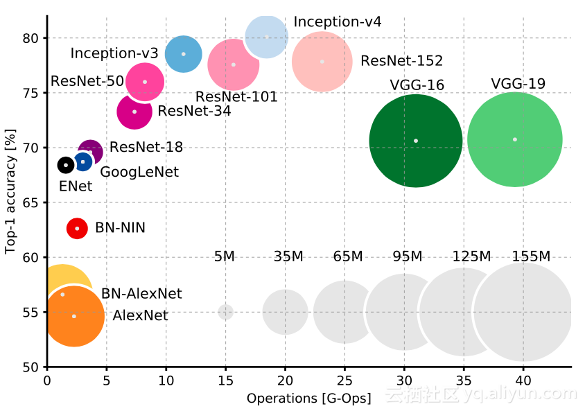

- [1，图像分类](#1图像分类)
- [2，类别不平衡问题](#2类别不平衡问题)
- [3，图像分类模型](#3图像分类模型)
- [4，提升分类模型精度的方法](#4提升分类模型精度的方法)
  - [5，数据扩充（数据增强）](#5数据扩充数据增强)
- [6，参考资料](#6参考资料)

> 图像分类是计算机视觉中最基础的任务，基本上深度学习模型的发展史就是图像分类任务提升的发展历史，但是图像分类并不是那么简单，也没有被完全解决。

## 1，图像分类

图像分类顾名思义就是一个模式分类问题，它的目标是将不同的图像，划分到不同的类别，实现最小的分类误差。
1，**单标签分类**：总体来说，对于单标签的图像分类问题，它可以分为**跨物种语义级别的图像分类(`cifar10`)，子类细粒度图像分类(`Caltech-UCSD Birds-200-2011`)，以及实例级图像分类(`人脸识别`)**三大类别。
> 虽然基本的图像分类任务，尤其是比赛趋近饱和，但是现实中的图像任务仍然有很多的困难和挑战。如类别不均衡的分类任务，类内方差非常大的细粒度分类任务，以及包含无穷负样本的分类任务。

2，**多标签分类**：多标签分类问题，通常有两种解决方案，即转换为多个单标签分类问题，或者直接联合研究。前者，可以训练多个分类器，来判断该维度属性的是否，损失函数常使用softmax loss。后者，则直接训练一个多标签的分类器，所使用的标签为0,1,0,0…这样的向量，使用hanmming距离等作为优化目标。

## 2，类别不平衡问题

在很多情况下，可能会遇到数据不平衡问题。数据不平衡是什么意思呢？举一个简单的例子：假设你正在训练一个网络模型，该模型用来预测视频中是否有人持有致命武器。但是训练数据中只有 50 个持有武器的视频，而有 1000 个没有持有武器的视频。如果使用这个数据集完成训练的话，模型肯定倾向于预测视频中没有持有武器。针对这个问题，可以做一些事情来解决：

- 在损失函数中使用权重：对数据量小的类别在损失函数中添加更高的权重，使得对于该特定类别的任何未正确分类将导致损失函数输出非常高的错误。
- 过采样：重复包含代表性不足类别的一些训练实例有助于提升模型精度。
- 欠采样：对数据量大的类别进行采样，降低二者的不平衡程度。
- 数据扩充：对数据量小的类别进行扩充。

## 3，图像分类模型

近些年来用于分类（`backbone`）的经典 `CNN` 模型，它们之间计算量和精度关系的变化图如下所示。

## 4，提升分类模型精度的方法

### 5，数据扩充（数据增强）

深度学习依赖于大数据，**使用更多的数据已被证明可以进一步提升模型的精度**。随着扩充的处理，将会免费获得更多的数据，使用的扩充方法取决于具体任务，比如，你在做自动驾驶汽车任务，可能不会有倒置的树、汽车和建筑物，因此对图像进行竖直翻转是没有意义的，然而，当天气变化和整个场景变化时，对图像进行光线变化和水平翻转是有意义的。

## 6，参考资料

[不懂得如何优化CNN图像分类模型？这有一份综合设计指南请供查阅](https://developer.aliyun.com/article/591123)
[【技术综述】你真的了解图像分类吗？](https://zhuanlan.zhihu.com/p/47281243)