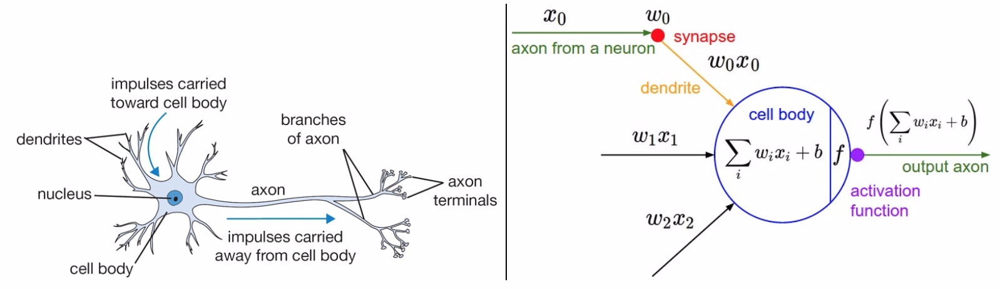
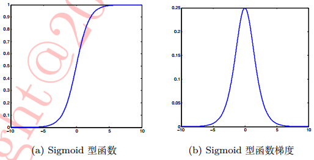
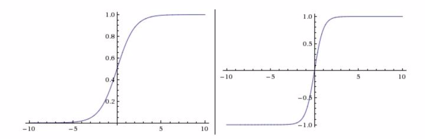
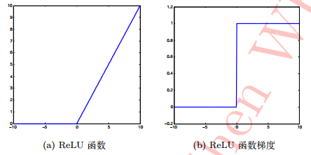
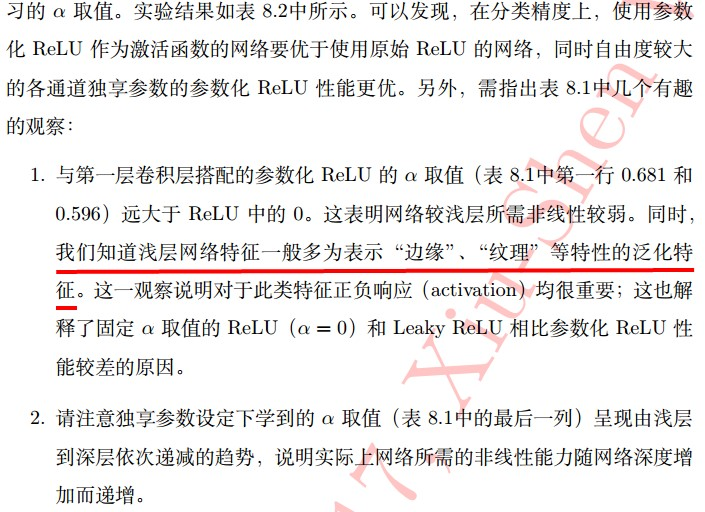

- [背景知识](#背景知识)
  - [反向传播算法](#反向传播算法)
  - [梯度消失与梯度爆炸](#梯度消失与梯度爆炸)
- [激活函数的作用](#激活函数的作用)
- [七种常用激活函数](#七种常用激活函数)
  - [Sigmoid型函数](#sigmoid型函数)
  - [tanh(x)型函数](#tanhx型函数)
  - [修正线性单元（ReLU）](#修正线性单元relu)
  - [Leaky ReLU](#leaky-relu)
  - [参数化 ReLU](#参数化-relu)
- [总结](#总结)
- [参考资料](#参考资料)

> 我们在项目中可能实际上就常用`relu`作为卷积层和全连接层的激活函数，但是，其他激活函数的特性和relu激活函数的问题及优点在哪也是我们需要知道的。本文为学习笔记，主要参考魏秀参的《CNN卷积神经网络》这本书和网上部分资料，加以自己理解，然后写的文章。

## 背景知识

### 反向传播算法

[一文搞懂反向传播](https://www.cnblogs.com/charlotte77/p/5629865.html)

### 梯度消失与梯度爆炸

左边是生物神经元，右边是数学模型。

## 激活函数的作用

`激活函数实现去线性化`。神经元的结构的输出为所有输入的加权和，这导致神经网络是一个线性模型。如果将每一个神经元（也就是神经网络的节点）的输出通过一个非线性函数，那么整个神经网络的模型也就不再是线性的了，这个非线性函数就是激活函数。 常见的激活函数有：`ReLU函数、sigmoid函数、tanh函数`。

## 七种常用激活函数

神经网络中常用的激活函数有七种：Sigmoid 型函数、 tanh(x) 型函数、修正线性单元（ReLU）、Leaky ReLu、参数化 ReLU、随机化 ReLU 和指数化线性单元（ELU）。

### Sigmoid型函数

`Sigmoid`型函数也称`Logistic`函数：$\sigma (x) = \frac{1}{1+exp(-x)}$。函数形状和函数梯度图，如下图所示：

从上图可以看出，经过`sigmoid`型函数作用后，输出响应的值被压缩到 [0,1] 之间，而 0 对应了生物神经元的“抑制状态”，1 则恰好对应了“兴奋状态”。但对于Sigmoid 梯度函数两端大于 5（或小于 −5）的区域，这部分输出会被压缩到 1（或 0）。这样的处理会带来梯度的“饱和效应”（saturation effect），也就是`梯度消失现象`。所谓梯度消失现象，可以对照 Sigmoid型函数的梯度图观察，会发现大于 5（或小于 −5）部分的梯度接近 0，这会**导致在误差反向传播过程中导数处于该区域的误差很难甚至无法传递至前层，进而导致整个网络无法正常训练**。
另外，还有一个问题是，`Sigmoid型函数值域的均值并非为 0 而是全为正`，这样的结果实际上并不符合我们对神经网络内权重参数数值的期望（均值）应为0的设想。

### tanh(x)型函数

`tanh(x)`型函数是在 `Sigmoid` 型函数基础上**为解决均值问题**提出的激活函数：
$$tanh(x) = 2\sigma(2x)-1$$
函数形状如下图所示：

tanh 型函数又称作`双曲正切函数`（hyperbolic tangent function）`，其函数范围是 (−1, +1)，输出响应的均值为 y。但由于 tanh(x) 型函数仍基于Sigmoid型函数，使用 tanh(x) 型函数依然会发生 “梯度消失” 现象。

### 修正线性单元（ReLU）

`ReLU`是Nair和Hinton于 2010 年引入神经网络的，是截止目前为止深度卷积神经网络中最为常用的激活函数之一，其定义如下：
$$ReLU(x) = max\{0,x\} = \left\{\begin{matrix}
x & if x\geqslant 0 \\ 
0 & if x< 0
\end{matrix}\right.$$

函数及函数梯度形状如下图所示：

与前两个激活函数相比：

+ ReLU 函数的梯度在x >= 0 时为 1，反之则为 0；对 x >= 0 部分完全消除了`sigmoid`型函数的梯度消失现象。
+ 计算复杂度上，ReLU 函数也相对前两者更简单。
+ 同时，实验中还发现 ReLU 函数有助于随机梯度下降方法收敛，收敛速度约快 6 倍左右。

但是，ReLU函数也有自身缺陷，即在 x < 0 时，梯度便为 `0`。换句话说，对于小于 0 的这部分卷积结果响应，它们一旦变为负值将再无法影响网络训练——这种现象被称作`“死区"`。

### Leaky ReLU

为缓解死区现象，研究者将 ReLU 函数中 x < 0 的部分调整为 $f(x) = \alpha\cdot x$，其中 $\alpha$ 为 0.01 或 0.001 数量级的较小正数，称其为 "Leaky ReLU"：

$$Leaky ReLU(x) = \left\{\begin{matrix}
x & if x>=0\\ 
\alpha\cdot x & if x < 0
\end{matrix}\right.$$

可以发现原始 ReLU 函数实际上是 Leaky ReLU 函数的一个特例，即$\alpha=0$，但是实际项目中发现，由于 Leaky ReLU 中 $\alpha$ 为超参数，合适的值较难设定且很敏感，所以 **Leaky ReLU函数在实际使用中性能并不十分稳定**。

### 参数化 ReLU

参数化 ReLU 直接将 $\alpha$ 也作为一个网络中可以学习的变量融入模型的整体训练过程。具体怎么做，可参考相关文献。万事具有两面性，参数化 ReLU 在带来更大自由度的同时，也增加了网络模型过拟合的风险，在实际使用中需要格外注意。

## 总结

+ 建议首先使用目前最常用的  ReLU 激活函数，但需注意模型参数初始化和学习率的设置；
+ 为了进一步提高模型精度，可尝试 Leaky ReLU、参数化 ReLU、随机化 ReLU 和 ELU。但四者之间实际性能优劣并无一致性结论，需具体问题具体对待

## 参考资料

魏秀参-CNN解析神经网络
