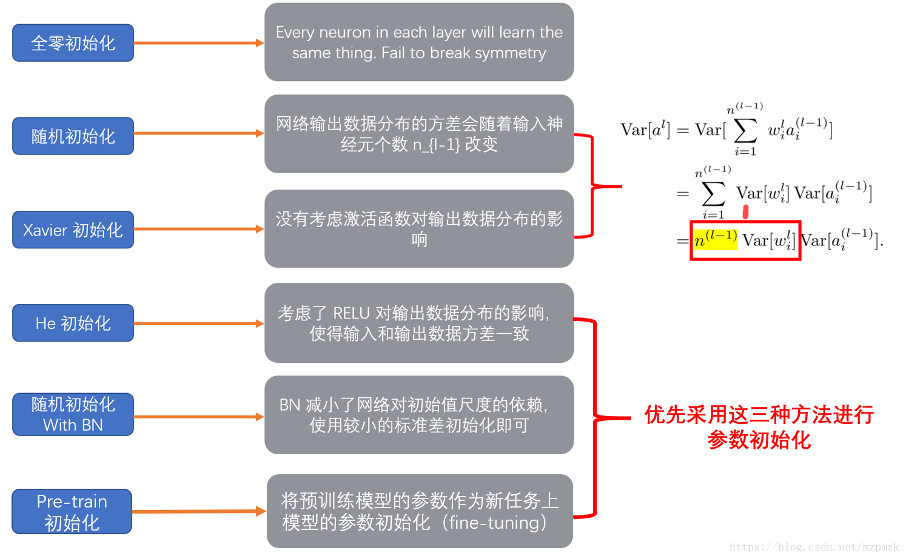

- [一，参数初始化概述](#一参数初始化概述)
  - [1.1，进行网络参数初始化的原因](#11进行网络参数初始化的原因)
  - [1.2，网络参数初始化为什么重要](#12网络参数初始化为什么重要)
- [二，权重初始化方式分类](#二权重初始化方式分类)
  - [2.1，全零初始化](#21全零初始化)
  - [2.2，标准初始化](#22标准初始化)
  - [2.3，Xavier 初始化](#23xavier-初始化)
  - [2.4，He 初始化](#24he-初始化)
  - [2.5，总结](#25总结)
- [参考资料](#参考资料)

> 本文内容参考资料为《智能之门-神经网络与深度学习入门》和《解析卷积神经网络》两本书，以及部分网络资料，加以个人理解和内容提炼总结得到，文中所有直方图的图片来源于参考资料3。

## 一，参数初始化概述

我们知道神经网络模型一般是依靠**随机梯度下降**优化算法进行神经网络参数更新的，而神经网络参数学习是非凸问题，利用梯度下降算法优化参数时，**网络权重参数的初始值选取十分关键**。

首先得明确的是现代的**网络参数初始化策略**是简单的、启发式的。设定改进的初始化策略是一项困难的 任务，因为神经网络优化至今还未被很好地理解（即模型训练过程是一个黑盒）。

大多数初始化策略基于在神经网络初始化时实现一些很好的性质。然而，我们并没有很好地理解这些性质中的哪些会在学习开始进行后的哪些情况下得以保持。进一步的难点是，有些初始点从优化的观点看或许是有利的，但是从泛化的观点看是不利的。我们对于初始点如何影响泛化的理解是相当原始的，几乎没有提供如何选择初始点的任何指导。

### 1.1，进行网络参数初始化的原因

深度学习模型（神经网络模型）的训练算法通常是**迭代**的，因此模型训练者需要指定开始迭代的初始点，即择网络参数初始化策略。

### 1.2，网络参数初始化为什么重要

训练深度学习模型是一个足够困难的问题，以至于大多数算法都很大程度受到网络初始化策略的影响。

**模型迭代的初始点能够决定算法是否收敛**，有些初始点十分不稳定，使得该算法会遭遇数值困难，并可能完全失败。当学习收敛时，初始点可以决定学习收敛得多快，以及是否收敛到一个代价高或低的点。另外，即使是具有同一个损失代价的迭代点也会有差别极大的泛化误差，而迭代初始点也可以影响泛化（误差）。

## 二，权重初始化方式分类

在实际应用中，模型权重参数服从**高斯分布**（`Gaussian distribution`）或**均匀分布**（`uniform distribution`）都是较为**有效**的初始化方式。值得注意的是，这两种分布选择的区别，目前还没有被详尽的研究清楚，能够确定只有，初始分布的大小确实对优化过程的结果和网络泛化能力都有很大的影响。
> 权重初始化随机值的初始化策略的分布都对模型性能有影响，但是影响的原理（神经网络优化原理）又没有被彻底研究清楚，所谓模型训练，还真不愧是炼丹，部分时候还真得靠炼丹人的经验。

另一种神经网络参数初始化策略总结如下：

1. **加载预训练模型参数初始化**：直接加载在大规模数据集上训练得到模型参数，一定程度上提升模型的泛化能力。
2. **随机初始化**：注意不能将参数值全部初始化为 `0`，因为如果神经网络第一遍前向传播所有隐层神经网络激活值相同，反向传播权重更新也相同，导致隐藏层的各个神经元没有区分性，导致“对称权重”现象。较好的方式是对每个参数进行**随机初始化**。
3. **固定参数值初始化**：比如对于偏置（bias）通常用 `0` 初始化，LSTM 遗忘门偏置通常为 1或 2，使时序上的梯度变大，对于 ReLU 神经元，偏置设为 0.01，使得训练初期更容易激活。

虽然不同文章对参数初始化方法的分类有着不同的总结，因此，本文直接给出常用且有效的初始化方法名称，并以 `Pytorch` 框架为例，给出相应 `API`。

### 2.1，全零初始化

虽然参数(权值)在理想情况下应基本保持正负各半的状态(**期望为 0**)，但是，这不意味着可以将所有参数都初始化为 `0`（$W=0$）！零值初始化的权重矩阵值打印输出示例如下所示。

```python
W1= [[-0.82452497 -0.82452497 -0.82452497]]
B1= [[-0.01143752 -0.01143752 -0.01143752]]
W2= [[-0.68583865]
     [-0.68583865]
     [-0.68583865]]
B2= [[0.68359678]] # 单个输出的的双层神经网络
```

可以看到 `W1、B1、W2` 内部 `3` 个单元的值都一样，这是因为初始值都是 0，所以梯度均匀回传，导致所有神经元的权重 `W` 的值都同步更新，没有任何差别，这样无论训练多少轮，结果也不会正确。

### 2.2，标准初始化

1，高斯分布初始化：使用高斯分布对每个参数随机初始化，即将权重 $W$ 按如下公式进行初始化:

$$
W \sim N[0, \sigma^2]
$$
其中 $N$ 表示**高斯分布**（Gaussian Distribution，也叫做正态分布，Normal Distribution），上式是位置参数 $\mu = 0$（**期望值**），尺度参数 $\sigma^2$（**方差**） 的高斯分布（也叫标准高斯分布）。有的地方也称为 **`Normal` 初始化**。

`Pytorch` 框架中对应的 `API` 如下。
```python
# 一般默认采用标准高斯分布初始化方法，即均值为 0，方差为 1，
torch.nn.init.normal_(tensor, mean=0, std=1)
```

2，与高斯分布初始化方式类似的是**均匀分布初始化**，其参数范围区是 $[-r, r]$。

`Pytorch` 框架中对应的 `API` 如下。
```python
torch.nn.init.uniform_(tensor, a=0, b=1)
```

高斯分布和均匀分布都是固定方差参数的初始化方法，它们的关键是：如何设置方差！
- 如果太小，会导致神经元输出过小，经过多层则梯度信号消失了。
- 如果太大，`sigmoid` 激活梯度接近 `0`，导致梯度消失。一般需要配合 `BN` 层一起使用。

当目标问题较为简单、网络深度不大时，一般用标准初始化就可以了。但是当使用深度神经网络时，标准初始化在 Sigmoid 激活函数上的表现会遇到如下图 1 所示的问题。


上图是一个 `6`层的深度网络，使用 **全连接层 + Sigmoid 激活函数**的配置，图中表示的是**各层激活函数的直方图**。可以看到各层的激活值严重向两侧 $[0,1]$ 靠近，从 `Sigmoid` 的函数曲线可以知道这些值的导数趋近于 `0`（激活函数值趋近于零，导数也趋近于零），**反向传播时的梯度逐步消失**。处于中间地段的值比较少，对参数学习非常不利。
> 传统的**固定方差**的高斯分布初始化方法，在网络变深的时候会使得模型很难收敛。

### 2.3，Xavier 初始化

基于上述观察（标准初始化在 `Sigmoid` 激活函数上的表现），Xavier Glorot 等人于 `2010` 年研究出了下面的`Xavier` 初始化方法。

`Xavier` 初始化方法比直接用高斯分布进行初始化 $W$ 的优势在于：一般的神经网络在前向传播时神经元输出值的方差会不断增大，而使用 `Xavier` 等方法理论上可以保证**每层神经元输入输出数据分布方差一致**（和 `BN` 层效果类似，具体原理参考[Xavier 论文](http://proceedings.mlr.press/v9/glorot10a/glorot10a.pdf)）。

条件：正向传播时，激活值的方差保持不变；反向传播时，关于状态值的梯度的方差保持不变。

使用 `Sigmoid` 激活函数时，**Xavier 高斯分布**初始化的公式如下所示:

$$
W \sim N
\begin{pmatrix}
0, \sqrt{\frac{2}{n_{in} + n_{out}}} 
\end{pmatrix}
$$

`Pytorch` 框架中对应的 `API` 如下。
```python
torch.nn.init.xavier_normal_(tensor, gain=1)
```

另外，还有 Xavier 均匀分布的公式如下所示（个人感觉使用频率不多）。

$$
W \sim U 
\begin{pmatrix}
 -\sqrt{\frac{6}{n_{in} + n_{out}}}, \sqrt{\frac{6}{n_{in} + n_{out}}} 
\end{pmatrix}
$$

下图2展示了 Xavier 初始化在 Sigmoid 激活函数上的表现，其和图1都基于同一个深度为 `6` 层的网络。可以看到，后面几层的**激活函数输出值**的分布**仍然**基本符合正态分布，这有利于神经网络的学习。


### 2.4，He 初始化

随着深度学习的发展，人们觉得 `Sigmoid` 激活在反向传播算法中效果有限且会导致梯度消失问题，于是又提出了 `ReLU` 激活函数。

但 Xavier 初始化在 ReLU 激活函数上的表现并不好。随着网络层的加深，使用 `ReLU` 时激活值逐步向 `0` 偏向，这同样会导致梯度消失问题。

下图3展现了 Xavier 初始化在 ReLU 激活函数上的表现。


于是 He Kaiming 等人于 2015 年提出了 He 初始化法（也叫做MSRA初始化法）。

He 初始化法最主要是想解决使用 `ReLU` 激活函数后，方差会发生变化的问题。

只考虑输入个数时，He 初始化是一个均值为 0，方差为 $2/n$ 的高斯分布，适合于 ReLU 激活函数:

$$
W \sim N 
\begin{pmatrix} 
0, \sqrt{\frac{2}{n}} 
\end{pmatrix}
$$

其中 $n$ 为网络层输入神经元数量个数。

`Pytorch` 框架中对应的 `API` 如下。

```python
torch.nn.init.kaiming_normal_(tensor, a=0, mode='fan_in', nonlinearity='leaky_relu')
```

下图4 为 He 初始化在 ReLU 激活函数上的表现，所用网络和前面一样。


### 2.5，总结

- Xavier 初始化和 He 初始化目的都是想**可以根据神经元连接数量自适应调整初始化分布的方差，也称为“方差缩放”**。
- 网络参数初始化方法的选择对保持数值稳定性至关重要，其与非线性激活函数的选择得结合一起考虑。
- 网络参数初始化的选择可以决定优化算法收敛的速度有多快。糟糕选择可能会导致我们在训练神经网络模型时遇到梯度爆炸或梯度消失。

除了以上初始化，比较常用的还有“随机初始化 With BN”和“预训练模型初始化”，各种初始化方法的特点总结如下:


## 参考资料

- 《深度学习-8.4 参数初始化策略》
- 《解析卷积神经网络-章 7 网络参数初始化》
- [AIEDU-15.1 权重矩阵初始化](https://microsoft.github.io/ai-edu/%E5%9F%BA%E7%A1%80%E6%95%99%E7%A8%8B/A2-%E7%A5%9E%E7%BB%8F%E7%BD%91%E7%BB%9C%E5%9F%BA%E6%9C%AC%E5%8E%9F%E7%90%86/%E7%AC%AC7%E6%AD%A5%20-%20%E6%B7%B1%E5%BA%A6%E7%A5%9E%E7%BB%8F%E7%BD%91%E7%BB%9C/15.1-%E6%9D%83%E9%87%8D%E7%9F%A9%E9%98%B5%E5%88%9D%E5%A7%8B%E5%8C%96.html)
- [神经网络之权重初始化](https://www.cnblogs.com/makefile/p/init-weight.html)
- [神经网络参数初始化小结](https://zhuanlan.zhihu.com/p/133835463)