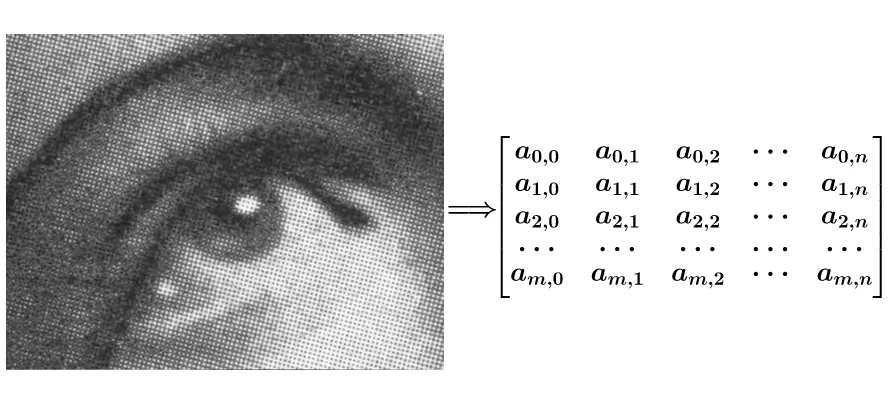
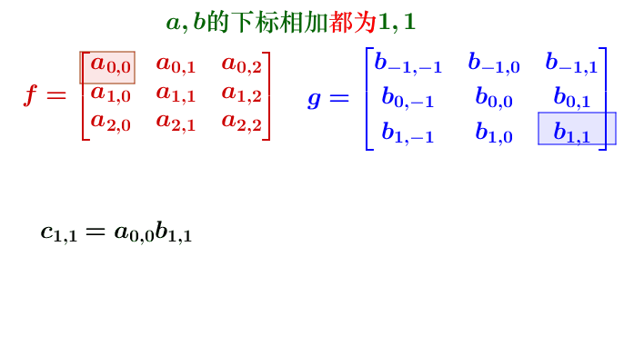
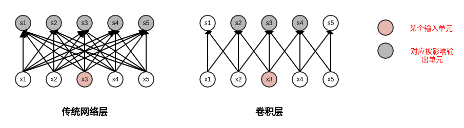
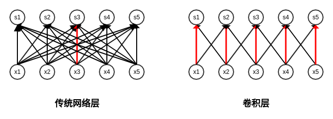
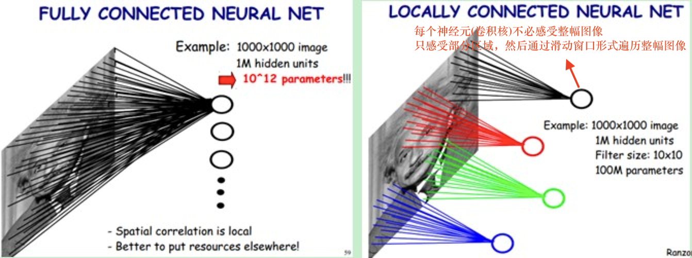
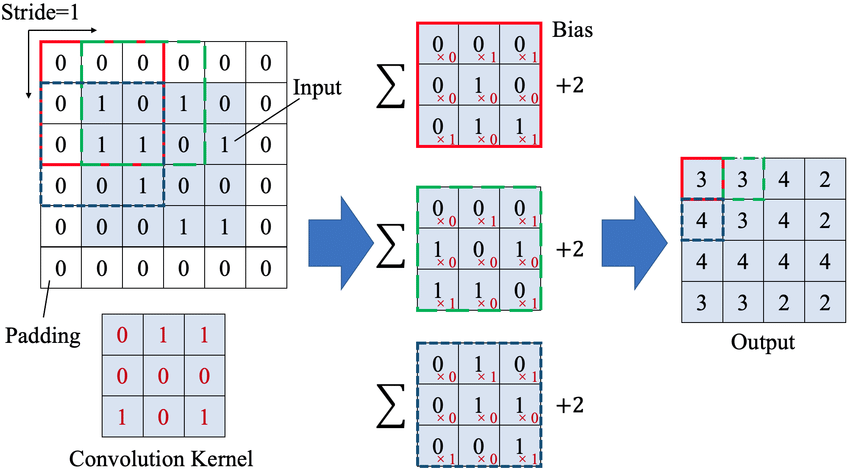
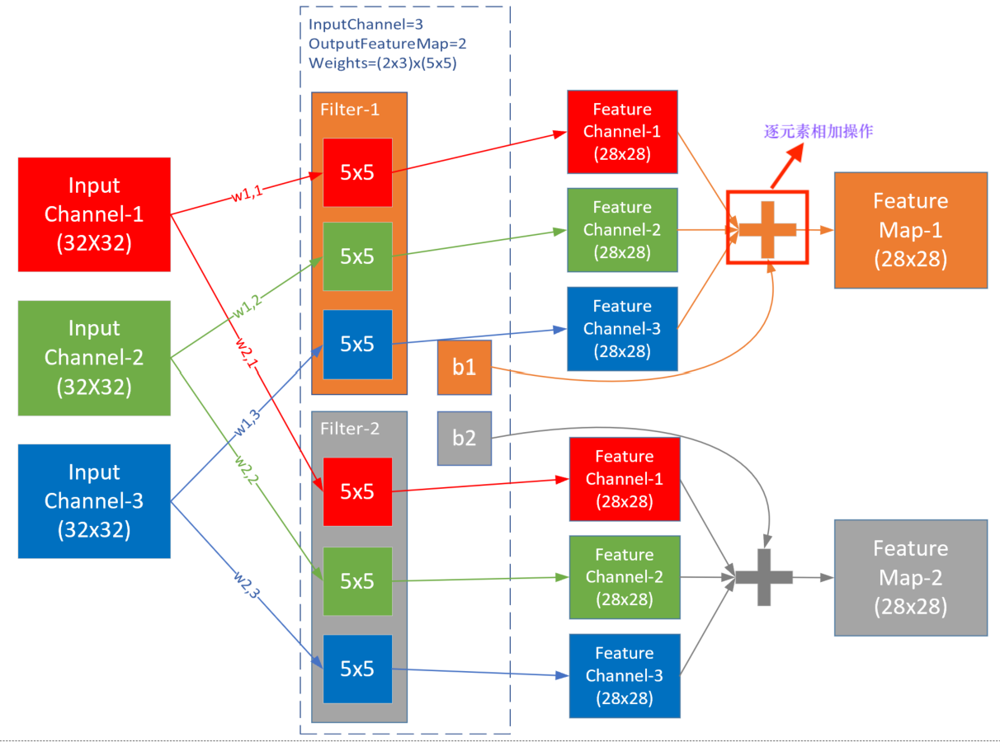
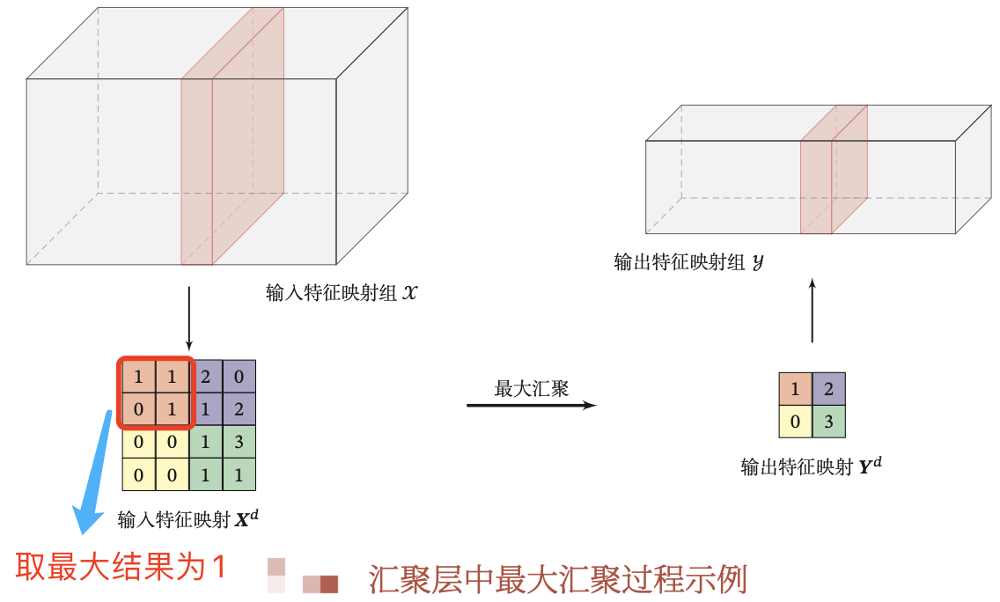
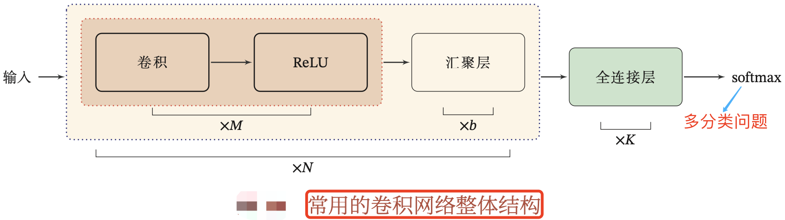
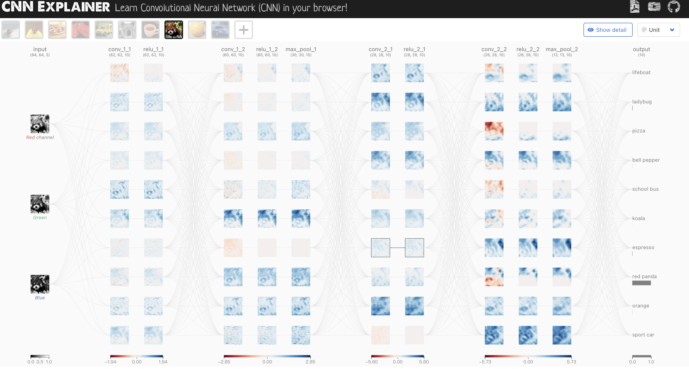

- [前言](#前言)
- [一，卷积](#一卷积)
  - [1.1，卷积运算定义](#11卷积运算定义)
  - [1.2，卷积的意义](#12卷积的意义)
  - [1.3，从实例理解卷积](#13从实例理解卷积)
  - [1.4，图像卷积（二维卷积）](#14图像卷积二维卷积)
  - [1.5，互相关和卷积](#15互相关和卷积)
- [二，卷积层](#二卷积层)
  - [2.1，卷积层定义](#21卷积层定义)
    - [2.1.1，局部连接](#211局部连接)
    - [2.1.2，权重共享](#212权重共享)
  - [2.2，卷积层理解](#22卷积层理解)
  - [2.3，分组卷积和DW卷积](#23分组卷积和dw卷积)
  - [2.4，卷积层 api](#24卷积层-api)
- [三，卷积神经网络](#三卷积神经网络)
  - [3.1，汇聚层](#31汇聚层)
  - [3.2.，汇聚层 api](#32汇聚层-api)
- [四，卷积神经网络结构](#四卷积神经网络结构)
- [参考资料](#参考资料)

## 前言

在全连接层构成的多层感知机网络中，我们通过将图像数据展平成一维向量来送入模型，这样会忽略了每个图像的**空间结构信息**。理想的策略应该是要利用相近像素之间的相互关联性，将图像数据二维矩阵送给模型中学习。

卷积神经网络(convolutional neural network，`CNN`)正是一类强大的、专为处理图像数据（多维矩阵）而设计的神经网络。在 `Transformer` 应用到 `CV` 领域之前，基于卷积神经网络架构的模型在计算机视觉领域中占主导地位，几乎所有的图像识别、目标检测、语义分割、3D目标检测、视频理解等任务都是以 `CNN` 方法为基础。

卷积神经网络核心网络层是卷积层，其使用了卷积(convolution)这种数学运算，卷积是一种特殊的线性运算。另外，通常来说，卷积神经网络中用到的卷积运算和其他领域(例如工程领域以及纯数学领域)中的定义并不完全一致。

## 一，卷积

在理解卷积层之前，我们首先得理解什么是卷积操作。

卷积与[傅里叶变换](https://zh.wikipedia.org/wiki/傅里叶变换)有着密切的关系。例如两函数的傅里叶变换的乘积等于它们卷积后的傅里叶变换，利用此一性质，能简化傅里叶分析中的许多问题。

> operation 视语境有时译作“操作”，有时译作“运算”，本文不做区分。

### 1.1，卷积运算定义

为了给出卷积的定义， 这里从现实世界会用到函数的例子出发。

假设我们正在用激光传感器追踪一艘宇宙飞船的位置。我们的激光传感器给出 一个单独的输出 $x(t)$，表示宇宙飞船在时刻 $t$ 的位置。$x$ 和  $t$ 都是**实值**的，这意味着我们可以在任意时刻从传感器中读出飞船的位置。

现在假设我们的传感器受到一定程度的噪声干扰。为了得到飞船位置的低噪声估计，我们对得到的测量结果进行平均。显然，时间上越近的测量结果越相关，所 以我们采用一种**加权平均**的方法，对于最近的测量结果赋予更高的权重。我们可以采用一个加权函数 $w(a)$ 来实现，其中 $a$ 表示测量结果距当前时刻的时间间隔。如果我们对任意时刻都采用这种加权平均的操作，就得到了一个新的对于飞船位置的平滑估计函数 $s$:

$$s(t) = \int x(a)w(t-a )da$$

这种运算就叫做卷积（`convolution`）。更一般的，卷积运算的数学公式定义如下：
$$
连续定义: \; h(x)=(f*g)(x) = \int_{-\infty}^{\infty} f(t)g(x-t)dt \tag{1}
$$

$$
离散定义: \; h(x) = (f*g)(x) = \sum^{\infty}_{t=-\infty} f(t)g(x-t) \tag{2}
$$

以上卷积计算公式可以这样理解:

1. 先对函数 $g(t)$ 进行反转（`reverse`），相当于在数轴上把 $g(t)$ 函数从右边褶到左边去，也就是卷积的“卷”的由来。
2. 然后再把 $g(t)$ 函数向左平移 $x$ 个单位，在这个位置对两个函数的对应点相乘，然后相加，这个过程是卷积的“积”的过程。

### 1.2，卷积的意义

对卷积这个名词，可以这样理解：**所谓两个函数的卷积（$f*g$），本质上就是先将一个函数翻转，然后进行滑动叠加**。在连续情况下，叠加指的是对两个函数的乘积求积分，在离散情况下就是加权求和，为简单起见就统一称为叠加。

因此，卷积运算整体来看就是这么一个过程:

翻转—>滑动—>叠加—>滑动—>叠加—>滑动—>叠加.....

多次滑动得到的一系列叠加值，构成了卷积函数。

> 这里多次滑动过程对应的是 $t$ 的变化过程。

那么，**卷积的意义是什么呢**？可以从卷积的典型应用场景-图像处理来理解：

1. 为什么要进行“卷”？进行“卷”（翻转）的目的其实是施加一种约束，它指定了在“积”的时候以什么为参照。在空间分析的场景，它指定了在哪个位置的周边进行累积处理。
2. 在图像处理的中，卷积处理的结果，其实就是把每个像素周边的，甚至是整个图像的像素都考虑进来，对当前像素进行某种加权处理。因此，“积”是全局概念，或者说是一种“混合”，把两个函数进行时间（信号分析）或空间（图像处理）上进行混合。

> 卷积意义的理解来自[知乎问答](https://www.zhihu.com/question/22298352)，有所删减和优化。

### 1.3，从实例理解卷积

一维卷积的实例有 “丢骰子” 等经典实例，这里不做展开描述，本文从二维卷积用于图像处理的实例来理解。

一般，数字图像可以表示为如下所示矩阵：
> 本图片摘自[知乎用户马同学的文章](https://www.zhihu.com/question/22298352)。



而卷积核 $g$ 也可以用一个矩阵来表示，如:

$$
g = \begin{bmatrix} 
&b_{-1,-1} &b_{-1,0} &b_{-1,1} \\ 
&b_{0,-1} &b_{0,0} &b_{0,1} \\ 
&b_{1,-1} &b_{1,0} &b_{1,1}
\end{bmatrix}
$$

按照卷积公式的定义，则目标图片的第 $(u, v)$ 个像素的二维卷积值为：

$$
(f * g)(u, v)=\sum_{i} \sum_{j} f(i, j)g(u-i, v-j)=\sum_{i} \sum_{j} a_{i,j} b_{u-i,v-j}
$$
展开来分析二维卷积计算过程就是，首先得到原始图像矩阵中 $(u, v)$ 处的矩阵：

$$
f=\begin{bmatrix} 
&a_{u-1,v-1} &a_{u-1,v} &a_{u-1,v+1}\\ 
&a_{u,v-1} &a_{u,v} &a_{u,v+1} \\ 
&a_{u+1,v-1} &a_{u+1,v} &a_{u+1,v+1}
\end{bmatrix}
$$

然后将图像处理矩阵**翻转**（两种方法，结果等效），如先沿 $x$ 轴翻转，再沿 $y$ 轴翻转（**相当于将矩阵 $g$ 旋转 180 度**）：

$$
\begin{aligned}
g &= \begin{bmatrix} &b_{-1,-1} &b_{-1,0} &b_{-1,1}\\ &b_{0,-1} &b_{0,0} &b_{0,1} \\ &b_{1,-1} &b_{1,0} &b_{1,1} \end{bmatrix}
=> \begin{bmatrix} &b_{1,-1} &b_{1,0} &b_{1,1}\\ &b_{0,-1} &b_{0,0} &b_{0,1} \\ &b_{-1,-1} &b_{-1,0} &b_{-1,1} \end{bmatrix} \\
&= \begin{bmatrix} &b_{1,1} &b_{1,0} &b_{1,-1}\\ &b_{0,1} &b_{0,0} &b_{0,-1} \\ &b_{-1,1} &b_{-1,0} &b_{-1,-1} \end{bmatrix} = g^{'}
\end{aligned}
$$

最后，计算卷积时，就可以用 $f$ 和 $g′$ 的内积：

$$
\begin{aligned}
f * g(u,v) &= a_{u-1,v-1} \times b_{1,1} + a_{u-1,v} \times b_{1,0} + a_{u-1,v+1} \times b_{1,-1} \\ 
&+ a_{u,v-1} \times b_{0,1} + a_{u,v} \times b_{0,0} + a_{u,v+1} \times b_{0,-1} \\ 
&+ a_{u+1,v-1} \times b_{-1,1} + a_{u+1,v} \times b_{-1,0} + a_{u+1,v+1} \times b_{-1,-1}
\end{aligned}
$$

计算过程可视化如下动图所示，注意动图给出的是 $g$ 不是 $g'$。



以上公式有一个特点，做乘法的两个对应变量 $a, b$ 的下标之和都是 $(u,v)$，其目的是对这种加权求和进行一种约束，这也是要将矩阵 $g$ 进行翻转的原因。上述计算比较麻烦，实际计算的时候，都是用翻转以后的矩阵，直接求**矩阵内积**就可以了。

### 1.4，图像卷积（二维卷积）

在机器学习和图像处理领域，卷积的主要功能是**在一个图像(或某种特征) 上滑动一个卷积核(即滤波器)，通过卷积操作得到一组新的特征**。一幅图像在经过卷积操作后得到结果称为特征映射(`Feature Map`)。如果把图像矩阵简写为 $I$，把卷积核 `Kernal` 简写为 $K$，则目标图片的第 $(i,j)$ 个像素的卷积值为：

$$
h(i,j) = (I*K)(i,j)=\sum_m \sum_n I(m,n)K(i-m,j-n) \tag{3}
$$

可以看出，这和一维情况下的卷积公式 2 是一致的。因为卷积的可交换性，我们也可以把公式 3 等价地写作：

$$
h(i,j) = (I*K)(i,j)=\sum_m \sum_n I(i-m,j-n)K(m,n) \tag{4}
$$

通常，下面的公式在机器学习库中实现更为简单，因为 $m$ 和 $n$ 的有效取值范围相对较小。

卷积运算可交换性的出现是因为我们将核相对输入进行了翻转（`flip`），从 $m$ 增 大的角度来看，输入的索引在增大，但是卷积核的索引在减小。我们将**卷积核翻转的唯一目 的是实现可交换性**。尽管可交换性在证明时很有用，但在神经网络的应用中却不是一个重要的性质。相反，许多神经网络库会实现一个**互相关函数**（`corresponding function`），它与卷积相同但没有翻转核：

$$
h(i,j) = (I*K)(i,j)=\sum_m \sum_n I(i+m,j+n)K(m,n) \tag{5}
$$

互相关函数的运算，是两个序列滑动相乘，两个序列都不翻转。卷积运算也是滑动相乘，但是其中一个序列需要先翻转，再相乘。

### 1.5，互相关和卷积

互相关和卷积运算的关系，可以通过下述公式理解：

$$
\begin{aligned}Y 
&= W\otimes X \\
&= \text{rot180}(W) * X \\
\end{aligned}
$$

其中 $\otimes$ 表示互相关运算，$*$ 表示卷积运算，$\text{rot180(⋅)}$ 表示旋转 `180` 度，$Y$ 为输出矩阵。从上式可以看出，互相关和卷积的区别仅仅在于卷积核是否进行翻转。因此互相关也可以称为不翻转卷积.
> 离散卷积可以看作矩阵的乘法，然而，这个矩阵的一些元素被限制为必须和另外一些元素相等。

在神经网络中使用卷积是为了进行特征抽取，**卷积核是否进行翻转和其特征抽取的能力无关**（特别是当卷积核是可学习的参数时），**因此卷积和互相关在能力上是等价的**。事实上，很多深度学习工具中卷积操作其实都是互相关操作，用来**减少一些不必要的操作或开销（不反转 Kernal）**。

总的来说，
1. 我们实现的卷积操作不是原始数学含义的卷积，而是工程上的卷积，但一般也简称为卷积。
2. 在实现卷积操作时，并不会反转卷积核。

## 二，卷积层

> 在传统图像处理中，**线性空间滤波**的原理实质上是指指图像 $f$ 与滤波器核 $w$ 进行乘积之和（**卷积**）运算。核是一个矩阵，其大小定义了运算的邻域，其系数决定了该滤波器（也称模板、窗口滤波器）的性质，并通过设计不同核系数（卷积核）来实现低通滤波（平滑）和高通滤波（锐化）功能，因此我们可以认为卷积是利用某些设计好的参数组合（卷积核）去提取图像空域上相邻的信息。

### 2.1，卷积层定义

在全连接前馈神经网络中，如果第 $l$ 层有 $M_l$ 个神经元，第 $l-1$ 层有 $M_{l-1}$  个 神经元，连接边有 $M_{l}\times M_{l-1}$ 个，也就是权重矩阵有 $M_{l}\times M_{l-1}$  个参数。当 $M_l$ 和 $M_{l-1}$ 都很大时，权重矩阵的参数就会非常多，训练的效率也会非常低。

如果采用卷积来代替全连接，第 $l$ 层的净输入 $z^{(l)}$ 为第 $l-1$ 层激活值 $a^{(l−1)}$ 和滤波器 $w^{(l)}\in \mathbb{R}^K$ 的卷积，即
$$
z^{(l)} = w^{(l)}\otimes a^{(l−1)} + b^{(l)}
$$
其中 $b^{(l)}\in \mathbb{R}$ 为可学习的偏置。

> 上述卷积层公式也可以写成这样的形式：$Z = W*A+b$

根据卷积层的定义，卷积层有两个很重要的性质: 局部连接和权重共享。

#### 2.1.1，局部连接

**局部连接**：在卷积层(假设是第 $l$ 层)中的每一个神经元都只和下一层(第 $l − 1$ 层)中某个局部窗口内的神经元相连，构成一个局部连接网络。其实可能表达为**稀疏交互**更直观点，传统的网络层是全连接的，使用矩阵乘法来建立输入与输出的连接关系。矩阵的每个参数都是独立的，它描述了每个输入单元与输出单元的交互。这意味着每个输出单元与所有的输入单元都产生关联。而卷积层通过使用**卷积核矩阵**来实现稀疏交互（也称作稀疏连接，或者稀疏权重），每个输出单元仅仅与特定的输入神经元（其实是指定通道的 `feature map`）产生关联。

下图显示了全连接层和卷积层的每个输入单元影响的输出单元比较:



- 对于传统全连接层，每个输入单元影响了所有的输出单元。
- 对于卷积层，每个输入单元只影响了3个输出单元（核尺寸为3时）。

#### 2.1.2，权重共享

**权重共享**：卷积层中，同一个核会在输入的不同区域做卷积运算。全连接层和卷积层的权重参数比较如下图:



- 对于传统全连接层: $x_3\to s_3$ 的权重 $w_{3,3}$ 只使用了一次 。
- 对于卷积层： $x_3\to s_3$ 的权重 $w_{3,3}$ 被共享到  $x_i \to s_i, i = 12,4,5$。

全连接层和卷积层的可视化对比如下图所示:



总结：一个滤波器（3维卷积核）只捕捉输入数据中的一种特定的局部特征。为了提高卷积网络的表示能力，可以在每一层使用多个不同的特征映射，即增加滤波器的数量，以更好地提取图像的特征。

### 2.2，卷积层理解

前面章节内容中，卷积的输出形状只取决于输入形状和卷积核的形状。而神经网络中的卷积层，在卷积的标准定义基础上，还引入了卷积核的滑动步长和零填充来增加卷积的多样性，从而可以更灵活地进行特征抽取。

- 步长(Stride)：指卷积核每次滑动的距离
- 零填充(Zero Padding)：在输入图像的边界填充元素(通常填充元素是0)

卷积层定义：每个卷积核（`Kernel`）在输入矩阵上滑动，并通过下述过程实现卷积计算:

1. 在来自卷积核的元素和输入特征图子矩阵的元素之间进行乘法以获得输出感受野。 
2. 然后将相乘的值与添加的偏差相加以获得输出矩阵中的值。 

卷积层数值计算过程可视化如下图  1 所示：



> 图片来源论文 [Improvement of Damage Segmentation Based on Pixel-Level Data Balance Using VGG-Unet](https://www.researchgate.net/figure/Example-of-Convolutional-layer_fig2_348296106)。

注意，卷积层的输出 `Feature map` 的大小取决于输入的大小、Pad 数、卷积核大小和步长。在 `Pytorch` 框架中，图片（`feature map`）经卷积 `Conv2D` 后**输出大小计算公式**如下：$\left \lfloor N = \frac{W-F+2P}{S}+1 \right \rfloor$。

其中 $\lfloor \rfloor$ 是向下取整符号，用于结果不是整数时进行向下取整（`Pytorch` 的 `Conv2d` 卷积函数的默认参数 `ceil_mode = False`，即默认向下取整, `dilation = 1`），其他符号解释如下：

+ 输入图片大小 `W×W`（默认输入尺寸为正方形）
+ `Filter` 大小 `F×F`
+ 步长 `S`
+ padding的像素数 `P`
+ 输出特征图大小 `N×N`

上图1侧重于解释数值计算过程，而下图2则侧重于解释卷积层的五个核心概念的关系：

- 输入 Input Channel
- 卷积核组 WeightsBias
- 过滤器 Filter
- 卷积核 kernal
- 输出 Feature Map



上图是三通道经过两组过滤器的卷积过程，在这个例子中，输入是三维数据 $3\times 32 \times32$，经过权重参数尺寸为 $2\times 3\times 5\times 5$ 的卷积层后，输出为三维 $2\times 28\times 28$，维数并没有变化，只是每一维内部的尺寸有了变化，一般都是要向更小的尺寸变化，以便于简化计算。

假设三维卷积核（也叫滤波器）尺寸为 $(c_{in}, k, k)$，一共有 $c_{out}$ 个滤波器，即卷积层参数尺寸为 $(c_{out}, c_{in}, k, k)$ ，则标准卷积层计算有以下**特点**：

1. 输出的 `feature map` 的数量等于滤波器数量 $c_{out}$，即卷积层参数值确定后，feature map 的数量也确定，而不是根据前向计算自动计算出来；
2. 对于每个输出，都有一个对应的过滤器 Filter，图例中 Feature Map-1 对应 Filter-1；
3. **每个 Filter 内都有一个或多个卷积核 Kernal，对应每个输入通道(Input Channel)**，图例为 3，对应输入的红绿蓝三个通道；
4. 每个 Filter 只有一个 Bias 值，图例中 Filter-1 对应 b1；
5. 卷积核 Kernal 的大小一般是奇数如：$1\times 1$，$3\times 3$。

**注意**，以上内容都描述的是**标准卷积**，随着技术的发展，后续陆续提出了分组卷积、深度可分离卷积、空洞卷积等。详情可参考我之前的文章-[MobileNetv1论文详解](https://github.com/HarleysZhang/cv_note/blob/master/7-model_compression/%E8%BD%BB%E9%87%8F%E7%BA%A7%E7%BD%91%E7%BB%9C%E8%AE%BA%E6%96%87%E8%A7%A3%E6%9E%90/MobileNetv1%E8%AE%BA%E6%96%87%E8%AF%A6%E8%A7%A3.md)。

### 2.3，分组卷积和DW卷积

和标准卷积每个 Filter 内都有一个或多个卷积核 Kernal，对应每个输入通道(Input Channel)的特性不同，分组卷积和 DW 卷积的特点如下：
- 分组卷积：分组卷积是将输入通道分成若干组，**每组的滤波器只与其同组的输入 feature map 进行卷积**，最终将每组的输出通道拼接在一起得到最终输出。
- DW 卷积：每个 Filter 内只有一个卷积核 Kernal，对应每个输入通道(Input Channel)，即对于每个输入通道分别使用一个固定大小的卷积核进行卷积操作。

分组卷积的极致是分组数数等于输入通道数，这其实就是 `DW` 卷积，可视化如下：


另外，对于 `pytorch` 的卷积层 api 是同时支持普通卷积、分组卷积/DW 卷积的。但值得注意的是，对于分组卷积，卷积层的输出通道数必须是分组数的整数倍，否则代码会报错！

```python
import torch
input = torch.randn([20, 10, 224, 224]) # input_channels = 10
conv3x3 = torch.nn.Conv2d(in_channels = 10, output_channels = 5, kernel_size=3, groups=5)
output = conv3x3(input)
print(conv3x3.weight.shape)
print(output.shape)
```

如果将 `groups=5` 改为 `groups=6`或者将 `output_channels  = 5` 改为 `6`，则会报错：
```bash
ValueError: in_channels must be divisible by groups
ValueError: out_channels must be divisible by groups
```
### 2.4，卷积层 api

注意，`2D` 卷积的卷积核权重是一个 `4D` 张量，包含输出通道，输入通道，高，宽。对于 `Pytorch/Caffe` 深度学习框架，其输入输出数据的尺寸都是 （`(N, C, H, W)`），卷积核权重 `shape` 如下：
- 常规卷积的卷积核权重 `shape`:（`C_out, C_in, kernel_height, kernel_width`）
- 分组卷积的卷积核权重 `shape`:（`C_out, C_in/g, kernel_height, kernel_width`）
- `DW` 卷积的卷积核权重`shape`:（`C_in, 1, kernel_height, kernel_width`）

`Pytorch` 框架中对应的 2D 卷积层 api 如下：

```python
# 对应常规卷积的卷积核权重 shape 都为（out_channels, in_channels, kernel_height, kernel_width）
class torch.nn.Conv2d(in_channels, out_channels, kernel_size, stride=1, padding=0, dilation=1, groups=1, bias=True)
```

**主要参数解释：**

+ `in_channels`(`int`) – 输入信号的通道。
+ `out_channels`(`int`) – 卷积产生的通道。
+ `kerner_size`(`int or tuple`) - 卷积核的尺寸。
+ `stride`(`int or tuple`, `optional`) - 卷积步长，默认值为 `1` 。
+ `padding`(`int or tuple`, `optional`) - 输入的每一条边补充 `0` 的层数，默认不填充。
+ `dilation`(`int or tuple`, `optional`) – 卷积核元素之间的间距，默认取值 `1` 。
+ `groups`(`int`, `optional`) – 从输入通道到输出通道的阻塞连接数。
+ `bias`(`bool`, `optional`) - 如果 `bias=True`，添加偏置。

**示例代码：**

```python
###### Pytorch卷积层输出大小验证
import torch
import torch.nn as nn
import torch.autograd as autograd
# With square kernels and equal stride
# output_shape: height = (50-3)/2+1 = 24.5，卷积向下取整，所以 height=24.
m = nn.Conv2d(16, 33, 3, stride=2)
# # non-square kernels and unequal stride and with padding
# m = nn.Conv2d(16, 33, (3, 5), stride=(2, 1), padding=(4, 2))  # 输出shape: torch.Size([20, 33, 28, 100])
# # non-square kernels and unequal stride and with padding and dilation
# m = nn.Conv2d(16, 33, (3, 5), stride=(2, 1), padding=(4, 2), dilation=(3, 1))  # 输出shape: torch.Size([20, 33, 26, 100])
input = autograd.Variable(torch.randn(20, 16, 50, 100))
output = m(input)

print(output.shape)  # 输出shape: torch.Size([20, 16, 24, 49])
```

## 三，卷积神经网络

卷积神经网络一般由卷积层、汇聚层和全连接层构成。

### 3.1，汇聚层

通常当我们处理图像时，我们希望逐渐降低隐藏表示的空间分辨率、聚集信息，这样随着我们在神经网络中层叠的上升，每个神经元对其敏感的感受野（输入）就越大。

汇聚层(Pooling Layer)也叫子采样层(Subsampling Layer)，其作用不仅是进降低卷积层对位置的敏感性，同时降低对空间降采样表示的敏感性。

与卷积层类似，汇聚层运算符由一个固定形状的窗口组成，该窗口根据其步幅大小在输入的所有区域上滑动，为固定形状窗口(有时称为汇聚窗口)遍历的每个位置计算一个输出。然而，不同于卷积层中的输入与卷积核之间的互相关计算，**汇聚层不包含参数**。相反，池运算是确定性的，我们通常计算汇聚窗口中所有元素的最大值或平均值。这些操作分别称为**最大汇聚层**(maximum pooling)和**平均汇聚层**(average pooling)。

在这两种情况下，与互相关运算符一样，汇聚窗口从输入张量的左上⻆开始，从左往右、从上往下的在输入张量内滑动。在汇聚窗口到达的每个位置，它计算该窗口中输入子张量的最大值或平均值。计算最大值或平均值是取决于使用了最大汇聚层还是平均汇聚层。

比如最大汇聚层，其计算输入中区域的最大值。



值得注意的是，与卷积层一样，汇聚层也可以通过改变填充和步幅以获得所需的输出形状。

### 3.2.，汇聚层 api

`Pytorch` 框架中对应的聚合层 api 如下：

```python
class torch.nn.MaxPool2d(kernel_size, stride=None, padding=0, dilation=1, return_indices=False, ceil_mode=False)
```

**主要参数解释**：

+ `kernel_size`(`int or tuple`)：`max pooling` 的窗口大小。
+ `stride`(`int or tuple`, `optional)：`max pooling` 的窗口移动的步长。默认值是 `kernel_size`。
+ `padding`(`int or tuple`, `optional`)：**默认值为 `0`，即不填充像素**。输入的每一条边补充 `0` 的层数。
+ `dilation`：滑动窗中各元素之间的距离。
+ `ceil_mode`：默认值为 `False`，即上述公式默认向下取整，如果设为 `True`，计算输出信号大小的时候，公式会使用向上取整。

> `Pytorch` 中池化层默认`ceil mode = false`，而 `Caffe` 只实现了 `ceil mode= true` 的计算方式。

**示例代码：**

```python
import torch
import torch.nn as nn
import torch.autograd as autograd
# 大小为3，步幅为2的正方形窗口池
m = nn.MaxPool2d(kernel_size=3, stride=2, padding=1)
# pool of non-square window
input = autograd.Variable(torch.randn(20, 16, 50, 32))
output = m(input)
print(output.shape)  # torch.Size([20, 16, 25, 16])
```

## 四，卷积神经网络结构

一个典型的卷积网络结构是由卷积层、汇聚层、全连接层交叉堆叠而成。如下图所示：



一个简单的 `CNN` 网络连接图如下所示。
> 经典 `CNN` 网络的总结，可参考我之前写的文章-[经典 backbone 网络总结](https://github.com/HarleysZhang/cv_note/blob/master/5-deep_learning/%E7%BB%8F%E5%85%B8backbone%E8%AF%A6%E8%A7%A3/%E7%BB%8F%E5%85%B8backbone%E6%80%BB%E7%BB%93.md)。


目前，卷积网络的整体结构趋向于使用更小的卷积核(比如 $1 \times 1$ 和 $3 \times 3$) 以及更深的结构(比如层数大于 50)。另外，由于卷积层的操作性越来越灵活（同样可完成减少特征图分辨率），汇聚层的作用越来越小，因此目前的卷积神经网络逐渐趋向于全卷积网络。

另外，可通过这个[网站](https://poloclub.github.io/cnn-explainer/#article-convolution)可视化 `cnn` 的全部过程。



## 参考资料

1. [AI EDU-17.3 卷积的反向传播原理](https://microsoft.github.io/ai-edu/%E5%9F%BA%E7%A1%80%E6%95%99%E7%A8%8B/A2-%E7%A5%9E%E7%BB%8F%E7%BD%91%E7%BB%9C%E5%9F%BA%E6%9C%AC%E5%8E%9F%E7%90%86/%E7%AC%AC8%E6%AD%A5%20-%20%E5%8D%B7%E7%A7%AF%E7%A5%9E%E7%BB%8F%E7%BD%91%E7%BB%9C/17.3-%E5%8D%B7%E7%A7%AF%E7%9A%84%E5%8F%8D%E5%90%91%E4%BC%A0%E6%92%AD%E5%8E%9F%E7%90%86.html)
2. [Visualizing the Feature Maps and Filters by Convolutional Neural Networks](https://medium.com/dataseries/visualizing-the-feature-maps-and-filters-by-convolutional-neural-networks-e1462340518e)
3. 《神经网络与深度学习》-第5章
4. 《动手学深度学习》-第6章
5. https://www.zhihu.com/question/22298352
6. [卷积神经网络](https://www.huaxiaozhuan.com/%E6%B7%B1%E5%BA%A6%E5%AD%A6%E4%B9%A0/chapters/5_CNN.html)
