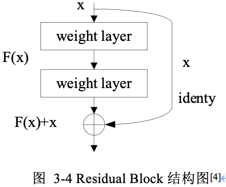
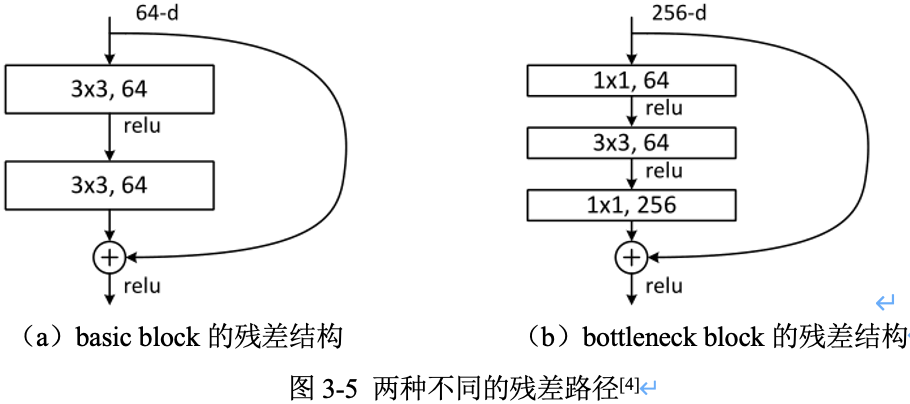
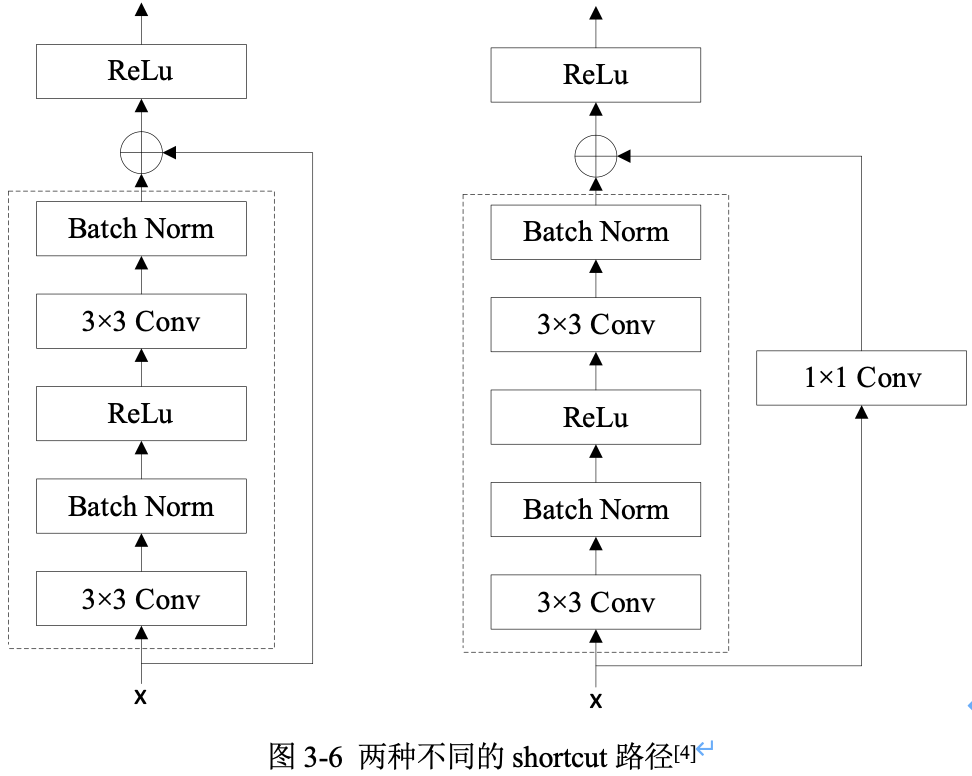
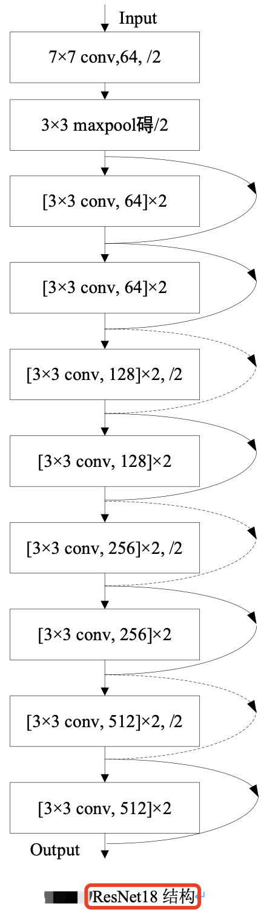
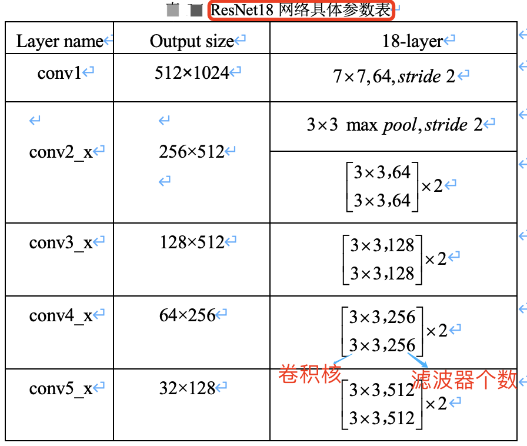

## 摘要

残差网络(`ResNet`)的提出是为了**解决深度神经网络的“退化”（优化）问题**。

有[论文](https://link.zhihu.com/?target=https%3A//arxiv.org/abs/1702.08591)指出，神经网络越来越深的时候，反传回来的梯度之间的相关性会越来越差，最后接近白噪声。即更深的卷积网络会产生梯度消失问题导致网络无法有效训练。

而 `ResNet` 通过设计残差块结构，调整模型结构，让更深的模型能够有效训练更训练。目前 ResNet 被当作目标检测、语义分割等视觉算法框架的主流 backbone。

## 一，残差网络介绍

作者提出认为，假设一个比较浅的卷积网络已经可以达到不错的效果，那么即使新加了很多卷积层什么也不做，模型的效果也不会变差。但，之所以之前的深度网络出现退化问题，是因为让网络层什么都不做恰好是当前神经网络最难解决的问题之一！

因此，作者可以提出**残差网络**的初衷，其实是让模型的内部结构至少有**恒等映射**的能力（什么都不做的能力），这样可以保证叠加更深的卷积层不会因为网络更深而产生退化问题！

### 1.1，残差结构原理

对于 VGG 式的卷积网络中的一个卷积 block，假设 block 的输入为 $x$ ，期望输出为 $H(x)$，block 完成非线性映射功能。

那么，**如何实现恒等映射**呢？

假设卷积 block 的输入为 $x$ ，block 期望输出为 $H(x)$，我们一般第一反应是直接让学习 $H(x) = x$，但是这很难！

对此，作者换了个角度想问题，既然 $H(x) = x$ 很难学习到，那我就将 $H(x)$ 学习成其他的。因此，作者将网络设计为 $H(x) = F(x) + x$，即直接把恒等映射作为网络的一部分。这就把前面的问题转换成了学习一个残差函数 $F(x) = H(x) - x$。

只要 $F(x) = 0$，那不就实现了前面的目的-**恒等映射**: $H(x) = x$。而显然，拟合残差 $F(x)$ 至少比拟合恒等映射容易得多，其通过 $L2$ 正则就可以轻松实现。于是，就有了残差块结构（`resdiual block`）。

综上，一句话总结残差结构原理就是，**与其学习 block 的输出等于输入，不如学习“输出减去输入”**。

基本残差块结构如下图所示: 

从图中可以看出，一个残差块有 $2$ 条路径 $F(x)$ 和 $x$，$F(x)$ 路径拟合**残差** $H(x)-x$，可称为残差路径，$x$ 路径为恒等映射（identity mapping），称其为”shortcut”。图中的 $⊕$ 为逐元素相加（`element-wise addition`），要求参与运算的 $F(x)$ 和 $x$ 的尺寸必须相同！

### 1.2，两种不同的残差路径

在 ResNet 原论文中，残差路径的设计可以分成 $2$ 种，

1. 一种没有 `bottleneck` 结构，如图3-5左所示，称之为“basic block”，由 2 个 $3\times 3$ 卷积层构成。2 层的残差学习单元其两个输出部分必须具有相同的通道数（因为残差等于目标输出减去输入，即 $H(x) - x$，所以输入、输出通道数目需相等)。
2. 另一种有 `bottleneck` 结构，称之为 “bottleneck block”，对于每个残差函数 $F$，使用 $3$ 层堆叠而不是 2 层，3 层分别是 $1\times 1$，$3\times 3$ 和 $1\times 1$ 卷积。其中 $1\times 1$ 卷积层负责先减小然后增加（恢复）维度，使 $3\times 3$ 卷积层的通道数目可以降低下来，降低参数量减少算力瓶颈（这也是起名 bottleneck 的原因 ）。`50` 层以上的残差网络都使用了 bottleneck block 的残差块结构，因为其可以减少计算量和降低训练时间。

> 3 层的残差学习单元是参考了 Inception Net 结构中的 `Network in Network` 方法，在中间 $3\times 3$ 的卷积前后使用 $1\times 1$ 卷积，实现先降低维度再提升维度，从而起到降低模型参数和计算量的作用。

###  1.3，两种不同的 shortcut 路径

`shortcut` 路径大致也分成 $2$ 种，一种是将输入 $x$ 直接输出，另一种则需要经过 $1\times 1$ 卷积来升维或降采样，其是为了将 `shortcut` 输出与 `F(x)` 路径的输出保持形状一致，但是其对网络性能的提升并不明显，两种结构如图3-6所示。

Residual Block（残差块）之间的衔接，在原论文中，$F(x)+x$ 是经过 ReLU 后直接作为下一个 block 的输入 $x$。

## 二，ResNet18 模型结构分析

残差网络中，将堆叠的几层卷积 `layer` 称为残差块（`Residual Block`），多个相似的残差块串联构成 ResNet。ResNet18 和 ResNet34 Backbone用的都是两层的残差学习单元（`basic block`），更深层的ResNet则使用的是三层的残差学习单元（`bottle block`）。

ResNet18 其结构如下图所示。

ResNet18 网络具体参数如下表所示。

假设图像输入尺寸为，$1024\times 2048$，ResNet 共有五个阶段。

1. 其中第一阶段的 `conv1 layer` 为一个 $7\times 7$ 的卷积核，`stride` 为 2，然后经过池化层处理，此时特征图的尺寸已成为输入的`1/4`，即输出尺寸为 $512\times 1024$。
2. 接下来是四个阶段，也就是表格中的四个 `layer`：conv2_x、conv3_x、conv4_x、conv5_x，后面三个都会降低特征图尺寸为原来的 `1/2`，特征图的下采样是通过步长为 `2` 的 conv3_1, conv4_1 和 conv5_1 执行。所以，最后输出的 feature_map 尺寸为输入尺寸降采样 $32 = 4\times 2\times 2\times 2$ 倍。

在工程代码中用 `make_layer` 函数产生四个 `layer` 即对应 ResNet 网络的四个阶段。根据不同层数的 ResNet(N)：

1. 输入给每个 layer 的 `blocks` 是不同的，即每个阶段(`layer`)里面的残差模块数目不同（即 `layers` 列表不同)
2. 采用的 `block` 类型（`basic` 还是 `bottleneck` 版）也不同。

本文介绍的 ResNet18，使用 `basic block`，其残差模块数量（即units数量）是 [2, 2, 2, 2]，又因为每个残差模块中只包含了 2 层卷积，故残差模块总的卷积层数为 (2+2+2+2)*2=16，再加上第一层的卷积和最后一层的分类，总共是 18 层，所以命名为 ResNet18。

> ResNet50 为 [3, 4, 6, 3]。

## 个人思考

看了后续的 `ResNeXt`、`ResNetv2`、`Densenet`、`CSPNet`、`VOVNet` 等论文，越发觉得 `ResNet` 真的算是 `Backone` 领域划时代的工作了，因为它让**深层**神经网络可以训练，基本解决了深层神经网络训练过程中的梯度消失问题，并给出了系统性的解决方案（两种残差结构），即系统性的让网络变得更“深”了。而让网络变得更“宽”的工作，至今也没有一个公认的最佳方案（`Inception`、`ResNeXt` 等后续没有广泛应用），难道是因为网络变得“宽”不如“深”更重要，亦或是我们还没有找到一个更有效的方案。

## 参考资料

1. [Deep Residual Learning for Image Recognition](https://arxiv.org/abs/1512.03385)
2. https://github.com/pytorch/vision/blob/main/torchvision/models/resnet.py