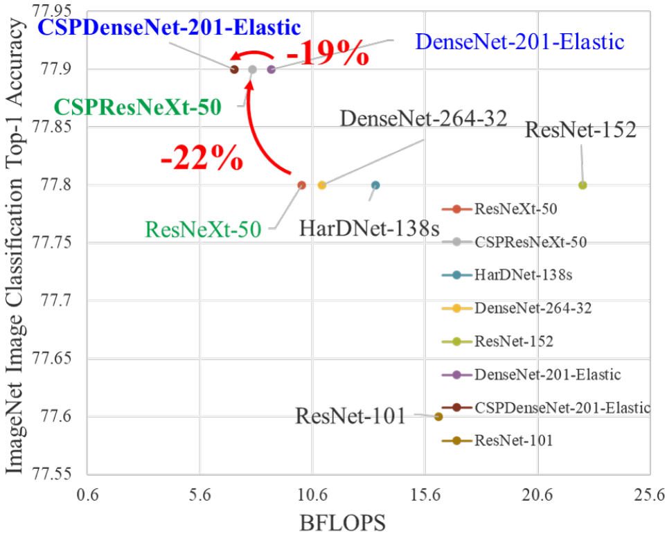
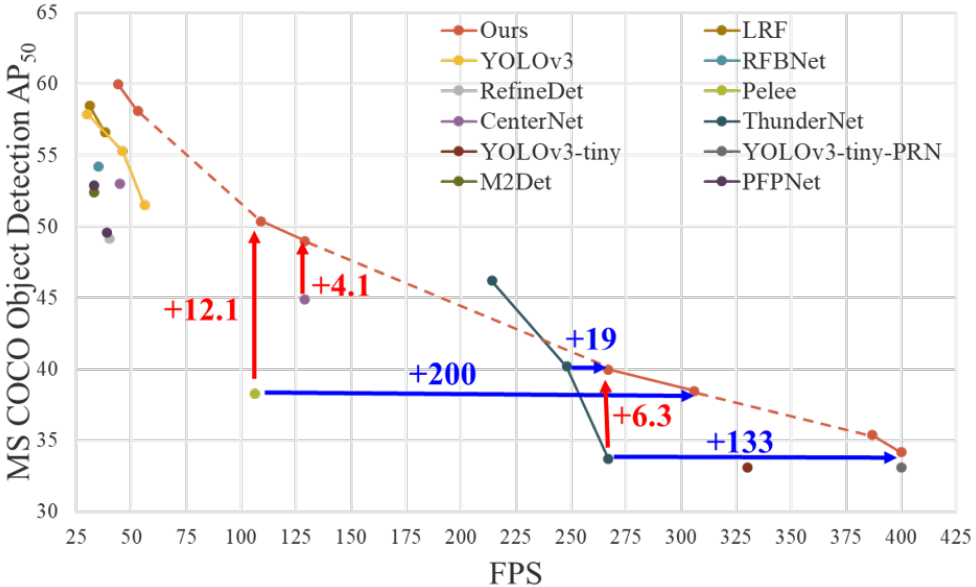
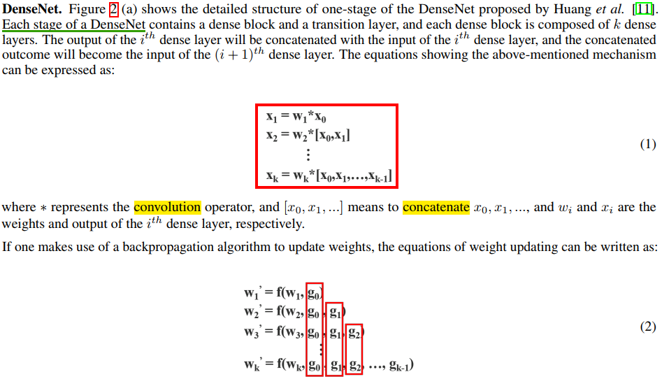
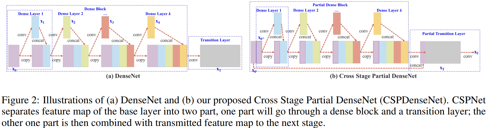
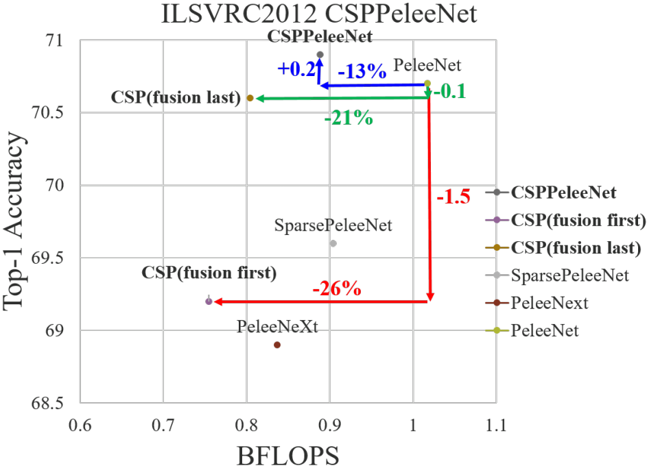
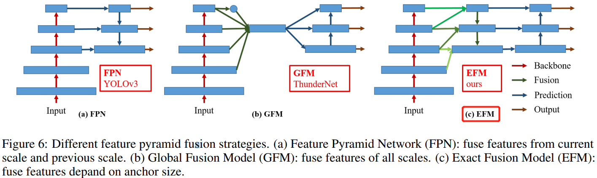
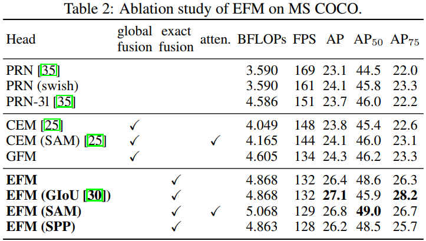

- [摘要](#摘要)
- [1，介绍](#1介绍)
- [2，相关工作](#2相关工作)
- [3，改进方法](#3改进方法)
	- [3.1，Cross Stage Partial Network](#31cross-stage-partial-network)
	- [3.2，Exact Fusion Model](#32exact-fusion-model)
- [4，实验](#4实验)
	- [4.1，实验细节](#41实验细节)
	- [4.2，消融实验](#42消融实验)
	- [4.3，实验总结](#43实验总结)
- [5，结论](#5结论)
- [6，代码解读](#6代码解读)
- [参考资料](#参考资料)

## 摘要
> `CSPNet` 是作者 `Chien-Yao Wang` 于 `2019` 发表的论文 `CSPNET: A NEW BACKBONE THAT CAN ENHANCE LEARNING CAPABILITY OF CNN`。也是对 `DenseNet` 网络推理效率低的改进版本。

作者认为网络推理成本过高的问题是由于**网络优化中的梯度信息重复导致的**。`CSPNet` 通过将梯度的变化从头到尾地集成到特征图中，在减少了计算量的同时可以保证准确率。`CSP`（`Cross Stage Partial Network`，简称 `CSPNet`） 方法可以**减少模型计算量和提高运行速度的同时，还不降低模型的精度**，是一种更高效的网络设计方法，同时还能和`Resnet`、`Densenet`、`Darknet` 等 `backbone` 结合在一起。

## 1，介绍

虽然已经出现了 `MobileNetv1/v2/v3` 和 `ShuffleNetv1/v2` 这种为移动端（CPU）设计的轻量级网络，但是它们所采用的基础技术-深度可分离卷积技术并不适用于 `NPU` 芯片（基于专用集成电路 (ASIC) 的边缘计算系统）。

CSPNet 和不同 backbone 结合后的效果如下图所示。



和目标检测网络结合后的效果如下图所示。



`CSPNet` 提出主要是为了解决三个问题：

1. 增强 CNN 的学习能力，能够在轻量化的同时保持准确性。
2. 降低计算瓶颈和 DenseNet 的梯度信息重复。
3. 降低内存成本。

## 2，相关工作

**CNN 架构的设计**。

**实时目标检测器**。

## 3，改进方法

> 原论文命名为 `Method`，但我觉得叫改进方法更能体现章节内容。

### 3.1，Cross Stage Partial Network

1，**DenseNet**



其中 $f$ 为权值更新函数，$g_i$ 为传播到第 $i$ 个密集层的梯度。从公式 (2) 可以发现，大量的度信息被重用来更新不同密集层的权值，这将导致无差异的密集层反复学习复制的梯度信息。

2，**Cross Stage Partial DenseNet.**

作者提出的 `CSPDenseNet` 的单阶段的架构如图 2(b) 所示。`CSPDenseNet` 的一个阶段是由局部密集块和局部过渡层组成（`a partial dense block and a partial transition layer`）。



总的来说，作者提出的 CSPDenseNet 保留了 DenseNet 重用特征特性的优点，但同时通过**截断梯度流**防止了过多的重复梯度信息。该思想通过设计一种分层的特征融合策略来实现，并应用于局部过渡层（partial transition layer）。

3，**Partial Dense Block.**

设计局部密集块（`partial dense block`）的目的是为了

1. **增加梯度路径**:通过**分块归并**策略，可以使梯度路径的数量增加一倍。由于采用了跨阶段策略，可以减轻使用显式特征图 copy 进行拼接所带来的弊端;
2. **每一层的平衡计算**:通常，DenseNet 基层的通道数远大于生长速率。由于在局部稠密块中，参与密集层操作的基础层通道仅占原始数据的一半，可以有效解决近一半的计算瓶颈;
3. **减少内存流量**: 假设 `DenseNet` 中一个密集块的基本特征图大小为 $w\times h\times c$，增长率为 $d$，共有 $m$ 个密集块。则该密集块的 CIO为 $(c\times m) + ((m^2+m)\times d)/2$，而局部密集块（`partial dense block`）的 `CIO`为 $((c\times m) + (m^2+m)\times d)/2$。虽然$m$ 和 $d$ 通常比 $c$ 小得多，但是一个局部密集的块最多可以节省网络一半的内存流量。

4，**Partial Transition Layer**.

**设计局部过渡层的目的是使梯度组合的差异最大**。局部过渡层是一种层次化的特征融合机制，它利用梯度流的聚合策略来防止不同的层学习重复的梯度信息。在这里，我们设计了两个 `CSPDenseNet` 变体来展示这种梯度流截断是如何影响网络的学习能力的。


Transition layer 的含义和 DenseNet 类似，是一个 1x1 的卷积层（没有再使用 `average pool`）。上图中 `transition layer` 的位置决定了梯度的结构方式，并且各有优势：

- (c) 图 Fusion First 方式，先将两个部分进行 concatenate，然后再进行输入到Transion layer 中，采用这种做法会是的大量特梯度信息被重用，有利于网络学习；
- (d) 图 Fusion Last 的方式，先将部分特征输入 Transition layer，然后再进行concatenate，这样梯度信息将被截断，损失了部分的梯度重用，但是由于 Transition 的输入维度比（c）图少，大大减少了计算复杂度。
- (b) 图中的结构是论文 `CSPNet` 所采用的，其结合了 (c)、(d) 的特点，提升了学习能力的同时也提高了一些计算复杂度。 作者在论文中给出其使用不同 Partial Transition Layer 的实验结果，如下图所示。具体使用哪种结构，我们可以根据条件和使用场景进行调整。



5，**Apply CSPNet to Other Architectures.**

将 `CSP` 应用到 `ResNeXt` 或者 `ResNet` 的残差单元后的结构图如下所示：


### 3.2，Exact Fusion Model

**Aggregate Feature Pyramid.**

提出了 `EFM` 结构能够更好地聚集初始特征金字塔。



## 4，实验

### 4.1，实验细节

略

### 4.2，消融实验

EFM 在 COCO 数据集上的消融实验结果。



### 4.3，实验总结

从实验结果来看，分类问题中，使用 `CSPNet` 可以降低计算量，但是准确率提升很小；在目标检测问题中，使用 `CSPNet` 作为`Backbone` 带来的精度提升比较大，可以有效增强 `CNN` 的学习能力，同时也降低了计算量。

## 5，结论

`CSPNet` 是能够用于移动 `gpu` 或 `cpu` 的轻量级网络架构。

作者认为论文最主要的贡献是**认识到冗余梯度信息问题，及其导致的低效优化和昂贵的推理计算**。同时也提出了**利用跨阶段特征融合策略和截断梯度流**来增强不同层间学习特征的可变性。

此外，还提出了一种 `EFM` 结构，它结合了 `Maxout` 操作来压缩从特征金字塔生成的特征映射，这大大降低了所需的内存带宽，因此推理的效率足以与边缘计算设备兼容。

实验结果表明，本文提出的基于 `EFM` 的 `CSPNet` 在移动`GPU` 和 `CPU` 的实时目标检测任务的准确性和推理率方面明显优于竞争对手。

## 6，代码解读

1，Partial Dense Block 的实现，代码可以直接在 Dense Block 代码的基础上稍加修改即可，代码参考 [这里]()。简单的 Dense Block 代码如下：

```python
class conv2d_bn_relu(nn.Module):
    """
    BN_RELU_CONV, 
    """

    def __init__(self, in_channels: object, out_channels: object, kernel_size: object, stride: object, padding: object,
                 dilation=1, groups=1, bias=False) -> object:
        super(BN_Conv2d, self).__init__()
        layers = [nn.Conv2d(in_channels, out_channels, kernel_size=kernel_size, stride=stride, 
		padding=padding, dilation=dilation, groups=groups, bias=bias),
				nn.BatchNorm2d(in_channels),
				nn.ReLU(inplace=False)]

        self.seq = nn.Sequential(*layers)

    def forward(self, x):
        return self.seq(x)

class bn_relu_conv2d(nn.Module):
    """
    BN_RELU_CONV, 
    """

    def __init__(self, in_channels: object, out_channels: object, kernel_size: object, stride: object, padding: object,
                 dilation=1, groups=1, bias=False) -> object:
        super(BN_Conv2d, self).__init__()
        layers = [nn.BatchNorm2d(in_channels),
				  nn.ReLU(inplace=False),
				  nn.Conv2d(in_channels, out_channels, kernel_size=kernel_size, stride=stride,
                            padding=padding, dilation=dilation, groups=groups, bias=bias)]

        self.seq = nn.Sequential(*layers)

    def forward(self, x):
        return self.seq(x)

class DenseBlock(nn.Module):

    def __init__(self, input_channels, num_layers, growth_rate):
        super(DenseBlock, self).__init__()
        self.num_layers = num_layers
        self.k0 = input_channels
        self.k = growth_rate
        self.layers = self.__make_layers()

    def __make_layers(self):
        layer_list = []
        for i in range(self.num_layers):
            layer_list.append(nn.Sequential(
                bn_relu_conv2d(self.k0 + i * self.k, 4 * self.k, 1, 1, 0),
                bn_relu_conv2d(4 * self.k, self.k, 3, 1, 1)
            ))
        return layer_list

    def forward(self, x):
        feature = self.layers[0](x)
        out = torch.cat((x, feature), 1)
        for i in range(1, len(self.layers)):
            feature = self.layers[i](out)
            out = torch.cat((feature, out), 1)
        return out
		
# Partial Dense Block 的实现：
class CSP_DenseBlock(nn.Module):

    def __init__(self, in_channels, num_layers, k, part_ratio=0.5):
        super(CSP_DenseBlock, self).__init__()
        self.part1_chnls = int(in_channels * part_ratio)
        self.part2_chnls = in_channels - self.part1_chnls
        self.dense = DenseBlock(self.part2_chnls, num_layers, k)
        trans_chnls = self.part2_chnls + k * num_layers
        self.transtion = conv2d_bn_relu(trans_chnls, trans_chnls, 1, 1, 0)

    def forward(self, x):
        part1 = x[:, :self.part1_chnls, :, :]
        part2 = x[:, self.part1_chnls:, :, :]
        part2 = self.dense(part2)  # 也可以是残差块单元
        part2 = self.transtion(part2)  # Fusion lirst
        out = torch.cat((part1, part2), 1)
        return out
```

## 参考资料

- [增强CNN学习能力的Backbone:CSPNet](https://www.cnblogs.com/pprp/p/12566116.html)
- [CSPNet——PyTorch实现CSPDenseNet和CSPResNeXt](https://zhuanlan.zhihu.com/p/263555330)