## 目录
- [1、相关工作](#1相关工作)
  - [标准卷积](#标准卷积)
  - [分组卷积](#分组卷积)
  - [从 Inception module 到 depthwise separable convolutions](#从-inception-module-到-depthwise-separable-convolutions)
- [2、MobileNets 结构](#2mobilenets-结构)
  - [2.1，深度可分离卷积](#21深度可分离卷积)
    - [Depthwise 卷积](#depthwise-卷积)
    - [Pointwise 卷积](#pointwise-卷积)
  - [2.2、网络结构](#22网络结构)
  - [2.3、宽度乘系数-更小的模型](#23宽度乘系数-更小的模型)
  - [2.4、分辨率乘系数-减少表示](#24分辨率乘系数-减少表示)
  - [2.5、模型结构总结](#25模型结构总结)
- [3、实验](#3实验)
- [4、结论](#4结论)
- [5、基准模型代码](#5基准模型代码)
- [参考资料](#参考资料)

> `MobileNet` 论文的主要贡献在于提出了一种**深度可分离卷积架构（DW+PW 卷积）**，先通过理论证明这种架构比常规的卷积计算成本（`Mult-Adds`）更小，然后通过分类、检测等多种实验证明模型的有效性。

## 1、相关工作

### 标准卷积

一个大小为 $h_1\times w_1$ 过滤器（`2` 维卷积核），沿着 `feature map` 的左上角移动到右下角，过滤器每移动一次，将过滤器参数矩阵和对应特征图 $h_1 \times w_1 \times c_1$ 大小的区域内的像素点相乘后累加得到一个值，又因为 `feature map` 的数量（通道数）为 $c_1$，所以我们需要一个 `shape` 为 $ (c_1, h_1, w_1)$ 的滤波器（ `3` 维卷积核），将每个输入 featue map 对应输出像素点位置计算和的值相加，即得到输出 feature map 对应像素点的值。又因为输出 `feature map` 的数量为 $c_2$ 个，所以需要 $c_2$ 个滤波器。标准卷积抽象过程如下图所示。

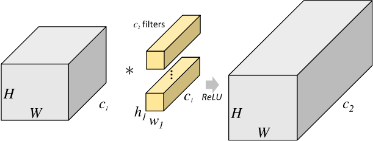

`2D` 卷积计算过程动态图如下，通过这张图能够更直观理解卷积核如何执行滑窗操作，又如何相加并输出 $c_2$ 个  `feature map` ，动态图来源 [这里](https://blog.csdn.net/v_july_v/article/details/51812459?utm_source=copy)。


### 分组卷积

`Group Convolution` 分组卷积，最早见于 `AlexNet`。常规卷积与分组卷积的输入 feature map 与输出 feature map 的连接方式如下图所示，图片来自[CondenseNet](https://www.researchgate.net/figure/The-transformations-within-a-layer-in-DenseNets-left-and-CondenseNets-at-training-time_fig2_321325862)。

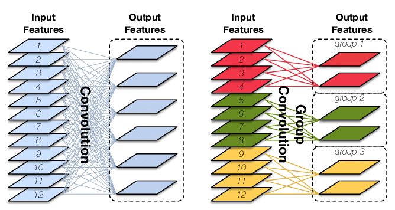

**分组卷积的定义**：对输入 `feature map` 进行分组，然后分组分别进行卷积。假设输入 feature map 的尺寸为 $H \times W \times c_{1}$，输出 feature map 数量为 $c_2$ 个，如果将输入 feature map 按通道分为 $g$ 组，则每组特征图的尺寸为 $H \times W \times \frac{c_1}{g}$，**每组**对应的滤波器（卷积核）的 尺寸 为 $h_{1} \times w_{1} \times \frac{c_{1}}{g}$，每组的滤波器数量为  $\frac{c_{2}}{g}$ 个，滤波器总数依然为 $c_2$ 个，即分组卷积的卷积核 `shape` 为 $(c_2,\frac{c_1}{g}, h_1,w_1)$。每组的滤波器只与其同组的输入 map 进行卷积，每组输出特征图尺寸为 $H \times W \times \frac{c_{2}}{g}$，将 $g$ 组卷积后的结果进行拼接 (`concatenate`) 得到最终的得到最终尺寸为 $H \times W \times c_2$ 的输出特征图，其分组卷积过程如下图所示：


**分组卷积的意义：**分组卷积是现在网络结构设计的核心，它通过通道之间的**稀疏连接**（也就是只和同一个组内的特征连接）来降低计算复杂度。一方面，它允许我们使用更多的通道数来增加网络容量进而提升准确率，但另一方面随着通道数的增多也对带来更多的 $MAC$。针对 $1 \times 1$ 的分组卷积，$MAC$ 和 $FLOPs$ 计算如下：

$$
\begin{align*}
& MACC = H \times W \times 1 \times 1 \times \frac{c_{1}}{g}\frac{c_{2}}{g} \times g = \frac{hwc_{1}c_{2}}{g} \\\\
& FLOPs = 2 \times MACC \\\\
& Params = g \times \frac{c_2}{g}\times\frac{c_1}{g} \times 1\times 1 + c_2 = \frac{c_{1}c_{2}}{g} \\\\
& MAC = HW(c_1 + c_2) + \frac{c_{1}c_{2}}{g} \\\\
\end{align*}$$

从以上公式可以得出分组卷积的参数量和计算量是标准卷积的 $\frac{1}{g}$ 的结论 ，但其实对分组卷积过程进行深入理解之后也可以直接得出以上结论。

**分组卷积的深入理解**：对于 $1\times 1$ 卷积，常规卷积输出的特征图上，每一个像素点是由输入特征图的 $c_1$ 个点计算得到，而分组卷积输出的特征图上，每一个像素点是由输入特征图的 $ \frac{c_1}{g}$个点得到（参考常规卷积计算过程）。**卷积运算过程是线性的，自然，分组卷积的参数量和计算量是标准卷积的 $\frac{1}{g}$ 了**。

当分组卷积的分组数量 = 输入 feature map 数量 = 输出 feature map 数量，即 $g=c_1=c_2$，有 $c_1$ 个滤波器，且每个滤波器尺寸为 $1 \times K \times K$ 时，Group Convolution 就成了 Depthwise Convolution（DW 卷积），**`DW` 卷积的卷积核权重尺寸为** $(c_{1}, 1, K, K)$。
> 常规卷积的卷积核权重 shape 都为（`C_out, C_in, kernel_height, kernel_width`），分组卷积的卷积核权重 `shape` 为（`C_out, C_in/g, kernel_height, kernel_width`），`DW` 卷积的卷积核权重 `shape` 为（`C_in, 1, kernel_height, kernel_width`）。

### 从 Inception module 到 depthwise separable convolutions

深度可分离卷积（depthwise separable convolutions）的提出最早来源于 `Xception` 论文，Xception 的论文中提到，对于卷积来说，卷积核可以看做一个三维的滤波器：通道维+空间维（Feature Map 的宽和高），常规的卷积操作其实就是实现通道相关性和空间相关性的**联合映射**。**Inception 模块的背后存在这样的一种假设：卷积层通道间的相关性和空间相关性是可以退耦合（完全可分）的，将它们分开映射，能达到更好的效果**（the fundamental hypothesis behind Inception is that cross-channel correlations and spatial correlations are sufficiently decoupled that it is preferable not to map them jointly.）。

引入**深度可分离卷积的 Inception，称之为 Xception**，其作为 Inception v3 的改进版，在 ImageNet 和 JFT 数据集上有一定的性能提升，但是参数量和速度并没有太大的变化，因为 Xception 的目的也不在于模型的压缩。深度可分离卷积的 Inception 模块如图  Figure 4 所示。

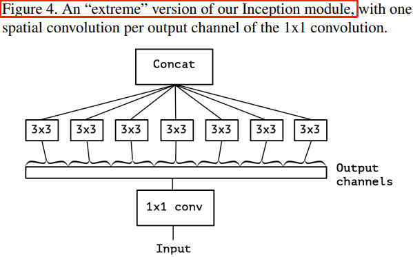

Figure 4 中的“极限” Inception 模块与本文的主角-深度可分离卷积模块相似，区别在于：深度可分离卷积先进行 `channel-wise` 的空间卷积，再进行 $1 \times 1$ 的通道卷积，Figure 4 的 Inception 则相反；

## 2、MobileNets 结构

### 2.1，深度可分离卷积

`MobileNets` 是谷歌 2017 年提出的一种高效的移动端轻量化网络，其核心是深度可分离卷积（`depthwise separable convolutions`），深度可分离卷积的核心思想是将一个完整的卷积运算分解为两步进行，分别为 Depthwise Convolution（`DW` 卷积） 与 Pointwise Convolution（`PW` 卷积）。深度可分离卷积的计算步骤和滤波器尺寸如下所示。

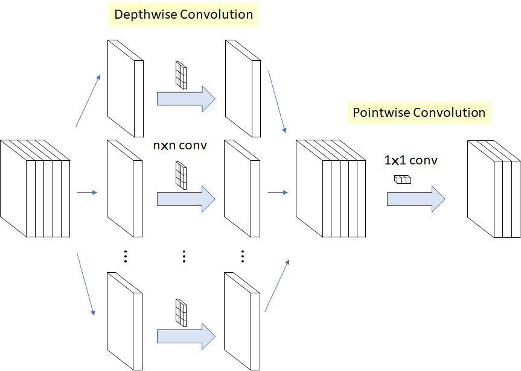

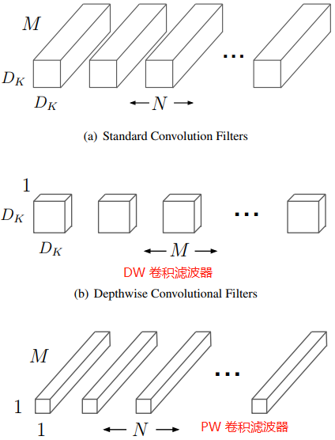

#### Depthwise 卷积

> 注意本文 DW 和 PW 卷积计算量的计算与论文有所区别，本文的输出 Feature map 大小是 $D_G \times D_G$， 论文公式是$D_F \times D_F$。

不同于常规卷积操作， Depthwise Convolution 的一个卷积核只负责一个通道，**一个通道只能被一个卷积核卷积**（不同的通道采用不同的卷积核卷积），也就是输入通道、输出通道和分组数相同的特殊分组卷积，因此 Depthwise（`DW`）卷积不会改变输入特征图的通道数目。深度可分离卷积的 `DW`卷积步骤如下图：

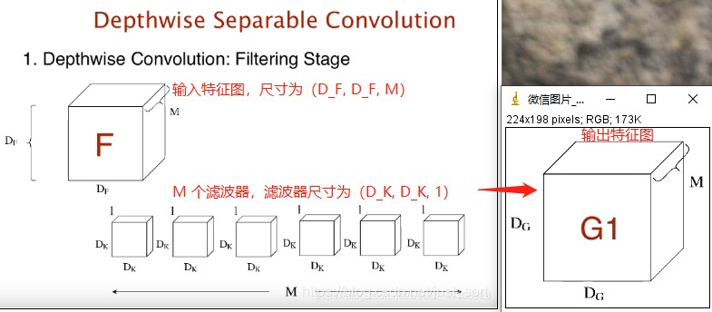

`DW` 卷积的计算量 $MACC  = M \times D_{G}^{2} \times D_{K}^{2}$

#### Pointwise 卷积

上述 Depthwise 卷积的问题在于它让每个卷积核单独对一个通道进行计算，但是各个通道的信息没有达到交换，从而在网络后续信息流动中会损失通道之间的信息，因此论文中就加入了 Pointwise 卷积操作，来进一步融合通道之间的信息。PW 卷积是一种特殊的常规卷积，卷积核的尺寸为 $1 \times 1$。`PW` 卷积的过程如下图：

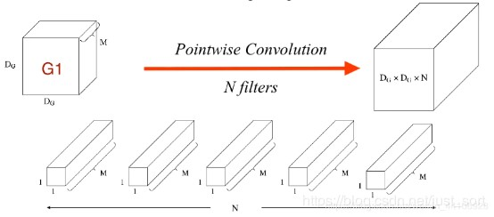

假设输入特征图大小为 $D_{G} \times D_{G} \times M$，输出特征图大小为 $D_{G} \times D_{G} \times N$，则滤波器尺寸为 $1 \times 1 \times M$，且一共有 $N$ 个滤波器。因此可计算得到 `PW` 卷积的计算量 $MACC = N \times M \times D_{G}^{2}$。

综上：`Depthwise` 和 `Pointwise` 卷积这两部分的计算量相加为 $MACC1 =  M \times D_{G}^{2} \times D_{K}^{2} + N \times M \times D_{G}^{2}$，而标准卷积的计算量 $MACC2 = N \times D_{G}^{2} \times D_{K}^{2} \times M$。所以深度可分离卷积计算量于标准卷积计算量比值的计算公式如下。

$$
\begin{align*}
\frac{Depthwise \ Separable \ Conv}{Standard \ Conv} &= \frac{M \times D_{G}^{2}(D_{K}^{2} + N)}{N \times D_{G}^{2} \times D_{K}^{2} \times M} \\\\
&= \frac{D_{K}^{2} + N}{D_{K}^{2} \times N} \\\\
&= \frac{1}{N} + \frac{1}{D_{K}^{2}} \\\\
\end{align*}
$$ 

可以看到 `Depthwise + Pointwise` 卷积的**计算量**相较于标准卷积近乎减少了 $N$ 倍，$N$ 为输出特征图的通道数目，同理**参数量**也会减少很多。在达到相同目的（即对相邻元素以及通道之间信息进行计算）下， 深度可分离卷积能极大减少卷积计算量，因此大量移动端网络的 `backbone` 都采用了这种卷积结构，再加上模型蒸馏，剪枝，能让移动端更高效的推理。
> 深度可分离卷积的详细计算过程可参考 [Depthwise卷积与Pointwise卷积](https://zhuanlan.zhihu.com/p/80041030)。

### 2.2、网络结构

$3 \times 3$ 的深度可分离卷积 `Block` 结构如下图所示：

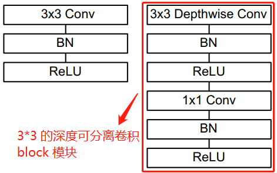

左边是带 `bn` 和 `relu` 的标准卷积层，右边是带 bn 和 relu 的深度可分离卷积层。
$3 \times 3$ 的深度可分离卷积 `Block` 网络的 pytorch 代码如下：

```python
class MobilnetV1Block(nn.Module):
    """Depthwise conv + Pointwise conv"""
    def __init__(self, in_channels, out_channels, stride=1):
        super(MobilnetV1Block, self).__init__()
        # dw conv kernel shape is (in_channels, 1, ksize, ksize)
        self.dw = nn.Conv2d(in_channels, in_channels, kernel_size=3,stride=stride,padding=1, groups=in_channels, bias=False)
        self.bn1 = nn.BatchNorm2d(in_channels)
        self.pw = nn.Conv2d(in_channels, out_channels, kernel_size=1, stride=1, padding=0, bias=False)
        self.bn2 = nn.BatchNorm2d(out_channels)
    
    def forward(self, x):
        out1 = F.relu(self.bn1(self.dw(x)))
        out2 = F.relu(self.bn2(self.pw(out1)))
        return out2
```

`MobileNet v1` 的 `pytorch` 模型导出为 `onnx` 模型后，`深度可分离卷积 block` 结构图如下图所示。

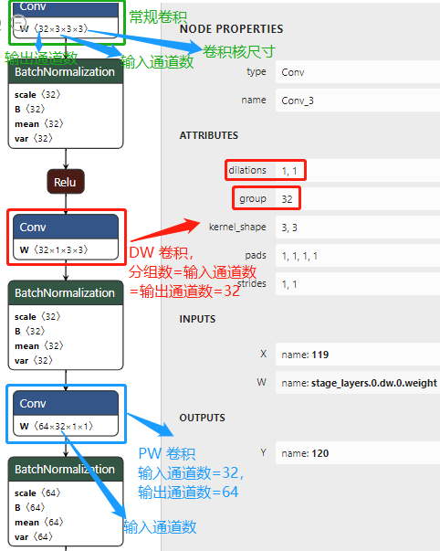

仅用 MobileNets 的 `Mult-Adds`（乘加操作）次数更少来定义高性能网络是不够的，确保这些操作能够有效实施也很重要。例如非结构化稀疏矩阵运算（unstructured sparse matrix operations）通常并不会比密集矩阵运算（dense matrix operations）快，除非是非常高的稀疏度。
> 这句话是不是和 `shufflenet v2` 的观点一致，即不能仅仅以 FLOPs 计算量来表现网络的运行速度，除非是同一种网络架构。

MobileNet 模型结构将几乎所有计算都放入密集的 1×1 卷积中（dense 1 × 1 convolutions），卷积计算可以通过高度优化的通用矩阵乘法（`GEMM`）函数来实现。 卷积通常由 `GEMM` 实现，但需要在内存中进行名为 `im2col` 的初始重新排序，然后才映射到 `GEMM`。 caffe 框架就是使用这种方法实现卷积计算。 `1×1` 卷积不需要在内存中进行重新排序，可以直接使用 `GEMM`（最优化的数值线性代数算法之一）来实现。

如表 2 所示，MobileNet 模型的 `1x1` 卷积占据了 `95%` 的计算量和 `75%` 的参数，剩下的参数几乎都在全连接层中， 3x3 的 DW 卷积核常规卷积占据了很少的计算量（Mult-Adds）和参数。

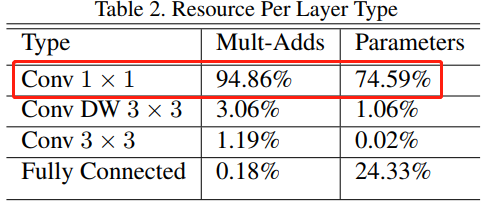

### 2.3、宽度乘系数-更小的模型

尽管基本的 `MobileNet` 体系结构已经很小且网络延迟 `latency` 很低，但很多情况下特定用例或应用可能要求模型变得更小，更快。为了构建这些更小且计算成本更低的模型，我们引入了一个非常简单的参数 $\alpha$，称为 `width 乘数`。**宽度乘数** $\alpha$ 的作用是使每一层的网络均匀变薄。对于给定的层和宽度乘数 $\alpha$，输入通道的数量变为 $\alpha M$，而输出通道的数量 $N$ 变为 $\alpha N$。具有宽度乘数 $\alpha$ 的深度可分离卷积（其它参数和上文一致）的计算成本为：

$$\alpha M \times D_{G}^{2} \times D_{K}^{2} + \alpha N \times \alpha M \times D_{G}^{2}$$

其中 $\alpha \in (0,1]$，典型值设置为 `1、0.75、0.5` 和 `0.25`。$\alpha = 1$ 是基准 MobileNet 模型，$\alpha < 1$ 是缩小版的 `MobileNets`。**宽度乘数的作用是将计算量和参数数量大约减少 $\alpha^2$ 倍，从而降低了网络计算成本（ computational cost of a neural network）**。 宽度乘数可以应用于任何模型结构，以定义新的较小模型，**且具有合理的准确性、网络延迟 `latency` 和模型大小之间的权衡**。 它用于定义新的精简结构，需要从头开始进行训练模型。基准 `MobileNet` 模型的整体结构定义如表 1 所示。

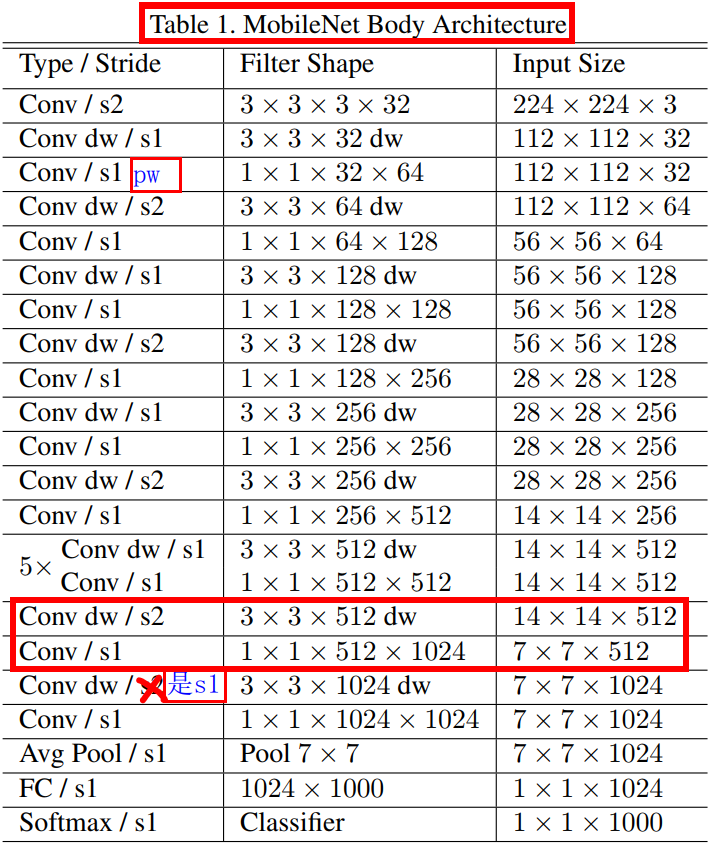

### 2.4、分辨率乘系数-减少表示

减少模型计算成本的的第二个超参数（hyper-parameter）是**分辨率因子** $\rho$，论文将其应用于输入图像，则网络的每一层 feature map 大小也要乘以 $\rho$。实际上，论文通过设置输入分辨率来隐式设置 $\rho$。
将网络核心层的计算成本表示为具有宽度乘数 $\alpha$ 和分辨率乘数 $\rho$ 的深度可分离卷积的公式如下：
$$\alpha M \times \rho D_{G}^{2} \times D_{K}^{2} + \alpha N \times \alpha M \times \rho D_{G}^{2}$$
其中 $\rho \in (0,1]$，通常是隐式设置的，因此网络的输入分辨率为 `224、192、160` 或 `128`。$\rho = 1$ 时是基准(`baseline`) MobilNet，$\rho < 1$ 时缩小版 `MobileNets`。**分辨率乘数的作用是将计算量减少 $\rho^2$**。

### 2.5、模型结构总结

+ 整个网络不算平均池化层与 `softmax` 层，且将 `DW` 卷积和 `PW` 卷积计为单独的一层，则 `MobileNet` 有 `28` 层网络。+ 在整个网络结构中步长为2的卷积较有特点，卷积的同时充当下采样的功能；
+ 第一层之后的 `26` 层都为深度可分离卷积的重复卷积操作，分为 `4` 个卷积 `stage`；
+ 每一个卷积层（含常规卷积、深度卷积、逐点卷积）之后都紧跟着批规范化和 `ReLU` 激活函数；
+ 最后一层全连接层不使用激活函数。

## 3、实验

作者分别进行了 Stanford Dogs dataset 数据集上的细粒度识别、大规模地理分类、人脸属性分类、COCO 数据集上目标检测的实验，来证明与 `Inception V3`、`GoogleNet`、`VGG16` 等 `backbone` 相比，`MobilNets` 模型可以在计算量（`Mult-Adds`）数 10 被下降的情况下，但是精度却几乎不变。

## 4、结论

论文提出了一种**基于深度可分离卷积的新模型架构**，称为 `MobileNets`。 在相关工作章节中，作者首先调查了一些让模型更有效的重要设计原则，然后，演示了如何通过宽度乘数和分辨率乘数来构建更小，更快的 MobileNet，通过权衡合理的精度以减少模型大小和延迟。 然后，我们将不同的 `MobileNets` 与流行的模型进行了比较，这些模型展示了出色的尺寸，速度和准确性特性。 最后，论文演示了 MobileNet 在应用于各种任务时的有效性。

## 5、基准模型代码

自己复现的基准 MobileNet v1 代模型 pytorch 代码如下：

```python
import torch
import torch.nn as nn
import torch.nn.functional as F
import torchvision.models as models
from torch import flatten

class MobilnetV1Block(nn.Module):
    """Depthwise conv + Pointwise conv"""

    def __init__(self, in_channels, out_channels, stride=1):
        super(MobilnetV1Block, self).__init__()
        # dw conv kernel shape is (in_channels, 1, ksize, ksize)
        self.dw = nn.Sequential(
            nn.Conv2d(in_channels, 64, kernel_size=3,
                      stride=stride, padding=1, groups=4, bias=False),
            nn.BatchNorm2d(in_channels),
            nn.ReLU(inplace=True)
        )
        # print(self.dw[0].weight.shape)  # print dw conv kernel shape
        self.pw = nn.Sequential(
            nn.Conv2d(in_channels, out_channels, kernel_size=1,
                      stride=1, padding=0, bias=False),
            nn.BatchNorm2d(out_channels),
            nn.ReLU(inplace=True)
        )

    def forward(self, x):
        x = self.dw(x)
        x = self.pw(x)
        return x


def convbn_relu(in_channels, out_channels, stride=2):
    return nn.Sequential(nn.Conv2d(in_channels, out_channels, kernel_size=3, stride=stride,
                                   padding=1, bias=False),
                         nn.BatchNorm2d(out_channels),
                         nn.ReLU(inplace=True))


class MobileNetV1(nn.Module):
    # (32, 64, 1) means MobilnetV1Block in_channnels is 32, out_channels is 64, no change in map size.
    stage_cfg = [(32, 64, 1), 
           (64, 128, 2), (128, 128, 1),     # stage1 conv
           (128, 256, 2), (256, 256, 1),    # stage2 conv
           (256, 512, 2), (512, 512, 1), (512, 512, 1), (512, 512, 1), (512, 512, 1), (512, 512, 1), # stage3 conv
           (512, 1024, 2), (1024, 1024, 1)  # stage4 conv
    ]
    def __init__(self, num_classes=1000):
        super(MobileNetV1, self).__init__()
        self.first_conv = convbn_relu(3, 32, 2)  # Input image size reduced by half
        self.stage_layers = self._make_layers(in_channels=32)
        self.linear = nn.Linear(1024, num_classes)  # 全连接层

    def _make_layers(self, in_channels):
        layers = []
        for x in self.stage_cfg:
            in_channels = x[0]
            out_channels = x[1]
            stride = x[2]
            layers.append(MobilnetV1Block(in_channels, out_channels, stride))
            in_channels = out_channels
        return nn.Sequential(*layers)

    def forward(self, x):
        """Feature map shape(h、w) is 224 -> 112 -> 56 -> 28 -> 14 -> 7 -> 1"""
        x = self.first_conv(x)
        x = self.stage_layers(x)

        x = F.avg_pool2d(x, 7)  # x shape is 7*7
        x = flatten(x, 1)       # x = x.view(x.size(0), -1)
        x = self.linear(x)

        return x


if __name__ == "__main__":
    model = MobileNetV1()
    model.eval()                  # set the model to inference mode
    input_data = torch.rand(1, 3, 224, 224)
    outputs = model(input_data)
    print("Model output size is", outputs.size())
```

程序运行结果如下：
> Model output size is torch.Size([1, 1000])

## 参考资料

1. [Group Convolution分组卷积，以及Depthwise Convolution和Global Depthwise Convolution](https://www.cnblogs.com/shine-lee/p/10243114.html)
2. [理解分组卷积和深度可分离卷积如何降低参数量](https://zhuanlan.zhihu.com/p/65377955)
3. [深度可分离卷积（Xception 与 MobileNet 的点滴）](https://www.jianshu.com/p/38dc74d12fcf)
4. [MobileNetV1代码实现](https://www.cnblogs.com/linzzz98/articles/13453810.html)
5. [Depthwise卷积与Pointwise卷积](https://zhuanlan.zhihu.com/p/80041030)
6. [【CNN结构设计】深入理解深度可分离卷积](https://mp.weixin.qq.com/s/IZ-nbrCL8-9w32RSYeP_bg)