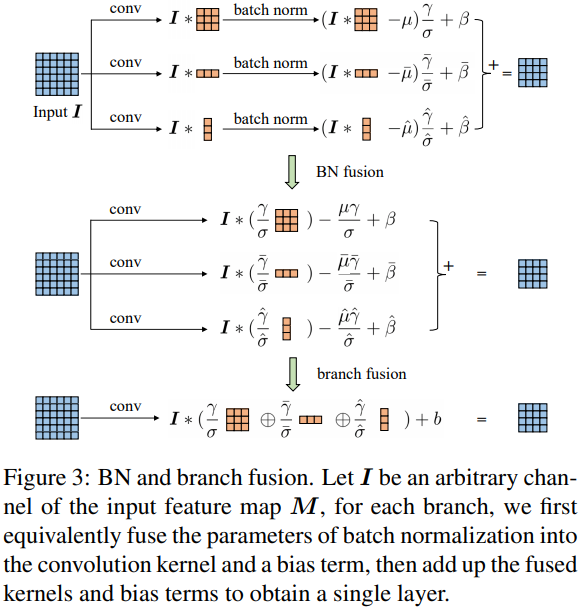
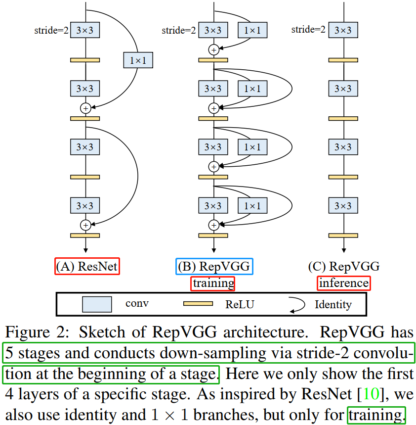
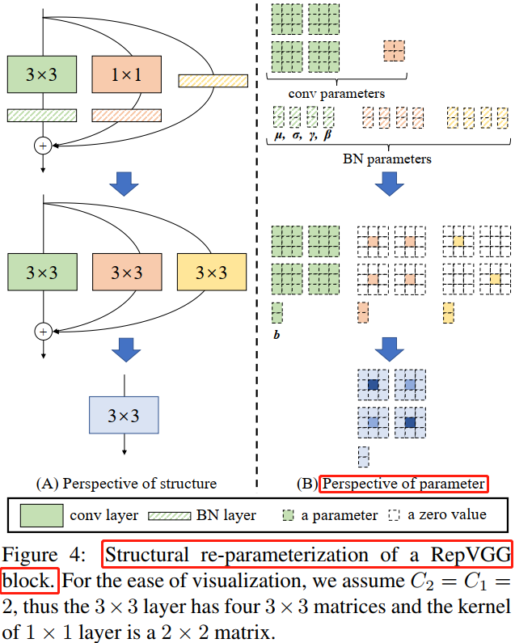

# RepVGG 论文详解

> RepVGG 是截止到 2021.2.9 日为止最新的一个轻量级网络架构。在我的测试中，其在安霸 `CV22` 上的加速效果不如 `ShuffleNet v2`。根据作者的描述，`RepVGG` 是为 `GPU` 和专用硬件设计的高效模型，追求高速度、省内存，较少关注参数量和理论计算量。在低算力设备上，可能不如 `MobileNet` 和 `ShuffleNet` 系列适用。

## 背景知识

### VGG 和 ResNet 回顾

1，`VGGNet` 拥有 `5` 段卷积 ，每一段内 `2~3` 个卷积层，同时每段尾部会连接一个最大池化层来缩小 `Feature map` 尺寸。每段内的卷积核数量一样，越靠后的卷积核数量越多，64-128-256-512-512。VGG16 每段卷积对应的卷积层数量为 `2-2-3-3-3`，`5` 段卷积的总层数为 $2+2+3+3+3 = 13$，再加上最后的三个全连接分类层，总共是 `16` 层网络，所以命令为 VGG16。`5` 段卷积的卷积核数量依次呈 `2` 倍递增关系，64-128-256-512-512；

2，`ResNet18` 也拥有 `5` 段卷积，由 1 个单独的 $7 \times 7$ 卷积层和工程代码中用 `make_layer` 函数产生的四个 layer（四段卷积）组成，每个 layer 的基础残差模块（basic block）数量（即 units 数量）为 2，因为 `basic block` 中只包含了 `2` 层卷积，故所有残差模块的总层数为 $(2+2+2+2)*2=16$，再加上第一层的卷积和最后一层的分类，总共是 18 层，所以命名为 ResNet18。5 段卷积的卷积核数量也依次呈 `2` 倍递增关系，64-64-128-256-512。

**总结：小卷积核代替大卷积核，分段卷积，卷积核数量逐段呈 `2` 倍递增，`Feature Map` 尺寸逐段呈 `1/2` 倍递减**。

### MAC 计算

`MAC`(memory access cost)  内存访问次数也叫内存使用量，`CNN` 网络中每个网络层 `MAC` 的计算分为读输入 `feature map` 大小、权重大小（`DDR` 读）和写输出 `feature map` 大小（`DDR` 写）三部分。
以卷积层为例计算 `MAC`，可假设某个卷积层输入 feature map 大小是 (`Cin, Hin, Win`)，输出 feature map 大小是 (`Hout, Wout, Cout`)，卷积核是 (`Cout, Cin, K, K`)，理论 MAC（理论 MAC 一般小于 实际 MAC）计算公式如下：
> `feature map` 大小一般表示为 （`N, C, H, W`），`MAC` 指标一般用在端侧模型推理中，端侧模型推理模式一般都是单帧图像进行推理，即 `N = 1(batch_size = 1)`，不同于模型训练时的 `batch_size` 大小一般大于 1。

```python
input = Hin x Win x Cin  # 输入 feature map 大小
output = Hout x Wout x Cout  # 输出 feature map 大小
weights = K x K x Cin x Cout + bias   # bias 是卷积层偏置
ddr_read = input +  weights
ddr_write = output
MAC = ddr_read + ddr_write
```

### ACNet 理解

学习 [ACNet](https://arxiv.org/pdf/1908.03930.pdf) 之前，首先得理解一个关于卷积计算的恒等式，下面等式表达的意思就是对于输入特征图 $I$，先进行 $K^{(1)}$ 和 $I$ 卷积、$K^{(2)}$ 和 $I$ 卷积，再对结果进行相加，与先进行 $K^{(1)}$ 和 $K^{(2)}$ 的逐点相加后再和 $I$ 进行卷积得到的结果是一致的，这是 `ACNet` 在**推理阶段不增加任何计算量的理论基础**，训练阶段计算量增加，训练时间更长，需要的显存更大。

$$I \ast K^{(1)} + I \ast K^{(2)} = I \ast (K^{(1)} \oplus K^{(2)})$$

`ACNet` 的创新分为训练和推理阶段：

+ **训练阶段**：将现有网络中的每一个 $3 \times 3$ 卷积层换成 $3 \times 1$ 卷积 + $1 \times 3$卷积 + $3 \times 3$ 卷积共三个卷积层，并将三个卷积层的计算结果进行相加得到最终卷积层的输出。因为这个过程引入的  $1 \times 3$ 卷积和 $3 \times 1$ 卷积是非对称的，所以将其命名为 `Asymmetric Convolution`。论文中有实验证（见论文 `Table 4`）明引入 $1 \times 3$ 这样的水平卷积核可以提升模型对图像上下翻转的鲁棒性，竖直方向的 $3 \times 1$ 卷积核同理。
+ **推理阶段**：主要是对三个卷积核进行融合，这部分在实现过程中就是使用融合后的卷积核参数来初始化现有的网络。

推理阶段的卷积融合操作是和 `BN` 层一起的，融合操作发生在 `BN` 之后，论文实验证明融合在 `BN` 之后效果更好些。推理阶段卷积层融合操作示意图如下所示（BN 操作省略了 $\varepsilon$）：



#### ACNet 的 Pytorch 代码实现

作者开源了[代码](https://github.com/DingXiaoH/ACNet/blob/master/custom_layers/crop_layer.py)，将原始 $3\times 3$ 卷积替换成 $3 \times 3 + 3 \times 1 + 1 \times3$ 卷积的训练阶段基础结构 `ACBlock` 代码如下：

```python
import torch.nn as nn

class CropLayer(nn.Module):
    """# 去掉因为 3x3 卷积的 padding 多出来的行或者列
    """
    # E.g., (-1, 0) means this layer should crop the first and last rows of the feature map. And (0, -1) crops the first and last columns
    def __init__(self, crop_set):
        super(CropLayer, self).__init__()
        self.rows_to_crop = - crop_set[0]
        self.cols_to_crop = - crop_set[1]
        assert self.rows_to_crop >= 0
        assert self.cols_to_crop >= 0

    def forward(self, input):
        return input[:, :, self.rows_to_crop:-self.rows_to_crop, self.cols_to_crop:-self.cols_to_crop]


class ACBlock(nn.Module):
    """# ACNet 论文提出的 3x3+1x3+3x1 卷积结构
    """
    def __init__(self, in_channels, out_channels, kernel_size, stride=1, padding=0, dilation=1, groups=1, padding_mode='zeros', deploy=False):
        super(ACBlock, self).__init__()
        self.deploy = deploy
        if deploy:
            self.fused_conv = nn.Conv2d(in_channels=in_channels, out_channels=out_channels, kernel_size=(kernel_size,kernel_size), stride=stride,
                                      padding=padding, dilation=dilation, groups=groups, bias=True, padding_mode=padding_mode)
        else:
            self.square_conv = nn.Conv2d(in_channels=in_channels, out_channels=out_channels,
                                         kernel_size=(kernel_size, kernel_size), stride=stride,
                                         padding=padding, dilation=dilation, groups=groups, bias=False,
                                         padding_mode=padding_mode)
            self.square_bn = nn.BatchNorm2d(num_features=out_channels)

            center_offset_from_origin_border = padding - kernel_size // 2
            ver_pad_or_crop = (center_offset_from_origin_border + 1, center_offset_from_origin_border)
            hor_pad_or_crop = (center_offset_from_origin_border, center_offset_from_origin_border + 1)

            if center_offset_from_origin_border >= 0:
                self.ver_conv_crop_layer = nn.Identity()
                ver_conv_padding = ver_pad_or_crop
                self.hor_conv_crop_layer = nn.Identity()
                hor_conv_padding = hor_pad_or_crop
            else:
                self.ver_conv_crop_layer = CropLayer(crop_set=ver_pad_or_crop)
                ver_conv_padding = (0, 0)
                self.hor_conv_crop_layer = CropLayer(crop_set=hor_pad_or_crop)
                hor_conv_padding = (0, 0)

            self.ver_conv = nn.Conv2d(in_channels=in_channels, out_channels=out_channels, kernel_size=(3, 1),
                                      stride=stride,
                                      padding=ver_conv_padding, dilation=dilation, groups=groups, bias=False,
                                      padding_mode=padding_mode)

            self.hor_conv = nn.Conv2d(in_channels=in_channels, out_channels=out_channels, kernel_size=(1, 3),
                                      stride=stride,
                                      padding=hor_conv_padding, dilation=dilation, groups=groups, bias=False,
                                      padding_mode=padding_mode)
            self.ver_bn = nn.BatchNorm2d(num_features=out_channels)
            self.hor_bn = nn.BatchNorm2d(num_features=out_channels)

    def forward(self, input):
        if self.deploy:
            return self.fused_conv(input)
        else:
            square_outputs = self.square_conv(input)  # 3x3 convolution
            square_outputs = self.square_bn(square_outputs)
            
            vertical_outputs = self.ver_conv_crop_layer(input)
            vertical_outputs = self.ver_conv(vertical_outputs)  # 3x1 convolution
            vertical_outputs = self.ver_bn(vertical_outputs)
            
            horizontal_outputs = self.hor_conv_crop_layer(input)
            horizontal_outputs = self.hor_conv(horizontal_outputs)  # 1x3 convolution
            horizontal_outputs = self.hor_bn(horizontal_outputs)
            return square_outputs + vertical_outputs + horizontal_outputs
```

## 摘要

论文的主要贡献在于：

+ 提出了一种简单而强有力的 CNN 架构 RepVGG，相比 `EfficientNet`、`RegNet` 等架构，`RepVGG` 具有更佳的精度-速度均衡；
+ 提出采用重参数化技术对 `plain` 架构进行训练-推理解耦；
+ 在图像分类、语义分割等任务上验证了 `RepVGG` 的有效性。

## RepVGG 模型定义

我们说的 `VGG` 式网络结构通常是指：

1. 没有任何分支结构，即通常所说的 `plain` 或 `feed-forward` 架构。
2. 仅使用 $3 \times 3$ 类型的卷积。
3. 仅使用 `ReLU` 作为激活函数。

`VGG` 式极简网络结构的五大优势：

1. **3x3 卷积非常快**。在GPU上，3x3 卷积的计算密度（理论运算量除以所用时间）可达 1x1 和 5x5 卷积的四倍。
2. **单路架构非常快，因为并行度高**。同样的计算量，“大而整”的运算效率远超“小而碎”的运算。已有研究表明：并行度高的模型要比并行度低的模型推理速度更快。
3. **单路架构省内存**。例如，ResNet 的 shortcut 虽然不占计算量，却增加了一倍的显存占用。
4. **单路架构灵活性更好，容易改变各层的宽度（如剪枝）**。
5. **RepVGG 主体部分只有一种算子**：`3x3` 卷积接 `ReLU`。在设计专用芯片时，给定芯片尺寸或造价，可以集成海量的 `3x3` 卷积-`ReLU` 计算单元来达到很高的效率，同时单路架构省内存的特性也可以帮我们少做存储单元。

`RepVGG`模型的基本架构简单来说就是：将 20 多层 $3 \times 3$ 卷积层堆叠起来，分成 5 个 stage，每个 stage 的第一层是 `stride=2` 的降采样，每个卷积层用 ReLU 作为激活函数。

## RepVGG Block 结构

> 模型结构的创新。

相比于多分支结构（如 ResNet、Inception、DenseNet等），近年来 `Plain` 式架构模型（`VGG`）鲜有关注，主要原因是因为性能差。有研究[1]认为 ResNet 性能好的一种解释是 ResNet 的分支结构（shortcut）产生了一个大量子模型的隐式 ensemble（因为每遇到一次分支，总的路径就变成两倍），单路直连架构显然不具备这种特点。

`RepVGG` 的设计是受 `ResNet` 启发得到，尽管多分支结构以对于推理不友好，但对于训练友好，本文作者提出一种新思想：**训练一个多分支模型，推理时将多分支模型等价转换为单路模型**。参考 `ResNet` 的 `identity` 与 $1 \times 1$ 分支，设计了如下卷积模块：

$$y = x + g(x) + f(x)$$

其中，$x$, $g(x)$, $f(x)$ 分别对应恒等映射，$1 \times 1$ 卷积，$3 \times 3$ 卷积，即在训练时，为每一个 `3x3` 卷积层添加平行的 `1x1` 卷积分支和恒等映射分支，构成一个 `RepVGG Block`。这种设计是借鉴 `ResNet` 的做法，区别在于 `ResNet` 是每隔两层或三层加一分支，`RepVGG` 模型是每层都加两个分支（训练阶段）。



训练阶段，通过简单的堆叠上述 `RepVGG Block` 构建 `RepVGG` 模型；而在推理阶段，上述模块转换成 $y=h(x)$ 形式， $h(x)$ 的参数可以通过线性组合方式从训练好的模型中转换得到。

## RepVGG Block 的结构重参数化

训练时使用多分支卷积结构，推理时将多分支结构进行融合转换成单路 $3 \times 3$ 卷积层，由卷积的线性（具体说就是可加性）原理，每个 RepVGG Block 的三个分支可以合并为一个 $3 \times 3$ 卷积层（等价转换），`Figure 4` 详细描绘了这一转换过程。

论文中使用 $W^{3} \in \mathbb{R}^{C_2 \times C_1 \times 3 \times 3}$ 表示卷积核 `shape` 为 $(C_2, C_1, 3, 3)$的卷积层，$W^{1} \in \mathbb {R}^{C_{2} \times C_{1}}$ 表示输入输出通道数为 $C_2$、$C_1$，卷积核为 $1 \times 1$ 的卷积分支，采用 $\mu^{(3)}, \sigma^{(3)}, \gamma^{(3)}, \beta^{(3)}$ 表示 $3 \times 3$ 卷积后的 `BatchNorm` 参数（平均值、标准差、比例因子、偏差），采用 $\mu^{(1)}, \sigma^{(1)}, \gamma^{(1)}, \beta^{(1)}$ 表示 $1 \times 1$ 卷积分支后的 `BatchNorm` 参数，采用 $\mu^{(0)}, \sigma^{(0)}, \gamma^{(0)}, \beta^{(0)}$ 表示 `identity` 分支后的 `BatchNorm` 参数。假设 $M^{(1)} \in \mathbb{R}^{N \times C_1 \times H_1 \times W_1}$, $M^{(2)} \in \mathbb{R}^{N \times C_2 \times H_2 \times W_2}$ 分别表示输入输出矩阵，$\ast $ 是卷积算子。当 $C_2 = C_1, H_1 = H_2, W_1 = W_2$ 时，有

$$
\begin{split}
M^{(2)} &= bn(M^{(1)} \ast W^{(3)}, \mu^{(3)}, \sigma^{(3)}, \gamma^{(3)}, \beta^{(3)}) \\
&+ bn(M^{(1)} \ast W^{(1)}, \mu^{(1)}, \sigma^{(1)}, \gamma^{(1)}, \beta^{(1)}) \\
&+ bn(M^{(1)}, \mu^{(0)}, \sigma^{(0)}, \gamma^{(0)}, \beta^{(0)}).
\end{split}\tag{1}
$$

如果不考虑 `identity` 的分支，上述等式只有前面两部分。这里 `bn` 表示推理时 `BN` 计算函数，$1 \leq i \leq C_2$。`bn` 函数公式如下：

$$
\begin{split}
bn(M, \mu, \sigma, \gamma, \beta) = (M_{:,i,:,:} - \mu_i) \frac{\gamma_i}{\sigma_i} + \beta.
\end{split}\tag{2}
$$

首先将每一个 `BN` 及其前面的卷积层转换成一个**带有偏置向量的卷积**（吸 BN），设 $\{w^{'}, b^{'}\}$ 表示 **吸 BN** 之后卷积层的卷积核和偏置向量参数，卷积层和 `BN` 合并后的卷积有如下公式：
> 推理时的卷积层和其后的 `BN` 层可以等价转换为一个带 `bias` 的卷积层（也就是通常所谓的“吸BN”），其原理参考[深度学习推理时融合BN，轻松获得约5%的提速](https://mp.weixin.qq.com/s/P94ACKuoA0YapBKlrgZl3A)。

$$
\begin{split}
W_{i,:,:,:}^{'} = \frac{\gamma_i}{\sigma_i} W_{i,:,:,:}, \quad b_{i}^{'} = -\frac{\mu_{i} \gamma_i}{\sigma_i} + \beta_{i}.
\end{split}\tag{3}
$$

很容易证明当 $1 \leq i \leq C_2$：

$$
\begin{split}
bn(M \ast W,\mu,\sigma,\gamma,\beta)_{:,i,:,:} = (M \ast W^{'})_{:,i,:,:} + b_{i}^{'}.
\end{split}\tag{4}
$$

公式（4）同样适用于`identity` 分支，因为 `identity` 可以视作 $1\times 1$ 卷积。至此，三个分支的卷积层和 `BN` 合并原理和公式已经叙述完毕，可以等效于 Figure 4 的第二步（吸收 BN 在前）。

最后一步是三个分支的的合并，也就是三个分支卷积层的融合，每个 `RepVGG Block`转换前后的输出是完全相同的，其原理参见作者的上一篇 `ACNet` 论文。通过前面的变换，可以知道 `RepVGG Block` 模块有一个 $3 \times 3$ 卷积核，两个 $1 \times 1$ 卷积核以及三个 `bias` 向量参数。通过简单的 `add` 方式合并三个 bias 向量可以得到融合后新卷积层的 `bias`。将 $1 \times 1$ 卷积核用 `0` 填充 (`pad`) 成 $3 \times 3$ 卷积核，然后和 $3 \times 3$ 卷积核相加（`elemen twise-add`），得到融合后卷积层的 $3 \times 3$ 卷积核。

至此三个分支的卷积层合并过程讲解完毕，可以等效于 Figure 4 的第三步。
> 卷积核细节：注意 $3 \times 3$ 和 $1 \times 1$ 卷积核拥有相同的 `stride`，后者的 `padding` 值比前者小于 `1`。



从上述这一转换过程中，可以理解**结构重参数化**的实质：训练时的结构对应一组参数，推理时我们想要的结构对应另一组参数；只要能把前者的参数等价转换为后者，就可以将前者的结构等价转换为后者。

## 结论

最后需要注明的是，`RepVGG` 是为 `GPU` 和专用硬件设计的高效模型，追求高速度、省内存，较少关注参数量和理论计算量。在低算力设备上，可能不如 MobileNet 和 ShuffleNet 系列适用。

## 参考资料

+ [RepVGG：极简架构，SOTA性能，让VGG式模型再次伟大](https://zhuanlan.zhihu.com/p/344324470)
+ [深度学习推理时融合BN，轻松获得约5%的提速](https://mp.weixin.qq.com/s/P94ACKuoA0YapBKlrgZl3A)
+ [【CNN结构设计】无痛的涨点技巧：ACNet](https://zhuanlan.zhihu.com/p/131282789)
+ [Markdown下LaTeX公式、编号、对齐](https://www.zybuluo.com/fyywy520/note/82980)
