# ShuffleNet v2 论文详解

> 近期在研究轻量级 backbone 网络，我们所熟悉和工业界能部署的网络有 `MobileNet V2`、`ShuffleNet V2`、`RepVGG` 等，本篇博客是对 `ShuffleNet v2` 论文的个人理解分析。本文的参考资料是自己对网络上资料进行查找和筛选出来的，质量相对较高、且对本文有参考意义的文章。**`ShuffleNet v2` 论文最大的贡献在于提出了 `4` 个轻量级网络设计的原则和一个新颖的 卷积 `block` 架构-`ShuffleNet v2`**。

## 摘要

当前，神经网络结构的设计基本由间接的计算复杂度主导，例如 `FLOPs`，但是直接的度量如速度，还取决于其他因素，例如内存的获取损耗和平台特性。因此，我们将使用直接的标准衡量，而不仅仅是 `FLOPs`。因此本文建议直接在目标平台上用直接度量进行测试。基于一系列控制条件实验，作者提出了**设计高效网络结构的一些实用指导思想**，并据此提出了一个称之为 `ShuffleNet V2` 的新结构。综合的对比实验证明了作者的模型在速度和准确性上取得了最佳的平衡（`state-of-the-art`）。

## 1、介绍

为了衡量计算复杂度，一个广泛采用的度量方式是浮点运算的次数 `FLOPs`，但是，它是一个间接的度量，是对我们真正关心的直接度量比如速度或者时延的一种近似估计。在以前的工作中，这种不一致已经被学者们所发现，比如 MobileNet v2 要比 NASNET-A 快很多，但是它们两者具有差不多的 FLOPs。

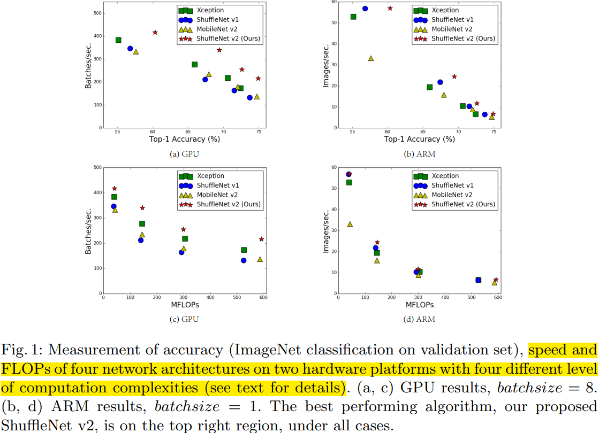

图 1 中在 `GPU` 和 `ARM` 两个平台上，具有相同 `FLOPs` 的模型运行速度也会相差很多。因此只用 FLOPs 来衡量计算复杂度是不充分的，也会导致得不到最优的网络设计。

导致这种不一致的主要有两个原因：一是影响速度的几个重要因素只通过 FLOPs 是考虑不到的，比如 `MAC（Memory Access Cost）`和并行度；二是具有相同 FLOPs 的模型在不同的平台上可能运行速度不一样。
因此，作者提出了设计有效网络结构的两个原则。一是用直接度量来衡量模型的性能，二是直接在目标平台上进行测试。

## 2、高效网络设计的实用指导思想

首先，作者分析了两个经典结构 ShuffleNet v1 和 MobileNet v2 的运行时间。

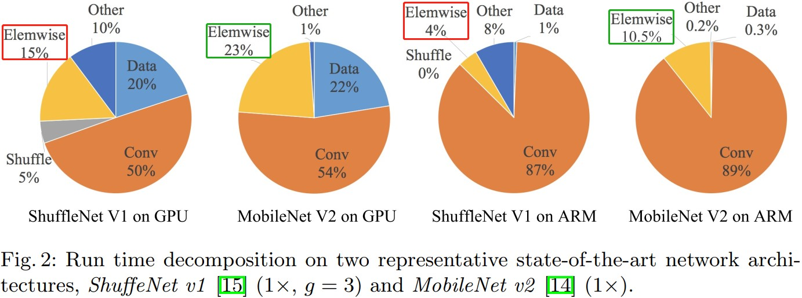

从图 2 可以看出，虽然以 `FLOPs` 度量的卷积占据了大部分的时间，但其余操作也消耗了很多运行时间，比如数据输入输出、通道打乱和逐元素的一些操作（张量相加、激活函数）。因此，FLOPs 不是实际运行时间的一个准确估计。

1. **G1**：同样大小的通道数可以最小化 `MAC`。
2. **G2**：太多的分组卷积会增加 MAC。
3. **G3**：网络碎片化会减少并行度。
4. **G4**：逐元素的操作不可忽视。

### G1-同样大小的通道数可以最小化 MAC

现代的网络如 `Xception [12], MobileNet [13], MobileNet V2 [14], ShuffleNet [15]` 都采用了深度可分离卷积，它的点卷积（即 $1\times 1$ 卷积）占据了大部分的计算复杂度（ShuffleNet 有分析）。假设输入特征图大小为 $h*w*c_1$，那么卷积核 shape 为 $(c_2, c_1, 1, 1)$，输出特征图长宽不变，那么 $1 \times 1$ 卷积的 `FLOPs` 为 $B = hwc_{1}c_{2}$。
> 论文中 `FLOPs` 的计算是把乘加当作一次浮点运算的，所以其实等效于我们通常理解的 `MACs` 计算公式。

简单起见，我们假设计算设备的缓冲足够大能够存放下整个特征图和参数。那么 $1 \times 1$ 卷积层的内存访问代价（内存访问次数）为 $MAC = hwc_1 + hwc_2 + c_{1}c_{2} = hw(c_{1} + c_{2}) + c_{1}c_{2}$，等式的三项分别代表输入特征图、输出特征图和权重参数的代价。由均值不等式，我们有：

$$
\begin{split}
MAC &= hw(c_{1} + c{2}) + c_{1}c_{2} \\\\
&= \sqrt{(hw)^{2}(c_{1} + c_{2})^{2}} + \frac{B}{hw} \\\\
&\geq \sqrt{(hw)^{2}(4c_{1}c_{2})}+ \frac{B}{hw} \\\\
&\geq 2\sqrt{hwB} + \frac{B}{hw} \\\\
\end{split}$$

由均值不等式，可知当 $c_1 = c_2$ 时，$(c_{1} + c_{2})^{2} = 4c_{1}c_{2}$，即式子 $(c_{1} + c_{2})^{2}$ 取下限。即当且仅当 $c_{1}=c_{2}$ （$1 \times 1$ **卷积输入输出通道数相等**）时，`MAC` 取得最小值。但是这个结论只是理论上成立的，实际中缓存容量可能不够大，缓存策略也因平台各异。所以我们进一步设计了一个对比试验来验证，实验的基准的网络由 10 个卷积 `block` 组成，每个块有两层卷积，第一个卷积层输入通道数为 $c_{1}$ 输出通道数为$c_{2}$，第二层与第一层相反，然后固定总的 FLOPs 调整$c_{1}:c_{2}$的值测试实际的运行速度，结果如表 1 所示：

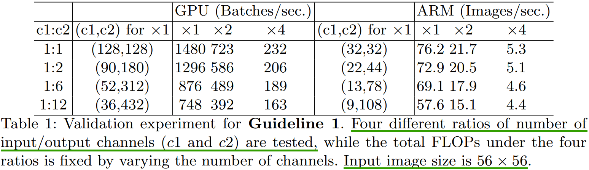

可以看到，当比值接近 `1:1` 的时候，网络的 `MAC` 更小，测试速度也最快。

### G2-分组数太多的卷积会增加 MAC

分组卷积是现在网络结构设计的核心，它通过通道之间的**稀疏连接**（也就是只和同一个组内的特征连接）来降低计算复杂度。一方面，它允许我们使用更多的通道数来增加网络容量进而提升准确率，但另一方面随着通道数的增多也对带来更多的 `MAC`。

针对 $1 \times 1$ 的分组卷积，我们有：
> 分组卷积 `FLOPs` 的计算公式，我写的 [MobileNet v1 论文详解](https://63427ff0.wiz06.com/wapp/pages/view/share/s/1zgD_M0Qfx7F2AnL_C3tohc93-WpoF0GskOx2_h4E626G3MN) 有给出推导。

$$
\begin{split}
B = h \ast w \ast 1 \ast 1 \ast \frac{c_1}{g} \ast \frac{c_2}{g} \ast g = \frac{hwc_{1}c_{2}}{g}
\end{split}
$$

$$ 
\begin{split}
MAC = hw(c_{1} + c_{2}) + \frac{c_{1}c_{2}}{g} = hwc_{1} + \frac{Bg}{c_1}+\frac{B}{hw}\end{split}
$$

> 固定 $\frac{c_2}{g}$ 的比值，又因为输入特征图 $c_{1} \times h \times w$ 固定，从而也就固定了计算代价 $B$，所以可得 上式中 $MAC$ 与 $g$ 成正比的关系。

其中 $B$ 是卷积层的浮点运算次数（`FLOPs`），$g$ 是分组卷积的组数，可以看到，如果给定输入特征图尺寸（`shape`）$c_{1} \times h \times w$ 和计算代价 $B$，则 $MAC$ 与组数 $g$ 成正比。本文通过叠加 10 个分组点卷积层设计了实验，在保证计算代价（`FLOPs`）相同的情况下采用不同的分组组数测试模型的运行时间，结果如下表 2 所示。

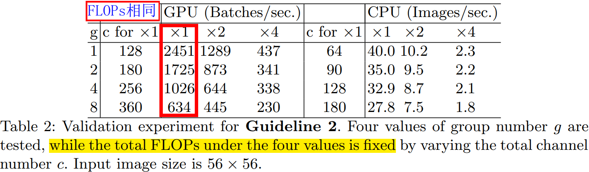

很明显使用分组数多的网络速度更慢，比如 分为 `8` 个组要比 `1` 个组慢得多，主要原因在于 `MAC` 的增加 。因此，本文建议要根据硬件平台和目标任务谨慎地选择分组卷积的组数，不能简单地因为可以提升准确率就选择很大的组数，而忽视了内存访问代价（`MAC`）的增加。

### G3-网络碎片化会降低并行度

在 `GoogLeNet` 系列和自动搜索得到的网络架构中，每个网络的 `block` 都采用多分支（`multi-path`）结构，在这种结构中多采用小的算子（fragmented operators 支路算子/碎片算子）而不是大的算子，`block` 中的每一个卷积或者池化操作称之为一个 fragmented operator。如 NASNET-A[9]网络的碎片算子的数量（即一个 building block 的单个卷积或池化操作的总数）为 `13`。相反，在 `ResNet`[4] 这样的标准网络中，碎片算子的数量为 2 或者 3。
> Residual Block 有两种，`basic block` 和 `bottleneck block` 的残差结构。`fragment`，翻译过来就是分裂的意思，可以简单理解为网络的单元或者支路数量。

尽管过去的论文已经表明，这种 fragmented structure（碎片化/支路结构）能够提升模型的准确性，但是其会降低效率，因为这种结构 `GPU` 对并行性强的设备不友好。而且它还引入了额外的开销，如内核启动和同步。
> kernel launching and synchronization. `synchronization`：同步支路结构分支之间的同步。network fragmentation 我翻译为网络碎片化。

为了量化网络碎片化（network fragmentation）如何影响效率，我们评估了一系列具有不同碎片化程度(degree of fragmentation)的网络块（network blocks）。具体来说，对比实验实验的每个构建块由 1 到 4 个 顺序或并行结构的1x1 卷积层组成。The block structure 如附录图1所示。

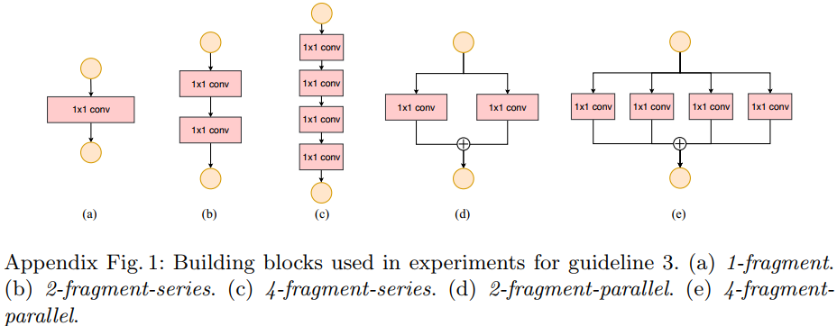

每个 `block` 重复堆叠 10 次。表 3 的结果表明，碎片化会降低 GPU 的速度，例如 4-fragment 比 1-fragment 结构慢约 3 倍。但是在 `ARM` 上，`fragmentation` 对速度的影响速会比 `GPU` 相对较小些。

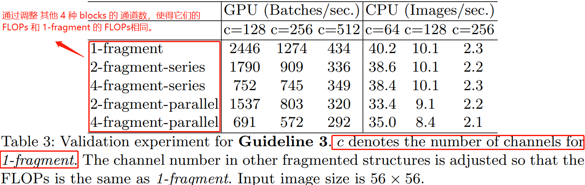

### G4-逐元素的操作不可忽视

如图 2 所示，例如 `MobileNet v2` 和 `ShuffleNet v1` 这样的轻量级模型中，按元素操作（`element-wise`）会占用大量时间的，尤其是在 `GPU` 平台上。

在我们的论文中，逐元素算子包括 `ReLU`、`AddTensor`、`AddBias` 等，它们的 `FLOPs` 相对较小，但是 `MAC` 较大。特别地，我们把 `depthwise convolution` 当作一个 逐元素算子（element-wise operator），因为它的 `MAC/FLOPs` 的比值也较高。
> `shortcut` 操作并不能当作 element-wise 算子。

论文使用 `ResNet` 的 "bottleneck" 单元进行实验，其是由 $1 \times 1$ 卷积、然后是$3 \times 3$ 卷积，最后又是 $1 \times 1$ 卷积组成，并带有 `ReLU` 和 `shortcut` 连接，其结构图如下图所示。在论文的实验中，删除 `ReLU` 和 `shortcut` 操作，表 4 报告了不同变体 "bottleneck" 的运行时间。我们观察到，在删除  ReLU 和 shortcut 后，在 GPU 和 CPU 平台都取得了 `20%` 的加速。

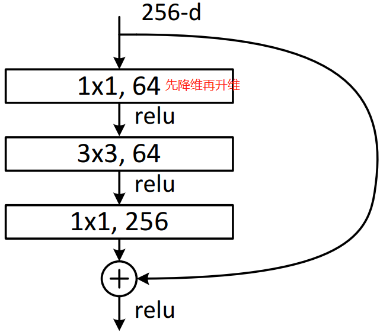
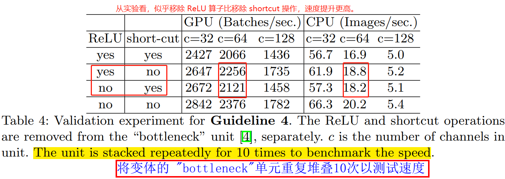

**结论和讨论**。根据上诉 4 个指导原则和经验研究，我们得出高效的网络结构应该满足：
1. 使用平衡的卷积，也就是通道数一样；
2. 合理使用分组卷积；
3. 减少碎片度；
4. 减少逐元素操作。

**以上 4 个理想的属性的发挥效果取决于平台特性**（例如内存操作和代码优化），这超出了论文理论上的范围，但在实际网络设计中我们应尽量遵守这些原则。
之前轻量级神经网络体系结构的进展主要是基于 `FLOPs` 的度量标准，并没有考虑上述 4 个属性。比如 `ShuffleNet v1` 严重依赖分组卷积，这违反了 `G2`；`MobileNet v2` 利用了反转瓶颈结构，这违反了 `G1`，而且在通道数较多的扩展层使用 `ReLU` 和深度卷积，违反了 `G4`，`NAS` 网络生成的结构碎片化很严重，这违反了 `G3`。

## 3、ShuffleNet V2：一个高效的架构

**重新审查 ShuffleNet v1**。`ShuffleNet`  是一个 state-of-the-art 网络，被广泛应用于低端设备中（如手机）。它启发了我们论文中的工作，因此，它首先被审查和分析。

根据 `ShuffleNet v1`，轻量级神经网络的主要挑战在于，在给定预算（`FLOPs`）的情况下，特征图的通道数也是受限制的。为了在不显著增加 `FLOPs` 计算量的情况下提高通道数，`ShuffleNet v1` 论文采用了两种技术：**逐点组卷积和类瓶颈结构**（pointwise group convolutions and bottleneck-like structures.）；然后引入“channel shuffle” 操作，令不同组的通道之间能够进行信息交流，提高精度。其构建模块如图 3(a)(b) 所示。

从本文 Section 2 的讨论，可以知道**逐点组卷积和瓶颈结构**都增加了 `MAC`( `G1` 和 `G2` )。这个成本不可忽视，特别是对于轻量级模型。另外，使用太多分组也违背了 `G3`。`shortcut connection` 中的**逐元素加法**（element-wise "Add"）操作也不可取 (`G4`)。因此，为了实现较高的**模型容量和效率**，关键问题是**如何保持大量且同样宽的通道，同时没有密集卷积也没有太多的分组**。
> **如何保持大量且同样宽的通道，同时没有密集卷积也没有太多的分组**，这句话比较难理解。我的理解：1，卷积 `block` 里面的卷积层通道多且同样宽的通道的，意味着两个连接的卷积层的通道数要多且相等。2，密集卷积是？3，使用分组卷积时，分组数 `group` 不宜过多，那就意味着 `DW` 卷积的输入通道数要较小。

**ShuffleNet v2 的通道拆分**。在 ShuffleNet v1 `block`的基础上，**ShuffleNet v2 block 引入通道分割（`Channel Split`）这个简单的算子**来实现上述目的，如图 3(c) 所示。在每个单元 (block) 的开始，我们将输入特征图的 $c$ 个通道切分成 (`split`) 两个分支 (`branches`)：$c-c^{'}$ 个通道和 $c^{'}$ 个通道。根据 **G3** 网络碎片尽可能少，其中一个分支保持不变（shortcut connection），另外一个分支包含三个通道数一样的卷积来满足 **G1**。和 v1 不同，v2 block 的两个 $1 \times 1$ 卷积不再使用分组卷积，一部分原因是为了满足 **G2**，另外一部分原因是一开始的通道切分 （`split`）操作已经完成了分组效果。

最后，对两个分支的结果进行拼接（`concatnate`），这样对于卷积 `block` 来说，输入输出通道数是一样的，符合 **G1** 原则。和 `ShuffleNet v1` 一样**都使用通道打乱（`channel shuffle`）操作来保证两个分支的信息进行交互**。
> ResNet 的 basic block 和 bottleneck block 也是这样设计的，符合 **G1** 原则。

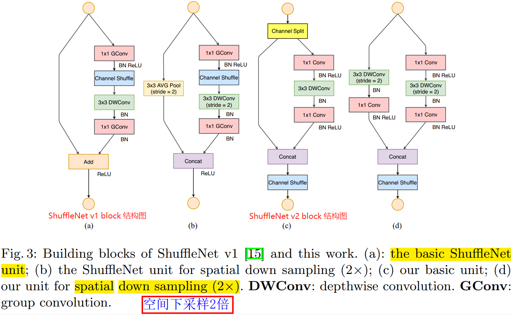

通道打乱之后的输出，就是下一个单元的输入。ShuffleNet v1 的 “Add” 操作不再使用，逐元素操作算子如：`ReLU` 和 `DW 卷积` 只存在于在右边的分支。与此同时，我们将三个连续的逐元素操作算子：拼接（`“Concat”`）、通道打乱（`“Channel Shuffle”`）和通道拆分（`“Channel Split”`）**合并成一个逐元素算子**。根据 **G4**原则，这些改变是有利的。

针对需要进行空间下采样的 `block`，卷积单元（`block`）进行了修改，通道切分算子被移除，然后 `block` 的输出通道数变为两倍，详细信息如图 3(d) 所示。

图 3(c)(d) 显示的卷积 `block`叠加起来即组成了最后的 `ShuffleNet v2` 模型，简单起见，设置 $c^{'} = c/2$，这样堆叠后的网络是类似 ShuffleNet v1 模型的，网络结构详细信息如表 5 所示。v1 和 v2 block 的区别在于， v2 在全局平均池化层（global averaged pooling）之前添加了一个 $1 \times 1$ 卷积来混合特征（mix up features），而 v1 没有。和 v1 一样，**v2 的 `block` 的通道数是按照 `0.5x 1x` 等比例进行缩放，以生成不同复杂度的 ShuffleNet v2 网络**，并标记为 ShuffleNet v2 0.5×、ShuffleNet v2 1× 等模型。
> 注意：表 5 的通道数设计是为了控制 `FLOPs`，需要调整通道数将 `FLOPs` 与之前工作对齐从而使得对比实验公平，没有使用 `2^n` 通道数是因为其与精度无关。

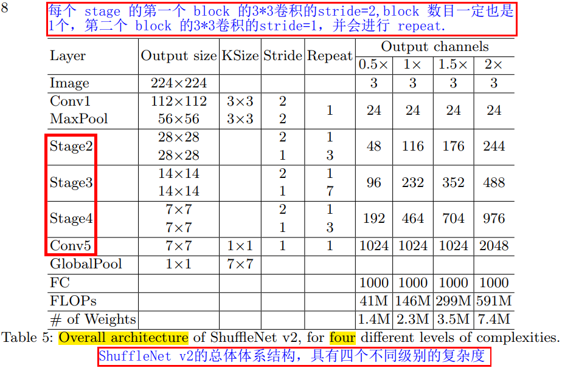

> 根据前文的分析，我们可以得出此架构遵循所有原则，因此非常高效。

**网络精度的分析**。`ShuffleNet v2` 不仅高效而且精度也高。有两个主要理由：一是高效的卷积 `block` 结构允许我们使用更多的特征通道数，网络容量较大。二是当 $c^{'} = c/2$时，一半的特征图直接经过当前卷积 block 并进入下一个卷积 block，这类似于 `DenseNet` 和 `CondenseNet` 的特征重复利用。
> DenseNet 是一种具有密集连接的卷积神经网络。在该网络中，任何两层之间都有直接的连接，也就是说，网络每一层的输入都是前面所有层输出的并集，而该层所学习的特征图也会被直接传给其后面所有层作为输入。

在 DenseNet 论文中，作者通过画不同权重的 `L1` 范数值来分析特征重复利用的模式，如图 4(a)所示。可以看到，**相邻层之间的关联性是远远大于其它层的，这也就是说所有层之间的密集连接可能是多余的**，最近的论文 CondenseNet 也支持这个观点。

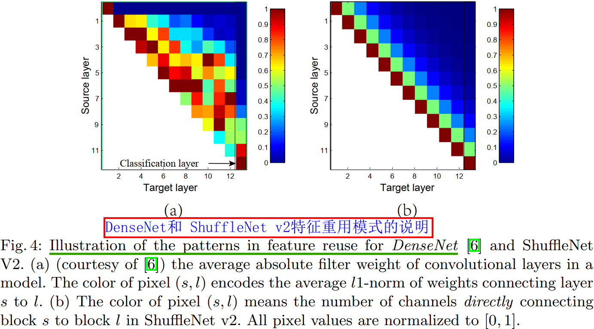

在 ShuffleNet V2 中，很容易证明，第 $i$ 层和第 $i+j$ 层之间直接相连的特征图通道数为 $r^{j}c$，其中 $r=(1−c^{'})/c$。换句话说，两个 blocks 之间特征复用的数量是随着两个块之间的距离变大而呈指数级衰减的。相距远的 blocks，特征重用会变得很微弱。
> 图 4 的两个 blocks 之间关联性的理解有些难。

因此，和 DenseNet 一样，Shufflenet v2 的结构通过设计实现了特征重用模式，从而得到高精度，并具有更高的效率，在实验中已经证明了这点，实验结果如表 8 所示 。

## 4、实验

**精度与 FLOPs 的关系**。很明显，我们提出的 ShuffleNet v2 模型很大程度上优于其他网络，特别是在小的计算量预算情况下。此外，我们也注意到 MobileNet v2 模型在 图像尺寸为$224 \times 224$ 和模型计算量为 `40 MFLOPs` 量级时表现不佳，这可能是因为通道数太少的原因。相比之下，我们的设计的高效模型可以使用更多的通道数，所以并不具备此缺点。另外，如 Section 3 讨论的那样，虽然我们的模型和 DenseNet 都具有特征重用功能，但是我们的模型效率更高。

**推理速度和 FLOPs/Accuracy 的关系**。本文比较了 `ShuffleNet v2、MobileNet v2、ShuffleNet v1 和 Xception` 四种模型的实际推理速度和 `FLOPs`的关系，如图 1(c)(d) 所示，在不同分辨率条件下的更多结果在附录表 1 中提供。

尽管 MobileNet v1 的精度表现不佳，但是其速度快过了 SHuffleNet v2等网络。我们认为是因为 MobileNet v1 符合本文建议的原则（比如 **G3** 原则， MobileNet v1 的碎片化程度少于 ShuffleNet v2）。

**与其他方法的结合**。ShuffleNet v2 与其他方法结合可以进一步提高性能。当使用 `SE` 模块时，模型会损失一定的速度，但分类的精度会提升 0.5%。卷积 block 的结构如附录 2(b)所示，对比实验结果在表 8 中。

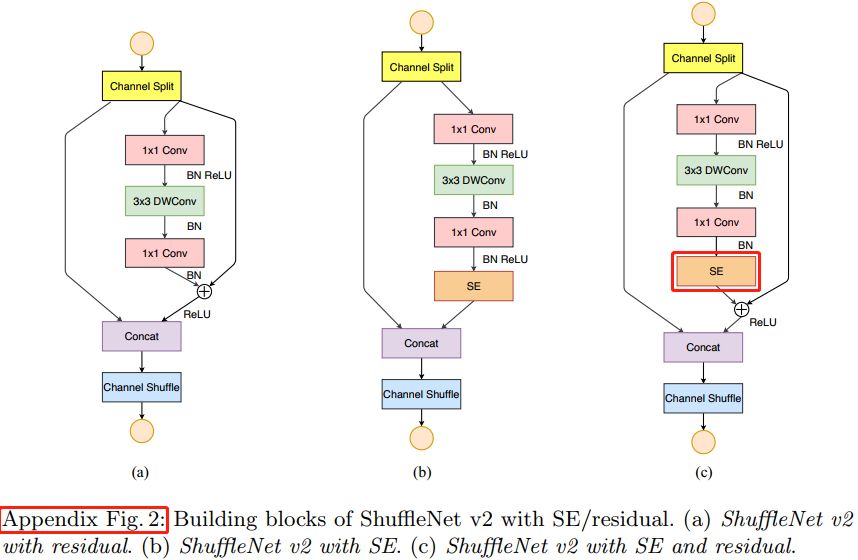

`Sequeeze-and-Excitation(SE)` `block` 不是一个完整的网络结构，而是一个子结构（卷积 block），**通用性较强、即插即用**，可以嵌到其他分类或检测模型中，和 `ResNext`、`ShuffleNet v2` 等模型结合。`SENet` 主要是学习了 `channel` 之间的相关性，筛选出了针对通道的注意力，稍微增加了一点计算量，但是效果比较好。`SE` 其 block 结构图如下图所示。

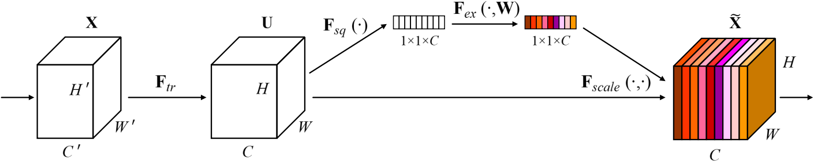

**大型模型通用化（Generation to Large Models）**。虽然本文的消融（`ablation`）实验主要是针对轻量级网络，但是 `ShuffleNet v2` 在大型模型($FLOPs \geq 2G$)的表现上也丝毫不逊色。**表6** 比较了`50` 层的 `ShuffleNet v2`、`ShuffleNet v1` 和 `ResNet50` 在 `ImageNet` 分类实验上的精度，可以看出同等 `FLOPs=2.3G` 条件下 ShuffleNet v2 比 v1 的精度更高，同时和 ResNet50 相比 `FLOPs` 减少 `40%`，但是精度表现更好。实验用的网络细节参考附录表`2`。

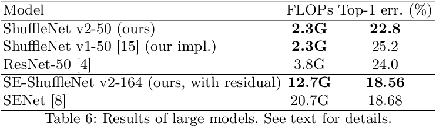

对于很深的 ShuffleNet v2 模型（例如超过 `100` 层），我们通过添加一个 `residual path` 来轻微的修改基本的 `block` 结构，来使得模型的训练收敛更快。表 6 提供了 带 `SE` 模块的 `164` 层的 ShuffleNet v2 模型，其精度比当前最高精度的 state-of-the-art 模型 `SENet` 精度更高，同时 `FLOPs` 更少。

**目标检测任务评估**。为了评估模型的泛化性能，我们使用 `Light-Head RCNN` 作为目标检测的框架，在 COCO 数据集上做了对比实验。表 7 的实验结果表明模型在 4 种不同复杂度条件下， ShuffleNet v2 做 backbone 的模型精度比其他网络更高、速度更快，全面超越其他网络。

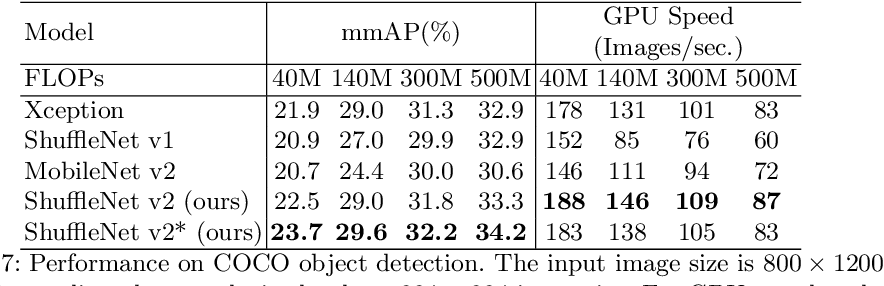

Table 7: Performance on COCO object detection. The input image size is 800 1200. FLOPs row lists the complexity levels at 224 224 input size. For GPU speed evaluation, the batch size is 4. We do not test ARM because the PSRoI Pooling operation needed in [34] is unavailable on ARM currently.
比较检测任务的结果（表 7），发现精度上 `ShuffleNet v2 > Xception ≥ ShuffleNet v1 ≥ MobileNet v2`。
比较分类任务的结果（表 8），精度等级上 `ShuffleNet v2 ≥ MobileNet v2 > ShuffeNet v1 > Xception`。

## 5、结论

我们建议对于轻量级网络设计应该考虑直接 `metric`（例如速度 speed），而不是间接 metric（例如 `FLOPs`）。本文提出了实用的原则和一个新的网络架构-ShuffleNet v2。综合实验证了我们模型的有效性。我们希望本文的工作可以启发未来的网络架构设计可以更重视平台特性和实用性。

## 参考资料

1. [Group Convolution分组卷积，以及Depthwise Convolution和Global Depthwise Convolution](https://www.cnblogs.com/shine-lee/p/10243114.html)
2. [分组卷积和深度可分离卷积](https://linzhenyuyuchen.github.io/2020/05/09/%E5%88%86%E7%BB%84%E5%8D%B7%E7%A7%AF%E5%92%8C%E6%B7%B1%E5%BA%A6%E5%8F%AF%E5%88%86%E7%A6%BB%E5%8D%B7%E7%A7%AF/)
3. [理解分组卷积和深度可分离卷积如何降低参数量](https://zhuanlan.zhihu.com/p/65377955)
4. [深度可分离卷积（Xception 与 MobileNet 的点滴）](https://www.jianshu.com/p/38dc74d12fcf)
5. [MobileNetV1代码实现](https://www.cnblogs.com/linzzz98/articles/13453810.html)
6. [轻量级神经网络：ShuffleNetV2解读](https://www.jiqizhixin.com/articles/2019-06-03-14)
7. [ShufflenetV2_高效网络的4条实用准则](https://zhuanlan.zhihu.com/p/42288448)
8. [ShuffleNet: An Extremely Efficient Convolutional Neural Network for Mobile Devices](https://arxiv.org/abs/1707.01083)
9. [MobileNetV2: Inverted Residuals and Linear Bottlenecks](https://arxiv.org/abs/1801.04381)
10. [MobileNets: Efficient Convolutional Neural Networks for Mobile Vision Applications](https://arxiv.org/abs/1704.04861)
11. [Squeeze-and-Excitation Networks](https://openaccess.thecvf.com/content_cvpr_2018/papers/Hu_Squeeze-and-Excitation_Networks_CVPR_2018_paper.pdf)
