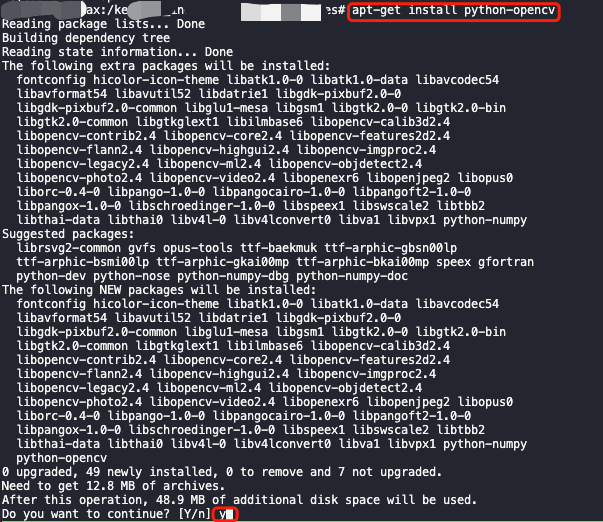
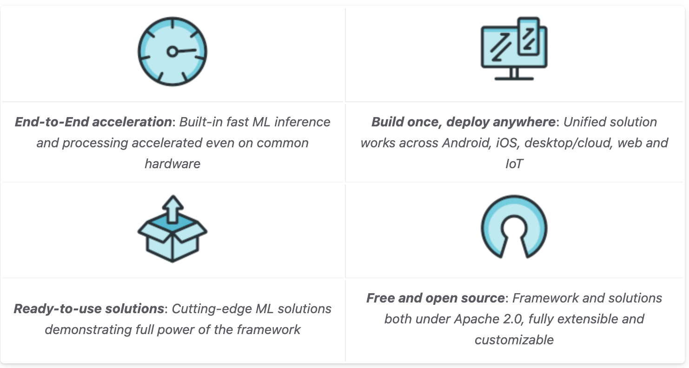
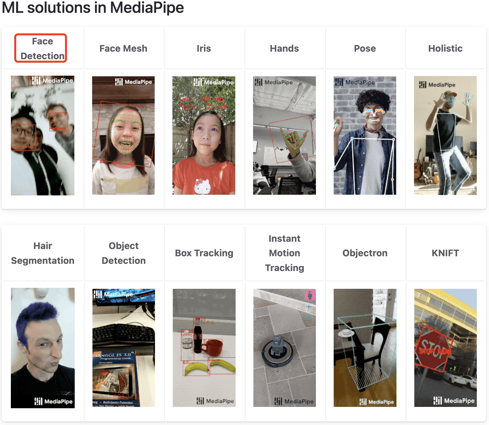
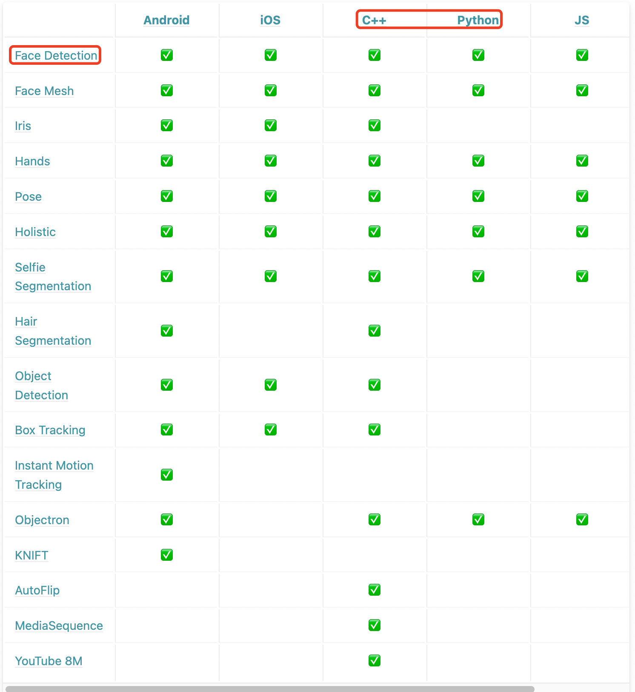
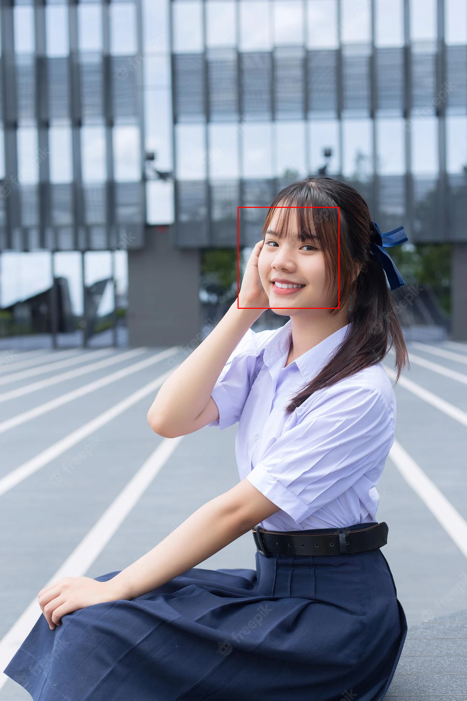
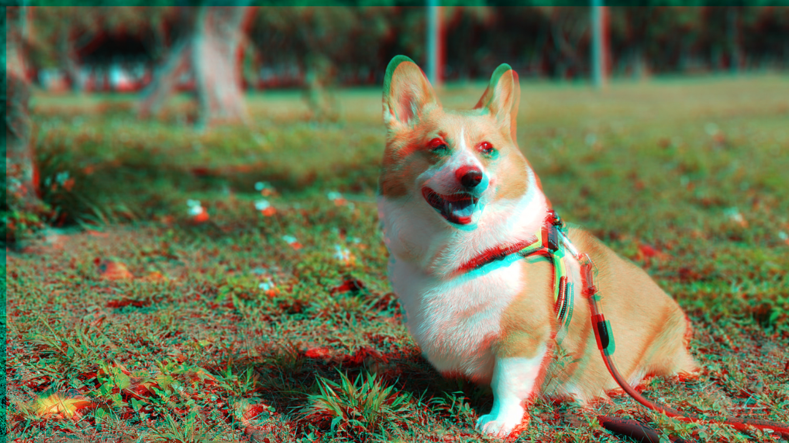
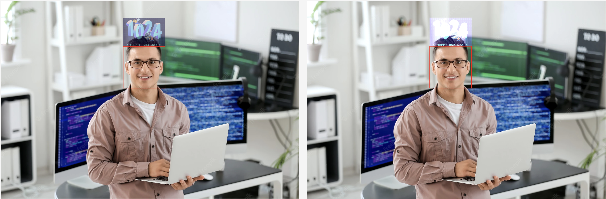
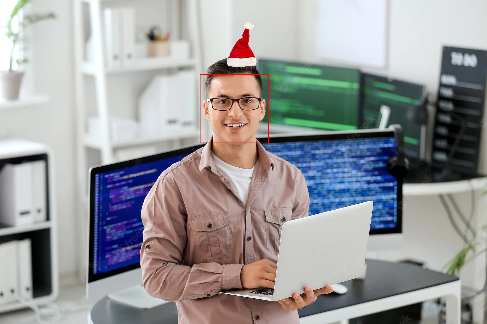

- [前言](#前言)
- [一，OpenCV 和 MediaPipe 介绍](#一opencv-和-mediapipe-介绍)
  - [1.1，OpenCV 介绍](#11opencv-介绍)
  - [1.2，OpenCV-Python 安装](#12opencv-python-安装)
    - [1.2.1，预构建的二进制文件安装 OpenCV-Python](#121预构建的二进制文件安装-opencv-python)
  - [1.3，MediaPipe 介绍](#13mediapipe-介绍)
  - [1.4，MediaPipe 安装](#14mediapipe-安装)
- [二，OpenCV 趣味项目](#二opencv-趣味项目)
  - [2.1，OpenCV 实现人脸检测](#21opencv-实现人脸检测)
  - [2.2，OpenCV 实现抖音晃眼睛特效](#22opencv-实现抖音晃眼睛特效)
  - [2.3，OpenCV 给人脸加上 1024 庆祝 LOGO](#23opencv-给人脸加上-1024-庆祝-logo)
  - [2.4，OpenCV 实现人脸检测+抖音晃眼睛特效+给头顶加上1024庆祝LOGO](#24opencv-实现人脸检测抖音晃眼睛特效给头顶加上1024庆祝logo)
- [三，MediaPipe 趣味项目](#三mediapipe-趣味项目)
- [参考资料](#参考资料)

## 前言

首先阅读文本几乎不需要深度学习算法基础，但需要一点 `Python` 和 `OpenCV` 和 `numpy` 编程基础，本文所有代码在这个[仓库](https://github.com/HarleysZhang/2021_algorithm_intern_information/tree/master/6-computer_vision/%E5%BA%94%E7%94%A8%E6%A1%88%E4%BE%8B)中可见。

## 一，OpenCV 和 MediaPipe 介绍

### 1.1，OpenCV 介绍

`OpenCV` 的全称 是 `Open Source Computer Vision Library`，是一个跨平台的计算机视觉库。`OpenCV` 是由英特尔公司发起并参与开发，以 `BSD` 许可证授权发行，可以在商业和研究领域中免费使用。OpenCV 可用于开发实时的图像处理、计算机视觉以及模式识别程序。

`OpenCV` 库用 `C++` 语言编写，它的主要接口也是 `C++` 语言，同时所有新的算法也是用 `C++` 编写，同时也提供了大量的 `Python`, `Java` 和 `MATLAB` 接口。`OpenCV` 可以在 `Windows`, `Android`, `iOS`, `Linux` 和 `Mac OS` 等平台上运行，其可以使用 `CMake` 编译。
> 来源[维基百科](https://zh.m.wikipedia.org/zh-hans/OpenCV)

`OpenCV` 目前的最新版本是 `4.6.0`，可通过[在线文档](https://docs.opencv.org/)获取 API 接口函数的文档。虽然从 3.0 版本以来，`OpenCV` 也提供了 `DNN`（深度神经网络）模块，但是在实际项目当中，开发者还是只利用了 `OpenCV` 读取、和保存图像/视频的功能，以及传统图像处理的一些算法功能等。

### 1.2，OpenCV-Python 安装

**推荐安装环境**: Ubuntu16.04 以上 + Python3.6 以上 + pip 库。

本文只介绍 OpenCV-Python 接口库的安装，本身的安装较为复杂，需要下载源代码和使用 CMake 编译安装，本文不做描述。
> Python 和 C++ 的 OpenCV 接口几乎一样，不同的是使用用 C++ 版本，矩阵用的是 cv::Mat，Python 版本矩阵用的是 numpy.array，大部分接口的用法相似。

`OpenCV-Python` 可以通过两种方式安装在 Ubuntu 系统中： 
- 从 Ubuntu 存储库中可用的预构建二进制文件安装，或者使用 `pip` 直接安装。
- 从源代码编译

#### 1.2.1，预构建的二进制文件安装 OpenCV-Python

1，对于 `Ubuntu` 系统，可通过以下命令行方式安装二进制文件包。
```bash
sudo apt-get update
sudo apt-get install python-opencv
```
> apt-get update 只是同步 /etc/apt/sources.list 和 /etc/apt/sources.list.d 中列出的源的索引，这样才能获取到最新的软件包。update只是更新了 apt 的**资源列表**，没有真正的对系统执行更新。如果需要系统软件，要使用 `apt-get upgrade` 来更新。



2，对于 `Windows/Ubuntu/Mac OS` 系统，如果系统本身已经安装了 `Python` 解释器和 `pip` 工具，则可直接通过 `pip` 工具安装：
```bash
pip install opencv-python
```

在终端中通过进入 `python` 解释器运行环境，输入以下代码检查 `opencv-python` 包是否成功安装，或者通过 `pip list` 命令查看已安装的 python 包是否有 `opencv-python` 包。

```python
>>> import cv2
>>> print( cv2.__version__ )
4.6.0
```
### 1.3，MediaPipe 介绍

`MediaPipe` 是一个为直播和流媒体提供跨平台、可定制的机器学习解决方案的框架，具有如下优点:
- 端到端加速
- 一次构建，随处部署
- 开箱即用的解决方案
- 免费且开源



`MediaPipe` 提供了包括**人脸检测、人脸网格、虹膜识别、手部关键点检测、人体姿态估计、人体+人脸+手部组合整体、头发分割、目标检测、Box 跟踪、即时运动追踪、3D 目标检测等**解决方案。



MediaPipe 对移动端 Android/iOS 系统和 C++/Python/JS 编程语言的各个接口支持情况如下表所示:



`MediaPipe Python` 框架允许直接访问 `MediaPipe C++` 框架的核心组件： `Timestamp`、`Packet` 和 `CalculatorGraph`。`MediaPipe` 框架通过 [pybind11](https://pybind11.readthedocs.io/en/stable/index.html)提供 `Python` 接口。

### 1.4，MediaPipe 安装

`MediaPipe` 以预构建二进制文件的形式提供开箱即用且可定制化修改的 Python 解决方案。MediaPipe Python 包可用于 `Linux`、`macOS` 和 `Windows` 的 `PyPI`。

`MediaPipe Python` 包的安装命令如下: 

```bash
pip install mediapipe
```

`MediaPipe` 从源码到编译安装方式可参考[Installation](https://google.github.io/mediapipe/getting_started/install.html)。

## 二，OpenCV 趣味项目

借助 `OpenCV` 库实现人脸检测 + 抖音特效 + `1024` 程序员节 `LOGO`。

### 2.1，OpenCV 实现人脸检测

本文使用基于 Haar 特征的级联分类器实现对人脸框的检测。
> 级联分类器原理的解释参考 [使用 Haar Cascades 进行人脸检测](https://docs.opencv.org/3.1.0/d7/d8b/tutorial_py_face_detection.html#gsc.tab=0)

首先，我们加载所需的人脸预训练分类器 XML 文件，然后以灰度模式加载我们的输入图像。

然后我们可以通过分类器找到人脸，并将人脸的位置返回为 `Rect` `(x,y,w,h)`。得到人脸框的位置后，就可以通过 `OpenCV` 的画矩形函数 `cv2.rectangle` 画人脸框。

`OpenCV` 实现人脸检测的 `Python` 代码如下:

```python
import cv2

# Load the cascade
face_cascade = cv2.CascadeClassifier(cv2.data.haarcascades + 'haarcascade_frontalface_default.xml')

if __name__ == "__main__":
    img = cv2.imread("./images/student.png") # 必须为 png 图片

    gray = cv2.cvtColor(img, cv2.COLOR_BGR2GRAY) # Convert to grayscale
    # 第二个参数值越大能检测出的人脸越多，但是有可能误检
    faces = face_cascade.detectMultiScale(gray, 1.2, 4) # Detect the faces
    
    for (x, y, w, h) in faces:
        cv2.rectangle(img, (x, y), (x+w, y+h), (0, 0, 255), 2) # drae red face detect bbox
    cv2.imwrite('./images/face_detect.png', img)
```

运行以上 `Python` 代码后的效果如下所示:



### 2.2，OpenCV 实现抖音晃眼睛特效

抖音 logo 的图片如下所示。


抖音 `logo` 的晃眼睛特效原理是基于原图生成一张 R 通道和 GB 通道的图像，互相之间略微错位下，然后生成两个三维矩阵，最后将这两个矩阵相加即可得到晃眼睛特效。
> 注意两个图像相加，要求两个图像应该具有相同的大小和类型，或者第二个图像可以是标量值。

晃眼睛特效的具体 `Python` 代码如下：
```python
import cv2
import copy
from PIL import Image
import numpy as np

def douyin_effect(img):
    # face= image[y: y+h, x: x+w] # create a ROI for the face
    img_rgba = cv2.cvtColor(img, cv2.COLOR_BGR2RGBA)
    
    # 通过把gb通道值置为0，生成r通道的图片
    image_arr_r = copy.deepcopy(img_rgba)
    image_arr_r[:, :, 1:3] = 0
    image_r = Image.fromarray(image_arr_r).convert('RGBA')
    # 通过把r通道值置为0，生成gb通道的图片
    image_arr_gb = copy.deepcopy(img_rgba)
    image_arr_gb[:, :, 0] = 0
    image_gb = Image.fromarray(image_arr_gb).convert('RGBA')
    
    # 生成一张黑色背景的画布图片，并把r通道图片复制粘贴在上面，粘贴的位置为(10,10)是为了与后面的gb通道图片错开
    # 第二个参数值越大，错位效果越明显越晃眼睛
    canvas_r = Image.new('RGB', (img.shape[1], img.shape[0]), color=(0, 0, 0))
    canvas_r.paste(image_r, (10, 10), image_r)
    # gb通道图片的处理与上面类似
    canvas_gb = Image.new('RGB', (img.shape[1], img.shape[0]), color=(0, 0, 0))    
    canvas_gb.paste(image_gb, (0, 0), image_gb)
    
    add_image = np.array(canvas_gb) + np.array(canvas_r)
    output_image = cv2.cvtColor(add_image, cv2.COLOR_RGB2BGR)
    
    return output_image

if __name__ == "__main__":
    img = cv2.imread("./images/dog.png") # 必须为 png 图片
    output_image = douyin_effect(img)
    cv2.imwrite('./images/douyin_effect.png', output_image)
```

程序运行后的输出结果和原图对比图如下所示:



### 2.3，OpenCV 给人脸加上 1024 庆祝 LOGO
> 只含有两种灰度值：纯白（255）和纯黑（0），这种图像叫做二值图像。

我希望把一个标志: 如1024庆祝LOGO或者帽子，放到另一幅图像上，且可以设置指定位置: 如人的头顶上。如果我使用图像的加法，图像的**颜色**会改变，如果使用图像的混合，会得到一个**透明**的效果。

实现代码如下所示:
```python
import cv2

# Load the cascade
face_cascade = cv2.CascadeClassifier(cv2.data.haarcascades + 'haarcascade_frontalface_default.xml')
hat_bgr = cv2.imread("./images/1024.png") # 图像需为PNG格式， shape is (height, width, channel)

# 帽子放在头顶上，因为帽子尺寸和人脸ROI尺寸不一样，为了视觉效果好
# 需要将帽子宽度缩放到人脸一样宽，对应的帽子高度也需要乘上这个缩放比例
def two_image_algorithm(image1, x,y,w,h, hat):
    # 1，创建原图中提取放LOGO的ROI区域
    scaled_factor = w/hat.shape[1]
    resized_hat_h = int(round(hat.shape[0] * scaled_factor))
    bg_roi = image1[y - resized_hat_h : y, x : x + w] # # 原图 ROI 中提取放 LOGO 的区域
    # 2，将LOGO图像大小缩放到和bg_roi一样的尺寸
    hat = cv2.resize(hat, (bg_roi.shape[1], bg_roi.shape[0]))
    # 3，将LOGO图像数组放置到原图对应位置
    # add_hat = cv2.add(bg_roi, hat) # 两个ROI区域相加, 等效于 add_hat = bg_roi + hat
    add_hat = cv2.addWeighted(bg_roi, 0.5, hat, 0.5, 0) # 两个 ROI 区域的混合，等效于dst=α⋅src1+β⋅src2+γ
    image1[y - resized_hat_h: y, x : x + w] = add_hat # 原图中需要放置标志的区域重新赋值, = hat, 则相当于图像的ROI操作
    
    return image1

if __name__ == "__main__":
    img = cv2.imread("./images/programmer.png") # 必须为 png 图片
    gray = cv2.cvtColor(img, cv2.COLOR_BGR2GRAY) # Convert to grayscale
    faces = face_cascade.detectMultiScale(gray, 1.4, 5) # Detect the faces
    
    for (x, y, w, h) in faces:
        center = int(x + w/2)
        cv2.rectangle(img, (x, y), (x+w, y+h), (0, 0, 255), 2) # visual face detect bbox
        output_image = image_blending(img, x, y, w, h, hat_bgr)
    
    cv2.imwrite('./images/hat_on_head_blending.png', output_image)
```

标志图像原图如下:


图像的相加和图像的混合效果程序运行效果如下:



但是我不希望标志是透明或者颜色改变了。如果标志是矩形我可以使用 `ROI` 操作，但标志通常不是矩形。所以我们可以通过下面的**按位运算**(`cv2.bitwise_not`)实现不规则标志图像的 `ROI` 操作：

`Python` 实现代码如下:

```python
import cv2
import matplotlib.pyplot as plt

# Load the cascade
face_cascade = cv2.CascadeClassifier(cv2.data.haarcascades + 'haarcascade_frontalface_default.xml')
# Load two images
img1 = cv2.imread('./images/programmer.png') # shape is (h, w, c): (1200, 1800, 3)
img2 = cv2.imread('./images/10246.png') # shape is (862, 1264, 3)
# x, y, w, h = 739, 276, 253, 253 # 人脸 box 信息
thresh_set = 45

def add_logo(img1, x, y, w, h, img2):
    # 1, 将标志图像缩放到合适尺寸，并以此在原图上创建 ROI，同时将标志图像缩放，并显示
    # I want put img2 on img1's roi, So I create roi
    scaled_factor = w/img2.shape[1]
    resized_hat_h = int(round(img2.shape[0] * scaled_factor))
    img1_roi = img1[y - resized_hat_h : y, x : x + w] # 原ROI中提取放LOGO的区域, roi shape is (173, 253, 3)
    img2_resized = cv2.resize(img2, (img1_roi.shape[1], img1_roi.shape[0])) # 将img2缩放到roi一样大小
    print(img1_roi.shape, img2_resized.shape)

    # 2，创建标志图像的mask和mask_inv图像, 并显示
    # Now create a mask of logo and create its inverse mask also
    img2gray = cv2.cvtColor(img2_resized, cv2.COLOR_BGR2GRAY)
    # 80是img2背景的最大像素值
    ret, img2_mask = cv2.threshold(img2gray, thresh_set, 255,  cv2.THRESH_BINARY) # 像素灰度值大于80的取值255，反之取0
    ret, img2_mask_inv = cv2.threshold(img2gray, thresh_set, 255, cv2.THRESH_BINARY_INV) # 像素灰度值小于80的取值255，反之取0

    # Masking（掩膜运算） 即图与掩膜的“按位与”运算: 原图中的每个像素和掩膜（Mask）中的每个对应像素进行按位与运算，
    # 如果为真，结果是原图的值【这是重点】；如果为假，结果就是零
    # mask的最大作用：让我们只关注我们感兴趣的图像部分。如下引用选自《Practical Python and OpenCV 3rd Edition》

    # 3，black-out the area of logo in ROI，and Take only region of logo from logo image, 并显示
    print(img2_mask_inv.shape, img1_roi.shape)
    # img1_roi和img1_roi先按位与操作AND，结果还是img1_roi, 再将结果进行mask操作
    img1_bg = cv2.bitwise_and(img1_roi, img1_roi, mask = img2_mask_inv) 
    # 把前景以外的地方的像素置为0，即扣出LOGO, # background 背景, foreground 前景
    img2_fg = cv2.bitwise_and(img2_resized, img2_resized, mask = img2_mask) 

    # 4, Put logo in ROI and modify the main image
    dst = cv2.add(img1_bg, img2_fg)
    img1[y - resized_hat_h : y, x : x + w] = dst
    # plt_show_two(dst, img1, "processed roi", "changed img1") # 显示图像
    cv2.imwrite('add_logo.png', img1)
    
    return img1
    
# 帽子放在头顶上，因为帽子尺寸和人脸ROI尺寸不一样，为了视觉效果好
# 需要将帽子宽度缩放到人脸一样宽，对应的帽子高度也需要乘上这个缩放比例
def two_image_algorithm(image1, x,y,w,h, hat):
    # 1，创建原图中提取放LOGO的ROI区域
    scaled_factor = w/hat.shape[1]
    resized_hat_h = int(round(hat.shape[0] * scaled_factor))
    bg_roi = image1[y - resized_hat_h : y, x : x + w] # # 原图 ROI 中提取放 LOGO 的区域
    # 2，将LOGO图像大小缩放到和bg_roi一样的尺寸
    hat = cv2.resize(hat, (bg_roi.shape[1], bg_roi.shape[0]))
    # 3，将LOGO图像数组放置到原图对应位置
    # add_hat = cv2.add(bg_roi, hat) # 两个ROI区域相加, 等效于 add_hat = bg_roi + hat
    add_hat = cv2.addWeighted(bg_roi, 0.5, hat, 0.5, 0) # 两个 ROI 区域的混合，等效于dst=α⋅src1+β⋅src2+γ
    image1[y - resized_hat_h: y, x : x + w] = add_hat # 原图中需要放置标志的区域重新赋值, = hat, 则相当于图像的ROI操作
    
    return image1

if __name__ == "__main__":
    gray = cv2.cvtColor(img1, cv2.COLOR_BGR2GRAY) # Convert to grayscale
    faces = face_cascade.detectMultiScale(gray, 1.4, 5) # Detect the faces
    
    for (x, y, w, h) in faces:
        center = int(x + w/2)
        cv2.rectangle(img1, (x, y), (x+w, y+h), (0, 0, 255), 2) # visual face detect bbox
        out_img = add_logo(img1, x, y, w, h, img2)
        # out_img = two_image_algorithm(img1, x, y, w, h, img2)
    
    cv2.imwrite('./images/add_logo_on_head.png', out_img)
```

程序运行后的效果如下所示:


还有一种给图像加上帽子的方案，这里帽子的图像必须是 png 格式的，即必须有 `alpha` 通道，其方案参考[这里](https://mp.weixin.qq.com/s/D6iWwKToLfTAS6_PRV-6Hw)，主要处理代码和程序运行效果如下：

```python
def add_hat(img1, x, y, w, h, hat_rgb):
    center = int(x + w/2)
    # I want to put logo on the head, So I create a ROI
    scaled_factor = w / hat_rgb.shape[1]
    resized_hat_h = int(round(hat_rgb.shape[0] * scaled_factor))
    bg_roi = img1[y - resized_hat_h : y, x : x + w]
    
    
    # 根据人脸大小调整节日 logo 大小(公式随意，比例一致即可)
    # ***********************************************************
    factor = 1.0 # 可调
    # ***********************************************************
    scaled_factor = w/hat_rgb.shape[1] # 缩放比例计算
    # 根据人脸大小缩放后的节日 logo 尺寸
    resized_hat_h = int(round(hat_rgb.shape[0] * scaled_factor))
    resized_hat_w = int(round(hat_rgb.shape[1] * scaled_factor * factor))
    if resized_hat_h > y:
        resized_hat_h = y-1		#可调
    
    hat_resized = cv2.resize(hat_rgb, (resized_hat_w, resized_hat_h))
    
    mask = cv2.resize(a, (resized_hat_w, resized_hat_h))
    mask_inv = cv2.bitwise_not(mask)
 
    # LOGO 相对于人脸框上线的偏移量
    # ***********************************************************
    dh = 0			# 可调
    dw = -10		# < 0，左移，> 0右移
    # ***********************************************************
    # 原图 ROI(这个公式原则上也可调)
    bg_roi = img1[y + dh - resized_hat_h : y + dh, 
                  (center + dw - resized_hat_w//3):(center + dw + resized_hat_w//3*2)]
    # 原图 ROI 中提取放 LOGO 的区域
    bg_roi = bg_roi.astype(float)
    mask_inv = cv2.merge((mask_inv, mask_inv, mask_inv))
    alpha = mask_inv.astype(float)/255
    # 相乘之前保证两者大小一致（可能会由于四舍五入原因不一致）
    alpha = cv2.resize(alpha, (bg_roi.shape[1], bg_roi.shape[0]))
    bg = cv2.multiply(alpha, bg_roi)
    bg = bg.astype('uint8')

    # 提取帽子区域
    hat = cv2.bitwise_and(hat_resized, hat_resized, mask=mask)
    # 添加圣诞帽
    hat = cv2.resize(hat, (bg_roi.shape[1], bg_roi.shape[0]))
    
    # 两个ROI区域相加
    add_hat = cv2.add(bg, hat)
    # 把添加好帽子的区域放回原图
    img1[y + dh - resized_hat_h: y + dh, (center + dw - resized_hat_w//3):(center + dw + resized_hat_w//3*2)] = add_hat
    return img1
```



### 2.4，OpenCV 实现人脸检测+抖音晃眼睛特效+给头顶加上1024庆祝LOGO

本汇总代码不再是对图片流进行检测，而是对实时视频流进行动态监测，完整[代码](https://github.com/HarleysZhang/2021_algorithm_intern_information/blob/master/6-computer_vision/2D%E7%9B%AE%E6%A0%87%E6%A3%80%E6%B5%8B/4-%E7%BB%8F%E5%85%B8YOLO%E5%8F%98%E4%BD%93%E6%A8%A1%E5%9E%8B.md)如下所示:

```python
import cv2
import copy
from PIL import Image
import numpy as np
import matplotlib.pyplot as plt
import time

# Load the cascade
face_cascade = cv2.CascadeClassifier(cv2.data.haarcascades + 'haarcascade_frontalface_default.xml')

# To capture video from webcam. 
cap = cv2.VideoCapture(0) # opencv 的函数，参数 0 代表调用电脑自带摄像，若改为 1 则调用外设摄像
hat_img_bgra = cv2.imread("./images/hat.png", -1) # 图像需为PNG格式（方便alpha通道的使用）
logo_img = cv2.imread('./images/10246.png') # shape is (862, 1264, 3)
# r, g, b, a = cv2.split(hat_img_bgra) # cv.split() 函数耗时很长，推荐用 numpy 多维数组索引
b, g, r, a = hat_img_bgra[:,:,0], hat_img_bgra[:,:,1], hat_img_bgra[:,:,2], hat_img_bgra[:,:,3]
hat_rgb = cv2.merge((r, g, b)) # 把 rgb 三通道合成一张rgb的彩色图, shape is (height, width, channel)
thresh_set = 45

####################################################################################################################
def runTime(func):
    """decorator: print the cost time of run function"""
    def wapper(arg, *args, **kwargs):
        start = time.time()
        res = func(arg, *args, **kwargs)
        end = time.time()
        print("="*80)
        print("function name: %s" %func.__name__)
        print("run time: %.4fs" %(end - start))
        print("="*80)
        return res
    return wapper

def plt_show_one(img1, title="fist image"):
    plt.figure('img1 roi',figsize=(25,25))
    plt.title(title)
    plt.imshow(cv2.cv2tColor(img1,cv2.COLOR_BGR2RGB))

def plt_show_two(img1, img2, title1="fist image", title2="second image"):
    plt.figure('img2 BINARY',figsize=(25,25))
    plt.subplot(121)
    plt.title(title1)
    plt.imshow(cv2.cvtColor(img1,cv2.COLOR_BGR2RGB))
    plt.subplot(122)
    plt.title(title2)
    plt.imshow(cv2.cvtColor(img2,cv2.COLOR_BGR2RGB))

####################################################################################################################
@runTime
def douyin_effect(image, x, y, w, h):
    face_roi = image[y: y+h, x: x+w] # create a ROI for the face
    face_roi_rgba = cv2.cvtColor(face_roi, cv2.COLOR_BGR2RGBA)
    
    # 通过把gb通道值置为0，生成r通道的图片
    image_arr_r = copy.deepcopy(face_roi_rgba)
    image_arr_r[:, :, 1:3] = 0
    image_r = Image.fromarray(image_arr_r).convert('RGBA')
    # 通过把r通道值置为0，生成gb通道的图片
    image_arr_gb = copy.deepcopy(face_roi_rgba)
    image_arr_gb[:, :, 0] = 0
    image_gb = Image.fromarray(image_arr_gb).convert('RGBA')
    
    # 生成一张黑色背景的画布图片，并把r通道图片复制粘贴在上面，粘贴的位置为(10,10)是为了与后面的gb通道图片错开
    canvas_r = Image.new('RGB', (face_roi.shape[1], face_roi.shape[0]), color=(0, 0, 0))
    canvas_r.paste(image_r, (15, 15), image_r)
    # gb通道图片的处理与上面类似
    canvas_gb = Image.new('RGB', (face_roi.shape[1], face_roi.shape[0]), color=(0, 0, 0))    
    canvas_gb.paste(image_gb, (0, 0), image_gb)
    
    add_image = np.array(canvas_gb) + np.array(canvas_r)
    output_image = cv2.cvtColor(add_image, cv2.COLOR_RGB2BGR)
    
    return output_image

####################################################################################################################
@runTime
def add_logo(img1, x, y, w, h, img2):
    
    # 1, 将标志图像缩放到合适尺寸，并以此在原图上创建 ROI，同时将标志图像缩放，并显示
    # I want put img2 on img1's roi, So I create roi
    scaled_factor = w/img2.shape[1]
    resized_hat_h = int(round(img2.shape[0] * scaled_factor))
    img1_roi = img1[y - resized_hat_h : y, x : x + w] # 原ROI中提取放LOGO的区域, roi shape is (173, 253, 3)
    img2_resized = cv2.resize(img2, (img1_roi.shape[1], img1_roi.shape[0])) # 将img2缩放到roi一样大小
    print(img1_roi.shape, img2_resized.shape)

    # plt_show_two(img1_roi, img2_resized, "will be changed roi in img1", "resized img2")

    # 2，创建标志图像的mask和mask_inv图像, 并显示
    # Now create a mask of logo and create its inverse mask also
    img2gray = cv2.cvtColor(img2_resized, cv2.COLOR_BGR2GRAY)
    # 80是img2背景的最大像素值
    ret, img2_mask = cv2.threshold(img2gray, thresh_set, 255,  cv2.THRESH_BINARY) # 像素灰度值大于80的取值255，反之取0
    ret, img2_mask_inv = cv2.threshold(img2gray, thresh_set, 255, cv2.THRESH_BINARY_INV) # 像素灰度值小于80的取值255，反之取0
    plt_show_two(img2_mask, img2_mask_inv, "img2 BINARY", "img2 BINARY_INV") # 显示图像

    # Masking（掩膜运算） 即图与掩膜的“按位与”运算: 原图中的每个像素和掩膜（Mask）中的每个对应像素进行按位与运算，
    # 如果为真，结果是原图的值【这是重点】；如果为假，结果就是零
    # mask的最大作用：让我们只关注我们感兴趣的图像部分。如下引用选自《Practical Python and OpenCV 3rd Edition》

    # 3，black-out the area of logo in ROI，and Take only region of logo from logo image, 并显示
    print(img2_mask_inv.shape, img1_roi.shape)
    img1_bg = cv2.bitwise_and(img1_roi, img1_roi, mask = img2_mask_inv) # img1_roi和img1_roi先按位与操作AND，结果还是img1_roi, 再将结果进行mask操作
    img2_fg = cv2.bitwise_and(img2_resized, img2_resized, mask = img2_mask) # 把前景以外的地方的像素置为0，即扣出LOGO
    # img2_fg[:,:,0] = 255
    # background 背景, foreground 前景
    plt_show_two(img1_bg, img2_fg, "img1 roi background", "img2 logo forground") # 显示图像

    # 4, Put logo in ROI and modify the main image
    dst = cv2.add(img1_bg, img2_fg)

    img1[y - resized_hat_h : y, x : x + w] = dst
    plt_show_two(dst, img1, "processed roi", "changed img1") # 显示图像
    cv2.imwrite('add_logo.png', img1)
    
    return img1

####################################################################################################################
@runTime
def face_post_process(img1, x, y, w, h):
    """Draw the rectangle and produce douyin effect around each face"""
    # 1, douyin effect
    douyin_face_roi = douyin_effect(img1, x, y, w, h)
    img1[y: y+h, x: x+w] = douyin_face_roi # douyin effect on image's face roi    
    # 2, 1024 programmer's Day Celebration
    out_img = add_logo(img1, x, y, w, h, logo_img)
    
    cv2.rectangle(img1, (x, y), (x+w, y+h), (0, 0, 255), 2) # visual face detect bbox
    return out_img

####################################################################################################################
if __name__ == "__main__":
    while True:
        ret, image = cap.read() # Read the frame
        gray = cv2.cvtColor(image, cv2.COLOR_BGR2GRAY) # Convert to grayscale
        faces = face_cascade.detectMultiScale(gray, 1.1, 4) # Detect the faces
        
        for (x, y, w, h) in faces:
            roi_gray = gray[y: y+h, x: x+w]

            post_process_image = face_post_process(image, x, y, w, h)  # face post-process and visual
            
            cv2.imshow('OpenCV Face Detection', post_process_image) # Display image
        
        # Stop if escape key is pressed
        if cv2.waitKey(5) & 0xFF == ord('q'):
            break
    
    # Release the VideoCapture object
    cap.release()
    cv2.destroyAllWindows()
```

程序运行效果图如下所示:


## 三，MediaPipe 趣味项目

略

## 参考资料
1. https://github.com/CharlesPikachu/pydrawing
2. https://docs.opencv.org/3.1.0/d7/d8b/tutorial_py_face_detection.html#gsc.tab=0
3. https://google.github.io/mediapipe/solutions/face_detection.html
4. https://juejin.cn/post/7034325175021600782