- [一，绪论](#一绪论)
  - [1.1, 什么是数字图像处理](#11-什么是数字图像处理)
  - [1.2，数字图像处理的起源](#12数字图像处理的起源)
  - [1.3，数字图像处理技术应用实例](#13数字图像处理技术应用实例)
  - [1.4，数字图像处理的基本步骤](#14数字图像处理的基本步骤)
  - [1.5，图像处理系统的组成](#15图像处理系统的组成)
- [二，数字图像基础](#二数字图像基础)
  - [2.1，视觉感知要素](#21视觉感知要素)
    - [2.1.1，人眼的结构](#211人眼的结构)
    - [2.1.2，人眼中图像的形成](#212人眼中图像的形成)
    - [2.1.3，亮度适应与辨别](#213亮度适应与辨别)
  - [2.2，电磁波谱](#22电磁波谱)
  - [2.3，图像感知与获取](#23图像感知与获取)
    - [2.3.1，一个简单的成像模型](#231一个简单的成像模型)
  - [2.4，图像取样和量化](#24图像取样和量化)
    - [2.4.1，取样和量化的概念](#241取样和量化的概念)
    - [2.4.2，数字图像表示](#242数字图像表示)
  - [2.5，像素间的一些基本关系](#25像素间的一些基本关系)
  - [2.6，数字图像处理所用的基本数学工具](#26数字图像处理所用的基本数学工具)
    - [2.6.1，对应元素运算和矩阵运算](#261对应元素运算和矩阵运算)
    - [2.6.2，线性运算和非线性运算（一般两个图像之间）](#262线性运算和非线性运算一般两个图像之间)
    - [2.6.3，数字图像处理数学工具-算术运算（一般两个图像之间）](#263数字图像处理数学工具-算术运算一般两个图像之间)
    - [2.6.4，集合运算和逻辑运算（一般两个图像之间）](#264集合运算和逻辑运算一般两个图像之间)
    - [2.6.5，空间运算（单幅图像）](#265空间运算单幅图像)
      - [2.6.5.1，单像素操作](#2651单像素操作)
      - [2.6.5.2，领域运算](#2652领域运算)
      - [2.6.5.3，几何变换](#2653几何变换)
- [三，灰度变换与空间滤波](#三灰度变换与空间滤波)
  - [3.1，背景](#31背景)
  - [3.2，一些基本的灰度变换函数](#32一些基本的灰度变换函数)
    - [3.2.1，图像反转](#321图像反转)
    - [3.2.2，对数变换](#322对数变换)
    - [3.2.3，幂律变换（伽玛变换）](#323幂律变换伽玛变换)
    - [3.2.4，分段线性变换函数](#324分段线性变换函数)
  - [3.3，直方图处理](#33直方图处理)
    - [3.3.1，直方图均衡化](#331直方图均衡化)
    - [3.3.2，直方图匹配（规定化）](#332直方图匹配规定化)
    - [3.3.3，局部直方图处理](#333局部直方图处理)
    - [3.3.4，使用直方图统计增强图像](#334使用直方图统计增强图像)
  - [3.4，空间滤波基础](#34空间滤波基础)
    - [3.4.1，线性空间滤波的原理](#341线性空间滤波的原理)
    - [3.4.2，空间相关与卷积](#342空间相关与卷积)
  - [3.5，平滑（低通）空间滤波器](#35平滑低通空间滤波器)
    - [3.5.2，低通高斯滤波器核](#352低通高斯滤波器核)
    - [3.5.3，低通滤波代码示例](#353低通滤波代码示例)
  - [3.6，锐化（高通）空间滤波器](#36锐化高通空间滤波器)
    - [3.6.1，基础](#361基础)
    - [3.6.2，使用二阶导数锐化图像-拉普拉斯](#362使用二阶导数锐化图像-拉普拉斯)
    - [3.6.3，钝化掩蔽和高提升滤波](#363钝化掩蔽和高提升滤波)
    - [3.6.4，使用一阶导数锐化图像-梯度](#364使用一阶导数锐化图像-梯度)
  - [3.7，低通、高通、带阻核带通滤波器](#37低通高通带阻核带通滤波器)
  - [3.8，组合使用空间增强方法](#38组合使用空间增强方法)
- [四，频率域滤波](#四频率域滤波)
  - [4.1，背景](#41背景)
  - [4.2，基本概念](#42基本概念)
  - [4.3，取样和取样函数的傅里叶变换](#43取样和取样函数的傅里叶变换)
  - [4.8，使用低通频率域滤波器平滑图像](#48使用低通频率域滤波器平滑图像)
- [五，图像复原与重建](#五图像复原与重建)
- [六，彩色图像处理](#六彩色图像处理)
  - [6.1，彩色基础](#61彩色基础)
  - [6.2，彩色模型](#62彩色模型)
    - [6.2.1，RGB 彩色模型](#621rgb-彩色模型)
    - [6.2.2，HSI 彩色模型](#622hsi-彩色模型)
  - [6.4，全彩色图像处理基础](#64全彩色图像处理基础)
  - [6.5，彩色变换](#65彩色变换)
    - [6.5.1，公式](#651公式)
    - [6.5.4，色调和彩色校正](#654色调和彩色校正)
    - [6.5.5，彩色图像的直方图处理](#655彩色图像的直方图处理)
  - [6.6，彩色图像平滑和锐化](#66彩色图像平滑和锐化)
    - [6.6.1，彩色图像的平滑](#661彩色图像的平滑)
    - [6.6.2，彩色图像的锐化](#662彩色图像的锐化)
- [八，图像压缩和水印](#八图像压缩和水印)
- [参考资料](#参考资料)

> 本文章是对《数字图像处理》书的学习笔记，不涉及具体代码，主要是原理概述和公式描述，及概念理解。学习数字图像处理能让我们更深入理解计算机视觉领域的内容。
## 一，绪论

### 1.1, 什么是数字图像处理

一副图像可以定义为一个二维函数 $f(x,y)$，其中 $x$ 和 $y$ 是空间（平面）坐标，任意一对空间坐标 $(x,y)$ 处的幅度值 $f$ 称为图像在该坐标点的强度或灰度。当 $x,y$ 和灰度值 $f$ 都是有限的离散量时，我们称该图像为数字图像。**数字图像处理**是指借助于数字计算机来处理数字图像。注意，数字图像由有限数量的元素组成，每个元素都有一定的位置和数值，这些元素称为**像素**。

图像处理止于何处或其他相关领域（如图像分析和计算机视觉）始于何处，目前人们的看法并不一致。在本书中，将**数字图像处理**定义为其输入和输出都是图像的处理。

### 1.2，数字图像处理的起源

略。
### 1.3，数字图像处理技术应用实例

目前数字图像处理已经应用于各行各业，在本书中，为了更简单表述，将数字图像处理的应用领域根据数字图像源分类（如可见光或 X 射线等）。目前最主要等图像源是电磁波谱，其他重要的图像源还有声波、超声波和电子（电子显微镜中所用的电子束）。

基于电磁波谱辐射的图像是我们比较数字的图像，比如 X 射线和可见光谱段的图像。电磁波可定义为以各种波长传播的正弦波，或可视为无质量的粒子流，每个粒子流以波的形式传播并以光速运动。每个无质量的粒子都包含一定的能量（或一束能量），每束能量称为一个光子。根据每个光子的能量对光谱波段进行分组，得到图 1.5 所示的光谱，其范围从伽玛射线（最高能量）到无线电波（最低能量）。

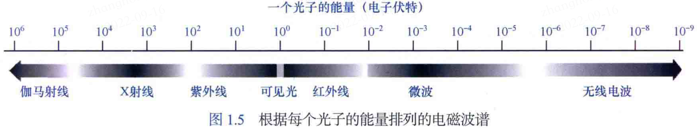

根据以上电磁波谱，可得到以下电磁波谱成像：

1. 伽玛射线成像：伽玛射线成像的主要用途包括核医学和天文观测。在核医学中，方法是将放射性同位素注入人体，同位素衰变时会发射伽玛射线，图像则由伽玛射线检测器收集到的放射线产生。下图展示了一幅使用伽玛射线成像得到的人体骨骼扫描图像。
2. X 射线成像：X 射线成像除了应用于医学诊断，还被广泛应用于工业和其他领域，如天文学。
3. 紫外波段成像。
4. 可见光和红外波段成像：应用领域最广，如光学显微镜、遥感图像、气象监测图像、工业自动视觉检测等。
5. 微波波段成像：主要应用是雷达。
6. 无线电波成像：应用领域如医学等磁共振成像（MRI）。

一些图像实例效果图如下图所示。
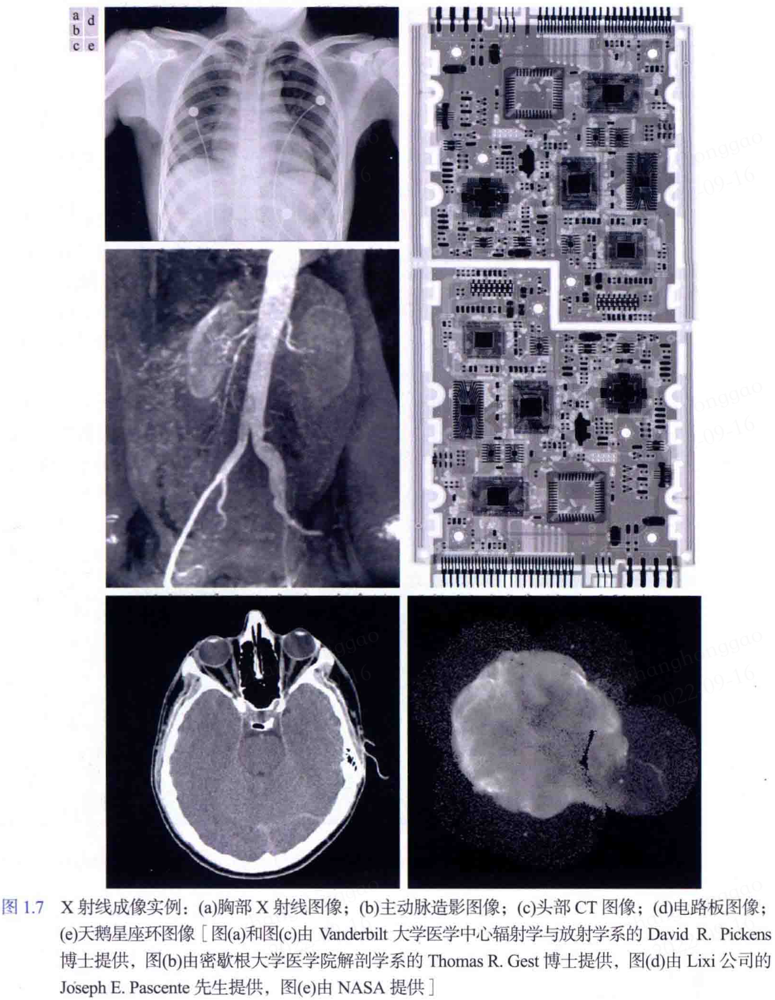
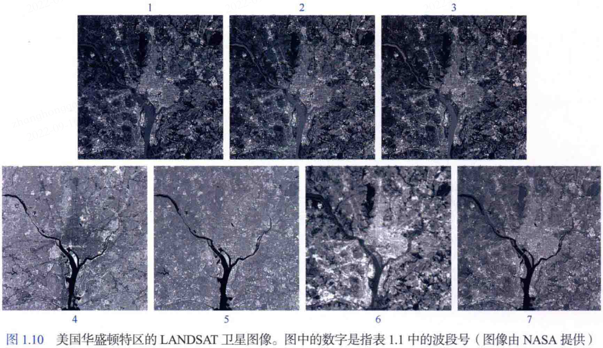

### 1.4，数字图像处理的基本步骤

本书中的数字图像处理步骤如下图所示。


### 1.5，图像处理系统的组成

略。

## 二，数字图像基础

**相机成像的原理**：针孔相机( Pinhole Camera )通过投影变换，可以将三维相机（Camera）坐标转换为二维的图像坐标，这个变换矩阵是相机的内在属性，称为相机内参（Camera Intrinsic） K。
> yaw 航向角，pitch 俯仰角，roll 翻滾角。

### 2.1，视觉感知要素

通过这节内容了解图像被人类感知的基本原理及人类视觉的物理限制。

#### 2.1.1，人眼的结构

下图显示了人眼的简化剖面图。

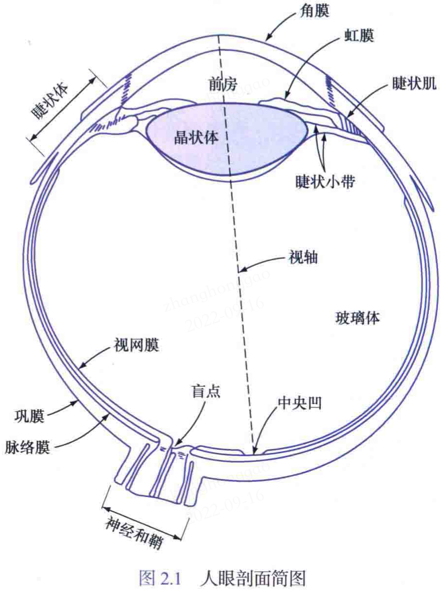

眼镜最靠内部的膜是视网膜，它布满了整个后部的内壁。眼睛聚焦时，来自物体的光在视网膜上成像。模式视觉由分布在视网膜表面上的哥哥分立光感受器提供，分为两类：锥状体和杆状体。锥状体视觉称为**明视觉或亮视觉**。杆状体视觉称为**暗视觉或微光视觉**。

#### 2.1.2，人眼中图像的形成

数码相机中，既有固定焦距的镜头，也有可变焦距的镜头，不同距离的聚焦时通过**改变镜头和成像平面之间的距离**来实现的。在人眼中，晶状体和成像区域（**视网膜**）之间的距离是固定的，正确的聚焦是通过改变晶状体的形状得到（远离压扁晶状体，接近目标则加厚晶状体），晶状体中心和沿视轴的视网膜之间的距离约为 17mm，焦距范围为 14~17 mm。下图所示的几何关系说明了在视网膜上所形成的图像的尺寸。令 $h$ 表示视网膜图像中物体的高度， 根据几何关系：$15/100 = h/17$，得到 h = 2.5 mm。

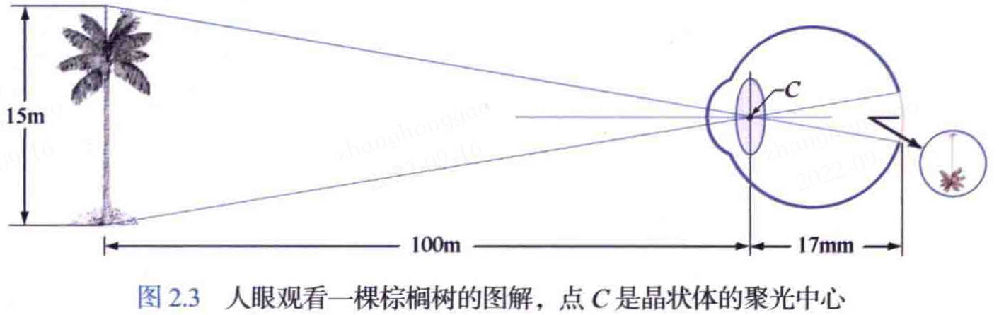

#### 2.1.3，亮度适应与辨别

以下两种现象表明人眼的感知亮度不是十几灰度的简单函数：
- “下冲”或“上冲”现象（马赫带效应）。
- 同时对比现象。


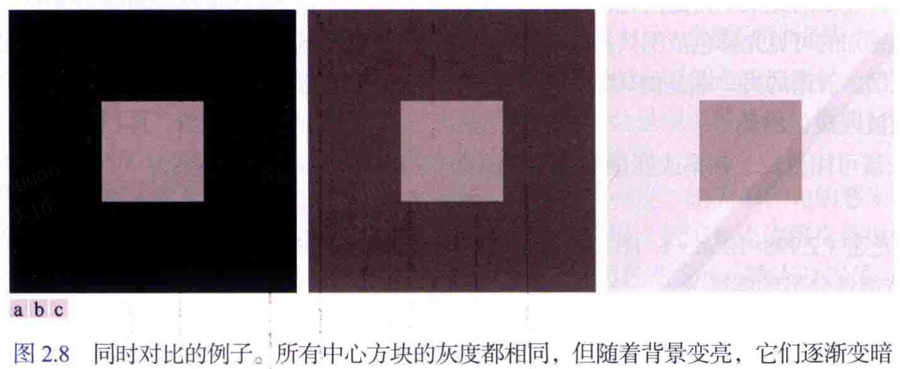

### 2.2，电磁波谱

更详细的电磁波谱图如下图所示。波长常用的单位是米（m），常用的单位是微米（表示为 $\mu m$，$1\mu m=10{^-6}m$）。

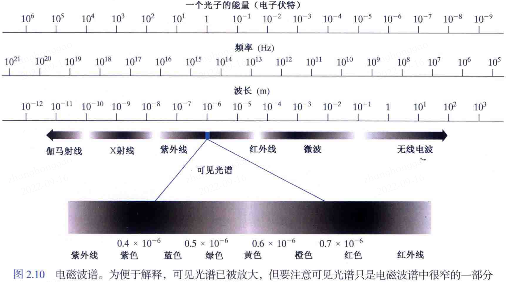

- 感知的物体颜色由物体反射的光的性质决定。
- 没有颜色的光称为**单色光或无色光**。
- 彩色光源的三个属性：频率、辐射、光通量和**亮度**。

### 2.3，图像感知与获取

将照射能量转换为数字图像主要由三种传感器配置：
- 使用单个传感器获取图像
- 使用条带传感器获取图像：如磁共振成像（MRI）和正电子发射断层成像（PET）等。
- 使用阵列传感器获取图像: 如单反相机和手机相机。

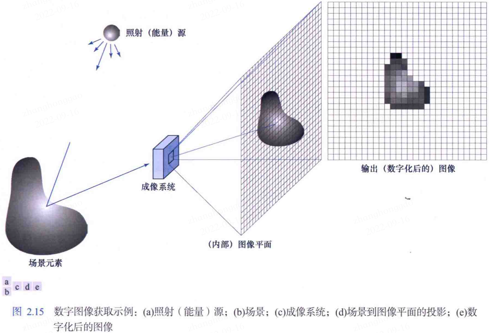

#### 2.3.1，一个简单的成像模型

如 1.1 节所述，我们用形如 $f(x,y)$ 的**二维函数**来表示图像，在空间坐标 (x,y) 处 $f$ 的值是一个标量，其范围 $0\leq f(x,y) < \infty$。

### 2.4，图像取样和量化

多少传感器的输出都是**连续**的电压被判刑，这些波形的幅度和空间特性都与正被感测的物理现象相关。要产生一幅数字图像，就需要把感测得到的连续数据转化为数字形式，这包括两个步骤：**取样和量化**。

#### 2.4.1，取样和量化的概念

一幅连续图像 $f$，对坐标值进行数字化称为**取样**（或采样），对幅度值进行数字化称为**量化**。
#### 2.4.2，数字图像表示

在计算机中，数字图像可用一个 $M\times N$矩阵表示，图像长为 $M$，宽为 $N$，矩阵中的每个元素即为图像的像素。

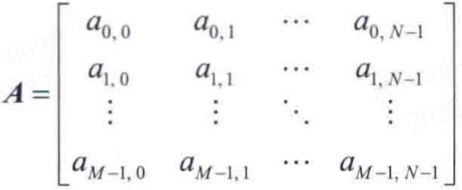

### 2.5，像素间的一些基本关系

- 像素的相邻像素
- 邻接、连通、区域和边界
- 距离测度：两个像素的距离，通过欧几里得（欧式）距离计算：$D(p,q) = \sqrt{[(x-u)^2 + (y-v)^2]}$
### 2.6，数字图像处理所用的基本数学工具

#### 2.6.1，对应元素运算和矩阵运算

涉及一幅或多幅图像的对应元素运算是逐个像素操作的，有因为在数字图像处理中，图像可以等效为矩阵，所以**图像之间的运算是可以用矩阵理论执行的**。

#### 2.6.2，线性运算和非线性运算（一般两个图像之间）

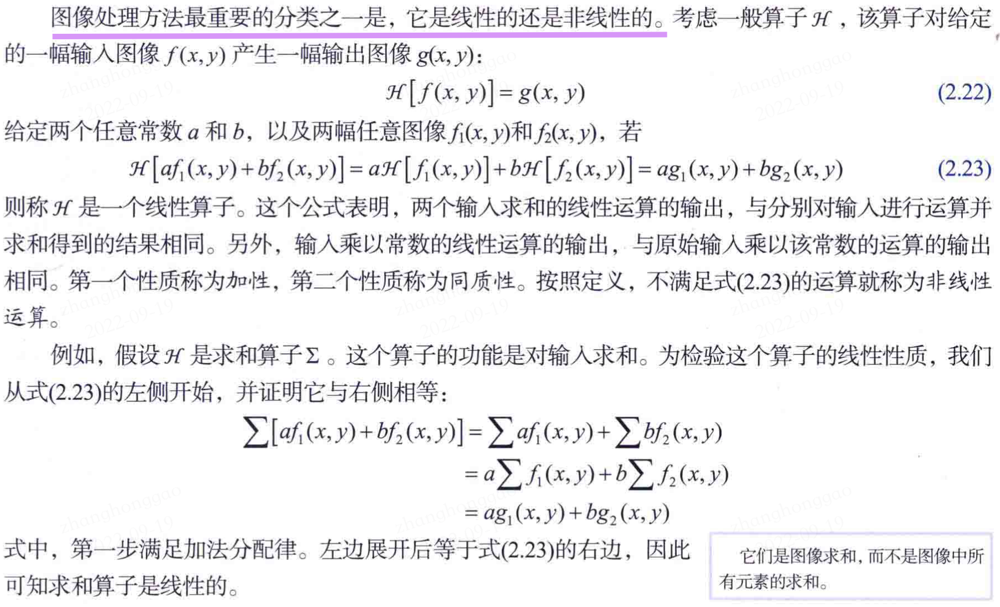

线性运算更为重要，包含了大量适用于图像处理的理论与实践成果；非线形运算范围比较有限。
#### 2.6.3，数字图像处理数学工具-算术运算（一般两个图像之间）
算术运算常用在特定的天文、医学等领域，将两幅图像经过算术运算从而得到更为清晰的图像，两幅图像的算术运算表示如下：

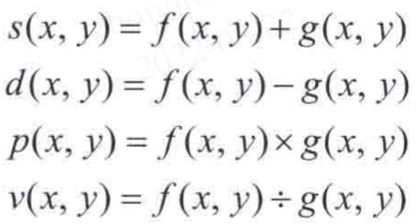

这些加减乘除运算都是对应的像素运算，算术运算一般有以下应用：

1. 使用图像相加（平均）降低噪声。
2. 使用图像相减比较图像。
3. 使用图像相乘/相除校正阴影和模板。

`3` 种算法运算的实际应用效果对比图如下所示：

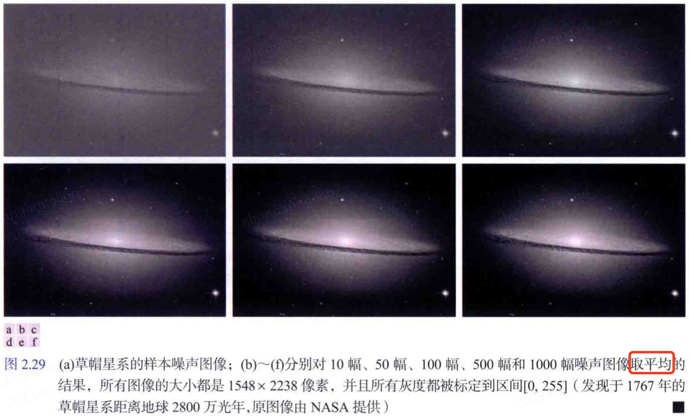

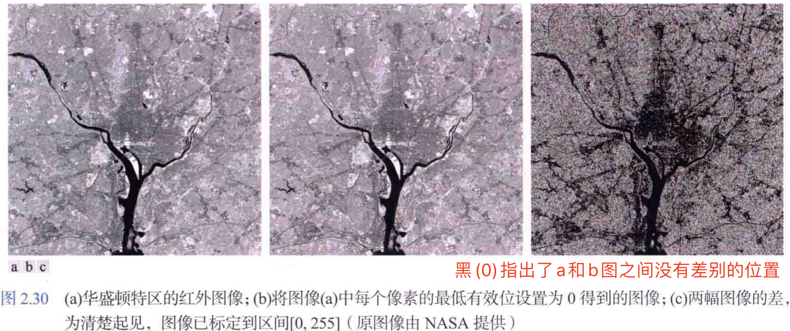

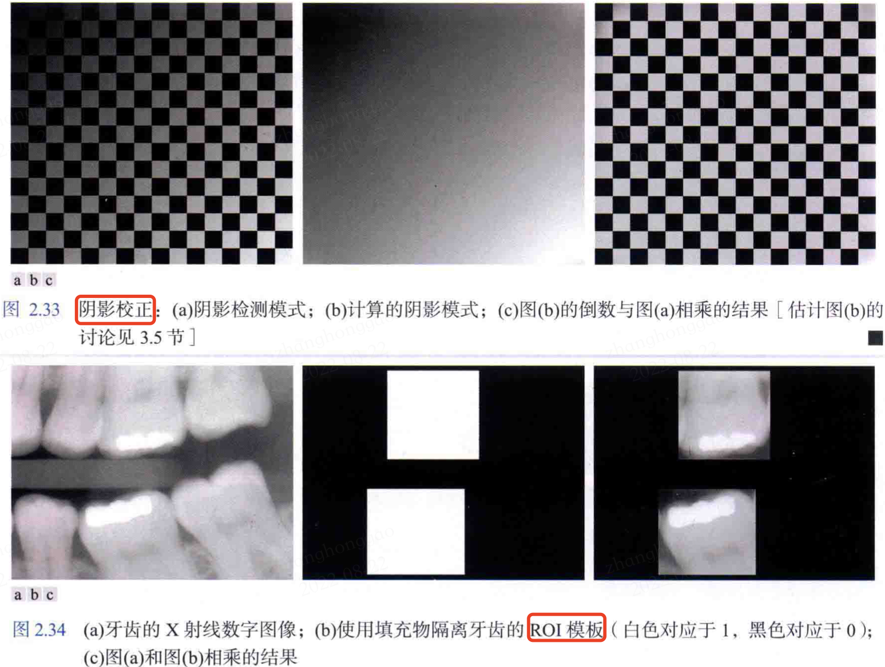

#### 2.6.4，集合运算和逻辑运算（一般两个图像之间）
**注意这里的集合运算针对的是二值图像，或者图像中所有像素具有相同的灰度值且**。

假设有两个集合 A 和，在数字图像处理中常见的集合运算有：
- 交集运算: $C = A\cap B$，满足交换律、结合律和分配律。
- 并集运算: $C = A\cup B$。

如果想要知道一幅**二值**图像中的两个目标 A 和 B 是否重叠，可通过计算 A\cap B$。如果结果不是空集，则可确定两个目标的某些元素是有重叠的。
#### 2.6.5，空间运算（单幅图像）

空间运算是直接对单幅图像的像素执行数学操作，分为三类：（1）单像素运算；（2）领域运算；（3）几何空间运算。

##### 2.6.5.1，单像素操作
用一个变化函数$T$改变图像中各个像素的灰度: 

$$s = T(z)$$

上述公式对应单像素操作，$z$是原图像中像素的灰度，$s$是处理后图像中对应像素的（映射）的灰度。

##### 2.6.5.2，领域运算
令 $S_{xy}$ 代表图像 $f$中以任意一点 $(x,y)$ 为中心的一个邻域的做标集，领域处理后，输出图像$g$中的相同坐标处会生成一个新的像素，该像素的值由输入图像中邻域像素的规定运算和集合$S_{xy}$中的坐标确定。假设**领域运算**对应的是计算大小为$m\times n$、中心为$(x,y)$的矩形领域中像素的平均值，且这个区域中的像素坐标是集合$S_{xy}$的元素，那么其对应的领域运算公式如下：

$$g(x,y) = \frac{1}{mn} \sum_{(r,c)\in S_{xy}}f(r,c)$$

上述公式中，$r$和$c$是像素的行和列坐标，属于集合$S_{xy}$，图像$g$是通过移动坐标$(x,y)$，使得领域的中心逐个移过图像$f$中的所有像素，然后在每个新位置都重复这一**领域运算**得到，对应的示意图如下：

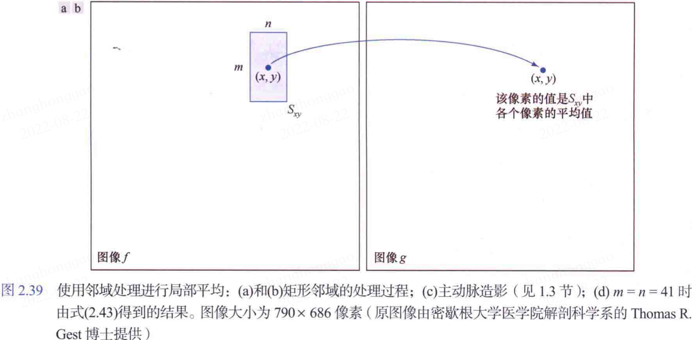

简单理解所谓的领域运算就是对特定 roi 区域的所有像素，做特定操作，而这个操作就是以指定位置 $(x,y)$ 为中心，邻域范围为 $m\times n$，对这个范围内的像素取平均/求和/最大值/等。
> 典型的就是 `CNN` 模型中卷积层的滤波器操作。

##### 2.6.5.3，几何变换
**几何变换即改变图像中像素的空间排列**，由两种基本运算组成：

1. 坐标的空间变换；
2. 灰度内插，即为变换后的像素赋灰度值（灰度图）。

坐标变换公式可表示为：

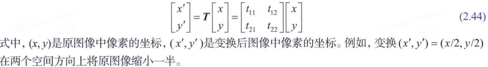

最为重要的是**放射变换**，它包括**缩放变换、平移变换、旋转变换和剪切变换**。式(2.44)无法表示平移变换（需要在公式右侧添加一个常数二维向量），所以需将上式升级为，如下所示的齐次坐标变换。

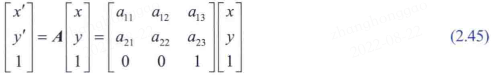

常见图像几何操作对应的仿射矩阵 `A` 、变换坐标公式以及示意图如下表所示：

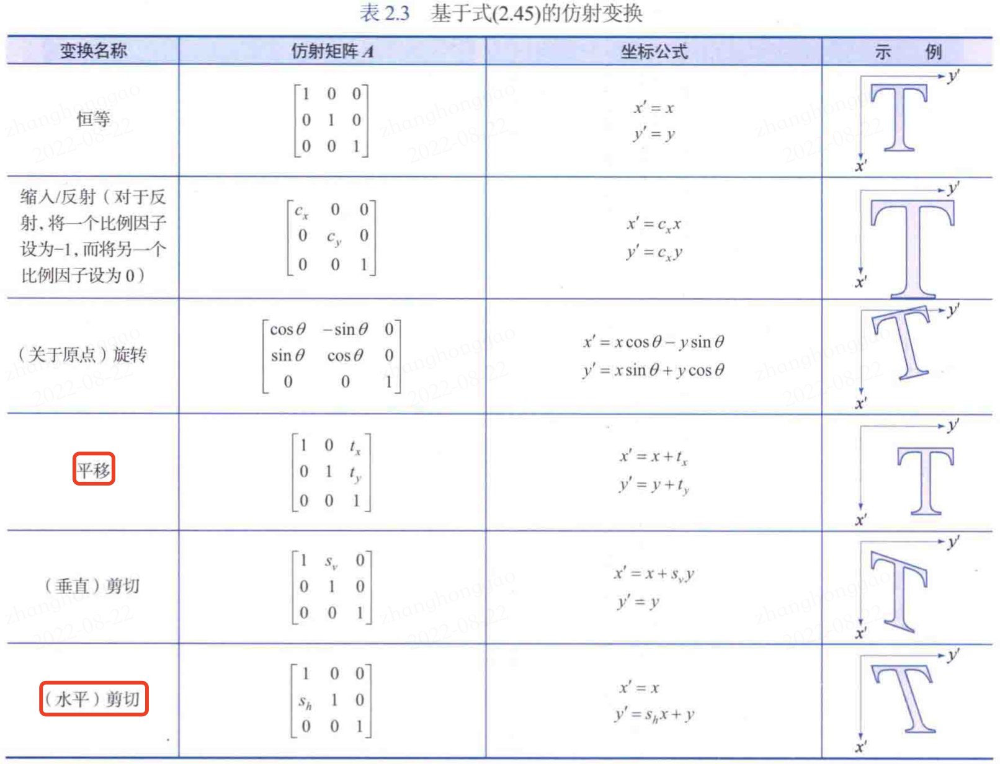

## 三，灰度变换与空间滤波

空间域指的是图像平面本身，空间域中的图像处理方法是**直接对图像中的像素进行处理**。空间域图像处理的两个主要类别是:
- **灰度变换**: 如对比度处理和图像阈值处理等任务，直接对图像的给个像素进行操作。
- **空间滤波**: 如图像平滑和锐化，对图像中的每个像素的邻域进行操作。

### 3.1，背景

本章中讨论的所有图像处理技术都是在空间域中实现的，所谓的空间域即包含图像中像素的平面。空间域技术直接操作图像中的像素，而频率域技术操作的是图像的傅立叶变换而非图像本身。
> 由图像的坐标张成的实平面部分称为空间域，$x$和$y$称为空间变量或空间坐标。

尽管灰度变换和空间滤波的应用范围广泛，但本书中的大多数例子是关于图像增强的。所谓图像增强技术，是为了某些特定应用对原图像进行加工的技术，不具备通用性。

### 3.2，一些基本的灰度变换函数

通过灰度变换函数$T$将原来的像素值$r$映射为像素值$s$。灰度变换中常用的 `3` 类基本函数是线性（反转和恒等变换: 输入灰度和输出灰度相同）函数、对数（对数和反对数变换）函数和幂律（n次幂或n次根）函数。

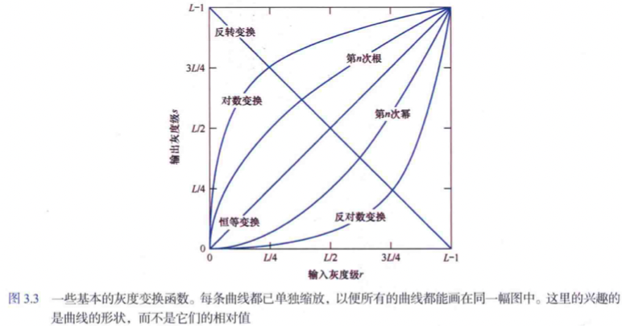

#### 3.2.1，图像反转

假设原图像像素值为$r$，灰度级在区间为 [0, L-1]，则起反转后的图像形势为
$$s=L-1-r$$

图像反转实例效果图如下所示：

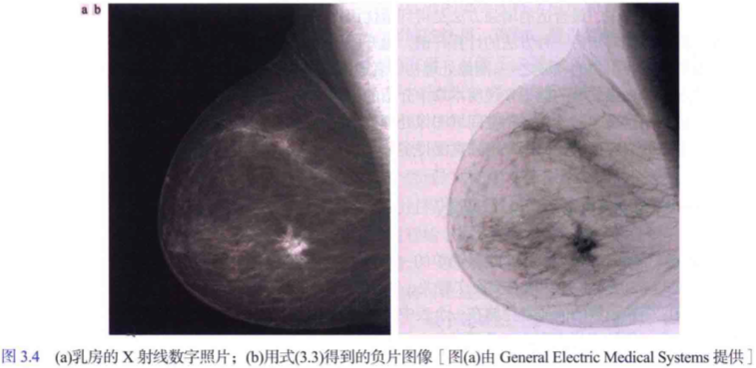

#### 3.2.2，对数变换

对数变换的形势为

$$s = clog(1+r)$$

图3.3中对数曲线的形状表明，对数变换会将输入中范围较窄的低灰度值映射为输出中范围较宽的灰度级。例如区间 [0, L/4]中的输入灰度级映射到 [0, 3L/4] 中的输出灰度级；相反输入中的高灰度级被映射为输出中范围较窄的灰度级。

#### 3.2.3，幂律变换（伽玛变换）

幂律变换形势为

$$s = cr^\gamma $$

#### 3.2.4，分段线性变换函数

1. **对比度拉伸**


2. **灰度级分层**

有些图像增强应用的目的是为了突出图像中的特定灰度空间，比如增强卫星图像中的特征、增强 X 射线图像中的缺陷等。灰度级分层可以基于两个基本方法及其变体来实现。
- 一种方法是将感兴趣范围内的所有灰度值显示为一个值（如白色），而将其他范围的灰度值显示为另一个值（黑色），这种变换会得到一个二值图像。
- 另一种方法是基于图3.11(b)中的变换，使期望的灰度范围变亮（或变暗），但保持图像中的其他灰度级不变。

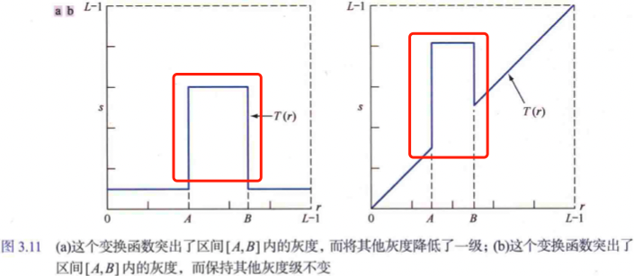

灰度级分层的实际应用例子如下图所示
> 我个人感觉这个应用得根据实际专业场景结合起来使用，难点在于**灰度级范围的选择**。

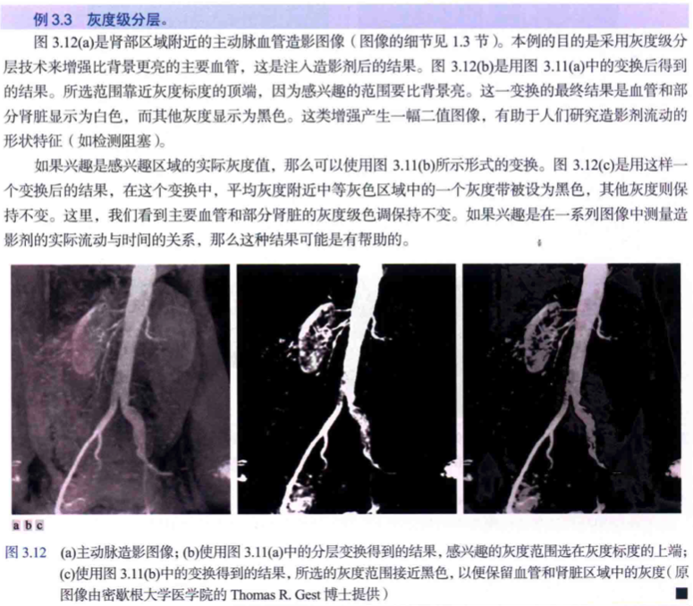

3. **比特平面分层**

略。

### 3.3，直方图处理

令 $r_k(k = 0,1,2...L-1)$ 表示一幅$L$级灰度数字图像 $f(x,y)$ 的灰度。 $f$ 的**非归一化直方图**定义为

$$h(r_{k}) = n_{k}, k = 0,1,2...L-1$$

式中,$n_k$是$f$中灰度为$r_k$的像素的数量，并且细分的灰度级称为直方图容器。类似地，归一化直方图定义为

$$p(r_{k}) = \frac{h(r_{k})}{MN} = \frac{n_{k}}{MN}$$

式中，$M$ 和 $N$ 分别是图像的行数和列数。对$k$的所有值，$p(r_{k})$的和总是 1.

下显示了具有 4 个基本灰度特性的图像: 

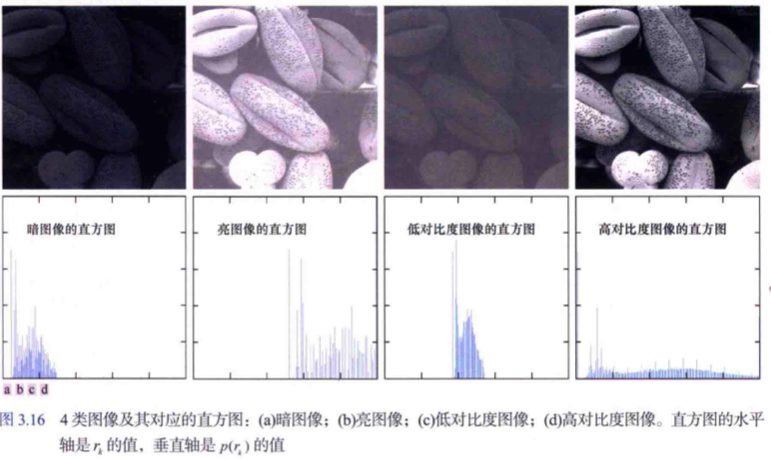

从上图的分析我么可以得出这样一个结论: **即像素占据整个灰度级范围并且均匀分布的图像，将具有高对比度的外观和多种灰色调**。最终结果将是显示了大量灰度细节并具有高动态范围的一副图像。

#### 3.3.1，直方图均衡化

1，直方图均衡化所用的**变换函数**如下（推导过程复杂，跳过，感兴趣的可以阅读原书了解过程）

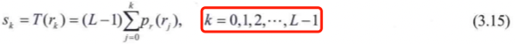

2，**直方图均衡化的目的**是为了生成一幅具有均匀直方图的输出图像。

3，直方图均衡化效果示例如下图所示:

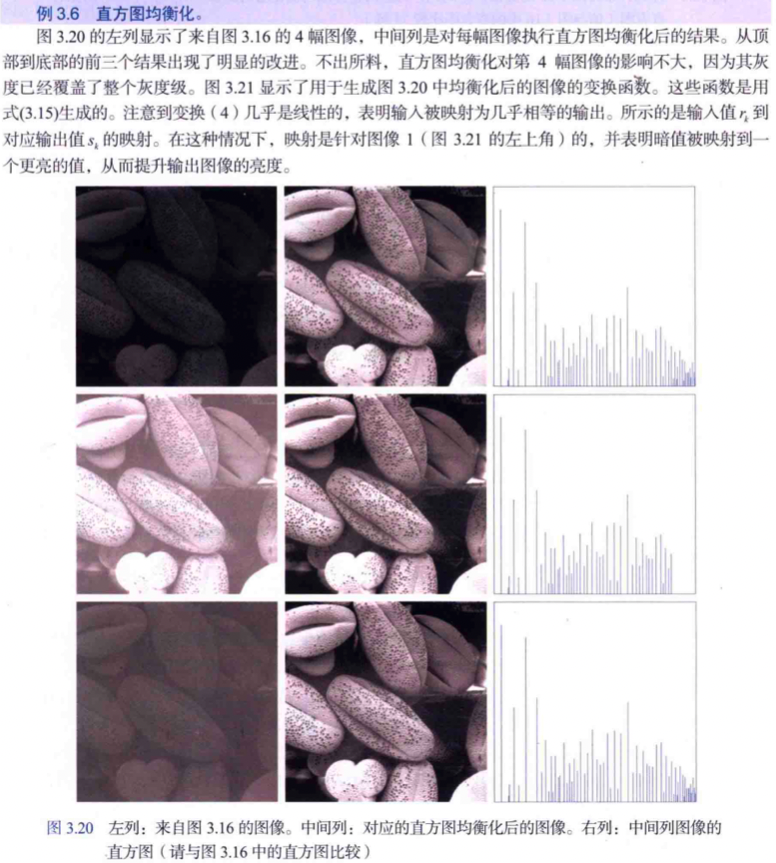
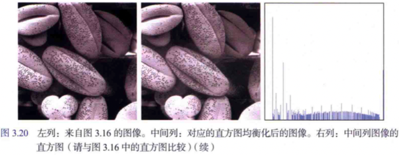

**直方图均衡化效果总结分析**：尽管 4 个直方图都不同，但直方图均衡化后的图像是很相似的，因为原来的 4 个图的基本区别是对比度而非内容。

#### 3.3.2，直方图匹配（规定化）

**直方图匹配（规定化）定义**：用于生成具有规定直方图的图像的方法称为直方图匹配（规定化）。

直方图规定化的推导过程较为复杂，请参考原书。本笔记中，直接看特定的一幅图像经过直方图均衡化和规定化的对比结果。

1，直方图均衡化后的效果图如下所示（有噪声）：

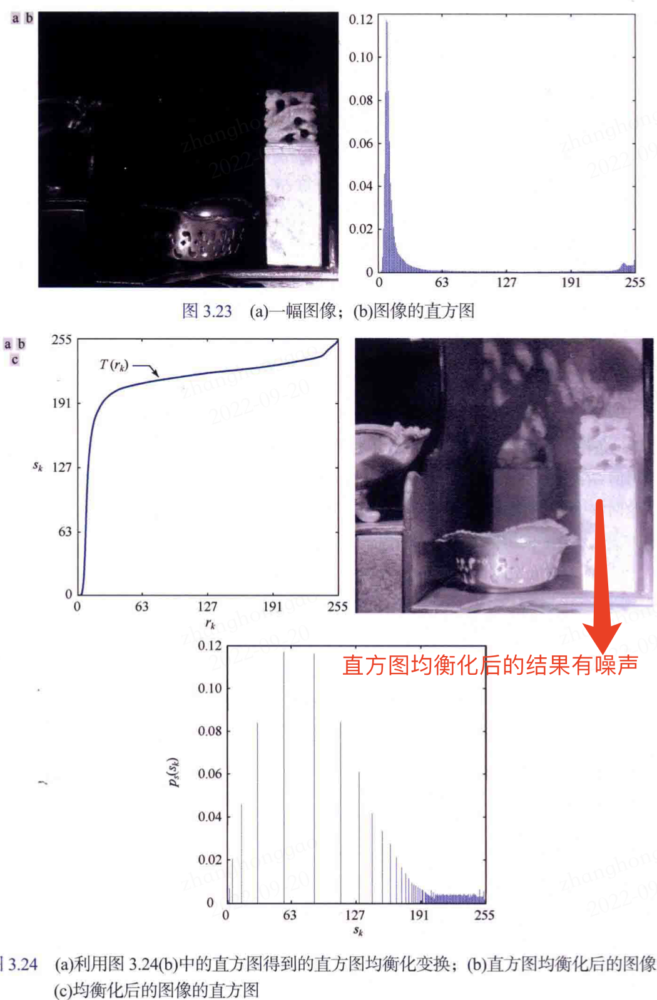

2，直方图规定化后的效果图如下所示（无噪声）:

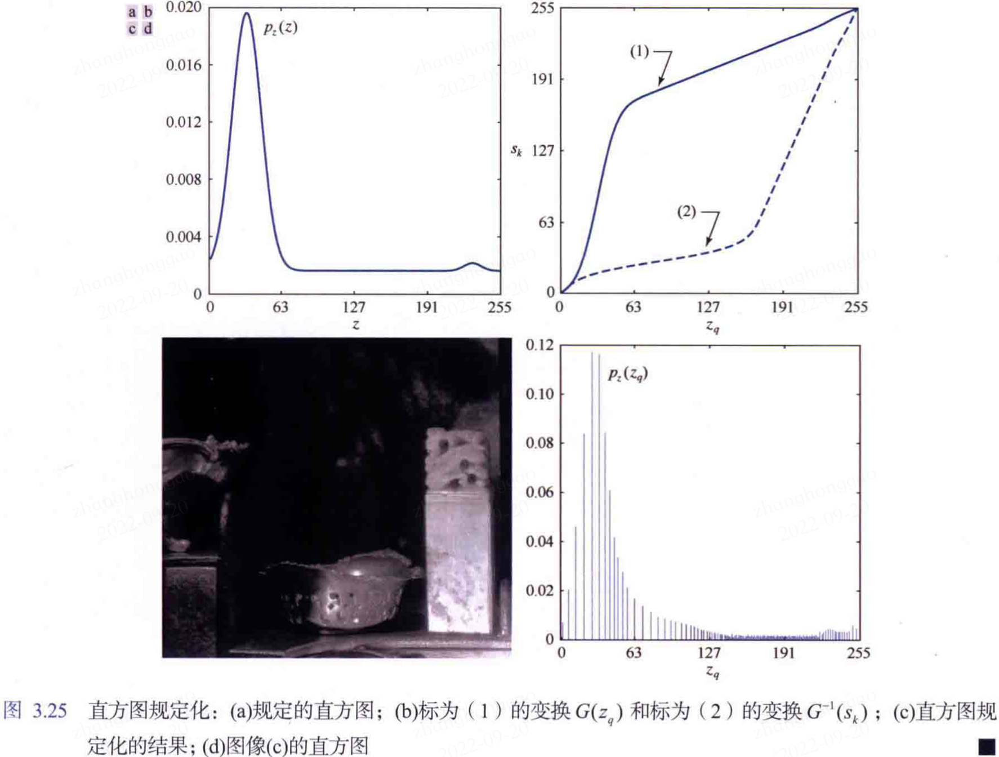

#### 3.3.3，局部直方图处理

直方图均衡化和直方图规定化的直方图处理方法都是全局性的，因为像素是由基于整个图像的灰度分布的变换函数修改的。当目的是为了解决**增强图像中几个小区域的细节**时，解决方法是设计**基于像素邻域的灰度分布的变换函数**。

局部直方图的处理过程:
1. 定义一个邻域，并将其中心在水平方向或垂直方向上从一个像素移动到另一个像素。
2. 在每个位置，计算邻域中的各点的直方图，得到直方图均衡化或直方图规定化变换函数，将这个函数映射于邻域中心点像素的灰度。
3. 然后将邻域的中心移到一个相邻像素位置，并重复上述过程。

局部直方图均衡化效果如下图所示:

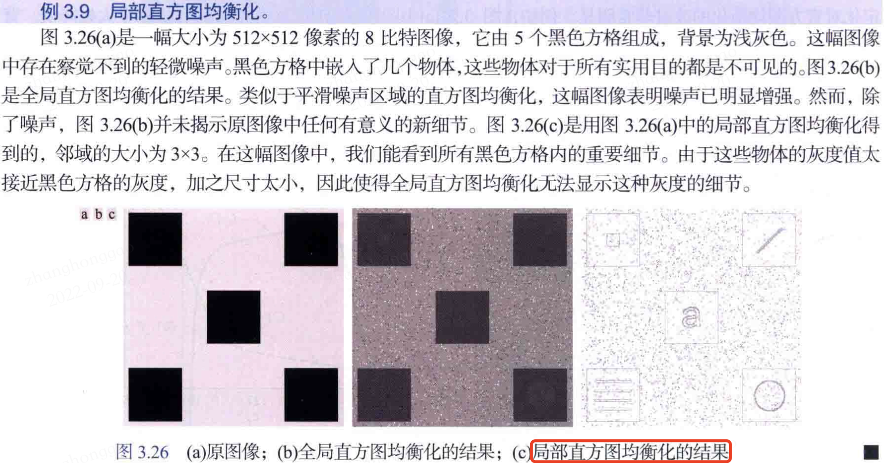

#### 3.3.4，使用直方图统计增强图像
直接从图像直方图得到的统计量信息可用于增强图像。令$r$是一个离散型随机变量，它表示区间$[0,L-1]$内的灰度值；令$p(r_i)$是相对于灰度值$r_i$的归一化直方图分量。即$p(r_i)$可视为灰度$r_i$的概率密度函数，并可得到图像的直方图。

1，**均值是平均灰度的测度**，图像像素灰度的均值$m$计算公式如下:
$$m = \sum_{i=0}^{L-1}r_{i}p(r_i)$$

2，**方差（或标准差$\sigma$）是图像对比度的测度**，方差公式如下:

$$\sigma^2 = \mu_2 = \sum_{i=0}^{L-1}(r_{i}-m)^{2}p(r_i)$$

> 简单理解图像灰度均值和方差的意义就是，均值越大，图像越亮；方差越大，图像对比度越高。

上述公式是针对图像全局的，其同样可应用于一个规定大小的邻域空间。结合以上公式和概念可以使用直方图统计增强局部图像，示例如下:

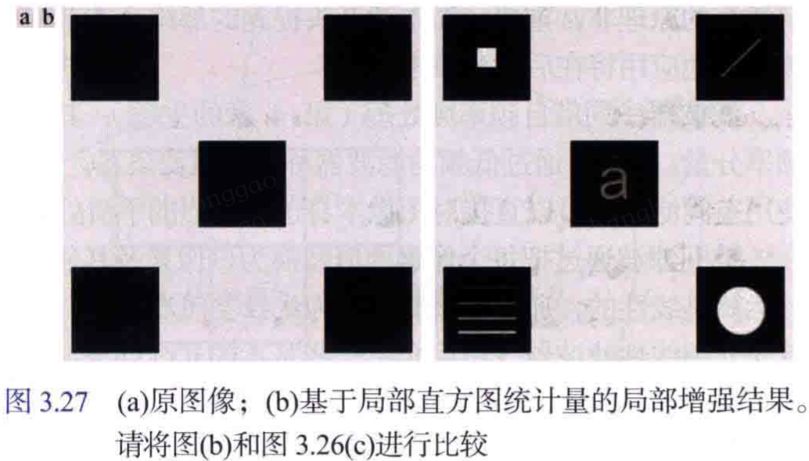

令$f(x,y)$表示原图在图像坐标$(x,y)$处的灰度值，令$g(x,y)$表示增强后的图像在这些坐标处的灰度值，具体的图像增强公式如下:

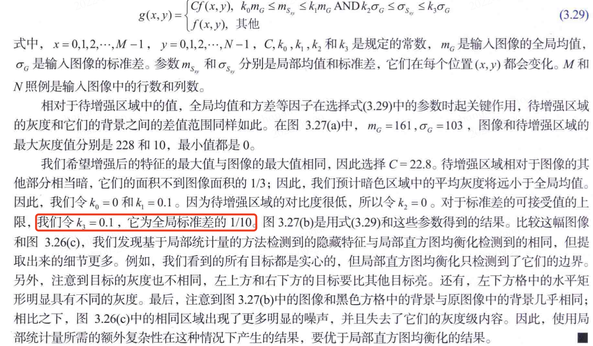
> 更详细的具体操作方法细节参考原书，本文略过。

### 3.4，空间滤波基础

> 本节内容讨论如何使用空间滤波器进行图像处理。**滤波有时要分多个阶段完成**。

滤波器一词来自频率域处理（第四章），滤波的意思是指通过修改或抑制图像的规定分量。例如，通过低频的滤波器称为**低通滤波器**。低通滤波器的作用是**通过模糊图像**来平滑图像，使用空间滤波器可以**直接**对图像本身进行类似效果的平滑处理。

#### 3.4.1，线性空间滤波的原理

**线性空间滤波定义**: 指图像$f$与滤波器核$w$进行乘积之和（卷机）运算。核是一个阵列，其大小定义了运算的邻域，其系数决定了该滤波器（也称模板、窗口滤波器）的性质。

下图3.28说明了使用$3\times3$核进行**线性空间滤波的原理**。在图像任何一点$(x,y)$处，滤波器的响应$g(x,y)$是核系数核核所覆盖图像像素的乘积之和:

$$g(x,y) = w(-1,-1)f(x-1,y-1)+w(-1,0)f(x-1,y)+...+w(0,0)f(x,y)+...+w(1,1)f(x+1,y+1) \tag{3.30}$$

核的中心系数值 $w(0,0)$ 对应于 $(x,y)$ 处的像素。对应大小为 $m\times n$ 的核，假设 $m=2a+1$ 和 $n=2b+1$，其中$a$和$b$是非负整数。一般来说，大小为 $m\times n$ 的核对大小为 $M\times N$ 的图像的线性空间滤波可表示为:

$$g(x,y) = \sum_{s=-a}^{a}\sum_{t=-b}^{b} w(s,t)f(x+s, y+t) \tag{3.31}$$

上式中$x$和$y$发生变化，使得滤波器核的中心（原点）能够遍历完图像$f$中的每个像素。
#### 3.4.2，空间相关与卷积

图 3.28 以图形方式说明了空间相关，式(3.31)给出了其数学描述。相关的运算过程如下：在图像上移动核中心，并且在每个位置计算乘积之和。

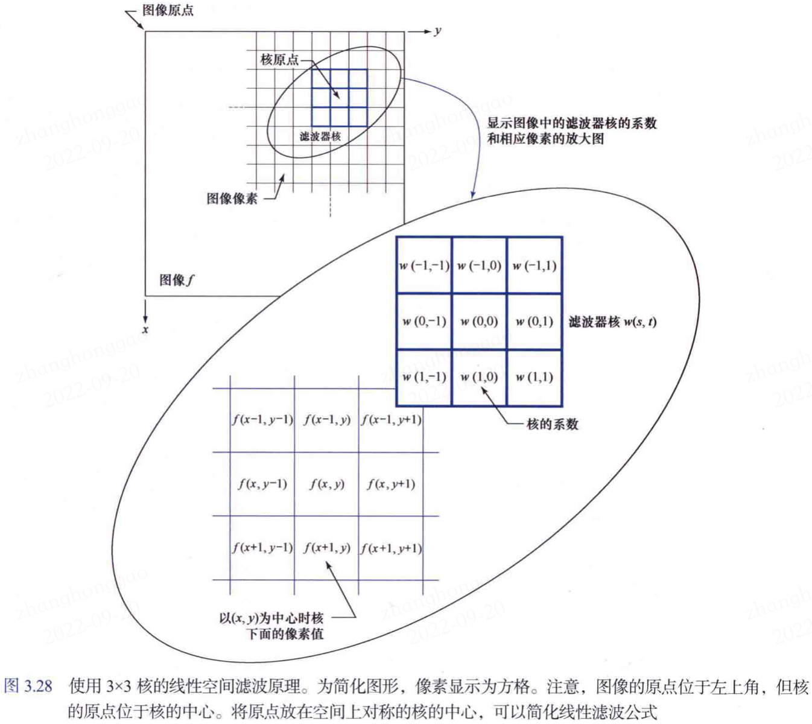

以一维例子开始，则式(3.31)变为

$$g(x) = \sum_{s=-1}^{a}w(s)f(x+s)$$

式中，卷机核为$w$，图像函数为$f$。

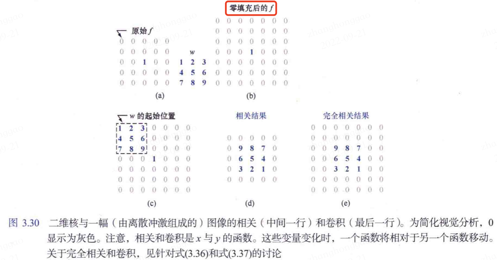

在本书中，当我们使用线性空间滤波这个术语时，指的是滤波器核与图像进行卷机（乘积和）运算。
### 3.5，平滑（低通）空间滤波器

平滑（也称平均）空间滤波器用于降低灰度的急剧过渡，因为随机噪声通常就是由灰度的急剧过渡组成，所以平滑的一个明显应用就是**降噪**。

本节介绍基于可分离盒式核和高斯核的低通滤波器。

1，**基于可分离盒式核的低通滤波器**
最简单的可分离低通滤波器核是**盒式核**，其系数的值相同（通常为1）。

下图3.31(a)中显示了一个大小为$3\times 3$的盒式滤波器，即一个大小为$m\times n$的盒式滤波器且元素值为 1 的一个$m\times n$阵列，器前面有一个归一化的常数，它的值是 1 除以系数值之和（当所有系数都为1时，这个常数为$1/mn$）。

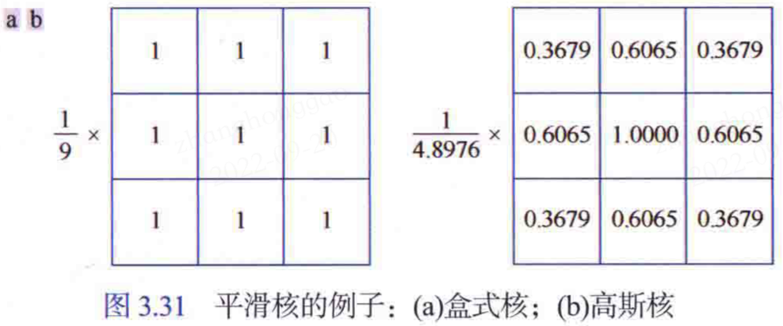

使用不同盒式核对图像进行低通滤波的效果图如下所示:

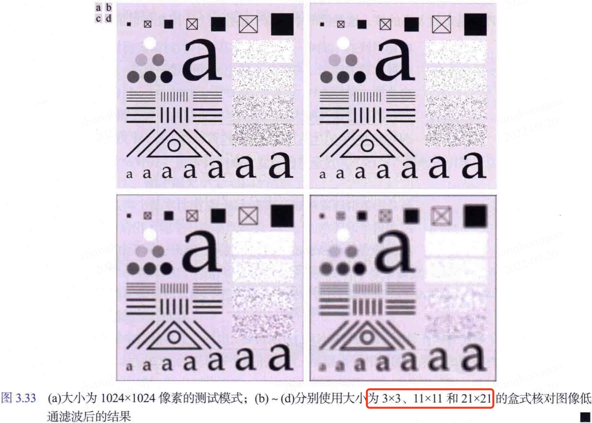

盒式滤波器较为简单，适合快速实验，其会产生视觉上能够接受的平滑效果。盒式滤波器有一些局限:
1. 对透镜模糊特性的近视能力较差。
2. 盒式滤波器往往沿垂直方向模糊图像，不适合精细细节或具有强几何分量的图像应用。

对应的 opencv 函数如下。
```cpp
void boxFilter( InputArray f, OutputArray dst, int ddepth,
                             Size ksize, Point anchor=Point(-1,-1),
                             bool normalize=true,
                             int borderType=BORDER_DEFAULT );
```

参数 6 的解释：
- 当 `normalize = true` 时，盒式滤波就变成了均值滤波。也就是说，**均值滤波是盒式滤波归一化（normalized）后的特殊情况**。其中，归一化就是把要处理的量都缩放到一个范围内，比如(0,1)，以便统一处理和直观量化。
- 当 `normalize = false` 时，为非归一化的盒式滤波，用于计算每个像素邻域内的积分特性，比如密集光流算法（dense optical flow algorithms）中用到的图像倒数的协方差矩阵（covariance matrices of image derivatives）。

> 均值滤波，是最简单的一种线性滤波操作，输出图像的每一个像素是核窗口内输入图像对应像素的像素的平均值( 所有像素加权系数相等)，实质就是归一化后的方框滤波。均值滤波算法比较简单，计算速度快，但是均值滤波本身存在着固有的缺陷，即**它不能很好地保护图像细节**，在图像去噪的同时，也破坏了图像的细节部分，从而使图像变得模糊，不能很好地去除噪声点。但均值滤波对周期性的干扰噪声有很好的抑制作用。


#### 3.5.2，低通高斯滤波器核
实际应用中要求卷积核是各向同性的（圆对称），其响应与方向无关。高斯核是唯一可分离的圆对称核，因此非常适合图像处理，对于**抑制服从正态分布的噪声非常有效**。高斯核定义:

$$w(s,t) = G(s,t) = Ke^{-\frac{s^2+t^2}{2\sigma^2}}$$

令$r=[s^2+t^2]^{1/2}$，上式可写为

$$G(r) = Ke^{-\frac{r^2}{2\sigma^2}}$$

这个函数依然是圆对称的，变量$r$表示从中心到函数$G$上任意一点的距离，它必须是正数且是奇数。下图显示了不同大小的核的$r$值。

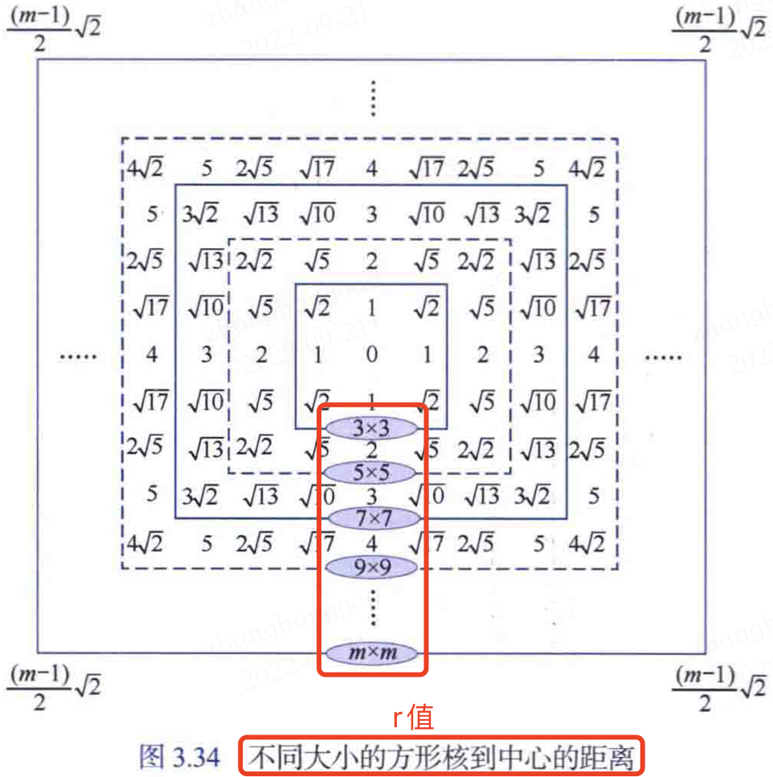

**希望产生更均匀的平滑结果时，通常使用高斯核平滑**；盒式核平滑则是硬过渡。

高斯核和盒式核平滑特性的比较对比图如下:


#### 3.5.3，低通滤波代码示例

盒式滤波、均值滤波（归一化后的盒式滤波）、高斯滤波的python-opencv应用代码如下。

```python
import cv2 as cv
import numpy as np
from matplotlib import pyplot as plt

img = cv.imread('test.png')

blur1 = cv.boxFilter(img, -1 ,(3,3),normalize = False)
blur2 = cv.boxFilter(img, -1 ,(3,3),normalize = True)
blur3 = cv.GaussianBlur(img,(5,5),0)

plt.figure(figsize=(20,20)) #设置窗口大小

plt.subplot(221),plt.imshow(img),plt.title('Original')
plt.xticks([]), plt.yticks([])

plt.subplot(222),plt.imshow(blur1),plt.title('boxFilter_normalize_false')
plt.xticks([]), plt.yticks([])

plt.subplot(223),plt.imshow(blur2),plt.title('boxFilter_normalize_true')
plt.xticks([]), plt.yticks([])

plt.subplot(224),plt.imshow(blur3),plt.title('Gaussian')
plt.xticks([]), plt.yticks([])

plt.show()
```
程序运行后输出如下：

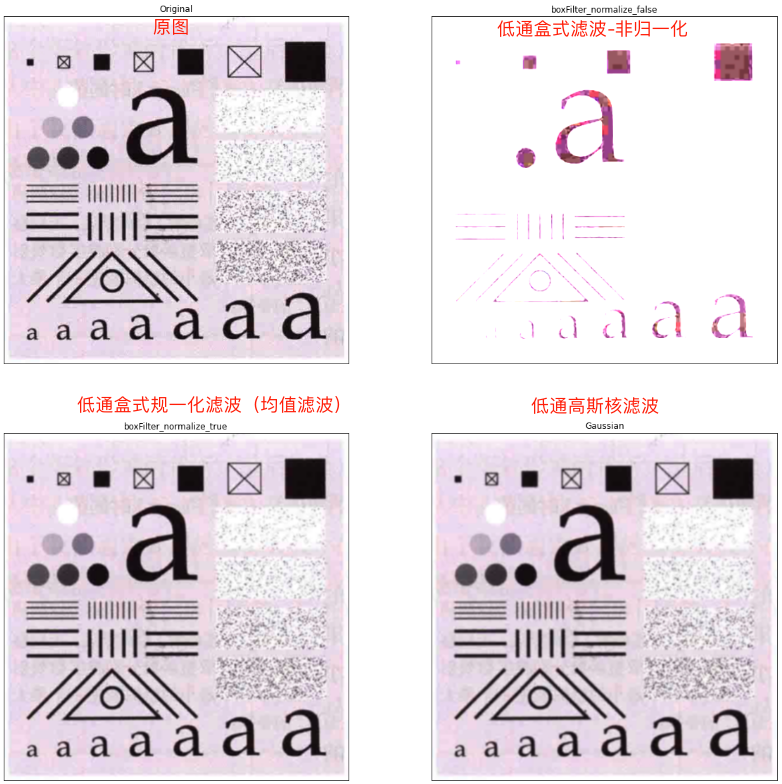

非归一化的时候，得到图像就是一片白色，对源图像毁坏太大，根本无法使用。而归一化的时候，得到图像是一种模糊的效果，此时与均值滤波一样。

### 3.6，锐化（高通）空间滤波器

**锐化的作用**是突出灰度中的过渡。前面讲的平滑（低通）滤波（图像模糊）通过积分运算实现的，那可以推断出图像锐化可以用微分实现。

#### 3.6.1，基础

**导数**（英语：derivative）是微积分学中的一个概念。函数在某一点的导数是指这个函数在这一点附近的变化率。导数的本质是通过极限的概念对函数进行局部的线性逼近。当函数$f$的自变量在一点 $x_{0}$ 上产生一个增量 $h$ 时，函数输出值的增量与自变量增量 $h$ 的比值在 $h$ 趋于 0 时的极限如果存在，即为 $f$ 在 $x_{0}$ 处的导数，记作 $f'(x_{0})$ 或 $\frac{\mathrm{d} f}{\mathrm{d} x}x_0$ 或 $\frac{\mathrm{d} f}{\mathrm{d} x}\mid_{x=x_0}$。例如在运动学中，物体的位移对于时间的导数就是物体的瞬时速度。

导数是函数的局部性质。不是所有的函数都有导数，一个函数也不一定在所有的点上都有导数。若某函数在某一点导数存在，则称其在这一点可导(可微分)，否则称为不可导(不可微分)。如果函数的自变量和取值都是实数的话，那么函数在某一点的导数就是该函数所代表的曲线在这一点上的切线斜率。

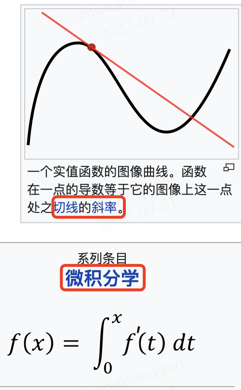

**导数一般定义如下**：

直观上 $f(x)-f(a)$ 代表函数值从$a$到$x$的变化量，那么，
$$\frac{f(x)-f(a)}{x-a}$$
代表的是从 $a$ 到 $x$ 的平均变化率。若实函数$f$于实数$a$有定义，且以下极限:
$$\lim_{x\rightarrow a} \frac{f(x)-f(a)}{x-a}$$
存在则称 $f$ 在 $a$ 处可导。
> 来源维基百科[导数定义](https://zh.wikipedia.org/wiki/%E5%AF%BC%E6%95%B0)。

一维函数$f(x)$的一阶导数的一个基本定义是**差分**：
$$\frac{\partial f}{\partial x} = f(x+1)-f(x) \tag{3.48}$$

同理可将$f(x)$的**二阶导数定义为差分**:

$$\frac{\partial ^{2}f}{\partial x^{2}} = f(x+1)+f(x-1)-2f(x) \tag{3.49}$$

#### 3.6.2，使用二阶导数锐化图像-拉普拉斯

使用二阶导数锐化图像的方法：首先定义二阶导数的离散公式，然后在这个公式的基础上构造一个滤波器核。对于两个变量的函数（图像$f(x,y)$）其中拉普拉斯算子（核）的定义如下:
$$ \Delta f= \frac{\partial ^{2}f}{\partial x^{2}}+ \frac{\partial ^{2}f}{\partial y^{2}} \tag{3.50}$$

因为任意阶的导数都是线性算子，所以**拉普拉斯是线性算子**。

由差分和拉普拉斯二阶导数的定义可得如下公式:

$$\Delta f = f(x+1, y) + f(x-1, y) + f(x, y+1) + f(x, y-1)-4f(x,y) \tag{3.53}$$

上述公式可以用图3.45(a)中的核进行卷积运算来实现；因此，图像锐化的滤波原理类似于3.5节内容所述的低通滤波，**只是这里使用不同的核系数**。

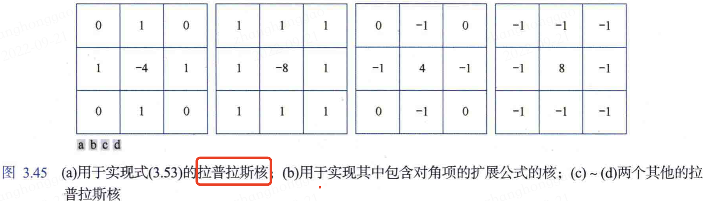

**使用拉普拉斯算子锐化图像的方法描述如下**:

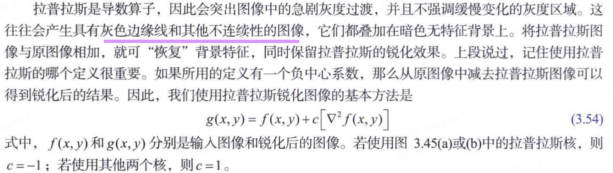
> 直接的拉普拉斯图像往往是黑色和无特征的。

拉普拉斯应用示例如下:
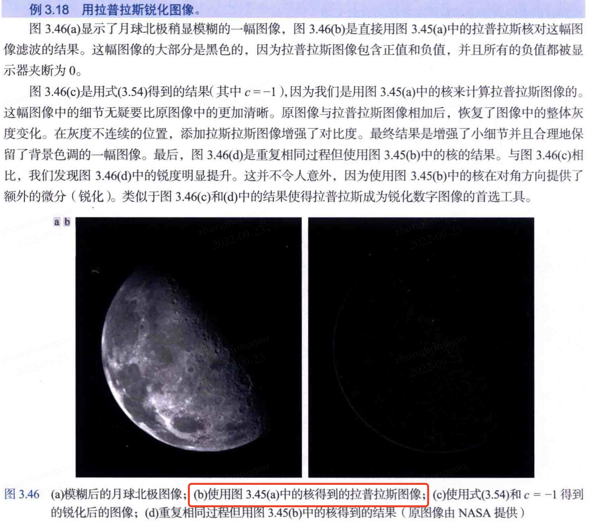

#### 3.6.3，钝化掩蔽和高提升滤波

从原图像减去一幅钝化（平滑后）图像，是20世纪30年代以来印刷和出版业一直用来锐化图像的方法，这个过程称为**钝化掩蔽**，步骤如下：
1. 模糊原图像。
2. 从原图像减去模糊后的图像（产生的差称为模板）。
3. 将模板与原图像相加。

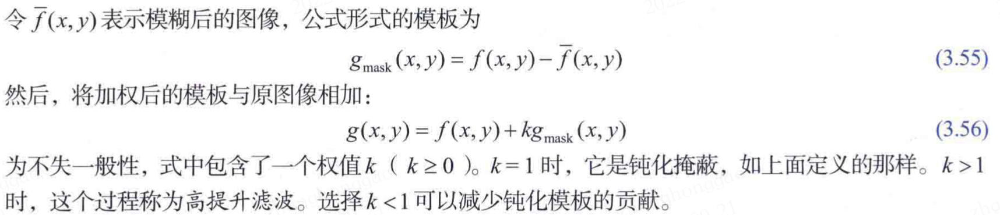
> 注意较大的 k 值会产生令人无法接受的图像。

钝化掩蔽效果示例：

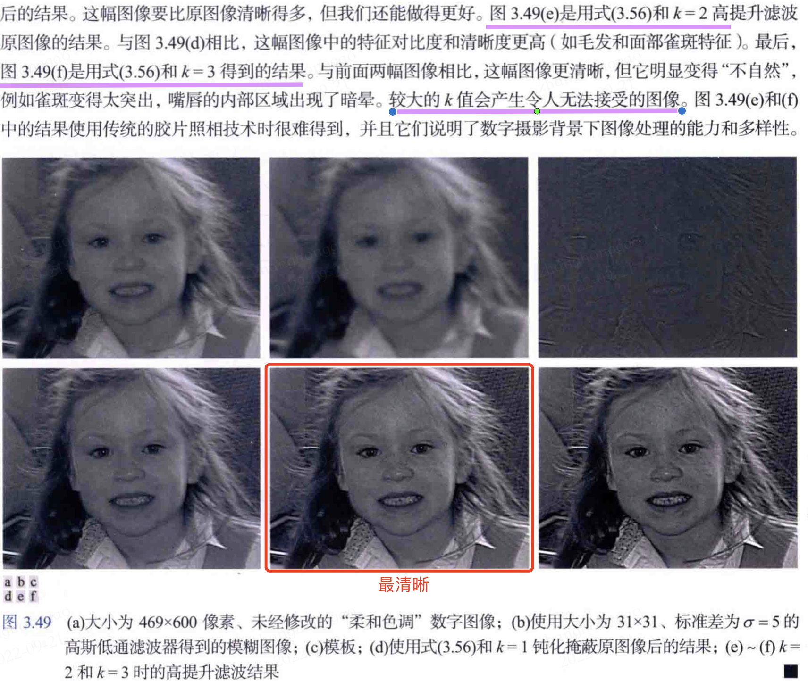

#### 3.6.4，使用一阶导数锐化图像-梯度

包括罗伯特交叉梯度算子和 `Sobel` 算子，使用一阶梯度算子锐化图像常用在工业缺陷检测。梯度算子核系数矩阵如下:


### 3.7，低通、高通、带阻核带通滤波器


### 3.8，组合使用空间增强方法

**使用拉普拉斯来突出细节，使用梯度来增强突出的边缘**。

## 四，频率域滤波

### 4.1，背景

- **傅里叶级数**: 任何**周期函数**都可表示为不同频率的正弦函数和/或余弦函数之和，其中每个正线函数和/或余弦函数都乘以不同的系数（我们现在称该和为傅里叶级数）。
- **傅里叶变换**: 任何**非周期函数**都可表示为正弦函数和/或余弦函数乘以加权函数的积分。
略。

### 4.2，基本概念

1. 复数
2. 傅里叶级数
3. 冲激函数及其取样（筛选）性质
4. 连续单变量函数的傅里叶变换
5. 卷积

### 4.3，取样和取样函数的傅里叶变换

略。

### 4.8，使用低通频率域滤波器平滑图像

图像中的边缘和其他急剧的灰度变化（如噪声）主要影响其傅里叶变换的高频内容，因此，在频率域中是通过衰减高频（即低通滤波）来实现平滑（模糊）的。


## 五，图像复原与重建

图像增强主要是一种主观处理，而图像复原很大程度上是一种客观处理技术。


## 六，彩色图像处理
### 6.1，彩色基础
光的特性是色彩科学的核心，如果光是无色（无颜色）的，那么其属性就只有亮度或数值，具体体现就是20世纪20年度的黑白电影。其中术语灰度（或亮度）级是关于（从黑色变为灰色最终变为白色）灰度的一个测量，是一个标量。

彩色光在电磁波谱中的波长范围是 400～700nm，描述光源质量的 3 个基本量是辐射亮度、发光强度和亮度。人眼的生理结构特性表现为其对红色、绿色和蓝色光更为敏感，该特性使得人眼看到的颜色是三原色 \[红 R、绿 G、蓝 B\] 的不同组合。三原色相加可以产生光的二次色，如深红色（R+B）、青色（G+B）和黄色（R+G）。

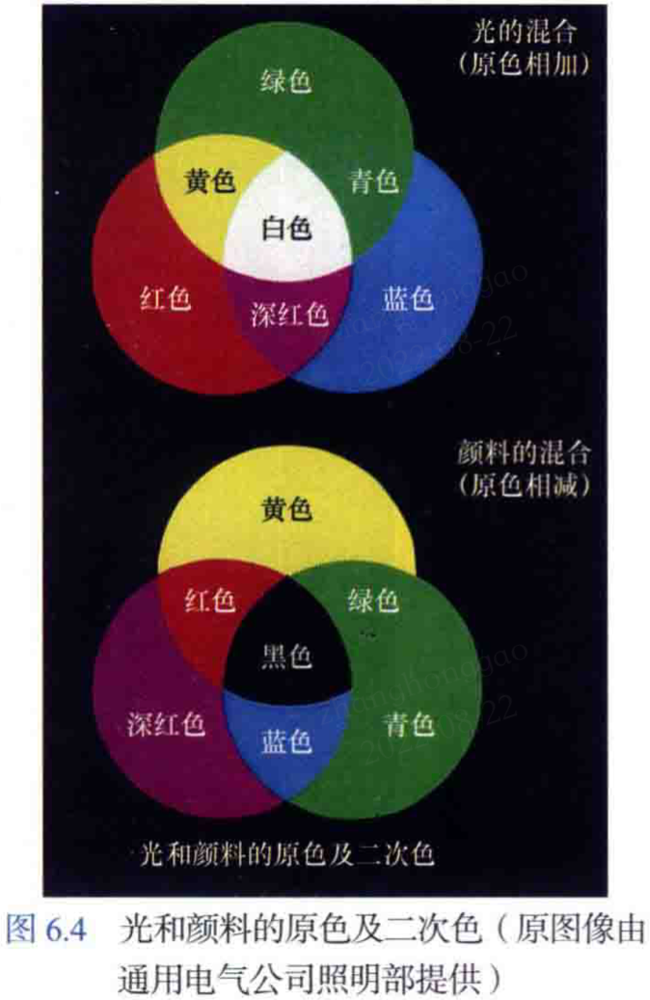

区分不同颜色的特性通常是**亮度、色调和饱和度**，色调与饱和度一起称为色度。

* **亮度**：亮度体现的是发光强度（灰度级）的消色概念。
* **色调**：色调是混合光波中与主导波长相关的属性，表示被观察者感知的主导色。即，当我们说一个物体颜色说红色、橙色或红色时，说的就是物体的色调。
* **饱和度**：饱和度指的是相对的纯度（纯色被白光稀释的程度），或与一种色调混合的白光量。纯光谱颜色是完全饱和的，非光谱颜色如淡紫色（紫色加白色）是不饱和度，饱和度与所加白光量成反比。

### 6.2，彩色模型
彩色模型（也称彩色空间或彩色系统）的目的是以某种标准的方式来方便地规定颜色。彩色模型本质上规定：（1）坐标系；（2）坐标系内的字空间，模型内的每种颜色都可由字空间内包含的一个点来表示。数字图像处理中的面向硬件的彩色模型常用有以下几种：

* 针对彩色显示器和彩色摄像机开发的 `RGB`（红色、绿色、蓝色）模型。
* 针对彩色打印机开发的 `CMY`（青色、深红色、黄色）模型和 `CMYK`（青色、深红色、黄色、黑色）模型。
* 针对人们描述和解释颜色的方式开发的 `HSI` （色调、饱和度、亮度）模型。`HSI`模型有一个优点：它能够解除图像中颜色和灰度级信息的联系。

#### 6.2.1，RGB 彩色模型
在 RGB 模型中，每种颜色都以其红色、绿色和蓝色光谱成分显示，该模型是根据笛卡尔坐标系建立的。RGB 彩色立方体简图如下所示：

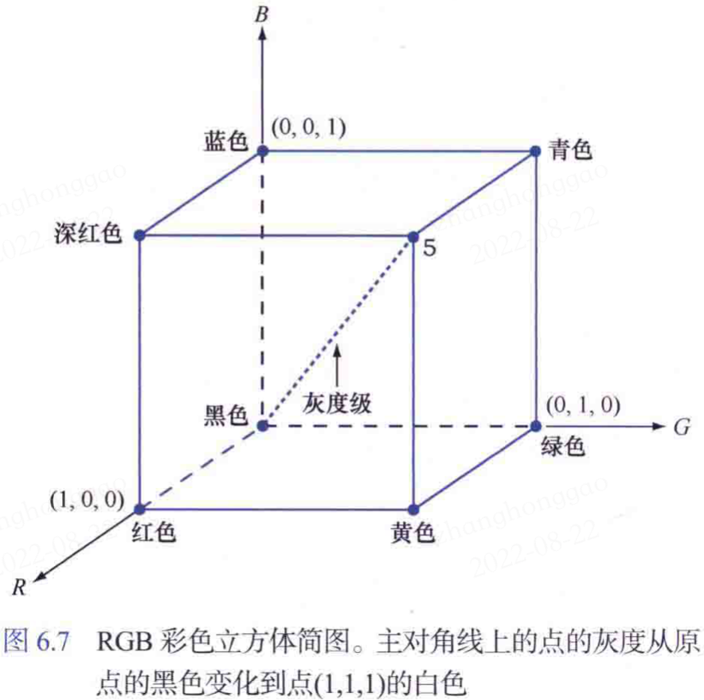

全彩色图像通常是指一幅 `24` 比特的 `RGB` 彩色图像（每幅分量图像都是 `8` 位，值域是 \[0, 255\]），颜色总数自然是 $(2^8)^3$=16777216。

#### 6.2.2，HSI 彩色模型
`RGB` 、`CMY` 和 `CMYK` 模型适合硬件实现但是并不能很好的描述人类世纪解释的颜色；观察彩色物体时，我们会用色调、饱和度和亮度来描述这个物体，由此提出了 `HSI` 彩色模型（色调、饱和度、亮度）。

从 RGB 到 HSI 的彩色变换的公式如下：

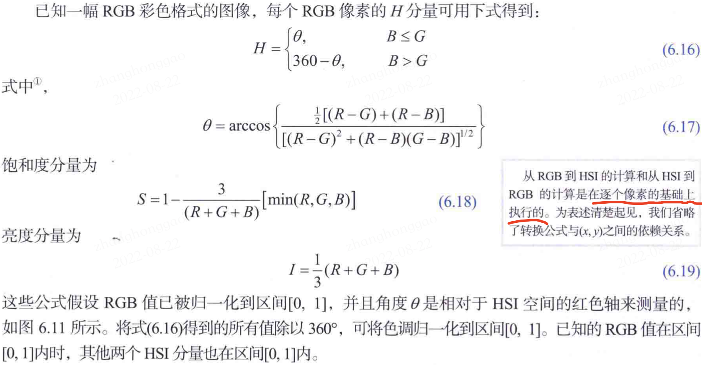

### 6.4，全彩色图像处理基础

全彩色图像处理方法主要分为两种。第一种方法是首先分布处理每幅灰度级分量图像，然后将处理后的各幅分量图像合成为一幅彩色图像。第二种方法是直接处理彩色像素。因为全彩色图像至少有 `3` 个分量，因此彩色像素是向量。全彩色图像的公式定义如下：

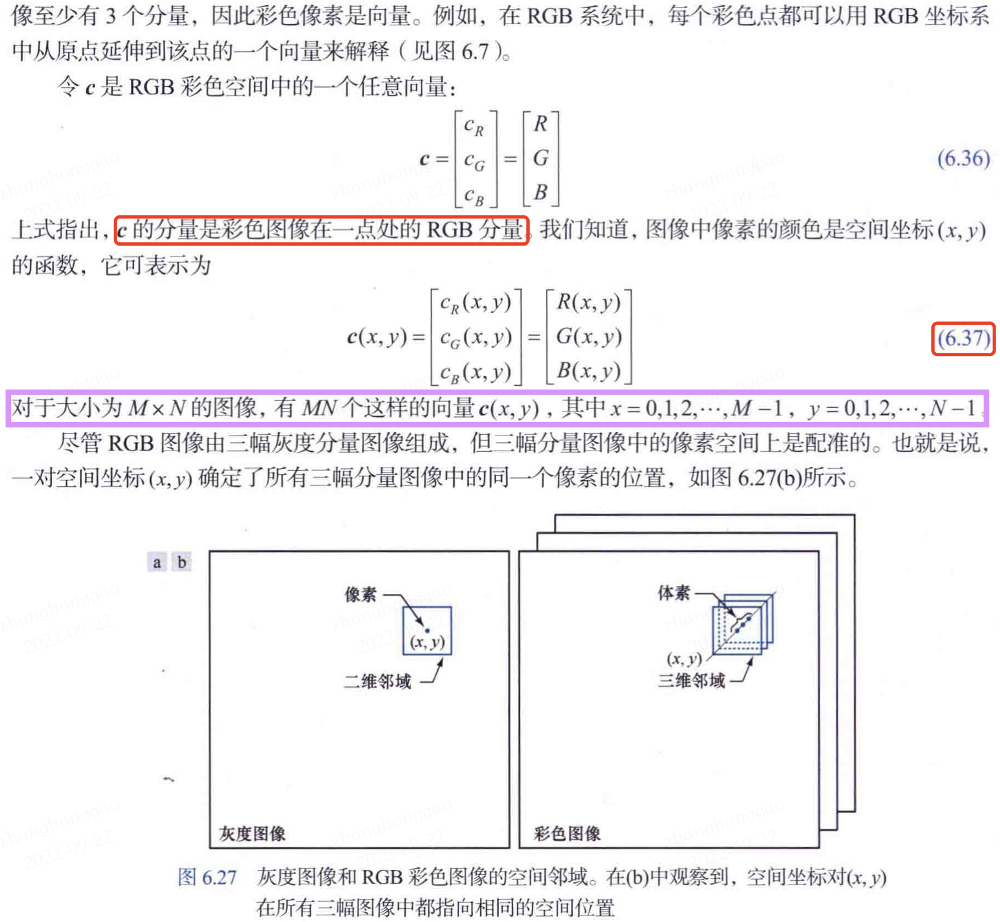

### 6.5，彩色变换

本节中描述的技术是在单个彩色模型中处理彩色图像的各个分量，而不是像6.2节中那样在彩色模型之间进行彩色变换。

#### 6.5.1，公式

使用如下公式对多光谱图像的颜色变换建模:
$$s_i = T_i(r_i), i=1,2,...,n$$
式中，$n$是分量图像的总数，$r_i$是输入分量图像的灰度值，$s_i$是输出分量图像中空间上的对应灰度，$T_i$是对$r_i$操作来产生$s_i$的一组变换或颜色映射函数。

#### 6.5.4，色调和彩色校正

只有校正了图像的色调范围，才能解决图像中颜色的不规则问题，如过饱和颜色和欠饱和颜色问题。图像中的色调范围（也称主特性），是指图像中颜色亮度的一般分布。高主特性图像中的大部分信息集中在高亮度上；低主特性图像中的大部分信息集中在低亮度上；中主特性图像的颜色则介于前两者之间。我们通常希望**彩色图像的亮度在高光和阴影之间是等间隔分布的**。

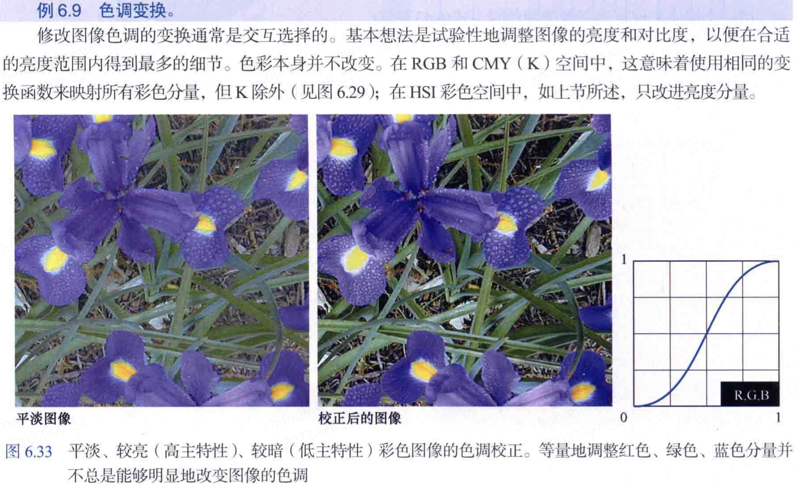

**彩色平衡**。图像的色调特性完成之后，通常要解决彩色不平衡的问题。校正彩色不平衡的方法有很多种，调整一度彩色图像的彩色分量时，要意识到每个操作都会影响图像的整体彩色平衡。也就是说，**对一种颜色的感知会受到周围颜色的影响**。

#### 6.5.5，彩色图像的直方图处理

和前一节内容是**交互式增强**方法（手动调节感知合适与否）不同，3.3 节的灰度直方图处理变换可自动地应用于彩色图像。
> 直方图均衡化会通过一个变换函数，输出一幅具有均匀灰度值直方图的图像。

`HSI` 彩色空间更适合均匀地分布颜色亮度，同时保持**颜色本身（即色调）**不变。

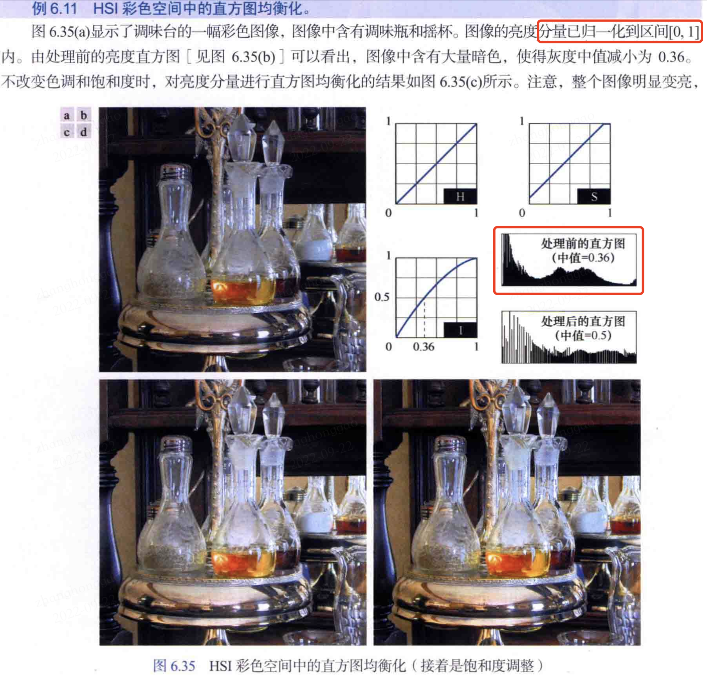

### 6.6，彩色图像平滑和锐化

彩色变换是变换图像中的每个像素而不考虑像素的邻域，那么下一步自然是根据周围像素（邻域）的特性来修改像素的值。本节内容通过彩色图像的平滑和锐化处理来说明这类邻域处理的基本知识。

#### 6.6.1，彩色图像的平滑
灰度级图像的平滑（空间滤波）概念同样可适用于全彩色图像处理，只是我们处理的不再是标量灰度值，而是式(6.37)给出的分量向量。彩色图像平滑公式描述如下:


#### 6.6.2，彩色图像的锐化

向量分析表明，一个向量的拉普拉斯也是一个向量，其分量等于输入向量的各个标量分量的拉普拉斯。在 RGB 彩色系统中，式(6.37)中向量$c$的拉普拉斯为

$$\bigtriangledown^2 [c(x,y)] = \begin{bmatrix}
\bigtriangledown^2 R(x,y)\\ 
\bigtriangledown^2 G(x,y)\\ 
\bigtriangledown^2 B(x,y) 
\end{bmatrix}$$

上式(6.37)表明分别计算每幅图像的拉普拉斯，即可求出全彩色图像的拉普拉斯。使用拉普拉斯锐化彩色图像示例如下:

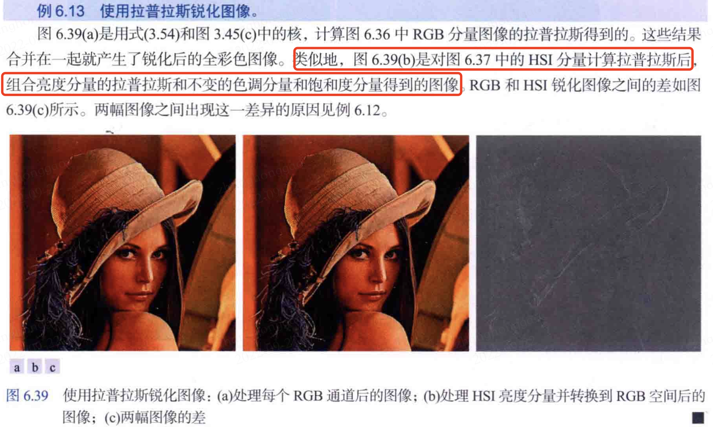

## 八，图像压缩和水印

**图像压缩是一种减少表示一幅图像所需数据量的技术与课业**。本章内容是介绍性的，适用于图像和视频应用。

略。


## 参考资料
《数字图像处理第四版》