# 视频编解码基础.md
> 视频编解码算法分为传统算法和基于深度学习的方法，本文主要介绍视频编解码技术的原理，部分内容和图片参考网上技术博客（链接已放在文章末尾）。

## 一，基本术语
> 数字图像的定义及理解可以参考这篇文章：[数字图像处理笔记｜一文搞懂数字图像基础](https://zhuanlan.zhihu.com/p/556661415)。

1. **颜色深度**：存储每个像素颜色的强度，需要占用一定大小的数据空间，这个空间大小即为颜色深度，对于 `RGB` 色彩模型，颜色深度是 `24` （8\*3）bit。
2. **图片分辨率**：图像的像素的数量，通常表示为宽\*高。
3. **图像/视频宽高比**：单地描述了图像或像素的宽度和高度之间的比例关系。
4. **比特率：**播放一段视频每秒所需的数据量，比特率 = 宽 \* 高 \* 颜色深度 \* 帧每秒。例如，一段每秒 30 帧，每像素 24 bits，分辨率是 480x240 的视频，如果我们不做任何压缩，它将需要 **82,944,000 比特每秒**或 82.944 Mbps (30x480x240x24)。当比特率几乎恒定时称为恒定比特率（CBR）；但它也可以变化，称为可变比特率（VBR）。

下面这个图形显示了一个受限的 VBR，当帧为黑色时不会花费太多的数据量。

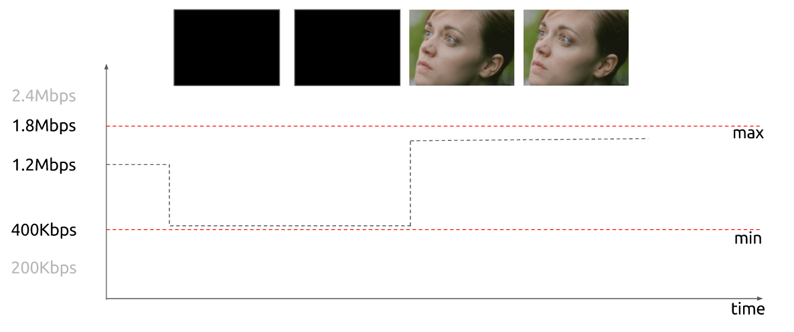

### 1.1，颜色亮度和我们的眼睛
> 因为人眼睛的视杆细胞（亮度）比视锥细胞多很多，所以一个合理的推断是相比颜色，我们有更好的能力去区分黑暗和光亮。

我们的眼睛[对亮度比对颜色更敏感](http://vanseodesign.com/web-design/color-luminance/)，可以看看下面的图片来测试。

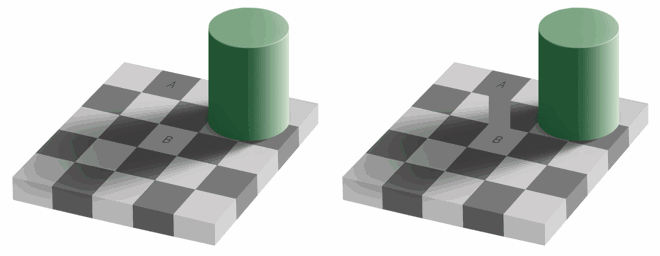

看不出左图的**方块 A 和方块 B** 的颜色是**相同的**，那是因为我们的大脑玩了一个小把戏，这让我们更多的去注意光与暗，而不是颜色。右边这里有一个使用同样颜色的连接器，那么我们（的大脑）就能轻易分辨出事实，它们是同样的颜色。

## 二，视频编码的实现原理
### 2.1，视频编码技术概述
编码的目的是为了压缩，所谓编码算法，就是寻找规律构建一个高效模型，将视频数据中的冗余信息去除。

常见的视频的冗余信息和对应的压缩方法如下表：

|**种类**|**内容**|**压缩方法**|
| ----- | ----- | ----- |
|**空间冗余**|像素间的相关性|变换编码，预测编码|
|**时间冗余**|时间方向上的相关性|帧间预测，运动补偿|
|图像构造冗余|图像本身的构造|轮廓编码，区域分割|
|知识冗余|收发两端对人物共有认识|基于知识的编码|
|视觉冗余|人对视觉特性|非线性量化，位分配|
|其他|不确定性因素| |

视频帧冗余信息示例如下图所示：

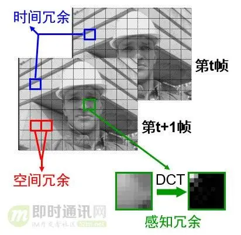

### 2.2，帧类型
我们知道视频是由不同的帧画面连续播放形成的，视频的帧主要分为三类，分别是（1）I 帧；（2）B 帧；（3）P 帧。

* **I 帧**（关键帧，帧内编码）：是自带全部信息的独立帧，是最完整的画面（占用的空间最大），无需参考其它图像便可独立进行解码。**视频序列中的第一个帧，始终都是I帧**。
* **P 帧**（预测）：“帧间预测编码帧”，需要参考前面的I帧和/或P帧的不同部分，才能进行编码。P帧对前面的P和I参考帧有依赖性。但是，P帧压缩率比较高，占用的空间较小。
* **B 帧**（双向预测）：“双向预测编码帧”，以前帧后帧作为参考帧。不仅参考前面，还参考后面的帧，所以，它的压缩率最高，可以达到200:1。不过，因为依赖后面的帧，所以不适合实时传输（例如视频会议）。

对 I 帧的处理，是采用帧内编码（帧间预测）方式，**只利用本帧图像内的空间相关性**。

对 P 帧的处理，采用帧间编码（前向运动估计），同时利用空间和时间上的相关性。简单来说，采用运动补偿(motion compensation)算法来去掉冗余信息。

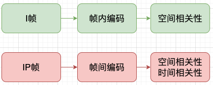

### 2.3，帧内编码（帧内预测）
帧内编码/预测用于解决单帧**空间冗余**问题。如果我们分析视频的**每一帧**，会发现**许多区域是相互关联的**。

举个例子来理解帧内编码，如下图所示的图片，可以看出这个图大部分区域颜色是一样的。假设这是一个 `I 帧` ，我们即将编码红色区域，假设帧中的颜色在垂直方向上保持一致，这意味着**未知像素的颜色与临近的像素相同**。

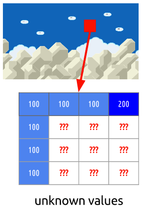

这样的先验预测虽然会出错，但是我们可以先利用这项技术（**帧内预测**），然后**减去实际值**，算出残差，这样得出的**残差矩阵比原始数据更容易压缩。**

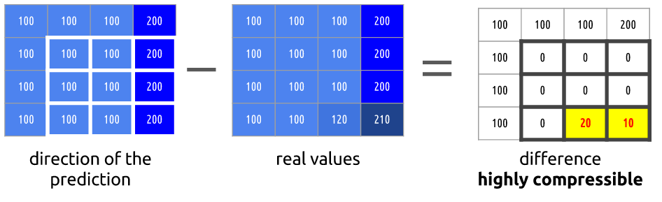

### 2.4，帧间编码（帧间预测）
**视频帧在时间上的重复**，解决这类冗余的技术就是帧间编码/预测。

尝试**花费较少的数据量**去编码在时间上连续的 0 号帧和 1 号帧。比如做个减法，简单地**用 0 号帧减去 1 号帧**，得到残差，这样我们就只需要**对残差进行编码**。

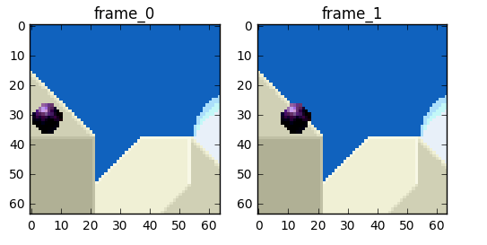
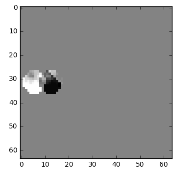

做减法的方法比较简单粗暴，效果不是很好，可以有更好的方法来节省数据量。首先，我们将`0 号帧` 视为一个个分块的集合，然后我们将尝试将 `帧 1` 和 `帧 0` 上的块相匹配。我们可以将这看作是**运动预测**。

> 运动补偿是一种描述相邻帧（相邻在这里表示在编码关系上相邻，在播放顺序上两帧未必相邻）差别的方法，具体来说是描述前面一帧（相邻在这里表示在编码关系上的前面，在播放顺序上未必在当前帧前面）的每个小块怎样移动到当前帧中的某个位置去。”

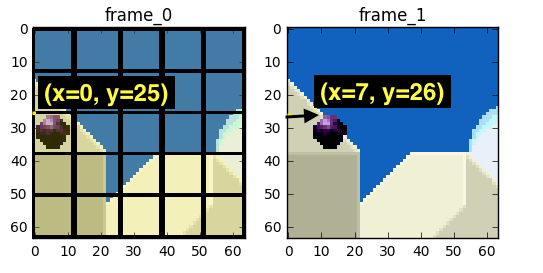

如上图所示，我们预计球会从 `x=0, y=25` 移动到 `x=7, y=26`，**x** 和 **y** 的值就是**运动向量**。**进一步**节省数据量的方法是，只编码这两者运动向量的差。所以，最终运动向量就是 `x=7 (6-0), y=1 (26-25)`。使用运动预测的方法会找不到完美匹配的块，但使用**运动预测**时，**编码的数据量少于**使用简单的残差帧技术，对比图如下图所示：

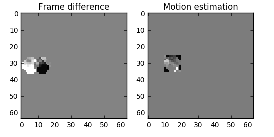

## 三，实际的视频编码器如何工作
### 3.1，视频容器（视频数据封装）
首先视频编码器和视频容器是不一样的，我们常见的各种视频文件名后缀：`.mp4` 、`.mkv` 、`.avi` 和`.mpeg` 等其实都是视频容器。**视频容器定义**：将已经编码压缩好的视频轨和音频轨按照一定的格式放到一个文件中，这个特定的文件类型即为视频容器。

### 3.2，编码器发展历史
视频编码器的发展历史见下图：

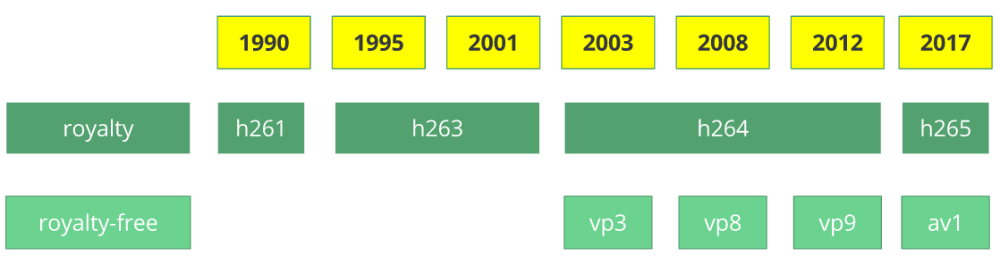

### 3.3，通用编码器工作流程
虽然视频编码器的已经经历了几十年的发展历史，但是其还是有一个主要的工作机制的。

#### 3.3.1，第一步-图片分区
第一步是**将帧**分成几个**分区**，**子分区**甚至更多。分区的目的是为了更精确的处理预测，在微小移动的部分使用较小的分区，而在静态背景上使用较大的分区。

通常，编解码器**将这些分区组织**成切片（或瓦片），宏（或编码树单元）和许多子分区。这些分区的最大大小对于不同的编码器有所不同，比如 HEVC 设置成 64x64，而 AVC 使用 16x16，但子分区可以达到 4x4 的大小。

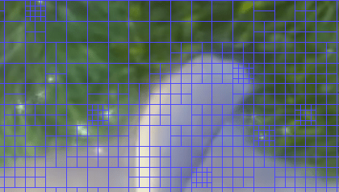

#### 3.3.2，第二步-预测
有了分区，我们就可以在它们之上做出预测。对于帧间预测，我们需要**发送运动向量和残差**；至于帧内预测，我们需要**发送预测方向和残差**。

#### 3.3.3，第三步-转换
在我们得到残差块（`预测分区-真实分区`）之后，我们可以用一种方式**变换**它，这样我们就知道**哪些像素我们应该丢弃**，还依然能保持**整体质量**。这个确切的行为有几种变换方式，这里只介绍离散余弦变换（`DCT`），其功能如下：

* 将**像素**块**转换**为相同大小的**频率系数块**。
* **压缩**能量，更容易消除空间冗余。
* **可逆的**，也意味着你可以还原回像素。

我们知道在一张图像中，**大多数能量**会集中在低频部分，所以如果我们将图像转换成频率系数，并**丢掉高频系数**，我们就能**减少描述图像所需的数据量**，而不会牺牲太多的图像质量。 `DCT` **可以把原始图像转换为频率（系数块），然后丢掉最不重要的系数。**

我们从丢掉不重要系数后的系数块重构图像，并与原始图像做对比，如下图所示。

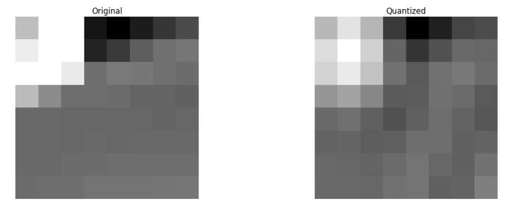

可以看出它酷似原图像，与原图相比，我们**丢弃了67.1875%，而**如何**智能的选择丢弃系数**则是下一步要考虑的问题。

#### 3.3.4，第四步-量化
当我们丢掉一些（频率）系数块时，在最后一步（变换），我们做了一些形式的量化。这一步，我们选择性地剔除信息（**有损部分**）或者简单来说，我们将**量化系数以实现压缩**。

如何量化一个系数块？一个简单的方法是**均匀量化**，我们取一个块并**将其除以单个的值**（10），并舍入值。

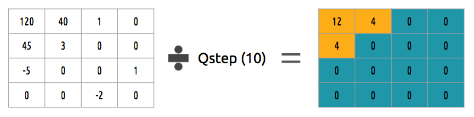

那如何**逆转**（反量化）这个系数块呢？可以通过**乘以我们先前除以的相同的值**（10）来做到。

**均匀量化并不是一个最好的量化方案，因为其并没有考虑到每个系数的重要性，**我们可以使用一个**量化矩阵**来代替单个值，这个矩阵可以利用 DCT 的属性，多量化右下部，而少（量化）左上部，[JPEG 使用了类似的方法](https://www.hdm-stuttgart.de/~maucher/Python/MMCodecs/html/jpegUpToQuant.html)，我们可以通过[查看源码看看这个矩阵](https://github.com/google/guetzli/blob/master/guetzli/jpeg_data.h#L40)。

#### 3.3.5，第五步-熵编码
在我们量化数据（图像块／切片／帧）之后，我们仍然可以以无损的方式来压缩它。有许多方法（算法）可用来压缩数据：

1. VLC 编码
2. 算术编码

#### 3.3.6，第六步-比特流格式
完成上述步骤，即已经完成视频数据的编码压缩，后续我们需要将**压缩过的帧和内容打包进去**。需要明确告知解码器**编码定义**，如颜色深度，颜色空间，分辨率，预测信息（运动向量，帧内预测方向），档次\*，级别\*，帧率，帧类型，帧号等等更多信息。

## 参考资料
1. [digital\_video\_introduction](https://github.com/leandromoreira/digital_video_introduction/blob/master/README-cn.md)
2. [零基础，史上最通俗视频编码技术入门](https://segmentfault.com/a/1190000021049773)