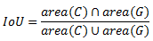
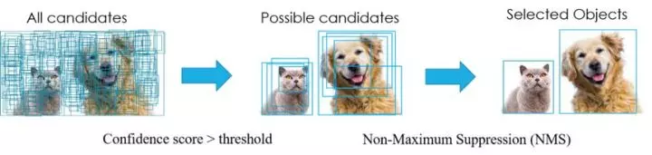
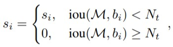
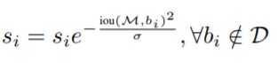

目录
---
[toc]

## 一，anchors 理解
所谓 `anchors`，实际上就是一组由 generate_anchors.py 生成的矩形框。其中每行的4个值 `(x1,y1,x2,y2)` 表矩形左上和右下角点坐标。9 个矩形共有 3 种形状，长宽比为大约为 `{1:1, 1:2, 2:1}` 三种, 实际上通过anchors就引入了检测中常用到的多尺度方法。`generate_anchors.py` 的代码如下：
```Python
import numpy as np
import six
from six import __init__  # 兼容python2和python3模块


def generate_anchor_base(base_size=16, ratios=[0.5, 1, 2],
                         anchor_scales=[8, 16, 32]):
    """Generate anchor base windows by enumerating aspect ratio and scales.

    Generate anchors that are scaled and modified to the given aspect ratios.
    Area of a scaled anchor is preserved when modifying to the given aspect
    ratio.

    :obj:`R = len(ratios) * len(anchor_scales)` anchors are generated by this
    function.
    The :obj:`i * len(anchor_scales) + j` th anchor corresponds to an anchor
    generated by :obj:`ratios[i]` and :obj:`anchor_scales[j]`.

    For example, if the scale is :math:`8` and the ratio is :math:`0.25`,
    the width and the height of the base window will be stretched by :math:`8`.
    For modifying the anchor to the given aspect ratio,
    the height is halved and the width is doubled.

    Args:
        base_size (number): The width and the height of the reference window.
        ratios (list of floats): This is ratios of width to height of
            the anchors.
        anchor_scales (list of numbers): This is areas of anchors.
            Those areas will be the product of the square of an element in
            :obj:`anchor_scales` and the original area of the reference
            window.

    Returns:
        ~numpy.ndarray:
        An array of shape :math:`(R, 4)`.
        Each element is a set of coordinates of a bounding box.
        The second axis corresponds to
        :math:`(x_{min}, y_{min}, x_{max}, y_{max})` of a bounding box.

    """
    import numpy as np
    py = base_size / 2.
    px = base_size / 2.

    anchor_base = np.zeros((len(ratios) * len(anchor_scales), 4),
                           dtype=np.float32)
    for i in six.moves.range(len(ratios)):
        for j in six.moves.range(len(anchor_scales)):
            h = base_size * anchor_scales[j] * np.sqrt(ratios[i])
            w = base_size * anchor_scales[j] * np.sqrt(1. / ratios[i])

            index = i * len(anchor_scales) + j
            anchor_base[index, 0] = px - w / 2.
            anchor_base[index, 1] = py - h / 2.

            anchor_base[index, 2] = px + h / 2.
            anchor_base[index, 3] = py + w / 2.
    return anchor_base


# test
if __name__ == "__main__":
    bbox_list = generate_anchor_base()
    print(bbox_list)
```
程序运行输出如下：
> [[ -82.50967   -37.254833   53.254833   98.50967 ]
 [-173.01933   -82.50967    98.50967   189.01933 ]
 [-354.03867  -173.01933   189.01933   370.03867 ]
 [ -56.        -56.         72.         72.      ]
 [-120.       -120.        136.        136.      ]
 [-248.       -248.        264.        264.      ]
 [ -37.254833  -82.50967    98.50967    53.254833]
 [ -82.50967  -173.01933   189.01933    98.50967 ]
 [-173.01933  -354.03867   370.03867   189.01933 ]]
## 二，交并比 IOU
交并比（Intersection-over-Union，IoU），目标检测中使用的一个概念，是产生的候选框（candidate bound）与原标记框（ground truth bound）的交叠率，即它们的交集与并集的比值。最理想情况是完全重叠，即比值为1。计算公式如下：



代码实现如下：
```python
# _*_ coding:utf-8 _*_
# 计算iou

"""
bbox的数据结构为(xmin,ymin,xmax,ymax)--(x1,y1,x2,y2),
每个bounding box的左上角和右下角的坐标
输入：
    bbox1, bbox2: Single numpy bounding box, Shape: [4]
输出：
    iou值
"""
import numpy as np
import cv2

def iou(bbox1, bbox2):
    """
    计算两个bbox(两框的交并比)的iou值
    :param bbox1: (x1,y1,x2,y2), type: ndarray or list
    :param bbox2: (x1,y1,x2,y2), type: ndarray or list
    :return: iou, type float
    """
    if type(bbox1) or type(bbox2) != 'ndarray':
        bbox1 = np.array(bbox1)
        bbox2 = np.array(bbox2)

    assert bbox1.size == 4 and bbox2.size == 4, "bounding box coordinate size must be 4"
    xx1 = np.max((bbox1[0], bbox2[0]))
    yy1 = np.max((bbox1[1], bbox1[1]))
    xx2 = np.min((bbox1[2], bbox2[2]))
    yy2 = np.min((bbox1[3], bbox2[3]))
    bwidth = xx2 - xx1
    bheight = yy2 - yy1
    area = bwidth * bheight  # 求两个矩形框的交集
    union = (bbox1[2] - bbox1[0])*(bbox1[3] - bbox1[1]) + (bbox2[2] - bbox2[0])*(bbox2[3] - bbox2[1]) - area  # 求两个矩形框的并集
    iou = area / union

    return iou


if __name__=='__main__':
    rect1 = (461, 97, 599, 237)
    # (top, left, bottom, right)
    rect2 = (522, 127, 702, 257)
    iou_ret = round(iou(rect1, rect2), 3) # 保留3位小数
    print(iou_ret)

    # Create a black image
    img=np.zeros((720,720,3), np.uint8)
    cv2.namedWindow('iou_rectangle')
    """
    cv2.rectangle 的 pt1 和 pt2 参数分别代表矩形的左上角和右下角两个点,
    coordinates for the bounding box vertices need to be integers if they are in a tuple,
    and they need to be in the order of (left, top) and (right, bottom). 
    Or, equivalently, (xmin, ymin) and (xmax, ymax).
    """
    cv2.rectangle(img,(461, 97),(599, 237),(0,255,0),3)
    cv2.rectangle(img,(522, 127),(702, 257),(0,255,0),3)
    font  = cv2.FONT_HERSHEY_SIMPLEX
    cv2.putText(img, 'IoU is ' + str(iou_ret), (341,400), font, 1,(255,255,255),1)
    cv2.imshow('iou_rectangle', img)
    cv2.waitKey(0)
```
代码输出结果如下所示：


## 三，NMS 算法
### [NMS 介绍](https://juejin.im/entry/5bdbc26151882516da0ddd25)

在目标检测中，常会利用非极大值抑制算法(`NMS`，non maximum suppression)对生成的大量候选框进行后处理，去除冗余的候选框，得到最佳检测框（`bbox`），以加快目标检测的效，其本质思想**搜素局部最大值，抑制非极大值**。许多目标检测模型都利用到了 `NMS` 算法，如 DPM，YOLO，SSD，Faster R-CNN 等。`NMS过程`如下图所示：



以上图为例，每个选出来的 `Bounding Box` 检测框（即 `BBox`）用`（x,y,h,w, confidence score，Pdog,Pcat）`表示，`confidence score` 表示 `background` 和 `foreground` 的置信度得分，取值范围`[0,1]`。Pdog, Pcat 分布代表类别是狗和猫的概率。如果是 100 类的目标检测模型，`BBox` 输出向量为 `5+100=105`。

### [NMS 算法过程](https://juejin.im/entry/5bdbc26151882516da0ddd25)

`NMS` 主要就是通过迭代的形式，不断地以最大得分的框去与其他框做 `IoU` 操作，并过滤那些 `IoU` 较大的框。

**其实现的思想主要是将各个框的置信度进行排序**，然后选择其中置信度最高的框 A，将其作为标准选择其他框，同时设置一个阈值，[当其他框 B 与 A 的重合程度超过阈值就将 B 舍弃掉](https://blog.csdn.net/williamyi96/article/details/77996167 )，然后在剩余的框中选择置信度最大的框，重复上述操作。多目标检测的 `NMS` 算法过程如下：

for object in all objects:
    1. 将所有 `bboxs` 按照 `confidence` 排序，并标记当前 `confidence` 最大的 `bbox`，即要保留的 bbox；
    2. 计算当前最大 confidence 对应的 `bbox` 和剩下所有 `bbox` 的 `IOU`；
    3. 去除 `IOU` 大于设定阈值的 `bbox`，得到新的 `bboxs`；
    4. 对于新生下来的 `bboxs`，循环执行步骤 `2、3`，直到所有的 `bbox` 都满足要求（即无法再移除 `bbox`）。

**nms 的 python 代码如下**：
```Python
import numpy as np

def py_nms(bboxs, thresh):
    """Pure Python NMS baseline.注意，这里的计算都是在矩阵层面上计算的
    greedily select boxes with high confidence and overlap with current maximum <= thresh
    rule out overlap >= thresh
    :param bboxs: [[x1, y1, x2, y2 score],] # ndarray, shape(-1,5)
    :param thresh: retain overlap < thresh
    :return: indexes to keep
    """
    if(bboxs) == 0:
        return [][]
    bboxs = npa.array(bboxs)
    # 计算 n 个候选框的面积大小
    x1 = bboxs[:,0]
    x2 = bboxs[:, 1]
    y1 = bboxs[:, 2]
    y2 = bboxs[:, 3]
    scores = bboxs[:, 4]
    areas = (x2 - x1 + 1)*(y2 - y1 + 1)

    # 1，对bboxs 按照置信度排序，获取排序后的下标号，argsort 函数默认从小到大排序
    order = np.argsort(scores)  # order shape is (4,)
    picked_bboxs = []

    while order.size > 0:
        # 1, 保留当前 confidence 最大的 bbox加入到返回框列表中
        index = order[-1]
        picked_bboxs.append(bboxs[index]]

        # 2，计算当前 confidence 最大的 bbox 和剩下 bbox 的 IOU
        xx1 = np.maximum(x1[-1], x1[order[:-1]])
        xx2 = np.maximum(x2[-1], x2[order[:-1]])
        yy1 = np.maximum(y1[-1], y1[order[:-1]])
        yy1 = np.maximum(y2[-1], y2[order[:-1]])

        # 计算相交框的面积,注意矩形框不相交时 w 或 h 算出来会是负数，用0代替
        w = np.maximum(0.0, xx2 - xx1 + 1)
        h = np.maximum(0.0, yy2 - yy1 + 1)
        overlap_area = w * h
        
        IOUs = overlap_area/(areas[index] + areas[order[:-1]] - overlap_area)

        # 3，只保留 `IOU` 小于设定阈值的 `bbox`，得到新的 `bboxs`，更新剩下来 bbox的索引
        remain_index = np.where(IOUs < thresh)  # np.where 来找到符合条件的 index
        order = order[remain_index]
    return picked_bboxs

# test
if __name__ == "__main__":
    bboxs = np.array([[30, 20, 230, 200, 1],
                     [50, 50, 260, 220, 0.9],
                     [210, 30, 420, 5, 0.8],
                     [430, 280, 460, 360, 0.7]])
    thresh = 0.35
    keep_bboxs = py_nms(bboxs, thresh)
    print(keep_bboxs)
```

程序输出如下：
> [0, 2, 3]
[[ 30. 20. 230. 200. 1. ]
 [210. 30. 420. 5. 0.8]
 [430. 280. 460. 360. 0.7]]

**另一个版本的 nms 的 python 代码如下：**
```python
from __future__ import print_function
import numpy as np
import time

def intersect(box_a, box_b):
    max_xy = np.minimum(box_a[:, 2:], box_b[2:])
    min_xy = np.maximum(box_a[:, :2], box_b[:2])
    inter = np.clip((max_xy - min_xy), a_min=0, a_max=np.inf)
    return inter[:, 0] * inter[:, 1]

def get_iou(box_a, box_b):
    """Compute the jaccard overlap of two sets of boxes.  The jaccard overlap
    is simply the intersection over union of two boxes.
    E.g.:
        A ∩ B / A ∪ B = A ∩ B / (area(A) + area(B) - A ∩ B)
        The box should be [x1,y1,x2,y2]
    Args:
        box_a: Single numpy bounding box, Shape: [4] or Multiple bounding boxes, Shape: [num_boxes,4]
        box_b: Single numpy bounding box, Shape: [4]
    Return:
        jaccard overlap: Shape: [box_a.shape[0], box_a.shape[1]]
    """
    if box_a.ndim==1:
        box_a=box_a.reshape([1,-1])
    inter = intersect(box_a, box_b)
    area_a = ((box_a[:, 2]-box_a[:, 0]) *
              (box_a[:, 3]-box_a[:, 1]))  # [A,B]
    area_b = ((box_b[2]-box_b[0]) *
              (box_b[3]-box_b[1]))  # [A,B]
    union = area_a + area_b - inter
    return inter / union  # [A,B]

def nms(bboxs,scores,thresh):
    """
    The box should be [x1,y1,x2,y2]
    :param bboxs: multiple bounding boxes, Shape: [num_boxes,4]
    :param scores: The score for the corresponding box
    :return: keep inds
    """
    if len(bboxs)==0:
        return []
    order=scores.argsort()[::-1]
    keep=[]
    while order.size>0:
        i=order[0]
        keep.append(i)
        ious=get_iou(bboxs[order],bboxs[i])
        order=order[ious<=thresh]
    return keep
```

## 四，Soft NMS 算法
`Soft NMS` 算法是对 `NMS` 算法的改进，是发表在 ICCV2017 的文章中提出的。`NMS` 算法存在一个问题是可能会把一些目标框给过滤掉，从而导致目标的 `recall` 指标比较低。原来的 NMS 可以描述如下：将 IOU 大于阈值的窗口的得分全部置为 0 ，计算公式如下：



文章的改进有两种形式，一种是`线性加权`的。设 $s_i$ 为第 $i$ 个 bbox 的 score, 则在应用 Soft NMS 时各个 bbox score 的计算公式如下：


另一种是`高斯加权`形式的，其不需要设置 iou 阈值 $N_t$。高斯惩罚系数(与上面的线性截断惩罚不同的是, 高斯惩罚会对其他所有的 bbox 作用)，计算公式图如下：



注意，这两种形式，思想都是 M 为当前得分最高框，$b_{i}$ 为待处理框， $b_{i}$ 和 M 的 IOU 越大，bbox 的得分 $s_{i}$ 就下降的越厉害 ( $N_{t}$ 为给定阈值)。Soft NMS 在每轮迭代时，先选择分数最高的预测框作为 $M$，并对 $B$ 中的每一个检测框 $b_i$ 进行 re-score，得到新的 score，当该框的新 score 低于某设定阈值时，则立即将该框删除。更多细节可以参考原[论文](https://arxiv.org/pdf/1704.04503.pdf)。


soft nms 的 python 代码如下：

```Python
def soft_nms(bboxes, Nt=0.3, sigma2=0.5, score_thresh=0.3, method=2):
    # 在 bboxes 之后添加对应的下标[0, 1, 2...], 最终 bboxes 的 shape 为 [n, 5], 前四个为坐标, 后一个为下标
    res_bboxes = deepcopy(bboxes)
    N = bboxes.shape[0]  # 总的 box 的数量
    indexes = np.array([np.arange(N)])  # 下标: 0, 1, 2, ..., n-1
    bboxes = np.concatenate((bboxes, indexes.T), axis=1)  # concatenate 之后, bboxes 的操作不会对外部变量产生影响

    # 计算每个 box 的面积
    x1 = bboxes[:, 0]
    y1 = bboxes[:, 1]
    x2 = bboxes[:, 2]
    y2 = bboxes[:, 3]
    scores = bboxes[:, 4]
    areas = (x2 - x1 + 1) * (y2 - y1 + 1)

    for i in range(N):
        # 找出 i 后面的最大 score 及其下标
        pos = i + 1
        if i != N - 1:
            maxscore = np.max(scores[pos:], axis=0)
            maxpos = np.argmax(scores[pos:], axis=0)
        else:
            maxscore = scores[-1]
            maxpos = 0

        # 如果当前 i 的得分小于后面的最大 score, 则与之交换, 确保 i 上的 score 最大
        if scores[i] < maxscore:
            bboxes[[i, maxpos + i + 1]] = bboxes[[maxpos + i + 1, i]]
            scores[[i, maxpos + i + 1]] = scores[[maxpos + i + 1, i]]
            areas[[i, maxpos + i + 1]] = areas[[maxpos + i + 1, i]]

        # IoU calculate
        xx1 = np.maximum(bboxes[i, 0], bboxes[pos:, 0])
        yy1 = np.maximum(bboxes[i, 1], bboxes[pos:, 1])
        xx2 = np.minimum(bboxes[i, 2], bboxes[pos:, 2])
        yy2 = np.minimum(bboxes[i, 3], bboxes[pos:, 3])
        w = np.maximum(0.0, xx2 - xx1 + 1)
        h = np.maximum(0.0, yy2 - yy1 + 1)
        intersection = w * h
        iou = intersection / (areas[i] + areas[pos:] - intersection)

        # Three methods: 1.linear 2.gaussian 3.original NMS
        if method == 1:  # linear
            weight = np.ones(iou.shape)
            weight[iou > Nt] = weight[iou > Nt] - iou[iou > Nt]
        elif method == 2:  # gaussian
            weight = np.exp(-(iou * iou) / sigma2)
        else:  # original NMS
            weight = np.ones(iou.shape)
            weight[iou > Nt] = 0

        scores[pos:] = weight * scores[pos:]

    # select the boxes and keep the corresponding indexes
    inds = bboxes[:, 5][scores > score_thresh]
    keep = inds.astype(int)

    return res_bboxes[keep]
```

## 五，目标检测领域中的数据不均衡问题
参考此论文 [Imbalance Problems in Object Detection](https://arxiv.org/abs/1909.00169.pdf)，我的理解之后补充。
## 参考资料
+ [NMS介绍](https://juejin.im/entry/5bdbc26151882516da0ddd25)
+ [Faster RCNN 源码解读(2) -- NMS(非极大抑制)](https://blog.csdn.net/williamyi96/article/details/77996167)
+ [nms](https://github.com/lzneu/letGo/bl```ob/master/nms/nms.ipynb)```


git filter-branch --force --index-filter "git rm --cached --ignore-unmatch 6-computer_vision/*.pdf --prune-empty --tag-name-filter cat -- --all