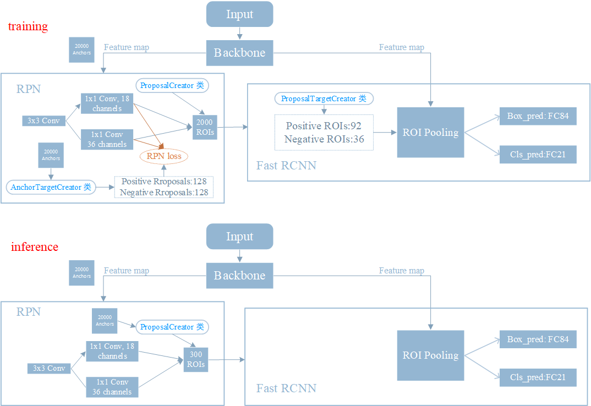

- [摘要](#摘要)
- [1，介绍](#1介绍)
  - [1.1，Faster RCNN 回顾](#11faster-rcnn-回顾)
  - [1.2，mismatch 问题](#12mismatch-问题)
- [2，实验分析](#2实验分析)
  - [2.1，改变IoU阈值对Detector性能的影响](#21改变iou阈值对detector性能的影响)
  - [2.2，提高IoU阈值的影响](#22提高iou阈值的影响)
  - [2.3，和Iterative BBox比较](#23和iterative-bbox比较)
- [3，网络结构](#3网络结构)
- [参考资料](#参考资料)

## 摘要

虽然低 `IoU` 阈值，如 `0.5`，会产生噪声检测（`noisy detections`），但是，随着 `IoU` 阈值的增加，检测性能往往会下降。造成这种情况的主要因素有两个：1）由于在训练过程中正样本呈指数下降，过少的正样本导致网络训练期间过拟合。2)**dismatch**：检测器在最优的 `IoU` 与输入预测的 `IoU` 之间会产生`mismatch`。由此，我们提出了多阶段的目标检测器结构：`Cascade R-CNN` 来解决 `IoU` 选择的问题。它**由一系列不断增加 `IoU` 阈值的检测器组成，可以逐步的更接近目标的预测。**。检测器是逐步训练的，前一个检测器输出一个良好的数据分布并作为输入，用于训练下一个更高质量的检测器。逐步改进的重采样保证了所有检测器都有一组相同大小的正样本，从而减少了过拟合问题。在 `inference` 阶段使用级联的检测器结构可以合理的提高了 `IOU` 的阈值而不会出现 `mismatch` 问题。

## 1，介绍

> `Cascade RCNN` 是作者 `Zhaowei Cai` 于 `2018` 年发表的论文 `Cascade R-CNN: Delving into High Quality Object Detection`.

 目标检测是一个复杂的问题，需要解决两个主要任务。首先，检测器必须解决**识别**问题，区分前景目标和背景目标，并为其分配匹配的类别标签。其次，探测器必须解决**定位**问题，为不同的目标分配精确的 `bounding box`。许多目标探测器都是基于两阶段网络框架 `Faster R-CNN` 的。双阶段检测网络是一个多任务学习问题，包括目标的分类和边界回归。**与物体识别不同的是，定义正/负样本需要一个 IoU 阈值**。通常使用的 `IOU` 阈值 `u=0.5`，`0.5` 对 `IOU` 的设置是相当低的。检测的目标经常包含很多噪声，如图 (a)所示。IOU 阈值取0.5，会有很多假的预测信息也都包含在内，从而会产生很多错误的预测信息。

(b).png)

### 1.1，Faster RCNN 回顾

先回顾下 `Faster RCNN` 的结构，下图是 `Faster RCNN` 的结构图。

`training` 阶段和 `inference` 阶段的不同在于，`inference` 阶段不能对 `proposala` 进行采样（因为不知道 `gt`，自然无法计算 `IoU`），所以 `RPN` 网络输出的 `300` `RoIs`(`Proposals`)会直接输入到 `RoI pooling` 中，之后通过两个全连接层分别进行类别分类和 `bbox` 回归。

值得注意的是，`Faster RCNN` 网络在 `RPN` 和 `Fast RCNN` 阶段都需要计算 `IoU`，用于判定 `positive` 和 `negative`。前者是生成 `256` 个 `Proposal` 用于 `RPN` 网络训练，后者是生成 `128` 个 `RoIs`(可以理解为 `RPN` 网络优化后的 `Proposals`)用于 `Fast RCNN` 训练。

### 1.2，mismatch 问题

`training` 阶段和 `inference` 阶段，`bbox` 回归器的输入 `proposals` 分布是不一样的，`training` 阶段的输入`proposals` 质量更高(被采样过，IoU > threshold)，`inference` 阶段的输入 `proposals` 质量相对较差（没有被采样过，可能包括很多 IoU < threshold 的），这就是论文中提到 `mismatch` 问题，这个问题是固有存在的，但通常 `threshold` 取 `0.5` 时，`mismatch` 问题还不会很严重。

## 2，实验分析

### 2.1，改变IoU阈值对Detector性能的影响

从上图可以看出：

- 同一个 detector 通常只会在一个小范围的 IoU 阈值 内性能最好，比如 IoU 阈值为 0.5 的 detector，在输入 `proposal` 和 `gt` 的阈值为 `0.55-0.6` 范围内，其性能最好。阈值为 0.6 的 detector 则在 0.6~0.75 阈值范围内性能最佳。
- 几乎所有的检测器输出框的 IoU 都好于输入 proposal 的 IoU（红绿蓝三条曲线都在灰色对角线上方）。

### 2.2，提高IoU阈值的影响

主要是分析对提高 IoU 阈值对 RPN 输出 Proposal 数量的影响，实验结果如下图所示。

上图纵坐标表示 `RPN` 输出 proposal 在各个 IoU 范围内的数量。

- 第一张图表示级联结构的第一级，可以等同为没有级联结构的 `RCNN` 网络。从图中可以看出，随着 IoU 的增加，IoU 在 0.6,0.7 及以上范围内的 proposal 数量越来越少。虽然这样产生更高精度的 proposal，但是也带来了两个问题：
  - **过拟合**。
  - **更严重的 `mismatch` 问题**。`RCNN` 结构本身就存在这个问题，IoU 阈值的提高又加剧了这个问题。

- 第二、三图表示有级联结构的 `RCNN`，从图中可以看出，随着 `stage` 的加深，相应区域的依然拥有大量的 `proposal`，因此不会出现严重的过拟合的现象。

### 2.3，和Iterative BBox比较

`Iterative BBox` 的 `H` 位置都是共享的，而且 `3` 个分支的 `IoU` 阈值都取 `0.5`。`Iterative BBox` 存在两个问题：

- 单一阈值 `0.5` 是无法对所有 `proposal` 取得良好效果。
- 此外，`detector` 会改变样本的分布，使用同一个共享的 `H` 对检测是有影响的。作者做了下面的实验证明样本分布在各个`stage` 的变化。

红色表示离群点。

- 从上图可以看出，没经过一次回归，样本都会更靠近 `gt`，即输出的样本分布会逐渐变化，使用同一个阈值 `0.5` 的条件下，后面两个 `stage` 就会有较多的离群点，使用共享的 `Head` 网络权重是无法满足输入的变化的。
- 从上图还可以看出，每个阶段设置不同的 IoU 阈值，可以更好的去除离群点，从而适应不同的输入 `proposal` 分布。

## 3，网络结构

网络结构如下图(d)

上图中 (d) 和 (c) 很像，`iterative bbox at inference` 是在推断时候对回归框进行后处理，即模型输出预测结果后再多次处理，而 `Cascade R-CNN` 在训练的时候就进行重新采样，不同的 `stage` 的输入数据分布已经是不同的了。

简单来说 cascade R-CNN 是由一系列的检测模型组成，每个检测模型都基于不同 IOU 阈值的正负样本训练得到，前一个检测模型的输出作为后一个检测模型的输入，因此是 stage by stage 的训练方式，而且越往后的检测模型，其界定正负样本的 IOU 阈值是不断上升的。

Cascade R-CNN 的几个检测网络（`Head` 网络）是基于不同的 IOU 阈值确定的正负样本上训练得到的。

作者在 COCO 数据集上做了对比实验，达到了 `state-of-the-art` 精度。其中 `backbone` 为`RsNet-101` 的 `Cascade RCNN` 的 `AP` 达到了 `42.8`。

## 参考资料

- [Cascade R-CNN 详细解读](https://zhuanlan.zhihu.com/p/42553957)
- [Cascade R-CNN解析](https://bbs.huaweicloud.com/blogs/291101)
