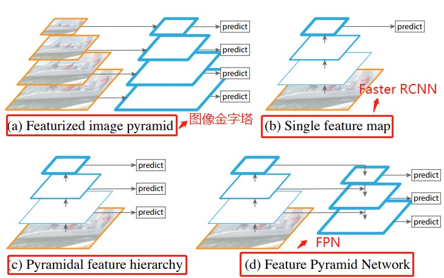
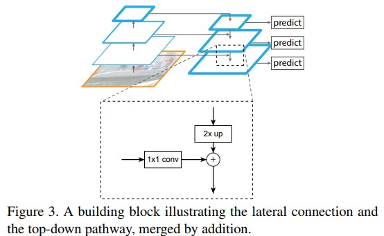
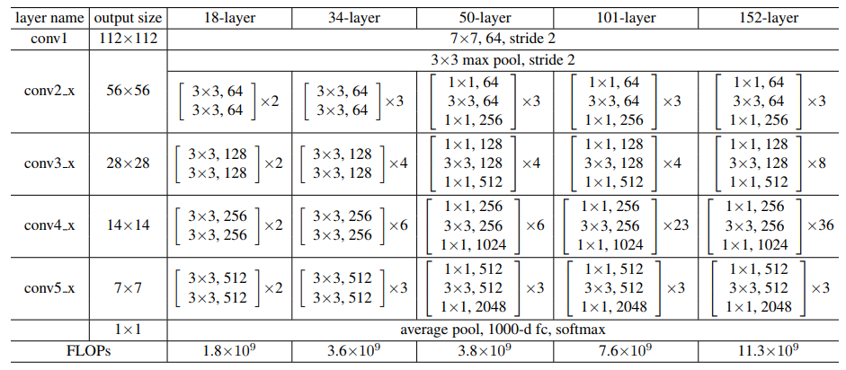
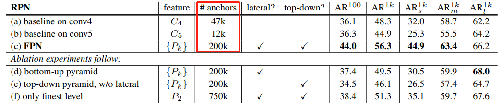
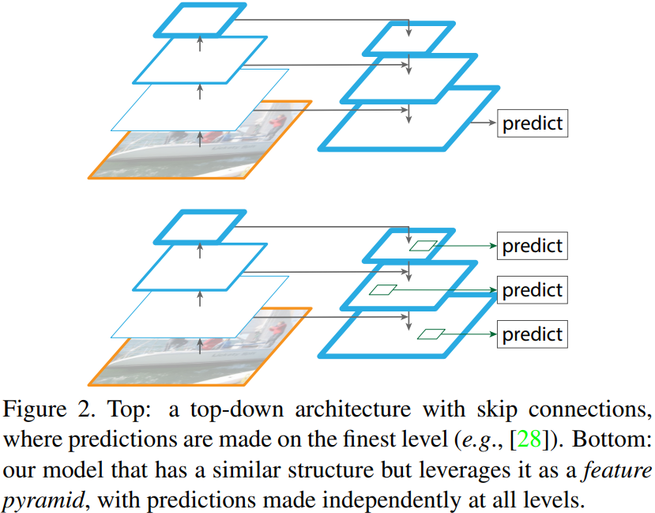

- [论文背景](#论文背景)
- [引言（Introduction）](#引言introduction)
- [特征金字塔网络 FPN](#特征金字塔网络-fpn)
  - [FPN网络建立](#fpn网络建立)
  - [Anchor锚框生成规则](#anchor锚框生成规则)
- [实验](#实验)
- [代码解读](#代码解读)
- [参考资料](#参考资料)

> 本篇文章是论文阅读笔记和网络理解心得总结而来，部分资料和图参考论文和网络资料

## 论文背景

`FPN`(feature pyramid networks) 是何凯明等作者提出的适用于多尺度目标检测算法。原来多数的 object detection 算法（比如 faster rcnn）都是只采用顶层特征做预测，但我们知道**低层的特征语义信息比较少，但是目标位置准确；高层的特征语义信息比较丰富，但是目标位置比较粗略**。另外虽然也有些算法采用多尺度特征融合的方式，但是一般是采用融合后的特征做预测，而本文不一样的地方在于预测是在不同特征层独立进行的。

## 引言（Introduction）



从上图可以看出，（a）使用图像金字塔构建特征金字塔。每个图像尺度上的特征都是独立计算的，速度很慢。（b）最近的检测系统选择（比如 Faster RCNN）只使用单一尺度特征进行更快的检测。（c）另一种方法是重用 ConvNet（卷积层）计算的金字塔特征层次结构（比如 SSD），就好像它是一个特征化的图像金字塔。（d）我们提出的特征金字塔网络（FPN）与（b）和（c）类似，但更准确。**在该图中，特征映射用蓝色轮廓表示，较粗的轮廓表示语义上较强的特征**。

## 特征金字塔网络 FPN

作者提出的 `FPN` 结构如下图：这个金字塔结构包括一个**自底向上的线路，一个自顶向下的线路和横向连接（lateral connections）**。



**自底向上**其实就是卷积网络的前向过程。在前向过程中，`feature map` 的大小在经过某些层后会改变，而在经过其他一些层的时候不会改变，作者将不改变 feature map 大小的层归为一个 stage，因此这里金字塔结构中每次抽取的特征都是每个 `stage` 的最后一个层的输出。在代码中我们可以看到共有`C1、C2、C3、C4、C5`五个特征图，`C1` 和 `C2` 的特征图大小是一样的，所以，`FPN` 的建立也是基于从 `C2` 到 `C5` 这四个特征层上。

**自顶向下**的过程采用上采样（`upsampling`）进行，而**横向连接**则是将上采样的结果和自底向上生成的相同大小的 `feature map` 进行融合（merge）。在融合之后还会再采用 `3*3` 的卷积核对每个融合结果进行卷积，目的是消除上采样的混叠效应（aliasing effect）。并假设生成的 feature map 结果是 P2，P3，P4，P5，和原来自底向上的卷积结果 C2，C3，C4，C5一一对应。

这里贴一个 `ResNet` 的结构图：论文中作者采用 `conv2_x，conv3_x，conv4_x 和 conv5_x` 的输出，对应 `C1，C2，C3，C4，C5`，因此类似 `Conv2`就可以看做一个stage。



### FPN网络建立

> 这里自己没有总结，因为已经有篇博文总结得很不错了，[在这](https://www.cnblogs.com/wangyong/p/10614898.html)。

通过 ResNet50 网络，得到图片不同阶段的特征图，最后利用 C2，C3，C4，C5 建立特征图金字塔结构：

1. 将 C5 经过 256 个 1\*1 的卷积核操作得到：32\*32\*256，记为 P5；
2. 将 P5 进行步长为 2 的上采样得到 64\*64\*256，再与 C4 经过的 256 个 1\*1 卷积核操作得到的结果相加，得到 64\*64\*256，记为 P4；
3. 将 P4 进行步长为 2 的上采样得到 128\*128\*256，再与 C3 经过的 256 个 1\*1 卷积核操作得到的结果相加，得到 128\*128\*256，记为 P3；
4. 将 P3 进行步长为 2 的上采样得到 256\*256\*256，再与 C2 经过的 256 个 1\*1 卷积核操作得到的结果相加，得到 256\*256\*256，记为 P2；
5. 将 P5 进行步长为 2 的最大池化操作得到：16\*16\*256，记为 P6；

结合从 P2 到 P6 特征图的大小，如果原图大小 1024\*1024, 那各个特征图对应到原图的`步长`依次为 [P2,P3,P4,P5,P6]=>[4,8,16,32,64]。

### Anchor锚框生成规则

当 `Faster RCNN` 采用 `FPN` 的网络作 backbone 后，锚框的生成规则也会有所改变。基于上一步得到的特征图 [P2,P3,P4,P5,P6],再介绍下采用 `FPN` 的 Faster RCNN（或者 Mask RCNN）网络中 Anchor 锚框的生成，根据源码中介绍的规则，与之前 Faster-RCNN 中的生成规则有一点差别。

1. 遍历 `P2 到 P6` 这五个特征层，以每个特征图上的每个像素点都生成 `Anchor` 锚框；
2. 以 P2 层为例，P2 层的特征图大小为 256\*256，相对于原图的步长为4，这样 P2上的每个像素点都可以生成一个基于坐标数组 [0,0,3,3] 即 4\*4 面积为 16 大小的Anchor锚框，当然，可以设置一个比例 SCALE，将这个基础的锚框放大或者缩小，比如，这里设置 P2 层对应的缩放比例为 16，那边生成的锚框大小就是长和宽都扩大16倍，从 4\*4 变成 64\*64，面积从 16 变成 4096，当然在保证面积不变的前提下，长宽比可以变换为 32\*128、64\*64 或 128\*32，这样以长、宽比率 RATIO = [0.5,1,2] 完成了三种变换，这样一个像素点都可以生成3个Anchor锚框。在 Faster-RCNN 中可以将 `Anchor scale` 也可以设置为多个值，**而在MasK RCNN 中则是每一特征层只对应着一个 `Anchor scale`即对应着上述所设置的 16**；
3. 以 `P2` 层每个像素点位中心，对应到原图上，则可生成 256\*256\*3(长宽三种变换) = 196608 个锚框；
4. 以 `P3` 层每个像素点为中心，对应到原图上，则可生成 128\*128\*3 = 49152 个锚框；
5. 以 `P4` 层每个像素点为中心，对应到原图上，则可生成 64\*64\*3 = 12288 个锚框；
6. 以 `P5` 层每个像素点为中心，对应到原图上，则生成 32\*32\*3 = 3072 个锚框；
7. 以 `P6` 层每个像素点为中心，对应到原图上，则生成 16\*16\*3 = 768 个锚框。

从 P2 到 P6 层一共可以在原图上生成 $196608 + 49152 + 12288 + 3072 + 768 = 261888$ 个 `Anchor` 锚框。

## 实验

看看加入FPN 的 RPN 网络的有效性，如下表 Table1。网络这些结果都是基于 ResNet-50。评价标准采用 AR，AR 表示 Average Recall，AR 右上角的 100 表示每张图像有 100 个 anchor，AR 的右下角 s，m，l 表示 COCO 数据集中 object 的大小分别是小，中，大。feature 列的大括号 {} 表示每层独立预测。



从（a）（b）（c）的对比可以看出 `FPN` 的作用确实很明显。另外（a）和（b）的对比可以看出高层特征并非比低一层的特征有效。

（d）表示只有横向连接，而没有自顶向下的过程，也就是仅仅对自底向上（bottom-up）的每一层结果做一个 1\*1 的横向连接和 3*3 的卷积得到最终的结果，有点像 `Fig1` 的（b）。从 feature 列可以看出预测还是分层独立的。作者推测（d）的结果并不好的原因在于在自底向上的不同层之间的 semantic gaps 比较大。

（e）表示有自顶向下的过程，但是没有横向连接，即向下过程没有融合原来的特征。这样效果也不好的原因在于目标的 location 特征在经过多次降采样和上采样过程后变得更加不准确。

（f）采用 finest level 层做预测（参考 Fig2 的上面那个结构），即经过多次特征上采样和融合到最后一步生成的特征用于预测，主要是证明金字塔分层独立预测的表达能力。显然 finest level 的效果不如 FPN 好，原因在于 PRN 网络是一个窗口大小固定的滑动窗口检测器，因此在金字塔的不同层滑动可以增加其对尺度变化的鲁棒性。**另外（f）有更多的 anchor，说明增加 anchor 的数量并不能有效提高准确率**。



## 代码解读

这里给出一个基于 `Pytorch` 的 `FPN` 网络的代码，来自[这里](https://github.com/kuangliu/pytorch-fpn/blob/master/fpn.py)。

```Python
## ResNet的block
class Bottleneck(nn.Module):
    expansion = 4
    def __init__(self, in_planes, planes, stride=1):
        super(Bottleneck, self).__init__()
        self.conv1 = nn.Conv2d(in_planes, planes, kernel_size=1, bias=False)
        self.bn1 = nn.BatchNorm2d(planes)
        self.conv2 = nn.Conv2d(planes, planes, kernel_size=3, stride=stride, padding=1, bias=False)
        self.bn2 = nn.BatchNorm2d(planes)
        self.conv3 = nn.Conv2d(planes, self.expansion*planes, kernel_size=1, bias=False)
        self.bn3 = nn.BatchNorm2d(self.expansion*planes)
        self.shortcut = nn.Sequential()
        if stride != 1 or in_planes != self.expansion*planes:
            self.shortcut = nn.Sequential(
                nn.Conv2d(in_planes, self.expansion*planes, kernel_size=1, stride=stride, bias=False),
                nn.BatchNorm2d(self.expansion*planes)
            )
    def forward(self, x):
        out = F.relu(self.bn1(self.conv1(x)))
        out = F.relu(self.bn2(self.conv2(out)))
        out = self.bn3(self.conv3(out))
        out += self.shortcut(x)
        out = F.relu(out)
        return out
class FPN(nn.Module):
    def __init__(self, block, num_blocks):
        super(FPN, self).__init__()
        self.in_planes = 64
        self.conv1 = nn.Conv2d(3, 64, kernel_size=7, stride=2, padding=3, bias=False)
        self.bn1 = nn.BatchNorm2d(64)
        # Bottom-up layers, backbone of the network
        self.layer1 = self._make_layer(block, 64, num_blocks[0], stride=1)
        self.layer2 = self._make_layer(block, 128, num_blocks[1], stride=2)
        self.layer3 = self._make_layer(block, 256, num_blocks[2], stride=2)
        self.layer4 = self._make_layer(block, 512, num_blocks[3], stride=2)
        # Top layer
        # 我们需要在C5后面接一个1x1, 256 conv，得到金字塔最顶端的feature
        self.toplayer = nn.Conv2d(2048, 256, kernel_size=1, stride=1, padding=0) # Reduce channels
        # Smooth layers
        # 这个是上面引文中提到的抗aliasing的3x3卷积
        self.smooth1 = nn.Conv2d(256, 256, kernel_size=3, stride=1, padding=1)
        self.smooth2 = nn.Conv2d(256, 256, kernel_size=3, stride=1, padding=1)
        self.smooth3 = nn.Conv2d(256, 256, kernel_size=3, stride=1, padding=1)
        # Lateral layers
        # 为了匹配channel dimension引入的1x1卷积
        # 注意这些backbone之外的extra conv，输出都是256 channel
        self.latlayer1 = nn.Conv2d(1024, 256, kernel_size=1, stride=1, padding=0)
        self.latlayer2 = nn.Conv2d( 512, 256, kernel_size=1, stride=1, padding=0)
        self.latlayer3 = nn.Conv2d( 256, 256, kernel_size=1, stride=1, padding=0)
    def _make_layer(self, block, planes, num_blocks, stride):
        strides = [stride] + [1]*(num_blocks-1)
        layers = []
        for stride in strides:
            layers.append(block(self.in_planes, planes, stride))
            self.in_planes = planes * block.expansion
        return nn.Sequential(*layers)
    ## FPN的lateral connection部分: upsample以后，element-wise相加
    def _upsample_add(self, x, y):
        '''Upsample and add two feature maps.
        Args:
          x: (Variable) top feature map to be upsampled.
          y: (Variable) lateral feature map.
        Returns:
          (Variable) added feature map.
        Note in PyTorch, when input size is odd, the upsampled feature map
        with `F.upsample(..., scale_factor=2, mode='nearest')`
        maybe not equal to the lateral feature map size.
        e.g.
        original input size: [N,_,15,15] ->
        conv2d feature map size: [N,_,8,8] ->
        upsampled feature map size: [N,_,16,16]
        So we choose bilinear upsample which supports arbitrary output sizes.
        '''
        _,_,H,W = y.size()
        return F.upsample(x, size=(H,W), mode='bilinear') + y
    def forward(self, x):
        # Bottom-up
        c1 = F.relu(self.bn1(self.conv1(x)))
        c1 = F.max_pool2d(c1, kernel_size=3, stride=2, padding=1)
        c2 = self.layer1(c1)
        c3 = self.layer2(c2)
        c4 = self.layer3(c3)
        c5 = self.layer4(c4)
        # Top-down
        # P5: 金字塔最顶上的feature
        p5 = self.toplayer(c5)
        # P4: 上一层 p5 + 侧边来的 c4
        # 其余同理
        p4 = self._upsample_add(p5, self.latlayer1(c4))
        p3 = self._upsample_add(p4, self.latlayer2(c3))
        p2 = self._upsample_add(p3, self.latlayer3(c2))
        # Smooth
        # 输出做一下smooth
        p4 = self.smooth1(p4)
        p3 = self.smooth2(p3)
        p2 = self.smooth3(p2)
        return p2, p3, p4, p5
```

## 参考资料

+ [FPN（feature pyramid networks）算法讲解](https://blog.csdn.net/u014380165/article/details/72890275)
+ [Mask RCNN 源代码解析 (1) - 整体思路](https://blog.csdn.net/hnshahao/article/details/81231211)
+ [Mask RCNN 学习笔记](https://www.cnblogs.com/wangyong/p/10614898.html)
+ [论文 - Feature Pyramid Networks for Object Detection (FPN)](https://xmfbit.github.io/2018/04/02/paper-fpn/)