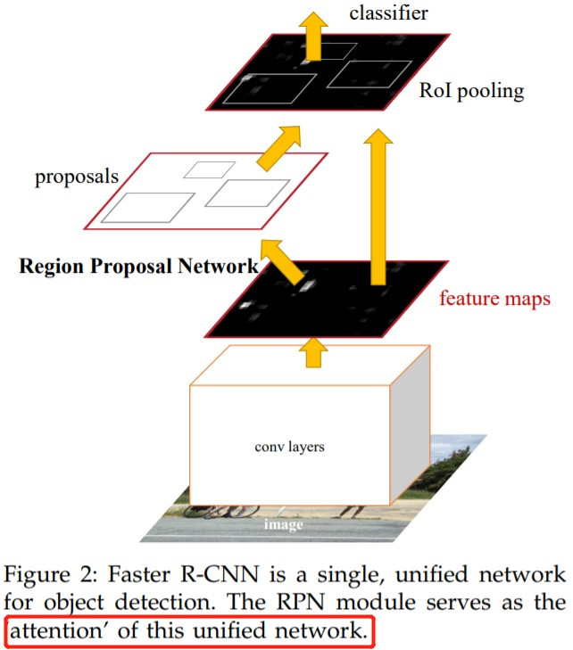
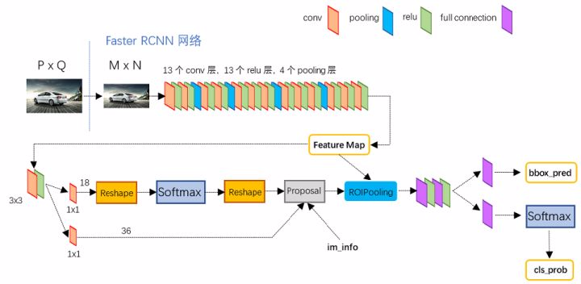
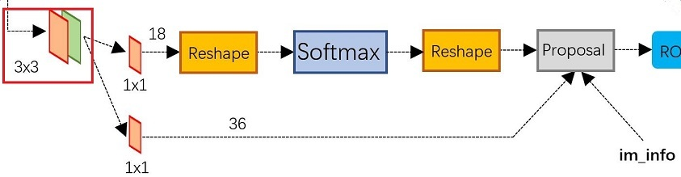
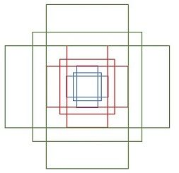
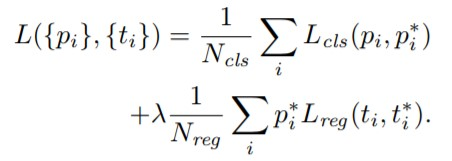
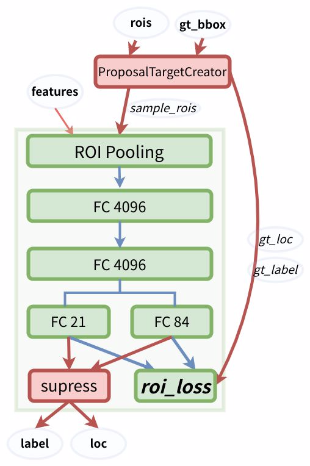
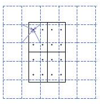

- [Faster RCNN 网络概述](#faster-rcnn-网络概述)
- [Conv layers](#conv-layers)
- [RPN 网络](#rpn-网络)
  - [Anchors](#anchors)
  - [生成 RPN 网络训练集](#生成-rpn-网络训练集)
  - [positive/negative 二分类](#positivenegative-二分类)
  - [RPN 生成 RoIs(Proposal Layer)](#rpn-生成-roisproposal-layer)
  - [RPN 网络总结](#rpn-网络总结)
- [ROIHead/Fast R-CNN](#roiheadfast-r-cnn)
  - [Roi pooling](#roi-pooling)
  - [ROI Head 训练](#roi-head-训练)
  - [ROI Head 测试](#roi-head-测试)
- [概念理解](#概念理解)
  - [四类损失](#四类损失)
  - [三个 creator](#三个-creator)
- [参考资料](#参考资料)

> 本文为学习笔记，部分内容参考网上资料和论文而写的，内容涉及 `Faster RCNN` 网络结构理解和代码实现原理。

## Faster RCNN 网络概述

`backbone` 为 `vgg16` 的 `faster rcnn` 网络结构如下图所示，可以清晰的看到该网络对于一副任意大小 `PxQ` 的图像，首先缩放至固定大小  `MxN`，然后将 `MxN` 图像送入网络；而 Conv layers 中包含了 13 个 conv 层 + 13 个 relu 层 + 4 个 pooling 层；`RPN` 网络首先经过 3x3 卷积，再分别生成 `positive anchors` 和对应 `bounding box regression` 偏移量，然后计算出 `proposals`；而 `Roi Pooling` 层则利用 proposals 从 feature maps 中提取 `proposal feature` 送入后续全连接和 softmax 网络作 `classification`（即分类： `proposal` 是哪种 `object`）。

## Conv layers

> 论文中 `Faster RCNN` 虽然支持任意图片输入，但是进入 `Conv layers` 网络之前会对图片进行规整化尺度操作，如可设定图像短边不超过 600，图像长边不超过 1000，我们可以假定 $M\times N=1000\times 600$（如果图片少于该尺寸，可以边缘补 0，即图像会有黑色边缘）。

1. `13` 个 `conv` 层：`kernel_size=3, pad=1, stride=1`，卷积公式：`N = (W − F + 2P )/S+1`，所以可知 `conv` 层不会改变图片大小
2. `13` 个 `relu` 层: 激活函数，增加非线性，不改变图片大小
3. `4` 个 `pooling` 层：`kernel_size=2,stride=2`，`pooling` 层会让输出图片变成输入图片的 1/2。

所以经过 `Conv layers`，图片大小变成 $(M/16) \ast (N/16)$，即：$60\ast 40(1000/16≈60,600/16≈40)$；则 `Feature Map` 尺寸为 $60\ast 40\ast 512$-d (注：VGG16 是512-d, ZF 是 256-d，`d` 是指特征图通道数，也叫特征图数量)，表示特征图的大小为 $60\ast 40$，数量为 `512`。

## RPN 网络

`RPN` 在 `Extractor`（特征提取 backbone ）输出的 feature maps 的基础之上，先增加了一个 `3*3` 卷积（用来语义空间转换？），然后利用两个 `1x1` 的卷积分别进行**二分类**（是否为正样本）和**位置回归**。RPN 网络在分类和回归的时候，分别将每一层的每一个 anchor 分为背景和前景两类，以及回归四个位移量，进行分类的卷积核通道数为`9×2`（9 个 anchor，每个 anchor 二分类，使用交叉熵损失），进行回归的卷积核通道数为 `9×4`（9个anchor，每个 anchor 有 4 个位置参数）。**RPN是一个全卷积网络（fully convolutional network）**，这样对输入图片的尺寸就没有要求了。
RPN 完成 `positive/negative 分类` + `bounding box regression 坐标回归`两个任务。

### Anchors

在`RPN`中，作者提出了`anchors`，所谓 anchors，实际上就是一组 `rpn/generate_acchors.py` 生成的一组矩形框，运行官方代码的 `generate_anchors.py` 可以得到以下示例输出：
> [[ -84. -40. 99. 55.]
 [-176. -88. 191. 103.]
 [-360. -184. 375. 199.]
 [ -56. -56. 71. 71.]
 [-120. -120. 135. 135.]
 [-248. -248. 263. 263.]
 [ -36. -80. 51. 95.]
 [ -80. -168. 95. 183.]
 [-168. -344. 183. 359.]]

其中每行的 4 个值 $(x_{1},  y_{1},  x_{2},  y_{2})$ 表矩形左上和右下角点坐标。9 个矩形共有 3 种形状，长宽比为大约为 $width:height \epsilon \{1:1, 1:2, 2:1\}$ 三种，如下图。**实际上通过 anchors 就引入了检测中常用到的多尺度方法**。

然后利用这 9 种`anchor`在特征图左右上下移动（遍历），每一个特征图上的任意一个点都有 9 个 `anchor`，假设原图大小为 M*N，经过 Conv layers 下采样 16 倍，则每个 feature map 生成 `(M/16)*(N/16)*9`个 `anchor`。例如，对于一个尺寸为 62×37 的 feature map，有 62×37×9 ≈ 20000 个 anchor。 也就是对一个 feature map，会产生约 20000 个左右的 anchor。这种做法很像是暴力穷举，20000 多个 anchor，哪怕是蒙也能够把绝大多数的 ground truth bounding boxes 蒙中。

因此，`anchor` 的数量和 `feature map` 相关，不同的 feature map 对应的 anchor 数量也不一样。

### 生成 RPN 网络训练集  

在这个任务中，RPN 做的事情就是利用（`AnchorTargetCreator`）将 20000 多个候选的 anchor **选出 256 个 anchor 进行分类和回归位置**。选择过程如下：

+ 对于每一个 ground truth bounding box (`gt_bbox`)，选择和它重叠度（IoU）最高的一个 `anchor` 作为正样本;
+ 对于剩下的 anchor，从中选择和任意一个 gt_bbox 重叠度超过 `0.7` 的 anchor ，同样作为正样本;
+ 随机选择和 `gt_bbox` 重叠度小于 `0.3` 的 anchor 作为负样本。
本和正样本的总数为`256` ，正负样本比例 `1:1`。

### positive/negative 二分类

由$1\times 1$ 卷积实现，卷积通道数为 $9\times 2$（每个点有 9 个 anchor，每个 anchor 二分类，使用交叉熵损失），后面接 softmax 分类获得 positive anchors，也就相当于初步提取了检测目标候选区域 box（一般认为目标在 positive anchors 中）。所以可知，RPN 的一个任务就是在原图尺度上，设置了大量的候选 `anchor`，并通过 `AnchorTargetCreator` 类去挑选正负样本比为 `1:1` 的 `256` 个 `anchor`，然后再用 `CNN` ($1\times 1$ 卷积，卷积通道数 $9\times 2$) 去判断挑选出来的 `256` 个 `anchor` 哪些有目标的 `positive anchor`，哪些是没目标的 `negative anchor`。

在挑选 `1:1` 正负样本比例的 `anchor` 用作 `RPN` 训练集后，还需要计算训练集数据对应的标签。对于每个 `anchor`, 对应的标签是 `gt_label` 和 `gt_loc`。`gt_label` 要么为 `1`（前景），要么为 `0`（背景），而 `gt_loc` 则是由 `4` 个位置参数 $(t_x,t_y,t_w,t_h)$ 组成，它们是 `anchor box` 与 `ground truth bbox` 之间的偏移量，因为回归偏移量比直接回归座标更好。在 `Faster RCNN`原文，`positive anchor` 与 `ground truth` 之间的偏移量 $(t_{x}, t_{y})$ 与尺度因子 $(t_{w}, t_{h})$ 计算公式如下:

$$t_{x} = (x-x_{a})/w_{a}, t_{y}=(y-y_{a})/h_{a} \\
t_{w} = log(w/w_{a}), t_{h}=log(h/h_{a}) \\
t^{*}_{x} = (x^{*}-x_{a})/w_{a}, t^{*}_{y}=(y^{*}-y_{a})/h_{a} \\
t^{*}_{w} = log(w^{*}/w_{a}), t^{*}_{h}=log(h^{*}/h_{a}) $$

参数解释：where $x, y, w,$ and $h$ denote the box’s center coordinates and its width and height. Variables $x, x_{a}$，and $x^{*}$ are for the predicted box, anchor box, and groundtruth box respectively (likewise for $y, w, h$).

计算分类损失用的是交叉熵损失，而计算回归损失用的是 Smooth_l1_loss. 在计算回归损失的时候，只计算正样本（前景）的损失，不计算负样本的位置损失。loss 计算公式如下：

**公式解释**：Here, $i$ is the index of an anchor in a mini-batch and $p_{i}$ is the predicted probability of anchor i being an object. The ground-truth label $p_i^*$ is 1 if the anchor is positive, and is 0 if the anchor is negative. $t_{i}$ is a vector representing the 4 parameterized coordinates of the predicted bounding box, and $t_i^*$ is that of theground-truth box associated with a positive anchor.

### RPN 生成 RoIs(Proposal Layer)

`RPN` 网络在自身训练的同时，还会由 `Proposal Layer` 层产生 `RoIs`（region of interests）给 Fast RCNN（RoIHead）作为训练样本。RPN 生成 RoIs 的过程( `ProposalCreator` )如下：

1. 对于每张图片，利用它的 `feature map`， 计算`(H/16)× (W/16)×9（大概20000）个`anchor属于前景的概率`，以及`对应的位置参数`。选取概率较大的12000个anchor；
2. 利用回归的位置参数，修正这 12000 个 anchor 的位置，得到`RoIs`；
3. 利用非极大值（(Non-maximum suppression, NMS）抑制，选出概率最大的 2000 个 RoIs。

> 在 RPN 中，从上万个 anchor 中，选一定数目(2000 或 300)，调整大小和位置生成 `RoIs`，用于 ROI Head/Fast RCNN 训练（ProposalTargetCreator 会从中选择 128 个 RoIs 用以训练）。

注意：在 `inference` 的时候，为了提高处理速度，12000 和 2000 分别变为 6000 和 300。**`Proposal Layer` 层，这部分的操作不需要进行反向传播，因此可以利用 numpy/tensor 实现**。

### RPN 网络总结

+ RPN 网络结构：**生成 anchors -> softmax 分类器提取 positvie anchors -> bbox reg 回归 positive anchors -> Proposal Layer 生成 proposals**
+ RPN 的输出：`RoIs(region of interests)`（形如 `2000×4` 或者 `300×4` 的 `tensor`）

## ROIHead/Fast R-CNN

`RPN` 只是给出了 2000 个 候选框，`RoI Head` 在给出的 2000 候选框之上继续进行分类和位置参数的回归。`ROIHead` 网络包括 `RoI pooling` + `Classification`(全连接分类)两部分，网络结构如下：

由于 `RoIs` 给出的 `2000` 个 候选框，分别对应 `feature map` 不同大小的区域。首先利用 `ProposalTargetCreator` 挑选出 `128` 个 `sample_rois`, 然后使用了 `RoI Pooling` 将这些不同尺寸的区域全部 `pooling` 到同一个尺度 $7\times 7$ 上，并输出 $7\times 7$ 大小的 `feature map` 送入后续的**两个全连接层**。两个全连接层分别完成类别分类和 `bbox` 回归的作用：

- `FC 21` 用来分类，预测 `RoIs` 属于哪个类别（20个类+背景）
- `FC 84` 用来回归位置（21个类，每个类都有4个位置参数）

> 论文中之所以设定为 pooling 成 7×7 的尺度，其实是为了网络输出是固定大小的`vector or matrix`，从而能够共享 VGG 后面两个全连接层的权重。当所有的 RoIs 都被pooling 成（512×7×7）的 feature map 后，将它 reshape 成一个一维的向量，就可以利用 VGG16 预训练的权重来初始化前两层全连接（`FC 4096`）。

### Roi pooling

`RoI pooling` 负责将 `128` 个 `RoI` 区域对应的 `feature map` 进行截取，而后利用 `RoI pooling` 层输出 $7\times 7$ 大小的 `feature map`，送入后续的**全连接网络**。从论文给出的 `Faster R-CNN` 网络结构图中，可以看到 `Rol pooling` 层有 `2` 个输入：

+ 原始的 `feature maps`
+ `RPN` 输出的 `RoIs` (`proposal boxes`, 大小各不相同）

**RoI Pooling 的两次量化过程**：

(1) 因为 `proposals`是对应 $M\times N$ 的原图尺寸，所以**在原图上生成的 region proposal** 需要映射到 `feature map` 上，需要除以 $16/32$（下采样倍数），这时候边界会出现小数，自然就需要量化。
(2) 将 `proposals` 对应的 `feature map` 区域水平划分成 $k\times k$ ($7\times 7$) 的 `bins`，并对每个 `bin` 中均匀选取多少个采样点，然后进行 `max pooling`，也会出现小数，自然就产生了第二次量化。

**RoI Align 如何改进**:

`ROI Align` 并不需要对两步量化中产生的浮点数坐标的像素值都进行计算，而是设计了一套优雅的流程。如下图，其中虚线代表的是一个 `feature map`，实线代表的是一个 `roi` (在这个例子中，一个 `roi` 是分成了 $2\times 2$ 个 `bins`)，实心点代表的是采样点，每个 `bin` 中有 `4` 个采样点。我们通过双线性插值的方法根据采样点周围的四个点计算每一个采样点的值，然后对着四个采样点执行最大池化操作得到当前 `bin` 的像素值。

`RoI Align` 具体做法：假定采样点数为 `4`，即表示，对于每个 $2.97\times 2.97$ 的 `bin`，**平分四份小矩形，每一份取其中心点位置，而中心点位置的像素，采用双线性插值法进行计算**，这样就会得到四个小数坐标点的像素值。

### ROI Head 训练

RPN 会产生大约 2000 个 RoIs ，ROI Head 在给出的 2000 个 RoIs 候选框基础上**继续分类(目标分类)和位置参数回归**。注意，这 2000 个 RoIs 不是都拿去训练，而是**利用 ProposalTargetCreator（官方源码可以查看类定义） 选择 128 个 RoIs 用以训练**。选择的规则如下：

+ 在和 `gt_bboxes` 的 `IoU` 大于 `0.5` 的 `RoIs` 内，选择一些（比如 `32` 个）作为正样本
+ 在和 `gt_bboxes` 的 `IoU` 小于等于 `0`（或者 `0.1` ）`RoIs` 内，的选择一些（比如 $128 - 32 = 96$ 个）作为负样本

选择出的 `128` 个 `RoIs`，其正负样本比例为 `3:1`，在源码中为了便于训练，还对他们的 `gt_roi_loc` 进行标准化处理（减去均值除以标准差）。

- 对于分类问题, 和 `RPN` 一样，直接利用**交叉熵损失**。
- 对于位置的回归损失，也采用 **Smooth_L1 Loss**, 只不过**只对正样本计算损失**，而且是只对正样本中的对应类别的 $4$ 个参数计算损失。举例来说：
  - 一个 `RoI` 在经过 `FC84` 后会输出一个 `84` 维的 `loc` 向量。 如果这个 `RoI` 是负样本, 则这 `84` 维向量不参与计算 `L1_Loss`。
  - 如果这个 `RoI` 是正样本，且属于 类别 $k$, 那么向量的第 $(k×4，k×4+1 ，k×4+2， k×4+3)$ 这 $4$ 位置的值参与计算损失，其余的不参与计算损失。

### ROI Head 测试

`ROI Head` 测试的时候对所有的 `RoIs`（大概 `300` 个左右) 计算概率，并利用位置参数调整预测候选框的位置，然后**再**用一遍极大值抑制（之前在 `RPN` 的`ProposalCreator` 也用过）。这里注意：

+ 在 `RPN` 的时候，已经对 `anchor` 做了一遍 `NMS`，在 `Fast RCNN` 测试的时候，还要再做一遍，**所以在Faster RCNN框架中，NMS操作总共有 2 次**。
+ 在 `RPN` 的时候，已经对 `anchor` 的位置做了回归调整，在 `Fast RCNN` 阶段还要对 `RoI` 再做一遍。
+ 在 `RPN` 阶段分类是二分类，而 `Fast RCNN/ROI Head` 阶段是 `21` 分类。

## 概念理解

在阅读 `Faster RCNN` 论文和源码中，我们经常会涉及到一些概念的理解。

### 四类损失

在训练 `Faster RCNN` 的时候有四个损失：

+ `RPN` 分类损失：`anchor` 是否为前景（二分类）
+ `RPN` 位置回归损失：`anchor` 位置微调
+ `RoI` 分类损失：`RoI` 所属类别（`21` 分类，多了一个类作为背景）
+ `RoI` 位置回归损失：继续对 `RoI` 位置微调

**四个损失相加作为最后的损失，反向传播，更新参数**。

### 三个 creator

Faster RCNN 官方源码中有三个 `creator` 类分别实现不同的功能，不能弄混，各自功能如下：

+ `AnchorTargetCreator` ： 负责在训练 `RPN` 的时候，从上万个 `anchors` 中选择一些(比如 `256` )进行训练，并使得正负样本比例大概是 `1:1`。同时给出训练的位置参数目标，即返回 `gt_rpn_loc` 和 `gt_rpn_label`。
+ `ProposalTargetCreator`： 负责在训练 `RoIHead/Fast R-CNN` 的时候，从 `RoIs` 选择一部分(比如 `128` 个，正负样本比例 `1:3`)用以训练。同时给定训练目标, 返回（`sample_RoI`, `gt_RoI_loc`, `gt_RoI_label`）。
+ `ProposalCreator`： 在 `RPN` 中，从上万个 `anchor` 中，选择一定数目（ `2000` 或者 `300` ），调整大小和位置，生成 `RoIs` ，用以 `Fast R-CNN` 训练或者测试。

其中 `AnchorTargetCreator` 和 `ProposalTargetCreator` 类是为了生成训练的目标，只在训练阶段用到，`ProposalCreator` 是 `RPN` 为 `Fast R-CNN` 生成 `RoIs` ，在训练和测试阶段都会用到。**三个 `creator` 的共同点在于他们都不需要考虑反向传播**（因此不同框架间可以共享 `numpy` 实现）。

## 参考资料

- [一文读懂Faster RCNN](https://zhuanlan.zhihu.com/p/31426458)
- [从编程实现角度学习Faster RCNN](https://zhuanlan.zhihu.com/p/32404424)
- [你真的学会了RoI Pooling了吗](https://zhuanlan.zhihu.com/p/59692298)
- [Faster RCNN 学习笔记](https://www.cnblogs.com/wangyong/p/8513563.html)
