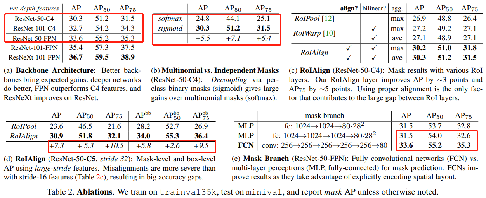

- [ROI Pooling 和 ROI Align 的区别](#roi-pooling-和-roi-align-的区别)
- [Mask R-CNN 网络结构](#mask-r-cnn-网络结构)
- [骨干网络 FPN](#骨干网络-fpn)
- [anchor 锚框生成规则](#anchor-锚框生成规则)
- [实验](#实验)
- [参考资料](#参考资料)

> `Mask RCNN` 是作者 `Kaiming He` 于 `2018` 年发表的论文

## ROI Pooling 和 ROI Align 的区别

[Understanding Region of Interest — (RoI Align and RoI Warp)](https://towardsdatascience.com/understanding-region-of-interest-part-2-roi-align-and-roi-warp-f795196fc193)

## Mask R-CNN 网络结构

`Mask RCNN` 继承自 `Faster RCNN` 主要有三个改进：

+ `feature map` 的提取采用了 `FPN` 的多尺度特征网络
+ `ROI Pooling` 改进为 `ROI Align`
+ 在 `RPN` 后面，增加了采用 `FCN` 结构的 `mask` 分割分支

网络结构如下图所示：


可以看出，Mask RCNN 是一种先检测物体，再分割的思路，简单直接，在建模上也更有利于网络的学习。

## 骨干网络 FPN

卷积网络的一个重要特征：深层网络容易响应语义特征，浅层网络容易响应图像特征。`Mask RCNN` 的使用了 `ResNet` 和 `FPN` 结合的网络作为特征提取器。

`FPN` 的代码出现在 `./mrcnn/model.py`中，核心代码如下：

```Python
if callable(config.BACKBONE):
    _, C2, C3, C4, C5 = config.BACKBONE(input_image, stage5=True,
                                        train_bn=config.TRAIN_BN)
else:
    _, C2, C3, C4, C5 = resnet_graph(input_image, config.BACKBONE,
                                        stage5=True, train_bn=config.TRAIN_BN)
# Top-down Layers
# TODO: add assert to varify feature map sizes match what's in config
P5 = KL.Conv2D(config.TOP_DOWN_PYRAMID_SIZE, (1, 1), name='fpn_c5p5')(C5)
P4 = KL.Add(name="fpn_p4add")([
    KL.UpSampling2D(size=(2, 2), name="fpn_p5upsampled")(P5),
    KL.Conv2D(config.TOP_DOWN_PYRAMID_SIZE, (1, 1), name='fpn_c4p4')(C4)])
P3 = KL.Add(name="fpn_p3add")([
    KL.UpSampling2D(size=(2, 2), name="fpn_p4upsampled")(P4),
    KL.Conv2D(config.TOP_DOWN_PYRAMID_SIZE, (1, 1), name='fpn_c3p3')(C3)])
P2 = KL.Add(name="fpn_p2add")([
    KL.UpSampling2D(size=(2, 2), name="fpn_p3upsampled")(P3),
    KL.Conv2D(config.TOP_DOWN_PYRAMID_SIZE, (1, 1), name='fpn_c2p2')(C2)])
# Attach 3x3 conv to all P layers to get the final feature maps.
P2 = KL.Conv2D(config.TOP_DOWN_PYRAMID_SIZE, (3, 3), padding="SAME", name="fpn_p2")(P2)
P3 = KL.Conv2D(config.TOP_DOWN_PYRAMID_SIZE, (3, 3), padding="SAME", name="fpn_p3")(P3)
P4 = KL.Conv2D(config.TOP_DOWN_PYRAMID_SIZE, (3, 3), padding="SAME", name="fpn_p4")(P4)
P5 = KL.Conv2D(config.TOP_DOWN_PYRAMID_SIZE, (3, 3), padding="SAME", name="fpn_p5")(P5)
# P6 is used for the 5th anchor scale in RPN. Generated by
# subsampling from P5 with stride of 2.
P6 = KL.MaxPooling2D(pool_size=(1, 1), strides=2, name="fpn_p6")(P5)

# Note that P6 is used in RPN, but not in the classifier heads.
rpn_feature_maps = [P2, P3, P4, P5, P6]
mrcnn_feature_maps = [P2, P3, P4, P5]
```

其中 `resnet_graph` 函数定义如下：

```Python
def resnet_graph(input_image, architecture, stage5=False, train_bn=True):
    """Build a ResNet graph.
        architecture: Can be resnet50 or resnet101
        stage5: Boolean. If False, stage5 of the network is not created
        train_bn: Boolean. Train or freeze Batch Norm layers
    """
    assert architecture in ["resnet50", "resnet101"]
    # Stage 1
    x = KL.ZeroPadding2D((3, 3))(input_image)
    x = KL.Conv2D(64, (7, 7), strides=(2, 2), name='conv1', use_bias=True)(x)
    x = BatchNorm(name='bn_conv1')(x, training=train_bn)
    x = KL.Activation('relu')(x)
    C1 = x = KL.MaxPooling2D((3, 3), strides=(2, 2), padding="same")(x)
    # Stage 2
    x = conv_block(x, 3, [64, 64, 256], stage=2, block='a', strides=(1, 1), train_bn=train_bn)
    x = identity_block(x, 3, [64, 64, 256], stage=2, block='b', train_bn=train_bn)
    C2 = x = identity_block(x, 3, [64, 64, 256], stage=2, block='c', train_bn=train_bn)
    # Stage 3
    x = conv_block(x, 3, [128, 128, 512], stage=3, block='a', train_bn=train_bn)
    x = identity_block(x, 3, [128, 128, 512], stage=3, block='b', train_bn=train_bn)
    x = identity_block(x, 3, [128, 128, 512], stage=3, block='c', train_bn=train_bn)
    C3 = x = identity_block(x, 3, [128, 128, 512], stage=3, block='d', train_bn=train_bn)
    # Stage 4
    x = conv_block(x, 3, [256, 256, 1024], stage=4, block='a', train_bn=train_bn)
    block_count = {"resnet50": 5, "resnet101": 22}[architecture]
    for i in range(block_count):
        x = identity_block(x, 3, [256, 256, 1024], stage=4, block=chr(98 + i), train_bn=train_bn)
    C4 = x
    # Stage 5
    if stage5:
        x = conv_block(x, 3, [512, 512, 2048], stage=5, block='a', train_bn=train_bn)
        x = identity_block(x, 3, [512, 512, 2048], stage=5, block='b', train_bn=train_bn)
        C5 = x = identity_block(x, 3, [512, 512, 2048], stage=5, block='c', train_bn=train_bn)
    else:
        C5 = None
    return [C1, C2, C3, C4, C5]
```

## anchor 锚框生成规则

在 Faster-RCNN 中可以将 `SCALE` 也可以设置为多个值，而在 Mask RCNN 中则是每一特征层只对应着一个`SCALE` 即对应着上述所设置的 16。

## 实验

何凯明在论文中做了很多对比单个模块试验，并放出了对比结果表格。



从上图表格可以看出：

+ `sigmoid` 和 `softmax` 对比，`sigmoid` 有不小提升；
+ 特征网络选择：可以看出更深的网络和采用 `FPN` 的实验效果更好，可能因为 FPN 综合考虑了不同尺寸的 `feature map` 的信息，因此能够把握一些更精细的细节。
+ `RoI Align` 和 `RoI Pooling` 对比：在 instance segmentation 和 object detection 上都有不小的提升。这样看来，**RoIAlign 其实就是一个更加精准的 RoIPooling**，把前者放到 Faster RCNN 中，对结果的提升应该也会有帮助。

## 参考资料

[Mask R-CNN 论文](https://arxiv.org/abs/1703.06870)