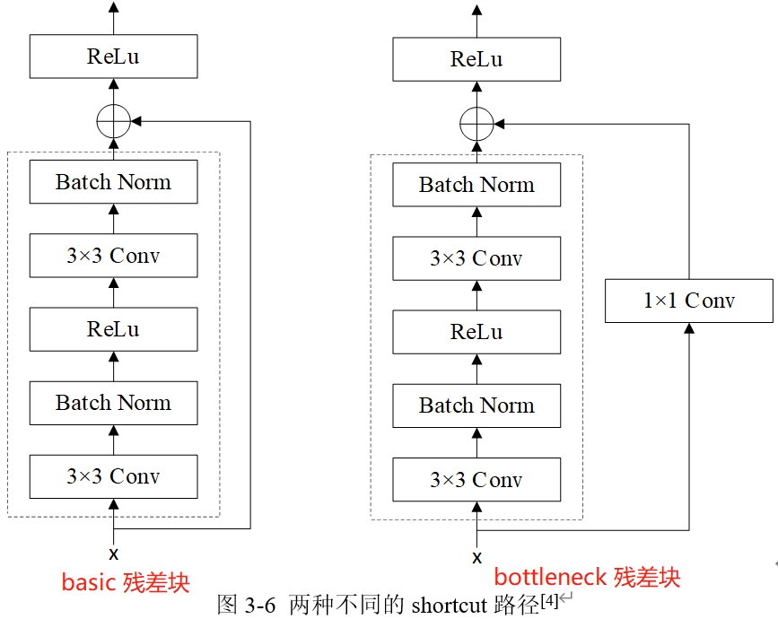
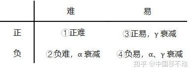
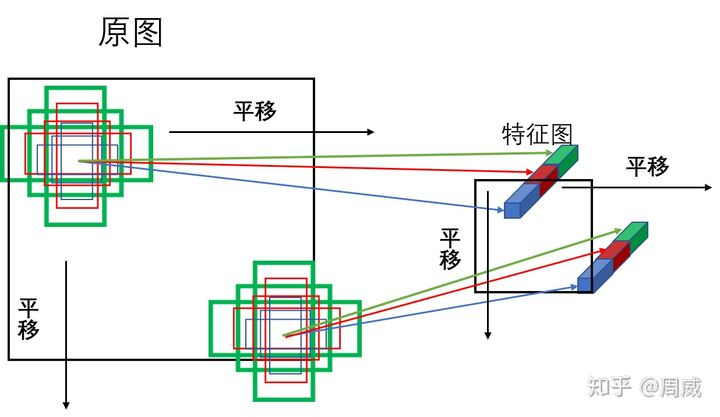
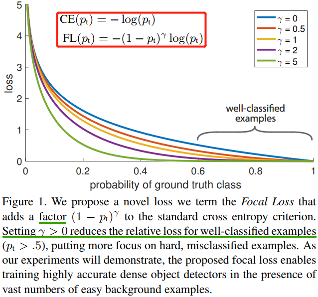

- [摘要](#摘要)
- [1，引言](#1引言)
- [2，相关工作](#2相关工作)
- [3，网络架构](#3网络架构)
- [3.1，Backbone](#31backbone)
  - [3.2，Neck](#32neck)
  - [3.3，Head](#33head)
- [4，Focal Loss](#4focal-loss)
  - [4.1，Cross Entropy](#41cross-entropy)
  - [4.2，Balanced Cross Entropy](#42balanced-cross-entropy)
  - [4.3，Focal Loss Definition](#43focal-loss-definition)
- [5，代码解读](#5代码解读)
  - [5.1，Backbone](#51backbone)
  - [5.2，Neck](#52neck)
  - [5.3，Head](#53head)
  - [5.4，先验框Anchor赋值](#54先验框anchor赋值)
  - [5.5，BBox Encoder Decoder](#55bbox-encoder-decoder)
  - [5.6，Focal Loss](#56focal-loss)
- [参考资料](#参考资料)

## 摘要

> Retinanet 是作者 Tsung-Yi Lin 和 Kaiming He（四作） 于 2018 年发表的论文 Focal Loss for Dense Object Detection.

作者深入分析了极度不平衡的正负（前景背景）样本比例导致 one-stage 检测器精度低于 two-stage 检测器，基于上述分析，提出了一种简单但是非常实用的 Focal Loss 焦点损失函数，并且 Loss 设计思想可以推广到其他领域，同时针对目标检测领域特定问题，设计了 RetinaNet 网络，结合 Focal Loss 使得 one-stage 检测器在精度上能够达到乃至超过 two-stage 检测器。

## 1，引言

作者认为一阶段检测器的精度不能和两阶段检测相比的原因主要在于，训练过程中的类别不平衡，由此提出了一种新的损失函数-`Focal Loss`。

`R-CNN(Fast RCNN)` 类似的检测器之所以能解决类别不平衡问题，是因为**两阶段级联结构和启发式采样**。提取 `proposal` 阶段（例如，选择性搜索、EdgeBoxes、DeepMask、`RPN`）很快的将候选对象位置的数量缩小到一个小数目（例如，1-2k），过滤掉大多数背景样本（其实就是筛选 `anchor` 数量）。在第二个分类阶段，执行启发式采样（`sampling heuristics`），例如固定的前景背景比（`1:3`），或在线难样本挖掘（`OHEM`），以保持前景和背景之间的平衡。

相比之下，单级检测器必须处理在图像中定期采样的一组更大的候选对象位置。实际上，这通常相当于枚举 `∼100k` 个位置，这些位置密集地覆盖空间位置、尺度和纵横。虽然也可以应用类似的启发式采样方法，但效率低下，因为训练过程仍然由易于分类的背景样本主导。

## 2，相关工作

**Two-stage Detectors**: 与之前使用两阶段的分类器生成 `proposal` 不同，`Faster RCNN` 模型的 `RPN` 使用单个卷积就可以生成 `proposal`。

**One-stage Detectors**：最近的一些研究表明，只需要降低输入图像分辨率和 `proposal` 数量，两阶段检测器速度就可以变得更快。但是，对于一阶段检测器，即使提高模型计算量，其最后的精度也落后于两阶段方法[17]。同时，作者强调，`Reinanet` 达到很好的结果的原因不在于网络结构的创新，而在于损失函数的创新。
> 论文 [17] Speed/accuracy trade-offs for modern convolutional object detectors（注重实验）. 但是，从这几年看，一阶段检测器也可以达到很高的精度，甚至超过两阶段检测器，这几年的一阶段检测和两阶段检测器有相互融合的趋势了。

**`Class Imbalance:`** 早期的目标检测器 `SSD` 等在训练过程中会面临严重的类别不平衡（`class imbalance`）的问题，即正样本太少，负样本太多，这会导致两个问题：

- 训练效率低下：大多数候选区域都是容易分类的负样本，并没有提供多少有用的学习信号。
- 模型退化：易分类的负样本太多会压倒训练，导致模型退化。

通常的解决方案是执行某种形式的**难负样本挖掘**，如在训练时进行难负样本采样或更复杂的采样/重新称重方案。相比之下，`Focla Loss` 自然地处理了单级检测器所面临的类别不平衡，并且**允许在所有示例上有效地训练**，而不需要采样，也不需要容易的负样本来压倒损失和计算的梯度。

**Robust Estimation**: 人们对设计稳健的损失函数（例如 `Huber loss`）很感兴趣，该函数通过降低具有大错误的示例（硬示例）的损失来减少对总损失的贡献。相反， `Focal Loss` 对容易样本(`inliers`)减少权重来解决（`address`）类别不平衡问题（`class imbalance`），这意味着即使容易样本数量大，但是其对总的损失函数贡献也很小。换句话说，`Focal Loss` 与鲁棒损失相反，它**侧重于训练稀疏的难样本**。

## 3，网络架构

`retinanet` 的网络架构图如下所示。


## 3.1，Backbone

`Retinanet` 的 `Backbone` 为 `ResNet` 网络，`ResNet` 一般从 `18` 层到 `152` 层（甚至更多）不等，主要区别在于采用的残差单元/模块不同或者堆叠残差单元/模块的数量和比例不同，论文主要使用 `ResNet50`。

两种残差块结构如下图所示，`ResNet50` 及更深的 `ResNet` 网络使用的是 `bottleneck` 残差块。



### 3.2，Neck

`Neck` 模块即为 `FPN` 网络结构。FPN 模块接收 c3, c4, c5 三个特征图，输出 P2-P7 五个特征图，通道数都是 256, stride 为 (8,16,32,64,128)，**其中大 stride (特征图小)用于检测大物体，小 stride (特征图大)用于检测小物体**。P6 和 P7 目的是提供一个**大感受野强语义**的特征图，有利于大物体和超大物体检测。注意：在 RetinaNet 的 FPN 模块中只包括卷积，不包括 BN 和 ReLU。

### 3.3，Head

`Head` 即预测头网络。

`YOLOv3` 的 `neck` 输出 `3` 个分支，即输出 `3` 个特征图， `head` 模块只有一个分支，由卷积层组成，该卷积层完成目标分类和位置回归的功能。总的来说，`YOLOv3` 网络的 `3` 个特征图有 `3` 个预测分支，分别预测 `3` 个框，也就是分别预测大、中、小目标。

`Retinanet` 的 `neck` 输出 `5` 个分支，即输出 `5` 个特征图。`head` 模块包括分类和位置检测两个分支，每个分支都包括 `4` 个卷积层，但是 `head` 模块的这两个分支之间参数不共享，分类 `Head` 输出通道是 A\*K，A 是类别数；检测 `head` 输出通道是 4*K, K 是 anchor 个数, 虽然每个 Head 的分类和回归分支权重不共享，但是 `5` 个输出特征图的 Head 模块权重是共享的。

## 4，Focal Loss

`Focal Loss` 是在二分类问题的交叉熵（`CE`）损失函数的基础上引入的，所以需要先学习下交叉熵损失的定义。

### 4.1，Cross Entropy

> 可额外阅读文章 [理解交叉熵损失函数](https://zhuanlan.zhihu.com/p/339684056)。

在深度学习中我们常使用交叉熵来作为分类任务中训练数据分布和模型预测结果分布间的代价函数。对于同一个离散型随机变量 $\textrm{x}$ 有两个单独的概率分布 $P(x)$ 和 $Q(x)$，其交叉熵定义为：
> P 表示真实分布， Q 表示预测分布。

$$H(P,Q) = \mathbb{E}_{\textrm{x}\sim P} log Q(x)= -\sum_{i}P(x_i)logQ(x_i) \tag{1} $$

但在实际计算中，我们通常不这样写，因为不直观。在深度学习中，以二分类问题为例，其交叉熵损失（`CE`）函数如下：

$$Loss = L(y, p) = -ylog(p)-(1-y)log(1-p) \tag{2}$$

其中 $p$ 表示当预测样本等于 $1$ 的概率，则 $1-p$ 表示样本等于 $0$ 的预测概率。因为是二分类，所以样本标签 $y$ 取值为 $\{1,0\}$，上式可缩写至如下：

$$CE = \left\{\begin{matrix}
-log(p), & if \quad y=1 \\ 
-log(1-p), &  if\quad y=0  \tag{3} 
\end{matrix}\right.$$

为了方便，用 $p_t$ 代表 $p$，$p_t$ 定义如下：

$$p_t = \left\{\begin{matrix}
p, & if \quad y=1 \\ 
1-p, &  if\quad y=0
\end{matrix}\right.$$

则$(3)$式可写成：

$$CE(p, y) = CE(p_t) = -log(p_t) \tag{4}$$

前面的交叉熵损失计算都是针对单个样本的，对于**所有样本**，二分类的交叉熵损失计算如下：

$$L = \frac{1}{N}(\sum_{y_i = 1}^{m}-log(p)-\sum_{y_i = 0}^{n}log(1-p))$$

其中 $m$ 为正样本个数，$n$ 为负样本个数，$N$ 为样本总数，$m+n=N$。当样本类别不平衡时，损失函数 $L$ 的分布也会发生倾斜，如 $m \ll n$ 时，负样本的损失会在总损失占主导地位。又因为损失函数的倾斜，模型训练过程中也会倾向于样本多的类别，造成模型对少样本类别的性能较差。

再衍生以下，对于**所有样本**，多分类的交叉熵损失计算如下：

$$L = \frac{1}{N} \sum_i^N L_i = -\frac{1}{N}(\sum_i \sum_{c=1}^M y_{ic}log(p_{ic})$$

其中，$M$ 表示类别数量，$y_{ic}$ 是符号函数，如果样本 $i$ 的真实类别等于 $c$ 取值 1，否则取值 0; $p_{ic}$ 表示样本 $i$ 预测为类别 $c$ 的概率。

对于多分类问题，交叉熵损失一般会结合 `softmax` 激活一起实现，`PyTorch` 代码如下，代码出自[这里](https://mp.weixin.qq.com/s/FGyV763yIKsXNM40lMO61g)。

```python

import numpy as np

# 交叉熵损失
class CrossEntropyLoss():
    """
    对最后一层的神经元输出计算交叉熵损失
    """
    def __init__(self):
        self.X = None
        self.labels = None
    
    def __call__(self, X, labels):
        """
        参数：
            X: 模型最后fc层输出
            labels: one hot标注，shape=(batch_size, num_class)
        """
        self.X = X
        self.labels = labels

        return self.forward(self.X)
    
    def forward(self, X):
        """
        计算交叉熵损失
        参数：
            X：最后一层神经元输出，shape=(batch_size, C)
            label：数据onr-hot标注，shape=(batch_size, C)
        return：
            交叉熵loss
        """
        self.softmax_x = self.softmax(X)
        log_softmax = self.log_softmax(self.softmax_x)
        cross_entropy_loss = np.sum(-(self.labels * log_softmax), axis=1).mean()
        return cross_entropy_loss
    
    def backward(self):
        grad_x =  (self.softmax_x - self.labels)  # 返回的梯度需要除以batch_size
        return grad_x / self.X.shape[0]
        
    def log_softmax(self, softmax_x):
        """
        参数:
            softmax_x, 在经过softmax处理过的X
        return: 
            log_softmax处理后的结果shape = (m, C)
        """
        return np.log(softmax_x + 1e-5)
    
    def softmax(self, X):
        """
        根据输入，返回softmax
        代码利用softmax函数的性质: softmax(x) = softmax(x + c)
        """
        batch_size = X.shape[0]
        # axis=1 表示在二维数组中沿着横轴进行取最大值的操作
        max_value = X.max(axis=1)
        #每一行减去自己本行最大的数字,防止取指数后出现inf，性质：softmax(x) = softmax(x + c)
        # 一定要新定义变量，不要用-=，否则会改变输入X。因为在调用计算损失时，多次用到了softmax，input不能改变
        tmp = X - max_value.reshape(batch_size, 1)
        # 对每个数取指数
        exp_input = np.exp(tmp)  # shape=(m, n)
        # 求出每一行的和
        exp_sum = exp_input.sum(axis=1, keepdims=True)  # shape=(m, 1)
        return exp_input / exp_sum
```

### 4.2，Balanced Cross Entropy

对于正负样本不平衡的问题，较为普遍的做法是引入 $\alpha \in(0,1)$ 参数来解决，上面公式重写如下：

$$CE(p_t) = -\alpha log(p_t) = \left\{\begin{matrix}
-\alpha log(p), & if \quad y=1\\ 
-(1-\alpha)log(1-p), &  if\quad y=0
\end{matrix}\right.$$

对于所有样本，二分类的平衡交叉熵损失函数如下：

$$L = \frac{1}{N}(\sum_{y_i = 1}^{m}-\alpha log(p)-\sum_{y_i = 0}^{n}(1 - \alpha) log(1-p))$$

其中 $\frac{\alpha}{1-\alpha} = \frac{n}{m}$，即 $\alpha$ 参数的值是根据正负样本分布比例来决定的，

### 4.3，Focal Loss Definition

虽然 $\alpha$ 参数平衡了正负样本（`positive/negative examples`），但是它并不能区分难易样本（`easy/hard examples`），而实际上，目标检测中大量的候选目标都是易分样本。这些样本的损失很低，但是由于难易样本数量极不平衡，易分样本的数量相对来讲太多，最终主导了总的损失。而本文的作者认为，易分样本（即，置信度高的样本）对模型的提升效果非常小，模型应该主要关注与那些难分样本（这个假设是有问题的，是 `GHM` 的主要改进对象）

`Focal Loss` 作者建议在交叉熵损失函数上加上一个调整因子（`modulating factor`）$(1-p_t)^\gamma$，把高置信度 $p$（易分样本）样本的损失降低一些。`Focal Loss` 定义如下：

$$FL(p_t) = -(1-p_t)^\gamma log(p_t) = \left\{\begin{matrix}
-(1-p)^\gamma log(p), & if \quad y=1 \\ 
-p^\gamma log(1-p), &  if\quad y=0
\end{matrix}\right.$$

`Focal Loss` 有两个性质：

+ 当样本被错误分类且 $p_t$ 值较小时，调制因子接近于 `1`，`loss` 几乎不受影响；当 $p_t$ 接近于 `1`，调质因子（`factor`）也接近于 `0`，**容易分类样本的损失被减少了权重**，整体而言，相当于增加了分类不准确样本在损失函数中的权重。
+ $\gamma$ 参数平滑地调整容易样本的权重下降率，当 $\gamma = 0$ 时，`Focal Loss` 等同于 `CE Loss`。 $\gamma$ 在增加，调制因子的作用也就增加，实验证明  $\gamma = 2$ 时，模型效果最好。

直观地说，**调制因子减少了简单样本的损失贡献，并扩大了样本获得低损失的范围**。例如，当$\gamma = 2$ 时，与 $CE$ 相比，分类为 $p_t = 0.9$ 的样本的损耗将降低 `100` 倍，而当 $p_t = 0.968$ 时，其损耗将降低 `1000` 倍。这反过来又增加了错误分类样本的重要性（对于 $pt≤0.5$ 和 $\gamma = 2$，其损失最多减少 `4` 倍）。在训练过程关注对象的排序为正难 > 负难 > 正易 > 负易。



在实践中，我们常采用带 $\alpha$ 的 `Focal Loss`：

$$FL(p_t) = -\alpha (1-p_t)^\gamma log(p_t)$$

作者在实验中采用这种形式，发现它比非 $\alpha$ 平衡形式（non-$\alpha$-balanced）的精确度稍有提高。实验表明 $\gamma$ 取 2，$\alpha$ 取 0.25 的时候效果最佳。

网上有各种版本的 `Focal Loss` 实现代码，大多都是基于某个深度学习框架实现的，如 `Pytorch`和 `TensorFlow`，我选取了一个较为清晰的通用版本代码作为参考，代码来自 [这里](https://github.com/yatengLG/Retinanet-Pytorch/blob/master/Model/struct/Focal_Loss.py)。
> 后续有必要自己实现以下，有时间还要去看看 `Caffe` 的实现。这里的 Focal Loss 代码与后文不同，这里只是纯粹的用于分类的 Focal_loss 代码，不包含 BBox 的编码过程。

```Python
# -*- coding: utf-8 -*-
# @Author  : LG
from torch import nn
import torch
from torch.nn import functional as F

class focal_loss(nn.Module):
    def __init__(self, alpha=0.25, gamma=2, num_classes = 3, size_average=True):
        """
        focal_loss损失函数, -α(1-yi)**γ *ce_loss(xi,yi)
        步骤详细的实现了 focal_loss损失函数.
        :param alpha:   阿尔法α,类别权重.      当α是列表时,为各类别权重,当α为常数时,类别权重为[α, 1-α, 1-α, ....],常用于 目标检测算法中抑制背景类 , retainnet中设置为0.25
        :param gamma:   伽马γ,难易样本调节参数. retainnet中设置为2
        :param num_classes:     类别数量
        :param size_average:    损失计算方式,默认取均值
        """
        super(focal_loss,self).__init__()
        self.size_average = size_average
        if isinstance(alpha,list):
            assert len(alpha)==num_classes   # α可以以list方式输入,size:[num_classes] 用于对不同类别精细地赋予权重
            print(" --- Focal_loss alpha = {}, 将对每一类权重进行精细化赋值 --- ".format(alpha))
            self.alpha = torch.Tensor(alpha)
        else:
            assert alpha<1   #如果α为一个常数,则降低第一类的影响,在目标检测中为第一类
            print(" --- Focal_loss alpha = {} ,将对背景类进行衰减,请在目标检测任务中使用 --- ".format(alpha))
            self.alpha = torch.zeros(num_classes)
            self.alpha[0] += alpha
            self.alpha[1:] += (1-alpha) # α 最终为 [ α, 1-α, 1-α, 1-α, 1-α, ...] size:[num_classes]

        self.gamma = gamma

    def forward(self, preds, labels):
        """
        focal_loss损失计算
        :param preds:   预测类别. size:[B,N,C] or [B,C]    分别对应与检测与分类任务, B 批次, N检测框数, C类别数
        :param labels:  实际类别. size:[B,N] or [B]，为 one-hot 编码格式
        :return:
        """
        # assert preds.dim()==2 and labels.dim()==1
        preds = preds.view(-1,preds.size(-1))
        self.alpha = self.alpha.to(preds.device)
        preds_logsoft = F.log_softmax(preds, dim=1) # log_softmax
        preds_softmax = torch.exp(preds_logsoft)    # softmax

        preds_softmax = preds_softmax.gather(1,labels.view(-1,1))
        preds_logsoft = preds_logsoft.gather(1,labels.view(-1,1))
        self.alpha = self.alpha.gather(0,labels.view(-1))
        loss = -torch.mul(torch.pow((1-preds_softmax), self.gamma), preds_logsoft)  # torch.pow((1-preds_softmax), self.gamma) 为focal loss中 (1-pt)**γ

        loss = torch.mul(self.alpha, loss.t())
        if self.size_average:
            loss = loss.mean()
        else:
            loss = loss.sum()
        return loss
```

`mmdetection` 框架给出的 `focal loss` 代码如下（有所删减）：

```python
# This method is only for debugging
def py_sigmoid_focal_loss(pred,
                          target,
                          weight=None,
                          gamma=2.0,
                          alpha=0.25,
                          reduction='mean',
                          avg_factor=None):
    """PyTorch version of `Focal Loss <https://arxiv.org/abs/1708.02002>`_.
    Args:
        pred (torch.Tensor): The prediction with shape (N, C), C is the
            number of classes
        target (torch.Tensor): The learning label of the prediction.
        weight (torch.Tensor, optional): Sample-wise loss weight.
        gamma (float, optional): The gamma for calculating the modulating
            factor. Defaults to 2.0.
        alpha (float, optional): A balanced form for Focal Loss.
            Defaults to 0.25.
        reduction (str, optional): The method used to reduce the loss into
            a scalar. Defaults to 'mean'.
        avg_factor (int, optional): Average factor that is used to average
            the loss. Defaults to None.
    """
    pred_sigmoid = pred.sigmoid()
    target = target.type_as(pred)
    pt = (1 - pred_sigmoid) * target + pred_sigmoid * (1 - target)
    focal_weight = (alpha * target + (1 - alpha) *
                    (1 - target)) * pt.pow(gamma)
    loss = F.binary_cross_entropy_with_logits(
        pred, target, reduction='none') * focal_weigh
    return loss
```

## 5，代码解读

> 代码来源[这里](https://github.com/yhenon/pytorch-retinanet)。

### 5.1，Backbone

RetinaNet 算法采用了 ResNet50 作为 Backbone, 并且考虑到整个目标检测网络比较大，前面部分网络没有进行训练，BN 也不会进行参数更新（来自 OpenMMLab 的经验）。

ResNet 不仅提出了残差结构，而且还提出了骨架网络设计范式即 `stem + n stage+ cls head`，对于 ResNet 而言，其实际 forward 流程是 stem -> 4 个 stage -> 分类 head，stem 的输出 stride 是 4，而 4 个 stage 的输出 stride 是 4,8,16,32。
> `stride` 表示模型的下采样率，假设图片输入是 `320x320`，`stride=10`，那么输出特征图大小是 `32x32` ，假设每个位置 `anchor` 是 `9` 个，那么这个输出特征图就一共有 `32x32x9` 个 `anchor`。

### 5.2，Neck

ResNet 输出 4 个不同尺度的特征图（c2,c3,c4,c5），stride 分别是（4,8,16,32），通道数为（256,512,1024,2048）。

Neck 使用的是 `FPN` 网络，且输入是 3 个来自 ResNet 输出的特征图（c3,c4,c5），并输出 `5` 个特征图（p3,p4,p5,p6,p7），额外输出的 2 个特征图的来源是骨架网络输出，而不是 FPN 层本身输出又作为后面层的输入，并且 `FPN` 网络输出的 `5` 个特征图通道数都是 `256`。值得注意的是，**`Neck` 模块输出特征图的大小是由 `Backbone` 决定的，即输出的 `stride` 列表由 `Backbone` 确定**。
`FPN` 结构的代码如下。

```Python
class PyramidFeatures(nn.Module):
    def __init__(self, C3_size, C4_size, C5_size, feature_size=256):
        super(PyramidFeatures, self).__init__()

        # upsample C5 to get P5 from the FPN paper
        self.P5_1 = nn.Conv2d(C5_size, feature_size, kernel_size=1, stride=1, padding=0)
        self.P5_upsampled = nn.Upsample(scale_factor=2, mode='nearest')
        self.P5_2 = nn.Conv2d(feature_size, feature_size, kernel_size=3, stride=1, padding=1)

        # add P5 elementwise to C4
        self.P4_1 = nn.Conv2d(C4_size, feature_size, kernel_size=1, stride=1, padding=0)
        self.P4_upsampled = nn.Upsample(scale_factor=2, mode='nearest')
        self.P4_2 = nn.Conv2d(feature_size, feature_size, kernel_size=3, stride=1, padding=1)

        # add P4 elementwise to C3
        self.P3_1 = nn.Conv2d(C3_size, feature_size, kernel_size=1, stride=1, padding=0)
        self.P3_2 = nn.Conv2d(feature_size, feature_size, kernel_size=3, stride=1, padding=1)

        # "P6 is obtained via a 3x3 stride-2 conv on C5"
        self.P6 = nn.Conv2d(C5_size, feature_size, kernel_size=3, stride=2, padding=1)

        # "P7 is computed by applying ReLU followed by a 3x3 stride-2 conv on P6"
        self.P7_1 = nn.ReLU()
        self.P7_2 = nn.Conv2d(feature_size, feature_size, kernel_size=3, stride=2, padding=1)

    def forward(self, inputs):
        C3, C4, C5 = inputs

        P5_x = self.P5_1(C5)
        P5_upsampled_x = self.P5_upsampled(P5_x)
        P5_x = self.P5_2(P5_x)

        P4_x = self.P4_1(C4)
        P4_x = P5_upsampled_x + P4_x
        P4_upsampled_x = self.P4_upsampled(P4_x)
        P4_x = self.P4_2(P4_x)

        P3_x = self.P3_1(C3)
        P3_x = P3_x + P4_upsampled_x
        P3_x = self.P3_2(P3_x)

        P6_x = self.P6(C5)

        P7_x = self.P7_1(P6_x)
        P7_x = self.P7_2(P7_x)

        return [P3_x, P4_x, P5_x, P6_x, P7_x]
```

### 5.3，Head

`RetinaNet` 在特征提取网络 `ResNet-50` 和特征融合网络 `FPN` 后，对获得的五张特征图 `[P3_x, P4_x, P5_x, P6_x, P7_x]`，通过具有相同权重的框回归和分类子网络，获得所有框位置和类别信息。

目标边界框回归和分类子网络（`head` 网络）定义如下：

```python
class RegressionModel(nn.Module):
    def __init__(self, num_features_in, num_anchors=9, feature_size=256):
        super(RegressionModel, self).__init__()

        self.conv1 = nn.Conv2d(num_features_in, feature_size, kernel_size=3, padding=1)
        self.act1 = nn.ReLU()

        self.conv2 = nn.Conv2d(feature_size, feature_size, kernel_size=3, padding=1)
        self.act2 = nn.ReLU()

        self.conv3 = nn.Conv2d(feature_size, feature_size, kernel_size=3, padding=1)
        self.act3 = nn.ReLU()

        self.conv4 = nn.Conv2d(feature_size, feature_size, kernel_size=3, padding=1)
        self.act4 = nn.ReLU()
        # 最后的输出层输出通道数为 num_anchors * 4
        self.output = nn.Conv2d(feature_size, num_anchors * 4, kernel_size=3, padding=1)

    def forward(self, x):
        out = self.conv1(x)
        out = self.act1(out)

        out = self.conv2(out)
        out = self.act2(out)

        out = self.conv3(out)
        out = self.act3(out)

        out = self.conv4(out)
        out = self.act4(out)

        out = self.output(out)

        # out is B x C x W x H, with C = 4*num_anchors = 4*9
        out = out.permute(0, 2, 3, 1)

        return out.contiguous().view(out.shape[0], -1, 4)


class ClassificationModel(nn.Module):
    def __init__(self, num_features_in, num_anchors=9, num_classes=80, prior=0.01, feature_size=256):
        super(ClassificationModel, self).__init__()

        self.num_classes = num_classes
        self.num_anchors = num_anchors

        self.conv1 = nn.Conv2d(num_features_in, feature_size, kernel_size=3, padding=1)
        self.act1 = nn.ReLU()

        self.conv2 = nn.Conv2d(feature_size, feature_size, kernel_size=3, padding=1)
        self.act2 = nn.ReLU()

        self.conv3 = nn.Conv2d(feature_size, feature_size, kernel_size=3, padding=1)
        self.act3 = nn.ReLU()
        # 最后的输出层输出通道数为 num_anchors * num_classes(coco数据集9*80)
        self.conv4 = nn.Conv2d(feature_size, feature_size, kernel_size=3, padding=1)
        self.act4 = nn.ReLU()

        self.output = nn.Conv2d(feature_size, num_anchors * num_classes, kernel_size=3, padding=1)
        self.output_act = nn.Sigmoid()

    def forward(self, x):
        out = self.conv1(x)
        out = self.act1(out)

        out = self.conv2(out)
        out = self.act2(out)

        out = self.conv3(out)
        out = self.act3(out)

        out = self.conv4(out)
        out = self.act4(out)

        out = self.output(out)
        out = self.output_act(out)

        # out is B x C x W x H, with C = n_classes + n_anchors
        out1 = out.permute(0, 2, 3, 1)

        batch_size, width, height, channels = out1.shape

        out2 = out1.view(batch_size, width, height, self.num_anchors, self.num_classes)

        return out2.contiguous().view(x.shape[0], -1, self.num_classes)
```

### 5.4，先验框Anchor赋值

1，生成各个特征图对应原图大小的所有 `Anchors` 坐标的代码如下。

```python
import numpy as np
import torch
import torch.nn as nn


class Anchors(nn.Module):
    def __init__(self, pyramid_levels=None, strides=None, sizes=None, ratios=None, scales=None):
        super(Anchors, self).__init__()

        if pyramid_levels is None:
            self.pyramid_levels = [3, 4, 5, 6, 7]
        if strides is None:
            self.strides = [2 ** x for x in self.pyramid_levels]
        if sizes is None:
            self.sizes = [2 ** (x + 2) for x in self.pyramid_levels]
        if ratios is None:
            self.ratios = np.array([0.5, 1, 2])
        if scales is None:
            self.scales = np.array([2 ** 0, 2 ** (1.0 / 3.0), 2 ** (2.0 / 3.0)])

    def forward(self, image):
        
        image_shape = image.shape[2:]
        image_shape = np.array(image_shape)
        image_shapes = [(image_shape + 2 ** x - 1) // (2 ** x) for x in self.pyramid_levels]

        # compute anchors over all pyramid levels
        all_anchors = np.zeros((0, 4)).astype(np.float32)

        for idx, p in enumerate(self.pyramid_levels):
            anchors         = generate_anchors(base_size=self.sizes[idx], ratios=self.ratios, scales=self.scales)
            shifted_anchors = shift(image_shapes[idx], self.strides[idx], anchors)
            all_anchors     = np.append(all_anchors, shifted_anchors, axis=0)

        all_anchors = np.expand_dims(all_anchors, axis=0)

        if torch.cuda.is_available():
            return torch.from_numpy(all_anchors.astype(np.float32)).cuda()
        else:
            return torch.from_numpy(all_anchors.astype(np.float32))

def generate_anchors(base_size=16, ratios=None, scales=None):
    """生成的 `9` 个 `base anchors` 
    Generate anchor (reference) windows by enumerating aspect ratios X
    scales w.r.t. a reference window.
    """

    if ratios is None:
        ratios = np.array([0.5, 1, 2])

    if scales is None:
        scales = np.array([2 ** 0, 2 ** (1.0 / 3.0), 2 ** (2.0 / 3.0)])

    num_anchors = len(ratios) * len(scales)

    # initialize output anchors
    anchors = np.zeros((num_anchors, 4))

    # scale base_size
    anchors[:, 2:] = base_size * np.tile(scales, (2, len(ratios))).T

    # compute areas of anchors
    areas = anchors[:, 2] * anchors[:, 3]

    # correct for ratios
    anchors[:, 2] = np.sqrt(areas / np.repeat(ratios, len(scales)))
    anchors[:, 3] = anchors[:, 2] * np.repeat(ratios, len(scales))

    # transform from (x_ctr, y_ctr, w, h) -> (x1, y1, x2, y2)
    anchors[:, 0::2] -= np.tile(anchors[:, 2] * 0.5, (2, 1)).T
    anchors[:, 1::2] -= np.tile(anchors[:, 3] * 0.5, (2, 1)).T

    return anchors

def shift(shape, stride, anchors):
    shift_x = (np.arange(0, shape[1]) + 0.5) * stride
    shift_y = (np.arange(0, shape[0]) + 0.5) * stride

    shift_x, shift_y = np.meshgrid(shift_x, shift_y)

    shifts = np.vstack((
        shift_x.ravel(), shift_y.ravel(),
        shift_x.ravel(), shift_y.ravel()
    )).transpose()

    # add A anchors (1, A, 4) to
    # cell K shifts (K, 1, 4) to get
    # shift anchors (K, A, 4)
    # reshape to (K*A, 4) shifted anchors
    A = anchors.shape[0]
    K = shifts.shape[0]
    all_anchors = (anchors.reshape((1, A, 4)) + shifts.reshape((1, K, 4)).transpose((1, 0, 2)))
    all_anchors = all_anchors.reshape((K * A, 4))

    return all_anchors
```

`shift` 函数是将 `generate_anchors` 函数生成的 `9` 个 `base anchors` 按固定长度进行平移，然后和其对应特征图的 `cell`进行对应。经过对每个特征图（`5` 个）都做类似的变换，就能生成全部`anchor`。具体过程如下图所示。
> anchor 平移图来源[这里](https://zhuanlan.zhihu.com/p/143877125)



2，计算得到输出特征图上面每个点对应的原图 `anchor `坐标输出特征图上面每个点对应的原图 `anchor `坐标后，就可以和 `gt` 信息计算每个 `anchor` 的正负样本属性。具体过程总结如下：

- 如果 anchor 和所有 gt bbox 的最大 iou 值小于 0.4，那么该 anchor 就是背景样本；
- 如果 anchor 和所有 gt bbox 的最大 iou 值大于等于 0.5，那么该 anchor 就是高质量正样本；
- 如果 gt bbox 和所有 anchor 的最大 iou 值大于等于 0(可以看出每个 gt bbox 都一定有至少一个 anchor 匹配)，那么该 gt bbox 所对应的 anchor 也是正样本；
- 其余样本全部为忽略样本即 anchor 和所有 gt bbox 的最大 iou 值处于 [0.4,0.5) 区间的 anchor 为忽略样本，不计算 loss

### 5.5，BBox Encoder Decoder

在 `anchor-based` 算法中，为了利用 `anchor` 信息进行更快更好的收敛，一般会对 `head` 输出的 `bbox` 分支 `4` 个值进行编解码操作，作用有两个：

- 更好的平衡分类和回归分支 `loss`，以及平衡 `bbox` 四个预测值的 `loss`。
- 训练过程中引入 `anchor` 信息，加快收敛。
- `RetinaNet` 采用的编解码函数是主流的 `DeltaXYWHBBoxCoder`，在 `OpenMMlab` 代码中的配置如下：
    ```python
    bbox_coder=dict(
        type='DeltaXYWHBBoxCoder',
        target_means=[.0, .0, .0, .0],
        target_stds=[1.0, 1.0, 1.0, 1.0]),
    ```

target_means 和 target_stds 相当于对 bbox 回归的 4 个 tx ty tw th 进行变换。在不考虑 target_means 和 target_stds 情况下，其编码公式如下：

$$t_{x}^{\ast } = (x^{\ast }-x_{a})/w_{a}, t_{y}^{\ast}=(y^{\ast}-y_{a})/h_{a} \\\\
t_{w}^{\ast } = log(w^{\ast }/w_{a}), t_{h}^{\ast }=log(h^{\ast }/h_{a}) $$

${x}^{\ast },y^{\ast}$ 是 gt bbox 的中心 xy 坐标， $w^{\ast },h^{\ast }$ 是 gt bbox 的 wh 值， $x_{a},y_{a}$ 是 anchor 的中心 xy 坐标， $w_{a},h_{a}$ 是 anchor 的 wh 值， $t^{\ast }$ 是预测头的 `bbox` 分支输出的 `4` 个值对应的 `targets`。可以看出 $t_x,t_y$ 预测值表示 gt bbox 中心相对于 anchor 中心点的偏移，并且通过除以 anchor 的 $wh$ 进行归一化；而 $t_w,t_h$ 预测值表示 gt bbox 的 $wh$ 除以 anchor 的 $wh$，然后取 log 非线性变换即可。
> Variables $x$, $x_a$, and $x^{\ast }$ are for the predicted box, anchor box, and groundtruth box respectively (likewise for y; w; h).

1，考虑**编码**过程存在 `target_means` 和 `target_stds` 情况下，则 `anchor` 的 `bbox` 对应的 `target` 编码的核心代码如下：

```python
dx = (gx - px) / pw
dy = (gy - py) / ph
dw = torch.log(gw / pw)
dh = torch.log(gh / ph)
deltas = torch.stack([dx, dy, dw, dh], dim=-1)

# 最后减掉均值，处于标准差
means = deltas.new_tensor(means).unsqueeze(0)
stds = deltas.new_tensor(stds).unsqueeze(0)
deltas = deltas.sub_(means).div_(stds)
```

2，**解码**过程是编码过程的反向，比较容易理解，其核心代码如下：

```python
# 先乘上 std，加上 mean
means = deltas.new_tensor(means).view(1, -1).repeat(1, deltas.size(1) // 4)
stds = deltas.new_tensor(stds).view(1, -1).repeat(1, deltas.size(1) // 4)
denorm_deltas = deltas * stds + means
dx = denorm_deltas[:, 0::4]
dy = denorm_deltas[:, 1::4]
dw = denorm_deltas[:, 2::4]
dh = denorm_deltas[:, 3::4]
# wh 解码
gw = pw * dw.exp()
gh = ph * dh.exp()
# 中心点 xy 解码
gx = px + pw * dx
gy = py + ph * dy
# 得到 x1y1x2y2 的 gt bbox 预测坐标
x1 = gx - gw * 0.5
y1 = gy - gh * 0.5
x2 = gx + gw * 0.5
y2 = gy + gh * 0.5
```

### 5.6，Focal Loss

Focal Loss 属于 CE Loss 的动态加权版本，其可以根据样本的难易程度(预测值和 label 的差距可以反映)对每个样本单独加权，易学习样本在总的 `loss` 中的权重比较低，难样本权重比较高。特征图上输出的 `anchor` 坐标列表的大部分都是属于背景且易学习的样本，虽然单个 `loss` 比较小，但是由于数目众多最终会主导梯度，从而得到次优模型，而 Focal Loss 通过**指数效应**把大量易学习样本的权重大大降低，从而避免上述问题。



为了便于理解，先给出 `Focal Loss` 的核心代码。

```Python
pred_sigmoid = pred.sigmoid()
# one-hot 格式
target = target.type_as(pred)
pt = (1 - pred_sigmoid) * target + pred_sigmoid * (1 - target)
focal_weight = (alpha * target + (1 - alpha) *
            (1 - target)) * pt.pow(gamma)
loss = F.binary_cross_entropy_with_logits(
        pred, target, reduction='none') * focal_weight
loss = weight_reduce_loss(loss, weight, reduction, avg_factor)
return loss
```

结合 `BBox Assigner`（BBox 正负样本确定） 和 `BBox Encoder` （BBox target 计算）的代码，可得完整的 Focla Loss 代码如下所示。

```python
class FocalLoss(nn.Module):
    #def __init__(self):

    def forward(self, classifications, regressions, anchors, annotations):
        alpha = 0.25
        gamma = 2.0
        batch_size = classifications.shape[0]
        classification_losses = []
        regression_losses = []

        anchor = anchors[0, :, :]

        anchor_widths  = anchor[:, 2] - anchor[:, 0]
        anchor_heights = anchor[:, 3] - anchor[:, 1]
        anchor_ctr_x   = anchor[:, 0] + 0.5 * anchor_widths
        anchor_ctr_y   = anchor[:, 1] + 0.5 * anchor_heights

        for j in range(batch_size):

            classification = classifications[j, :, :]
            regression = regressions[j, :, :]

            bbox_annotation = annotations[j, :, :]
            bbox_annotation = bbox_annotation[bbox_annotation[:, 4] != -1]

            classification = torch.clamp(classification, 1e-4, 1.0 - 1e-4)

            if bbox_annotation.shape[0] == 0:
                if torch.cuda.is_available():
                    alpha_factor = torch.ones(classification.shape).cuda() * alpha

                    alpha_factor = 1. - alpha_factor
                    focal_weight = classification
                    focal_weight = alpha_factor * torch.pow(focal_weight, gamma)

                    bce = -(torch.log(1.0 - classification))

                    # cls_loss = focal_weight * torch.pow(bce, gamma)
                    cls_loss = focal_weight * bce
                    classification_losses.append(cls_loss.sum())
                    regression_losses.append(torch.tensor(0).float().cuda())

                else:
                    alpha_factor = torch.ones(classification.shape) * alpha

                    alpha_factor = 1. - alpha_factor
                    focal_weight = classification
                    focal_weight = alpha_factor * torch.pow(focal_weight, gamma)

                    bce = -(torch.log(1.0 - classification))

                    # cls_loss = focal_weight * torch.pow(bce, gamma)
                    cls_loss = focal_weight * bce
                    classification_losses.append(cls_loss.sum())
                    regression_losses.append(torch.tensor(0).float())

                continue

            IoU = calc_iou(anchors[0, :, :], bbox_annotation[:, :4]) # num_anchors x num_annotations

            IoU_max, IoU_argmax = torch.max(IoU, dim=1) # num_anchors x 1

            #import pdb
            #pdb.set_trace()

            # compute the loss for classification
            targets = torch.ones(classification.shape) * -1

            if torch.cuda.is_available():
                targets = targets.cuda()

            targets[torch.lt(IoU_max, 0.4), :] = 0

            positive_indices = torch.ge(IoU_max, 0.5)

            num_positive_anchors = positive_indices.sum()

            assigned_annotations = bbox_annotation[IoU_argmax, :]

            targets[positive_indices, :] = 0
            targets[positive_indices, assigned_annotations[positive_indices, 4].long()] = 1

            if torch.cuda.is_available():
                alpha_factor = torch.ones(targets.shape).cuda() * alpha
            else:
                alpha_factor = torch.ones(targets.shape) * alpha

            alpha_factor = torch.where(torch.eq(targets, 1.), alpha_factor, 1. - alpha_factor)
            focal_weight = torch.where(torch.eq(targets, 1.), 1. - classification, classification)
            focal_weight = alpha_factor * torch.pow(focal_weight, gamma)

            bce = -(targets * torch.log(classification) + (1.0 - targets) * torch.log(1.0 - classification))

            # cls_loss = focal_weight * torch.pow(bce, gamma)
            cls_loss = focal_weight * bce

            if torch.cuda.is_available():
                cls_loss = torch.where(torch.ne(targets, -1.0), cls_loss, torch.zeros(cls_loss.shape).cuda())
            else:
                cls_loss = torch.where(torch.ne(targets, -1.0), cls_loss, torch.zeros(cls_loss.shape))

            classification_losses.append(cls_loss.sum()/torch.clamp(num_positive_anchors.float(), min=1.0))

            # compute the loss for regression

            if positive_indices.sum() > 0:
                assigned_annotations = assigned_annotations[positive_indices, :]

                anchor_widths_pi = anchor_widths[positive_indices]
                anchor_heights_pi = anchor_heights[positive_indices]
                anchor_ctr_x_pi = anchor_ctr_x[positive_indices]
                anchor_ctr_y_pi = anchor_ctr_y[positive_indices]

                gt_widths  = assigned_annotations[:, 2] - assigned_annotations[:, 0]
                gt_heights = assigned_annotations[:, 3] - assigned_annotations[:, 1]
                gt_ctr_x   = assigned_annotations[:, 0] + 0.5 * gt_widths
                gt_ctr_y   = assigned_annotations[:, 1] + 0.5 * gt_heights

                # clip widths to 1
                gt_widths  = torch.clamp(gt_widths, min=1)
                gt_heights = torch.clamp(gt_heights, min=1)

                targets_dx = (gt_ctr_x - anchor_ctr_x_pi) / anchor_widths_pi
                targets_dy = (gt_ctr_y - anchor_ctr_y_pi) / anchor_heights_pi
                targets_dw = torch.log(gt_widths / anchor_widths_pi)
                targets_dh = torch.log(gt_heights / anchor_heights_pi)

                targets = torch.stack((targets_dx, targets_dy, targets_dw, targets_dh))
                targets = targets.t()

                if torch.cuda.is_available():
                    targets = targets/torch.Tensor([[0.1, 0.1, 0.2, 0.2]]).cuda()
                else:
                    targets = targets/torch.Tensor([[0.1, 0.1, 0.2, 0.2]])

                negative_indices = 1 + (~positive_indices)

                regression_diff = torch.abs(targets - regression[positive_indices, :])

                regression_loss = torch.where(
                    torch.le(regression_diff, 1.0 / 9.0),
                    0.5 * 9.0 * torch.pow(regression_diff, 2),
                    regression_diff - 0.5 / 9.0
                )
                regression_losses.append(regression_loss.mean())
            else:
                if torch.cuda.is_available():
                    regression_losses.append(torch.tensor(0).float().cuda())
                else:
                    regression_losses.append(torch.tensor(0).float())

        return torch.stack(classification_losses).mean(dim=0, keepdim=True), torch.stack(regression_losses).mean(dim=0, keepdim=True)
```

## 参考资料

- [https://github.com/yhenon/pytorch-retinanet](https://github.com/yhenon/pytorch-retinanet)
- [RetinaNet 论文和代码详解](https://zhuanlan.zhihu.com/p/143877125)
- [轻松掌握 MMDetection 中常用算法(一)：RetinaNet 及配置详解](https://zhuanlan.zhihu.com/p/346198300)
