- [一，YOLOv1](#一yolov1)
	- [Abstract](#abstract)
	- [1. Introduction](#1-introduction)
	- [2. Unified Detectron](#2-unified-detectron)
		- [2.1. Network Design](#21-network-design)
		- [2.2 Training](#22-training)
		- [2.4. Inferences](#24-inferences)
		- [4.1 Comparison to Other Real-Time Systems](#41-comparison-to-other-real-time-systems)
	- [5，代码实现思考](#5代码实现思考)
- [二，YOLOv2](#二yolov2)
	- [摘要](#摘要)
	- [YOLOv2 的改进](#yolov2-的改进)
		- [1，中心坐标位置预测的改进](#1中心坐标位置预测的改进)
		- [2，1 个 gird 只能对应一个目标的改进](#21-个-gird-只能对应一个目标的改进)
		- [3，backbone 的改进](#3backbone-的改进)
		- [4，多尺度训练](#4多尺度训练)
	- [损失函数](#损失函数)
- [三，YOLOv3](#三yolov3)
	- [摘要](#摘要-1)
	- [1，介绍](#1介绍)
	- [2，改进](#2改进)
		- [2.1，边界框预测](#21边界框预测)
		- [2.2，分类预测](#22分类预测)
		- [2.3，跨尺度预测](#23跨尺度预测)
		- [2.4，新的特征提取网络](#24新的特征提取网络)
		- [2.5，训练](#25训练)
	- [3，实验结果](#3实验结果)
	- [4，失败的尝试](#4失败的尝试)
	- [5，改进的意义](#5改进的意义)
- [四，YOLOv4](#四yolov4)
	- [1，摘要及介绍](#1摘要及介绍)
	- [2，相关工作](#2相关工作)
		- [2.1，目标检测方法](#21目标检测方法)
		- [2.2，Bag of freebies（免费技巧）](#22bag-of-freebies免费技巧)
		- [2.3，Bag of specials（即插即用模块+后处理方法）](#23bag-of-specials即插即用模块后处理方法)
	- [3，方法](#3方法)
		- [3.1，架构选择](#31架构选择)
		- [3.2，Selection of BoF and BoS](#32selection-of-bof-and-bos)
		- [3.3，额外的改进](#33额外的改进)
		- [3.4 YOLOv4](#34-yolov4)
	- [4，实验](#4实验)
		- [4.1，实验设置](#41实验设置)
		- [4.2，对于分类器训练过程中不同特性的影响](#42对于分类器训练过程中不同特性的影响)
		- [4.3，对于检测器训练过程中不同特性的影响](#43对于检测器训练过程中不同特性的影响)
		- [4.4，不同骨干和预训练权重对检测器训练的影响](#44不同骨干和预训练权重对检测器训练的影响)
		- [4.5，不同小批量的大小对检测器训练的影响](#45不同小批量的大小对检测器训练的影响)
	- [5，结果](#5结果)
	- [6，YOLOv4 主要改进点](#6yolov4-主要改进点)
		- [6.1，Backbone 改进](#61backbone-改进)
			- [6.1.1，CSPDarknet53](#611cspdarknet53)
			- [6.1.2，Mish 激活](#612mish-激活)
		- [6.1.3，Dropblock](#613dropblock)
		- [6.2，Neck 网络改进](#62neck-网络改进)
		- [6.3，预测的改进](#63预测的改进)
			- [6.3.1，使用CIoU Loss](#631使用ciou-loss)
			- [6.3.2，使用DIoU_NMS](#632使用diou_nms)
		- [6.4，输入端改进](#64输入端改进)
			- [6.4.1，Mosaic 数据增强](#641mosaic-数据增强)
- [五，YOLOv5](#五yolov5)
	- [5.1，网络架构](#51网络架构)
	- [5.2，创新点](#52创新点)
		- [5.2.1，自适应anchor](#521自适应anchor)
	- [5.3，实验结果](#53实验结果)
- [参考资料](#参考资料)

## 一，YOLOv1
YOLOv1 出自 2016 CVPR 论文 You Only Look Once:Unified, Real-Time Object Detection.

### Abstract

作者提出了一种新的目标检测方法 `YOLO`，之前的目标检测工作都是重新利用分类器来执行检测。作者的神经网络模型是端到端的检测，一次运行即可同时得到所有目标的边界框和类别概率。

`YOLO` 架构的速度是非常快的，`base` 版本实时帧率为 `45` 帧，`smaller` 版本能达到每秒 `155` 帧，性能由于 `DPM` 和 `R-CNN` 等检测方法。

### 1. Introduction

之前的目标检测器是重用分类器来执行检测，为了检测目标，这些系统在图像上不断遍历一个框，并利用分类器去判断这个框是不是目标。像可变形部件模型（`DPM`）使用互动窗口方法，其分类器在整个图像的均匀间隔的位置上运行。

**作者将目标检测看作是单一的回归问题，直接从图像像素得到边界框左边和类别概率**。

YOLO 检测系统如图 1 所示。单个检测卷积网络可以同时预测多个目标的边界框和类别概率。`YOLO` 和传统的目标检测方法相比有诸多优点。


首先，`YOLO` 速度非常快，我们将检测视为**回归**问题，所以检测流程也简单。其次，`YOLO` 在进行预测时，会对图像进行全面地推理。第三，`YOLO` 模型具有泛化能力，其比 `DPM` 和`R-CNN` 更好。最后，虽然 `YOLO` 模型在精度上依然落后于最先进（state-of-the-art）的检测系统，但是其速度更快。

### 2. Unified Detectron

`YOLO` 系统将输入图像划分成 $S\times S$ 的网格（`grid`），然后让每个`gird` 负责检测那些中心点落在 `grid` 内的目标。

**检测任务**：每个网络都会预测 $B$ 个边界框及边界框的置信度分数，所谓置信度分数其实包含两个方面：一个是边界框含有目标的可能性，二是边界框的准确度。前者记为 $Pr(Object)$，当边界框包含目标时，$Pr(Object)$ 值为 `1`，否则为 `0`；后者记为 $IOU_{pred}^{truth}$，即预测框与真实框的 `IOU`。因此形式上，我们将置信度定义为 $Pr(Object)*IOU_{pred}^{truth}$。如果 `grid` 不存在目标，则置信度分数置为 `0`，否则，置信度分数等于预测框和真实框之间的交集（`IoU`）。

每个边界框（`bounding box`）包含 `5` 个预测变量：$x$，$y$，$w$，$h$ 和 `confidence`。$(x,y)$ 坐标不是边界框中心的实际坐标，而是相对于网格单元左上角坐标的**偏移**（需要看代码才能懂，论文只描述了出“相对”的概念）。而边界框的宽度和高度是相对于整个图片的宽与高的比例，因此理论上以上 `4` 预测量都应该在 $[0,1]$ 范围之内。最后，置信度预测表示预测框与实际边界框之间的 `IOU`。
> 值得注意的是，中心坐标的预测值 $(x,y)$ 是相对于每个单元格左上角坐标点的偏移值，偏移量 = 目标位置 - grid的位置。

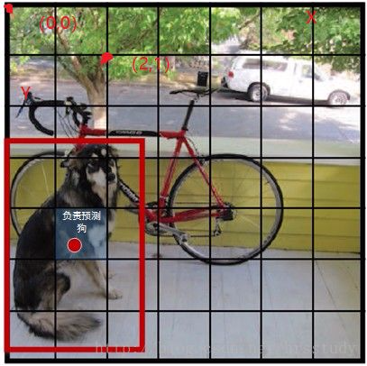
**分类任务**：每个网格单元（`grid`）还会预测 $C$ 个类别的概率 $Pr(Class_i)|Object)$。`grid` 包含目标时才会预测 $Pr$，且只预测一组类别概率，而不管边界框 $B$ 的数量是多少。

在推理时，我们乘以条件概率和单个 `box` 的置信度。

$$Pr(Class_i)|Object)*Pr(Object)*IOU_{pred}^{truth} = Pr(Class_i)*IOU_{pred}^{truth}$$

它为我们提供了每个框特定类别的置信度分数。这些分数编码了该类出现在框中的概率以及预测框拟合目标的程度。

在 `Pscal VOC` 数据集上评测 `YOLO` 模型时，我们设置 $S=7$, $B=2$（即每个 `grid` 会生成 `2` 个边界框）。`Pscal VOC` 数据集有 `20` 个类别，所以 $C=20$。所以，模型最后预测的张量维度是 $7 \times 7\times (20+5*2) = 1470$。

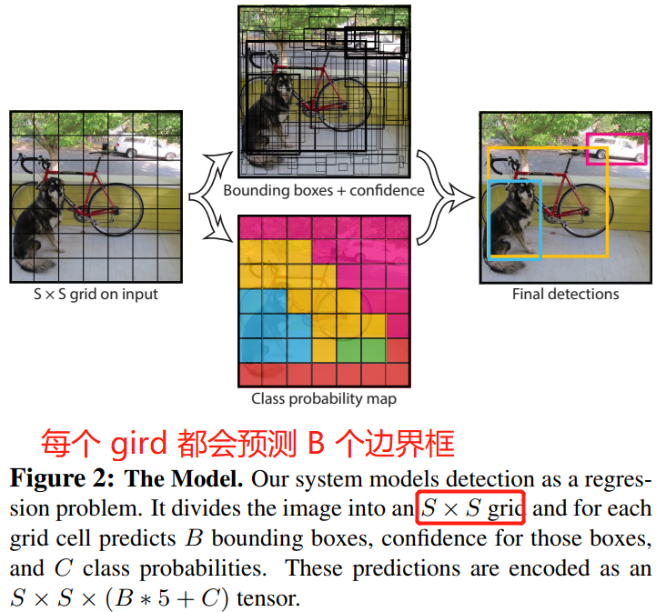

**总结**：`YOLO` 系统将检测建模为回归问题。它将图像分成 $S \times S$ 的 `gird`，每个 `grid` 都会预测 $B$ 个边界框，同时也包含 $C$ 个类别的概率，这些预测对应的就是 $S \times S \times (C + 5*B)$。

这里其实就是在描述 `YOLOv1` 检测头如何设计：回归网络的设计 + 训练集标签如何构建（即 `yoloDataset` 类的构建），下面给出一份针对 `voc` 数据集编码为 `yolo` 模型的输入标签数据的函数，读懂了这个代码，就能理解前面部分的描述。
> 代码来源[这里](https://github.com/FelixFu520/yolov1)。

```python
def encoder(self, boxes, labels):
    '''
    boxes (tensor) [[x1,y1,x2,y2],[]] 目标的边界框坐标信息
    labels (tensor) [...] 目标的类别信息
    return 7x7x30
    '''
    grid_num = 7 # 论文中设为7
    target = torch.zeros((grid_num, grid_num, 30))  # 和模型输出张量维尺寸一样都是 14*14*30
    cell_size = 1./grid_num  # 之前已经把目标框的坐标进行了归一化（这里与原论文有区别），故这里用1.作为除数
    # 计算目标框中心点坐标和宽高
    wh = boxes[:, 2:]-boxes[:, :2]  
    cxcy = (boxes[:, 2:]+boxes[:, :2])/2  
    # 1，遍历各个目标框；
    for i in range(cxcy.size()[0]):    # 对应于数据集中的每个框 这里cxcy.size()[0] == num_samples
        # 2，计算第 i 个目标中心点落在哪个 `grid` 上，`target` 相应位置的两个框的置信度值设为 `1`，同时对应类别值也置为 `1`；
        cxcy_sample = cxcy[i]  
        ij = (cxcy_sample/cell_size).ceil()-1 # ij 是一个list, 表示目标中心点cxcy在归一化后的图片中所处的x y 方向的第几个网格

        # [0,1,2,3,4,5,6,7,8,9, 10-19] 对应索引 
        # [x,y,w,h,c,x,y,w,h,c, 20 个类别的 one-hot编码] 与原论文输出张量维度各个索引对应目标有所区别
        target[int(ij[1]), int(ij[0]), 4] = 1  # 第一个框的置信度
        target[int(ij[1]), int(ij[0]), 9] = 1  # 第二个框的置信度
        target[int(ij[1]), int(ij[0]), int(labels[i])+9] = 1 # 第 int(labels[i])+9 个类别为 1
        # 3，计算目标中心所在 `grid`（网格）的左上角相对坐标：`ij*cell_size`，然后目标中心坐标相对于子网格左上角的偏移比例 `delta_xy`；
        xy = ij*cell_size  
        delta_xy = (cxcy_sample -xy)/cell_size  
        # 4，最后将 `target` 对应网格位置的 (x, y, w, h) 分别赋相应 `wh`、`delta_xy` 值。
        target[int(ij[1]), int(ij[0]), 2:4] = wh[i]  # 范围为(0,1)
        target[int(ij[1]), int(ij[0]), :2] = delta_xy
        target[int(ij[1]), int(ij[0]), 7:9] = wh[i]
        target[int(ij[1]), int(ij[0]), 5:7] = delta_xy
    return target
```

代码分析，一张图片对应的标签张量 `target` 的维度是 $7 \times 7 \times 30$。然后分别对各个目标框的 `boxes`: $(x1,y1,x2,y2)$ 和 `labels`：`(0,0,...,1,0)`(`one-hot` 编码的目标类别信息）进行处理，符合检测系统要求的输入形式。算法步骤如下：

1. 计算目标框中心点坐标和宽高，并遍历各个目标框；
2. 计算目标中心点落在哪个 `grid` 上，`target` 相应位置的两个框的置信度值设为 `1`，同时对应类别值也置为 `1`；
3. 计算目标中心所在 `grid`（网格）的左上角相对坐标：`ij*cell_size`，然后目标中心坐标相对于子网格左上角的偏移比例 `delta_xy`；
4. 最后将 `target` 对应网格位置的 $(x, y, w, h)$ 分别赋相应 `wh`、`delta_xy` 值。

#### 2.1. Network Design

`YOLO` 模型使用卷积神经网络来实现，卷积层负责从图像中提取特征，全连接层预测输出类别概率和坐标。

`YOLO` 的网络架构受 `GooLeNet` 图像分类模型的启发。网络有 `24` 个卷积层，最后面是 `2` 个全连接层。整个网络的卷积只有 $1 \times 1$ 和 $3 \times 3$ 卷积层，其中 $1 \times 1$ 卷积负责降维 ，而不是 `GoogLeNet` 的 `Inception` 模块。

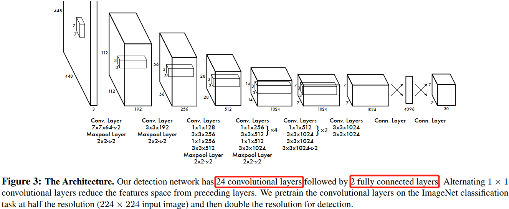
**图3：网络架构**。作者在 `ImageNet` 分类任务上以一半的分辨率（输入图像大小 $224\times 224$）训练卷积层，但预测时分辨率加倍。

`Fast YOLO` 版本使用了更少的卷积，其他所有训练参数及测试参数都和 `base YOLO` 版本是一样的。

网络的最终输出是 $7\times 7\times 30$ 的张量。这个张量所代表的具体含义如下图所示。对于每一个单元格，前 `20` 个元素是类别概率值，然后 `2` 个元素是边界框置信度，两者相乘可以得到**类别置信度**，最后 `8` 个元素是边界框的 $(x,y,w,h)$ 。之所以把置信度 $c$ 和 $(x,y,w,h)$ 都分开排列，而不是按照$(x,y,w,h,c)$ 这样排列，存粹是为了后续计算时方便。

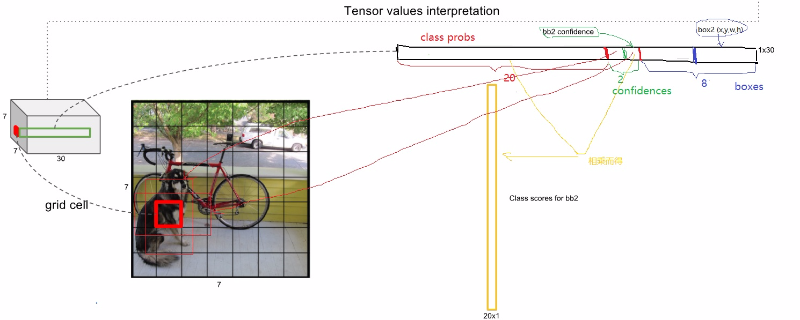

> 划分 $7 \times 7$ 网格，共 `98` 个边界框，`2` 个框对应一个类别，所以 `YOLOv1` 只能在一个网格中检测出一个目标、最多预测 `49` 个目标。

#### 2.2 Training

> 模型训练最重要的无非就是超参数的调整和损失函数的设计。

因为 `YOLO` 算法将检测问题看作是回归问题，所以自然地采用了比较容易优化的均方误差作为损失函数，但是面临定位误差和分类误差权重一样的问题；同时，在每张图像中，许多网格单元并不包含对象，即负样本（不包含物体的网格）远多于正样本（包含物体的网格），这通常会压倒了正样本的梯度，导致训练早期模型发散。

为了改善这点，引入了两个参数：$\lambda_{coord}=5$ 和 $\lambda_{noobj} =0.5$。对于边界框坐标预测损失（定位误差），采用较大的权重 $\lambda_{coord}  =5$，然后区分不包含目标的边界框和含有目标的边界框，前者采用较小权重 $\lambda_{noobj} =0.5$。其他权重则均设为 `0`。

对于大小不同的边界框，因为较小边界框的坐标误差比较大边界框要更敏感，所以为了部分解决这个问题，将网络的边界框的宽高预测改为对其平方根的预测，即预测值变为 $(x, y, \sqrt w, \sqrt h)$。

`YOLOv1` 每个网格单元预测多个边界框。在训练时，每个目标我们只需要一个边界框预测器来负责。我们指定一个预测器“负责”根据哪个预测与真实值之间**具有当前最高的 `IOU` 来预测目标**。这导致边界框预测器之间的专业化。每个预测器可以更好地预测特定大小，方向角，或目标的类别，从而改善整体召回率。

> `YOLO` 由于每个网格仅能预测 `2` 个边界框且仅可以包含一个类别，因此是对于一个单元格存在多个目标的问题，`YOLO` 只能选择一个来预测。这使得它在预测临近物体的数量上存在不足，如钢筋、人脸和鸟群检测等。

最终网络总的损失函数计算公式如下：

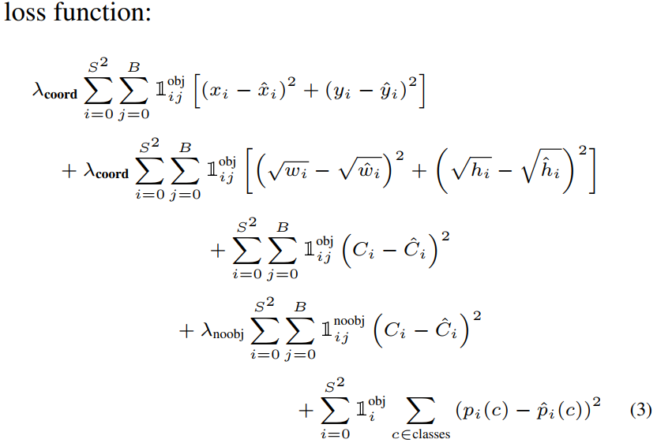

$I_{ij}^{obj}$ 指的是第 $i$ 个单元格存在目标，且该单元格中的第 $j$ 个边界框负责预测该目标。 $I_{i}^{obj}$ 指的是第 $i$ 个单元格存在目标。

+ 前 2 行计算前景的 `geo_loss`（定位 `loss`）。
+ 第 3 行计算前景的 `confidence_loss`（包含目标的边界框的置信度误差项）。
+ 第 4 行计算背景的 `confidence_loss`。
+ 第 5 行计算分类损失 `class_loss`。

值得注意的是，对于不存在对应目标的边界框，其误差项就是只有置信度，坐标项误差是没法计算的。而只有当一个单元格内确实存在目标时，才计算分类误差项，否则该项也是无法计算的。

#### 2.4. Inferences

同样采用了 `NMS` 算法来抑制多重检测，对应的模型推理结果解码代码如下，这里要和前面的 `encoder` 函数结合起来看。

```python
# 对于网络输出预测 改为再图片上画出框及score
def decoder(pred):
    """
    pred (tensor)  torch.Size([1, 7, 7, 30])
    return (tensor) box[[x1,y1,x2,y2]] label[...]
    """
    grid_num = 7
    boxes = []
    cls_indexs = []
    probs = []
    cell_size = 1./grid_num
    pred = pred.data  # torch.Size([1, 14, 14, 30])
    pred = pred.squeeze(0)  # torch.Size([14, 14, 30])
    # 0 1      2 3   4    5 6   7 8   9
    # [中心坐标,长宽,置信度,中心坐标,长宽,置信度, 20个类别] x 7x7
    contain1 = pred[:, :, 4].unsqueeze(2)  # torch.Size([14, 14, 1])
    contain2 = pred[:, :, 9].unsqueeze(2)  # torch.Size([14, 14, 1])
    contain = torch.cat((contain1, contain2), 2)    # torch.Size([14, 14, 2])

    mask1 = contain > 0.1  # 大于阈值, torch.Size([14, 14, 2])  content: tensor([False, False])
    mask2 = (contain == contain.max())  # we always select the best contain_prob what ever it>0.9
    mask = (mask1+mask2).gt(0)

    # min_score,min_index = torch.min(contain, 2) # 每个 cell 只选最大概率的那个预测框
    for i in range(grid_num):
        for j in range(grid_num):
            for b in range(2):
                # index = min_index[i,j]
                # mask[i,j,index] = 0
                if mask[i, j, b] == 1:
                    box = pred[i, j, b*5:b*5+4]
                    contain_prob = torch.FloatTensor([pred[i, j, b*5+4]])
                    xy = torch.FloatTensor([j, i])*cell_size  # cell左上角  up left of cell
                    box[:2] = box[:2]*cell_size + xy  # return cxcy relative to image
                    box_xy = torch.FloatTensor(box.size())  # 转换成xy形式 convert[cx,cy,w,h] to [x1,y1,x2,y2]
                    box_xy[:2] = box[:2] - 0.5*box[2:]
                    box_xy[2:] = box[:2] + 0.5*box[2:]
                    max_prob, cls_index = torch.max(pred[i, j, 10:], 0)
                    if float((contain_prob*max_prob)[0]) > 0.1:
                        boxes.append(box_xy.view(1, 4))
                        cls_indexs.append(cls_index.item())
                        probs.append(contain_prob*max_prob)
    if len(boxes) == 0:
        boxes = torch.zeros((1, 4))
        probs = torch.zeros(1)
        cls_indexs = torch.zeros(1)
    else:
        boxes = torch.cat(boxes, 0)  # (n,4)
        # print(type(probs))
        # print(len(probs))
        # print(probs)
        probs = torch.cat(probs, 0)  # (n,)
        # print(probs)
        # print(type(cls_indexs))
        # print(len(cls_indexs))
        # print(cls_indexs)
        cls_indexs = torch.IntTensor(cls_indexs)  # (n,)
    
    # 去除冗余的候选框，得到最佳检测框（bbox）
    keep = nms(boxes, probs)
    # print("keep:", keep)

    a = boxes[keep]
    b = cls_indexs[keep]
    c = probs[keep]
    return a, b, c
```

#### 4.1 Comparison to Other Real-Time Systems

基于 GPU Titan X 硬件环境下，与他检测算法的性能比较如下。

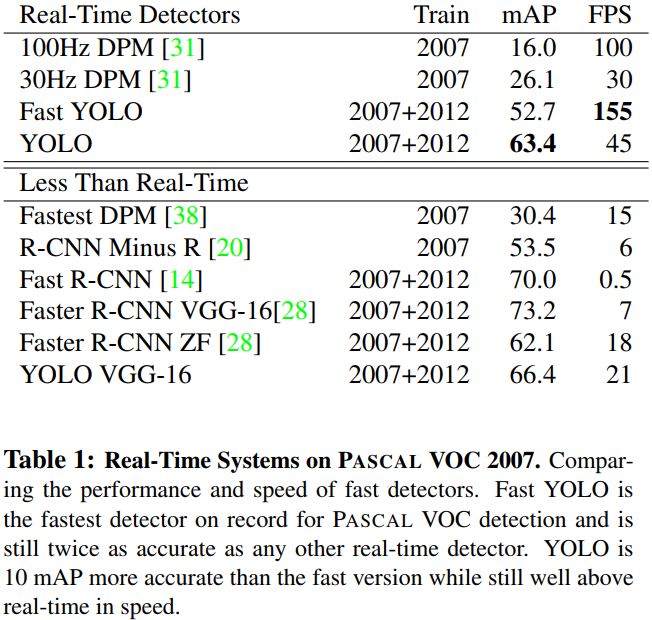

### 5，代码实现思考

一些思考：快速的阅读了网上的一些 `YOLOv1` 代码实现，发现整个 `YOLOv1` 检测系统的代码可以分为以下几个部分：

- 模型结构定义：特征提器模块 + 检测头模块（两个全连接层）。
- 数据预处理，最难写的代码，需要对原有的 `VOC` 数据做预处理，编码成 `YOLOv1` 要求的格式输入，训练集的 `label` 的 `shape` 为 `(bach_size, 7, 7, 30)`。
- 模型训练，主要由损失函数的构建组成，损失函数包括 `5` 个部分。
- 模型预测，主要在于模型输出的解析，即解码成可方便显示的形式。

## 二，[YOLOv2](http://xxx.itp.ac.cn/pdf/1612.08242.pdf)

> `YOLO9000` 是 `CVPR2017` 的最佳论文提名，但是这篇论文其实提出了 `YOLOv2` 和 `YOLO9000` 两个模型，二者略有不同。前者主要是 `YOLO` 的升级版，后者的主要检测网络也是 `YOLOv2`，同时对数据集做了融合，使得模型可以检测 `9000` 多类物体。

### 摘要

`YOLOv2` 其实就是 `YOLO9000`，作者在 `YOLOv1` 基础上改进的一种新的 `state-of-the-art` 目标检测模型，它能检测多达 `9000` 个目标！利用了多尺度（`multi-scale`）训练方法，`YOLOv2` 可以在不同尺寸的图片上运行，并取得速度和精度的平衡。

在速度达到在 `40 FPS` 同时，`YOLOv2` 获得 `78.6 mAP` 的精度，性能优于`backbone` 为 `ResNet` 的 `Faster RCNN` 和 `SSD` 等当前最优（`state-of-the-art`） 模型。最后作者提出一种联合训练目标检测和分类的方法，基于这种方法，`YOLO9000` 能实时检测多达 `9000` 种目标。

`YOLOv1` 虽然速度很快，但是还有很多缺点：

+ 虽然每个 `grid` 预测两个框，但是只能对应一个目标，对于同一个 `grid` 有着两个目标的情况下，`YOLOv` 是检测不全的，且模型最多检测 $7 \times 7 = 49$ 个目标，即表现为模型查全率低。
+ 预测框不够准确，之前回归 $(x,y,w,h)$ 的方法不够精确，即表现为模型精确率低。
+ 回归参数网络使用全连接层参数量太大，即模型检测头还不够块。

### YOLOv2 的改进

#### 1，中心坐标位置预测的改进

`YOLOv1` 模型预测的边界框中心坐标 $(x,y)$ 是基于 `grid` 的偏移，这里 `grid` 的位置是固定划分出来的，偏移量 = 目标位置 - `grid` 的位置。

**边界框的编码过程**：`YOLOv2` 参考了两阶段网络的 `anchor boxes` 来预测边界框相对先验框的偏移，同时沿用 `YOLOv1` 的方法预测边界框中心点相对于 `grid` 左上角位置的相对偏移值。$(x,y,w,h)$ 的偏移值和实际坐标值的关系如下图所示。

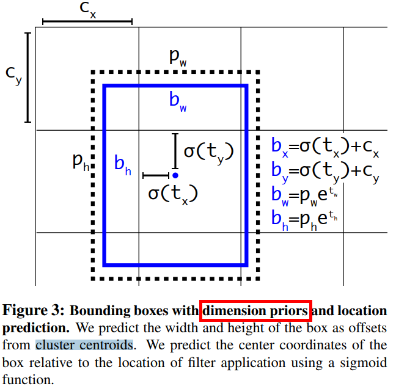

各个字母的含义如下：

+ $b_x,b_y,b_w,b_h$ ：模型预测结果转化为 `box` 中心坐标和宽高后的值
+ $t_x,t_y,t_w,t_h$ ：模型要预测的偏移量。
+ $c_x,c_y$ ：`grid` 的左上角坐标，如上图所示。
+ $p_w,p_h$ ：`anchor` 的宽和高，这里的 `anchor` 是人为定好的一个框，宽和高是固定的。

通过以上定义我们从直接预测位置改为预测一个偏移量，即基于 `anchor` 框的宽高和 `grid` 的先验位置的偏移量，位置上使用 `grid`，宽高上使用 `anchor` 框，得到最终目标的位置，这种方法叫作 `location prediction`。
> 预测偏移不直接预测位置，是因为作者发现直接预测位置会导致神经网络在一开始训练时不稳定，使用偏移量会使得训练过程更加稳定，性能指标提升了 `5%` 左右。

在数据集的预处理过程中，关键的边界框编码函数如下（代码来自 [github](https://github.com/kuangliu/pytorch-yolov2/blob/master/encoder.py)，这个版本更清晰易懂）：

```python
def encode(self, boxes, labels, input_size):
    '''Encode target bounding boxes and class labels into YOLOv2 format.
    Args:
        boxes: (tensor) bounding boxes of (xmin,ymin,xmax,ymax) in range [0,1], sized [#obj, 4].
        labels: (tensor) object class labels, sized [#obj,].
        input_size: (int) model input size.
    Returns:
        loc_targets: (tensor) encoded bounding boxes, sized [5,4,fmsize,fmsize].
        cls_targets: (tensor) encoded class labels, sized [5,20,fmsize,fmsize].
        box_targets: (tensor) truth boxes, sized [#obj,4].
    '''
    num_boxes = len(boxes)
    # input_size -> fmsize
    # 320->10, 352->11, 384->12, 416->13, ..., 608->19
    fmsize = (input_size - 320) / 32 + 10
    grid_size = input_size / fmsize

    boxes *= input_size  # scale [0,1] -> [0,input_size]
    bx = (boxes[:,0] + boxes[:,2]) * 0.5 / grid_size  # in [0,fmsize]
    by = (boxes[:,1] + boxes[:,3]) * 0.5 / grid_size  # in [0,fmsize]
    bw = (boxes[:,2] - boxes[:,0]) / grid_size        # in [0,fmsize]
    bh = (boxes[:,3] - boxes[:,1]) / grid_size        # in [0,fmsize]

    tx = bx - bx.floor()
    ty = by - by.floor()

    xy = meshgrid(fmsize, swap_dims=True) + 0.5  # grid center, [fmsize*fmsize,2]
    wh = torch.Tensor(self.anchors)              # [5,2]

    xy = xy.view(fmsize,fmsize,1,2).expand(fmsize,fmsize,5,2)
    wh = wh.view(1,1,5,2).expand(fmsize,fmsize,5,2)
    anchor_boxes = torch.cat([xy-wh/2, xy+wh/2], 3)  # [fmsize,fmsize,5,4]

    ious = box_iou(anchor_boxes.view(-1,4), boxes/grid_size)  # [fmsize*fmsize*5,N]
    ious = ious.view(fmsize,fmsize,5,num_boxes)               # [fmsize,fmsize,5,N]

    loc_targets = torch.zeros(5,4,fmsize,fmsize)  # 5boxes * 4coords
    cls_targets = torch.zeros(5,20,fmsize,fmsize)
    for i in range(num_boxes):
        cx = int(bx[i])
        cy = int(by[i])
        _, max_idx = ious[cy,cx,:,i].max(0)
        j = max_idx[0]
        cls_targets[j,labels[i],cy,cx] = 1

        tw = bw[i] / self.anchors[j][0]
        th = bh[i] / self.anchors[j][1]
        loc_targets[j,:,cy,cx] = torch.Tensor([tx[i], ty[i], tw, th])
    return loc_targets, cls_targets, boxes/grid_size
```

**边界框的解码过程**：虽然模型预测的是边界框的偏移量 $(t_x,t_y,t_w,t_h)$，但是可通过以下公式计算出边界框的实际位置。

$$
b_x = \sigma(t_x) + c_x \\\\
b_y = \sigma(t_y) + c_y \\\\
b_w = p_{w}e^{t_w} \\\\
b_h = p_{h}e^{t_h} $$

其中，$(c_x, c_y)$ 为 `grid` 的左上角坐标，因为 $\sigma$ 表示的是 `sigmoid` 函数，所以边界框的中心坐标会被约束在 `grid` 内部，防止偏移过多。$p_w$、$p_h$ 是先验框（`anchors`）的宽度与高度，其值相对于特征图大小 $W\times H$ = $13\times 13$ 而言的，因为划分为 $13 \times 13$ 个 `grid`，所以最后输出的特征图中每个 `grid` 的长和宽均是 `1`。知道了特征图的大小，就可以将边界框相对于整个特征图的位置和大小计算出来（均取值 ${0,1}$）。

$$
b_x = (\sigma(t_x) + c_x)/W \\\\
b_y = (\sigma(t_y) + c_y)/H \\\\
b_w = p_{w}e^{t_w}/W \\\\
b_h = p_{h}e^{t_h}/H
$$

在模型推理的时候，将以上 `4` 个值分别乘以图片的宽度和长度（像素点值）就可以得到边界框的实际中心坐标和大小。

在模型推理过程中，模型输出张量的解析，即边界框的解码函数如下：

```python
def decode(self, outputs, input_size):
    '''Transform predicted loc/conf back to real bbox locations and class labels.
    Args:
        outputs: (tensor) model outputs, sized [1,125,13,13].
        input_size: (int) model input size.
    Returns:
        boxes: (tensor) bbox locations, sized [#obj, 4].
        labels: (tensor) class labels, sized [#obj,1].
    '''
    fmsize = outputs.size(2)
    outputs = outputs.view(5,25,13,13)

    loc_xy = outputs[:,:2,:,:]   # [5,2,13,13]
    grid_xy = meshgrid(fmsize, swap_dims=True).view(fmsize,fmsize,2).permute(2,0,1)  # [2,13,13]
    box_xy = loc_xy.sigmoid() + grid_xy.expand_as(loc_xy)  # [5,2,13,13]

    loc_wh = outputs[:,2:4,:,:]  # [5,2,13,13]
    anchor_wh = torch.Tensor(self.anchors).view(5,2,1,1).expand_as(loc_wh)  # [5,2,13,13]
    box_wh = anchor_wh * loc_wh.exp()  # [5,2,13,13]

    boxes = torch.cat([box_xy-box_wh/2, box_xy+box_wh/2], 1)  # [5,4,13,13]
    boxes = boxes.permute(0,2,3,1).contiguous().view(-1,4)    # [845,4]

    iou_preds = outputs[:,4,:,:].sigmoid()  # [5,13,13]
    cls_preds = outputs[:,5:,:,:]  # [5,20,13,13]
    cls_preds = cls_preds.permute(0,2,3,1).contiguous().view(-1,20)
    cls_preds = softmax(cls_preds)  # [5*13*13,20]

    score = cls_preds * iou_preds.view(-1).unsqueeze(1).expand_as(cls_preds)  # [5*13*13,20]
    score = score.max(1)[0].view(-1)  # [5*13*13,]
    print(iou_preds.max())
    print(cls_preds.max())
    print(score.max())

    ids = (score>0.5).nonzero().squeeze()
    keep = box_nms(boxes[ids], score[ids])  # NMS 算法去除重复框
    return boxes[ids][keep] / fmsize
```

#### 2，1 个 gird 只能对应一个目标的改进

> 或者说很多目标预测不到，查全率低的改进

`YOLOv2` 首先把 $7 \times 7$ 个区域改为 $13 \times 13$ 个 `grid`（区域），每个区域有 5 个anchor，且每个 anchor 对应着 1 个类别，那么，输出的尺寸就应该为：`[N,13,13,125]`
> $125 = 5 \times (5 + 20)$


值得注意的是之前 `YOLOv1` 的每个 `grid` 只能预测一个目标的分类概率值，两个 `boxes` 共享这个置信度概率。现在 `YOLOv2` 使用了 `anchor` 先验框后，每个 `grid` 的每个 `anchor` 都单独预测一个目标的分类概率值。

之所以每个 `grid` 取 `5` 个 `anchor`，是因为作者对 `VOC/COCO` 数据集进行 K-means 聚类实验，发现当 `k=5` 时，模型 recall vs. complexity 取得了较好的平衡。当然，$k$ 越好，`mAP` 肯定越高，但是为了平衡模型复杂度，作者选择了 `5` 个聚类簇，即划分成 `5` 类先验框。设置先验框的主要目的是为了使得预测框与 `ground truth` 的 `IOU` 更好，所以聚类分析时选用 `box` 与聚类中心 `box` 之间的 `IOU` 值作为距离指标：

$$d(box, centroid) = 1-IOU(box, centroid)$$

> 与 `Faster RCNN` 手动设置 `anchor` 的大小和宽高比不同，YOLOv2 的 anchor 是从数据集中统计得到的。

#### 3，backbone 的改进

作者提出了一个全新的 `backbone` 网络：`Darknet-19`，它是基于前人经典工作和该领域常识的基础上进行设计的。`Darknet-19` 网络和 `VGG` 网络类似，主要使用 $3 \times 3$ 卷积，并且每个 $2 \times 2$ `pooling` 操作之后将特征图通道数加倍。借鉴 `NIN` 网络的工作，作者使用 `global average pooling` 进行预测，并在 $3 \times 3$ 卷积之间使用 $1 \times 1$ 卷积来降低特征图通道数从而降低模型计算量和参数量。`Darknet-19` 网络的每个卷积层后面都是用了 `BN` 层来加快模型收敛，防止模型过拟合。

`Darknet-19` 网络总共有 `19` 个卷积层（`convolution`）、`5` 最大池化层（`maxpooling`）。`Darknet-19` 以 `5.58` T的计算量在 `ImageNet` 数据集上取得了 `72.9%` 的 top-1 精度和 `91.2%` 的 top-5 精度。Darket19 网络参数表如下图所示。

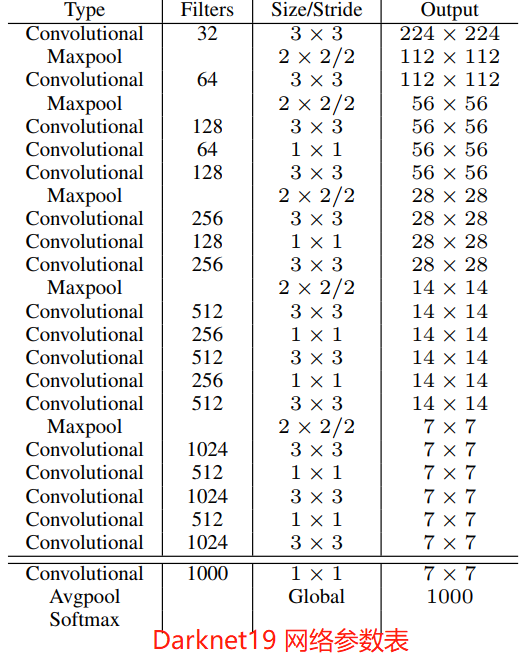

**检测训练**。在 `Darknet19` 网络基础上进行修改后用于目标检测。首先，移除网络的最后一个卷积层，然后添加滤波器个数为 `1024` 的 $3 \times 3$ 卷积层，最后添加一个 $1 \times 1$ 卷积层，其滤波器个数为模型检测需要输出的变量个数。对于 `VOC` 数据集，每个 `grid` 预测 `5` 个边界框，每个边界框有 `5` 个坐标（$t_x, t_y, t_w, t_h \ 和\ t_o$）和 `20` 个类别，所以共有 `125` 个滤波器。我们还添加了从最后的 `3×3×512` 层到倒数第二层卷积层的直通层，以便模型可以使用细粒度特征。

$$P_r(object)*IOU(b; object) = \sigma (t_o)$$

#### 4，多尺度训练

`YOLOv1` 输入图像分辨率为 $449 \times 448$，因为使用了 `anchor boxes`，所以 `YOLOv2` 将输入分辨率改为 $416 \times 416$。又因为 `YOLOv2` 模型中只有卷积层和池化层，所以YOLOv2的输入可以不限于 $416 \times 416$ 大小的图片。为了增强模型的鲁棒性，`YOLOv2` 采用了**多尺度输入训练**策略，具体来说就是在训练过程中每间隔一定的 `iterations` 之后改变模型的输入图片大小。由于 `YOLOv2` 的下采样总步长为 `32`，所以输入图片大小选择一系列为 `32` 倍数的值： $\lbrace 320, 352,...,608 \rbrace$ ，因此输入图片分辨率最小为 $320\times 320$，此时对应的特征图大小为  $10\times 10$（不是奇数），而输入图片最大为 $608\times 608$ ，对应的特征图大小为 $19\times 19$ 。在训练过程，每隔 `10` 个 `iterations` **随机**选择一种输入图片大小，然后需要修最后的检测头以适应维度变化后，就可以重新训练。

采用 `Multi-Scale Training` 策略，`YOLOv2` 可以适应不同输入大小的图片，并且预测出很好的结果。在测试时，`YOLOv2` 可以采用不同大小的图片作为输入，在 `VOC 2007` 数据集上的测试结果如下图所示。

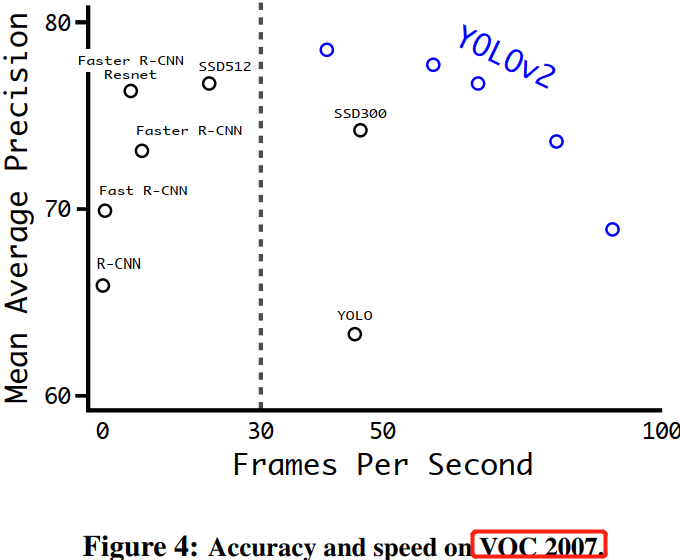

### 损失函数

**`YOLOv2` 的损失函数的计算公式归纳如下**

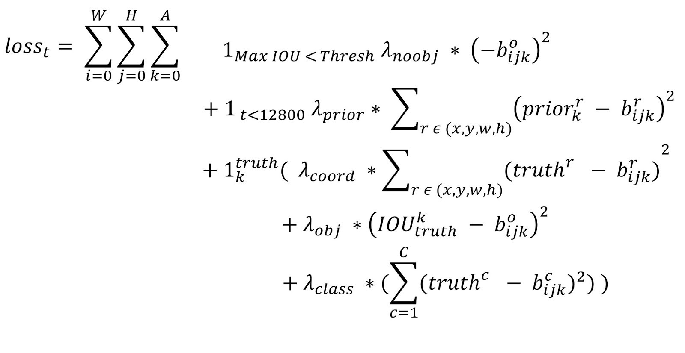

第2,3行：$t$ 是迭代次数，即前 `12800` 步我们计算这个损失，后面不计算了。即前 `12800` 步我们会优化预测的 $(x,y,w,h)$ 与 `anchor` 的 $(x,y,w,h)$ 的距离 `+` 预测的 $(x,y,w,h)$ 与 `GT` 的 $(x,y,w,h)$ 的距离，`12800` 步之后就只优化预测的 $(x,y,w,h)$与 `GT` 的 $(x,y,w,h)$ 的距离，原因是这时的预测结果已经较为准确了，`anchor`已经满足检测系统的需要，而在一开始预测不准的时候，用上 `anchor` 可以加速训练。

`YOLOv2` 在 `VOC2007` 数据集上和其他 `state-of-the-art` 模型的测试结果的比较如下曲线所示。


## 三，YOLOv3

> `YOLOv3` 的论文写得不是很好，需要完全看懂，还是要看代码，`C/C++` 基础不好的建议看 `Pytorch` 版本的复现。下文是我对原论文的精简翻译和一些难点的个人理解，以及一些关键代码解析。

### 摘要

我们对 `YOLO` 再次进行了更新，包括一些小的设计和更好的网络结构。在输入图像分辨率为 $320 \times 320$ 上运行 `YOLOv3` 模型，时间是 `22 ms` 的同时获得了 `28.2` 的 `mAP`，精度和 `SSD` 类似，但是速度更快。和其他阈值相比，`YOLOv3` 尤其在 `0.5 IOU`（也就是 $AP_{50}$）这个指标上表现非常良好。在 `Titan X` 环境下，`YOLOv3` 的检测精度为 `57.9` AP50，耗时 `51 ms`；而 `RetinaNet` 的精度只有 `57.5 AP50`，但却需要 `198 ms`，相当于 `YOLOv3`的 `3.8` 倍。
> 一般可以认为检测模型 = 特征提取器 + 检测头。
### 1，介绍

这篇论文其实也是一个技术报告，首先我会告诉你们 `YOLOv3` 的更新（改进）情况，然后介绍一些我们失败的尝试，最后是这次更新方法意义的总结。

### 2，改进

`YOLOv3` 大部分有意的改进点都来源于前人的工作，当然我们也训练了一个比其他人更好的分类器网络。

#### 2.1，边界框预测

> 这部分内容和 `YOLOv2` 几乎一致，但是内容更细致，且阈值的取值有些不一样。

和 `YOLOv2` 一样，我们依然使用维度聚类的方法来挑选 `anchor boxes` 作为边界框预测的先验框。每个边界框都会预测 $4$ 个偏移坐标 $(t_x,t_y,t_w,t_h)$。假设 $(c_x, c_y)$ 为 `grid` 的左上角坐标，$p_w$、$p_h$ 是先验框（`anchors`）的宽度与高度，那么网络预测值和边界框真实位置的关系如下所示：
> 假设某一层的 `feature map` 的大小为 $13 \times 13$， 那么 `grid cell` 就有 $13 \times 13$ 个，则第 $n$ 行第 $n$ 列的 `grid cell` 的坐标 $(x_x, c_y)$ 就是 $(n-1,n)$。

$$
b_x = \sigma(t_x) + c_x \\\\
b_y = \sigma(t_y) + c_y \\\\
b_w = p_{w}e^{t_w} \\\\
b_h = p_{h}e^{t_h} $$


$b_x,b_y,b_w,b_h$ 是边界框的实际中心坐标和宽高值。在训练过程中，我们使用平方误差损失函数。利用上面的公式，可以轻松推出这样的结论：如果预测坐标的真实值（`ground truth`）是 $\hat{t}_\ast$，那么梯度就是真实值减去预测值 $\hat{t}_\ast - t_\ast$。
> 不懂这句话什么意思，根据原论文翻译出来就是这样的。

注意，计算损失的时候，模型预测输出的 $t_x,t_y$ 外面要套一个 `sigmoid` 函数 ，否则坐标就不是 $(0,1)$ 范围内的，一旦套了 `sigmoid`，就只能用 `BCE` 损失函数去反向传播，这样第一步算出来的才是 $t_x-\hat{t}_x$；$(t_w,t_h)$ 的预测没有使用 `sigmoid` 函数，所以损失使用 $MSE$。
> $\hat{t}_x$ 是预测坐标偏移的真实值（`ground truth`）。

`YOLOv3` 使用逻辑回归来预测每个边界框的 `objectness score`（**置信度分数**）。如果当前先验框和 `ground truth` 的 `IOU` 超过了前面的先验框，那么它的分数就是 `1`。和 `Faster RCNN` 论文一样，如果先验框和 `ground truth` 的 `IOU`不是最好的，那么即使它超过了阈值，我们还是会忽略掉这个 `box`，正负样本判断的阈值取 `0.5`。**`YOLOv3` 检测系统只为每个 `ground truth` 对象分配一个边界框**。如果先验框（`bonding box prior`，其实就是聚类得到的 `anchors`）未分配给 `ground truth` 对象，则不会造成位置和分类预测损失，只有置信度损失（`only objectness`）。

将 `coco` 数据集的标签编码成 $(t_x,t_y,t_w,t_h)$ 形式的代码如下：

```python
def get_target(self, target, anchors, in_w, in_h, ignore_threshold):
    """
    Maybe have problem.
    target: original coco dataset label.
    in_w, in_h: feature map size.
    """
    bs = target.size(0)

    mask = torch.zeros(bs, self.num_anchors, in_h, in_w, requires_grad=False)
    noobj_mask = torch.ones(bs, self.num_anchors, in_h, in_w, requires_grad=False)
    tx = torch.zeros(bs, self.num_anchors, in_h, in_w, requires_grad=False)
    ty = torch.zeros(bs, self.num_anchors, in_h, in_w, requires_grad=False)
    tw = torch.zeros(bs, self.num_anchors, in_h, in_w, requires_grad=False)
    th = torch.zeros(bs, self.num_anchors, in_h, in_w, requires_grad=False)
    tconf = torch.zeros(bs, self.num_anchors, in_h, in_w, requires_grad=False)
    tcls = torch.zeros(bs, self.num_anchors, in_h, in_w, self.num_classes, requires_grad=False)
    for b in range(bs):
        for t in range(target.shape[1]):
            if target[b, t].sum() == 0:
                continue
            # Convert to position relative to box
            gx = target[b, t, 1] * in_w
            gy = target[b, t, 2] * in_h
            gw = target[b, t, 3] * in_w
            gh = target[b, t, 4] * in_h
            # Get grid box indices
            gi = int(gx)
            gj = int(gy)
            # Get shape of gt box
            gt_box = torch.FloatTensor(np.array([0, 0, gw, gh])).unsqueeze(0)
            # Get shape of anchor box
            anchor_shapes = torch.FloatTensor(np.concatenate((np.zeros((self.num_anchors, 2)),
                                                                np.array(anchors)), 1))
            # Calculate iou between gt and anchor shapes
            anch_ious = bbox_iou(gt_box, anchor_shapes)
            # Where the overlap is larger than threshold set mask to zero (ignore)
            noobj_mask[b, anch_ious > ignore_threshold, gj, gi] = 0
            # Find the best matching anchor box
            best_n = np.argmax(anch_ious)

            # Masks
            mask[b, best_n, gj, gi] = 1
            # Coordinates
            tx[b, best_n, gj, gi] = gx - gi
            ty[b, best_n, gj, gi] = gy - gj
            # Width and height
            tw[b, best_n, gj, gi] = math.log(gw/anchors[best_n][0] + 1e-16)
            th[b, best_n, gj, gi] = math.log(gh/anchors[best_n][1] + 1e-16)
            # object
            tconf[b, best_n, gj, gi] = 1
            # One-hot encoding of label
            tcls[b, best_n, gj, gi, int(target[b, t, 0])] = 1

    return mask, noobj_mask, tx, ty, tw, th, tconf, tcls
```

另一个复习版本关于数据集标签的处理代码如下：

```python
def build_targets(p, targets, model):
    # Build targets for compute_loss(), input targets(image,class,x,y,w,h)
    na, nt = 3, targets.shape[0]  # number of anchors, targets #TODO
    tcls, tbox, indices, anch = [], [], [], []
    gain = torch.ones(7, device=targets.device)  # normalized to gridspace gain
    # Make a tensor that iterates 0-2 for 3 anchors and repeat that as many times as we have target boxes
    ai = torch.arange(na, device=targets.device).float().view(na, 1).repeat(1, nt)
    # Copy target boxes anchor size times and append an anchor index to each copy the anchor index is also expressed by the new first dimension
    targets = torch.cat((targets.repeat(na, 1, 1), ai[:, :, None]), 2)

    for i, yolo_layer in enumerate(model.yolo_layers):
        # Scale anchors by the yolo grid cell size so that an anchor with the size of the cell would result in 1
        anchors = yolo_layer.anchors / yolo_layer.stride
        # Add the number of yolo cells in this layer the gain tensor
        # The gain tensor matches the collums of our targets (img id, class, x, y, w, h, anchor id)
        gain[2:6] = torch.tensor(p[i].shape)[[3, 2, 3, 2]]  # xyxy gain
        # Scale targets by the number of yolo layer cells, they are now in the yolo cell coordinate system
        t = targets * gain
        # Check if we have targets
        if nt:
            # Calculate ration between anchor and target box for both width and height
            r = t[:, :, 4:6] / anchors[:, None]
            # Select the ratios that have the highest divergence in any axis and check if the ratio is less than 4
            j = torch.max(r, 1. / r).max(2)[0] < 4  # compare #TODO
            # Only use targets that have the correct ratios for their anchors
            # That means we only keep ones that have a matching anchor and we loose the anchor dimension
            # The anchor id is still saved in the 7th value of each target
            t = t[j]
        else:
            t = targets[0]

        # Extract image id in batch and class id
        b, c = t[:, :2].long().T
        # We isolate the target cell associations.
        # x, y, w, h are allready in the cell coordinate system meaning an x = 1.2 would be 1.2 times cellwidth
        gxy = t[:, 2:4]
        gwh = t[:, 4:6]  # grid wh
        # Cast to int to get an cell index e.g. 1.2 gets associated to cell 1
        gij = gxy.long()
        # Isolate x and y index dimensions
        gi, gj = gij.T  # grid xy indices

        # Convert anchor indexes to int
        a = t[:, 6].long()
        # Add target tensors for this yolo layer to the output lists
        # Add to index list and limit index range to prevent out of bounds
        indices.append((b, a, gj.clamp_(0, gain[3] - 1), gi.clamp_(0, gain[2] - 1)))
        # Add to target box list and convert box coordinates from global grid coordinates to local offsets in the grid cell
        tbox.append(torch.cat((gxy - gij, gwh), 1))  # box
        # Add correct anchor for each target to the list
        anch.append(anchors[a])
        # Add class for each target to the list
        tcls.append(c)

    return tcls, tbox, indices, anch
```

关于更多模型推理部分代码的复现和理解，可阅读这个 [github项目代码](https://github.com/ayooshkathuria/YOLO_v3_tutorial_from_scratch)。

#### 2.2，分类预测

每个框使用**多标签分类**来预测边界框可能包含的类。我们不使用 `softmax` 激活函数，因为我们发现它对模型的性能影响不好。相反，我们只是使用独立的逻辑分类器。在训练过程中，我们使用二元交叉熵损失来进行类别预测。

在这个数据集 Open Images Dataset 中有着大量的重叠标签。如果使用 `softmax` ，意味着强加了一个假设，**即每个框只包含一个类别**，但通常情况并非如此。多标签方法能更好地模拟数据。

#### 2.3，跨尺度预测

`YOLOv3` 可以预测 `3` 种不同尺度（`scale`）的框。首先检测系统利用和特征金字塔网络[8]类似的概念，来提取不同尺度的特征。我们在基础的特征提取器基础上添加了一些卷积层。这些卷积层的最后会预测一个 `3` 维张量编码：边界框，框中目标和分类预测。在 `COCO` 数据集的实验中，我们每个输出尺度都预测 `3` 个 `boxes`，所以模型最后输出的张量大小是 $N \times N \times [3*(4+1+80)]$，其中包含 `4` 个边界框`offset`、`1` 个 `objectness` 预测（前景背景预测）以及 `80` 种分类预测。
> `objectness` 预测其实就是前景背景预测，有些类似 `YOLOv2` 的置信度 `c` 的概念。

然后我们从前面两层得到特征图，并上采样 `2` 倍。再从网络更早的层中获得特征图，用 `element-wise` 方式把高低两种分辨率的特征图连接到一起。这样做能使我们获得上采样特征的有意义的语义信息和来自早期特征的细粒度信息。之后，我们添加几个卷积层来处理这个特征映射组合，并最终预测出一个相似的、大小是原先两倍的张量。

按照这种设计方式，来预测最后一个尺度的 `boxes`。因此，我们对第三种尺度的预测将从所有先前的计算中获益，同时能从早期的网络中获得细粒度的特征。

我们依然使用 `k-means` 聚类来确定我们的先验边界框（`box priors`，即选择的 `anchors`）。我们只是选择了 `9` 个聚类（`clusters`）和 `3` 个尺度（`scales`），然后在整个尺度上均匀分割聚类。在`COCO` 数据集上，`9` 个聚类是：（10×13）;（16×30）;（33×23）;（30×61）;（62×45）;（59×119）;（116×90）;（156×198）;（373×326）。

从上面的描述可知，`YOLOv3` 的检测头变成了 `3` 个分支，各分支的输出张量的尺寸如下：

- 13\*13\*3\*(4+1+80)
- 26\*26\*3\*(4+1+80)
- 52\*52\*3\*(4+1+80)

`3` 个分支分别对应 `32` 倍、`16` 倍、`8`倍下采样，也就是分别预测大、中、小目标。`32` 倍下采样的特征图的每个点感受野更大，所以用来预测大目标。

每个 `sacle` 分支的每个 `grid` 都会预测 `3` 个框，每个框预测 `5` 元组+ `80` 个 `one-hot` `vector`类别，所以一共 `size` 是：`3*(4+1+80)`。

根据前面的内容，可以知道，`YOLOv3` 总共预测 $13 \times 13 + 26 \times 26 + 52 \times 52) \times 3 = 10467(YOLOv3) \gg 845 = 13 \times 13 \times 5(YOLOv2)$ 个边界框。

#### 2.4，新的特征提取网络

我们使用一个新的网络来执行特征提取。它是 `Darknet-19`和新型残差网络方法的融合，由连续的 $3\times 3$ 和 $1\times 1$ 卷积层组合而成，并添加了一些 `shortcut connection`，整体体量更大。因为一共有 $53 = (1+2+8+8+4)\times 2+4+2+1 $ 个卷积层，所以我们称为 `Darknet-53`。

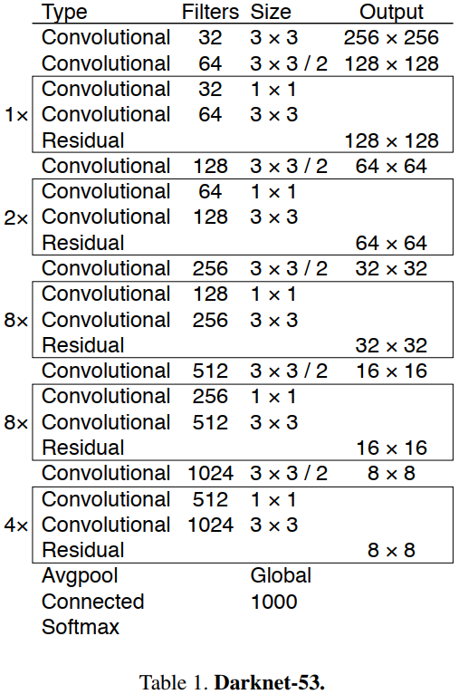

总的来说，`DarkNet-53` 不仅使用了全卷积网络，将 `YOLOv2` 中降采样作用 `pooling` 层都换成了 `convolution`(`3x3，stride=2`) 层；而且引入了残差（`residual`）结构，不再使用类似 `VGG` 那样的直连型网络结构，因此可以训练更深的网络，即卷积层数达到了 `53` 层。（更深的网络，特征提取效果会更好）

`Darknet53` 网络的 `Pytorch` 代码如下所示。
> 代码来源[这里](https://github.com/BobLiu20/YOLOv3_PyTorch.git)

```python
import torch
import torch.nn as nn
import math
from collections import OrderedDict

__all__ = ['darknet21', 'darknet53']


class BasicBlock(nn.Module):
    """basic residual block for Darknet53，卷积层分别是 1x1 和 3x3
    """
    def __init__(self, inplanes, planes):
        super(BasicBlock, self).__init__()
        self.conv1 = nn.Conv2d(inplanes, planes[0], kernel_size=1,
                               stride=1, padding=0, bias=False)
        self.bn1 = nn.BatchNorm2d(planes[0])
        self.relu1 = nn.LeakyReLU(0.1)
        self.conv2 = nn.Conv2d(planes[0], planes[1], kernel_size=3,
                               stride=1, padding=1, bias=False)
        self.bn2 = nn.BatchNorm2d(planes[1])
        self.relu2 = nn.LeakyReLU(0.1)

    def forward(self, x):s
        residual = x

        out = self.conv1(x)
        out = self.bn1(out)
        out = self.relu1(out)

        out = self.conv2(out)
        out = self.bn2(out)
        out = self.relu2(out)

        out += residual
        return out


class DarkNet(nn.Module):
    def __init__(self, layers):
        super(DarkNet, self).__init__()
        self.inplanes = 32
        self.conv1 = nn.Conv2d(3, self.inplanes, kernel_size=3, stride=1, padding=1, bias=False)
        self.bn1 = nn.BatchNorm2d(self.inplanes)
        self.relu1 = nn.LeakyReLU(0.1)

        self.layer1 = self._make_layer([32, 64], layers[0])
        self.layer2 = self._make_layer([64, 128], layers[1])
        self.layer3 = self._make_layer([128, 256], layers[2])
        self.layer4 = self._make_layer([256, 512], layers[3])
        self.layer5 = self._make_layer([512, 1024], layers[4])

        self.layers_out_filters = [64, 128, 256, 512, 1024]

        for m in self.modules():
            if isinstance(m, nn.Conv2d):
                n = m.kernel_size[0] * m.kernel_size[1] * m.out_channels
                m.weight.data.normal_(0, math.sqrt(2. / n))
            elif isinstance(m, nn.BatchNorm2d):
                m.weight.data.fill_(1)
                m.bias.data.zero_()

    def _make_layer(self, planes, blocks):
        layers = []
        # 每个阶段的开始都要先 downsample，然后才是 basic residual block for Darknet53
        layers.append(("ds_conv", nn.Conv2d(self.inplanes, planes[1], kernel_size=3,
                                stride=2, padding=1, bias=False)))
        layers.append(("ds_bn", nn.BatchNorm2d(planes[1])))
        layers.append(("ds_relu", nn.LeakyReLU(0.1)))
        #  blocks
        self.inplanes = planes[1]
        for i in range(0, blocks):
            layers.append(("residual_{}".format(i), BasicBlock(self.inplanes, planes)))
        return nn.Sequential(OrderedDict(layers))

    def forward(self, x):
        x = self.conv1(x)
        x = self.bn1(x)
        x = self.relu1(x)

        x = self.layer1(x)
        x = self.layer2(x)
        out3 = self.layer3(x)
        out4 = self.layer4(out3)
        out5 = self.layer5(out4)

        return out3, out4, out5

def darknet21(pretrained, **kwargs):
    """Constructs a darknet-21 model.
    """
    model = DarkNet([1, 1, 2, 2, 1])
    if pretrained:
        if isinstance(pretrained, str):
            model.load_state_dict(torch.load(pretrained))
        else:
            raise Exception("darknet request a pretrained path. got [{}]".format(pretrained))
    return model

def darknet53(pretrained, **kwargs):
    """Constructs a darknet-53 model.
    """
    model = DarkNet([1, 2, 8, 8, 4])
    if pretrained:
        if isinstance(pretrained, str):
            model.load_state_dict(torch.load(pretrained))
        else:
            raise Exception("darknet request a pretrained path. got [{}]".format(pretrained))
    return model
```

`3` 个预测分支，对应预测 `3` 种尺度（大、种、小），也都采用了全卷积的结构。

`YOLOv3` 的 `backbone` 选择 `Darknet-53`后，其检测性能远超 `Darknet-19`，同时效率上也优于 `ResNet-101` 和 `ResNet-152`，对比实验结果如下：

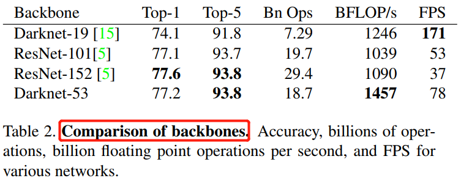

在对比实验中，每个网络都使用相同的设置进行训练和测试。运行速度 `FPS` 是在 `Titan X` 硬件上，输入图像大小为 $256 \times 256$ 上测试得到的。从上表可以看出，`Darknet-53` 和 `state-of-the-art` 分类器相比，有着更少的 `FLOPs` 和更快的速度。和 `ResNet-101` 相比，精度更高并且速度是前者的 `1.5` 倍；和 `ResNet-152` 相比，精度相似，但速度是它的 `2` 倍以上。

`Darknet-53` 也可以实现每秒最高的测量浮点运算。这意味着其网络结构可以更好地利用 `GPU`，从而使其评估效率更高，速度更快。这主要是因为 `ResNets` 的层数太多，效率不高。

#### 2.5，训练

和 `YOLOv2` 一样，我们依然训练所有图片，没有 `hard negative mining or any of that stuff`。我们依然使用多尺度训练，大量的数据增强操作和 `BN` 层以及其他标准操作。我们使用之前的 `Darknet` 神经网络框架进行训练和测试[12]。

**损失函数的计算公式如下**。

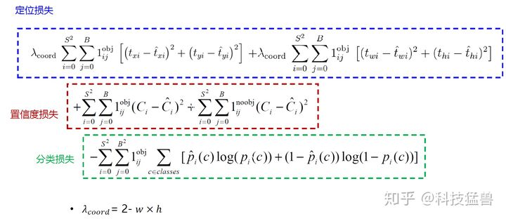

`YOLO v3` 使用多标签分类，用多个独立的 `logistic` 分类器代替 `softmax` 函数，以计算输入属于特定标签的可能性。在计算分类损失进行训练时，`YOLOv3` 对每个标签使用二元交叉熵损失。

**正负样本的确定**：

+ 正样本：与 `GT` 的 `IOU` 最大的框。
+ 负样本：与 `GT` 的 `IOU<0.5` 的框。
+ 忽略的样本：与 `GT` 的 `IOU>0.5` 但不是最大的框。
+ 使用 $t_x$ 和 $t_y$ （而不是 $b_x$ 和 $b_y$ ）来计算损失。

注意：**每个 `GT` 目标仅与一个先验边界框相关联。如果没有分配先验边界框，则不会导致分类和定位损失，只会有目标的置信度损失**。

**YOLOv3 网络结构图如下所示**（来源 [这里](https://zhuanlan.zhihu.com/p/183781646?utm_source=wechat_session&utm_medium=social&utm_oi=737449911926140928) ）。

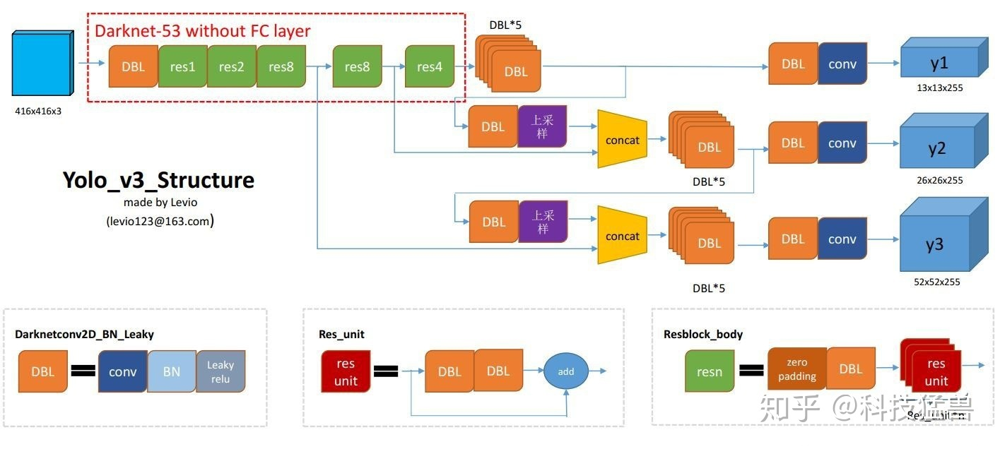

### 3，实验结果

`YOLOv3` 实验结果非常好！详情见表3。

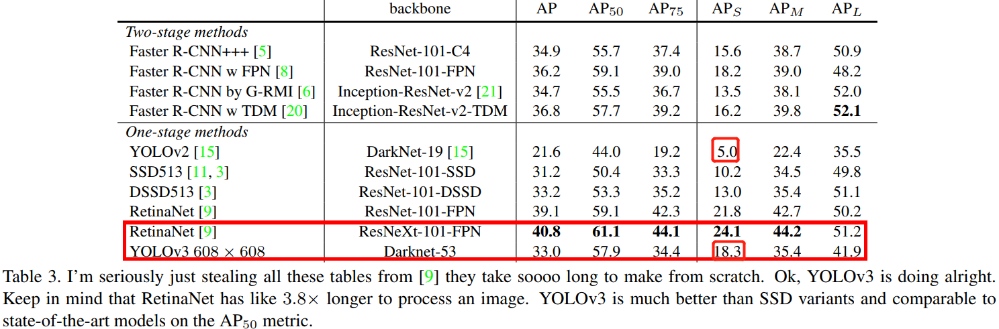

就 `COCO` 的 `mAP` 指标而言，`YOLOv3` 和 `SSD` 变体相近，但是速度却比后者快了 `3` 倍。尽管如此，`YOLOv3` 还是比 `Retinanet` 这样的模型在精度上要差一些。

但是当我们以 `IOU = 0.5` 这样的旧指标对比，`YOLOv3` 表现更好，几乎和 `Retinanet` 相近，远超 `SSD` 变体。这表面它其实是一款非常灵活的检测器，擅长为检测对象生成合适的边界框。然而，随着IOU阈值增加，YOLOv3 的性能开始同步下降，这时它预测的边界框就不能做到完美对齐了。

在过去的 `YOLOv1/v2` 上，`YOLO` 一直在小目标检测领域表现不好，现在 `YOLOv3` 基本解决了这个问题，有着更好的 $AP_S$ 性能。但是它目前在中等尺寸或大尺寸物体上的表现还相对较差，仍需进一步的完善。

当我们基于 $AP_{50}$ 指标绘制精度和速度曲线（`Figure 3`）时，我们发现YOLOv3与其他检测系统相比具有显着优势，换句话说，它更快更好。

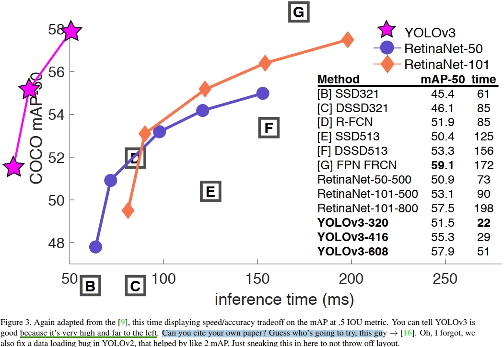
> 从 `Figure 3` 可以看出，`YOLOv3` 的曲线非常靠近曲线坐标的同时又非常高，这意味着 `YOLOv3` 有着良好速度的同时又有很好的精度，无愧当前最强目标检测模型。

### 4，失败的尝试

一些没有作用的尝试工作如下。

**Anchor box x,y 偏移预测**。我们尝试了常规的 `Anchor box` 预测方法，比如利用线性激活将坐标 $x、y$ 的偏移程度，预测为边界框宽度或高度的倍数。但我们发现这种做法降低了模型的稳定性，且效果不佳。

**用线性方法预测 x,y，而不是使用 logistic**。我们尝试使用线性激活函数来直接预测 $x，y$ 的偏移，而不是 `ligistic` 激活函数，但这降低了 `mAP`。

**focal loss**。我们尝试使用focal loss，但它使我们的 `mAP`降低了 `2` 点。 对于 `focal loss` 函数试图解决的问题，`YOLOv3` 已经具有鲁棒性，因为它具有单独的对象预测和条件类别预测。因此，对于大多数示例来说，类别预测没有损失？或者其他的东西？我们并不完全确定。

**双 IOU 阈值和真值分配**。在训练过程中，`Faster RCNN` 用了两个`IOU` 阈值，如果预测的边框与的 `ground truth` 的 `IOU` 是 `0.7`，那它是正样本 ；如果 `IOU` 在 [0.3—0.7]之间，则忽略这个 `box`；如果小于 `0.3`，那它是个负样本。我们尝试了类似的策略，但效果并不好。

### 5，改进的意义

`YOLOv3` 是一个很好的检测器，速度很快，很准确。虽然它在 `COCO` 数据集上的 `mAP` 指标，即 $AP_{50}$ 到 $AP_{90}$ 之间的平均值上表现不好，但是在旧指标 $AP_{50}$ 上，它表现非常好。

总结 `YOLOv3` 的改进点如下：

+ 使用金字塔网络来实现多尺度预测，从而解决小目标检测的问题。
+ 借鉴残差网络来实现更深的 `Darknet-53`，从而提升模型检测准确率。
+ 使用 `sigmoid` 函数替代 `softmax` 激活来实现多标签分类器。
+ 位置预测修改，一个 `gird` 预测 `3` 个 `box`。

## 四，YOLOv4

> 因为 `YOLOv1-v3` 的作者不再更新 `YOLO` 框架，所以 `Alexey Bochkovskiy` 接起了传承 `YOLO` 的重任。相比于它的前代，`YOLOv4` 不再是原创性且让人眼前一亮的研究，但是却集成了目标检测领域的各种实用 `tricks` 和即插即用模块 ，称得上是基于 `YOLOv3` 框架的各种目标检测 `tricks` 的集大成者。
> 本文章不会对原论文进行一一翻译，但是做了系统性的总结和关键部分的翻译。

### 1，摘要及介绍

我们总共使用了：`WRC`、`CSP`、`CmBN`、`SAT`、`Mish` 激活和 `Mosaic` 数据增强、`CIoU` 损失方法，并组合其中的一部分，使得最终的检测模型在 `MS COCO` 数据集、`Tesla V100` 显卡上达到了 `43.5%` `AP` 精度 和 `65` `FPS` 速度。

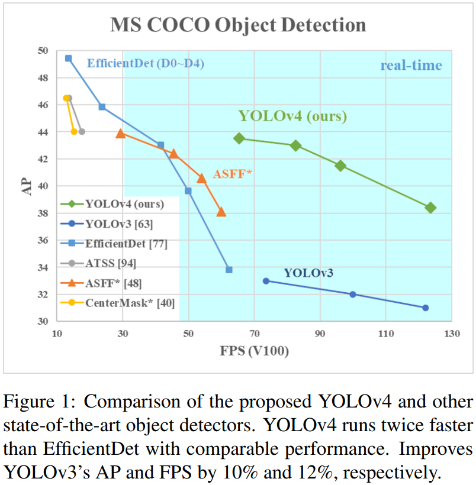

我们的主要贡献在于：

1. 构建了简单高效的 `YOLOv4` 检测器，修改了 `CBN`、`PAN`、`SAM` 方法使得 `YOLOv4` 能够在一块 `1080Ti` 上就能训练。
2. 验证了当前最先进的 `Bag-of-Freebies` 和 `Bag-of-Specials` 方法在训练期间的影响。

目前的目标检测网络分为两种：一阶段和两阶段。检测算法的组成：`Object detector = backbone + neck + head`，具体结构如下图所示。

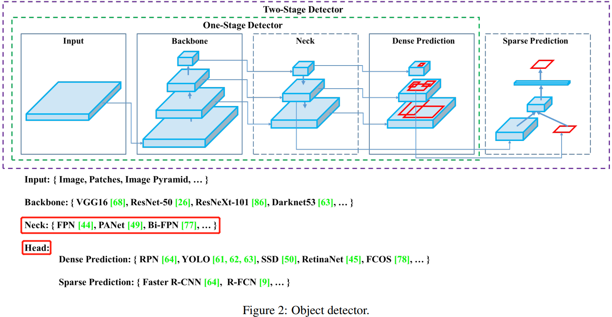

### 2，相关工作

#### 2.1，目标检测方法

按照检测头的不同（`head`）将目标检测模型分为：两阶段检测和一阶段检测模型，各自代表是 `Faster RCNN` 和 `YOLO` 等，最近也出了一些无 `anchor` 的目标检测器，如 `CenterNet` 等。近几年来的检测器会在`Backbone`网络（`backbone`）和头部网络（`head`）之间插入一些网络层，主要作用是**收集不同阶段的特征**。，称其为检测器的颈部（`neck`）。 `neck` 通常由几个自下而上（`bottom-up`）的路径和几个自上而下（`top-down`）的路径组成。 配备此机制的网络包括特征金字塔网络（`FPN`）[44]，路径聚合网络（`PAN`）[49]，`BiFPN` [77]和`NAS-FPN` [17]。

一般，目标检测器由以下几部分组成：

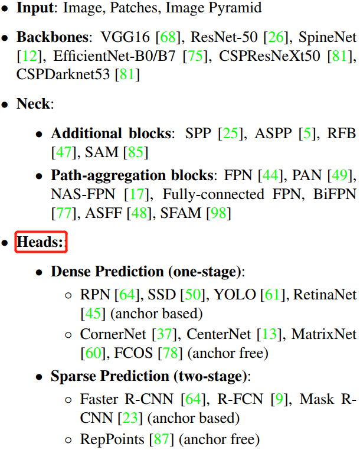

#### 2.2，Bag of freebies（免费技巧）

> 不会改变模型大小，主要是针对输入和 `loss` 等做的优化工作，一切都是为了让模型训练得更好。

最常用的方式是**数据增强**（`data augmentation`），目标是为了提升输入图像的可变性（`variability`），这样模型在不同环境中会有更高的鲁棒性。常用的方法分为两类：光度失真和几何失真（`photometric distortions and geometric distortions`）。在处理**光度**失真时，我们调整了图像的亮度、对比度、色调、饱和度和噪声；对于**几何**失真，我们添加随机缩放，裁剪，翻转和旋转。

上述数据增强方法都是**逐像素调整**的，并且保留了调整区域中的所有原始像素信息。此外，也有些研究者将重点放在模拟**对象遮挡**的问题上，并取得了一些成果。例如随机擦除(`random-erase`)[100] 和 `CutOut` [11] 方法会随机选择图像中的矩形区域，并填充零的随机或互补值。而捉迷藏(`hide-and-seek`)[69] 和网格遮罩(`grid-mask`)[6] 方法则随机或均匀地选择图像中的多个矩形区域，并将它们替换为所有的 `zeros`。这个概念有些类似于 `Dropout`、`DropConnect` 和 `DropBlock` 这些在 `feature` 层面操作的方法，如 。此外，一些研究人员提出了使用**多个图像一起执行数据增强**的方法。 例如，`MixUp` 方法使用两个图像以不同的系数比值相乘后叠加，然后使用这些叠加的比值来调整标签。 对于 `CutMix`，它是将裁切后的图像覆盖到其他图像的矩形区域，并根据混合区域的大小调整标签。 除了以上方法之外，还有 `style transfer GAN` 方法用于数据扩充、减少 `CNN` 所学习的纹理偏差。
> `MIX-UP`：`Mix-up` 在分类任务中，将两个图像按照不同的比例相加，例如 $A\ast 0.1 + B\ast 0.9=C$，那么 $C$的 `label` 就是 $[0.1A, 0.9A]$。在目标检测中的做法就是将一些框相加，这些 `label` 中就多了一些不同置信度的框。

上面的方法是针对数据增强目标，第二类方法是针对解决**数据集中语义分布可能存在偏差**的问题（` semantic distribution in the dataset may have bias`）。在处理语义分布偏差问题时，**类别不平衡**（`imbalance between different classes`）问题是其中的一个关键，在两阶段对象检测器中通常通过困难负样本挖掘（`hard negative example mining`）或在线困难样本挖掘（`online hard example mining`，简称 `OHEM`）来解决。但样本挖掘方法并不能很好的应用于一阶段检测器，因为它们都是密集检测架构（`dense prediction architecture`）。因此，何凯明等作者提出了 `Focal Loss` 用来解决类别不平衡问题。 另外一个关键问题是，很难用 `one-hot hard representation` 来表达不同类别之间的关联度的关系，但执行标记时又通常使用这种表示方案。 因此在（`Rethinking the inception architecture for computer vision`）论文中提出标签平滑（`label smoothing`）的概念，将硬标签转换为软标签进行训练，使模型更健壮。为了获得更好的软标签，论文(`Label refinement network for
coarse-to-fine semantic segmentation`)介绍了知识蒸馏的概念来设计标签细化网络。

最后一类方法是针对**边界框（`BBox`）回归的目标函数**。传统的目标检测器通常使用均方误差（$MSE$）对`BBox` 的中心点坐标以及高度和宽度直接执行回归，即 $\lbrace x_{center}, y_{center}, w, h \rbrace$ 或者 $\lbrace x_{top-left}, y_{top-left}, x_{bottom-right}, y_{bottom-right} \rbrace$ 坐标。如果基于锚的方法，则估计相应的偏移量，例如 $\lbrace x_{cener-offset}, y_{cener-offset}, w, h \rbrace$ 或者 $\lbrace x_{top-left-offset}, y_{top-left-offset}, x_{bottom-right-offset}, y_{bottom-right-offset} \rbrace$。这些直接估计 `BBox` 的各个点的坐标值的方法，是将这些点视为独立的变量，但是实际上这没有考虑对象本身的完整性。为了更好的回归 BBox，一些研究者提出了 `IOU` 损失[90]。顾名思义，`IoU` 损失既是使用 `Ground Truth` 和预测 `bounding box`（`BBox`）的交并比作为损失函数。因为 `IoU` 是尺度不变的表示，所以可以解决传统方法计算 $\lbrace x，y，w，h \rbrace$ 的 $L1$ 或 $L2$ 损失时，损失会随着尺度增加的问题。 最近，一些研究人员继续改善 `IoU` 损失。 例如，`GIoU` 损失除了覆盖区域外还包括对象的形状和方向，`GIoU` 损失的分母为同时包含了预测框和真实框的最小框的面积。`DIoU` 损失还考虑了对象中心的距离，而`CIoU` 损失同时考虑了重叠区域，中心点之间的距离和纵横比。 `CIoU` 损失在 `BBox` 回归问题上可以实现更好的收敛速度和准确性。
> [90] 论文: An advanced object detection network. 

#### 2.3，Bag of specials（即插即用模块+后处理方法）

对于那些仅增加少量推理成本但可以显著提高目标检测器准确性的**插件模块或后处理方法**，我们将其称为 `“Bag of specials”`。一般而言，这些插件模块用于增强模型中的某些属性，例如**扩大感受野，引入注意力机制或增强特征集成能力**等，而后处理是用于筛选模型预测结果的方法。

**增大感受野模块**。用来增强感受野的常用模块有 `SPP`、`ASPP` 和 `RFB`。`SPP` 起源于空间金字塔匹配（`SPM`）,`SPM` 的原始方法是将特征图分割为几个 $d\times d$ 个相等的块，其中 $d$ 可以为 $\lbrace 1,2,3，.. \rbrace$，从而形成空间金字塔。`SPP` 将 `SPM` 集成到 `CNN` 中，并使用最大池化操作（`max pooling`）替代 `bag-of-word operation`。原始的 `SPP` 模块是输出一维特征向量，这在 FCN 网络中不可行。

**引入注意力机制**。在目标检测中经常使用的注意力模块，通常分为 `channel-wise` 注意力和 `point-wise` 注意力。代表模型是 `SE` 和 `SAM`（Spatial Attention Module ）。虽然 `SE` 模块可以提高 `ReSNet50` 在 `ImageNet` 图像分类任务 `1%` 的 `top-1` 准确率而计算量只增加 `2%`，但是在 `GPU` 上，通常情况下，它会将增加推理时间的 `10%` 左右，所以更适合用于移动端。但对于 `SAM`，它只需要增加 `0.1％` 的额外的推理时间，就可以在 `ImageNet` 图像分类任务上将 `ResNet50-SE` 的`top-1` 准确性提高 `0.5％`。 最好的是，它根本不影响 `GPU` 上的推理速度。

**特征融合或特征集成**。早期的实践是使用 `skip connection` 或 `hyper-column` 将低层物理特征集成到高层语义特征。 由于诸如 `FPN` 的多尺度预测方法已变得流行，因此提出了许多集成了不同特征金字塔的轻量级模块。 这种模块包括 `SFAM`，`ASFF`和 `BiFPN`。 `SFAM` 的主要思想是使用 `SE` 模块在多尺度级联特征图上执行通道级级别的加权。 对于 `ASFF`，它使用`softmax` 作为逐点级别权重，然后添加不同比例的特征图。在`BiFPN` 中，提出了多输入加权残差连接以执行按比例的级别重新加权，然后添加不同比例的特征图。

**激活函数**。良好的激活函数可以使梯度在反向传播算法中得以更有效的传播，同时不会引入过多的额外计算成本。`2010` 年 `Nair` 和 `Hinton` 提出的 `ReLU` 激活函数，实质上解决了传统的`tanh` 和 `sigmoid` 激活函数中经常遇到的梯度消失问题。随后，随后，`LReLU`，`PReLU`，`ReLU6`，比例指数线性单位（`SELU`），`Swish`，`hard-Swish` 和 `Mish`等激活函数也被提出来，用于解决梯度消失问题。`LReLU` 和 `PReLU` 的主要目的是解决当输出小于零时 `ReLU` 的梯度为零的问题。而 `ReLU6` 和 `Hard-Swish` 是专门为量化网络设计的。同时，提出了 `SELU` 激活函数来对神经网络进行自归一化。 最后，要注意 `Swish` 和 `Mish` 都是连续可区分的激活函数。

**后处理**。最开始常用 `NMS` 来剔除重复检测的 `BBox`，但是 `NMS` 会不考虑上下文信息（可能会把一些相邻检测框框给过滤掉），因此 `Girshick` 提出了 `Soft NMS`，为相邻检测框设置一个衰减函数而非彻底将其分数置为零。而 `DIoU NMS` 则是在 `soft NMS` 的基础上将中心距离的信息添加到 `BBox` 筛选过程中。值得一提的是，因为上述后处理方法都没有直接涉及捕获的图像特征，因此在后续的 `anchor-free` 方法中不再需要 `NMS` 后处理。

### 3，方法

我们的基本目标是在生产系统中快速对神经网络进行操作和并行计算优化，而不是使用低计算量理论指示器（`BFLOP`）。 我们提供了两种实时神经网络：

+ 对于 `GPU`，我们在卷积层中使用少量分组（1-8）：如`CSPResNeXt50 / CSPDarknet53`
+ 对于 `VPU`，我们使用分组卷积，但是我们避免使用 `SE`-特别是以下模型：`EfficientNet-lite / MixNet [76] / GhostNet [21] / MobiNetNetV3`

#### 3.1，架构选择

我们的目标是在输入图像分辨率、卷积层数量、参数量、层输出（滤波器）数量之间找到最优平衡。我们大量的研究表面，在 `ILSVRC2012(ImageNet)` 分类数据集上，`CSPResNext50` 网络优于 `CSPDarknet`，但是在 `MS COCO` 目标检测数据集上，却相反。
> 这是为什么呢，两种网络，一个分类数据集表现更好，一个检测数据集表现更好。

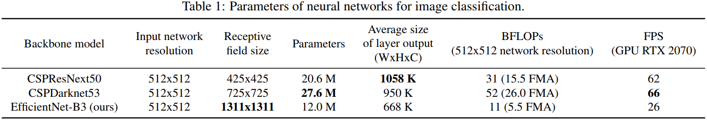

在分类问题上表现最优的参考模型并不一定总是在检测问题上也表现最优。与分类器相比，检测器需要满足以下条件：

+ 更高的输入网络尺寸（分辨率），用于检测多个小型物体。
+ 更多的网络层，用以得到更高的感受野以覆盖更大的输入网络尺寸。
+ 更多参数，用以得到更大的模型容量，从而可以在单个图像中检测到多个不同大小的对象。

表1 显示了 `CSPResNeXt50`，`CSPDarknet53` 和`EfficientNet B3` 网络的信息。`CSPResNext50` 仅包含`16` 个 $3\times 3$ 卷积层，最大感受野为 $425\times 425$和网络参数量为 `20.6 M`，而 `CSPDarknet53` 包含 `29` 个 $3\times 3$ 卷积层，最大感受野为 $725\times 725$ 感受野和参数量为 `27.6 M`。理论上的论证再结合作者的大量实验结果，表面 `CSPDarknet53` 更适合作为目标检测器的 `backbone`。

不同大小的感受野的影响总结如下：

- 达到对象大小 - 允许查看整个对象
- 达到网络大小 - 允许查看对象周围的上下文环境
- 超过网络规模 - 增加图像点和最终激活之间的连接

我们在 `CSPDarknet53` 上添加了 `SPP` 模块，因为它显著增加了感受野，分离出最重要的上下文特征，并且几乎没有降低网络运行速度。 我们使用 `PANet` 作为针对不同检测器级别的来自不同`backbone` 级别的参数聚合方法，而不是 `YOLOv3`中使用的`FPN`。

最后，我们的 `YOLOv4` 架构体系如下：

- `backbone`：`CSPDarknet53` + `SPP`
- `neck`: `PANet`
- `head`：`YOLOv3` 的 `head`

#### 3.2，Selection of BoF and BoS

为了更好的训练目标检测模型，`CNN` 通常使用如下方法：

- 激活函数：`ReLU`，`leaky-ReLU`，`parameter-ReLU`，`ReLU6`，`SELU`，`Swish` 或 `Mish`；
- 边界框回归损失：`MSE`，`IoU`，`GIoU`，`CIoU`，`DIoU` 损失；
- 数据扩充：`CutOut`，`MixUp`，`CutMix`
- 正则化方法：`DropOut`，`DropPath`，空间 `DropOut` 或 `DropBlock`
- 通过均值和方差对网络激活进行归一化：批归一化（BN），交叉-GPU 批处理规范化（`CGBN` 或 `SyncBN`），过滤器响应规范化（`FRN`）或交叉迭代批处理规范化（`CBN`）；
- 跳跃连接：残差连接，加残差连接，多输入加权残差连接或跨阶段局部连接（`CSP`）

以上方法中，我们首先提出了难以训练的 `PRELU` 和 `SELU`，以及专为量化网络设计的 `ReLU6` 激活。因为 `DropBlock` 作者证明了其方法的有效性，所以正则化方法中我们使用 `DropBlock`。

#### 3.3，额外的改进

> 这些方法是作者对现有方法做的一些改进。

为了让 `YOLOv4` 能更好的在单个 `GPU` 上训练，我们做了以下额外改进：

- 引入了新的数据增强方法：`Mosaic` 和自我对抗训练 `self-adversarial training`（`SAT`）。
- 通过遗传算法选择最优超参数。
- 修改了 `SAM`、`PAN` 和 `CmBN`。

`Mosaic` 是一种新的数据增强方法，不像 `cutmix` 仅混合了两张图片，它混合了 $4$ 张训练图像，从而可以检测到超出其正常上下文的对象。 此外，`BN` 在每层上计算的激活统计都是来自 `4` 张不同图像，这大大减少了对大 `batch size` 的需求。

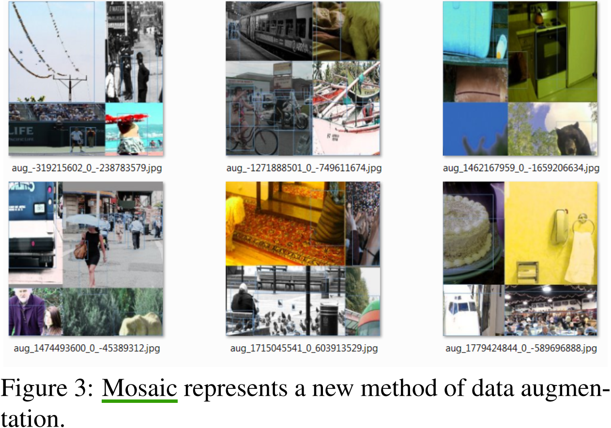

`CmBN` 仅收集单个批次中的 `mini-batch` 之间的统计信息。


我们将 `SAM` 从 `spatial-wise attentation` 改为 `point-wise attention`，并将 `PAN` 的 `shortcut` 连接改为 `concatenation`（拼接），分别如图 5 和图 6 所示。

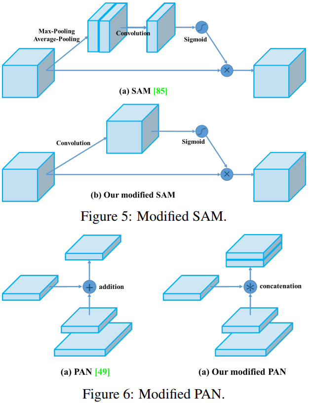

#### 3.4 YOLOv4

**`YOLOv4` 网络由以下部分组成**：

- `Backbone`: `CSPDarknet53`
- `Neck`: `SPP`, `PAN`
- `Head`: `YOLOv3`

**同时，`YOLO v4` 使用了**：

- 用于 `backbone` 的 `BoF`：`CutMix` 和 `Mosaic`数据增强，`DropBlock`正则化，类标签平滑。
- 用于 `backbone` 的 `BoS`：`Mish`激活，跨阶段部分连接（`CSP`），多输入加权残余连接（`MiWRC`）。
- 用于检测器的 `BoF`：`CIoU` 损失，`CmBN`，`DropBlock` 正则化，`mosaic` 数据增强，自我对抗训练，消除网格敏感性，在单个 `ground-truth` 上使用多个 `anchor`，余弦退火调度器，最佳超参数，随机训练形状。
- 用于检测器 `BoS`：`Mish` 激活，`SPP` 模块，`SAM` 模块，`PAN` 路径聚集块，`DIoU-NMS`。

### 4，实验

#### 4.1，实验设置

略

#### 4.2，对于分类器训练过程中不同特性的影响

图 `7` 可视化了不同数据增强方法的效果。

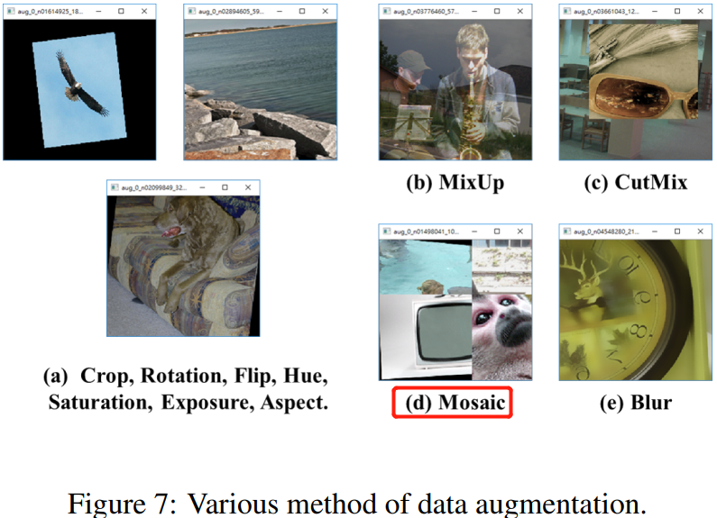

表 `2` 的实验结果告诉我们，`CutMix` 和 `Mosaic` 数据增强，类别标签平滑及 `Mish` 激活可以提高分类器的精度，尤其是 `Mish` 激活提升效果很明显。

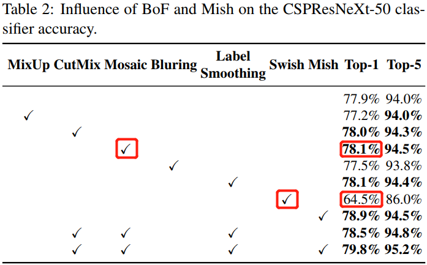

#### 4.3，对于检测器训练过程中不同特性的影响

- $S$: `Eliminate grid sensitivit`。原来的 $b_x = \sigma(t_x) + c_x$，因为 `sigmoid` 函数值域范围是 $(0,1)$ 而不是 $[0,1]$，所以 $b_x$ 不能取到 `grid` 的边界位置。为了解决这个问题，作者提出将 $\sigma(t_x)$ 乘以一个超过 $1$ 的系数，如 $b_x = 1.1\sigma(t_x) + c_x$，$b_y$ 的公式类似。
- $IT$：之前的 `YOLOv3` 是 $1$ 个 `anchor` 负责一个 `GT`，现在 `YOLOv4` 改用多个 `anchor` 负责一个 `GT`。对于 `GT` 来说，只要 $IoU(anchor_i, GT_j) > IoU -threshold$ ，就让 $anchor_i$ 去负责 $GT_j$。
- $CIoU$：使用了 `GIoU，CIoU，DIoU，MSE` 这些误差算法来实现边框回归，验证出 `CIoU` 损失效果最好。
- 略

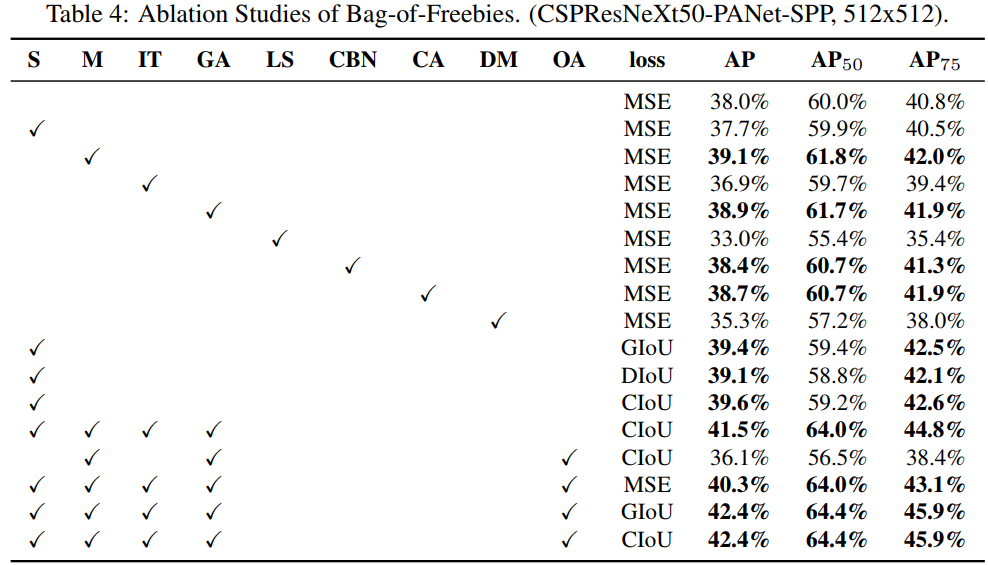

同时实验证明，当使用 `SPP`，`PAN` 和 `SAM` 时，检测器将获得最佳性能。

#### 4.4，不同骨干和预训练权重对检测器训练的影响

综合各种改进后的骨干网络对比实验，发现 `CSPDarknet53` 比 `CSPResNext` 模型显示出提高检测器精度的更大能力。


#### 4.5，不同小批量的大小对检测器训练的影响

实验证明，在使用了 `BoF` 和 `BoS` 训练策略后，小批量大小（`mini-batch sizes`）对检测器的性能几乎没有影响。实验结果对比表格就不放了，可以看原论文。

### 5，结果

与其他 `state-of-the-art` 目标检测算法相比，`YOLOv4` 在速度和准确性上都表现出了最优。详细的比较实验结果参考论文的图 `8`、表 `8`和表 `9`。

### 6，YOLOv4 主要改进点

> 例举出一些我认为比较关键且值得重点学习的改进点。

#### 6.1，Backbone 改进

> 后续所有网络的结构图来都源于江大白公众号，之后不再一一注明结构图来源。

`Yolov4` 的整体结构可以拆分成四大板块，结构图如下图所示。

.png)

`YOLOv4` 的五个基本组件如下：

1. **CBM**：`Yolov4` 网络结构中的最小组件，由 `Conv+Bn+Mish` 激活函数三者组成。
2. **CBL**：由 `Conv+Bn+Leaky_relu` 激活函数三者组成。
3. **Res unit**：借鉴 `Resnet` 网络中的残差结构思想，让网络可以构建的更深，和 `ResNet` 的 `basic block` 由两个 `CBL（ReLU）`组成不同，这里的 `Resunit` 由 `2` 个 `CBM` 组成。
4. **CSPX**：借鉴 `CSPNet` 网络结构，由三个卷积层和 `X` 个 `Res unint` 模块 `Concate` 组成。
5. **SPP**：采用 `1×1，5×5，9×9，13×13` 的最大池化的方式，进行多尺度融合。

其他基础操作：

1. **Concat**：张量拼接，会扩充维度。
2. **add**：逐元素相加操作，不改变维度（`element-wise add`）。

因为每个 `CSPX` 模块有 $5+2\ast X$ 个卷积层，因此整个 `backbone` 中共有 $1 + (5+2\times 1) + (5+2\times 2) + (5+2\times 8) + (5+2\times 8) + (5+2\times 4) = 72$ 个卷积层
> 这里卷积层的数目 `72` 虽然不等同于 `YOLOv3` 中 `53`，但是 `backbone` 依然是由 [1、2、8、8、4] 个卷积模块组成的，只是这里的 `YOLOv4` 中的卷积模块替换为了 `CSPX` 卷积模块，猜想是这个原因所以 `YOLOv4` 的作者这里依然用来 `Darknet53` 命名后缀。

##### 6.1.1，CSPDarknet53

`YOLOv4` 使用 `CSPDarknet53` 作为 `backbone`，它是在 `YOLOv3` 的骨干网络 `Darknet53` 基础上，同时借鉴 `2019` 年的 `CSPNet` 网络，所产生的新 `backbone`。

`CSPDarknet53` 包含 `5` 个 `CSP` 模块，`CSP` 中残差单元的数量依次是 $[1, 2,8,8,4]$，这点和 `Darknet53` 类似。每个 `CSP` 模块最前面的卷积核的大小都是 $3\times 3$，`stride=2`，因此可以起到下采样的作用（特征图大小缩小一倍）。因为 `backbone` 总共有 `5` 个 `CSP`模块，而输入图像是 $608\times 608$，所以特征图大小变化是：`608->304->152->76->38->19`，即经过 `bckbone` 网络后得到 $19\times 19$ 大小的特征图。`CSPDarknet53` 网络结构图如下图所示。

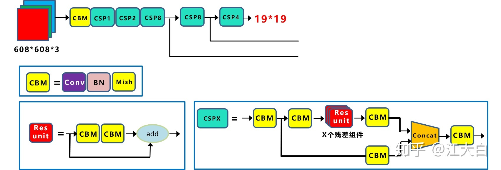

> `CSPNet` 作者认为，`MobiletNet`、`ShuffleNet` 系列模型是专门为移动端（`CPU`）平台上设计的，它们所采用的深度可分离卷积技术（`DW+PW Convolution`）并不兼容用于边缘计算的 `ASIC` 芯片。

之所以使用 `CSPNet` 是因为其能很好的和 `ResNet`、`DarkNet` 等网络嵌入在一起，增加精度的同时减少计算量和降低内存成本。

##### 6.1.2，Mish 激活

在 `YOLOv4` 中使用 `Mish` 函数的原因是它的**低成本和它的平滑、非单调、无上界、有下界**等特点，在表 `2` 的对比实验结果中，和其他常用激活函数如 `ReLU`、`Swish` 相比，分类器的精度更好。

`Mish` 激活函数是光滑的非单调激活函数，定义如下：

$$
Mish(x) = x\cdot tanh(In(1 + e^x)) \\\\
Swish(x) = x\cdot sigmoid(x) \\\\
$$

`Mish` 函数曲线图和 `Swish` 类似，如下图所示。

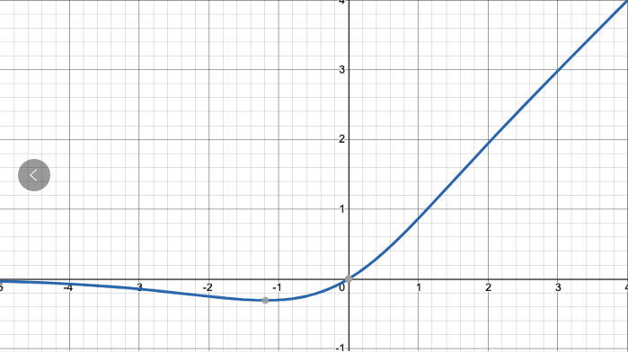

值得注意的是 `Yolov4` 的 `Backbone` 中的激活函数都使用了`Mish` 激活，但后面的 `neck + head` 网络则还是使用`leaky_relu` 函数。

$$
Leaky \ ReLU(x) =
\begin{cases}
x, & x > 0 \\\\
\lambda x, & x \leq 0
\end{cases}
$$

#### 6.1.3，Dropblock

`Yolov4` 中使用的 `Dropblock` ，其实和常见网络中的 `Dropout` 功能类似，也是缓解过拟合的一种正则化方式。
> 传统 `dropout` 功能是随机删除减少神经元的数量，使网络变得更简单（缓解过拟合）。

#### 6.2，Neck 网络改进

在目标检测领域中，为了更好的融合 `low-level` 和 `high-level` 特征，通常会在 `backbone` 和 `head` 网络之间插入一些网络层，这个中间部分称为 `neck` 网络，典型的有 `FPN` 结构。

`YOLOv4` 的 `neck` 结构采用了 `SPP` 模块 和 `FPN+PAN` 结构。

先看看 `YOLOv3` 的 `neck` 网络的立体图是什么样的，如下图所示。

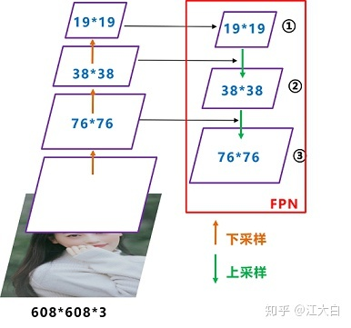

`FPN` 是自顶向下的，将高层的特征信息经过上采样后和低层的特征信息进行传递融合，从而得到进行预测的特征图 ①②③。

再看下图 `YOLOv4` 的 `Neck` 网络的立体图像，可以更清楚的理解 `neck` 是如何通过 `FPN+PAN` 结构进行融合的。

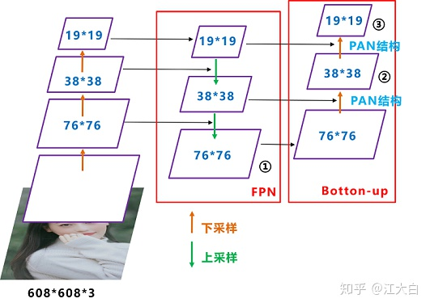

`FPN` 层自顶向下传达强语义特征，而特征金字塔则自底向上传达强定位特征，两两联手，从不同的主干层对不同的检测层进行参数聚合，这种正向反向同时结合的操作确实 `6` 啊。

值得注意的是，`Yolov3` 的 `FPN` 层输出的三个大小不一的特征图①②③直接进行预测。但`Yolov4` 输出特征图的预测是使用 `FPN` 层从最后的一个 `76*76` 特征图 ① 和而经过两次`PAN` 结构的特征图 ② 和 ③ 。

另外一点是，原本的 `PANet` 网络的 `PAN` 结构中，两个特征图结合是采用 `shortcut + element-wise` 操作，而 `Yolov4` 中则采用 `concat（route）`操作，特征图融合后的尺寸会变化。原本 `PAN` 和修改后的 `PAN` 结构对比图如下图所示。

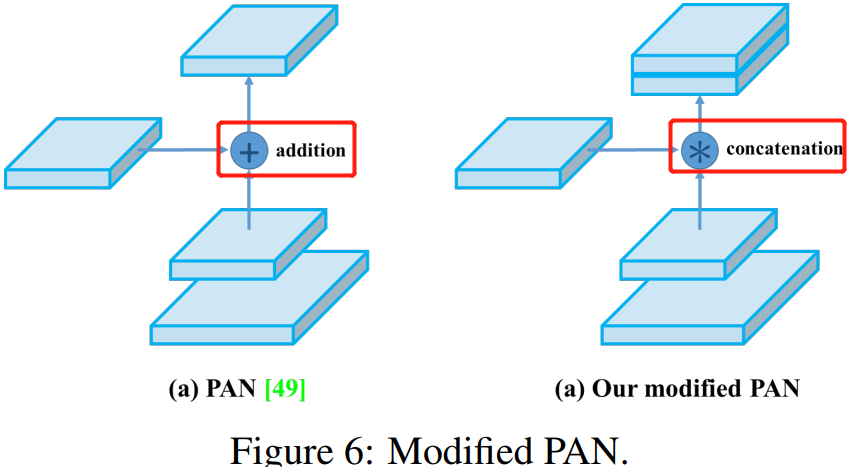

#### 6.3，预测的改进

##### 6.3.1，使用CIoU Loss

`Bounding Box Regeression` 的 `Loss` 近些年的发展过程是：Smooth L1 Loss-> IoU Loss（2016）-> GIoU Loss（2019）-> DIoU Loss（2020）->CIoU Loss（2020）

##### 6.3.2，使用DIoU_NMS

#### 6.4，输入端改进

##### 6.4.1，Mosaic 数据增强

`YOLOv4` 原创的 `Mosaic` 数据增强方法是基于 `2019` 年提出的 `CutMix` 数据增强方法做的优化。`CutMix` 只对两张图片进行拼接，而 `Mosaic` 更激进，采用 `4` 张图片，在各自随机缩放、裁剪和排布后进行拼接。

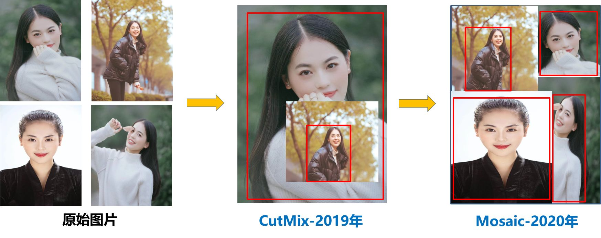

在目标检测器训练过程中，小目标的 `AP` 一般比中目标和大目标低很多。而 `COCO` 数据集中也包含大量的小目标，但比较麻烦的是小目标的分布并不均匀。在整体的数据集中，它们的占比并不平衡。

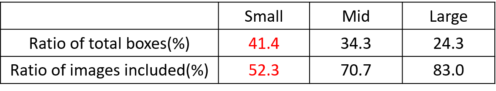

如上表所示，在 `COCO` 数据集中，小目标占比达到 `41.4%`，数量比中目标和大目标要大得多，但是在所有的训练集图片中，只有 `52.3%` 的图片有小目标，而中目标和大目标的分布相对来说更加均匀一些。
> 少部分图片却包含了大量的小目标。

针对这种状况，`Yolov4` 的作者采用了 `Mosaic` 数据增强的方式。器主要有几个优点：

- 丰富数据集：随机使用 `4` 张图片，随机缩放，再随机分布进行拼接，大大丰富了检测数据集，特别是随机缩放增加了很多小目标，让网络的鲁棒性更好。
- 减少训练所需 `GPU` 数量： `Mosaic` 增强训练时，可以直接计算 `4` 张图片的数据，使得 `Mini-batch` 大小并不需要很大，一个 `GPU` 就可以训练出较好的模型。

## 五，YOLOv5

`YOLOv5` 仅在 `YOLOv4` 发表一个月之后就公布了，这导致很多人对 `YOLOv5` 的命名有所质疑，因为相比于它的前代 `YOLOv4`，它在理论上并没有明显的差异，虽然集成了最近的很多新的创新，但是这些集成点又和 `YOLOv4` 类似。我个人觉得之所以出现这种命名冲突应该是发布的时候出现了 “撞车”，毕竟 `YOLOv4` 珠玉在前（早一个月），`YOLOv5` 也只能命名为 `5` 了。但是，我依然认为 `YOLOv5` 和 `YOLOv4` 是不同的，至少在工程上是不同的，它的代码是用 `Python`(`Pytorch`) 写的，与 `YOLOv4` 的 [C代码](https://github.com/AlexeyAB/darknet) （基于 `darknet` 框架）有所不同，所以代码更简单、易懂，也更容易传播。

另外，值得一提的是，`YOLOv4` 中提出的关键的 `Mosaic` 数据增强方法，作者之一就是 `YOLOv5` 的作者 `Glenn Jocher`。同时，`YOLOv5` 没有发表任何论文，只是在 `github` 上开源了[代码](https://github.com/ultralytics/yolov5)。

### 5.1，网络架构

通过解析代码仓库中的 `.yaml` 文件中的结构代码，`YOLOv5` 模型可以概括为以下几个部分：

- `Backbone`: `Focus structure`, `CSP network`
- `Neck`: `SPP block`, `PANet`
- `Head`: `YOLOv3 head using GIoU-loss`

### 5.2，创新点

#### 5.2.1，自适应anchor

在训练模型时，`YOLOv5` 会自己学习数据集中的最佳 `anchor boxes`，而不再需要先离线运行 `K-means` 算法聚类得到 `k` 个 `anchor box` 并修改 `head` 网络参数。总的来说，`YOLOv5` 流程简单且自动化了。

### 5.3，实验结果

各个版本的 `YOLOv5` 在 `COCO` 数据集上和 `V100 GPU` 平台上的模型精度和速度实验结果曲线如下所示。

## 参考资料

+ [你一定从未看过如此通俗易懂的YOLO系列(从v1到v5)模型解读 (上)](https://zhuanlan.zhihu.com/p/183261974?utm_source=wechat_session&utm_medium=social&utm_oi=737449911926140928)
+ [你一定从未看过如此通俗易懂的YOLO系列(从v1到v5)模型解读 (中)](https://zhuanlan.zhihu.com/p/183781646?utm_source=wechat_session&utm_medium=social&utm_oi=737449911926140928)
+ [目标检测|YOLO原理与实现](https://zhuanlan.zhihu.com/p/32525231)
+ [YOLO论文翻译——中英文对照](http://noahsnail.com/2017/08/02/2017-08-02-YOLO%E8%AE%BA%E6%96%87%E7%BF%BB%E8%AF%91%E2%80%94%E2%80%94%E4%B8%AD%E8%8B%B1%E6%96%87%E5%AF%B9%E7%85%A7/)
+ [Training Object Detection (YOLOv2) from scratch using Cyclic Learning Rates](https://towardsdatascience.com/training-object-detection-yolov2-from-scratch-using-cyclic-learning-rates-b3364f7e4755)
+ [目标检测|YOLOv2原理与实现(附YOLOv3)](https://zhuanlan.zhihu.com/p/35325884)
+ [YOLO v1/v2/v3 论文](http://xxx.itp.ac.cn/pdf/1804.02767.pdf)
+ https://github.com/BobLiu20/YOLOv3_PyTorch/blob/master/nets/yolo_loss.py
+ https://github.com/Peterisfar/YOLOV3/blob/03a834f88d57f6cf4c5016a1365d631e8bbbacea/utils/datasets.py#L88
+ [深入浅出Yolo系列之Yolov3&Yolov4&Yolov5&Yolox核心基础知识完整讲解](https://zhuanlan.zhihu.com/p/143747206)
+ `EVOLUTION OF YOLO ALGORITHM AND YOLOV5: THE STATE-OF-THE-ART OBJECT DETECTION ALGORITHM`