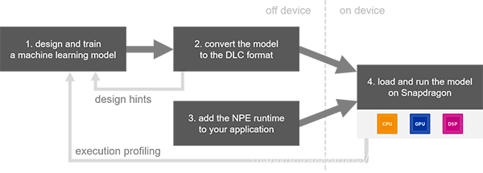

## 目录
[toc]

> 微信公众号文章没办法跳转外部链接，建议点击阅读原文跳转到外部链接阅读收藏。
## ARM 优化

1. [ARM Neon Intrinsics 学习指北：从入门、进阶到学个通透](https://mp.weixin.qq.com/s/E73KW7vxYikpcLYPBf4-HA)
2. [一份朴实无华的移动端盒子滤波算法优化笔记](https://zhuanlan.zhihu.com/p/170611395 "一份朴实无华的移动端盒子滤波算法优化笔记")
3. [Neon Intrinsics Reference](https://developer.arm.com/architectures/instruction-sets/simd-isas/neon/intrinsics "Neon Intrinsics Reference")

> `Neon` 是 `ARM` 平台的向量化计算指令集，通过一条指令完成多个数据的运算达到加速的目的，或者说 `Neon` 是 ARM 平台的 `SIMD`（Single Instruction Multiple Data，单指令多数据流）指令集实现。常用于AI、多媒体等计算密集型任务。

## CPU 硬件基础

1. [嵌入式系统 内存模块设计](https://jachinshen.github.io/study/2018/03/06/%E5%B5%8C%E5%85%A5%E5%BC%8F%E7%B3%BB%E7%BB%9F-%E5%86%85%E5%AD%98%E6%A8%A1%E5%9D%97%E8%AE%BE%E8%AE%A1.html "嵌入式系统 内存模块设计")

## 指令集学习

1. [Intel® Intrinsics Guide](https://www.intel.com/content/www/us/en/docs/intrinsics-guide/index.html#ig_expand=611 "Intel® Intrinsics Guide")
## 数字图像处理

1. [SIFT 特征详解](http://shartoo.github.io/SIFT-feature/ "SIFT 特征详解")
2. [使用ffmpeg库进行YUV420到RGB的转化](https://zhuanlan.zhihu.com/p/53305541 "使用ffmpeg库进行YUV420到RGB的转化")
3. [图像的深度和通道概念区分](https://blog.csdn.net/u012130706/article/details/51461979 "图像的深度和通道概念区分")

## 深度学习基础知识

1. [CNN中参数解释及计算](https://flat2010.github.io/2018/06/15/%E6%89%8B%E7%AE%97CNN%E4%B8%AD%E7%9A%84%E5%8F%82%E6%95%B0/ "CNN中参数解释及计算")
2. [深度学习推理时融合BN，轻松获得约5%的提速](https://mp.weixin.qq.com/s/P94ACKuoA0YapBKlrgZl3A)
3. [动图形象理解深度学习卷积](https://mp.weixin.qq.com/s/aJ7AioWLoox7WBFPYa_nCQ)

## 矩阵乘优化

1. [OpenBLAS gemm从零入门](https://zhuanlan.zhihu.com/p/65436463 "OpenBLAS gemm从零入门")
2. [通用矩阵乘（GEMM）优化算法](https://jackwish.net/2019/gemm-optimization.html "通用矩阵乘（GEMM）优化算法")
3. [卷积神经网络中的Winograd快速卷积算法](https://www.cnblogs.com/shine-lee/p/10906535.html "卷积神经网络中的Winograd快速卷积算法")
4. [知乎专栏-深入浅出GPU优化](https://www.zhihu.com/column/c_1437330196193640448 "知乎专栏-深入浅出GPU优化")
5. [CUDA GEMM 理论性能分析与 kernel 优化](https://zhuanlan.zhihu.com/p/441146275 "CUDA GEMM 理论性能分析与 kernel 优化")
6. [OpenPPL 中的卷积优化技巧](https://zhuanlan.zhihu.com/p/450310581 "OpenPPL 中的卷积优化技巧")：概述总结类文章，无代码，非专注时刻也能阅读。
7. [【张先轶】BLISlab学习优化矩阵乘。第一课](https://www.bilibili.com/video/BV1c94y117Uw/?vd_source=4ab49101e323bf3a37e7b81812524444 "【张先轶】BLISlab学习优化矩阵乘。第一课")
8. [矩阵乘法与 SIMD](https://jcf94.com/2021/08/28/2021-08-28-simd/ "矩阵乘法与 SIMD")
> `Winograd` 是一种快速卷积算法，适用于小卷积核，可以减少浮点乘法的次数。

## 经典卷积网络

> 1，VGGNet 拥有 5 段 卷积，每一段有 2~3 个卷积层，同时每段尾部会连接一个最大池化层用来缩小图片尺寸，每段内的卷积核数量相同，越靠后的段的卷积核数量越多：64-128-256-512-512。ResNet 网络拥有 4 段卷积， 每段卷积代表一个 残差学习 `Blocks`，根据网络层数的不同， Blocks 的单元数量不同，例如 ResNet18 的 Blocks 单元数量分别为2、2、2 和 2。越靠后的段的卷积核数量越多：64-128-256-512，残差学习 `Blocks` 内的卷积核通道数是相同的。
2，ResNet v2 创新点在于通过理论分析和实验证明恒等映射对于残差块的重要性，根据激活函数与相加操作的位置关系，我们称之前的组合方式（ResNet）为“后激活（post-activation）”，现在新的组合方式（ResNet v2）称之为“预激活（pre-activation）”。使用预激活有两个方面的优点：1)`f` 变为恒等映射，使得网络更易于优化；2)使用 `BN` 作为预激活可以加强对模型的正则化。

1. [深度可分离卷积（Xception 与 MobileNet 的点滴）](https://www.jianshu.com/p/38dc74d12fcf?utm_source=oschina-app "深度可分离卷积（Xception 与 MobileNet 的点滴）")
2. [[DL-架构-ResNet系] 002 ResNet-v2](https://zhuanlan.zhihu.com/p/29678910 "[DL-架构-ResNet系] 002 ResNet-v2")
3. [ResNet及其变种的结构梳理、有效性分析与代码解读](https://zhuanlan.zhihu.com/p/54289848 "ResNet及其变种的结构梳理、有效性分析与代码解读")

## 神经网络量化与压缩

> 1，量化是指用于执行计算并以低于浮点精度的位宽存储张量的技术，或者说量化就是将神经网络的浮点算法转换为定点。 量化模型对张量使用整数而不是浮点值执行部分或全部运算。
2，量化简单来说就是将浮点存储（运算）转换为整型存储（运算）的一种模型压缩技术。
3，虽然精心设计的 `MobileNet` 能在保持较小的体积时仍然具有与 `GoogleNet` 相当的准确度，不同大小的 `MobileNet` 本身就表明——也许一个好的模型设计可以改进准确度，但同类模型中仍然是更大的网络，更好的效果!
4，权重值域调整是另一个机器学习过程，学习的目标是一对能在量化后更准确地运行网络的超参数 `min/max`。

1. [神经网络量化简介](https://jackwish.net/2019/neural-network-quantization-introduction-chn.html "神经网络量化简介")
2. [线性量化](https://www.yuque.com/yahei/hey-yahei/quantization.mxnet2 "线性量化")
3. [Int8量化-介绍（一）](https://zhuanlan.zhihu.com/p/58182172 "Int8量化-介绍（一）")
4. [Int8量化-ncnn社区Int8重构之路（三）](https://zhuanlan.zhihu.com/p/61451372 "Int8量化-ncnn社区Int8重构之路（三）")
5. [ncnn源码学习（六）：模型量化原理笔记](https://blog.csdn.net/sinat_31425585/article/details/101607785 "ncnn源码学习（六）：模型量化原理笔记")
6. [神经网络推理加速之模型量化](https://zh.mxnet.io/blog/model-quantization "神经网络推理加速之模型量化")
7. [NNIE 量化感知训练](https://zhuanlan.zhihu.com/p/183176369 "NNIE 量化感知训练")

## 模型剪枝

[论文总结 - 模型剪枝 Model Pruning](https://xmfbit.github.io/2018/10/03/paper-summary-model-pruning/ "论文总结 - 模型剪枝 Model Pruning")

## 轻量网络设计方法

1. [轻量卷积神经网络的设计](https://zhuanlan.zhihu.com/p/64400678 "轻量卷积神经网络的设计")
> 网络结构碎片化更多是指网络中的多路径连接，类似于 `short-cut`，`bottle neck` 等不同层特征融合，还有如 `FPN` 等结构。拖慢并行的一个很主要因素是，**运算快的模块总是要等待运算慢的模块执行完毕**。

2. [ShuffleNet V2: Practical Guidelines for Efficient CNN Architecture Design](https://www.cnblogs.com/seniusen/p/12047954.html "ShuffleNet V2: Practical Guidelines for Efficient CNN Architecture Design")
3. [ShufflenetV2_高效网络的4条实用准则](https://zhuanlan.zhihu.com/p/42288448 "ShufflenetV2_高效网络的4条实用准则")
4. [轻量级神经网络：ShuffleNetV2解读](https://www.jiqizhixin.com/articles/2019-06-03-14 "轻量级神经网络：ShuffleNetV2解读")

## 目标检测网络

1. [一文读懂Faster RCNN](https://zhuanlan.zhihu.com/p/31426458 "一文读懂Faster RCNN")
2. [从编程实现角度学习Faster R-CNN（附极简实现）](https://zhuanlan.zhihu.com/p/32404424 "从编程实现角度学习Faster R-CNN（附极简实现）")
3. [Mask RCNN学习笔记](https://www.cnblogs.com/wangyong/p/10614898.html "Mask RCNN学习笔记")
4. [Mask RCNN 源代码解析 (1) - 整体思路](https://blog.csdn.net/hnshahao/article/details/81231211 "Mask RCNN 源代码解析 (1) - 整体思路")
5. [物体检测之Focal Loss及RetinaNet](https://zhuanlan.zhihu.com/p/48958966 "物体检测之Focal Loss及RetinaNet")
6. [CVPR18 Detection文章选介（下）](https://zhuanlan.zhihu.com/p/36431183 "CVPR18 Detection文章选介（下）")
7. [2020首届海洋目标智能感知国际挑战赛 冠军方案分享](https://mp.weixin.qq.com/s/uUIJBxM0PATHSRxDbWbyTg)
8. [目标检测中的样本不平衡处理方法——OHEM, Focal Loss, GHM, PISA](https://ranmaosong.github.io/2019/07/20/cv-imbalance-between-easy-and-hard-examples/ "目标检测中的样本不平衡处理方法——OHEM, Focal Loss, GHM, PISA")

## 评价指标

1. [ROC和AUC介绍以及如何计算AUC](http://alexkong.net/2013/06/introduction-to-auc-and-roc/ "ROC和AUC介绍以及如何计算AUC")
2. [COCO目标检测测评指标](https://www.jianshu.com/p/d7a06a720a2b "COCO目标检测测评指标")

## 语义分割

1. [2019年最新基于深度学习的语义分割技术讲解](https://mp.weixin.qq.com/s/ektiUl_H_JlUJdaba-NGsw)
2. [U-Net 论文笔记](https://zhuanlan.zhihu.com/p/37496466 "U-Net 论文笔记")

## 计算机视觉基础知识

## Pytorch 框架

1. [pytorch自定义层如何实现？超简单！](https://zhuanlan.zhihu.com/p/144904949 "pytorch自定义层如何实现？超简单！")
2. [【PyTorch】torch.nn.Module 源码分析](https://zhuanlan.zhihu.com/p/88712978 "【PyTorch】torch.nn.Module 源码分析")
3. [详解Pytorch中的网络构造，模型save和load，.pth权重文件解析](https://www.cnblogs.com/hansjorn/p/11467081.html "详解Pytorch中的网络构造，模型save和load，.pth权重文件解析")
4. [半小时学会 PyTorch Hook](https://zhuanlan.zhihu.com/p/75054200 "半小时学会 PyTorch Hook")
5. [详解Pytorch中的网络构造](https://zhuanlan.zhihu.com/p/53927068 "详解Pytorch中的网络构造")
6. [深度学习与Pytorch入门实战（九）卷积神经网络&Batch Norm](https://www.cnblogs.com/douzujun/p/13352640.html "深度学习与Pytorch入门实战（九）卷积神经网络&Batch Norm")
7. [Pytorch 里 nn.AdaptiveAvgPool2d(output_size) 原理是什么?](https://www.zhihu.com/question/282046628 "Pytorch 里 nn.AdaptiveAvgPool2d(output_size) 原理是什么?")

## Caffe 框架

1. [Message type "caffe.PoolingParameter" has no field named "ceil_mode"](https://blog.csdn.net/u012273127/article/details/78701161 "Message type "caffe.PoolingParameter" has no field named "ceil_mode"")
2. [Caffe Pooling层对ceil mode选择的支持](https://www.jianshu.com/p/cbc344810a2e "Caffe Pooling层对ceil mode选择的支持")
3. [caffe源码解析-开篇](https://zhuanlan.zhihu.com/p/25127756 "caffe源码解析-开篇")

## 编程语言

1. [http://www.cplusplus.com/reference/stl/](http://www.cplusplus.com/reference/stl/ "http://www.cplusplus.com/reference/stl/")

## 模型部署

1. [海思AI芯片(Hi3519A/3559A)方案学习（二十五）初识 mapper_quant 和mapper_param](https://blog.csdn.net/avideointerfaces/article/details/103070021 "海思AI芯片(Hi3519A/3559A)方案学习（二十五）初识 mapper_quant 和mapper_param")
2. [部署PyTorch模型到终端](https://zhuanlan.zhihu.com/p/54665674 "部署PyTorch模型到终端")
3. [多场景适配，TNN如何优化模型部署的存储与计算](https://www.infoq.cn/article/4rfxdkkvvyb6auxhjxi4 "多场景适配，TNN如何优化模型部署的存储与计算")
4. [模型转换、模型压缩、模型加速工具汇总](https://blog.csdn.net/WZZ18191171661/article/details/99700992 "模型转换、模型压缩、模型加速工具汇总")
5. [深度学习模型转换与部署那些事(含ONNX格式详细分析)](https://bindog.github.io/blog/2020/03/13/deep-learning-model-convert-and-depoly/ "深度学习模型转换与部署那些事(含ONNX格式详细分析)")
6. [ONNX初探](https://mp.weixin.qq.com/s/H1tDcmrg0vTcSw9PgpgIIQ)

## GPU 芯片

1. [一文读懂 GPU 的发展历程](https://juejin.cn/post/7125824952342675464 "一文读懂 GPU 的发展历程")
2. [CPU、GPU、NPU等芯片架构、特点研究](https://www.cnblogs.com/liuyufei/p/13259264.html "CPU、GPU、NPU等芯片架构、特点研究")
3. [什么是异构并行计算？CPU与GPU的区别是什么？](http://imgtec.eetrend.com/blog/2019/100046756.html "什么是异构并行计算？CPU与GPU的区别是什么？")

## AI 芯片

1. [看懂芯片原来这么简单（二）：AI为什么聪明？什么是华为自研架构NPU？](https://mp.weixin.qq.com/s/OfWsbV6OIZ39t3944nUhWg)
2. [【专利解密】如何提高AI资源利用率？ 华为卷积运算芯片](https://aijishu.com/a/1060000000144539 "【专利解密】如何提高AI资源利用率？ 华为卷积运算芯片")

## 内存优化

1. [优化 TensorFlow Lite 推理运行环境内存占用](https://mp.weixin.qq.com/s/qWLgTKRRhwjLucRegHLcBA)

## 关于科研和研发

1. [中国人民大学赵鑫：AI 科研入坑指南](https://mp.weixin.qq.com/s/UH7UIq7ajwpdR6fZ9CfG6Q)

## 3D 视觉技术

1. [3D成像方法 汇总（原理解析）--- 双目视觉、激光三角、结构光、ToF、光场、全息](https://www.eet-china.com/mp/a22843.html "3D成像方法 汇总（原理解析）--- 双目视觉、激光三角、结构光、ToF、光场、全息")
2. [关于双目立体视觉的三大基本算法及发展现状的总结](https://bbs.cvmart.net/topics/3058 "关于双目立体视觉的三大基本算法及发展现状的总结")
3. [3D视觉CV界的终极体现形式，计算机如何「看」这个三维世界](https://mp.weixin.qq.com/s?__biz=MzA3MzI4MjgzMw==&mid=2650803376&idx=3&sn=7d7cca1f447aaee307c1b8aa2e2f6e9f&chksm=84e5c8ceb39241d8b5a7f4e76f1fbc9a7d5284fcce4a6963f82fef6590baff39ab5c6bced5db&scene=132#wechat_redirect)
## 知识点输出

1，为了尽可能地提高 `MAC阵列` 的利用率以及卷积运算效率，阵列控制模块会根据第一卷积参数矩阵的行数和第一卷积数据阵列的行数来确定第一乘法累加窗口的列数。

2，`SNPE` 开发流程：

3，目标检测模型效果提升方法：

+ 以 `Cascade RCNN` 作为 `baseline`，以 `Res2Net101` 作为 `Backbone`；
+ `Albumentation` 库做数据集增强-用在模型训练中；
+ 多尺度训练(`MST` Multi-scale training/testing)的升级版-`SNIP`方法(Scale Normalization for Image Pyramids)，用在 `baseline` 模型训练和测试中：解决模板大小尺度不一的问题；
+ `DCN` 可变性卷积网络-用在 `baseline` 模型的 `backone` 中；
+ `soft-NMS`：解决目标互相重叠的问题；
+ `HTC` 模型预训练， `Adam` 优化算法可以较好的适应陌生数据集，学习率热身(`warm-up`)来稳定训练过程。

4，`SNIP` 论文解读：

`SNIP` 非常 `solid` 地证明了就算是数据相对充足的情况下，`CNN` 仍然很难使用所有 `scale` 的物体。个人猜测是由于 CNN 中没有对于 scale invariant 的结构，CNN 能检测不同 scale 的“假象”，更多是通过CNN 来通过 `capacity` 来强行 `memorize` 不同 `scale` 的物体来达到的，这其实浪费了大量的 `capacity`，而 `SNIP` 这样只学习同样的 scale 可以保障有限的 capacity 用于学习语义信息。论文的关键贡献：发现现在的 CNN 网络无法很好的解决 scale invariance 的问题，提出了一个治标不治本的方法。

5，高效模型设计（模型压缩）方法：

一般而言，高效模型的设计有 6 大基本思路：1）轻量级架构、2）模型裁剪、3）模型搜索、4）低精度量化、5）知识蒸馏、6）高效实现。

6，网络深度与宽度的理解及意义

> 更多理解参考知乎[网络宽度对深度学习模型性能有什么影响？](https://www.zhihu.com/question/322219788 "网络宽度对深度学习模型性能有什么影响？")

在一定的程度上，网络越深越宽，性能越好。宽度，即通道(`channel`)的数量，网络深度，及 `layer` 的层数，如 `resnet18` 有 `18` 层网络。注意我们这里说的和宽度学习一类的模型没有关系，而是特指深度卷积神经网络的(通道)宽度。

+ `网络深度的意义`：CNN 的网络层能够对输入图像数据进行逐层抽象，比如第一层学习到了图像边缘特征，第二层学习到了简单形状特征，第三层学习到了目标形状的特征，网络深度增加也提高了模型的抽象能力。
+ `网络宽度的意义`：网络的宽度（通道数）代表了滤波器（`3` 维）的数量，滤波器越多，对目标特征的提取能力越强，即让每一层网络学习到更加丰富的特征，比如不同方向、不同频率的纹理特征等。

7，所有 `Inception` 模型都具有一个重要的性质——都是遵循 拆分-变换-合并（`split-transform-merge`） 的设计策略。

8，对于某种指令，延迟 `latency` 主要关注单条该指令的最小执行时间，吞吐量 `throughout` 主要关注单位时间内系统（一个CPU核）最多执行多少条该指令。因为 AI 计算的数据量比较大，所以更关注吞吐量。

9，CPU 高性能通用优化方法包括：
+ 编译选项优化
+ 内存性能和耗电优化：内存复用原则，小块快跑是内存设计的重要原则。
+ 循环展开：循环的每次迭代都有一定的性能损失（分支指令）。但是现代 ARM 处理器具有分支预测的能力，它可以在执行条件之前预测是否将进入分支，从而降低性能损耗，这种情况下全部循环展开的的优势就减弱了。
+ 并行优化和流水线重排：并行优化分为多线程核与核之间数据处理，以及单核心内部并行处理。从本质上讲，流水线重排也是一种并行优化。

10，卷积性能优化方式：卷积的计算方式有很多种，通用矩阵运算（`GEMM`）方式有良好的通用性，但是仅使用 GEMM 无法实现性能最优。除 GEMM 外，常用的优化方法还包括滑窗（`Sliding Window`）、快速傅里叶变换（Fast Fourier Transform, `FFT`）、`Winograd` 等。不同的方法适合不同的输入输出场景，最佳的办法就是对算子加入逻辑判断，将不同大小的输入分别导向不同的计算方法，以最合适的方法进行卷积计算。
+ 大多数情况下，使用滑窗方法的计算性能还是无法和 `GEMM` 方法比较，但是一般当输入小于 $32\times 32$ 时，可以考虑采用滑窗的优化方式。
+ `Winograd` 是存在已久的性能优化算法，在大多数场景中，`Winograd` 算法都显示了较大的优势，其用更多的加法运算代替部分乘法运算，因为乘法运算耗时远高于加法运算。`Winograd` 适用于乘法计算消耗的时钟周期数大于加法运算消耗的时钟周期数的场景，且常用于 $3\times 3$ 卷积计算中。对于 `CPU`，一般来说，一次乘法计算消耗的时间是一次加法计算消耗时间的 `6` 倍。
+ `FFT` 方法不适合卷积核较小的 `CNN` 模型。

11，下图展示了如何在英伟达 GPU 架构发展史以及单块 GPU 上纵向扩展以满足深度学习的需求（截止2020年）。

