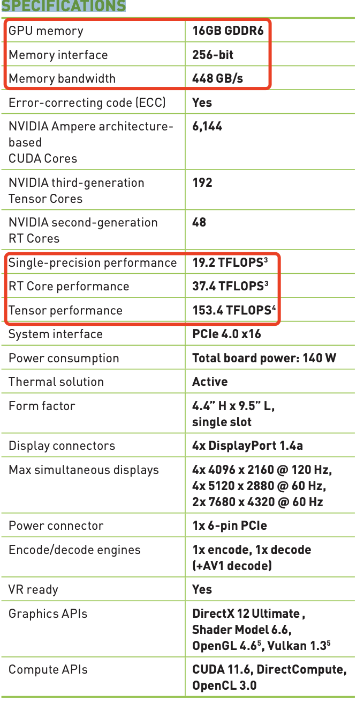
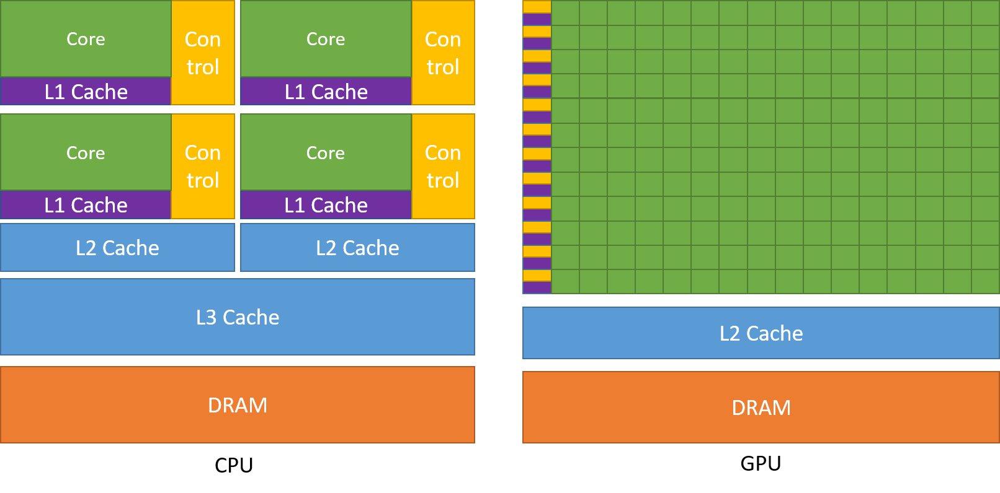
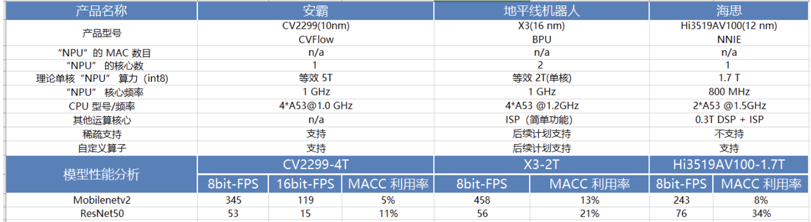

## 一些关键字定义及理解
> `FLOPs` 和 `MAC` 的计算方式，请参考我之前写的文章 [神经网络模型复杂度分析](https://github.com/HarleysZhang/cv_note/blob/79740428b6162630eb80ed3d39052cac52f60c32/9-model_deploy/B-%E7%A5%9E%E7%BB%8F%E7%BD%91%E7%BB%9C%E6%A8%A1%E5%9E%8B%E5%A4%8D%E6%9D%82%E5%BA%A6%E5%88%86%E6%9E%90.md)。
### 计算量 FLOPs

- `FLOPs`：`floating point operations` 指的是浮点运算次数，理解为**计算量**，可以用来衡量**算法/模型时间的复杂度**。
- `FLOPS`：（全部大写），`Floating-point Operations Per Second`，每秒所执行的浮点运算次数，理解为计算速度, 是一个衡量硬件性能/模型速度的指标，即一个芯片的算力。
- `MACCs`：`multiply-accumulate operations`，乘-加操作次数，`MACCs` 大约是 `FLOPs` 的一半。将 w[0]∗x[0]+... 视为一个乘法累加或 `1` 个 `MACC`。

### 内存访问代价 MAC

`MAC`: `Memory Access Cost` 内存访问代价。指的是输入单个样本（一张图像），模型/卷积层完成**一次前向传播所发生的内存交换总量**，即模型的空间复杂度，单位是 `Byte`。

### GPU 内存带宽

- `GPU` 的内存带宽决定了它将数据从内存 (`vRAM`) 移动到计算核心的速度，是比 `GPU` 内存速度更具代表性的指标。
- `GPU` 的内存带宽的值取决于**内存和计算核心之间的数据传输速度，以及这两个部分之间总线中单独并行链路的数量**。

`NVIDIA RTX` `A4000` 建立在 `NVIDIA Ampere` 架构之上，结合了 `48` 个第二代 `RT 核心`，`192` 个第三代 `Tensor 核心`，`6144` 个 `CUDA 核心`以及 `16 GB` 的显存。
对于 NVIDIA RTX `A4000` 芯片，其芯片规格如下表示所示:

`A4000` 芯片配备 `16 GB` 的 `GDDR6` 显存、`256` 位显存接口（`GPU` 和 `VRAM` 之间总线上的独立链路数量），因为这些与显存相关的特性，`A4000` 内存带宽可以达到 `448 GB/s`。

### Latency and Throughput
> 参考英伟达-Ashu RegeDirector of Developer Technology 的 `ppt` 文档 [An Introduction to Modern GPU Architecture](https://download.nvidia.com/developer/cuda/seminar/TDCI_Arch.pdf)。

深度学习领域**延迟** `Latency` 和**吞吐量** `Throughput`的一般解释：

+ 延迟 (`Latency`): 人和机器做决策或采取行动时都需要反应时间。延迟是指**提出请求与收到反应之间经过的时间**。大部分人性化软件系统（不只是 AI 系统），延迟都是以**毫秒**来计量的。
+ 吞吐量 (`Throughput`): 在给定创建或部署的深度学习网络规模的情况下，可以传递多少推断结果。简单理解就是在**一个时间单元（如：一秒）内网络能处理的最大输入样例数**。

`CPU` 是低延迟低吞吐量处理器；`GPU` 是高延迟高吞吐量处理器。
### 英伟达 GPU 架构

`GPU` 设计了更多的晶体管（`transistors`）用于数据处理（`data process`）而不是数据缓冲（`data caching`）和流控（`flow control`），因此 `GPU` 很适合做**高度并行计算**（`highly parallel computations`）。同时，`GPU` 提供比 `CPU` 更高的**指令吞吐量**和**内存带宽**（`instruction throughput and memory bandwidth`）。

`CPU` 和 `GPU` 的直观对比图如下所示

> 图片来源 [CUDA C++ Programming Guide](https://docs.nvidia.com/cuda/cuda-c-programming-guide/index.html)

最后简单总结下英伟达 `GPU` 架构的一些特点:
- `SIMT` (`Single Instruction Multiple Threads`) 模式，即多个 `Core` 同一时刻只能执行同样的指令。虽然看起来与现代 `CPU` 的 `SIMD`（单指令多数据）有些相似，但实际上有着根本差别。
- 更适合**计算密集**与**数据并行**的程序，原因是缺少 `Cache` 和 `Control`。

`2008-2020` 英伟达 `GPU` 架构进化史如下图所示:

英伟达 `GPU` 架构从 `2010` 年开始到 `2020` 年这十年间的架构演进历史概述，可以参考知乎的文章-[英伟达GPU架构演进近十年，从费米到安培](https://zhuanlan.zhihu.com/p/413145211)。

`GPU` 架构的深入理解可以参考博客园的文章-[深入GPU硬件架构及运行机制](https://www.cnblogs.com/timlly/p/11471507.html#41-gpu%E6%B8%B2%E6%9F%93%E6%80%BB%E8%A7%88)。

## CNN 架构的理解

在一定的程度上，网络越深越宽，性能越好。宽度，即通道(`channel`)的数量，网络深度，及 `layer` 的层数，如 `resnet18` 有 `18` 层网络。注意我们这里说的和宽度学习一类的模型没有关系，而是特指深度卷积神经网络的（通道）宽度。

- **网络深度的意义**：`CNN` 的网络层能够对输入图像数据进行逐层抽象，比如第一层学习到了图像边缘特征，第二层学习到了简单形状特征，第三层学习到了目标形状的特征，网络深度增加也提高了模型的抽象能力。
- **网络宽度的意义**：网络的宽度（通道数）代表了滤波器（`3` 维）的数量，滤波器越多，对目标特征的提取能力越强，即让每一层网络学习到更加丰富的特征，比如不同方向、不同频率的纹理特征等。

## 手动设计高效 CNN 架构建议

### 一些结论：

1. 分析模型的推理性能得结合具体的推理平台（常见如：英伟达 `GPU`、移动端 `ARM` `CPU`、端侧 `NPU` 芯片等）；目前已知影响 `CNN` 模型推理性能的因素包括: 算子计算量 `FLOPs`（参数量 `Params`）、卷积 `block` 的内存访问代价（访存带宽）、网络并行度等。但相同硬件平台、相同网络架构条件下， `FLOPs` 加速比与推理时间加速比成正比。
2. 建议对于轻量级网络设计应该考虑直接 `metric`（例如速度 `speed`），而不是间接 `metric`（例如 `FLOPs`）。
3. `FLOPs` 低不等于 `latency` 低，尤其是在有加速功能的硬体 (`GPU`、`DSP` 与 `TPU`)上不成立，得结合具硬件架构具体分析。
4. 大部分时候，对于 `GPU` 芯片，算力的瓶颈在于访存带宽（即 `shufflenetv2` 提出的内存访问代价 `MAC` 影响模型推理速度的观点）。而不同网络架构的 `CNN` 模型，即使是 `FLOPs` 相同，但其 `MAC` 也可能差异巨大。
5. 大部分时候，对于 `GPU` 芯片，`Depthwise` 卷积算子实际上是使用了大量的低 `FLOPs`、高数据读写量的操作。这些具有高数据读写量的操作，加上 `GPU` 的访存带宽限制，使得模型把大量的时间浪费在了从显存中读写数据上，导致 `GPU` 的算力没有得到“充分利用”。结论来源知乎文章-[FLOPs与模型推理速度](https://zhuanlan.zhihu.com/p/122943688)。

## 一些建议

1. 在大多数的硬件上，`channel` 数为 `16` 的倍数比较有利高效计算。如海思 `351x` 系列芯片，当输入通道为 `4` 倍数和输出通道数为 `16` 倍数时，时间加速比会近似等于 `FLOPs` 加速比，有利于提供 `NNIE` 硬件计算利用率。
2. 低 `channel` 数的情况下 (如网路的前几层)，在有加速功能的硬件使用普通 `convolution` 通常会比 `separable convolution` 有效率。（来源 [MobileDets 论文](https://medium.com/ai-blog-tw/mobiledets-flops%E4%B8%8D%E7%AD%89%E6%96%BClatency-%E8%80%83%E9%87%8F%E4%B8%8D%E5%90%8C%E7%A1%AC%E9%AB%94%E7%9A%84%E9%AB%98%E6%95%88%E6%9E%B6%E6%A7%8B-5bfc27d4c2c8)）
3. [shufflenetv2 论文](https://arxiv.org/pdf/1807.11164.pdf) 提出的**四个高效网络设计的实用指导思想**: G1同样大小的通道数可以最小化 `MAC`、G2-分组数太多的卷积会增加 `MAC`、G3-网络碎片化会降低并行度、G4-逐元素的操作不可忽视。
4. `GPU` 芯片上 $3\times 3$ 卷积非常快，其计算密度（理论运算量除以所用时间）可达 $1\times 1$ 和 $5\times 5$ 卷积的四倍。（来源 [RepVGG 论文](https://zhuanlan.zhihu.com/p/344324470)）
5. **从解决梯度信息冗余问题入手**，提高模型推理效率。比如 [CSPNet](https://arxiv.org/pdf/1911.11929.pdf) 网络。
6. 为解决 `DenseNet` 密集连接带来的高内存访问成本和能耗问题，提出的[VoVNet](https://arxiv.org/pdf/1904.09730.pdf) 网络，其由 `OSA`（`One-Shot Aggregation`，一次聚合）模块组成。

## 轻量级网络模型部署总结

最近复习了下以前看的 `mobilenet` 系列、`MobileDets`、`shufflenet` 系列、`cspnet`、`vovnet`、`repvgg` 等模型，做了以下总结：
1. 低算力设备-手机移动端 `cpu` 硬件，考虑 `mobilenetv1`(深度可分离卷机架构-低 `FLOPs`)、低 `FLOPs` 和 低`MAC`的`shuffletnetv2`（`channel_shuffle` 算子在推理框架上可能不支持）
2. 专用 `asic` 硬件设备-`npu` 芯片（地平线 `x3/x4` 等、海思 `3519`、安霸`cv22` 等），目标检测问题考虑 `cspnet` 网络(减少重复梯度信息)、`repvgg`（直连架构-部署简单，网络并行度高有利于发挥 `GPU` 算力，量化后有掉点风险）
3. 英伟达 `gpu` 硬件-`t4` 芯片，考虑 `repvgg` 网络（类 `vgg` 卷积架构-高并行度带来高速度、单路架构省显存/内存）

`MobileNet block` (深度可分离卷积 `block`, `depthwise separable convolution block`)在有加速功能的硬件（专用硬件设计-`NPU` 芯片）上比较没有效率。
> 这个结论在 [CSPNet](https://arxiv.org/pdf/1911.11929.pdf) 和 [MobileDets](https://arxiv.org/pdf/2004.14525.pdf) 论文中都有提到。

除非芯片厂商做了定制优化来提高深度可分离卷积 `block` 的计算效率，比如地平线机器人 `x3` 芯片对深度可分离卷积 `block` 做了定制优化。

下表是我对 `MobileNetv2` 和 `ResNet50` 在一些常见 `NPU` 芯片平台上做的性能测试结果。

以上，均是看了轻量级网络论文总结出来的一些**不同硬件平台部署轻量级模型的经验**，实际结果还需要自己手动运行测试。

## 轻量级网络论文解析文章

- [MobileNetv1论文详解](./轻量级网络论文解析/MobileNetv1论文详解.md)
- [ShuffleNetv2论文详解](./轻量级网络论文解析/ShuffleNetv2论文详解.md)
- [RepVGG论文详解](./轻量级网络论文解析/RepVGG论文详解.md)
- [CSPNet论文详解](./轻量级网络论文解析/CSPNet论文详解.md)
- [VoVNet论文解读](./轻量级网络论文解析/VoVNet论文解读.md)

### 参考资料

- [An Introduction to Modern GPU Architecture](https://download.nvidia.com/developer/cuda/seminar/TDCI_Arch.pdf)
- [轻量级网络论文解析合集](https://github.com/HarleysZhang/cv_note/tree/79740428b6162630eb80ed3d39052cac52f60c32/7-model_compression/%E8%BD%BB%E9%87%8F%E7%BA%A7%E7%BD%91%E7%BB%9C%E8%AE%BA%E6%96%87%E8%A7%A3%E6%9E%90)

