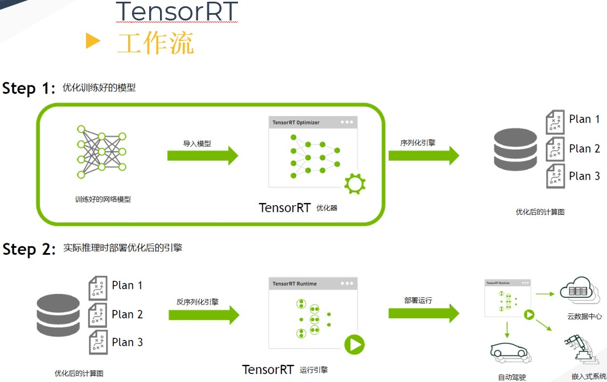

## 一，概述

`TensorRT` 是 NVIDIA 官方推出的基于 `CUDA` 和 `cudnn` 的高性能深度学习推理加速引擎，能够使深度学习模型在 `GPU` 上进行低延迟、高吞吐量的部署。采用 `C++` 开发，并提供了 `C++` 和 `Python` 的 API 接口，支持 TensorFlow、Pytorch、Caffe、Mxnet 等深度学习框架，其中 `Mxnet`、`Pytorch` 的支持需要先转换为中间模型 `ONNX` 格式。截止到 2021.4.21 日， `TensorRT` 最新版本为 `v7.2.3.4`。

延迟和吞吐量的一般解释：

+ 延迟 (`Latency`): 指执行一个操作所花的时间。
+ 吞吐量 (`Throughput`): 在单位时间内，可执行的运算次数。

## 二，模型在线部署

在做深度学习的实验的时候，比如使用 `Pytorch` 框架训练出一个模型，那么推理的时候也会直接使用 `Pytorch` 框架 `test`，但是在工业界这是不可能的，因为其推理速度很慢，所以我们必须有专门的深度学习推理加速引擎去部署训练好的模型。以 `TensorRT` 引擎为例，简单描述这个过程就是：训练好网络模型（权重参数数据类型为 `FP32`）输入 `TensorRT`，然后 `TensorRT` 做解析优化，并进行在线推理和输出结果。

所以可知，深度学习方法的应用解决方案分为两个步骤，模型离线训练和模型在线部署，具体详情如下：

1. **模型离线训练**：实时性低，数据离线且更新不频繁，`batchsize` 较大，消耗大量 GPU 资源。
    + 构建网络结构;
    + 准备数据集并进行数据预处理、`EDA` 等操作；
    + 深度学习框架训练模型：数据增强、超参数调整、优化器选择、训练策略调整（多尺度训练）、`TTA`、模型融合等；
    + 模型测试。

2. **模型在线部署**：一般先进性模型优化，然后在不同的端侧平台选择不同的推理加速引擎框架，比如 `GPU` 平台选择 `TensorRT`，手机移动端选择 `NCNN/MNN`，`NPU` 芯片平台，如海思3519、地平线X3、安霸CV22等直接在厂商给出的推理库 SDK 上运行模型。实时性要求高，数据线上且更新频繁，较小 `batchsize`，必须做相关优化。

    + **模型优化** `Optimizer`：主要指计算图优化。首先对计算图进行分析并应用一系列**与硬件无关的优化策略**，从而在逻辑上降低运行时的开销，常见的类似优化策略其包括：算子融合（`conv、bn、relu` 融合）、算子替换、常数折叠、公共子表达式消除等。
    + **模型转换** `Converter`：`Pytorch->Caffe`、`Pytorch->ONNX`（需要踩坑非常多，`Pytorch`、`ONNX`、`NPU` 三者之间的算子要注意兼容）。
    + **模型量化** `Quantizer`：主要指训练后量化（Post-training quantization `PTQ`）；权重、激活使用不同的量化位宽，如速度最快的量化方式 `w8a8`、速度和精度平衡的量化方式 `w8a16`。
    + **模型编译优化**（编译优化+`NPU` 指令生成+内存优化）**`Compiler`：模型编译针对不同的硬件平台有不同优化方法，与前面的和硬件无关的模型层面的优化不同。`GPU`平台存在 `kernel fusion` 方法；`NPU` 平台算子是通过特定二进制指令实现，其编译优化方法包括，卷积层的拆分、卷积核权重数据重排、`NPU` 算子调优等。
    + **板端推理** `Inference`：`C/C++` 实现，不同的 `NPU` 芯片有着不同的 `SDK` 库代码，但是模型运行流程类似。包括：输入图像数据预处理、加载模型文件并解析、填充输入图像和模型权重数据到相应地址、模型推理、释放模型资源。

> 不同平台的模型在线部署，比如 `NPU` 和一般 `GPU` 的区别在于后端模型编译上，`GPU` 是编译生成 `kernel library`(cuDNN 函数)，`NPU` 是编译生成二进制指令；前端的计算图优化没有本质区别，基本通用。

本文主要针对 `TensorRT` 推理加速引擎，描述其在模型部署阶段的一些优化工作，其他家的推理引擎，优化的过程和原理是类似的。目前 `TensorRT` 支持大部分主流的深度学习应用，当然最擅长的还是 `CNN`（卷积神经网络）领域，`TensorRT 3.0` 版本也开始有 `RNN` 的 `API` 接口，能够支持 `RNN` 模型的推理（`Inference`）。

### 2.1，推理和训练的不同

为了更好进行模型部署的优化工作，需要总结一下模型推理（`Inference`）和训练（`Training`）的不同：

1. 网络权重值固定，只有前向传播（`Forward`），无需反向传播，因此：
    + 模型权值和结构固定，可以做计算图优化，比如算子融合等；
    + 输入输出大小固定，可以做 `memory` 优化，比如 `feature` 重排和 `kernel` 重排。
2. `batch_size` 会很小（比如 `1`），存在 `latency` 的问题。
3. 可以使用低精度的技术，训练阶段要进行反向传播，每次梯度的更新是很微小的，需要相对较高的精度比如 `FP32` 来处理数据。但是推理阶段，对精度要求没那么高，现在很多论文都表明使用低精度如 `in16` 或者 `int8` 数据类型来做推理，也不会带来很大的精度损失。

## 三，TensorRT 工作流程

在描述 `TensorRT` 的优化原理之前，需要先了解 `TensorRT` 的工作流程。首先输入一个训练好的 `FP32` 模型文件，并通过 `parser` 等方式输入到 `TensorRT` 中做解析，解析完成后 `engin` 会进行计算图优化（优化原理在下一章）。得到优化好的 `engine` 可以序列化到内存（`buffer`）或文件（`file`），读的时候需要反序列化，将其变成 `engine`以供使用。然后在执行的时候创建 `context`，主要是分配预先的资源，`engine` 加 `context` 就可以做推理（`Inference`）。

## 四，TensorRT 的优化原理

`TensorRT` 的优化主要有以下几点：

1. **算子融合（网络层合并）**：我们知道 `GPU` 上跑的函数叫 `Kernel`，`TensorRT` 是存在 `Kernel` 调用的，频繁的 `Kernel` 调用会带来性能开销，主要体现在：数据流图的调度开销，GPU内核函数的启动开销，以及内核函数之间的数据传输开销。大多数网络中存在连续的卷积 `conv` 层、偏置 `bias` 层和 激活 `relu` 层，这三层需要调用三次 cuDNN 对应的 API，但实际上这三个算子是可以进行融合（合并）的，合并成一个 `CBR` 结构。同时目前的网络一方面越来越深，另一方面越来越宽，可能并行做若干个相同大小的卷积，这些卷积计算其实也是可以合并到一起来做的（横向融合）。比如 `GoogLeNet` 网络，把结构相同，但是权值不同的层合并成一个更宽的层。
2. `concat` 层的消除。对于 `channel` 维度的 `concat` 层，`TensorRT` 通过非拷贝方式将层输出定向到正确的内存地址来消除 `concat` 层，从而减少内存访存次数。
3. `Kernel` 可以根据不同 `batch size` 大小和问题的复杂度，去自动选择最合适的算法，`TensorRT` 预先写了很多 `GPU` 实现，有一个自动选择的过程（没找到资料理解）。其问题包括：怎么调用 `CUDA` 核心、怎么分配、每个 `block` 里面分配多少个线程、每个 `grid` 里面有多少个 `block`。

4. `FP32->FP16、INT8、INT4`：低精度量化，模型体积更小、内存占用和延迟更低等。
5. 不同的硬件如 `P4` 卡还是 `V100` 卡甚至是嵌入式设备的卡，`TensorRT` 都会做对应的优化，得到优化后的 `engine`。

## 五，参考资料

1. [内核融合：GPU深度学习的“加速神器”](https://www.msra.cn/zh-cn/news/features/kernel-fusion-20170925)
2. [高性能深度学习支持引擎实战——TensorRT](https://zhuanlan.zhihu.com/p/35657027)
3. 《NVIDIA TensorRT 以及实战记录》PPT
